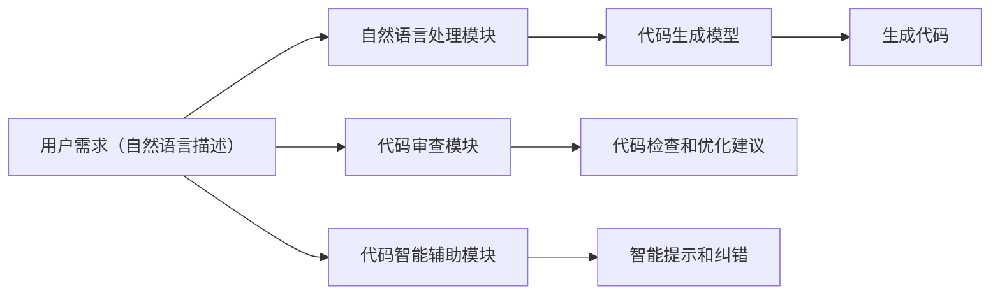

# AI技术的应用：编程的未来趋势

> 关键词：AI技术、编程、未来趋势、自动化编程、代码智能辅助、编程教育

> 摘要：本文深入探讨了AI技术在编程领域的应用以及编程的未来发展趋势。首先介绍了文章的背景，包括目的、预期读者、文档结构和相关术语。接着阐述了AI与编程相关的核心概念及联系，详细讲解了核心算法原理和具体操作步骤，并通过Python代码进行示例。还介绍了相关的数学模型和公式，并结合实际例子进行说明。在项目实战部分，给出了开发环境搭建、源代码实现和代码解读。分析了AI技术在编程中的实际应用场景，推荐了学习资源、开发工具框架和相关论文著作。最后总结了编程未来的发展趋势与挑战，提供了常见问题解答和扩展阅读参考资料，旨在帮助读者全面了解AI技术在编程领域的应用及未来走向。

## 1. 背景介绍 
### 1.1 目的和范围
本文的目的是全面分析AI技术在编程领域的应用现状和未来发展趋势。通过对相关核心概念、算法原理、实际案例等方面的深入探讨，帮助读者了解AI如何改变编程的方式和未来编程可能呈现的新形态。范围涵盖了AI在编程各个环节的应用，包括代码编写、调试、优化、编程教育等，同时探讨了相关的技术和工具，以及可能面临的挑战和机遇。

### 1.2 预期读者
本文预期读者包括程序员、软件开发者、编程爱好者、计算机专业学生以及对科技发展趋势感兴趣的人士。对于程序员和开发者，本文可以为他们提供如何利用AI技术提升编程效率和质量的思路；对于编程爱好者和学生，有助于他们了解编程领域的前沿动态，为未来的学习和职业发展做好准备；对于对科技趋势感兴趣的人士，能够让他们了解AI与编程结合所带来的变革。

### 1.3 文档结构概述
本文将按照以下结构进行阐述：首先介绍背景信息，包括目的、读者和文档结构等；接着讲解AI与编程相关的核心概念及联系，并通过示意图和流程图进行展示；然后详细说明核心算法原理和具体操作步骤，结合Python代码进行示例；之后介绍相关的数学模型和公式，并举例说明；在项目实战部分，给出开发环境搭建、源代码实现和代码解读；分析AI技术在编程中的实际应用场景；推荐学习资源、开发工具框架和相关论文著作；最后总结编程未来的发展趋势与挑战，提供常见问题解答和扩展阅读参考资料。

### 1.4 术语表
#### 1.4.1 核心术语定义
- **AI（Artificial Intelligence）**：人工智能，是一门研究如何使计算机能够模拟人类智能的学科，包括机器学习、深度学习、自然语言处理等多个领域。
- **自动化编程**：利用AI技术自动生成代码的过程，减少人工编写代码的工作量。
- **代码智能辅助**：通过AI算法为程序员在代码编写过程中提供智能提示、纠错、优化建议等功能。
- **机器学习**：是AI的一个重要分支，通过让计算机从数据中学习模式和规律，从而实现预测和决策等功能。
- **深度学习**：一种基于神经网络的机器学习方法，具有强大的特征提取和模式识别能力。

#### 1.4.2 相关概念解释
- **自然语言处理（NLP）**：使计算机能够理解和处理人类语言的技术，在编程中可用于将自然语言描述转换为代码。
- **强化学习**：一种通过智能体与环境进行交互，根据奖励信号学习最优行为策略的机器学习方法，可用于优化代码性能。
- **生成对抗网络（GAN）**：由生成器和判别器组成的神经网络，可用于生成代码样本。

#### 1.4.3 缩略词列表
- **AI**：Artificial Intelligence
- **NLP**：Natural Language Processing
- **GAN**：Generative Adversarial Network

## 2. 核心概念与联系 
### 核心概念原理
#### AI在编程中的角色
AI在编程中扮演着多种角色。它可以作为代码生成器，根据用户的需求自动生成代码。例如，当用户输入一个功能描述，AI可以利用其学习到的代码模式和知识，生成相应的代码片段。同时，AI还可以作为代码审查员，检查代码中的语法错误、逻辑漏洞和潜在的安全隐患，并提供修复建议。此外，AI还能在编程教育中发挥作用，为学习者提供个性化的学习路径和反馈。

#### 自动化编程原理
自动化编程基于机器学习和自然语言处理技术。首先，通过大量的代码数据对模型进行训练，让模型学习不同编程语言的语法、语义和常见的代码模式。当用户输入需求时，模型将需求转换为代码表示，利用训练学到的知识生成代码。例如，在Python中，对于一个简单的排序需求，模型可以根据训练数据生成使用`sort()`函数的代码。

#### 代码智能辅助原理
代码智能辅助主要依赖于代码分析和机器学习算法。它会分析当前正在编写的代码上下文，结合已有的代码库和常见的编程模式，为程序员提供智能提示。例如，当程序员输入`pr`时，代码智能辅助可能会提示`print()`函数。同时，它还可以检测代码中的错误，如拼写错误、语法错误等，并实时给出纠错建议。

### 架构的文本示意图
```plaintext
用户需求（自然语言描述） ---> 自然语言处理模块 ---> 代码生成模型 ---> 生成代码
|
|-- 代码审查模块 ---> 代码检查和优化建议
|
|-- 代码智能辅助模块 ---> 智能提示和纠错
```

### Mermaid流程图


## 3. 核心算法原理 & 具体操作步骤 
### 核心算法原理
#### 机器学习算法在代码生成中的应用
在代码生成中，常用的机器学习算法包括循环神经网络（RNN）及其变体，如长短期记忆网络（LSTM）和门控循环单元（GRU）。这些算法能够处理序列数据，适合用于处理代码的顺序结构。以LSTM为例，它通过门控机制解决了传统RNN的梯度消失问题，能够更好地捕捉代码中的长距离依赖关系。

#### 自然语言处理算法在需求理解中的应用
为了将用户的自然语言需求转换为代码，需要使用自然语言处理算法。例如，词嵌入技术将文本中的单词转换为向量表示，使得计算机能够处理和分析文本。常见的词嵌入模型有Word2Vec和GloVe。同时，还可以使用序列到序列（Seq2Seq）模型，将自然语言序列映射到代码序列。

### 具体操作步骤及Python源代码示例
#### 步骤1：数据准备
首先，需要收集大量的代码数据和对应的自然语言描述。可以从开源代码库中获取代码数据，并为其添加相应的描述。以下是一个简单的数据准备示例：
```python
# 假设我们有一些代码和对应的描述
code_samples = [
    ("print('Hello, World!')", "打印Hello, World!"),
    ("x = 5; y = 3; z = x + y", "计算5和3的和并赋值给z")
]

# 分离代码和描述
codes = [sample[0] for sample in code_samples]
descriptions = [sample[1] for sample in code_samples]
```

#### 步骤2：数据预处理
对代码和描述进行预处理，包括分词、词嵌入等操作。这里使用`nltk`库进行分词，`gensim`库进行词嵌入：
```python
import nltk
from gensim.models import Word2Vec
nltk.download('punkt')

# 分词
code_tokens = [nltk.word_tokenize(code) for code in codes]
description_tokens = [nltk.word_tokenize(desc) for desc in descriptions]

# 训练词嵌入模型
all_tokens = code_tokens + description_tokens
word2vec_model = Word2Vec(all_tokens, min_count=1)

# 将代码和描述转换为向量表示
def tokens_to_vectors(tokens):
    vectors = []
    for token in tokens:
        if token in word2vec_model.wv:
            vectors.append(word2vec_model.wv[token])
    return vectors

code_vectors = [tokens_to_vectors(tokens) for tokens in code_tokens]
description_vectors = [tokens_to_vectors(tokens) for tokens in description_tokens]
```

#### 步骤3：模型训练
使用LSTM模型进行训练，这里使用`Keras`库：
```python
from keras.models import Sequential
from keras.layers import LSTM, Dense
import numpy as np

# 调整数据形状
max_length = max([len(vecs) for vecs in code_vectors])
input_dim = len(word2vec_model.wv[word2vec_model.wv.index2word[0]])

X = []
y = []
for desc_vecs, code_vecs in zip(description_vectors, code_vectors):
    desc_vecs_padded = np.pad(np.array(desc_vecs), ((0, max_length - len(desc_vecs)), (0, 0)), mode='constant')
    code_vecs_padded = np.pad(np.array(code_vecs), ((0, max_length - len(code_vecs)), (0, 0)), mode='constant')
    X.append(desc_vecs_padded)
    y.append(code_vecs_padded)

X = np.array(X)
y = np.array(y)

# 构建LSTM模型
model = Sequential()
model.add(LSTM(128, input_shape=(max_length, input_dim)))
model.add(Dense(input_dim, activation='linear'))
model.compile(loss='mse', optimizer='adam')

# 训练模型
model.fit(X, y, epochs=10, batch_size=1)
```

#### 步骤4：代码生成
根据用户输入的自然语言描述生成代码：
```python
# 输入新的描述
new_description = "打印Hello, Python!"
new_description_tokens = nltk.word_tokenize(new_description)
new_description_vectors = tokens_to_vectors(new_description_tokens)
new_description_vectors_padded = np.pad(np.array(new_description_vectors), ((0, max_length - len(new_description_vectors)), (0, 0)), mode='constant')
new_description_vectors_padded = np.expand_dims(new_description_vectors_padded, axis=0)

# 生成代码向量
generated_code_vectors = model.predict(new_description_vectors_padded)

# 将代码向量转换为单词
generated_code_tokens = []
for vec in generated_code_vectors[0]:
    similar_word = word2vec_model.wv.similar_by_vector(vec, topn=1)[0][0]
    generated_code_tokens.append(similar_word)

generated_code = ' '.join(generated_code_tokens)
print("生成的代码:", generated_code)
```

## 4. 数学模型和公式 & 详细讲解 & 举例说明 
### 词嵌入模型的数学原理
#### Word2Vec模型
Word2Vec模型的目标是学习单词的向量表示，使得语义相似的单词在向量空间中距离相近。它主要有两种训练方式：连续词袋模型（CBOW）和跳字模型（Skip-gram）。

##### 连续词袋模型（CBOW）
CBOW模型通过上下文单词预测中心单词。假设输入的上下文单词为 $w_{c - m}, \cdots, w_{c - 1}, w_{c + 1}, \cdots, w_{c + m}$，中心单词为 $w_c$，其中 $m$ 是上下文窗口的大小。模型的输入是上下文单词的词向量之和 $\mathbf{x} = \sum_{i = -m, i \neq 0}^{m} \mathbf{v}_{w_{c + i}}$，输出是中心单词的预测概率分布。

模型的损失函数通常使用负对数似然损失：
$$
L = -\log P(w_c | \mathbf{x})
$$

##### 跳字模型（Skip-gram）
跳字模型则相反，通过中心单词预测上下文单词。对于中心单词 $w_c$，模型预测其上下文单词 $w_{c - m}, \cdots, w_{c - 1}, w_{c + 1}, \cdots, w_{c + m}$ 的概率分布。

假设上下文单词集合为 $C$，损失函数为：
$$
L = -\sum_{w \in C} \log P(w | w_c)
$$

#### 举例说明
假设我们有一个简单的句子 "The dog runs fast"，上下文窗口大小 $m = 1$。对于中心单词 "dog"，在CBOW模型中，上下文单词为 "The" 和 "runs"，模型将学习根据 "The" 和 "runs" 的词向量之和来预测 "dog"。在Skip-gram模型中，模型将根据 "dog" 的词向量来预测 "The" 和 "runs"。

### 序列到序列（Seq2Seq）模型的数学原理
Seq2Seq模型由编码器和解码器组成。编码器将输入序列编码为一个固定长度的向量表示，解码器根据这个向量表示生成输出序列。

#### 编码器
编码器通常使用RNN或其变体（如LSTM、GRU）。假设输入序列为 $\mathbf{x} = (x_1, x_2, \cdots, x_T)$，编码器的隐藏状态更新公式为：
$$
\mathbf{h}_t = f(\mathbf{h}_{t - 1}, \mathbf{x}_t)
$$
其中 $f$ 是RNN单元的更新函数，$\mathbf{h}_t$ 是时间步 $t$ 的隐藏状态。最终的隐藏状态 $\mathbf{h}_T$ 作为编码器的输出。

#### 解码器
解码器同样使用RNN，初始隐藏状态为编码器的输出 $\mathbf{h}_T$。解码器的输入是前一个时间步的输出和当前的隐藏状态，输出是当前时间步的预测。假设解码器的输入序列为 $\mathbf{y} = (y_1, y_2, \cdots, y_{T'})$，解码器的隐藏状态更新公式为：
$$
\mathbf{s}_t = f(\mathbf{s}_{t - 1}, \mathbf{y}_{t - 1})
$$
其中 $\mathbf{s}_t$ 是解码器在时间步 $t$ 的隐藏状态。解码器的输出 $\mathbf{y}_t$ 是通过一个全连接层和softmax函数得到的概率分布：
$$
\mathbf{y}_t = \text{softmax}(W \mathbf{s}_t + b)
$$

#### 损失函数
Seq2Seq模型的损失函数通常使用交叉熵损失：
$$
L = -\sum_{t = 1}^{T'} \log P(y_t | y_1, \cdots, y_{t - 1}, \mathbf{h}_T)
$$

#### 举例说明
假设我们要将英文句子 "I love programming" 翻译为中文 "我喜欢编程"。编码器将英文句子编码为一个向量，解码器根据这个向量生成中文句子。在每个时间步，解码器根据前一个时间步的输出和当前的隐藏状态预测下一个中文单词。

## 5. 项目实战：代码实际案例和详细解释说明 
### 5.1  开发环境搭建
#### 安装Python
首先，确保你已经安装了Python。可以从Python官方网站（https://www.python.org/downloads/）下载适合你操作系统的Python版本。建议使用Python 3.6及以上版本。

#### 安装必要的库
使用`pip`命令安装项目所需的库：
```sh
pip install nltk gensim keras tensorflow numpy
```

#### 下载NLTK数据
在Python中运行以下代码下载NLTK所需的数据：
```python
import nltk
nltk.download('punkt')
```

### 5.2  源代码详细实现和代码解读
#### 完整代码
```python
import nltk
from gensim.models import Word2Vec
from keras.models import Sequential
from keras.layers import LSTM, Dense
import numpy as np

# 假设我们有一些代码和对应的描述
code_samples = [
    ("print('Hello, World!')", "打印Hello, World!"),
    ("x = 5; y = 3; z = x + y", "计算5和3的和并赋值给z")
]

# 分离代码和描述
codes = [sample[0] for sample in code_samples]
descriptions = [sample[1] for sample in code_samples]

# 分词
code_tokens = [nltk.word_tokenize(code) for code in codes]
description_tokens = [nltk.word_tokenize(desc) for desc in descriptions]

# 训练词嵌入模型
all_tokens = code_tokens + description_tokens
word2vec_model = Word2Vec(all_tokens, min_count=1)

# 将代码和描述转换为向量表示
def tokens_to_vectors(tokens):
    vectors = []
    for token in tokens:
        if token in word2vec_model.wv:
            vectors.append(word2vec_model.wv[token])
    return vectors

code_vectors = [tokens_to_vectors(tokens) for tokens in code_tokens]
description_vectors = [tokens_to_vectors(tokens) for tokens in description_tokens]

# 调整数据形状
max_length = max([len(vecs) for vecs in code_vectors])
input_dim = len(word2vec_model.wv[word2vec_model.wv.index2word[0]])

X = []
y = []
for desc_vecs, code_vecs in zip(description_vectors, code_vectors):
    desc_vecs_padded = np.pad(np.array(desc_vecs), ((0, max_length - len(desc_vecs)), (0, 0)), mode='constant')
    code_vecs_padded = np.pad(np.array(code_vecs), ((0, max_length - len(code_vecs)), (0, 0)), mode='constant')
    X.append(desc_vecs_padded)
    y.append(code_vecs_padded)

X = np.array(X)
y = np.array(y)

# 构建LSTM模型
model = Sequential()
model.add(LSTM(128, input_shape=(max_length, input_dim)))
model.add(Dense(input_dim, activation='linear'))
model.compile(loss='mse', optimizer='adam')

# 训练模型
model.fit(X, y, epochs=10, batch_size=1)

# 输入新的描述
new_description = "打印Hello, Python!"
new_description_tokens = nltk.word_tokenize(new_description)
new_description_vectors = tokens_to_vectors(new_description_tokens)
new_description_vectors_padded = np.pad(np.array(new_description_vectors), ((0, max_length - len(new_description_vectors)), (0, 0)), mode='constant')
new_description_vectors_padded = np.expand_dims(new_description_vectors_padded, axis=0)

# 生成代码向量
generated_code_vectors = model.predict(new_description_vectors_padded)

# 将代码向量转换为单词
generated_code_tokens = []
for vec in generated_code_vectors[0]:
    similar_word = word2vec_model.wv.similar_by_vector(vec, topn=1)[0][0]
    generated_code_tokens.append(similar_word)

generated_code = ' '.join(generated_code_tokens)
print("生成的代码:", generated_code)
```

#### 代码解读
1. **数据准备**：定义了一些代码和对应的自然语言描述，并将它们分离为代码列表和描述列表。
2. **数据预处理**：使用`nltk`库对代码和描述进行分词，然后使用`gensim`库的`Word2Vec`模型训练词嵌入。将分词后的代码和描述转换为向量表示。
3. **数据调整**：为了使输入数据具有相同的长度，使用`np.pad`函数对向量进行填充。将填充后的数据转换为`numpy`数组。
4. **模型构建**：使用`Keras`库构建一个简单的LSTM模型，包含一个LSTM层和一个全连接层。使用均方误差损失函数和Adam优化器进行编译。
5. **模型训练**：使用训练数据对模型进行训练，设置训练轮数为10，批量大小为1。
6. **代码生成**：输入新的自然语言描述，将其分词并转换为向量表示，进行填充后输入到模型中进行预测。将预测得到的代码向量转换为单词，最终生成代码。

### 5.3  代码解读与分析
#### 优点
- **简单易懂**：代码结构清晰，使用了常见的机器学习库和方法，便于理解和学习。
- **可扩展性**：可以通过增加训练数据、调整模型结构等方式提高模型的性能。
- **灵活性**：可以根据不同的需求修改代码，例如改变输入的代码和描述，或者使用不同的模型。

#### 缺点
- **数据量有限**：示例中使用的数据量较小，可能导致模型的泛化能力不足。
- **模型复杂度**：简单的LSTM模型可能无法处理复杂的代码生成任务。
- **词向量转换问题**：将代码向量转换为单词时，可能会出现不准确的情况。

## 6. 实际应用场景 
### 自动化代码生成
在软件开发中，对于一些常见的功能模块，如数据读取、文件操作、API调用等，可以使用AI技术自动生成代码。例如，在Python中，根据用户的需求自动生成使用`pandas`库读取CSV文件的代码。这可以大大提高开发效率，减少重复劳动。

### 代码智能辅助
现代的集成开发环境（IDE）中已经开始集成代码智能辅助功能。当程序员编写代码时，智能辅助可以提供代码提示、自动补全、错误检查等功能。例如，在编写Java代码时，IDE可以根据上下文提示类名、方法名和变量名，帮助程序员更快地完成代码编写。

### 编程教育
AI可以为编程教育提供个性化的学习体验。通过分析学生的学习进度和错误情况，AI可以为学生提供定制化的学习路径和练习题。例如，当学生在学习Python的循环结构时，AI可以根据学生的掌握情况提供不同难度的循环练习题，并给予实时反馈和指导。

### 代码优化
AI可以分析代码的性能瓶颈，并提供优化建议。例如，在处理大数据集时，AI可以检测到代码中使用的低效算法，并建议使用更高效的算法进行替换。同时，AI还可以优化代码的内存使用和运行速度。

### 代码审查
在团队开发中，AI可以作为代码审查员，检查代码的质量和规范性。它可以检测代码中的语法错误、逻辑漏洞、潜在的安全隐患等，并生成详细的审查报告。这有助于提高代码的整体质量，减少开发过程中的错误。

## 7. 工具和资源推荐
### 7.1 学习资源推荐
#### 7.1.1 书籍推荐
- 《Python机器学习》：全面介绍了Python在机器学习领域的应用，包括各种机器学习算法的原理和实现。
- 《深度学习》：由深度学习领域的三位权威专家撰写，系统地介绍了深度学习的理论和实践。
- 《自然语言处理入门》：适合初学者学习自然语言处理的基础知识和常用技术。

#### 7.1.2 在线课程
- Coursera上的“机器学习”课程：由斯坦福大学教授Andrew Ng主讲，是机器学习领域的经典课程。
- edX上的“深度学习微硕士项目”：提供了深度学习的系统学习路径，包括多个课程和实践项目。
- 中国大学MOOC上的“Python语言程序设计”：适合初学者学习Python编程。

#### 7.1.3 技术博客和网站
- Medium：上面有很多关于AI和编程的优质文章，涵盖了最新的技术趋势和实践经验。
- 机器之心：专注于人工智能领域的资讯和技术分享，提供了丰富的技术文章和研究报告。
- 开源中国：国内知名的开源技术社区，有很多关于编程和AI的技术文章和项目分享。

### 7.2 开发工具框架推荐
#### 7.2.1 IDE和编辑器
- PyCharm：专门为Python开发设计的集成开发环境，具有强大的代码编辑、调试和智能提示功能。
- Visual Studio Code：一款轻量级的代码编辑器，支持多种编程语言，有丰富的插件生态系统。
- Jupyter Notebook：适合进行数据探索和机器学习实验，支持交互式编程。

#### 7.2.2 调试和性能分析工具
- PDB：Python自带的调试器，可以帮助开发者定位代码中的错误。
- cProfile：Python的性能分析工具，可以分析代码的运行时间和函数调用情况。
- TensorBoard：TensorFlow的可视化工具，用于可视化模型的训练过程和性能指标。

#### 7.2.3 相关框架和库
- TensorFlow：Google开发的开源深度学习框架，具有广泛的应用和丰富的文档资源。
- PyTorch：Facebook开发的深度学习框架，以其简洁的API和动态图特性受到开发者的喜爱。
- Scikit-learn：Python的机器学习库，提供了各种机器学习算法和工具，方便快速开发和实验。

### 7.3 相关论文著作推荐
#### 7.3.1 经典论文
- 《Learning Representations by Back-propagating Errors》：介绍了反向传播算法，是神经网络领域的经典论文。
- 《ImageNet Classification with Deep Convolutional Neural Networks》：提出了AlexNet模型，开启了深度学习在计算机视觉领域的热潮。
- 《Attention Is All You Need》：提出了Transformer模型，在自然语言处理领域取得了巨大成功。

#### 7.3.2 最新研究成果
- 在arXiv上可以找到很多关于AI和编程的最新研究论文，涵盖了代码生成、代码理解、编程教育等多个领域。
- 顶级学术会议如NeurIPS、ICML、ACL等也会发布很多最新的研究成果。

#### 7.3.3 应用案例分析
- 《AI in Software Engineering》：介绍了AI在软件工程中的各种应用案例，包括代码生成、代码审查、软件测试等。
- 《Practical AI for Developers》：提供了开发者如何应用AI技术解决实际问题的案例和实践经验。

## 8. 总结：未来发展趋势与挑战
### 未来发展趋势
#### 更强大的自动化编程
未来，AI将能够处理更复杂的编程任务，生成高质量的代码。自动化编程将不仅仅局限于简单的代码片段生成，还能够完成整个软件系统的开发。例如，根据用户的业务需求，自动生成一个完整的Web应用程序。

#### 个性化编程体验
AI将为程序员提供更加个性化的编程体验。根据程序员的编程习惯、技能水平和项目需求，智能辅助系统将提供定制化的代码提示、优化建议和学习资源。例如，对于新手程序员，系统会提供更多的基础教程和简单的代码示例；对于有经验的程序员，系统会提供更高级的代码优化方案。

#### 跨语言和跨平台编程
随着AI技术的发展，它将能够更好地处理不同编程语言和平台之间的差异。程序员可以使用自然语言描述需求，AI自动生成适用于多种语言和平台的代码。例如，用户可以描述一个数据处理任务，AI可以同时生成Python和Java的代码实现。

#### 编程教育的变革
AI将彻底改变编程教育的方式。个性化的学习路径、智能辅导和实时反馈将使编程学习更加高效和有趣。同时，AI还可以模拟各种编程场景，让学生在实践中学习编程。例如，学生可以在虚拟环境中进行软件开发项目，AI作为导师提供指导和帮助。

### 挑战
#### 数据质量和隐私问题
AI技术的发展依赖于大量的数据，但数据的质量和隐私问题是一个挑战。在代码生成和分析中，需要使用大量的代码数据，但这些数据可能包含敏感信息，如商业机密和用户隐私。因此，如何保证数据的质量和安全性是一个重要的问题。

#### 模型可解释性
深度学习模型通常是黑盒模型，难以解释其决策过程。在编程中，这可能会导致一些问题，例如无法理解生成代码的原理和逻辑。因此，提高模型的可解释性是一个亟待解决的问题。

#### 人类与AI的协作
虽然AI可以提高编程效率，但人类程序员的创造力和判断力仍然是不可替代的。如何实现人类与AI的有效协作，发挥各自的优势，是未来编程发展需要解决的问题。例如，在代码审查和设计阶段，如何让AI的建议与人类的判断相结合。

#### 伦理和法律问题
随着AI在编程中的广泛应用，伦理和法律问题也日益凸显。例如，代码生成的版权归属问题、AI生成的代码是否符合法律规定等。需要建立相应的伦理和法律框架来规范AI在编程领域的应用。

## 9. 附录：常见问题与解答
### 问题1：AI生成的代码质量如何保证？
解答：可以通过以下几种方式保证AI生成代码的质量。首先，使用大量高质量的代码数据进行模型训练，让模型学习到正确的编程模式和规范。其次，在代码生成后，使用代码审查工具和人工审查相结合的方式对代码进行检查，发现并修复潜在的问题。此外，还可以通过设置质量评估指标，对生成的代码进行评估和筛选。

### 问题2：AI是否会取代程序员？
解答：目前来看，AI不会完全取代程序员。虽然AI可以自动生成代码和提供智能辅助，但人类程序员的创造力、逻辑思维和解决复杂问题的能力是AI无法替代的。AI更多的是作为程序员的工具，帮助他们提高编程效率和质量。未来，程序员需要与AI协作，共同完成软件开发任务。

### 问题3：如何选择适合的AI编程工具和框架？
解答：选择适合的AI编程工具和框架需要考虑多个因素。首先，要根据自己的需求和项目特点来选择。如果是进行深度学习项目，TensorFlow和PyTorch是不错的选择；如果是进行机器学习实验，Scikit-learn更合适。其次，要考虑工具和框架的易用性、性能和社区支持。选择一个易用且有丰富文档和社区资源的工具和框架，可以提高开发效率。

### 问题4：AI在编程教育中的应用有哪些局限性？
解答：AI在编程教育中的应用存在一些局限性。首先，AI可能无法完全理解学生的个性化需求和学习困难，提供的学习路径和反馈可能不够精准。其次，AI生成的示例代码可能缺乏实际应用场景的上下文，学生难以理解代码的实际用途。此外，AI无法替代教师的面对面指导和互动，对于一些复杂的编程概念和问题，学生可能需要教师的帮助才能理解。

## 10. 扩展阅读 & 参考资料
### 扩展阅读
- 《AI 3.0》：深入探讨了人工智能的发展现状和未来趋势，包括AI在各个领域的应用和面临的挑战。
- 《智能时代》：介绍了人工智能如何改变我们的生活和工作方式，以及对未来社会的影响。
- 《Python深度学习实战》：通过实际项目案例，介绍了Python在深度学习领域的应用和实践技巧。

### 参考资料
- 相关学术论文和研究报告：如arXiv上的论文、顶级学术会议的会议论文等。
- 开源代码库：如GitHub上的开源项目，可参考其中的代码实现和应用案例。
- 官方文档：如TensorFlow、PyTorch等框架的官方文档，提供了详细的使用说明和示例代码。