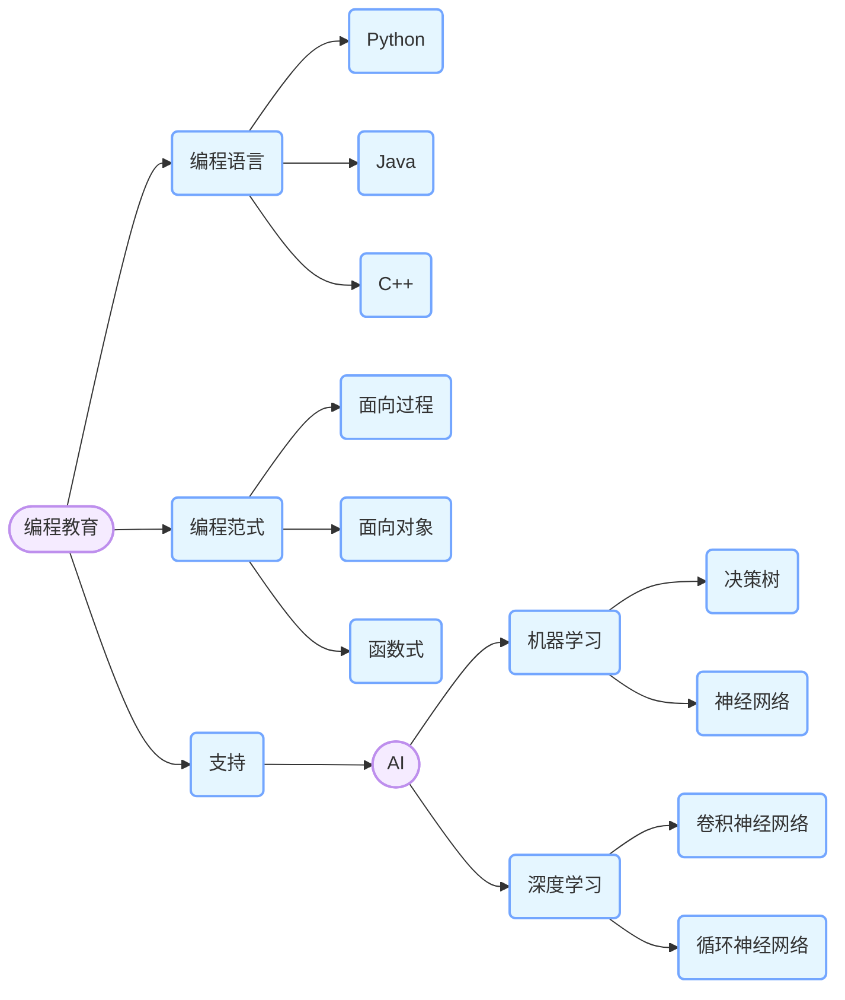

# AI时代下的编程教育与培训策略

> 关键词：AI时代、编程教育、培训策略、教育创新、人才培养

> 摘要：随着AI时代的来临，编程技能的重要性愈发凸显。本文深入探讨了AI时代下编程教育与培训的相关问题，首先介绍了研究的背景、目的、预期读者等信息。接着阐述了编程教育与AI的核心概念及联系，详细讲解了编程教育中涉及的核心算法原理与具体操作步骤，包括使用Python代码进行说明。分析了编程教育相关的数学模型和公式。通过项目实战展示了代码的实际应用和详细解读。探讨了编程教育在实际场景中的应用，推荐了相关的学习资源、开发工具框架和论文著作。最后总结了未来编程教育的发展趋势与挑战，并对常见问题进行了解答，还提供了扩展阅读和参考资料，旨在为AI时代的编程教育与培训提供全面且有深度的策略参考。

## 1. 背景介绍 
### 1.1 目的和范围
在当今AI时代，编程能力已经成为一项关键技能，对于个人的职业发展和社会的科技进步都具有重要意义。本文的目的在于探讨如何在AI时代有效地开展编程教育与培训，提出切实可行的策略。范围涵盖了从编程教育的基础概念到具体的教学方法、实践案例，以及相关的工具和资源推荐等方面。通过全面的分析，为教育机构、教师、学生和从业者提供有价值的参考。

### 1.2 预期读者
本文的预期读者包括各类编程教育机构的管理人员和教师，他们可以从中获取教学策略和课程设计的灵感；在校学生，无论是中小学生还是大学生，能够了解如何更好地学习编程；企业中的技术培训人员，可借鉴相关方法提升员工的编程技能；对编程教育感兴趣的研究者，为其提供研究思路和数据支持。

### 1.3 文档结构概述
本文首先介绍编程教育在AI时代的背景信息，包括目的、读者群体和文档结构。接着阐述编程教育与AI的核心概念及它们之间的联系，通过示意图和流程图进行直观展示。然后详细讲解编程教育中涉及的核心算法原理和具体操作步骤，结合Python代码进行说明。分析编程教育相关的数学模型和公式，并举例说明。通过项目实战展示代码的实际应用和详细解读。探讨编程教育在实际场景中的应用。推荐相关的学习资源、开发工具框架和论文著作。最后总结未来编程教育的发展趋势与挑战，解答常见问题，并提供扩展阅读和参考资料。

### 1.4 术语表
#### 1.4.1 核心术语定义
- **编程教育**：是指教授学生如何使用编程语言进行程序设计和开发的教育活动，旨在培养学生的计算思维和解决问题的能力。
- **AI（人工智能）**：是一门研究如何使计算机能够模拟人类智能的学科，包括机器学习、深度学习、自然语言处理等多个领域。
- **计算思维**：是运用计算机科学的基础概念进行问题求解、系统设计以及人类行为理解等涵盖计算机科学之广度的一系列思维活动。

#### 1.4.2 相关概念解释
- **编程范式**：是指编程的基本风格和方法，常见的编程范式有面向过程编程、面向对象编程、函数式编程等。不同的编程范式适用于不同的应用场景和问题类型。
- **机器学习算法**：是AI领域中的一类算法，通过对数据的学习和分析，让计算机自动发现数据中的模式和规律，从而实现预测和决策等功能。常见的机器学习算法有决策树、神经网络、支持向量机等。

#### 1.4.3 缩略词列表
- **AI**：Artificial Intelligence（人工智能）
- **ML**：Machine Learning（机器学习）
- **DL**：Deep Learning（深度学习）
- **OOP**：Object-Oriented Programming（面向对象编程）

## 2. 核心概念与联系 

### 编程教育与AI的核心概念
编程教育的核心在于教授学生如何使用编程语言来实现特定的功能和解决问题。编程语言是人与计算机沟通的桥梁，通过编写代码，我们可以让计算机按照我们的意愿执行各种任务。常见的编程语言有Python、Java、C++等，每种语言都有其特点和适用场景。

AI则是让计算机具备人类智能的能力，能够感知、理解、学习和决策。它主要通过机器学习和深度学习等技术来实现，这些技术需要大量的数据和复杂的算法。例如，在图像识别领域，AI系统可以通过对大量图像数据的学习，识别出图像中的物体。

### 编程教育与AI的联系
编程教育是实现AI的基础。要开发AI系统，必须掌握编程技能，使用编程语言来实现各种算法和模型。同时，AI的发展也为编程教育带来了新的机遇和挑战。AI技术可以应用于编程教育中，例如智能辅导系统可以根据学生的学习情况提供个性化的学习建议。

### 文本示意图
```plaintext
编程教育
    |
    |-- 编程语言（Python、Java、C++等）
    |-- 编程范式（面向过程、面向对象、函数式等）
    |
    | 支持
    |
AI
    |
    |-- 机器学习（决策树、神经网络等）
    |-- 深度学习（卷积神经网络、循环神经网络等）
```

### Mermaid流程图


## 3. 核心算法原理 & 具体操作步骤 

### 核心算法原理：以线性回归为例
线性回归是机器学习中最基础的算法之一，用于建立自变量和因变量之间的线性关系。其基本原理是通过最小化预测值与实际值之间的误差平方和，找到最佳的回归系数。

### Python代码实现
```python
import numpy as np
import matplotlib.pyplot as plt

# 生成一些示例数据
x = np.array([1, 2, 3, 4, 5])
y = np.array([2, 4, 6, 8, 10])

# 计算回归系数
n = len(x)
x_mean = np.mean(x)
y_mean = np.mean(y)
numerator = np.sum((x - x_mean) * (y - y_mean))
denominator = np.sum((x - x_mean) ** 2)
b1 = numerator / denominator
b0 = y_mean - b1 * x_mean

# 预测新的数据点
new_x = 6
predicted_y = b0 + b1 * new_x
print(f"当 x = {new_x} 时，预测的 y 值为: {predicted_y}")

# 绘制数据点和回归直线
plt.scatter(x, y, color='blue')
plt.plot(x, b0 + b1 * x, color='red')
plt.xlabel('x')
plt.ylabel('y')
plt.title('线性回归示例')
plt.show()
```

### 具体操作步骤
1. **数据准备**：收集自变量和因变量的数据，并将其存储在合适的数据结构中，如NumPy数组。
2. **计算回归系数**：根据线性回归的公式，计算斜率 $b_1$ 和截距 $b_0$。
3. **预测新的数据点**：使用计算得到的回归系数，对新的自变量值进行预测。
4. **可视化结果**：使用Matplotlib库将数据点和回归直线绘制出来，直观展示线性回归的效果。

## 4. 数学模型和公式 & 详细讲解 & 举例说明 

### 线性回归的数学模型和公式
线性回归的数学模型可以表示为：
$$y = b_0 + b_1x + \epsilon$$
其中，$y$ 是因变量，$x$ 是自变量，$b_0$ 是截距，$b_1$ 是斜率，$\epsilon$ 是误差项。

为了找到最佳的回归系数 $b_0$ 和 $b_1$，我们需要最小化误差平方和：
$$SSE = \sum_{i=1}^{n}(y_i - \hat{y}_i)^2$$
其中，$y_i$ 是实际值，$\hat{y}_i$ 是预测值。

通过求偏导数并令其为零，可以得到回归系数的计算公式：
$$b_1 = \frac{\sum_{i=1}^{n}(x_i - \bar{x})(y_i - \bar{y})}{\sum_{i=1}^{n}(x_i - \bar{x})^2}$$
$$b_0 = \bar{y} - b_1\bar{x}$$
其中，$\bar{x}$ 和 $\bar{y}$ 分别是自变量和因变量的均值。

### 详细讲解
线性回归的目标是找到一条直线，使得所有数据点到该直线的垂直距离的平方和最小。误差平方和（SSE）是衡量直线拟合效果的指标，SSE越小，说明直线拟合得越好。

通过求解回归系数的公式，我们可以得到最佳的直线参数。斜率 $b_1$ 表示自变量 $x$ 每增加一个单位，因变量 $y$ 的平均变化量；截距 $b_0$ 表示当 $x = 0$ 时，$y$ 的预测值。

### 举例说明
假设我们有以下数据：
| $x$ | $y$ |
| --- | --- |
| 1 | 2 |
| 2 | 4 |
| 3 | 6 |
| 4 | 8 |
| 5 | 10 |

首先，计算均值：
$\bar{x} = \frac{1 + 2 + 3 + 4 + 5}{5} = 3$
$\bar{y} = \frac{2 + 4 + 6 + 8 + 10}{5} = 6$

然后，计算分子和分母：
$\sum_{i=1}^{5}(x_i - \bar{x})(y_i - \bar{y}) = (1 - 3)(2 - 6) + (2 - 3)(4 - 6) + (3 - 3)(6 - 6) + (4 - 3)(8 - 6) + (5 - 3)(10 - 6) = 20$
$\sum_{i=1}^{5}(x_i - \bar{x})^2 = (1 - 3)^2 + (2 - 3)^2 + (3 - 3)^2 + (4 - 3)^2 + (5 - 3)^2 = 10$

最后，计算回归系数：
$b_1 = \frac{20}{10} = 2$
$b_0 = 6 - 2 \times 3 = 0$

所以，回归方程为 $y = 2x$。当 $x = 6$ 时，预测的 $y$ 值为 $y = 2 \times 6 = 12$。

## 5. 项目实战：代码实际案例和详细解释说明 

### 5.1  开发环境搭建
#### 安装Python
首先，从Python官方网站（https://www.python.org/downloads/）下载适合你操作系统的Python安装包，并按照安装向导进行安装。安装完成后，在命令行中输入 `python --version` 验证Python是否安装成功。

#### 安装开发工具
推荐使用PyCharm作为开发工具，它是一款功能强大的Python集成开发环境（IDE）。从JetBrains官方网站（https://www.jetbrains.com/pycharm/download/）下载并安装PyCharm社区版或专业版。

#### 安装必要的库
在命令行中使用以下命令安装NumPy和Matplotlib库：
```sh
pip install numpy matplotlib
```

### 5.2  源代码详细实现和代码解读
以下是一个使用Python实现简单图像识别的项目示例：

```python
import numpy as np
from sklearn.datasets import load_digits
from sklearn.model_selection import train_test_split
from sklearn.svm import SVC
from sklearn.metrics import accuracy_score

# 加载手写数字数据集
digits = load_digits()
X = digits.data
y = digits.target

# 划分训练集和测试集
X_train, X_test, y_train, y_test = train_test_split(X, y, test_size=0.2, random_state=42)

# 创建支持向量机分类器
clf = SVC()

# 训练模型
clf.fit(X_train, y_train)

# 预测测试集
y_pred = clf.predict(X_test)

# 计算准确率
accuracy = accuracy_score(y_test, y_pred)
print(f"模型的准确率为: {accuracy}")
```

### 代码解读与分析
1. **数据加载**：使用 `load_digits` 函数从 `sklearn.datasets` 中加载手写数字数据集。该数据集包含1797个手写数字图像，每个图像是一个8x8的像素矩阵。
2. **数据划分**：使用 `train_test_split` 函数将数据集划分为训练集和测试集，其中测试集占总数据的20%。
3. **模型创建**：创建一个支持向量机（SVM）分类器 `clf`。
4. **模型训练**：使用训练集数据对模型进行训练，调用 `fit` 方法。
5. **模型预测**：使用训练好的模型对测试集数据进行预测，调用 `predict` 方法。
6. **准确率计算**：使用 `accuracy_score` 函数计算模型在测试集上的准确率。

通过这个项目，我们可以看到如何使用Python和机器学习库进行简单的图像识别任务。

## 6. 实际应用场景 
### 教育领域
在学校教育中，编程教育可以培养学生的逻辑思维和创新能力。例如，在中小学阶段，可以通过Scratch等可视化编程工具，让学生轻松入门编程。在大学阶段，编程课程可以为计算机科学、数据科学等专业的学生提供专业的技能培训。

### 企业领域
企业需要大量的编程人才来开发软件、网站和应用程序。编程教育可以为企业提供符合需求的人才。例如，互联网企业需要前端开发工程师、后端开发工程师和数据分析师等，这些岗位都需要具备编程技能。

### 科研领域
在科研领域，编程是进行数据处理、模型建立和实验模拟的重要工具。例如，在物理学、生物学等领域，研究人员可以使用Python等编程语言进行数据分析和模拟实验。

### 日常生活领域
编程也逐渐融入了日常生活。例如，智能家居系统可以通过编程实现自动化控制；手机应用程序可以为用户提供各种便捷的服务。

## 7. 工具和资源推荐
### 7.1 学习资源推荐
#### 7.1.1 书籍推荐
- 《Python编程：从入门到实践》：这本书适合初学者，通过大量的实例和项目，帮助读者快速掌握Python编程的基础知识和应用。
- 《机器学习实战》：介绍了机器学习的基本算法和实际应用，通过Python代码实现，让读者深入理解机器学习的原理和实现方法。
- 《深度学习》：由深度学习领域的三位先驱Ian Goodfellow、Yoshua Bengio和Aaron Courville撰写，是深度学习领域的经典教材。

#### 7.1.2 在线课程
- Coursera：提供了丰富的编程和AI相关课程，如吴恩达的《机器学习》课程，是学习机器学习的经典课程。
- edX：与全球顶尖高校和机构合作，提供高质量的在线课程，包括编程、数据科学、人工智能等领域。
- 中国大学MOOC：国内知名的在线课程平台，有许多高校的编程和计算机科学相关课程可供学习。

#### 7.1.3 技术博客和网站
- 博客园：国内知名的技术博客平台，有许多编程和技术相关的文章，涵盖了各种编程语言和技术领域。
- 掘金：专注于前端、后端、移动端等技术领域的技术社区，提供了丰富的技术文章和案例。
- Stack Overflow：全球最大的技术问答社区，当你在编程过程中遇到问题时，可以在这里找到解决方案。

### 7.2 开发工具框架推荐
#### 7.2.1 IDE和编辑器
- PyCharm：功能强大的Python集成开发环境，提供了代码编辑、调试、代码分析等功能，适合专业的Python开发人员。
- Visual Studio Code：一款轻量级的代码编辑器，支持多种编程语言，拥有丰富的插件生态系统，可以根据需要进行扩展。
- Jupyter Notebook：交互式的编程环境，适合数据科学和机器学习领域的开发和实验，方便代码的编写、运行和展示。

#### 7.2.2 调试和性能分析工具
- pdb：Python自带的调试器，可以在代码中设置断点，逐步执行代码，查看变量的值和程序的执行流程。
- cProfile：Python的性能分析工具，可以统计程序中各个函数的执行时间和调用次数，帮助开发者找出性能瓶颈。
- TensorBoard：TensorFlow的可视化工具，用于可视化深度学习模型的训练过程和结果，如损失函数、准确率等指标的变化曲线。

#### 7.2.3 相关框架和库
- TensorFlow：Google开发的深度学习框架，提供了丰富的深度学习模型和工具，支持分布式训练和多平台部署。
- PyTorch：Facebook开发的深度学习框架，以其动态图机制和简洁的API受到广泛关注，适合科研和快速迭代开发。
- Django：Python的Web开发框架，提供了高效的开发工具和丰富的插件，适合开发大型的Web应用程序。

### 7.3 相关论文著作推荐
#### 7.3.1 经典论文
- 《Gradient-Based Learning Applied to Document Recognition》：LeCun等人发表的关于卷积神经网络（CNN）的经典论文，奠定了CNN在图像识别领域的基础。
- 《Learning Representations by Back-propagating Errors》：Rumelhart等人发表的关于反向传播算法的论文，是神经网络发展的重要里程碑。
- 《Attention Is All You Need》：Vaswani等人发表的关于Transformer模型的论文，提出了注意力机制，在自然语言处理领域取得了巨大成功。

#### 7.3.2 最新研究成果
- arXiv：一个预印本平台，汇集了计算机科学、物理学等领域的最新研究成果，你可以在上面找到关于编程教育和AI的最新研究论文。
- NeurIPS（神经信息处理系统大会）：机器学习和人工智能领域的顶级学术会议，每年都会发表大量的最新研究成果。

#### 7.3.3 应用案例分析
- 《Hands-On Machine Learning with Scikit-Learn, Keras, and TensorFlow》：通过实际案例介绍了如何使用Scikit-Learn、Keras和TensorFlow进行机器学习和深度学习的开发，提供了丰富的代码示例和应用场景。
- 《Python for Data Analysis》：介绍了如何使用Python进行数据分析和处理，通过实际案例展示了Pandas、NumPy等库的使用方法。

## 8. 总结：未来发展趋势与挑战
### 未来发展趋势
- **个性化教育**：随着AI技术的发展，编程教育将越来越注重个性化。智能辅导系统可以根据学生的学习进度、兴趣爱好和学习能力，提供个性化的学习内容和建议，提高学习效果。
- **跨学科融合**：编程教育将与其他学科更加紧密地融合，如数学、物理、生物等。通过跨学科的项目和实践，培养学生的综合能力和创新思维。
- **在线教育的普及**：在线教育将继续发展，打破时间和空间的限制，让更多的人有机会接受编程教育。同时，虚拟现实（VR）和增强现实（AR）技术可能会应用于编程教育中，提供更加沉浸式的学习体验。
- **编程教育的普及化**：编程将成为基础教育的重要组成部分，从小学到高中都将逐步普及编程教育。这将培养更多具有编程素养的人才，推动社会的科技进步。

### 挑战
- **师资短缺**：目前，编程教育领域的专业教师数量不足，特别是具备AI和编程教育双重背景的教师更是稀缺。这将影响编程教育的质量和普及程度。
- **课程体系不完善**：编程教育的课程体系还不够完善，缺乏统一的标准和规范。不同的教育机构和学校的课程设置差异较大，导致学生的学习效果参差不齐。
- **技术更新换代快**：编程和AI技术发展迅速，新的编程语言、框架和算法不断涌现。这要求教育机构和教师不断更新知识和技能，以跟上技术的发展步伐。
- **教育资源不均衡**：在一些地区，由于经济和技术条件的限制，缺乏优质的编程教育资源。这将导致教育资源的不均衡，影响这些地区学生的编程学习机会。

## 9. 附录：常见问题与解答
### 问题1：编程教育适合所有年龄段的学生吗？
答：是的，编程教育可以根据不同年龄段的学生特点进行设计。对于低年龄段的学生，可以通过可视化编程工具，如Scratch，让他们在游戏和互动中学习编程的基本概念。对于高年龄段的学生，可以学习更复杂的编程语言和算法。

### 问题2：学习编程需要具备很高的数学基础吗？
答：学习编程并不一定需要很高的数学基础。对于初学者来说，掌握基本的数学知识，如四则运算、逻辑判断等就可以开始学习编程。随着学习的深入，在涉及到机器学习、数据分析等领域时，可能需要更深入的数学知识。

### 问题3：如何选择适合自己的编程语言？
答：选择编程语言要根据自己的学习目标和应用场景。如果是初学者，建议选择Python，它语法简单，易于学习，并且有丰富的库和框架。如果想从事Web开发，可以学习JavaScript、Python（结合Django或Flask框架）、Java等。如果想从事游戏开发，可以学习C++、C#等。

### 问题4：编程教育对就业有帮助吗？
答：编程教育对就业有很大的帮助。在当今数字化时代，各行各业都需要具备编程技能的人才。掌握编程技能可以让你在就业市场上更具竞争力，有更多的职业选择，如软件开发工程师、数据分析师、人工智能工程师等。

## 10. 扩展阅读 & 参考资料
### 扩展阅读
- 《代码大全》：这本书涵盖了软件开发的各个方面，包括编程实践、代码设计、项目管理等，是软件开发领域的经典著作。
- 《算法导论》：由Thomas H. Cormen等人撰写，是算法领域的权威教材，介绍了各种经典算法的原理和实现。
- 《人工智能：现代方法》：全面介绍了人工智能的各个领域，包括搜索算法、知识表示、机器学习、自然语言处理等，是学习人工智能的重要参考书籍。

### 参考资料
- 各编程语言的官方文档，如Python官方文档（https://docs.python.org/）、Java官方文档（https://docs.oracle.com/javase/）等。
- 各机器学习和深度学习框架的官方文档，如TensorFlow官方文档（https://www.tensorflow.org/api_docs）、PyTorch官方文档（https://pytorch.org/docs/stable/）等。
- 相关的学术期刊和会议论文，如Journal of Artificial Intelligence Research（JAIR）、ACM SIGKDD Conference on Knowledge Discovery and Data Mining等。