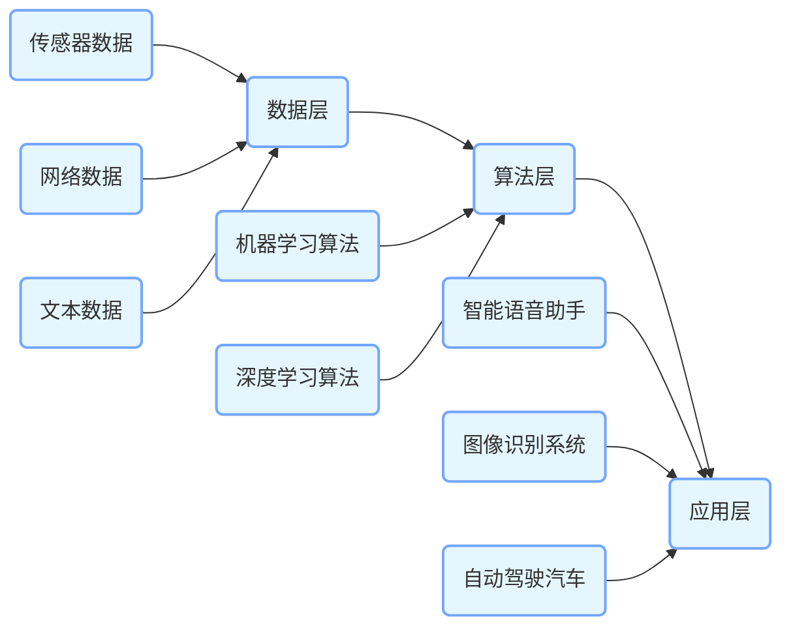

# AI时代的技术人才：新角色与新挑战

> 关键词：AI时代、技术人才、新角色、新挑战、技能需求、职业发展

> 摘要：随着人工智能（AI）技术的飞速发展，AI时代已然来临。在这个时代，技术人才面临着全新的角色和挑战。本文旨在深入探讨AI时代技术人才所扮演的新角色，分析他们面临的新挑战，详细阐述相关核心概念、算法原理、数学模型等内容，并通过项目实战案例进行说明。同时，介绍AI技术在实际中的应用场景，推荐相关的学习工具、资源和论文著作，最后对AI时代技术人才的未来发展趋势与挑战进行总结，并提供常见问题解答和扩展阅读参考资料，为技术人才在AI时代的职业发展提供全面的指导。

## 1. 背景介绍 
### 1.1 目的和范围
在AI时代，技术人才的角色和能力要求发生了巨大的变化。本文的目的是全面剖析这些变化，明确技术人才在新环境下的新角色和新挑战。范围涵盖了AI相关的核心概念、算法原理、数学模型、项目实战、应用场景等多个方面，旨在为技术人才提供一个系统的认知框架，帮助他们更好地适应AI时代的发展。

### 1.2 预期读者
本文预期读者主要包括正在从事或希望进入AI领域的技术人员，如程序员、软件工程师、数据分析师等。同时，对于企业的技术管理者、人力资源专家以及对AI技术发展感兴趣的人士也具有一定的参考价值。

### 1.3 文档结构概述
本文将按照以下结构展开：首先介绍核心概念与联系，让读者对AI时代的关键概念有清晰的认识；接着阐述核心算法原理和具体操作步骤，并结合Python代码进行详细说明；然后讲解数学模型和公式，通过举例加深理解；之后通过项目实战案例，展示代码的实际应用和详细解读；再介绍AI技术的实际应用场景；推荐相关的工具和资源；最后总结未来发展趋势与挑战，提供常见问题解答和扩展阅读参考资料。

### 1.4 术语表
#### 1.4.1 核心术语定义
- **人工智能（AI）**：是一门研究如何使计算机能够模拟人类智能的学科和技术领域，包括机器学习、深度学习、自然语言处理、计算机视觉等多个分支。
- **机器学习（ML）**：是人工智能的一个重要分支，它让计算机通过数据学习模式和规律，从而进行预测和决策，而无需明确的编程指令。
- **深度学习（DL）**：是机器学习的一个子领域，基于人工神经网络，特别是深度神经网络，能够自动从大量数据中学习复杂的模式和特征。
- **数据科学家**：是指能够运用统计学、数学、计算机科学等知识，对大量数据进行采集、处理、分析和解释，以提取有价值信息和知识的专业人员。
- **AI工程师**：负责开发和实现人工智能系统，包括算法设计、模型训练、系统集成等工作。

#### 1.4.2 相关概念解释
- **神经网络**：是一种模仿人类神经系统的计算模型，由大量的神经元组成，可以自动学习数据中的模式和特征。
- **监督学习**：是机器学习的一种方法，训练数据包含输入特征和对应的标签，模型通过学习输入和标签之间的关系进行预测。
- **无监督学习**：训练数据只包含输入特征，没有对应的标签，模型通过发现数据中的内在结构和模式进行学习。
- **强化学习**：智能体通过与环境进行交互，根据环境反馈的奖励信号来学习最优的行为策略。

#### 1.4.3 缩略词列表
- **AI**：Artificial Intelligence（人工智能）
- **ML**：Machine Learning（机器学习）
- **DL**：Deep Learning（深度学习）
- **NLP**：Natural Language Processing（自然语言处理）
- **CV**：Computer Vision（计算机视觉）

## 2. 核心概念与联系 

### 核心概念原理
在AI时代，几个核心概念构成了技术体系的基础，下面分别详细阐述：

#### 人工智能（AI）
人工智能是一门综合性的学科，旨在让计算机模拟人类的智能行为，如感知、学习、推理、决策等。其实现方式有多种，早期主要基于规则的系统，通过预定义的规则和逻辑来处理问题。但随着数据量的爆炸式增长和计算能力的提升，机器学习和深度学习成为了实现人工智能的主流方法。

#### 机器学习（ML）
机器学习是人工智能的重要分支，它基于数据和统计方法，让计算机自动从数据中学习模式和规律。其基本流程是：首先收集大量的数据，然后对数据进行预处理，包括清洗、特征提取等操作；接着选择合适的模型进行训练，训练过程中通过优化算法不断调整模型的参数，使模型的预测结果与真实结果尽可能接近；最后使用训练好的模型对新的数据进行预测和分类。

#### 深度学习（DL）
深度学习是机器学习的一个子领域，它基于深度神经网络。深度神经网络由多个层次的神经元组成，能够自动从大量数据中学习复杂的模式和特征。深度学习在图像识别、语音识别、自然语言处理等领域取得了巨大的成功，其主要原因在于它能够处理高维度、复杂的数据，并且具有很强的表达能力。

### 架构的文本示意图
AI时代的技术架构可以看作是一个分层的结构，底层是数据层，包括各种数据源，如传感器数据、网络数据、文本数据等；中间层是算法层，包括机器学习和深度学习算法，如决策树、支持向量机、卷积神经网络（CNN）、循环神经网络（RNN）等；上层是应用层，包括各种AI应用，如智能语音助手、图像识别系统、自动驾驶汽车等。

### Mermaid流程图


这个流程图清晰地展示了AI时代技术架构的层次结构，数据层为算法层提供数据支持，算法层通过对数据的处理和分析生成模型，应用层则将这些模型应用到实际场景中。

## 3. 核心算法原理 & 具体操作步骤 

### 核心算法原理
在AI领域，有许多核心算法，下面以简单的线性回归算法和经典的卷积神经网络（CNN）算法为例进行详细讲解。

#### 线性回归算法
线性回归是一种用于建立自变量和因变量之间线性关系的统计方法。其基本模型可以表示为：

$$y = \theta_0 + \theta_1x_1 + \theta_2x_2 + \cdots + \theta_nx_n$$

其中，$y$ 是因变量，$x_1, x_2, \cdots, x_n$ 是自变量，$\theta_0, \theta_1, \cdots, \theta_n$ 是模型的参数。线性回归的目标是找到一组最优的参数 $\theta$，使得模型的预测值与真实值之间的误差最小。通常使用最小二乘法来求解最优参数，即最小化误差平方和：

$$J(\theta) = \frac{1}{2m}\sum_{i=1}^{m}(h_{\theta}(x^{(i)}) - y^{(i)})^2$$

其中，$m$ 是样本数量，$h_{\theta}(x^{(i)})$ 是第 $i$ 个样本的预测值，$y^{(i)}$ 是第 $i$ 个样本的真实值。

#### 卷积神经网络（CNN）算法
卷积神经网络是一种专门用于处理具有网格结构数据的深度学习模型，如图像和音频。它主要由卷积层、池化层和全连接层组成。

- **卷积层**：通过卷积核在输入数据上滑动，进行卷积操作，提取数据的局部特征。卷积操作可以表示为：

$$y_{ij} = \sum_{m=0}^{M-1}\sum_{n=0}^{N-1}x_{i+m,j+n}w_{mn} + b$$

其中，$x$ 是输入数据，$w$ 是卷积核，$b$ 是偏置，$y$ 是卷积结果。

- **池化层**：用于降低数据的维度，减少计算量，同时增强模型的鲁棒性。常见的池化操作有最大池化和平均池化。

- **全连接层**：将卷积层和池化层提取的特征进行整合，输出最终的分类结果。

### 具体操作步骤

#### 线性回归算法的Python实现
```python
import numpy as np

# 生成一些示例数据
X = np.array([1, 2, 3, 4, 5]).reshape(-1, 1)
y = np.array([2, 4, 6, 8, 10])

# 添加偏置项
X_b = np.c_[np.ones((X.shape[0], 1)), X]

# 使用正规方程求解最优参数
theta_best = np.linalg.inv(X_b.T.dot(X_b)).dot(X_b.T).dot(y)

# 输出最优参数
print("最优参数 theta:", theta_best)

# 进行预测
X_new = np.array([[6]])
X_new_b = np.c_[np.ones((X_new.shape[0], 1)), X_new]
y_pred = X_new_b.dot(theta_best)
print("预测值:", y_pred)
```

#### 卷积神经网络（CNN）的Python实现（使用Keras库）
```python
import tensorflow as tf
from tensorflow import keras
from tensorflow.keras import layers

# 加载MNIST数据集
(x_train, y_train), (x_test, y_test) = keras.datasets.mnist.load_data()

# 数据预处理
x_train = x_train.reshape(-1, 28, 28, 1).astype("float32") / 255
x_test = x_test.reshape(-1, 28, 28, 1).astype("float32") / 255
y_train = keras.utils.to_categorical(y_train, 10)
y_test = keras.utils.to_categorical(y_test, 10)

# 构建CNN模型
model = keras.Sequential([
    layers.Conv2D(32, (3, 3), activation='relu', input_shape=(28, 28, 1)),
    layers.MaxPooling2D((2, 2)),
    layers.Conv2D(64, (3, 3), activation='relu'),
    layers.MaxPooling2D((2, 2)),
    layers.Flatten(),
    layers.Dense(64, activation='relu'),
    layers.Dense(10, activation='softmax')
])

# 编译模型
model.compile(optimizer='adam',
              loss='categorical_crossentropy',
              metrics=['accuracy'])

# 训练模型
model.fit(x_train, y_train, epochs=5, batch_size=64, validation_data=(x_test, y_test))

# 评估模型
test_loss, test_acc = model.evaluate(x_test, y_test)
print("测试准确率:", test_acc)
```

## 4. 数学模型和公式 & 详细讲解 & 举例说明 

### 线性回归的数学模型和公式
线性回归的数学模型已经在前面介绍过，即：

$$y = \theta_0 + \theta_1x_1 + \theta_2x_2 + \cdots + \theta_nx_n$$

其目标是最小化误差平方和 $J(\theta)$：

$$J(\theta) = \frac{1}{2m}\sum_{i=1}^{m}(h_{\theta}(x^{(i)}) - y^{(i)})^2$$

其中，$h_{\theta}(x^{(i)}) = \theta_0 + \theta_1x_1^{(i)} + \theta_2x_2^{(i)} + \cdots + \theta_nx_n^{(i)}$ 是第 $i$ 个样本的预测值。

#### 详细讲解
最小二乘法的原理是通过求误差平方和的最小值来确定最优参数 $\theta$。可以通过对 $J(\theta)$ 求偏导数，并令偏导数为零，得到正规方程：

$$\theta = (X^TX)^{-1}X^Ty$$

其中，$X$ 是输入数据矩阵，$y$ 是真实值向量。

#### 举例说明
假设有一组数据：

| $x$ | $y$ |
| --- | --- |
| 1 | 2 |
| 2 | 4 |
| 3 | 6 |
| 4 | 8 |
| 5 | 10 |

我们可以使用上述公式求解最优参数 $\theta$。首先，将 $X$ 和 $y$ 表示为矩阵形式：

$$X = \begin{bmatrix}
1 & 1 \\
1 & 2 \\
1 & 3 \\
1 & 4 \\
1 & 5
\end{bmatrix},
y = \begin{bmatrix}
2 \\
4 \\
6 \\
8 \\
10
\end{bmatrix}$$

然后，计算 $(X^TX)^{-1}X^Ty$：

```python
import numpy as np

X = np.array([[1, 1], [1, 2], [1, 3], [1, 4], [1, 5]])
y = np.array([2, 4, 6, 8, 10])

theta = np.linalg.inv(X.T.dot(X)).dot(X.T).dot(y)
print("最优参数 theta:", theta)
```

运行结果为：

```
最优参数 theta: [0. 2.]
```

这表明 $\theta_0 = 0$，$\theta_1 = 2$，即线性回归模型为 $y = 2x$。

### 卷积神经网络的数学模型和公式
卷积神经网络的核心是卷积操作和池化操作。

#### 卷积操作
卷积操作的公式为：

$$y_{ij} = \sum_{m=0}^{M-1}\sum_{n=0}^{N-1}x_{i+m,j+n}w_{mn} + b$$

其中，$x$ 是输入数据，$w$ 是卷积核，$b$ 是偏置，$y$ 是卷积结果。

#### 详细讲解
卷积操作的本质是将卷积核在输入数据上滑动，对每个位置的局部区域进行加权求和，并加上偏置。通过卷积操作，可以提取输入数据的局部特征。

#### 举例说明
假设输入数据 $x$ 是一个 $3\times3$ 的矩阵：

$$x = \begin{bmatrix}
1 & 2 & 3 \\
4 & 5 & 6 \\
7 & 8 & 9
\end{bmatrix}$$

卷积核 $w$ 是一个 $2\times2$ 的矩阵：

$$w = \begin{bmatrix}
1 & 2 \\
3 & 4
\end{bmatrix}$$

偏置 $b = 1$。

则卷积结果 $y$ 可以通过以下方式计算：

```python
import numpy as np

x = np.array([[1, 2, 3], [4, 5, 6], [7, 8, 9]])
w = np.array([[1, 2], [3, 4]])
b = 1

y = np.zeros((2, 2))
for i in range(2):
    for j in range(2):
        y[i, j] = np.sum(x[i:i+2, j:j+2] * w) + b

print("卷积结果 y:", y)
```

运行结果为：

```
卷积结果 y: [[31. 41.]
 [51. 61.]]
```

#### 池化操作
最大池化操作是在每个局部区域中选择最大值作为输出，平均池化操作是在每个局部区域中计算平均值作为输出。

例如，对于一个 $2\times2$ 的最大池化操作，输入数据为：

$$x = \begin{bmatrix}
1 & 2 \\
3 & 4
\end{bmatrix}$$

则最大池化结果为：

```python
import numpy as np

x = np.array([[1, 2], [3, 4]])
pooled = np.max(x)
print("最大池化结果:", pooled)
```

运行结果为：

```
最大池化结果: 4
```

## 5. 项目实战：代码实际案例和详细解释说明 

### 5.1  开发环境搭建
在进行AI项目开发时，需要搭建相应的开发环境。以下是搭建基于Python的AI开发环境的步骤：

#### 安装Python
可以从Python官方网站（https://www.python.org/downloads/）下载并安装Python 3.x版本。安装完成后，确保Python和pip（Python包管理工具）已经正确安装。

#### 安装必要的库
使用pip安装以下常用的AI库：
```sh
pip install numpy pandas matplotlib scikit-learn tensorflow keras
```

#### 选择开发工具
可以选择使用Jupyter Notebook、PyCharm等开发工具。Jupyter Notebook适合进行交互式开发和数据分析，PyCharm是一个功能强大的Python集成开发环境（IDE）。

### 5.2  源代码详细实现和代码解读
以下是一个使用Python和Scikit-learn库实现的简单的鸢尾花分类项目。

```python
# 导入必要的库
from sklearn.datasets import load_iris
from sklearn.model_selection import train_test_split
from sklearn.neighbors import KNeighborsClassifier
from sklearn.metrics import accuracy_score

# 加载鸢尾花数据集
iris = load_iris()
X = iris.data  # 特征数据
y = iris.target  # 标签数据

# 划分训练集和测试集
X_train, X_test, y_train, y_test = train_test_split(X, y, test_size=0.3, random_state=42)

# 创建K近邻分类器
knn = KNeighborsClassifier(n_neighbors=3)

# 训练模型
knn.fit(X_train, y_train)

# 进行预测
y_pred = knn.predict(X_test)

# 计算准确率
accuracy = accuracy_score(y_test, y_pred)
print("模型准确率:", accuracy)
```

### 5.3  代码解读与分析
#### 导入必要的库
```python
from sklearn.datasets import load_iris
from sklearn.model_selection import train_test_split
from sklearn.neighbors import KNeighborsClassifier
from sklearn.metrics import accuracy_score
```
这里导入了Scikit-learn库中的几个重要模块：`load_iris` 用于加载鸢尾花数据集，`train_test_split` 用于划分训练集和测试集，`KNeighborsClassifier` 是K近邻分类器，`accuracy_score` 用于计算模型的准确率。

#### 加载鸢尾花数据集
```python
iris = load_iris()
X = iris.data  # 特征数据
y = iris.target  # 标签数据
```
使用 `load_iris()` 函数加载鸢尾花数据集，将特征数据存储在 `X` 中，标签数据存储在 `y` 中。

#### 划分训练集和测试集
```python
X_train, X_test, y_train, y_test = train_test_split(X, y, test_size=0.3, random_state=42)
```
使用 `train_test_split` 函数将数据集划分为训练集和测试集，其中测试集占总数据的30%。`random_state` 参数用于确保每次划分的结果相同，方便复现实验。

#### 创建K近邻分类器
```python
knn = KNeighborsClassifier(n_neighbors=3)
```
创建一个K近邻分类器，设置 `n_neighbors` 参数为3，表示在进行分类时考虑最近的3个邻居。

#### 训练模型
```python
knn.fit(X_train, y_train)
```
使用训练集数据对K近邻分类器进行训练。

#### 进行预测
```python
y_pred = knn.predict(X_test)
```
使用训练好的模型对测试集数据进行预测。

#### 计算准确率
```python
accuracy = accuracy_score(y_test, y_pred)
print("模型准确率:", accuracy)
```
使用 `accuracy_score` 函数计算模型的准确率，并将结果打印输出。

## 6. 实际应用场景 
AI技术在各个领域都有广泛的应用，以下是一些常见的实际应用场景：

### 医疗保健领域
- **疾病诊断**：利用AI技术对医学影像（如X光、CT、MRI等）进行分析，辅助医生进行疾病诊断，提高诊断的准确性和效率。例如，通过深度学习模型可以检测肺部结节、乳腺癌等疾病。
- **药物研发**：AI可以帮助筛选药物靶点、预测药物疗效和副作用，加速药物研发的进程。例如，利用机器学习算法对大量的生物数据进行分析，发现潜在的药物分子。
- **健康管理**：通过可穿戴设备收集用户的健康数据，如心率、血压、睡眠等，利用AI技术对数据进行分析，为用户提供个性化的健康建议和预警。

### 金融领域
- **风险评估**：银行和金融机构可以利用AI技术对客户的信用风险进行评估，预测贷款违约的可能性，从而降低金融风险。例如，使用机器学习模型分析客户的财务数据、信用记录等信息。
- **投资决策**：AI可以分析大量的金融数据和市场信息，为投资者提供投资建议和决策支持。例如，利用深度学习模型预测股票价格走势、优化投资组合。
- **欺诈检测**：通过分析交易数据和用户行为模式，AI技术可以实时检测金融欺诈行为，保护用户的资金安全。

### 交通领域
- **自动驾驶**：自动驾驶汽车是AI技术在交通领域的重要应用。通过传感器收集车辆周围的环境信息，利用深度学习和计算机视觉技术对信息进行处理和分析，实现车辆的自主导航和决策。
- **智能交通管理**：利用AI技术对交通流量进行实时监测和分析，优化交通信号控制，提高交通效率，减少拥堵。例如，通过摄像头和传感器收集交通数据，使用机器学习算法预测交通流量。

### 教育领域
- **个性化学习**：AI可以根据学生的学习进度、兴趣爱好和学习能力，为学生提供个性化的学习方案和资源。例如，利用机器学习算法分析学生的学习数据，推荐适合的课程和练习题。
- **智能辅导**：智能辅导系统可以模拟教师的辅导过程，为学生提供实时的答疑和指导。例如，利用自然语言处理技术实现智能对话，解答学生的问题。

### 娱乐领域
- **内容推荐**：视频、音乐和社交平台利用AI技术对用户的行为和偏好进行分析，为用户推荐个性化的内容。例如，通过深度学习模型分析用户的观看历史、点赞记录等信息，推荐符合用户兴趣的视频和音乐。
- **游戏开发**：AI可以用于游戏中的角色行为建模、智能对手设计等方面，提高游戏的趣味性和挑战性。例如，在策略游戏中，使用强化学习算法训练智能对手。

## 7. 工具和资源推荐
### 7.1 学习资源推荐
#### 7.1.1 书籍推荐
- 《机器学习》（周志华）：这本书是机器学习领域的经典教材，系统地介绍了机器学习的基本概念、算法和应用。
- 《深度学习》（Ian Goodfellow、Yoshua Bengio、Aaron Courville）：由深度学习领域的三位顶尖学者撰写，全面深入地介绍了深度学习的理论和实践。
- 《Python机器学习实战》（Sebastian Raschka）：通过实际案例介绍了如何使用Python和Scikit-learn库进行机器学习项目开发。

#### 7.1.2 在线课程
- Coursera上的《机器学习》课程（Andrew Ng）：由机器学习领域的知名专家Andrew Ng教授授课，是学习机器学习的经典课程。
- edX上的《深度学习》课程：由多位深度学习领域的专家授课，涵盖了深度学习的各个方面。
- 中国大学MOOC上的《人工智能》课程：由国内高校的教授授课，适合初学者系统学习人工智能知识。

#### 7.1.3 技术博客和网站
- Medium：上面有很多AI领域的技术博客和文章，涵盖了最新的研究成果和实践经验。
- Towards Data Science：专注于数据科学和机器学习领域，提供了大量的优质文章和教程。
- AI研习社：国内的AI技术社区，提供了丰富的学习资源和项目案例。

### 7.2 开发工具框架推荐
#### 7.2.1 IDE和编辑器
- PyCharm：功能强大的Python集成开发环境，提供了代码编辑、调试、版本控制等功能。
- Jupyter Notebook：交互式的开发环境，适合进行数据分析和模型训练，支持多种编程语言。
- Visual Studio Code：轻量级的代码编辑器，支持多种编程语言和插件扩展，具有丰富的功能和良好的用户体验。

#### 7.2.2 调试和性能分析工具
- TensorBoard：TensorFlow的可视化工具，可以用于监控模型的训练过程、可视化模型结构和分析性能指标。
- PyTorch Profiler：PyTorch的性能分析工具，可以帮助开发者找出代码中的性能瓶颈。
- cProfile：Python的内置性能分析工具，可以分析代码的执行时间和函数调用情况。

#### 7.2.3 相关框架和库
- TensorFlow：Google开发的开源深度学习框架，具有强大的计算能力和丰富的工具库，广泛应用于各种AI项目。
- PyTorch：Facebook开发的开源深度学习框架，具有简洁易用的API和动态计算图的特点，受到了很多研究者和开发者的喜爱。
- Scikit-learn：Python的机器学习库，提供了丰富的机器学习算法和工具，适合初学者进行机器学习项目开发。

### 7.3 相关论文著作推荐
#### 7.3.1 经典论文
- 《Gradient-Based Learning Applied to Document Recognition》（Yann LeCun、Léon Bottou、Yoshua Bengio、Patrick Haffner）：介绍了卷积神经网络（CNN）在手写字符识别中的应用，是CNN领域的经典论文。
- 《Learning Representations by Back-propagating Errors》（David E. Rumelhart、Geoffrey E. Hinton、Ronald J. Williams）：提出了反向传播算法，是神经网络领域的重要突破。
- 《Attention Is All You Need》（Ashish Vaswani、Noam Shazeer、Niki Parmar等）：提出了Transformer模型，在自然语言处理领域取得了巨大的成功。

#### 7.3.2 最新研究成果
可以关注AI领域的顶级学术会议，如NeurIPS（神经信息处理系统大会）、ICML（国际机器学习会议）、CVPR（计算机视觉与模式识别会议）等，这些会议上会发布最新的研究成果和论文。

#### 7.3.3 应用案例分析
可以参考一些知名企业的技术博客和案例分享，如Google AI Blog、Facebook AI Research等，了解AI技术在实际应用中的解决方案和经验。

## 8. 总结：未来发展趋势与挑战
### 未来发展趋势
- **AI与其他技术的融合**：AI将与物联网（IoT）、区块链、云计算等技术深度融合，创造出更多的创新应用。例如，AI与物联网结合可以实现智能城市、智能家居等应用；AI与区块链结合可以提高数据的安全性和可信度。
- **自动化和智能化**：越来越多的工作将被自动化和智能化，AI技术将在生产制造、物流配送、客户服务等领域得到广泛应用，提高生产效率和服务质量。
- **个性化和定制化**：AI可以根据用户的个性化需求和偏好，提供更加精准的服务和产品。例如，在医疗保健领域，AI可以为患者提供个性化的治疗方案；在教育领域，AI可以为学生提供个性化的学习计划。
- **跨领域应用**：AI技术将不再局限于特定的领域，而是在多个领域之间进行跨界应用。例如，AI在农业领域的应用可以实现精准农业，提高农作物的产量和质量。

### 挑战
- **数据隐私和安全**：随着AI技术的发展，大量的数据被收集和使用，数据隐私和安全问题变得越来越重要。如何保护用户的数据隐私，防止数据泄露和滥用，是AI时代面临的重要挑战之一。
- **算法偏见**：AI算法是基于数据进行训练的，如果数据存在偏差，算法可能会产生偏见和歧视。例如，在招聘、司法等领域，AI算法可能会对某些群体产生不公平的影响。
- **人才短缺**：AI领域的快速发展导致对相关技术人才的需求急剧增加，而目前市场上的AI人才供应相对不足。如何培养和吸引更多的AI技术人才，是企业和社会面临的重要问题。
- **伦理和法律问题**：AI技术的发展也带来了一系列的伦理和法律问题，如自动驾驶汽车的责任认定、AI系统的决策透明度等。如何制定相应的伦理和法律规范，引导AI技术的健康发展，是亟待解决的问题。

## 9. 附录：常见问题与解答
### 问题1：学习AI需要具备哪些基础知识？
学习AI需要具备一定的数学基础，如线性代数、概率论与数理统计、微积分等，这些知识在理解和实现AI算法时非常重要。同时，还需要掌握一门编程语言，如Python，以及相关的机器学习和深度学习库。

### 问题2：AI技术对就业市场有什么影响？
AI技术的发展将对就业市场产生深远的影响。一方面，一些重复性、规律性的工作可能会被自动化和智能化的系统所取代；另一方面，AI技术也将创造出许多新的就业机会，如AI工程师、数据科学家、算法设计师等。

### 问题3：如何选择适合自己的AI开发框架？
选择适合自己的AI开发框架需要考虑多个因素，如项目需求、个人技术水平、框架的易用性和性能等。如果是初学者，建议选择Scikit-learn、TensorFlow等易于上手的框架；如果需要进行深度学习研究和开发，可以选择PyTorch等功能强大的框架。

### 问题4：AI技术存在哪些风险和挑战？
AI技术存在数据隐私和安全、算法偏见、伦理和法律等方面的风险和挑战。在应用AI技术时，需要充分考虑这些问题，并采取相应的措施进行防范和解决。

## 10. 扩展阅读 & 参考资料
- 《人工智能：现代方法》（Stuart Russell、Peter Norvig）
- 《Python深度学习》（Francois Chollet）
- 《统计学习方法》（李航）
- https://www.tensorflow.org/
- https://pytorch.org/
- https://scikit-learn.org/