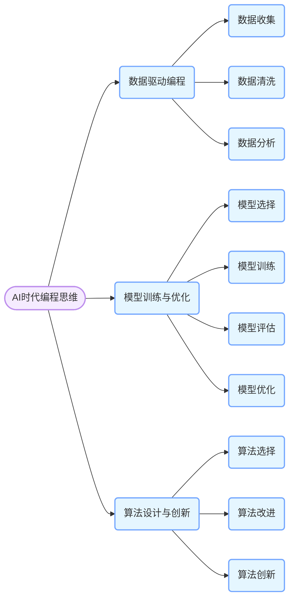

# AI时代的编程思维与创新策略

> 关键词：AI时代、编程思维、创新策略、人工智能、软件开发、算法设计、技术融合

> 摘要：本文聚焦于AI时代下编程思维与创新策略的探讨。在人工智能迅猛发展的大背景下，传统编程思维正面临着深刻的变革与挑战。文章深入剖析了AI时代编程思维的核心概念及其内在联系，详细阐述了相关核心算法原理和具体操作步骤，借助数学模型和公式对编程中的关键要点进行了精准解读。通过实际项目案例展示了如何将创新策略融入编程实践，探讨了AI编程在不同领域的实际应用场景。同时，为读者推荐了丰富的学习资源、开发工具框架以及相关论文著作。最后，对AI时代编程思维与创新策略的未来发展趋势和面临的挑战进行了总结，并解答了常见问题，提供了扩展阅读和参考资料，旨在帮助程序员和开发者在AI时代更好地掌握编程思维和创新方法，提升编程能力和创新水平。

## 1. 背景介绍 

### 1.1 目的和范围
随着人工智能技术的飞速发展，其在各个领域的应用日益广泛，编程领域也受到了极大的影响。本文的目的在于深入探讨AI时代下编程思维的转变以及相应的创新策略，帮助程序员和开发者适应新时代的需求，提升编程能力和创新水平。文章的范围涵盖了AI时代编程思维的核心概念、算法原理、数学模型、项目实战、应用场景等多个方面，旨在为读者提供一个全面、系统的学习和参考资料。

### 1.2 预期读者
本文预期读者主要包括程序员、软件开发者、计算机科学专业的学生以及对人工智能和编程感兴趣的技术爱好者。无论您是初学者还是有一定经验的专业人士，都能从本文中获取有价值的信息，进一步提升自己在AI时代的编程能力和创新思维。

### 1.3 文档结构概述
本文将按照以下结构进行组织：首先介绍背景信息，包括目的、预期读者和文档结构概述等；接着阐述核心概念与联系，通过文本示意图和Mermaid流程图展示编程思维与人工智能的关系；然后详细讲解核心算法原理和具体操作步骤，结合Python源代码进行说明；再通过数学模型和公式对编程中的关键要点进行深入分析；之后通过项目实战展示如何将理论应用到实际中；探讨实际应用场景；推荐相关的工具和资源；最后总结未来发展趋势与挑战，解答常见问题，并提供扩展阅读和参考资料。

### 1.4 术语表

#### 1.4.1 核心术语定义
- **编程思维**：是指运用计算机科学的概念和方法来解决问题的思维方式，包括逻辑思维、算法思维、抽象思维等。
- **人工智能（AI）**：是指让计算机模拟人类智能的技术，包括机器学习、深度学习、自然语言处理等多个领域。
- **机器学习**：是人工智能的一个分支，通过让计算机从数据中学习模式和规律，从而实现预测和决策。
- **深度学习**：是机器学习的一种，使用多层神经网络来处理复杂的数据，在图像识别、语音识别等领域取得了巨大的成功。
- **算法**：是指解决问题的一系列步骤和方法，是编程的核心内容。

#### 1.4.2 相关概念解释
- **数据驱动编程**：在AI时代，编程往往依赖于大量的数据。通过对数据的分析和处理，让计算机学习到有用的信息，从而实现更智能的功能。
- **模型训练**：在机器学习和深度学习中，需要使用大量的数据来训练模型，让模型学习到数据中的模式和规律，从而能够对新的数据进行预测和分类。
- **创新策略**：是指在编程过程中采用的新颖、独特的方法和思路，以提高编程效率和质量，创造出更有价值的软件产品。

#### 1.4.3 缩略词列表
- **AI**：Artificial Intelligence（人工智能）
- **ML**：Machine Learning（机器学习）
- **DL**：Deep Learning（深度学习）
- **NLP**：Natural Language Processing（自然语言处理）
- **API**：Application Programming Interface（应用程序编程接口）

## 2. 核心概念与联系 

### 核心概念原理
在AI时代，编程思维发生了显著的变化。传统的编程思维主要侧重于通过编写代码来实现特定的功能，而AI时代的编程思维更加注重数据驱动和模型训练。具体来说，核心概念包括以下几个方面：

#### 数据驱动编程
在AI时代，数据是编程的基础。通过收集、整理和分析大量的数据，我们可以发现数据中的模式和规律，从而让计算机学习到有用的信息。例如，在图像识别领域，我们可以使用大量的图像数据来训练模型，让模型学习到不同图像的特征，从而能够对新的图像进行分类和识别。

#### 模型训练与优化
机器学习和深度学习是AI时代编程的重要技术。通过构建合适的模型，并使用大量的数据对模型进行训练和优化，我们可以让模型学习到数据中的模式和规律，从而实现预测和决策。例如，在推荐系统中，我们可以使用用户的历史行为数据来训练模型，让模型学习到用户的兴趣偏好，从而为用户推荐更加个性化的内容。

#### 算法设计与创新
在AI时代，算法的设计和创新变得尤为重要。不同的算法适用于不同的场景，我们需要根据具体的问题选择合适的算法，并对算法进行优化和改进。例如，在搜索算法中，我们可以使用启发式搜索算法来提高搜索效率，从而更快地找到最优解。

### 架构的文本示意图
```plaintext
AI时代编程思维
|-- 数据驱动编程
|   |-- 数据收集
|   |-- 数据清洗
|   |-- 数据分析
|-- 模型训练与优化
|   |-- 模型选择
|   |-- 模型训练
|   |-- 模型评估
|   |-- 模型优化
|-- 算法设计与创新
|   |-- 算法选择
|   |-- 算法改进
|   |-- 算法创新
```

### Mermaid流程图


## 3. 核心算法原理 & 具体操作步骤 

### 机器学习算法原理
机器学习是AI时代编程的重要技术之一，下面以线性回归算法为例，详细讲解其原理和具体操作步骤。

#### 线性回归算法原理
线性回归是一种用于预测连续数值的机器学习算法。其基本思想是通过找到一条直线（在二维空间中）或超平面（在多维空间中），使得数据点到该直线或超平面的距离之和最小。线性回归的数学模型可以表示为：

$$y = \theta_0 + \theta_1x_1 + \theta_2x_2 + \cdots + \theta_nx_n$$

其中，$y$ 是预测值，$x_1, x_2, \cdots, x_n$ 是输入特征，$\theta_0, \theta_1, \theta_2, \cdots, \theta_n$ 是模型的参数。

#### 具体操作步骤
1. **数据准备**：收集和整理用于训练和测试的数据，将数据分为特征矩阵 $X$ 和标签向量 $y$。
2. **模型选择**：选择线性回归模型。
3. **模型训练**：使用训练数据对模型进行训练，通过最小化损失函数来求解模型的参数。常见的损失函数是均方误差（Mean Squared Error，MSE）：

$$MSE = \frac{1}{m}\sum_{i=1}^{m}(y^{(i)} - \hat{y}^{(i)})^2$$

其中，$m$ 是样本数量，$y^{(i)}$ 是真实值，$\hat{y}^{(i)}$ 是预测值。

4. **模型评估**：使用测试数据对训练好的模型进行评估，计算评估指标，如均方误差、决定系数（$R^2$）等。
5. **模型预测**：使用训练好的模型对新的数据进行预测。

### Python源代码实现
```python
import numpy as np
from sklearn.linear_model import LinearRegression
from sklearn.model_selection import train_test_split
from sklearn.metrics import mean_squared_error, r2_score

# 生成示例数据
np.random.seed(0)
X = 2 * np.random.rand(100, 1)
y = 4 + 3 * X + np.random.randn(100, 1)

# 划分训练集和测试集
X_train, X_test, y_train, y_test = train_test_split(X, y, test_size=0.2, random_state=42)

# 创建线性回归模型
model = LinearRegression()

# 模型训练
model.fit(X_train, y_train)

# 模型预测
y_pred = model.predict(X_test)

# 模型评估
mse = mean_squared_error(y_test, y_pred)
r2 = r2_score(y_test, y_pred)

print(f"均方误差 (MSE): {mse}")
print(f"决定系数 (R^2): {r2}")
```

### 代码解释
1. **数据生成**：使用 `numpy` 生成随机数据，模拟真实的数据集。
2. **数据划分**：使用 `train_test_split` 函数将数据划分为训练集和测试集，比例为 8:2。
3. **模型创建**：使用 `LinearRegression` 类创建线性回归模型。
4. **模型训练**：使用 `fit` 方法对模型进行训练，传入训练数据的特征矩阵和标签向量。
5. **模型预测**：使用 `predict` 方法对测试数据进行预测，得到预测结果。
6. **模型评估**：使用 `mean_squared_error` 和 `r2_score` 函数计算均方误差和决定系数，评估模型的性能。

## 4. 数学模型和公式 & 详细讲解 & 举例说明 

### 线性回归的数学模型和公式
线性回归的数学模型可以表示为：

$$y = \theta_0 + \theta_1x_1 + \theta_2x_2 + \cdots + \theta_nx_n$$

其中，$y$ 是预测值，$x_1, x_2, \cdots, x_n$ 是输入特征，$\theta_0, \theta_1, \theta_2, \cdots, \theta_n$ 是模型的参数。

在二维空间中，线性回归的模型可以简化为：

$$y = \theta_0 + \theta_1x$$

这个公式表示一条直线，其中 $\theta_0$ 是截距，$\theta_1$ 是斜率。

### 最小化均方误差
为了求解模型的参数 $\theta_0$ 和 $\theta_1$，我们需要最小化均方误差（MSE）。均方误差的计算公式为：

$$MSE = \frac{1}{m}\sum_{i=1}^{m}(y^{(i)} - \hat{y}^{(i)})^2$$

其中，$m$ 是样本数量，$y^{(i)}$ 是真实值，$\hat{y}^{(i)}$ 是预测值。

将线性回归模型代入均方误差公式中，得到：

$$MSE = \frac{1}{m}\sum_{i=1}^{m}(y^{(i)} - (\theta_0 + \theta_1x^{(i)}))^2$$

为了找到使 MSE 最小的 $\theta_0$ 和 $\theta_1$，我们可以对 MSE 分别求关于 $\theta_0$ 和 $\theta_1$ 的偏导数，并令偏导数等于 0，然后求解方程组。

### 求解参数
对 MSE 求关于 $\theta_0$ 的偏导数：

$$\frac{\partial MSE}{\partial \theta_0} = -\frac{2}{m}\sum_{i=1}^{m}(y^{(i)} - (\theta_0 + \theta_1x^{(i)}))$$

令 $\frac{\partial MSE}{\partial \theta_0} = 0$，得到：

$$\sum_{i=1}^{m}(y^{(i)} - (\theta_0 + \theta_1x^{(i)})) = 0$$

对 MSE 求关于 $\theta_1$ 的偏导数：

$$\frac{\partial MSE}{\partial \theta_1} = -\frac{2}{m}\sum_{i=1}^{m}x^{(i)}(y^{(i)} - (\theta_0 + \theta_1x^{(i)}))$$

令 $\frac{\partial MSE}{\partial \theta_1} = 0$，得到：

$$\sum_{i=1}^{m}x^{(i)}(y^{(i)} - (\theta_0 + \theta_1x^{(i)})) = 0$$

通过求解上述方程组，我们可以得到 $\theta_0$ 和 $\theta_1$ 的最优解。

### 举例说明
假设我们有以下数据集：

| $x$ | $y$ |
| --- | --- |
| 1 | 3 |
| 2 | 5 |
| 3 | 7 |
| 4 | 9 |

我们可以使用线性回归模型来拟合这些数据。首先，计算所需的统计量：

$$\bar{x} = \frac{1 + 2 + 3 + 4}{4} = 2.5$$

$$\bar{y} = \frac{3 + 5 + 7 + 9}{4} = 6$$

$$\sum_{i=1}^{4}(x^{(i)} - \bar{x})(y^{(i)} - \bar{y}) = (1 - 2.5)(3 - 6) + (2 - 2.5)(5 - 6) + (3 - 2.5)(7 - 6) + (4 - 2.5)(9 - 6) = 10$$

$$\sum_{i=1}^{4}(x^{(i)} - \bar{x})^2 = (1 - 2.5)^2 + (2 - 2.5)^2 + (3 - 2.5)^2 + (4 - 2.5)^2 = 5$$

然后，计算 $\theta_1$ 和 $\theta_0$：

$$\theta_1 = \frac{\sum_{i=1}^{4}(x^{(i)} - \bar{x})(y^{(i)} - \bar{y})}{\sum_{i=1}^{4}(x^{(i)} - \bar{x})^2} = \frac{10}{5} = 2$$

$$\theta_0 = \bar{y} - \theta_1\bar{x} = 6 - 2 \times 2.5 = 1$$

因此，线性回归模型为 $y = 1 + 2x$。

## 5. 项目实战：代码实际案例和详细解释说明 

### 5.1 开发环境搭建
为了完成本项目实战，我们需要搭建以下开发环境：

#### 安装Python
首先，确保你已经安装了 Python 3.x 版本。你可以从 Python 官方网站（https://www.python.org/downloads/） 下载并安装适合你操作系统的 Python 版本。

#### 安装必要的库
我们需要安装一些必要的 Python 库，如 `numpy`、`pandas`、`scikit-learn` 等。可以使用以下命令来安装这些库：

```sh
pip install numpy pandas scikit-learn
```

### 5.2 源代码详细实现和代码解读
本项目实战将使用一个简单的房价预测数据集，通过线性回归模型来预测房价。以下是完整的源代码：

```python
import numpy as np
import pandas as pd
from sklearn.model_selection import train_test_split
from sklearn.linear_model import LinearRegression
from sklearn.metrics import mean_squared_error, r2_score

# 加载数据集
data = pd.read_csv('housing.csv')

# 提取特征和标签
X = data.drop('price', axis=1).values
y = data['price'].values

# 划分训练集和测试集
X_train, X_test, y_train, y_test = train_test_split(X, y, test_size=0.2, random_state=42)

# 创建线性回归模型
model = LinearRegression()

# 模型训练
model.fit(X_train, y_train)

# 模型预测
y_pred = model.predict(X_test)

# 模型评估
mse = mean_squared_error(y_test, y_pred)
r2 = r2_score(y_test, y_pred)

print(f"均方误差 (MSE): {mse}")
print(f"决定系数 (R^2): {r2}")
```

### 代码解读
1. **数据加载**：使用 `pandas` 库的 `read_csv` 函数加载房价预测数据集。
2. **特征和标签提取**：使用 `drop` 方法从数据集中提取特征矩阵 $X$，并使用 `values` 属性将其转换为 `numpy` 数组。使用 `['price']` 选择标签向量 $y$，并同样转换为 `numpy` 数组。
3. **数据划分**：使用 `train_test_split` 函数将数据划分为训练集和测试集，比例为 8:2。
4. **模型创建**：使用 `LinearRegression` 类创建线性回归模型。
5. **模型训练**：使用 `fit` 方法对模型进行训练，传入训练数据的特征矩阵和标签向量。
6. **模型预测**：使用 `predict` 方法对测试数据进行预测，得到预测结果。
7. **模型评估**：使用 `mean_squared_error` 和 `r2_score` 函数计算均方误差和决定系数，评估模型的性能。

### 5.3 代码解读与分析
通过上述代码，我们可以看到一个完整的机器学习项目的基本流程：数据加载、数据预处理、模型选择、模型训练、模型预测和模型评估。在实际应用中，我们还可以对数据进行进一步的预处理，如特征缩放、特征选择等，以提高模型的性能。同时，我们也可以尝试使用不同的模型和算法，如决策树、随机森林等，来比较不同模型的性能。

## 6. 实际应用场景 
### 金融领域
在金融领域，AI编程可以用于风险评估、信用评分、股票预测等。例如，通过分析客户的历史交易数据、信用记录等信息，使用机器学习模型来评估客户的信用风险，从而决定是否给予贷款。在股票预测方面，可以使用深度学习模型对股票价格的走势进行预测，为投资者提供决策参考。

### 医疗领域
在医疗领域，AI编程可以用于疾病诊断、医学影像分析、药物研发等。例如，通过分析患者的病历数据、影像数据等，使用机器学习模型来辅助医生进行疾病诊断，提高诊断的准确性和效率。在医学影像分析方面，可以使用深度学习模型对X光、CT等影像进行分析，检测疾病和病变。

### 交通领域
在交通领域，AI编程可以用于智能交通系统、自动驾驶等。例如，通过分析交通流量数据、传感器数据等，使用机器学习模型来优化交通信号控制，提高交通效率。在自动驾驶方面，使用深度学习模型对摄像头、雷达等传感器的数据进行处理，实现车辆的自主导航和决策。

### 教育领域
在教育领域，AI编程可以用于个性化学习、智能辅导等。例如，通过分析学生的学习数据、行为数据等，使用机器学习模型来为学生提供个性化的学习建议和辅导，提高学习效果。

## 7. 工具和资源推荐

### 7.1 学习资源推荐

#### 7.1.1 书籍推荐
- 《Python机器学习》：这本书详细介绍了Python在机器学习领域的应用，包括各种机器学习算法的原理和实现。
- 《深度学习》：由深度学习领域的三位权威专家撰写，全面介绍了深度学习的理论和实践。
- 《人工智能：一种现代的方法》：是人工智能领域的经典教材，涵盖了人工智能的各个方面。

#### 7.1.2 在线课程
- Coursera上的《机器学习》课程：由斯坦福大学教授Andrew Ng主讲，是机器学习领域的经典课程。
- edX上的《深度学习》课程：由麻省理工学院等知名高校提供，深入介绍了深度学习的原理和应用。
- 中国大学MOOC上的《人工智能基础》课程：由国内多所高校的教授联合授课，适合初学者学习。

#### 7.1.3 技术博客和网站
- Medium：上面有很多关于人工智能和编程的优秀文章，涵盖了各种技术和应用场景。
- Towards Data Science：专注于数据科学和机器学习领域，提供了大量的优质文章和教程。
- AI科技大本营：国内知名的人工智能媒体，及时报道人工智能领域的最新动态和技术进展。

### 7.2 开发工具框架推荐

#### 7.2.1 IDE和编辑器
- PyCharm：是一款专门为Python开发设计的集成开发环境（IDE），具有强大的代码编辑、调试和项目管理功能。
- Jupyter Notebook：是一个交互式的开发环境，适合进行数据探索、模型训练和可视化等工作。
- Visual Studio Code：是一款轻量级的代码编辑器，支持多种编程语言，具有丰富的插件和扩展功能。

#### 7.2.2 调试和性能分析工具
- PDB：是Python自带的调试工具，可以帮助我们调试代码，定位问题。
- TensorBoard：是TensorFlow提供的可视化工具，可以帮助我们监控模型的训练过程，分析模型的性能。
- Py-Spy：是一个性能分析工具，可以帮助我们分析Python代码的性能瓶颈。

#### 7.2.3 相关框架和库
- TensorFlow：是Google开发的开源深度学习框架，具有强大的计算能力和丰富的工具库。
- PyTorch：是Facebook开发的开源深度学习框架，具有简洁易用的API和动态图机制。
- Scikit-learn：是一个用于机器学习的Python库，提供了各种机器学习算法和工具。

### 7.3 相关论文著作推荐

#### 7.3.1 经典论文
- 《Gradient-Based Learning Applied to Document Recognition》：介绍了卷积神经网络（CNN）在手写字符识别中的应用，是CNN领域的经典论文。
- 《ImageNet Classification with Deep Convolutional Neural Networks》：介绍了AlexNet，开启了深度学习在计算机视觉领域的革命。
- 《Attention Is All You Need》：提出了Transformer架构，在自然语言处理领域取得了巨大的成功。

#### 7.3.2 最新研究成果
- 可以关注顶级学术会议如NeurIPS、ICML、CVPR等的最新论文，了解人工智能领域的最新研究进展。
- 一些知名的学术期刊如Journal of Artificial Intelligence Research（JAIR）、Artificial Intelligence等也会发表高质量的研究论文。

#### 7.3.3 应用案例分析
- 《AI Superpowers: China, Silicon Valley, and the New World Order》：分析了中美在人工智能领域的竞争和发展趋势，包含了很多实际应用案例。
- 《Hands-On Machine Learning with Scikit-Learn, Keras, and TensorFlow》：通过大量的实际案例介绍了如何使用机器学习和深度学习技术解决实际问题。

## 8. 总结：未来发展趋势与挑战 

### 未来发展趋势
- **融合发展**：AI与其他技术如物联网、区块链、大数据等的融合将越来越深入，创造出更多的创新应用场景。
- **自动化编程**：随着AI技术的发展，自动化编程工具将越来越强大，能够自动生成代码、优化代码和调试代码，提高编程效率。
- **强化学习应用拓展**：强化学习在机器人控制、游戏、自动驾驶等领域的应用将不断拓展，实现更加智能的决策和控制。
- **可解释性AI**：人们对AI系统的可解释性要求越来越高，未来将有更多的研究致力于提高AI模型的可解释性，让人们更好地理解和信任AI系统。

### 挑战
- **数据隐私和安全**：AI系统依赖大量的数据，数据的隐私和安全问题成为了一个重要的挑战。如何保护数据不被泄露和滥用，是需要解决的关键问题。
- **伦理和道德问题**：AI系统的决策和行为可能会对人类产生重大影响，因此需要考虑伦理和道德问题。例如，自动驾驶汽车在面临道德困境时应该如何决策。
- **人才短缺**：AI领域的快速发展导致了人才短缺，如何培养更多的AI专业人才是一个亟待解决的问题。
- **模型复杂性和计算资源需求**：深度学习模型的复杂性越来越高，对计算资源的需求也越来越大。如何在有限的计算资源下训练和部署高效的模型，是一个挑战。

## 9. 附录：常见问题与解答 

### 问题1：AI时代编程思维与传统编程思维有哪些不同？
答：传统编程思维主要侧重于通过编写代码来实现特定的功能，而AI时代的编程思维更加注重数据驱动和模型训练。在AI时代，我们需要收集和分析大量的数据，使用机器学习和深度学习算法来训练模型，让模型学习到数据中的模式和规律，从而实现更智能的功能。

### 问题2：如何选择合适的机器学习算法？
答：选择合适的机器学习算法需要考虑多个因素，如数据类型、问题类型、数据规模等。一般来说，如果数据是线性可分的，可以选择线性回归、逻辑回归等算法；如果数据是非线性的，可以选择决策树、随机森林、支持向量机等算法。对于复杂的问题，如图像识别、语音识别等，可以选择深度学习算法。

### 问题3：如何提高机器学习模型的性能？
答：可以从以下几个方面提高机器学习模型的性能：
- **数据预处理**：对数据进行清洗、归一化、特征选择等预处理操作，提高数据的质量。
- **模型选择和调优**：选择合适的模型，并对模型的参数进行调优，如使用网格搜索、随机搜索等方法。
- **集成学习**：使用集成学习方法，如Bagging、Boosting等，将多个模型组合起来，提高模型的性能。
- **增加数据量**：收集更多的数据来训练模型，让模型学习到更多的模式和规律。

### 问题4：AI编程需要具备哪些基础知识？
答：AI编程需要具备以下基础知识：
- **编程语言**：掌握Python是非常必要的，因为Python是AI领域最常用的编程语言。
- **数学基础**：包括线性代数、概率论、统计学等，这些知识对于理解机器学习和深度学习算法非常重要。
- **机器学习和深度学习基础**：了解常见的机器学习和深度学习算法的原理和应用。
- **数据处理和分析**：掌握数据处理和分析的方法，如使用Pandas、Numpy等库进行数据处理。

## 10. 扩展阅读 & 参考资料 
- 《Python深度学习》，作者：Francois Chollet
- 《Python数据科学手册》，作者：Jake VanderPlas
- 《机器学习实战》，作者：Peter Harrington
- Coursera平台上的《深度学习专项课程》
- Kaggle网站上的各种数据集和竞赛项目
- 相关的学术期刊和会议论文，如ACM Transactions on Intelligent Systems and Technology、ICLR等。

以上就是关于“AI时代的编程思维与创新策略”的详细内容，希望对读者在AI时代的编程学习和实践有所帮助。在这个快速发展的时代，不断学习和创新是我们跟上技术潮流的关键。让我们一起努力，在AI编程的道路上不断前行。 