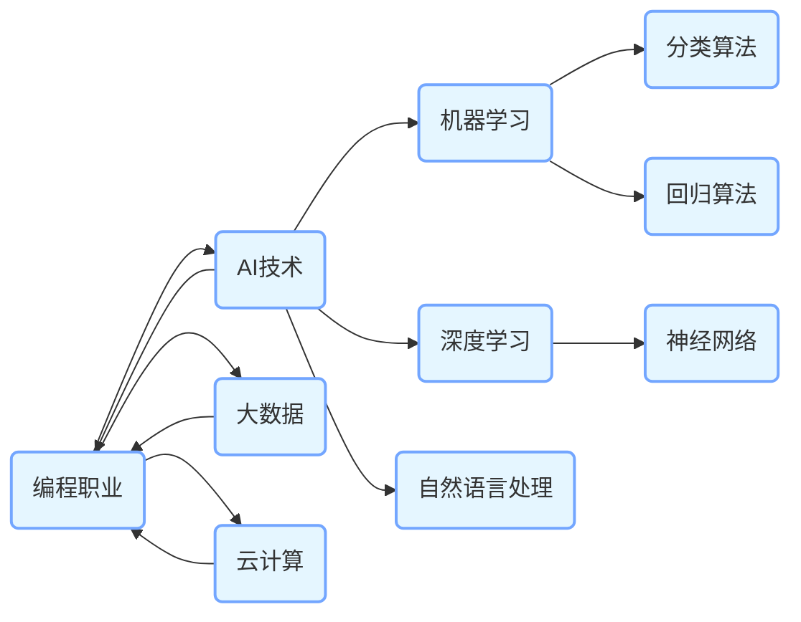

# AI时代的编程职业发展与创新战略分析

> 关键词：AI时代、编程职业发展、创新战略、技术趋势、职业转型

> 摘要：本文深入探讨了AI时代编程职业的发展态势与创新战略。在AI技术蓬勃发展的大背景下，编程职业面临着前所未有的机遇与挑战。文章首先介绍了研究的背景、目的、预期读者和文档结构，明确了相关术语。接着阐述了核心概念及其联系，分析了核心算法原理和具体操作步骤，并结合数学模型进行讲解。通过项目实战案例，详细说明了开发环境搭建、源代码实现与解读。同时，探讨了编程在不同实际应用场景中的作用，推荐了学习、开发相关的工具和资源，包括书籍、在线课程、技术博客、IDE等。最后总结了未来编程职业的发展趋势与挑战，解答了常见问题，并提供了扩展阅读和参考资料，旨在为编程从业者在AI时代的职业发展提供全面的指导和战略建议。

## 1. 背景介绍 

### 1.1 目的和范围
随着人工智能（AI）技术的飞速发展，它已经渗透到各个领域，深刻地改变了编程行业的生态。本文章的目的在于全面分析AI时代编程职业的发展趋势和面临的挑战，为编程从业者提供有针对性的职业发展建议和创新战略思路。我们将涵盖编程职业的各个方面，包括技术技能要求的变化、新兴的编程语言和框架、职业转型的可能性以及如何在AI浪潮中进行创新等内容。

### 1.2 预期读者
本文主要面向广大编程从业者，包括初级程序员、有一定经验的开发者、技术经理等。同时，对于正在考虑进入编程行业的学生和求职者，以及对AI和编程行业发展感兴趣的研究人员和行业观察者，本文也具有一定的参考价值。

### 1.3 文档结构概述
本文将按照以下结构展开：首先介绍核心概念与联系，帮助读者建立对AI时代编程职业的基本认识；接着详细阐述核心算法原理和具体操作步骤，结合Python代码进行说明；然后引入数学模型和公式，加深对相关技术的理解；通过项目实战案例，展示如何将理论知识应用到实际项目中；探讨编程在不同实际应用场景中的应用；推荐学习和开发所需的工具和资源；总结未来发展趋势与挑战；解答常见问题；最后提供扩展阅读和参考资料，方便读者进一步深入学习。

### 1.4 术语表
#### 1.4.1 核心术语定义
- **人工智能（AI）**：是一门研究如何使计算机能够模拟人类智能的学科，包括机器学习、深度学习、自然语言处理等多个领域。
- **编程职业**：指从事软件开发、程序设计、系统维护等与编程相关工作的职业领域。
- **创新战略**：为了在竞争激烈的市场中获得优势，企业或个人采取的一系列创新举措和策略。

#### 1.4.2 相关概念解释
- **机器学习**：是人工智能的一个重要分支，通过让计算机从数据中学习模式和规律，从而实现预测和决策等功能。
- **深度学习**：是一种基于人工神经网络的机器学习方法，具有强大的特征提取和模式识别能力，在图像识别、语音识别等领域取得了显著成果。
- **低代码/无代码开发**：是一种通过图形化界面和少量代码甚至无需代码即可快速开发应用程序的方法，降低了编程门槛，提高了开发效率。

#### 1.4.3 缩略词列表
- **AI**：Artificial Intelligence（人工智能）
- **ML**：Machine Learning（机器学习）
- **DL**：Deep Learning（深度学习）
- **NLP**：Natural Language Processing（自然语言处理）

## 2. 核心概念与联系 

在AI时代，编程职业与人工智能技术紧密相连。编程是实现人工智能算法和应用的基础，而人工智能的发展又为编程带来了新的机遇和挑战。下面我们通过一个文本示意图和Mermaid流程图来展示它们之间的关系。

### 文本示意图
编程职业处于核心地位，它与多个方面相互关联。一方面，编程为AI技术提供了实现的手段，通过编写代码来实现各种AI算法，如机器学习中的分类算法、回归算法，深度学习中的神经网络模型等。另一方面，AI技术的发展也推动了编程职业的变革，促使程序员不断学习新的知识和技能，如掌握深度学习框架、处理大规模数据集等。此外，编程职业还与其他领域如大数据、云计算等相互融合，共同推动科技的进步。

### Mermaid流程图

从流程图中可以看出，编程职业与AI技术、大数据、云计算等领域相互影响。AI技术又包含了机器学习、深度学习、自然语言处理等多个子领域，每个子领域都有具体的算法和模型。

## 3. 核心算法原理 & 具体操作步骤 

在AI时代，机器学习和深度学习是编程中常用的核心算法。下面我们以简单的线性回归算法为例，详细讲解其原理和具体操作步骤，并使用Python代码进行实现。

### 线性回归算法原理
线性回归是一种用于建立自变量和因变量之间线性关系的统计模型。其基本形式为：

$$y = \theta_0 + \theta_1x_1 + \theta_2x_2 + \cdots + \theta_nx_n$$

其中，$y$ 是因变量，$x_1, x_2, \cdots, x_n$ 是自变量，$\theta_0, \theta_1, \cdots, \theta_n$ 是模型的参数。线性回归的目标是通过最小化预测值与实际值之间的误差来确定这些参数的最优值。常用的误差度量方法是均方误差（Mean Squared Error，MSE）：

$$MSE = \frac{1}{m}\sum_{i=1}^{m}(y^{(i)} - \hat{y}^{(i)})^2$$

其中，$m$ 是样本数量，$y^{(i)}$ 是第 $i$ 个样本的实际值，$\hat{y}^{(i)}$ 是第 $i$ 个样本的预测值。

### 具体操作步骤
1. **数据准备**：收集和整理包含自变量和因变量的数据集。
2. **模型训练**：使用训练数据来估计模型的参数。
3. **模型评估**：使用测试数据来评估模型的性能。
4. **预测**：使用训练好的模型对新的数据进行预测。

### Python代码实现
```python
import numpy as np
from sklearn.model_selection import train_test_split
from sklearn.linear_model import LinearRegression
from sklearn.metrics import mean_squared_error

# 生成一些示例数据
np.random.seed(0)
X = 2 * np.random.rand(100, 1)
y = 4 + 3 * X + np.random.randn(100, 1)

# 划分训练集和测试集
X_train, X_test, y_train, y_test = train_test_split(X, y, test_size=0.2, random_state=42)

# 创建线性回归模型
model = LinearRegression()

# 训练模型
model.fit(X_train, y_train)

# 预测
y_pred = model.predict(X_test)

# 评估模型
mse = mean_squared_error(y_test, y_pred)
print(f"Mean Squared Error: {mse}")
```
### 代码解释
1. **数据生成**：使用 `numpy` 生成一些随机数据，模拟自变量 $X$ 和因变量 $y$ 之间的线性关系。
2. **数据划分**：使用 `sklearn` 中的 `train_test_split` 函数将数据集划分为训练集和测试集。
3. **模型创建**：创建一个线性回归模型对象。
4. **模型训练**：使用训练集数据对模型进行训练。
5. **预测**：使用训练好的模型对测试集数据进行预测。
6. **模型评估**：计算预测值与实际值之间的均方误差，评估模型的性能。

## 4. 数学模型和公式 & 详细讲解 & 举例说明 

### 线性回归的数学模型
如前面所述，线性回归的数学模型可以表示为：

$$y = \theta_0 + \theta_1x_1 + \theta_2x_2 + \cdots + \theta_nx_n$$

可以将其写成矩阵形式：

$$\mathbf{y} = \mathbf{X}\boldsymbol{\theta}$$

其中，$\mathbf{y}$ 是 $m \times 1$ 的向量，表示因变量的取值；$\mathbf{X}$ 是 $m \times (n + 1)$ 的矩阵，每一行代表一个样本，第一列全为 1，其余列是自变量的取值；$\boldsymbol{\theta}$ 是 $(n + 1) \times 1$ 的向量，表示模型的参数。

### 最小二乘法求解参数
为了找到使均方误差最小的参数 $\boldsymbol{\theta}$，可以使用最小二乘法。最小二乘法的目标是最小化以下损失函数：

$$J(\boldsymbol{\theta}) = \frac{1}{2m}(\mathbf{y} - \mathbf{X}\boldsymbol{\theta})^T(\mathbf{y} - \mathbf{X}\boldsymbol{\theta})$$

对 $J(\boldsymbol{\theta})$ 求关于 $\boldsymbol{\theta}$ 的偏导数，并令其等于 0，可以得到参数的最优解：

$$\boldsymbol{\theta} = (\mathbf{X}^T\mathbf{X})^{-1}\mathbf{X}^T\mathbf{y}$$

### 举例说明
假设我们有一个简单的数据集，包含两个自变量 $x_1$ 和 $x_2$，以及一个因变量 $y$。数据集如下：

| $x_1$ | $x_2$ | $y$ |
| --- | --- | --- |
| 1 | 2 | 5 |
| 2 | 3 | 8 |
| 3 | 4 | 11 |

首先，将数据集转换为矩阵形式：

$$\mathbf{X} = \begin{bmatrix} 1 & 1 & 2 \\ 1 & 2 & 3 \\ 1 & 3 & 4 \end{bmatrix}$$

$$\mathbf{y} = \begin{bmatrix} 5 \\ 8 \\ 11 \end{bmatrix}$$

然后，计算 $\mathbf{X}^T\mathbf{X}$ 和 $\mathbf{X}^T\mathbf{y}$：

$$\mathbf{X}^T\mathbf{X} = \begin{bmatrix} 1 & 1 & 1 \\ 1 & 2 & 3 \\ 2 & 3 & 4 \end{bmatrix} \begin{bmatrix} 1 & 1 & 2 \\ 1 & 2 & 3 \\ 1 & 3 & 4 \end{bmatrix} = \begin{bmatrix} 3 & 6 & 9 \\ 6 & 14 & 20 \\ 9 & 20 & 29 \end{bmatrix}$$

$$\mathbf{X}^T\mathbf{y} = \begin{bmatrix} 1 & 1 & 1 \\ 1 & 2 & 3 \\ 2 & 3 & 4 \end{bmatrix} \begin{bmatrix} 5 \\ 8 \\ 11 \end{bmatrix} = \begin{bmatrix} 24 \\ 54 \\ 78 \end{bmatrix}$$

接着，求 $(\mathbf{X}^T\mathbf{X})^{-1}$：

$$(\mathbf{X}^T\mathbf{X})^{-1} = \begin{bmatrix} 2.6667 & -2 & 0.3333 \\ -2 & 2 & -1 \\ 0.3333 & -1 & 0.6667 \end{bmatrix}$$

最后，计算参数 $\boldsymbol{\theta}$：

$$\boldsymbol{\theta} = (\mathbf{X}^T\mathbf{X})^{-1}\mathbf{X}^T\mathbf{y} = \begin{bmatrix} 2.6667 & -2 & 0.3333 \\ -2 & 2 & -1 \\ 0.3333 & -1 & 0.6667 \end{bmatrix} \begin{bmatrix} 24 \\ 54 \\ 78 \end{bmatrix} = \begin{bmatrix} 1 \\ 2 \\ 1 \end{bmatrix}$$

所以，线性回归模型为 $y = 1 + 2x_1 + x_2$。

## 5. 项目实战：代码实际案例和详细解释说明 

### 5.1  开发环境搭建
在进行项目实战之前，需要搭建相应的开发环境。以下是一些常见的步骤：
1. **安装Python**：可以从Python官方网站（https://www.python.org/downloads/）下载并安装Python。建议选择Python 3.7及以上版本。
2. **安装虚拟环境**：使用 `venv` 或 `conda` 等工具创建虚拟环境，以隔离不同项目的依赖。例如，使用 `venv` 创建虚拟环境的命令如下：
```bash
python -m venv myenv
```
3. **激活虚拟环境**：在Windows系统中，使用以下命令激活虚拟环境：
```bash
myenv\Scripts\activate
```
在Linux或Mac系统中，使用以下命令激活虚拟环境：
```bash
source myenv/bin/activate
```
4. **安装必要的库**：使用 `pip` 安装项目所需的库，如 `numpy`、`pandas`、`scikit-learn`、`tensorflow` 等。例如，安装 `numpy` 的命令如下：
```bash
pip install numpy
```

### 5.2  源代码详细实现和代码解读
我们以一个简单的图像分类项目为例，使用Python和 `tensorflow` 库来实现。

```python
import tensorflow as tf
from tensorflow.keras.datasets import mnist
from tensorflow.keras.models import Sequential
from tensorflow.keras.layers import Flatten, Dense

# 加载MNIST数据集
(train_images, train_labels), (test_images, test_labels) = mnist.load_data()

# 数据预处理
train_images = train_images / 255.0
test_images = test_images / 255.0

# 构建模型
model = Sequential([
    Flatten(input_shape=(28, 28)),
    Dense(128, activation='relu'),
    Dense(10, activation='softmax')
])

# 编译模型
model.compile(optimizer='adam',
              loss='sparse_categorical_crossentropy',
              metrics=['accuracy'])

# 训练模型
model.fit(train_images, train_labels, epochs=5)

# 评估模型
test_loss, test_acc = model.evaluate(test_images, test_labels)
print(f"Test accuracy: {test_acc}")
```

### 代码解读
1. **数据加载**：使用 `mnist.load_data()` 函数加载MNIST手写数字数据集，该数据集包含60000个训练样本和10000个测试样本。
2. **数据预处理**：将图像像素值归一化到0到1之间，以提高模型的训练效果。
3. **模型构建**：使用 `Sequential` 模型构建一个简单的神经网络，包含一个扁平化层、一个全连接层和一个输出层。
4. **模型编译**：指定优化器、损失函数和评估指标。
5. **模型训练**：使用训练数据对模型进行训练，指定训练的轮数。
6. **模型评估**：使用测试数据评估模型的性能，输出测试准确率。

### 5.3  代码解读与分析
这个图像分类项目虽然简单，但涵盖了深度学习的基本流程。通过构建神经网络模型，我们可以自动学习图像的特征，并对图像进行分类。在实际应用中，我们可以根据具体的需求对模型进行调整和优化，如增加隐藏层的数量、调整神经元的个数等。

## 6. 实际应用场景 

在AI时代，编程在各个领域都有广泛的应用。以下是一些常见的实际应用场景：

### 智能医疗
编程可以用于开发医疗诊断系统，通过分析医学影像（如X光、CT等）和病历数据，辅助医生进行疾病诊断。例如，使用深度学习算法对乳腺癌细胞进行识别和分类，提高诊断的准确性和效率。

### 金融科技
在金融领域，编程可以用于开发风险评估模型、量化交易系统等。通过分析市场数据和客户信息，预测金融市场的走势，进行投资决策。例如，使用机器学习算法对股票价格进行预测，帮助投资者制定投资策略。

### 自动驾驶
自动驾驶技术是AI时代的重要应用之一，编程在其中起着关键作用。通过编写代码实现传感器数据的处理、路径规划、决策控制等功能，使车辆能够自主行驶。例如，使用深度学习算法对摄像头图像进行识别，检测道路、交通标志和其他车辆。

### 智能家居
编程可以用于开发智能家居系统，实现家居设备的智能化控制。通过连接各种传感器和设备，实现远程控制、自动化场景设置等功能。例如，使用物联网技术和编程实现智能门锁、智能灯光、智能空调的互联互通。

### 教育科技
在教育领域，编程可以用于开发在线学习平台、智能辅导系统等。通过分析学生的学习数据，提供个性化的学习建议和辅导。例如，使用机器学习算法对学生的作业和考试成绩进行分析，了解学生的学习情况，为学生提供针对性的学习资源。

## 7. 工具和资源推荐

### 7.1 学习资源推荐
#### 7.1.1 书籍推荐
- 《Python机器学习实战》：本书详细介绍了Python在机器学习中的应用，包括各种算法的原理和实现，适合初学者入门。
- 《深度学习》：由深度学习领域的三位顶尖专家编写，系统地介绍了深度学习的理论和实践，是深度学习领域的经典著作。
- 《人工智能：一种现代的方法》：全面介绍了人工智能的各个方面，包括搜索算法、知识表示、机器学习、自然语言处理等，是人工智能领域的权威教材。

#### 7.1.2 在线课程
- Coursera上的《机器学习》课程：由斯坦福大学教授Andrew Ng主讲，是机器学习领域的经典课程，讲解深入浅出，适合初学者。
- edX上的《深度学习微硕士项目》：提供了深度学习的系统学习路径，包括多个课程和实践项目，适合有一定基础的学习者。
- 哔哩哔哩上的一些编程教学视频：有很多优秀的编程教学视频，内容丰富，讲解详细，适合不同水平的学习者。

#### 7.1.3 技术博客和网站
- Medium：是一个知名的技术博客平台，有很多关于AI、编程等领域的优质文章。
- GitHub：是全球最大的开源代码托管平台，可以找到很多优秀的开源项目和代码示例，学习他人的编程经验。
- Kaggle：是一个数据科学竞赛平台，提供了大量的数据集和竞赛项目，可以通过参与竞赛提高自己的编程和数据分析能力。

### 7.2 开发工具框架推荐
#### 7.2.1 IDE和编辑器
- PyCharm：是一款专门为Python开发设计的集成开发环境，功能强大，提供了代码自动补全、调试、版本控制等功能。
- Visual Studio Code：是一款轻量级的代码编辑器，支持多种编程语言，有丰富的插件扩展，可以根据需要进行定制。
- Jupyter Notebook：是一个交互式的开发环境，适合进行数据分析和机器学习实验，支持代码、文本、图像等多种形式的展示。

#### 7.2.2 调试和性能分析工具
- pdb：是Python自带的调试工具，可以在代码中设置断点，逐步执行代码，查看变量的值。
- cProfile：是Python的性能分析工具，可以分析代码的运行时间和函数调用次数，找出性能瓶颈。
- TensorBoard：是TensorFlow提供的可视化工具，可以可视化模型的训练过程、网络结构等，帮助开发者更好地理解和优化模型。

#### 7.2.3 相关框架和库
- TensorFlow：是Google开发的深度学习框架，提供了丰富的工具和接口，支持分布式训练和模型部署。
- PyTorch：是Facebook开发的深度学习框架，具有动态图的特点，易于使用和调试，在学术界和工业界都有广泛的应用。
- Scikit-learn：是Python的机器学习库，提供了各种机器学习算法和工具，如分类、回归、聚类等，适合初学者快速上手。

### 7.3 相关论文著作推荐
#### 7.3.1 经典论文
- 《Gradient-based learning applied to document recognition》：由Yann LeCun等人发表，介绍了卷积神经网络（CNN）在手写数字识别中的应用，是深度学习领域的经典论文。
- 《Attention Is All You Need》：提出了Transformer模型，是自然语言处理领域的重要突破，为后续的研究奠定了基础。
- 《ImageNet Classification with Deep Convolutional Neural Networks》：由Alex Krizhevsky等人发表，介绍了AlexNet模型，在ImageNet图像分类竞赛中取得了优异的成绩，推动了深度学习在计算机视觉领域的发展。

#### 7.3.2 最新研究成果
- 关注顶级学术会议，如NeurIPS（神经信息处理系统大会）、ICML（国际机器学习会议）、CVPR（计算机视觉与模式识别会议）等，这些会议上会发表很多最新的研究成果。
- 阅读相关领域的顶级期刊，如Journal of Artificial Intelligence Research（JAIR）、Artificial Intelligence等，了解最新的研究动态。

#### 7.3.3 应用案例分析
- 《AI in Practice: How 50 Successful Companies Used Artificial Intelligence to Solve Problems》：介绍了50家成功应用人工智能解决实际问题的公司案例，包括医疗、金融、零售等多个领域。
- 《Deep Learning in Production: From Concept to Deployment》：探讨了深度学习模型在实际生产环境中的部署和应用，提供了很多实用的经验和建议。

## 8. 总结：未来发展趋势与挑战

### 未来发展趋势
- **自动化编程**：随着低代码/无代码开发平台的不断发展，未来编程将变得更加自动化。开发者可以通过图形化界面和少量代码甚至无需代码即可快速开发应用程序，提高开发效率。
- **跨领域融合**：编程将与其他领域如生物学、物理学、社会学等进行更深入的融合，产生新的交叉学科和应用领域。例如，生物信息学中使用编程来分析基因数据，物理学中使用编程来模拟物理现象。
- **强化学习应用**：强化学习在机器人控制、游戏、自动驾驶等领域有着广阔的应用前景。未来，强化学习算法将不断优化，应用场景将不断拓展。
- **量子计算编程**：量子计算技术的发展将为编程带来新的挑战和机遇。量子计算编程需要掌握新的算法和编程语言，将成为未来编程领域的一个重要方向。

### 挑战
- **技术更新换代快**：AI时代技术发展迅速，编程语言、框架和算法不断更新换代。程序员需要不断学习和掌握新的知识和技能，才能跟上技术的发展步伐。
- **数据安全和隐私问题**：随着AI应用的广泛普及，数据安全和隐私问题日益突出。程序员需要在开发过程中注重数据的保护，遵守相关法律法规。
- **人才竞争激烈**：AI时代对编程人才的需求不断增加，导致人才竞争激烈。程序员需要不断提升自己的竞争力，具备创新能力和团队协作精神。
- **伦理和社会问题**：AI技术的发展也带来了一些伦理和社会问题，如算法偏见、失业风险等。程序员需要在开发过程中考虑这些问题，确保AI技术的合理应用。

## 9. 附录：常见问题与解答

### 问题1：在AI时代，哪些编程语言最有前途？
在AI时代，Python是最受欢迎的编程语言之一，因为它具有简洁易读的语法和丰富的库，如 `numpy`、`pandas`、`scikit-learn`、`tensorflow` 等，非常适合进行数据分析和机器学习。此外，Java、C++ 等语言也在AI领域有广泛的应用，特别是在大型项目和对性能要求较高的场景中。

### 问题2：如何从传统编程转型到AI编程？
从传统编程转型到AI编程需要学习一些新的知识和技能。首先，需要掌握机器学习和深度学习的基本理论和算法，如线性回归、逻辑回归、神经网络等。其次，需要学习Python编程语言和相关的库，如 `tensorflow`、`pytorch` 等。可以通过在线课程、书籍和实践项目来学习和实践。

### 问题3：AI编程需要具备哪些数学基础？
AI编程需要具备一定的数学基础，主要包括线性代数、概率论与数理统计、微积分等。线性代数用于处理矩阵和向量的运算，在神经网络中有着广泛的应用；概率论与数理统计用于处理数据的概率分布和统计特征，在机器学习中用于模型的训练和评估；微积分用于求解优化问题，如梯度下降法。

### 问题4：如何提高编程能力和创新能力？
提高编程能力需要不断地学习和实践。可以通过阅读优秀的代码、参与开源项目、解决实际问题等方式来提高编程水平。提高创新能力需要培养自己的思维能力和观察力，关注行业的最新动态和发展趋势，勇于尝试新的技术和方法。

## 10. 扩展阅读 & 参考资料
- 《Python数据分析实战》
- 《机器学习实战》
- 《人工智能：复杂问题求解的结构和策略》
- https://www.tensorflow.org/
- https://pytorch.org/
- https://scikit-learn.org/