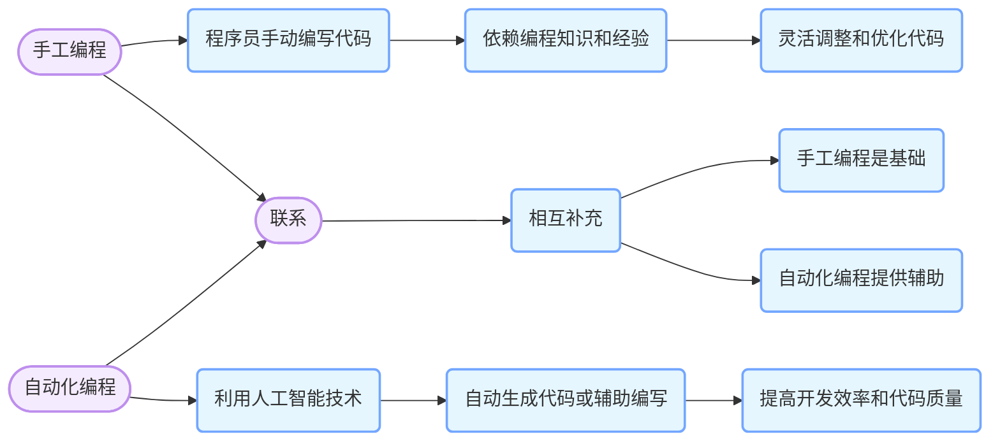

# AI时代的编程：从手工到自动化

> 关键词：AI时代、编程、手工编程、自动化编程、代码生成、未来趋势

> 摘要：本文深入探讨了AI时代编程从手工向自动化的转变。首先介绍了这一转变的背景，包括目的、预期读者、文档结构和相关术语。接着阐述了核心概念，如手工编程和自动化编程的原理及联系，并通过示意图和流程图展示。详细讲解了自动化编程的核心算法原理及操作步骤，配以Python代码示例。分析了相关数学模型和公式，并举例说明。通过项目实战，展示了开发环境搭建、源代码实现与解读。探讨了自动化编程的实际应用场景，推荐了学习资源、开发工具框架和相关论文著作。最后总结了未来发展趋势与挑战，提供了常见问题解答和扩展阅读参考资料，旨在帮助读者全面了解AI时代编程的变革。

## 1. 背景介绍 
### 1.1 目的和范围
在当今AI时代，编程领域正经历着深刻的变革，从传统的手工编程逐渐向自动化编程迈进。本文的目的在于深入剖析这一转变过程，详细阐述手工编程和自动化编程的特点、原理、算法，以及它们在实际项目中的应用。通过对相关概念、算法、数学模型的讲解，结合项目实战案例，为读者提供全面而深入的理解。同时，探讨自动化编程在不同领域的应用场景，推荐相关的学习资源、开发工具和研究论文，帮助读者更好地适应和利用这一技术变革。本文的范围涵盖了AI时代编程从手工到自动化的各个方面，包括理论知识、实践操作、应用案例以及未来发展趋势。

### 1.2 预期读者
本文预期读者包括软件开发人员、程序员、软件架构师、CTO等IT领域的专业人士，他们希望深入了解AI时代编程的最新发展趋势，掌握自动化编程的技术和方法，以提高工作效率和代码质量。同时，也适合对编程和人工智能感兴趣的学生、研究者以及爱好者，帮助他们拓宽知识面，了解行业动态，为未来的学习和研究提供参考。

### 1.3 文档结构概述
本文将按照以下结构进行组织：
- 核心概念与联系：介绍手工编程和自动化编程的核心概念、原理和架构，通过示意图和流程图展示它们之间的联系。
- 核心算法原理 & 具体操作步骤：详细讲解自动化编程的核心算法原理，并用Python代码进行具体阐述，同时说明操作步骤。
- 数学模型和公式 & 详细讲解 & 举例说明：分析自动化编程涉及的数学模型和公式，进行详细讲解并举例说明。
- 项目实战：代码实际案例和详细解释说明：通过具体的项目实战，展示开发环境搭建、源代码实现和代码解读。
- 实际应用场景：探讨自动化编程在不同领域的实际应用场景。
- 工具和资源推荐：推荐学习资源、开发工具框架和相关论文著作。
- 总结：未来发展趋势与挑战：总结AI时代编程从手工到自动化的未来发展趋势和面临的挑战。
- 附录：常见问题与解答：解答读者可能遇到的常见问题。
- 扩展阅读 & 参考资料：提供相关的扩展阅读和参考资料，方便读者进一步深入学习。

### 1.4 术语表
#### 1.4.1 核心术语定义
- 手工编程：指程序员通过手动编写代码来实现软件功能的传统编程方式。
- 自动化编程：利用人工智能技术，自动生成代码或辅助程序员进行代码编写的编程方式。
- 代码生成器：一种自动化编程工具，根据输入的需求和规则，自动生成代码。
- 机器学习：一门多领域交叉学科，涉及概率论、统计学、逼近论、凸分析、算法复杂度理论等多门学科。它专门研究计算机怎样模拟或实现人类的学习行为，以获取新的知识或技能，重新组织已有的知识结构使之不断改善自身的性能。
- 自然语言处理：计算机科学领域与人工智能领域中的一个重要方向。它研究能实现人与计算机之间用自然语言进行有效通信的各种理论和方法。

#### 1.4.2 相关概念解释
- 编程范式：是指编程的基本风格或模式，常见的编程范式有面向过程编程、面向对象编程、函数式编程等。不同的编程范式有不同的编程思想和方法，影响着程序员编写代码的方式。
- 代码复用：指在软件开发过程中，重复使用已有的代码片段或模块，以提高开发效率和代码质量。代码复用可以通过继承、组合、库的使用等方式实现。
- 算法复杂度：用于衡量算法执行效率的指标，通常用时间复杂度和空间复杂度来表示。时间复杂度描述算法执行时间随输入规模的增长趋势，空间复杂度描述算法执行过程中所需的存储空间随输入规模的增长趋势。

#### 1.4.3 缩略词列表
- AI：Artificial Intelligence，人工智能
- ML：Machine Learning，机器学习
- NLP：Natural Language Processing，自然语言处理
- IDE：Integrated Development Environment，集成开发环境

## 2. 核心概念与联系 
### 2.1 手工编程的原理和特点
手工编程是程序员根据软件需求，使用编程语言手动编写代码的过程。程序员需要具备扎实的编程知识和丰富的编程经验，能够理解问题的本质，设计合适的算法和数据结构，并将其转化为代码。手工编程的优点是程序员对代码有完全的控制权，可以根据具体需求进行灵活的调整和优化。同时，手工编程有助于程序员深入理解编程原理和算法，提高编程能力。然而，手工编程也存在一些缺点，如开发效率低、容易出现人为错误、代码复用性差等。

### 2.2 自动化编程的原理和特点
自动化编程是利用人工智能技术，如机器学习、自然语言处理等，自动生成代码或辅助程序员进行代码编写的过程。自动化编程的核心思想是通过对大量代码数据的学习和分析，建立代码生成模型，根据输入的需求自动生成符合要求的代码。自动化编程的优点是可以大大提高开发效率，减少人为错误，提高代码的复用性和一致性。同时，自动化编程可以帮助程序员处理复杂的任务，降低编程门槛。然而，自动化编程也存在一些挑战，如模型的准确性和泛化能力有待提高，对输入需求的理解和处理还不够完善等。

### 2.3 手工编程和自动化编程的联系
手工编程和自动化编程并不是相互排斥的，而是相互补充的。在AI时代，手工编程仍然是基础，程序员需要具备扎实的编程知识和技能，才能更好地理解和应用自动化编程工具。同时，自动化编程可以为手工编程提供辅助，帮助程序员提高开发效率和代码质量。例如，自动化编程工具可以根据程序员的输入自动生成代码框架，程序员可以在此基础上进行进一步的修改和完善。此外，手工编程的经验和知识也可以为自动化编程模型的训练和优化提供有价值的信息。

### 2.4 核心概念的文本示意图
```plaintext
手工编程
|
|-- 程序员手动编写代码
|-- 依赖编程知识和经验
|-- 灵活调整和优化代码
|
自动化编程
|
|-- 利用人工智能技术
|-- 自动生成代码或辅助编写
|-- 提高开发效率和代码质量
|
联系
|
|-- 相互补充
|-- 手工编程是基础
|-- 自动化编程提供辅助
```

### 2.5 Mermaid流程图


## 3. 核心算法原理 & 具体操作步骤 
### 3.1 自动化编程的核心算法原理
自动化编程的核心算法主要基于机器学习和自然语言处理技术。其中，深度学习模型如循环神经网络（RNN）、长短时记忆网络（LSTM）、门控循环单元（GRU）以及Transformer架构等在代码生成任务中得到了广泛应用。这些模型可以学习代码的语法和语义信息，根据输入的需求生成符合要求的代码。

以Transformer架构为例，它采用了自注意力机制（Self-Attention），能够捕捉代码中不同位置之间的依赖关系，从而更好地理解代码的上下文信息。Transformer架构由编码器（Encoder）和解码器（Decoder）组成，编码器负责对输入的需求进行编码，解码器根据编码器的输出生成代码。

### 3.2 Python代码示例
以下是一个简单的基于Python和深度学习库TensorFlow的代码生成示例，使用了一个简单的循环神经网络（RNN）模型：

```python
import tensorflow as tf
from tensorflow.keras.preprocessing.text import Tokenizer
from tensorflow.keras.preprocessing.sequence import pad_sequences
from tensorflow.keras.models import Sequential
from tensorflow.keras.layers import Embedding, SimpleRNN, Dense

# 示例代码数据
code_data = [
    "print('Hello, World!')",
    "x = 5",
    "y = 10",
    "z = x + y",
    "print(z)"
]

# 分词器
tokenizer = Tokenizer()
tokenizer.fit_on_texts(code_data)
total_words = len(tokenizer.word_index) + 1

# 生成输入序列
input_sequences = []
for line in code_data:
    token_list = tokenizer.texts_to_sequences([line])[0]
    for i in range(1, len(token_list)):
        n_gram_sequence = token_list[:i+1]
        input_sequences.append(n_gram_sequence)

# 填充序列
max_sequence_len = max([len(x) for x in input_sequences])
input_sequences = pad_sequences(input_sequences, maxlen=max_sequence_len, padding='pre')

# 分离输入和标签
xs, labels = input_sequences[:,:-1], input_sequences[:,-1]
ys = tf.keras.utils.to_categorical(labels, num_classes=total_words)

# 构建RNN模型
model = Sequential()
model.add(Embedding(total_words, 100, input_length=max_sequence_len-1))
model.add(SimpleRNN(100))
model.add(Dense(total_words, activation='softmax'))

# 编译模型
model.compile(loss='categorical_crossentropy', optimizer='adam', metrics=['accuracy'])

# 训练模型
model.fit(xs, ys, epochs=50, verbose=1)

# 生成代码
seed_text = "print"
next_words = 3

for _ in range(next_words):
    token_list = tokenizer.texts_to_sequences([seed_text])[0]
    token_list = pad_sequences([token_list], maxlen=max_sequence_len-1, padding='pre')
    predicted = model.predict_classes(token_list, verbose=0)
    output_word = ""
    for word, index in tokenizer.word_index.items():
        if index == predicted:
            output_word = word
            break
    seed_text += " " + output_word

print(seed_text)
```

### 3.3 具体操作步骤
1. **数据准备**：收集大量的代码数据，对数据进行清洗和预处理，如去除注释、格式化代码等。
2. **分词和编码**：使用分词器将代码数据分词，并将每个词转换为对应的整数编码。
3. **构建输入序列**：将编码后的代码数据转换为适合模型输入的序列，每个序列包含输入和对应的标签。
4. **填充序列**：为了使所有序列长度一致，对序列进行填充操作。
5. **构建模型**：选择合适的深度学习模型，如RNN、LSTM、GRU或Transformer，构建代码生成模型。
6. **编译模型**：设置模型的损失函数、优化器和评估指标。
7. **训练模型**：使用准备好的数据对模型进行训练，调整模型的参数。
8. **生成代码**：输入需求，模型根据训练好的参数生成代码。

## 4. 数学模型和公式 & 详细讲解 & 举例说明 
### 4.1 损失函数
在代码生成任务中，常用的损失函数是交叉熵损失函数（Cross-Entropy Loss）。交叉熵损失函数用于衡量模型预测结果与真实标签之间的差异。对于多分类问题，交叉熵损失函数的公式如下：

$$L = -\frac{1}{N}\sum_{i=1}^{N}\sum_{j=1}^{C}y_{ij}\log(p_{ij})$$

其中，$N$ 是样本数量，$C$ 是类别数量，$y_{ij}$ 是第 $i$ 个样本的第 $j$ 个类别的真实标签（0 或 1），$p_{ij}$ 是模型对第 $i$ 个样本的第 $j$ 个类别的预测概率。

### 4.2 优化器
优化器用于更新模型的参数，以最小化损失函数。常用的优化器有随机梯度下降（SGD）、Adagrad、Adadelta、Adam等。以Adam优化器为例，它结合了Adagrad和RMSProp的优点，能够自适应地调整每个参数的学习率。Adam优化器的更新公式如下：

$$m_t = \beta_1m_{t-1} + (1 - \beta_1)g_t$$
$$v_t = \beta_2v_{t-1} + (1 - \beta_2)g_t^2$$
$$\hat{m}_t = \frac{m_t}{1 - \beta_1^t}$$
$$\hat{v}_t = \frac{v_t}{1 - \beta_2^t}$$
$$\theta_{t+1} = \theta_t - \frac{\alpha}{\sqrt{\hat{v}_t} + \epsilon}\hat{m}_t$$

其中，$m_t$ 和 $v_t$ 分别是一阶矩估计和二阶矩估计，$\beta_1$ 和 $\beta_2$ 是衰减率，$g_t$ 是当前时刻的梯度，$\alpha$ 是学习率，$\epsilon$ 是一个小的常数，用于避免除零错误。

### 4.3 自注意力机制
自注意力机制是Transformer架构的核心，它能够捕捉序列中不同位置之间的依赖关系。自注意力机制的计算步骤如下：
1. **计算查询（Query）、键（Key）和值（Value）**：对于输入序列 $X = [x_1, x_2, \cdots, x_n]$，通过线性变换得到查询矩阵 $Q$、键矩阵 $K$ 和值矩阵 $V$：

$$Q = XW_Q$$
$$K = XW_K$$
$$V = XW_V$$

其中，$W_Q$、$W_K$ 和 $W_V$ 是可学习的权重矩阵。

2. **计算注意力分数**：计算查询和键之间的点积，得到注意力分数：

$$Attention(Q, K, V) = \text{softmax}(\frac{QK^T}{\sqrt{d_k}})V$$

其中，$d_k$ 是键向量的维度，$\text{softmax}$ 函数用于将注意力分数归一化到 $[0, 1]$ 区间。

### 4.4 举例说明
假设我们有一个简单的代码生成任务，输入是一个代码片段，输出是下一个可能的代码单词。我们使用交叉熵损失函数和Adam优化器训练一个RNN模型。在训练过程中，模型根据输入的代码片段预测下一个代码单词的概率分布，通过交叉熵损失函数计算预测结果与真实标签之间的差异，然后使用Adam优化器更新模型的参数，不断迭代训练，直到模型的性能达到满意的程度。

## 5. 项目实战：代码实际案例和详细解释说明 
### 5.1  开发环境搭建
#### 5.1.1 安装Python
首先，确保你已经安装了Python 3.x版本。你可以从Python官方网站（https://www.python.org/downloads/）下载并安装适合你操作系统的Python版本。

#### 5.1.2 安装深度学习库
我们将使用TensorFlow和Keras进行代码生成模型的开发。可以使用以下命令安装这些库：

```sh
pip install tensorflow keras
```

#### 5.1.3 安装其他辅助库
还需要安装一些辅助库，如numpy、pandas等，可以使用以下命令安装：

```sh
pip install numpy pandas
```

### 5.2  源代码详细实现和代码解读
#### 5.2.1 数据准备
```python
import tensorflow as tf
from tensorflow.keras.preprocessing.text import Tokenizer
from tensorflow.keras.preprocessing.sequence import pad_sequences
import numpy as np

# 示例代码数据
code_data = [
    "print('Hello, World!')",
    "x = 5",
    "y = 10",
    "z = x + y",
    "print(z)"
]

# 分词器
tokenizer = Tokenizer()
tokenizer.fit_on_texts(code_data)
total_words = len(tokenizer.word_index) + 1

# 生成输入序列
input_sequences = []
for line in code_data:
    token_list = tokenizer.texts_to_sequences([line])[0]
    for i in range(1, len(token_list)):
        n_gram_sequence = token_list[:i+1]
        input_sequences.append(n_gram_sequence)

# 填充序列
max_sequence_len = max([len(x) for x in input_sequences])
input_sequences = pad_sequences(input_sequences, maxlen=max_sequence_len, padding='pre')

# 分离输入和标签
xs, labels = input_sequences[:,:-1], input_sequences[:,-1]
ys = tf.keras.utils.to_categorical(labels, num_classes=total_words)
```

**代码解读**：
- `Tokenizer` 用于将代码数据分词，并将每个词转换为对应的整数编码。
- `fit_on_texts` 方法用于训练分词器，统计代码数据中出现的所有单词。
- `texts_to_sequences` 方法将代码数据转换为整数序列。
- `pad_sequences` 方法用于填充序列，使所有序列长度一致。
- `to_categorical` 方法将标签转换为独热编码。

#### 5.2.2 构建模型
```python
from tensorflow.keras.models import Sequential
from tensorflow.keras.layers import Embedding, SimpleRNN, Dense

# 构建RNN模型
model = Sequential()
model.add(Embedding(total_words, 100, input_length=max_sequence_len-1))
model.add(SimpleRNN(100))
model.add(Dense(total_words, activation='softmax'))

# 编译模型
model.compile(loss='categorical_crossentropy', optimizer='adam', metrics=['accuracy'])
```

**代码解读**：
- `Sequential` 是一个线性堆叠模型，用于构建神经网络。
- `Embedding` 层用于将整数编码的单词转换为向量表示。
- `SimpleRNN` 是一个简单的循环神经网络层，用于处理序列数据。
- `Dense` 层是一个全连接层，用于输出每个单词的预测概率。
- `compile` 方法用于编译模型，设置损失函数、优化器和评估指标。

#### 5.2.3 训练模型
```python
# 训练模型
model.fit(xs, ys, epochs=50, verbose=1)
```

**代码解读**：
- `fit` 方法用于训练模型，`xs` 是输入数据，`ys` 是标签数据，`epochs` 是训练的轮数，`verbose` 用于控制训练过程的输出信息。

#### 5.2.4 生成代码
```python
# 生成代码
seed_text = "print"
next_words = 3

for _ in range(next_words):
    token_list = tokenizer.texts_to_sequences([seed_text])[0]
    token_list = pad_sequences([token_list], maxlen=max_sequence_len-1, padding='pre')
    predicted = model.predict_classes(token_list, verbose=0)
    output_word = ""
    for word, index in tokenizer.word_index.items():
        if index == predicted:
            output_word = word
            break
    seed_text += " " + output_word

print(seed_text)
```

**代码解读**：
- `texts_to_sequences` 方法将输入的代码片段转换为整数序列。
- `pad_sequences` 方法填充序列，使其长度与训练数据一致。
- `predict_classes` 方法用于预测下一个单词的类别。
- 通过查找分词器的索引，将预测的类别转换为对应的单词。

### 5.3  代码解读与分析
#### 5.3.1 模型性能分析
通过训练过程中的准确率和损失值可以评估模型的性能。在训练过程中，准确率逐渐提高，损失值逐渐降低，说明模型在不断学习和优化。然而，由于示例数据较少，模型的泛化能力可能有限，需要更多的数据进行训练。

#### 5.3.2 代码生成效果分析
生成的代码可能存在语法错误或不符合实际需求的情况。这是因为模型只是根据训练数据学习到了代码的统计规律，对于一些复杂的语义和逻辑关系可能无法很好地理解。可以通过增加训练数据、改进模型结构等方法来提高代码生成的质量。

#### 5.3.3 模型优化建议
- **增加训练数据**：使用更多的代码数据进行训练，提高模型的泛化能力。
- **改进模型结构**：使用更复杂的模型，如LSTM、GRU或Transformer，提高模型对序列数据的处理能力。
- **调整超参数**：调整模型的超参数，如学习率、批次大小、训练轮数等，优化模型的性能。

## 6. 实际应用场景 
### 6.1 软件开发
在软件开发过程中，自动化编程可以帮助程序员快速生成代码框架、重复的代码片段和测试用例。例如，在开发Web应用程序时，自动化编程工具可以根据需求自动生成数据库表结构、API接口代码和前端页面模板，大大提高开发效率。同时，自动化编程还可以减少人为错误，提高代码的质量和一致性。

### 6.2 数据科学
在数据科学领域，自动化编程可以用于数据预处理、特征工程和模型训练。例如，自动化编程工具可以根据数据集的特点自动选择合适的数据清洗方法、特征提取算法和模型类型，减少数据科学家的工作量。此外，自动化编程还可以帮助数据科学家快速验证不同的模型和算法，加速模型的开发和优化过程。

### 6.3 云计算和大数据
在云计算和大数据领域，自动化编程可以用于资源管理、任务调度和数据分析。例如，自动化编程工具可以根据云平台的资源使用情况自动调整虚拟机的配置和数量，提高资源利用率。同时，自动化编程还可以实现大数据处理任务的自动化调度和执行，提高数据处理的效率和可靠性。

### 6.4 物联网
在物联网领域，自动化编程可以用于设备管理、数据采集和控制。例如，自动化编程工具可以根据物联网设备的类型和功能自动生成设备驱动程序和通信协议，实现设备的快速接入和管理。此外，自动化编程还可以根据传感器采集的数据自动进行数据分析和决策，实现物联网系统的智能化控制。

## 7. 工具和资源推荐
### 7.1 学习资源推荐
#### 7.1.1 书籍推荐
- 《深度学习》（Deep Learning）：由Ian Goodfellow、Yoshua Bengio和Aaron Courville撰写，是深度学习领域的经典教材，涵盖了深度学习的基本概念、算法和应用。
- 《Python深度学习》（Deep Learning with Python）：由Francois Chollet撰写，介绍了如何使用Python和Keras库进行深度学习模型的开发和训练。
- 《自然语言处理入门》（Natural Language Processing in Action）：由Masato Hagiwara和Kathy Meier-Hellstern撰写，详细介绍了自然语言处理的基本概念、算法和应用。

#### 7.1.2 在线课程
- Coursera上的“深度学习专项课程”（Deep Learning Specialization）：由Andrew Ng教授讲授，包括五门课程，涵盖了深度学习的各个方面。
- edX上的“人工智能基础”（Foundations of Artificial Intelligence）：由UC Berkeley教授讲授，介绍了人工智能的基本概念、算法和应用。
- Kaggle上的“机器学习微课程”（Machine Learning Micro-Course）：提供了机器学习的入门课程，包括数据预处理、模型训练和评估等内容。

#### 7.1.3 技术博客和网站
- Medium：是一个技术博客平台，有很多关于AI和编程的优质文章。
- Towards Data Science：专注于数据科学和机器学习领域的技术博客，提供了很多实用的教程和案例。
- GitHub：是一个开源代码托管平台，可以找到很多优秀的AI和编程项目，学习他人的代码和经验。

### 7.2 开发工具框架推荐
#### 7.2.1 IDE和编辑器
- PyCharm：是一款专门为Python开发设计的集成开发环境，提供了代码编辑、调试、版本控制等功能。
- Visual Studio Code：是一款轻量级的代码编辑器，支持多种编程语言，有丰富的插件和扩展功能。
- Jupyter Notebook：是一个交互式的开发环境，适合进行数据探索、模型训练和可视化等工作。

#### 7.2.2 调试和性能分析工具
- TensorBoard：是TensorFlow提供的可视化工具，可以用于监控模型的训练过程、查看模型的结构和性能指标。
- Py-Spy：是一个Python性能分析工具，可以帮助开发者找出代码中的性能瓶颈。
- Debugpy：是Python的调试器，可以在VS Code等编辑器中使用，方便进行代码调试。

#### 7.2.3 相关框架和库
- TensorFlow：是一个开源的深度学习框架，提供了丰富的工具和接口，用于构建和训练深度学习模型。
- PyTorch：是另一个流行的深度学习框架，具有动态图的特点，适合进行快速迭代和实验。
- NLTK：是一个自然语言处理库，提供了很多自然语言处理的工具和算法，如分词、词性标注、命名实体识别等。

### 7.3 相关论文著作推荐
#### 7.3.1 经典论文
- “Attention Is All You Need”：提出了Transformer架构，是自然语言处理领域的重要突破。
- “Generative Adversarial Nets”：提出了生成对抗网络（GAN），在图像生成、文本生成等领域有广泛应用。
- “Long Short-Term Memory”：介绍了长短时记忆网络（LSTM），解决了传统RNN的梯度消失问题。

#### 7.3.2 最新研究成果
- 关注顶级学术会议，如NeurIPS、ICML、ACL等，了解AI和编程领域的最新研究成果。
- 查阅知名学术期刊，如Journal of Artificial Intelligence Research、Artificial Intelligence等，获取最新的学术论文。

#### 7.3.3 应用案例分析
- 分析开源项目和实际应用中的代码生成案例，学习他人的经验和技巧。
- 关注行业报告和技术博客，了解自动化编程在不同领域的应用案例和最佳实践。

## 8. 总结：未来发展趋势与挑战
### 8.1 未来发展趋势
#### 8.1.1 更智能的代码生成
未来的自动化编程工具将更加智能，能够理解更复杂的需求，生成高质量的代码。通过结合更多的知识图谱和语义信息，模型可以更好地理解代码的上下文和业务逻辑，生成更符合实际需求的代码。

#### 8.1.2 跨语言和跨平台支持
随着软件开发的多元化，自动化编程工具将支持更多的编程语言和平台。开发者可以在不同的环境中使用自动化编程工具，提高开发效率和代码的可移植性。

#### 8.1.3 与软件开发流程的深度融合
自动化编程将与软件开发流程的各个环节深度融合，如需求分析、设计、测试等。在需求分析阶段，自动化编程工具可以根据需求文档自动生成代码框架；在测试阶段，工具可以自动生成测试用例，提高测试效率。

#### 8.1.4 增强的人机协作
未来的自动化编程将更加注重人机协作，程序员和自动化编程工具将相互配合，发挥各自的优势。程序员可以利用自动化编程工具提供的建议和辅助，更好地完成编程任务；同时，自动化编程工具也可以从程序员的反馈中不断学习和改进。

### 8.2 挑战
#### 8.2.1 模型的准确性和泛化能力
目前的自动化编程模型在准确性和泛化能力方面还存在一定的问题。模型可能无法处理复杂的需求和未知的情况，生成的代码可能存在语法错误或逻辑漏洞。需要进一步研究和改进模型，提高其准确性和泛化能力。

#### 8.2.2 数据隐私和安全问题
自动化编程需要大量的代码数据进行训练，这些数据可能包含敏感信息。在数据收集、存储和使用过程中，需要注意数据隐私和安全问题，防止数据泄露和滥用。

#### 8.2.3 对程序员技能的要求变化
随着自动化编程的发展，程序员的技能要求也将发生变化。程序员需要具备更多的AI和机器学习知识，能够理解和使用自动化编程工具。同时，程序员还需要具备更强的问题解决能力和创新能力，能够在自动化编程的基础上进行进一步的优化和扩展。

#### 8.2.4 伦理和法律问题
自动化编程可能会带来一些伦理和法律问题，如代码的版权归属、自动化决策的责任认定等。需要制定相应的伦理和法律规范，确保自动化编程的健康发展。

## 9. 附录：常见问题与解答
### 9.1 自动化编程会取代程序员吗？
自动化编程不会取代程序员，而是会与程序员相互补充。虽然自动化编程可以提高开发效率和代码质量，但它仍然需要程序员的参与和指导。程序员可以利用自动化编程工具提供的建议和辅助，更好地完成编程任务。同时，程序员还需要具备创新能力和问题解决能力，能够处理复杂的需求和未知的情况。

### 9.2 自动化编程工具生成的代码质量如何？
自动化编程工具生成的代码质量取决于多个因素，如模型的准确性、训练数据的质量和数量、输入需求的明确性等。目前，自动化编程工具生成的代码可能存在语法错误或逻辑漏洞，需要程序员进行进一步的检查和修改。随着技术的不断发展，自动化编程工具生成的代码质量将不断提高。

### 9.3 学习自动化编程需要具备哪些知识和技能？
学习自动化编程需要具备一定的编程基础，如Python、Java等编程语言。同时，还需要了解机器学习和自然语言处理的基本概念和算法，如深度学习模型、分词、词性标注等。此外，还需要掌握一些开发工具和框架，如TensorFlow、PyTorch等。

### 9.4 如何选择合适的自动化编程工具？
选择合适的自动化编程工具需要考虑多个因素，如工具的功能、易用性、性能、社区支持等。可以根据自己的需求和技术水平选择适合的工具。同时，还可以参考其他开发者的评价和建议，选择口碑较好的工具。

## 10. 扩展阅读 & 参考资料
### 10.1 扩展阅读
- 《代码大全》（Code Complete）：介绍了软件开发的最佳实践和编程技巧，对提高编程能力有很大帮助。
- 《重构：改善既有代码的设计》（Refactoring: Improving the Design of Existing Code）：讲解了如何对现有代码进行重构，提高代码的可维护性和可扩展性。
- 《人工智能：一种现代的方法》（Artificial Intelligence: A Modern Approach）：是人工智能领域的经典教材，涵盖了人工智能的各个方面。

### 10.2 参考资料
- 官方文档：TensorFlow、PyTorch、NLTK等框架和库的官方文档是学习和使用这些工具的重要参考资料。
- 学术论文：查阅相关的学术论文，了解自动化编程领域的最新研究成果和技术趋势。
- 开源项目：参考GitHub上的开源项目，学习他人的代码和经验。