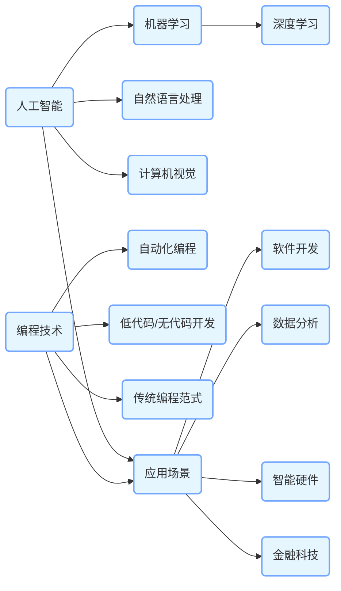

# AI时代的编程：程序员的未来展望

> 关键词：AI时代、编程、程序员、未来展望、技术变革、职业发展

> 摘要：本文深入探讨了AI时代编程领域的变革以及程序员的未来发展趋势。在AI技术快速发展的背景下，编程行业面临着诸多新的机遇和挑战。文章详细分析了核心概念，阐述了相关算法原理，结合数学模型进行解释，并通过项目实战案例展示了实际应用。同时，介绍了适用于该领域的工具和资源，对未来发展趋势与挑战进行了总结，旨在为程序员在AI时代的职业发展提供全面的参考和指导。

## 1. 背景介绍 

### 1.1 目的和范围
随着人工智能（AI）技术的飞速发展，它已经渗透到编程领域的各个方面，深刻地改变了编程的方式和程序员的工作内容。本文的目的是全面探讨AI时代编程的特点和发展趋势，分析程序员在这个新时代所面临的机遇和挑战，为程序员规划未来的职业发展提供有价值的参考。范围涵盖了AI对编程的技术影响、程序员的技能需求变化、行业应用场景以及未来的发展方向等多个方面。

### 1.2 预期读者
本文主要面向广大程序员群体，无论是初入编程行业的新手，还是经验丰富的资深开发者，都能从本文中获取有关AI时代编程的深入见解和职业发展建议。同时，对于关注科技行业发展、对编程和AI技术感兴趣的人员，本文也能提供有价值的信息。

### 1.3 文档结构概述
本文将按照以下结构进行阐述：首先介绍相关的核心概念和它们之间的联系，通过文本示意图和Mermaid流程图进行清晰展示；接着讲解核心算法原理，并给出具体的操作步骤，使用Python源代码进行详细说明；然后介绍数学模型和公式，结合实际例子进行详细讲解；通过项目实战案例，展示代码的实际应用和详细解释；探讨AI时代编程的实际应用场景；推荐相关的学习资源、开发工具框架和论文著作；最后总结未来发展趋势与挑战，并提供常见问题的解答和扩展阅读参考资料。

### 1.4 术语表

#### 1.4.1 核心术语定义
- **人工智能（AI）**：指让计算机系统能够模拟人类智能的技术，包括机器学习、深度学习、自然语言处理等多个领域。
- **机器学习（ML）**：是AI的一个重要分支，通过让计算机从数据中学习模式和规律，从而实现预测和决策的能力。
- **深度学习（DL）**：是一种基于人工神经网络的机器学习方法，通过多层神经网络对数据进行深度特征提取和学习。
- **自动化编程**：利用AI技术自动生成代码的过程，减少程序员手动编写代码的工作量。
- **低代码/无代码开发**：允许非专业程序员通过可视化界面和少量代码或无需代码即可开发应用程序的开发方式。

#### 1.4.2 相关概念解释
- **AI与编程的融合**：AI技术可以应用于编程的各个环节，如代码生成、代码优化、错误检测等，同时编程也是实现AI算法和系统的基础。
- **AI增强编程**：通过AI工具和技术辅助程序员提高编程效率和质量，例如智能代码补全、自动调试等。
- **编程范式的变化**：AI时代可能会出现新的编程范式，如基于数据驱动的编程、强化学习编程等。

#### 1.4.3 缩略词列表
- **AI**：Artificial Intelligence（人工智能）
- **ML**：Machine Learning（机器学习）
- **DL**：Deep Learning（深度学习）
- **NLP**：Natural Language Processing（自然语言处理）
- **API**：Application Programming Interface（应用程序编程接口）

## 2. 核心概念与联系 

### 核心概念原理
在AI时代，编程领域涉及到多个核心概念，它们相互关联，共同推动着编程技术的发展。

#### 人工智能
人工智能是模拟人类智能的技术，其核心原理是通过算法和模型让计算机系统具备感知、学习、推理和决策的能力。例如，在图像识别领域，AI系统可以通过训练大量的图像数据，学习到不同物体的特征，从而实现对新图像的准确识别。

#### 机器学习
机器学习是AI的重要实现方式，它基于数据驱动的思想。其基本原理是将数据输入到模型中，通过优化算法不断调整模型的参数，使得模型能够对新的数据进行准确的预测和分类。常见的机器学习算法包括决策树、支持向量机、神经网络等。

#### 深度学习
深度学习是机器学习的一个子集，它使用多层神经网络来学习数据的深层次特征。深度学习模型通常需要大量的训练数据和强大的计算资源。例如，在语音识别和自然语言处理领域，深度学习模型取得了显著的成果。

#### 自动化编程
自动化编程利用AI技术根据需求自动生成代码。其原理是通过对大量代码数据的学习，掌握代码的结构和模式，当接收到用户的需求描述时，能够生成相应的代码。自动化编程可以提高编程效率，减少人为错误。

#### 低代码/无代码开发
低代码/无代码开发允许用户通过可视化界面和少量代码或无需代码来创建应用程序。其原理是提供一系列的组件和模板，用户可以通过拖拽和配置这些组件来快速搭建应用程序。这种开发方式降低了编程的门槛，使得非专业程序员也能够参与到应用开发中。

### 架构的文本示意图
```plaintext
AI时代编程架构
|-- 人工智能
|   |-- 机器学习
|   |   |-- 深度学习
|   |-- 自然语言处理
|   |-- 计算机视觉
|-- 编程技术
|   |-- 自动化编程
|   |-- 低代码/无代码开发
|   |-- 传统编程范式
|-- 应用场景
|   |-- 软件开发
|   |-- 数据分析
|   |-- 智能硬件
|   |-- 金融科技
```

### Mermaid流程图


## 3. 核心算法原理 & 具体操作步骤 

### 核心算法原理

#### 线性回归算法
线性回归是一种基本的机器学习算法，用于建立自变量和因变量之间的线性关系。其数学模型可以表示为：
$$y = \theta_0 + \theta_1x_1 + \theta_2x_2 + \cdots + \theta_nx_n$$
其中，$y$ 是因变量，$x_1, x_2, \cdots, x_n$ 是自变量，$\theta_0, \theta_1, \cdots, \theta_n$ 是模型的参数。

线性回归的目标是找到一组最优的参数 $\theta$，使得预测值与真实值之间的误差最小。常用的误差度量方法是均方误差（MSE）：
$$MSE = \frac{1}{m}\sum_{i=1}^{m}(y^{(i)} - \hat{y}^{(i)})^2$$
其中，$m$ 是样本数量，$y^{(i)}$ 是第 $i$ 个样本的真实值，$\hat{y}^{(i)}$ 是第 $i$ 个样本的预测值。

为了找到最优的参数 $\theta$，可以使用梯度下降算法。梯度下降算法的基本思想是沿着误差函数的负梯度方向不断更新参数，直到误差函数达到最小值。

### Python源代码实现

```python
import numpy as np

# 生成随机数据
np.random.seed(0)
X = 2 * np.random.rand(100, 1)
y = 4 + 3 * X + np.random.randn(100, 1)

# 添加偏置项
X_b = np.c_[np.ones((100, 1)), X]

# 定义学习率和迭代次数
learning_rate = 0.1
n_iterations = 1000
m = 100

# 初始化参数
theta = np.random.randn(2, 1)

# 梯度下降算法
for iteration in range(n_iterations):
    gradients = 2/m * X_b.T.dot(X_b.dot(theta) - y)
    theta = theta - learning_rate * gradients

# 输出最终参数
print("最终参数 theta:", theta)
```

### 具体操作步骤
1. **数据准备**：生成或收集自变量 $X$ 和因变量 $y$ 的数据。
2. **添加偏置项**：在自变量矩阵 $X$ 中添加一列全为 1 的向量，用于表示截距项。
3. **初始化参数**：随机初始化模型的参数 $\theta$。
4. **设置学习率和迭代次数**：学习率控制每次参数更新的步长，迭代次数控制梯度下降算法的迭代次数。
5. **梯度下降算法**：在每次迭代中，计算误差函数的梯度，并根据梯度更新参数。
6. **输出结果**：输出最终的参数 $\theta$。

## 4. 数学模型和公式 & 详细讲解 & 举例说明 

### 线性回归模型
#### 数学模型
线性回归模型的数学表达式为：
$$y = \theta_0 + \theta_1x_1 + \theta_2x_2 + \cdots + \theta_nx_n + \epsilon$$
其中，$\epsilon$ 是误差项，服从均值为 0 的正态分布。

#### 详细讲解
线性回归模型假设自变量和因变量之间存在线性关系。通过最小化误差函数，我们可以找到最优的参数 $\theta$，使得模型能够最好地拟合数据。误差函数通常使用均方误差（MSE），因为它具有良好的数学性质，易于求导和优化。

#### 举例说明
假设我们有一组房屋价格的数据，自变量 $x$ 表示房屋的面积，因变量 $y$ 表示房屋的价格。我们可以使用线性回归模型来建立房屋面积和价格之间的关系。

假设我们得到的线性回归模型为：
$$y = 50000 + 2000x$$
这意味着当房屋面积为 0 时，基础价格为 50000 元，每增加 1 平方米的面积，房屋价格增加 2000 元。

### 逻辑回归模型
#### 数学模型
逻辑回归是一种用于分类问题的机器学习算法。其数学模型可以表示为：
$$P(y = 1|x) = \frac{1}{1 + e^{-(\theta_0 + \theta_1x_1 + \theta_2x_2 + \cdots + \theta_nx_n)}}$$
其中，$P(y = 1|x)$ 表示在给定自变量 $x$ 的情况下，因变量 $y$ 为 1 的概率。

#### 详细讲解
逻辑回归模型通过将线性回归的输出值通过 sigmoid 函数映射到 [0, 1] 区间，从而得到概率值。sigmoid 函数的表达式为：
$$\sigma(z) = \frac{1}{1 + e^{-z}}$$
逻辑回归的目标是找到一组最优的参数 $\theta$，使得模型对分类问题的预测准确率最高。常用的损失函数是对数损失函数：
$$J(\theta) = -\frac{1}{m}\sum_{i=1}^{m}[y^{(i)}\log(P(y^{(i)} = 1|x^{(i)})) + (1 - y^{(i)})\log(1 - P(y^{(i)} = 1|x^{(i)}))]$$

#### 举例说明
假设我们要对邮件进行分类，判断一封邮件是垃圾邮件还是正常邮件。自变量 $x$ 可以表示邮件的各种特征，如关键词出现的频率、发件人信息等。因变量 $y$ 为 1 表示垃圾邮件，为 0 表示正常邮件。通过逻辑回归模型，我们可以计算出一封邮件是垃圾邮件的概率，根据概率进行分类。

## 5. 项目实战：代码实际案例和详细解释说明 

### 5.1 开发环境搭建
#### 安装Python
首先，我们需要安装Python编程语言。可以从Python官方网站（https://www.python.org/downloads/）下载适合自己操作系统的Python版本，并按照安装向导进行安装。

#### 安装必要的库
在项目中，我们需要使用一些Python库，如NumPy、Pandas、Scikit-learn等。可以使用以下命令来安装这些库：
```sh
pip install numpy pandas scikit-learn
```

#### 选择开发工具
可以选择使用集成开发环境（IDE），如PyCharm、Jupyter Notebook等。PyCharm提供了强大的代码编辑和调试功能，Jupyter Notebook则适合进行交互式的数据探索和代码演示。

### 5.2 源代码详细实现和代码解读

#### 项目描述
我们将使用鸢尾花数据集进行分类任务，使用逻辑回归算法对鸢尾花的类别进行预测。

#### 源代码实现
```python
import numpy as np
import pandas as pd
from sklearn.datasets import load_iris
from sklearn.model_selection import train_test_split
from sklearn.linear_model import LogisticRegression
from sklearn.metrics import accuracy_score

# 加载鸢尾花数据集
iris = load_iris()
X = iris.data
y = iris.target

# 划分训练集和测试集
X_train, X_test, y_train, y_test = train_test_split(X, y, test_size=0.2, random_state=42)

# 创建逻辑回归模型
model = LogisticRegression()

# 训练模型
model.fit(X_train, y_train)

# 进行预测
y_pred = model.predict(X_test)

# 计算准确率
accuracy = accuracy_score(y_test, y_pred)
print("模型准确率:", accuracy)
```

#### 代码解读
1. **导入必要的库**：导入NumPy、Pandas、Scikit-learn等库，用于数据处理、模型训练和评估。
2. **加载鸢尾花数据集**：使用 `load_iris()` 函数加载鸢尾花数据集，将特征数据存储在 `X` 中，将标签数据存储在 `y` 中。
3. **划分训练集和测试集**：使用 `train_test_split()` 函数将数据集划分为训练集和测试集，测试集占比为 20%。
4. **创建逻辑回归模型**：使用 `LogisticRegression()` 函数创建逻辑回归模型。
5. **训练模型**：使用 `fit()` 方法对模型进行训练，传入训练集的特征数据和标签数据。
6. **进行预测**：使用 `predict()` 方法对测试集的特征数据进行预测，得到预测结果。
7. **计算准确率**：使用 `accuracy_score()` 函数计算模型的准确率，即预测正确的样本数占总样本数的比例。

### 5.3 代码解读与分析
#### 模型选择
逻辑回归是一种简单而有效的分类算法，适用于二分类和多分类问题。在鸢尾花数据集的分类任务中，逻辑回归能够很好地拟合数据，并且具有较高的准确率。

#### 数据划分
将数据集划分为训练集和测试集是为了评估模型的泛化能力。训练集用于训练模型，测试集用于评估模型在未见过的数据上的性能。通过合理划分数据集，可以避免过拟合和欠拟合的问题。

#### 准确率评估
准确率是评估分类模型性能的常用指标之一。它表示模型预测正确的样本数占总样本数的比例。在本项目中，模型的准确率较高，说明逻辑回归模型在鸢尾花数据集上具有较好的分类效果。

## 6. 实际应用场景 
### 软件开发
在软件开发领域，AI技术可以用于自动化代码生成、代码审查和优化。例如，一些智能代码补全工具可以根据程序员输入的部分代码，自动预测后续的代码内容，提高编程效率。此外，AI还可以用于检测代码中的潜在错误和漏洞，帮助程序员提高代码质量。

### 数据分析
在数据分析领域，AI技术可以用于数据清洗、特征工程和模型选择。例如，通过机器学习算法可以自动识别数据中的异常值和缺失值，并进行处理。同时，AI还可以帮助分析师选择合适的数据分析模型，提高分析的准确性和效率。

### 智能硬件
在智能硬件领域，AI技术可以用于实现设备的智能化控制和交互。例如，智能音箱可以通过语音识别和自然语言处理技术，理解用户的语音指令，并执行相应的操作。智能摄像头可以通过计算机视觉技术，实现目标检测和跟踪，提高安防监控的效果。

### 金融科技
在金融科技领域，AI技术可以用于风险评估、信用评分和投资决策。例如，通过机器学习算法可以分析客户的信用数据，评估客户的信用风险，为金融机构提供决策支持。同时，AI还可以用于股票市场的预测和投资组合的优化，帮助投资者提高投资收益。

## 7. 工具和资源推荐

### 7.1 学习资源推荐

#### 7.1.1 书籍推荐
- 《Python机器学习》：这本书详细介绍了Python在机器学习领域的应用，包括各种机器学习算法的原理和实现。
- 《深度学习》：由深度学习领域的三位先驱Ian Goodfellow、Yoshua Bengio和Aaron Courville撰写，是深度学习领域的经典教材。
- 《人工智能：一种现代的方法》：全面介绍了人工智能的各个领域，包括搜索算法、知识表示、机器学习等。

#### 7.1.2 在线课程
- Coursera上的《机器学习》课程：由斯坦福大学教授Andrew Ng主讲，是机器学习领域的经典课程。
- edX上的《深度学习》课程：由微软和伯克利大学联合推出，深入介绍了深度学习的原理和应用。
- 网易云课堂上的《Python数据分析实战》课程：通过实际案例介绍了Python在数据分析领域的应用。

#### 7.1.3 技术博客和网站
- Medium：上面有很多关于AI和编程的技术文章，涵盖了各种最新的研究成果和实践经验。
- Towards Data Science：专注于数据科学和机器学习领域的技术博客，提供了很多有价值的文章和教程。
- Hacker News：一个科技新闻和技术讨论的网站，上面有很多关于编程和AI的最新消息和讨论。

### 7.2 开发工具框架推荐

#### 7.2.1 IDE和编辑器
- PyCharm：一款专门为Python开发设计的集成开发环境，提供了强大的代码编辑、调试和项目管理功能。
- Jupyter Notebook：一个交互式的开发环境，适合进行数据探索、代码演示和文档编写。
- Visual Studio Code：一款轻量级的代码编辑器，支持多种编程语言，并且有丰富的插件可以扩展功能。

#### 7.2.2 调试和性能分析工具
- PDB：Python自带的调试器，可以帮助程序员定位和解决代码中的问题。
- cProfile：Python的性能分析工具，可以分析代码的运行时间和资源消耗情况。
- TensorBoard：TensorFlow的可视化工具，可以帮助用户可视化模型的训练过程和性能指标。

#### 7.2.3 相关框架和库
- TensorFlow：一个开源的深度学习框架，由Google开发，广泛应用于各种深度学习任务。
- PyTorch：一个基于Python的深度学习框架，具有动态图的特点，易于使用和调试。
- Scikit-learn：一个简单而有效的机器学习库，提供了各种机器学习算法的实现和工具。

### 7.3 相关论文著作推荐

#### 7.3.1 经典论文
- 《Learning Representations by Back-propagating Errors》：这篇论文提出了反向传播算法，是神经网络领域的经典论文。
- 《ImageNet Classification with Deep Convolutional Neural Networks》：这篇论文介绍了AlexNet，开启了深度学习在计算机视觉领域的革命。
- 《Attention Is All You Need》：这篇论文提出了Transformer模型，在自然语言处理领域取得了巨大的成功。

#### 7.3.2 最新研究成果
- OpenAI的GPT系列论文：如《Language Models are Unsupervised Multitask Learners》等，展示了大规模语言模型的强大能力。
- DeepMind的AlphaGo系列论文：如《Mastering the game of Go with deep neural networks and tree search》等，展示了AI在博弈领域的突破。

#### 7.3.3 应用案例分析
- 《AI in Healthcare: Transforming Medicine through Machine Learning》：分析了AI在医疗领域的应用案例和发展趋势。
- 《AI in Finance: Transforming the Financial Industry》：探讨了AI在金融领域的应用和挑战。

## 8. 总结：未来发展趋势与挑战
### 未来发展趋势
#### 自动化编程将更加普及
随着AI技术的不断发展，自动化编程工具将越来越强大，能够自动生成复杂的代码。程序员将更多地专注于需求分析和架构设计，而将代码编写的工作交给自动化工具。

#### 编程与AI的深度融合
编程将不再是简单的代码编写，而是与AI技术深度融合。例如，程序员需要具备AI算法的理解和应用能力，能够使用AI技术来优化程序的性能和功能。

#### 低代码/无代码开发将成为主流
低代码/无代码开发平台将降低编程的门槛，使得更多的非专业程序员能够参与到应用开发中。这将促进软件开发的民主化，加速软件的开发和迭代速度。

#### 跨领域编程需求增加
随着AI技术在各个领域的广泛应用，程序员需要具备跨领域的知识和技能。例如，程序员需要了解医疗、金融、交通等领域的业务知识，以便更好地开发出适合这些领域的应用程序。

### 挑战
#### 技术更新换代快
AI技术发展迅速，新的算法和框架不断涌现。程序员需要不断学习和更新自己的知识，以跟上技术的发展步伐。

#### 就业竞争加剧
随着自动化编程和低代码/无代码开发的普及，一些简单的编程工作可能会被取代。程序员需要不断提升自己的技能，向高端领域发展，以应对就业竞争。

#### 伦理和法律问题
AI技术的应用带来了一系列的伦理和法律问题，如数据隐私、算法偏见等。程序员需要了解相关的伦理和法律规范，确保自己开发的程序符合道德和法律要求。

## 9. 附录：常见问题与解答
### 问题1：AI会取代程序员吗？
答：虽然AI技术可以自动生成代码，但是它不能完全取代程序员。程序员在需求分析、架构设计、算法优化等方面具有重要的作用。此外，AI技术的应用也需要程序员进行开发和维护。因此，AI将与程序员相互协作，共同推动编程行业的发展。

### 问题2：在AI时代，程序员需要具备哪些技能？
答：在AI时代，程序员需要具备以下技能：
- 掌握传统的编程技能，如Python、Java等编程语言。
- 了解机器学习和深度学习的基本原理和算法。
- 具备数据分析和处理的能力，能够处理和分析大量的数据。
- 掌握自动化编程和低代码/无代码开发的技术。
- 具备跨领域的知识和技能，能够将编程技术应用到不同的领域。

### 问题3：如何学习AI编程？
答：可以通过以下途径学习AI编程：
- 学习相关的书籍和在线课程，如《Python机器学习》、Coursera上的《机器学习》课程等。
- 参加线下的培训课程和研讨会，与其他开发者交流和学习。
- 参与开源项目，通过实践来提高自己的编程能力。
- 关注AI领域的最新研究成果和技术动态，不断更新自己的知识。

## 10. 扩展阅读 & 参考资料
### 扩展阅读
- 《AI 3.0》：这本书探讨了AI的发展历程、现状和未来趋势，对于理解AI时代的编程具有重要的参考价值。
- 《智能时代》：介绍了AI技术在各个领域的应用和影响，帮助读者了解AI时代的社会变革。

### 参考资料
- 《Python 数据分析实战》：提供了Python在数据分析领域的详细案例和代码实现。
- 《机器学习实战》：通过实际案例介绍了机器学习算法的原理和应用。
- 各开源框架的官方文档，如TensorFlow、PyTorch等，是学习和使用这些框架的重要参考资料。