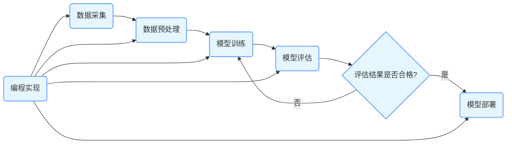

# AI时代的编程：程序员的机遇与挑战

> 关键词：AI时代、编程、程序员、机遇、挑战、人工智能、软件开发

> 摘要：本文聚焦于AI时代下编程领域的发展变化，深入探讨了程序员所面临的机遇与挑战。在背景介绍部分，阐述了研究的目的、范围、预期读者和文档结构等内容。接着详细讲解了AI与编程的核心概念及联系，包括其原理和架构。核心算法原理部分通过Python代码进行了详细阐述，同时给出了相关的数学模型和公式。项目实战部分提供了代码实际案例并进行详细解释。还探讨了实际应用场景，推荐了学习资源、开发工具框架以及相关论文著作。最后总结了未来发展趋势与挑战，并对常见问题进行了解答，提供了扩展阅读和参考资料，旨在为程序员在AI时代的发展提供全面且深入的参考。

## 1. 背景介绍 
### 1.1 目的和范围
在当今数字化快速发展的时代，人工智能（AI）技术正以前所未有的速度渗透到各个领域，编程作为实现各种技术和应用的基础手段，也受到了AI的深刻影响。本文章的目的在于全面且深入地探讨AI时代下编程领域的发展变化，明确程序员所面临的机遇与挑战，为程序员在这个充满变革的时代提供有价值的参考和指导。

范围涵盖了AI与编程相关的核心概念、算法原理、数学模型，通过项目实战展示实际应用，分析常见的应用场景，推荐相关的学习资源、开发工具和研究论文等，力求全方位地呈现AI时代编程领域的全貌。

### 1.2 预期读者
本文预期读者主要包括广大程序员群体，无论是初入编程行业的新手，还是有丰富经验的资深开发者，都能从本文中获取到关于AI时代编程发展的有价值信息。同时，对于对编程和人工智能领域感兴趣的学生、研究者以及相关行业的从业者，本文也能为他们提供一个了解AI与编程结合的窗口，帮助他们更好地理解这个领域的发展趋势和潜在机会。

### 1.3 文档结构概述
本文将按照以下结构进行详细阐述：首先介绍背景信息，包括目的、范围、预期读者等内容；接着深入讲解AI与编程的核心概念及联系，通过文本示意图和Mermaid流程图进行清晰展示；然后阐述核心算法原理并给出具体操作步骤，使用Python源代码详细说明；随后介绍相关的数学模型和公式，并举例说明；再通过项目实战，展示代码实际案例并进行详细解释；接着探讨实际应用场景；之后推荐学习资源、开发工具框架以及相关论文著作；最后总结未来发展趋势与挑战，解答常见问题，并提供扩展阅读和参考资料。

### 1.4 术语表
#### 1.4.1 核心术语定义
- **人工智能（AI）**：是一门研究如何使计算机能够模拟人类智能的学科和技术领域，包括机器学习、深度学习、自然语言处理、计算机视觉等多个分支，旨在让计算机能够完成需要人类智能才能完成的任务。
- **编程**：是指使用特定的编程语言，按照一定的逻辑和规则，编写计算机可以执行的指令序列，以实现特定的功能和目标。
- **机器学习（ML）**：是人工智能的一个重要分支，通过让计算机从数据中学习模式和规律，从而能够对新的数据进行预测和决策，而无需显式地编程。
- **深度学习（DL）**：是一种基于人工神经网络的机器学习方法，通过构建多层神经网络来自动学习数据的特征和模式，在图像识别、语音识别等领域取得了显著的成果。
- **自然语言处理（NLP）**：是人工智能的一个领域，旨在让计算机能够理解、处理和生成人类语言，包括文本分类、机器翻译、情感分析等应用。

#### 1.4.2 相关概念解释
- **算法**：是解决特定问题的一系列明确的指令和步骤，在编程和人工智能中，算法是实现各种功能和任务的核心。
- **数据挖掘**：是指从大量的数据中发现有价值的信息和知识的过程，通常使用机器学习和统计分析等方法。
- **模型**：在机器学习和深度学习中，模型是对数据的一种抽象表示，通过训练模型可以学习数据的特征和模式，从而进行预测和决策。
- **数据集**：是用于训练和测试机器学习模型的数据集合，通常包含输入数据和对应的标签或目标值。

#### 1.4.3 缩略词列表
- **AI**：Artificial Intelligence（人工智能）
- **ML**：Machine Learning（机器学习）
- **DL**：Deep Learning（深度学习）
- **NLP**：Natural Language Processing（自然语言处理）
- **API**：Application Programming Interface（应用程序编程接口）

## 2. 核心概念与联系 

### 核心概念原理
#### 人工智能原理
人工智能的核心目标是使计算机能够表现出类似于人类的智能行为。其实现主要基于以下几个关键原理：
- **数据驱动**：人工智能系统需要大量的数据来学习和训练。通过对数据的分析和处理，计算机可以发现数据中的模式和规律，从而实现对未知数据的预测和决策。
- **模型构建**：使用各种机器学习和深度学习算法构建模型，这些模型可以对数据进行表示和处理。例如，神经网络模型通过多层神经元的连接和计算，学习数据的特征和模式。
- **学习与优化**：模型通过不断地学习和优化来提高性能。在训练过程中，模型会根据输入数据和对应的标签进行调整，以最小化预测误差。

#### 编程原理
编程的基本原理是将人类的思维和逻辑转化为计算机能够理解和执行的指令。其主要包括以下几个方面：
- **编程语言**：程序员使用特定的编程语言来编写代码，不同的编程语言具有不同的语法和特性，适用于不同的应用场景。
- **算法设计**：根据问题的需求，设计合适的算法来解决问题。算法是编程的核心，它决定了程序的效率和性能。
- **程序结构**：程序通常由多个模块和函数组成，通过合理的程序结构设计，可以提高代码的可读性、可维护性和可扩展性。

### 架构的文本示意图
AI与编程的架构关系可以描述为：编程是实现AI的基础手段，程序员使用各种编程语言和开发工具来构建AI系统。AI系统通常包括数据采集、数据预处理、模型训练、模型评估和模型部署等环节，每个环节都需要编程来实现。同时，AI技术也可以为编程提供辅助和优化，例如智能代码补全、自动调试等。

### Mermaid流程图


这个流程图展示了AI系统的基本开发流程，从数据采集开始，经过数据预处理、模型训练和评估，直到模型部署。同时，编程实现贯穿了整个流程，体现了编程在AI系统开发中的重要作用。

## 3. 核心算法原理 & 具体操作步骤 

### 核心算法原理
在AI时代，机器学习和深度学习算法是编程中常用的核心算法。下面以简单的线性回归算法为例进行详细讲解。

线性回归是一种用于预测连续数值的机器学习算法，其基本原理是通过找到一条最佳的直线来拟合数据点，使得数据点到直线的距离之和最小。假设我们有一组数据 $(x_1, y_1), (x_2, y_2), \cdots, (x_n, y_n)$，其中 $x_i$ 是输入特征，$y_i$ 是对应的目标值。线性回归模型可以表示为：

$y = \theta_0 + \theta_1x$

其中 $\theta_0$ 是截距，$\theta_1$ 是斜率，我们的目标是找到最佳的 $\theta_0$ 和 $\theta_1$ 值，使得预测值 $\hat{y}$ 与真实值 $y$ 之间的误差最小。通常使用均方误差（MSE）作为损失函数：

$MSE = \frac{1}{n}\sum_{i=1}^{n}(y_i - \hat{y}_i)^2$

### 具体操作步骤
1. **数据准备**：收集和整理用于训练和测试的数据，将数据分为输入特征 $X$ 和目标值 $y$。
2. **模型初始化**：随机初始化 $\theta_0$ 和 $\theta_1$ 的值。
3. **模型训练**：使用梯度下降算法来更新 $\theta_0$ 和 $\theta_1$ 的值，使得损失函数 $MSE$ 最小。
4. **模型评估**：使用测试数据评估模型的性能，计算预测值与真实值之间的误差。
5. **模型预测**：使用训练好的模型对新的数据进行预测。

### Python源代码详细阐述
```python
import numpy as np

# 数据准备
X = np.array([1, 2, 3, 4, 5])
y = np.array([2, 4, 6, 8, 10])

# 模型初始化
theta_0 = 0
theta_1 = 0

# 超参数设置
learning_rate = 0.01
num_iterations = 1000

# 模型训练
for iteration in range(num_iterations):
    # 计算预测值
    y_pred = theta_0 + theta_1 * X
    
    # 计算误差
    error = y_pred - y
    
    # 计算梯度
    gradient_theta_0 = np.mean(error)
    gradient_theta_1 = np.mean(error * X)
    
    # 更新参数
    theta_0 = theta_0 - learning_rate * gradient_theta_0
    theta_1 = theta_1 - learning_rate * gradient_theta_1

# 模型评估
y_pred = theta_0 + theta_1 * X
mse = np.mean((y - y_pred) ** 2)
print(f"均方误差 (MSE): {mse}")

# 模型预测
new_X = np.array([6])
new_y_pred = theta_0 + theta_1 * new_X
print(f"预测值: {new_y_pred}")
```

在这段代码中，我们首先准备了一组简单的数据，然后初始化了模型的参数 $\theta_0$ 和 $\theta_1$。接着使用梯度下降算法进行模型训练，在每次迭代中计算预测值、误差和梯度，并更新参数。最后，我们评估了模型的性能，并使用训练好的模型对新的数据进行了预测。

## 4. 数学模型和公式 & 详细讲解 & 举例说明 

### 线性回归数学模型和公式
线性回归的数学模型可以表示为：

$y = \theta_0 + \theta_1x_1 + \theta_2x_2 + \cdots + \theta_nx_n + \epsilon$

其中 $y$ 是目标值，$x_1, x_2, \cdots, x_n$ 是输入特征，$\theta_0, \theta_1, \cdots, \theta_n$ 是模型的参数，$\epsilon$ 是误差项。在简单线性回归中，只有一个输入特征，即 $n = 1$。

### 详细讲解
- **损失函数**：均方误差（MSE）是线性回归中常用的损失函数，其公式为：

$MSE = \frac{1}{n}\sum_{i=1}^{n}(y_i - \hat{y}_i)^2$

其中 $y_i$ 是真实值，$\hat{y}_i$ 是预测值，$n$ 是样本数量。MSE 衡量了预测值与真实值之间的平均误差，我们的目标是最小化 MSE。

- **梯度下降算法**：梯度下降算法是一种常用的优化算法，用于寻找损失函数的最小值。其基本思想是沿着损失函数的负梯度方向更新参数，每次更新的步长由学习率决定。对于线性回归，$\theta_0$ 和 $\theta_1$ 的更新公式为：

$\theta_0 = \theta_0 - \alpha\frac{\partial MSE}{\partial \theta_0}$

$\theta_1 = \theta_1 - \alpha\frac{\partial MSE}{\partial \theta_1}$

其中 $\alpha$ 是学习率，$\frac{\partial MSE}{\partial \theta_0}$ 和 $\frac{\partial MSE}{\partial \theta_1}$ 分别是 MSE 对 $\theta_0$ 和 $\theta_1$ 的偏导数。

### 举例说明
假设我们有以下数据：

| $x$ | $y$ |
| --- | --- |
| 1 | 2 |
| 2 | 4 |
| 3 | 6 |
| 4 | 8 |
| 5 | 10 |

我们使用线性回归模型 $y = \theta_0 + \theta_1x$ 来拟合这些数据。首先，我们随机初始化 $\theta_0 = 0$ 和 $\theta_1 = 0$。然后，使用梯度下降算法进行训练，设置学习率 $\alpha = 0.01$，迭代次数为 1000 次。在每次迭代中，计算预测值、误差、梯度，并更新参数。经过 1000 次迭代后，我们得到了最优的 $\theta_0$ 和 $\theta_1$ 值，使得 MSE 最小。最后，我们可以使用训练好的模型对新的数据进行预测，例如当 $x = 6$ 时，预测值为 $y = \theta_0 + \theta_1 \times 6$。

## 5. 项目实战：代码实际案例和详细解释说明 

### 5.1  开发环境搭建
在进行项目实战之前，我们需要搭建相应的开发环境。以下是具体步骤：

#### 安装 Python
Python 是一种广泛使用的编程语言，在 AI 编程中非常流行。我们可以从 Python 官方网站（https://www.python.org/downloads/） 下载并安装最新版本的 Python。

#### 安装开发工具
推荐使用 PyCharm 作为开发工具，它是一款功能强大的 Python 集成开发环境（IDE），可以提高开发效率。我们可以从 PyCharm 官方网站（https://www.jetbrains.com/pycharm/download/） 下载并安装 PyCharm。

#### 安装必要的库
在 AI 编程中，我们通常需要使用一些第三方库，例如 NumPy、Pandas、Scikit-learn 等。可以使用以下命令来安装这些库：

```sh
pip install numpy pandas scikit-learn
```

### 5.2  源代码详细实现和代码解读
下面我们以一个简单的鸢尾花分类项目为例，展示如何使用 Python 和 Scikit-learn 库进行机器学习编程。

```python
# 导入必要的库
from sklearn.datasets import load_iris
from sklearn.model_selection import train_test_split
from sklearn.neighbors import KNeighborsClassifier
from sklearn.metrics import accuracy_score

# 加载鸢尾花数据集
iris = load_iris()
X = iris.data  # 特征数据
y = iris.target  # 目标数据

# 划分训练集和测试集
X_train, X_test, y_train, y_test = train_test_split(X, y, test_size=0.3, random_state=42)

# 创建 K 近邻分类器模型
knn = KNeighborsClassifier(n_neighbors=3)

# 模型训练
knn.fit(X_train, y_train)

# 模型预测
y_pred = knn.predict(X_test)

# 模型评估
accuracy = accuracy_score(y_test, y_pred)
print(f"模型准确率: {accuracy}")
```

### 5.3  代码解读与分析
1. **导入必要的库**：我们导入了 `load_iris` 函数用于加载鸢尾花数据集，`train_test_split` 函数用于划分训练集和测试集，`KNeighborsClassifier` 类用于创建 K 近邻分类器模型，`accuracy_score` 函数用于评估模型的准确率。
2. **加载鸢尾花数据集**：使用 `load_iris` 函数加载鸢尾花数据集，并将特征数据存储在 `X` 中，目标数据存储在 `y` 中。
3. **划分训练集和测试集**：使用 `train_test_split` 函数将数据集划分为训练集和测试集，其中测试集占总数据集的 30%。
4. **创建 K 近邻分类器模型**：使用 `KNeighborsClassifier` 类创建一个 K 近邻分类器模型，设置 `n_neighbors` 参数为 3。
5. **模型训练**：使用 `fit` 方法对模型进行训练，将训练集的特征数据和目标数据作为输入。
6. **模型预测**：使用 `predict` 方法对测试集的特征数据进行预测，得到预测结果。
7. **模型评估**：使用 `accuracy_score` 函数计算模型的准确率，即预测正确的样本数占总样本数的比例。

## 6. 实际应用场景 
### 智能客服
在智能客服领域，AI 技术可以帮助程序员开发出更加智能和高效的客服系统。通过自然语言处理技术，智能客服可以理解用户的问题，并自动提供相应的答案和解决方案。例如，很多电商平台和金融机构都使用了智能客服系统，能够快速响应用户的咨询，提高用户满意度。

### 图像识别
图像识别是 AI 技术的一个重要应用领域，程序员可以使用深度学习算法开发图像识别系统。这些系统可以用于安防监控、医疗诊断、自动驾驶等多个领域。例如，在安防监控中，图像识别系统可以实时监测视频画面，识别出可疑人员和行为；在医疗诊断中，图像识别系统可以帮助医生分析医学影像，提高诊断的准确性。

### 推荐系统
推荐系统是电商、社交媒体等平台常用的功能，AI 技术可以帮助程序员开发出更加个性化和精准的推荐系统。通过分析用户的行为数据和偏好，推荐系统可以为用户推荐符合其兴趣的商品、文章、视频等内容。例如，淘宝、抖音等平台都使用了推荐系统，为用户提供了更加个性化的服务。

### 智能交通
在智能交通领域，AI 技术可以帮助程序员开发交通流量预测、自动驾驶等系统。通过分析交通数据，交通流量预测系统可以提前预测交通拥堵情况，为交通管理部门提供决策支持；自动驾驶系统则可以实现车辆的自主行驶，提高交通安全和效率。

## 7. 工具和资源推荐
### 7.1 学习资源推荐
#### 7.1.1 书籍推荐
- 《Python 机器学习》：这本书详细介绍了使用 Python 进行机器学习的方法和技术，适合初学者入门。
- 《深度学习》：由深度学习领域的三位权威专家 Ian Goodfellow、Yoshua Bengio 和 Aaron Courville 合著，是深度学习领域的经典教材。
- 《人工智能：一种现代的方法》：全面介绍了人工智能的基本概念、算法和应用，是人工智能领域的经典著作。

#### 7.1.2 在线课程
- Coursera 上的《机器学习》课程：由 Andrew Ng 教授主讲，是机器学习领域的经典课程，适合初学者学习。
- edX 上的《深度学习》课程：由 Berkeley 大学的教授主讲，深入介绍了深度学习的原理和应用。
- 网易云课堂上的《Python 人工智能实战》课程：结合实际项目，介绍了使用 Python 进行人工智能开发的方法和技巧。

#### 7.1.3 技术博客和网站
- 机器之心：专注于人工智能领域的技术和应用，提供最新的行业动态和技术文章。
- 深度学习前沿：分享深度学习领域的最新研究成果和技术进展。
- 开源中国：提供丰富的开源项目和技术文章，涵盖了编程和人工智能等多个领域。

### 7.2 开发工具框架推荐
#### 7.2.1 IDE和编辑器
- PyCharm：功能强大的 Python 集成开发环境，提供代码编辑、调试、版本控制等功能。
- Visual Studio Code：轻量级的代码编辑器，支持多种编程语言，具有丰富的插件扩展功能。
- Jupyter Notebook：交互式的编程环境，适合进行数据探索和模型开发。

#### 7.2.2 调试和性能分析工具
- PDB：Python 内置的调试器，可以帮助程序员调试代码。
- Py-Spy：用于分析 Python 程序的性能，找出性能瓶颈。
- TensorBoard：TensorFlow 提供的可视化工具，可以帮助程序员分析模型的训练过程和性能。

#### 7.2.3 相关框架和库
- TensorFlow：由 Google 开发的开源深度学习框架，广泛应用于图像识别、自然语言处理等领域。
- PyTorch：由 Facebook 开发的开源深度学习框架，具有动态图和易于使用的特点。
- Scikit-learn：用于机器学习的开源 Python 库，提供了丰富的机器学习算法和工具。

### 7.3 相关论文著作推荐
#### 7.3.1 经典论文
- 《Gradient-based learning applied to document recognition》：由 Yann LeCun 等人发表，介绍了卷积神经网络（CNN）在手写数字识别中的应用，是深度学习领域的经典论文。
- 《ImageNet Classification with Deep Convolutional Neural Networks》：由 Alex Krizhevsky 等人发表，介绍了 AlexNet 模型，在图像识别领域取得了重大突破。
- 《Attention Is All You Need》：由 Vaswani 等人发表，介绍了 Transformer 模型，在自然语言处理领域得到了广泛应用。

#### 7.3.2 最新研究成果
- 可以关注顶级学术会议，如 NeurIPS（神经信息处理系统大会）、ICML（国际机器学习会议）、CVPR（计算机视觉与模式识别会议）等，这些会议会发布人工智能领域的最新研究成果。
- 一些学术期刊，如《Journal of Artificial Intelligence Research》、《Artificial Intelligence》等，也会发表高质量的研究论文。

#### 7.3.3 应用案例分析
- 《AI in Business: How Smart Companies Use Artificial Intelligence to Outperform the Competition》：介绍了人工智能在商业领域的应用案例和实践经验。
- 《Deep Learning in Healthcare: A Comprehensive Overview》：介绍了深度学习在医疗保健领域的应用案例和研究进展。

## 8. 总结：未来发展趋势与挑战
### 未来发展趋势
- **AI 与编程的深度融合**：未来，AI 技术将更加深入地融入到编程领域，智能编程助手将变得更加智能和强大，能够自动完成代码生成、调试和优化等任务，大大提高编程效率。
- **跨领域应用的拓展**：AI 编程将不仅仅局限于传统的科技领域，还将广泛应用于医疗、教育、金融、交通等各个领域，推动这些领域的数字化转型和创新发展。
- **量子计算与 AI 的结合**：随着量子计算技术的发展，量子计算与 AI 的结合将成为未来的一个重要发展方向。量子计算的强大计算能力将为 AI 算法的优化和加速提供新的机遇。

### 挑战
- **数据隐私和安全问题**：AI 系统需要大量的数据来训练，这些数据可能包含用户的隐私信息。因此，如何保护数据的隐私和安全是一个亟待解决的问题。
- **算法的可解释性**：很多 AI 算法，尤其是深度学习算法，是黑盒模型，难以解释其决策过程和结果。在一些关键领域，如医疗、金融等，算法的可解释性至关重要。
- **人才短缺**：AI 时代对程序员的要求越来越高，需要具备 AI 技术和编程技能的复合型人才。目前，这类人才相对短缺，如何培养和吸引更多的人才是一个挑战。

## 9. 附录：常见问题与解答
### 问题 1：AI 时代程序员需要学习哪些新技能？
答：AI 时代程序员需要学习机器学习、深度学习、自然语言处理等 AI 相关技术，同时还需要掌握相关的数学知识，如线性代数、概率论等。此外，还需要学习一些新的编程语言和工具，如 Python、TensorFlow、PyTorch 等。

### 问题 2：AI 会取代程序员吗？
答：AI 不会完全取代程序员，但会对程序员的工作产生影响。AI 可以帮助程序员完成一些重复性和规律性的任务，提高编程效率。但程序员的创造力、逻辑思维和问题解决能力是 AI 无法替代的。在 AI 时代，程序员需要不断学习和提升自己的技能，以适应新的发展需求。

### 问题 3：如何选择适合的 AI 算法？
答：选择适合的 AI 算法需要考虑多个因素，如问题的类型（分类、回归、聚类等）、数据的特点（规模、维度、分布等）、模型的复杂度和性能要求等。一般来说，可以先尝试一些简单的算法，如线性回归、逻辑回归、K 近邻等，然后根据实验结果选择更合适的算法。

### 问题 4：如何处理 AI 模型的过拟合和欠拟合问题？
答：过拟合是指模型在训练集上表现很好，但在测试集上表现很差；欠拟合是指模型在训练集和测试集上的表现都很差。处理过拟合问题可以采用增加数据量、正则化、早停等方法；处理欠拟合问题可以采用增加模型复杂度、更换算法等方法。

## 10. 扩展阅读 & 参考资料
### 扩展阅读
- 《AI 未来进行式》：李开复和王咏刚合著，探讨了 AI 对未来社会和人类生活的影响。
- 《人类简史：从动物到上帝》：尤瓦尔·赫拉利著，从人类历史的角度探讨了科技和人类发展的关系。

### 参考资料
- 《Python 机器学习实战》：Sebastian Raschka 著，提供了丰富的 Python 机器学习代码示例和实践经验。
- 《深度学习入门：基于 Python 的理论与实现》：斋藤康毅著，适合初学者学习深度学习的基本原理和实现方法。
- 相关学术论文和研究报告，如 IEEE 、ACM 等学术组织发表的论文，以及各大科技公司发布的研究报告。