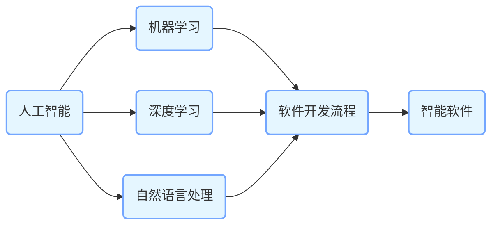

# AI时代的软件开发：共创美好未来

> 关键词：AI时代、软件开发、共创未来、人工智能、软件技术、协作开发、发展趋势
> 摘要：本文聚焦于AI时代的软件开发，深入探讨了在这一全新背景下软件开发的核心概念、算法原理、数学模型等内容。通过详细的代码案例分析，展示了AI技术在软件开发中的实际应用。同时，介绍了适用于该领域的工具和资源，分析了实际应用场景以及未来的发展趋势与挑战。旨在帮助开发者更好地理解和应对AI时代软件开发的机遇与挑战，共同推动软件行业的美好未来。

## 1. 背景介绍 
### 1.1 目的和范围
在当今科技飞速发展的时代，人工智能（AI）技术已经成为推动各个行业变革的重要力量。软件开发作为科技领域的核心部分，也在AI的影响下发生着深刻的变化。本文的目的在于全面深入地探讨AI时代软件开发的各个方面，包括核心概念、算法原理、实际应用等。范围涵盖了从基础知识到高级应用，从理论原理到实际项目开发，旨在为软件开发人员、技术爱好者以及相关从业者提供一个系统的知识体系和实践指导。

### 1.2 预期读者
本文预期读者主要包括软件开发工程师、软件架构师、人工智能研究者、技术管理人员以及对AI时代软件开发感兴趣的学生和爱好者。对于软件开发工程师，本文可以帮助他们了解如何将AI技术融入到现有的开发流程中，提升软件的智能性和竞争力；软件架构师可以从中获取关于AI时代软件架构设计的新思路；人工智能研究者可以找到软件开发与AI结合的新应用场景；技术管理人员可以把握行业发展趋势，制定合理的技术战略；学生和爱好者则可以通过本文初步了解AI时代软件开发的全貌，为进一步学习和研究打下基础。

### 1.3 文档结构概述
本文将按照以下结构展开：首先介绍AI时代软件开发的核心概念以及它们之间的联系，通过文本示意图和Mermaid流程图进行清晰展示；接着阐述核心算法原理，并使用Python源代码详细说明具体操作步骤；然后介绍相关的数学模型和公式，并结合实际例子进行讲解；之后通过项目实战，详细展示代码的实际案例并进行解读；再探讨AI时代软件开发的实际应用场景；推荐学习所需的工具和资源，包括书籍、在线课程、技术博客、开发工具、框架和相关论文等；最后总结未来的发展趋势与挑战，提供常见问题解答和扩展阅读的参考资料。

### 1.4 术语表
#### 1.4.1 核心术语定义
- **人工智能（AI）**：指让计算机模拟人类智能的技术和方法，包括机器学习、深度学习、自然语言处理等多个领域。
- **软件开发**：指从软件的需求分析、设计、编码、测试到维护的整个过程。
- **机器学习（ML）**：人工智能的一个分支，通过让计算机从数据中学习模式和规律，从而实现预测和决策。
- **深度学习（DL）**：机器学习的一个子领域，使用多层神经网络来学习数据的复杂特征。
- **自然语言处理（NLP）**：研究如何让计算机理解和处理人类语言的技术。

#### 1.4.2 相关概念解释
- **AI赋能软件开发**：指将AI技术应用于软件开发的各个环节，如需求分析、代码生成、测试等，以提高开发效率和软件质量。
- **智能软件**：指具有一定智能特性的软件，能够根据用户的输入和环境的变化自动调整行为和提供个性化的服务。
- **数据驱动开发**：在软件开发过程中，以数据为基础，通过分析和挖掘数据来指导软件的设计和开发。

#### 1.4.3 缩略词列表
- **AI**：Artificial Intelligence
- **ML**：Machine Learning
- **DL**：Deep Learning
- **NLP**：Natural Language Processing
- **IDE**：Integrated Development Environment

## 2. 核心概念与联系 
在AI时代，软件开发涉及到多个核心概念，这些概念相互关联，共同推动着软件开发的变革。核心概念主要包括人工智能、机器学习、深度学习、自然语言处理以及传统的软件开发流程。

### 核心概念原理
- **人工智能**：人工智能是一个广泛的领域，旨在让计算机模拟人类的智能行为。它通过使用各种算法和模型，使计算机能够感知环境、理解数据、做出决策和采取行动。
- **机器学习**：机器学习是人工智能的重要分支，它基于数据驱动的方法，让计算机从数据中学习模式和规律。常见的机器学习算法包括决策树、支持向量机、神经网络等。
- **深度学习**：深度学习是机器学习的一个子领域，使用深度神经网络来学习数据的复杂特征。深度神经网络由多个隐藏层组成，能够自动提取数据中的高级特征，在图像识别、语音识别等领域取得了巨大的成功。
- **自然语言处理**：自然语言处理关注如何让计算机理解和处理人类语言。它包括文本分类、情感分析、机器翻译、问答系统等多个任务，通过使用机器学习和深度学习技术来实现。
- **软件开发流程**：传统的软件开发流程包括需求分析、设计、编码、测试和维护等阶段。在AI时代，这些阶段可以与AI技术相结合，实现更高效、智能的开发。

### 文本示意图
```plaintext
             人工智能
            /    |    \
      机器学习  深度学习  自然语言处理
          |           |
      软件开发流程    智能软件
```

### Mermaid流程图


从流程图可以看出，人工智能是核心概念，它的三个主要分支机器学习、深度学习和自然语言处理都与软件开发流程相互关联，最终共同推动智能软件的开发。

## 3. 核心算法原理 & 具体操作步骤 
在AI时代的软件开发中，机器学习和深度学习算法起着关键作用。下面以简单的线性回归算法为例，详细讲解其原理和具体操作步骤，并使用Python源代码进行实现。

### 线性回归算法原理
线性回归是一种基本的机器学习算法，用于建立自变量和因变量之间的线性关系。假设我们有一组数据 $(x_1, y_1), (x_2, y_2), \cdots, (x_n, y_n)$，其中 $x_i$ 是自变量，$y_i$ 是因变量。线性回归的目标是找到一条直线 $y = wx + b$，使得该直线尽可能地拟合这些数据点。这里的 $w$ 是斜率，$b$ 是截距。

我们通常使用最小二乘法来求解 $w$ 和 $b$。最小二乘法的目标是最小化预测值与实际值之间的平方误差之和，即：

$$
J(w, b) = \frac{1}{2n} \sum_{i=1}^{n} (y_i - (wx_i + b))^2
$$

为了找到使 $J(w, b)$ 最小的 $w$ 和 $b$，我们可以分别对 $w$ 和 $b$ 求偏导数，并令偏导数等于 0，得到以下方程组：

$$
\frac{\partial J(w, b)}{\partial w} = \frac{1}{n} \sum_{i=1}^{n} (y_i - (wx_i + b))(-x_i) = 0
$$

$$
\frac{\partial J(w, b)}{\partial b} = \frac{1}{n} \sum_{i=1}^{n} (y_i - (wx_i + b))(-1) = 0
$$

解这个方程组可以得到 $w$ 和 $b$ 的最优值。

### 具体操作步骤
1. **数据准备**：收集和整理需要分析的数据。
2. **初始化参数**：随机初始化 $w$ 和 $b$ 的值。
3. **计算损失函数**：根据当前的 $w$ 和 $b$ 计算损失函数 $J(w, b)$ 的值。
4. **更新参数**：使用梯度下降法更新 $w$ 和 $b$ 的值，使得损失函数的值逐渐减小。
5. **重复步骤3和4**：直到损失函数的值收敛到一个较小的值或者达到最大迭代次数。

### Python源代码实现
```python
import numpy as np

# 数据准备
x = np.array([1, 2, 3, 4, 5])
y = np.array([2, 4, 6, 8, 10])

# 初始化参数
w = 0
b = 0

# 学习率
learning_rate = 0.01

# 迭代次数
epochs = 1000

# 梯度下降法
for epoch in range(epochs):
    # 计算预测值
    y_pred = w * x + b
    
    # 计算损失函数
    loss = np.mean((y - y_pred) ** 2) / 2
    
    # 计算梯度
    dw = np.mean((y_pred - y) * x)
    db = np.mean(y_pred - y)
    
    # 更新参数
    w = w - learning_rate * dw
    b = b - learning_rate * db
    
    # 打印损失函数的值
    if epoch % 100 == 0:
        print(f'Epoch {epoch}: Loss = {loss}')

# 打印最终的参数值
print(f'Final w: {w}, Final b: {b}')
```

### 代码解释
- 首先，我们导入了 `numpy` 库，用于进行数值计算。
- 然后，我们准备了一组简单的数据集 `x` 和 `y`。
- 接着，我们初始化了参数 $w$ 和 $b$ 的值，并设置了学习率和迭代次数。
- 在循环中，我们首先计算预测值 $y_{pred}$，然后计算损失函数 $J(w, b)$ 的值。
- 接着，我们计算 $w$ 和 $b$ 的梯度，并使用梯度下降法更新 $w$ 和 $b$ 的值。
- 最后，我们打印出最终的参数值。

通过这个简单的例子，我们可以看到如何使用线性回归算法来拟合数据，并且通过梯度下降法来优化模型的参数。在实际的软件开发中，我们可以将这种算法应用于各种场景，如预测、分类等。

## 4. 数学模型和公式 & 详细讲解 & 举例说明 
在AI时代的软件开发中，数学模型和公式是理解和实现各种算法的基础。下面我们将介绍一些常见的数学模型和公式，并结合具体例子进行详细讲解。

### 线性回归模型
线性回归模型是一种基本的机器学习模型，用于建立自变量和因变量之间的线性关系。其数学模型可以表示为：

$$
y = wx + b + \epsilon
$$

其中，$y$ 是因变量，$x$ 是自变量，$w$ 是斜率，$b$ 是截距，$\epsilon$ 是误差项，通常假设 $\epsilon$ 服从均值为 0、方差为 $\sigma^2$ 的正态分布。

#### 详细讲解
线性回归的目标是找到最优的 $w$ 和 $b$，使得预测值与实际值之间的误差最小。我们通常使用最小二乘法来求解这个问题。最小二乘法的目标是最小化预测值与实际值之间的平方误差之和，即：

$$
J(w, b) = \frac{1}{2n} \sum_{i=1}^{n} (y_i - (wx_i + b))^2
$$

为了找到使 $J(w, b)$ 最小的 $w$ 和 $b$，我们可以分别对 $w$ 和 $b$ 求偏导数，并令偏导数等于 0，得到以下方程组：

$$
\frac{\partial J(w, b)}{\partial w} = \frac{1}{n} \sum_{i=1}^{n} (y_i - (wx_i + b))(-x_i) = 0
$$

$$
\frac{\partial J(w, b)}{\partial b} = \frac{1}{n} \sum_{i=1}^{n} (y_i - (wx_i + b))(-1) = 0
$$

解这个方程组可以得到 $w$ 和 $b$ 的最优值。

#### 举例说明
假设我们有一组数据 $(1, 2), (2, 4), (3, 6), (4, 8), (5, 10)$，我们可以使用线性回归模型来拟合这些数据。首先，我们可以将数据代入最小二乘法的公式中，计算出 $w$ 和 $b$ 的值。

$$
\bar{x} = \frac{1 + 2 + 3 + 4 + 5}{5} = 3
$$

$$
\bar{y} = \frac{2 + 4 + 6 + 8 + 10}{5} = 6
$$

$$
w = \frac{\sum_{i=1}^{5} (x_i - \bar{x})(y_i - \bar{y})}{\sum_{i=1}^{5} (x_i - \bar{x})^2} = \frac{(1 - 3)(2 - 6) + (2 - 3)(4 - 6) + (3 - 3)(6 - 6) + (4 - 3)(8 - 6) + (5 - 3)(10 - 6)}{(1 - 3)^2 + (2 - 3)^2 + (3 - 3)^2 + (4 - 3)^2 + (5 - 3)^2} = 2
$$

$$
b = \bar{y} - w\bar{x} = 6 - 2 \times 3 = 0
$$

因此，我们得到的线性回归模型为 $y = 2x$。

### 逻辑回归模型
逻辑回归模型是一种用于分类问题的机器学习模型。它通过使用逻辑函数将线性回归的输出映射到 $[0, 1]$ 之间，从而实现分类的目的。逻辑回归模型的数学公式可以表示为：

$$
P(y = 1|x) = \frac{1}{1 + e^{-(wx + b)}}
$$

其中，$P(y = 1|x)$ 表示给定输入 $x$ 时，输出为 1 的概率，$w$ 是权重向量，$b$ 是偏置项。

#### 详细讲解
逻辑回归的目标是找到最优的 $w$ 和 $b$，使得模型对训练数据的预测概率最大。我们通常使用最大似然估计来求解这个问题。最大似然估计的目标是最大化对数似然函数：

$$
L(w, b) = \sum_{i=1}^{n} [y_i \log P(y_i = 1|x_i) + (1 - y_i) \log (1 - P(y_i = 1|x_i))]
$$

为了找到使 $L(w, b)$ 最大的 $w$ 和 $b$，我们可以使用梯度上升法来更新 $w$ 和 $b$ 的值。

#### 举例说明
假设我们有一个二分类问题，输入特征为 $x$，输出标签为 $y$。我们可以使用逻辑回归模型来进行分类。首先，我们需要初始化 $w$ 和 $b$ 的值，然后使用梯度上升法来更新 $w$ 和 $b$ 的值，直到对数似然函数收敛。

### 神经网络模型
神经网络模型是一种深度学习模型，由多个神经元组成。每个神经元接收输入信号，经过加权求和和激活函数处理后，输出一个信号。神经网络模型的数学公式可以表示为：

$$
z^{(l)} = W^{(l)}a^{(l - 1)} + b^{(l)}
$$

$$
a^{(l)} = f(z^{(l)})
$$

其中，$z^{(l)}$ 是第 $l$ 层的加权输入，$W^{(l)}$ 是第 $l$ 层的权重矩阵，$a^{(l - 1)}$ 是第 $l - 1$ 层的输出，$b^{(l)}$ 是第 $l$ 层的偏置向量，$a^{(l)}$ 是第 $l$ 层的输出，$f$ 是激活函数。

#### 详细讲解
神经网络的训练过程通常使用反向传播算法。反向传播算法的核心思想是通过计算损失函数对每个参数的梯度，然后使用梯度下降法来更新参数的值，使得损失函数逐渐减小。

#### 举例说明
假设我们有一个简单的神经网络，包含输入层、隐藏层和输出层。输入层有 2 个神经元，隐藏层有 3 个神经元，输出层有 1 个神经元。我们可以使用反向传播算法来训练这个神经网络，使得它能够对输入数据进行分类。

## 5. 项目实战：代码实际案例和详细解释说明 
### 5.1  开发环境搭建
在进行AI时代的软件开发项目实战之前，我们需要搭建一个合适的开发环境。以下是搭建开发环境的详细步骤：

#### 安装Python
Python是AI时代软件开发中最常用的编程语言之一，我们可以从Python官方网站（https://www.python.org/downloads/）下载并安装适合自己操作系统的Python版本。建议安装Python 3.7及以上版本。

#### 安装Anaconda
Anaconda是一个开源的Python发行版本，它包含了Python解释器以及许多常用的科学计算和数据分析库。我们可以从Anaconda官方网站（https://www.anaconda.com/products/individual）下载并安装Anaconda。安装完成后，我们可以使用Anaconda Prompt（Windows）或终端（Linux/Mac）来管理Python环境。

#### 创建虚拟环境
为了避免不同项目之间的依赖冲突，我们可以使用Anaconda创建一个虚拟环境。在Anaconda Prompt或终端中输入以下命令：

```sh
conda create -n ai_dev python=3.8
```

其中，`ai_dev` 是虚拟环境的名称，`python=3.8` 表示使用Python 3.8版本。创建完成后，激活虚拟环境：

```sh
conda activate ai_dev
```

#### 安装必要的库
在虚拟环境中，我们需要安装一些必要的库，如 `numpy`、`pandas`、`scikit-learn`、`tensorflow`、`pytorch` 等。可以使用以下命令进行安装：

```sh
pip install numpy pandas scikit-learn tensorflow pytorch
```

### 5.2  源代码详细实现和代码解读
以下是一个使用Python和TensorFlow实现的简单手写数字识别项目的源代码：

```python
import tensorflow as tf
from tensorflow.keras.datasets import mnist
from tensorflow.keras.models import Sequential
from tensorflow.keras.layers import Dense, Flatten
from tensorflow.keras.utils import to_categorical

# 加载MNIST数据集
(train_images, train_labels), (test_images, test_labels) = mnist.load_data()

# 数据预处理
train_images = train_images / 255.0
test_images = test_images / 255.0

train_labels = to_categorical(train_labels)
test_labels = to_categorical(test_labels)

# 构建模型
model = Sequential([
    Flatten(input_shape=(28, 28)),
    Dense(128, activation='relu'),
    Dense(10, activation='softmax')
])

# 编译模型
model.compile(optimizer='adam',
              loss='categorical_crossentropy',
              metrics=['accuracy'])

# 训练模型
model.fit(train_images, train_labels, epochs=5, batch_size=64)

# 评估模型
test_loss, test_acc = model.evaluate(test_images, test_labels)
print(f'Test accuracy: {test_acc}')
```

### 代码解读与分析
#### 数据加载和预处理
```python
(train_images, train_labels), (test_images, test_labels) = mnist.load_data()
train_images = train_images / 255.0
test_images = test_images / 255.0
train_labels = to_categorical(train_labels)
test_labels = to_categorical(test_labels)
```
- `mnist.load_data()`：从TensorFlow的内置数据集中加载MNIST手写数字数据集，该数据集包含60000个训练样本和10000个测试样本。
- `train_images / 255.0` 和 `test_images / 255.0`：将图像数据的像素值归一化到0到1之间，这样可以加快模型的训练速度。
- `to_categorical(train_labels)` 和 `to_categorical(test_labels)`：将标签数据进行one-hot编码，将整数标签转换为二进制向量，方便模型进行分类。

#### 模型构建
```python
model = Sequential([
    Flatten(input_shape=(28, 28)),
    Dense(128, activation='relu'),
    Dense(10, activation='softmax')
])
```
- `Sequential`：使用Keras的Sequential模型，它是一种线性堆叠模型，适合构建简单的神经网络。
- `Flatten`：将输入的二维图像数据（28x28）展平为一维向量，方便后续的全连接层处理。
- `Dense(128, activation='relu')`：添加一个包含128个神经元的全连接层，使用ReLU激活函数，ReLU函数可以引入非线性因素，增强模型的表达能力。
- `Dense(10, activation='softmax')`：添加一个包含10个神经元的全连接层，使用Softmax激活函数，Softmax函数可以将输出转换为概率分布，用于多分类问题。

#### 模型编译
```python
model.compile(optimizer='adam',
              loss='categorical_crossentropy',
              metrics=['accuracy'])
```
- `optimizer='adam'`：使用Adam优化器，Adam优化器是一种自适应学习率的优化算法，能够在训练过程中自动调整学习率，提高训练效率。
- `loss='categorical_crossentropy'`：使用交叉熵损失函数，交叉熵损失函数适用于多分类问题，能够衡量模型预测结果与真实标签之间的差异。
- `metrics=['accuracy']`：使用准确率作为评估指标，准确率可以直观地反映模型的分类性能。

#### 模型训练
```python
model.fit(train_images, train_labels, epochs=5, batch_size=64)
```
- `model.fit`：使用训练数据对模型进行训练。
- `epochs=5`：设置训练的轮数为5，即模型将对整个训练数据集进行5次迭代训练。
- `batch_size=64`：设置每次训练的样本数量为64，即模型每次从训练数据中随机选取64个样本进行训练。

#### 模型评估
```python
test_loss, test_acc = model.evaluate(test_images, test_labels)
print(f'Test accuracy: {test_acc}')
```
- `model.evaluate`：使用测试数据对模型进行评估，计算模型在测试数据上的损失和准确率。
- `print(f'Test accuracy: {test_acc}')`：打印模型在测试数据上的准确率。

通过这个简单的手写数字识别项目，我们可以看到如何使用TensorFlow和Keras来构建、训练和评估一个简单的神经网络模型。在实际的软件开发中，我们可以根据具体的需求对模型进行调整和优化。

## 6. 实际应用场景 
在AI时代，软件开发的应用场景得到了极大的拓展。以下是一些常见的实际应用场景：

### 智能客服
智能客服系统可以使用自然语言处理技术来理解用户的问题，并自动给出回答。通过训练机器学习模型，智能客服可以处理各种常见问题，如订单查询、产品咨询等。例如，电商平台的智能客服可以根据用户的提问，快速提供商品信息、订单状态等服务，提高客户服务效率和用户满意度。

### 图像识别
图像识别技术在安防、医疗、交通等领域有着广泛的应用。在安防领域，图像识别可以用于人脸识别、车牌识别等，实现门禁控制、监控报警等功能。在医疗领域，图像识别可以帮助医生进行疾病诊断，如X光片、CT图像的分析。在交通领域，图像识别可以用于自动驾驶，识别道路标志、车辆和行人等。

### 语音识别
语音识别技术使得用户可以通过语音与计算机进行交互。常见的应用包括智能语音助手、语音输入法等。智能语音助手可以根据用户的语音指令完成各种任务，如查询天气、播放音乐、设置提醒等。语音输入法可以让用户通过语音输入文字，提高输入效率，尤其适用于不方便使用键盘的场景。

### 推荐系统
推荐系统是电商、社交、娱乐等平台常用的技术。通过分析用户的历史行为和偏好，推荐系统可以为用户推荐个性化的商品、内容和好友。例如，电商平台可以根据用户的购买记录和浏览历史，为用户推荐相关的商品；音乐平台可以根据用户的听歌记录，为用户推荐喜欢的音乐。

### 金融风险评估
在金融领域，AI技术可以用于风险评估和欺诈检测。通过分析大量的金融数据，机器学习模型可以预测客户的信用风险，帮助银行和金融机构做出合理的贷款决策。同时，AI技术还可以实时监测交易数据，发现异常交易行为，及时防范欺诈风险。

### 智能教育
智能教育系统可以根据学生的学习情况和能力，提供个性化的学习方案和辅导。例如，智能教育平台可以通过分析学生的作业和考试成绩，了解学生的薄弱环节，为学生推荐针对性的学习资料和练习题。此外，智能教育系统还可以使用自然语言处理技术实现智能答疑，帮助学生解决学习中的问题。

## 7. 工具和资源推荐
### 7.1 学习资源推荐
#### 7.1.1 书籍推荐
- 《深度学习》（Deep Learning）：由Ian Goodfellow、Yoshua Bengio和Aaron Courville所著，是深度学习领域的经典教材，全面介绍了深度学习的基本概念、算法和应用。
- 《Python机器学习》（Python Machine Learning）：作者Sebastian Raschka，这本书详细介绍了如何使用Python进行机器学习，包括各种机器学习算法的实现和应用。
- 《人工智能：一种现代的方法》（Artificial Intelligence: A Modern Approach）：由Stuart Russell和Peter Norvig所著，是人工智能领域的权威教材，涵盖了人工智能的各个方面，包括搜索算法、知识表示、机器学习等。

#### 7.1.2 在线课程
- Coursera上的“机器学习”课程：由Andrew Ng教授授课，是机器学习领域最受欢迎的在线课程之一，课程内容丰富，讲解清晰，适合初学者入门。
- edX上的“深度学习微硕士项目”：提供了一系列深度学习相关的课程，包括卷积神经网络、循环神经网络等，适合有一定基础的学习者深入学习。
- Udemy上的“Python for Data Science and Machine Learning Bootcamp”：该课程结合了Python编程和数据科学、机器学习的知识，通过大量的实践项目帮助学习者掌握相关技能。

#### 7.1.3 技术博客和网站
- Medium：是一个技术博客平台，有很多AI和软件开发领域的专家分享自己的经验和见解。
- Towards Data Science：专注于数据科学和机器学习领域的技术博客，提供了很多实用的教程和案例。
- GitHub：是一个开源代码托管平台，上面有很多优秀的AI和软件开发项目，可以学习和参考。

### 7.2 开发工具框架推荐
#### 7.2.1 IDE和编辑器
- PyCharm：是一款专门为Python开发设计的集成开发环境（IDE），具有强大的代码编辑、调试和项目管理功能。
- Visual Studio Code：是一款轻量级的代码编辑器，支持多种编程语言，有丰富的插件扩展，可以满足不同的开发需求。
- Jupyter Notebook：是一个交互式的开发环境，适合进行数据分析和机器学习实验，方便代码的编写、运行和展示。

#### 7.2.2 调试和性能分析工具
- TensorBoard：是TensorFlow提供的可视化工具，可以帮助开发者监控模型的训练过程，分析模型的性能和参数。
- Py-Spy：是一个用于Python代码性能分析的工具，可以帮助开发者找出代码中的性能瓶颈。
- Debugpy：是Python的调试器，可以在VS Code等编辑器中使用，方便开发者进行代码调试。

#### 7.2.3 相关框架和库
- TensorFlow：是Google开发的开源深度学习框架，具有高效的计算能力和丰富的工具集，广泛应用于图像识别、自然语言处理等领域。
- PyTorch：是Facebook开发的开源深度学习框架，以其动态图机制和简洁的API受到很多开发者的喜爱，在学术界和工业界都有广泛的应用。
- Scikit-learn：是一个简单易用的机器学习库，提供了各种机器学习算法和工具，适合初学者快速上手。

### 7.3 相关论文著作推荐
#### 7.3.1 经典论文
- “Gradient-based learning applied to document recognition”：由Yann LeCun等人发表，介绍了卷积神经网络（CNN）在手写数字识别中的应用，是CNN领域的经典论文。
- “Long Short-Term Memory”：由Sepp Hochreiter和Jürgen Schmidhuber发表，提出了长短期记忆网络（LSTM），解决了传统循环神经网络的梯度消失问题。
- “Attention Is All You Need”：由Google Brain团队发表，提出了Transformer模型，在自然语言处理领域取得了巨大的成功。

#### 7.3.2 最新研究成果
- 可以关注顶级学术会议如NeurIPS（神经信息处理系统大会）、ICML（国际机器学习会议）、CVPR（计算机视觉与模式识别会议）等的论文，了解AI和软件开发领域的最新研究动态。
- 一些知名的学术期刊如Journal of Artificial Intelligence Research（JAIR）、Artificial Intelligence等也会发表高质量的研究论文。

#### 7.3.3 应用案例分析
- 可以参考一些实际的应用案例，如Google的AlphaGo、OpenAI的GPT系列等，了解AI技术在实际项目中的应用和实现方法。
- 一些科技公司的官方博客也会分享他们在AI和软件开发方面的实践经验和案例，如Google AI Blog、Facebook AI Research等。

## 8. 总结：未来发展趋势与挑战
### 未来发展趋势
#### AI与软件开发的深度融合
未来，AI技术将更加深入地融入到软件开发的各个环节。从需求分析阶段，AI可以通过分析大量的用户数据和市场信息，自动生成软件需求文档；在设计阶段，AI可以提供设计建议和优化方案；在编码阶段，AI可以实现代码自动生成和代码审查；在测试阶段，AI可以进行自动化测试和漏洞检测。这种深度融合将大大提高软件开发的效率和质量。

#### 低代码/无代码开发平台的兴起
随着AI技术的发展，低代码/无代码开发平台将越来越受欢迎。这些平台允许非专业的开发者通过简单的拖拽和配置来创建软件应用，降低了软件开发的门槛。AI将在低代码/无代码开发平台中发挥重要作用，例如自动生成代码模板、提供智能提示和建议等。

#### 智能软件的普及
未来，智能软件将无处不在。智能软件不仅能够提供基本的功能，还能够根据用户的行为和环境自动调整和优化。例如，智能办公软件可以根据用户的工作习惯和任务自动安排日程、提供相关的资料和建议；智能医疗软件可以根据患者的病历和症状提供个性化的诊断和治疗方案。

#### 跨领域融合创新
AI时代的软件开发将不再局限于传统的计算机领域，而是与其他领域如生物医学、能源、交通等进行深度融合。例如，在生物医学领域，AI技术可以用于药物研发、基因测序等；在能源领域，AI可以用于智能电网的优化和管理；在交通领域，AI可以用于自动驾驶和智能交通系统的开发。

### 挑战
#### 数据隐私和安全问题
随着AI技术的发展，软件开发需要处理大量的数据。这些数据包含了用户的个人信息和敏感数据，因此数据隐私和安全问题变得尤为重要。软件开发人员需要采取有效的措施来保护用户的数据安全，防止数据泄露和滥用。

#### 算法可解释性问题
许多AI算法，尤其是深度学习算法，被认为是“黑盒”模型，难以解释其决策过程和结果。在一些关键领域，如医疗、金融等，算法的可解释性是非常重要的。软件开发人员需要研究和开发可解释的AI算法，以便用户能够理解和信任AI系统的决策。

#### 人才短缺问题
AI时代的软件开发需要具备AI和软件开发双重技能的人才。目前，这类人才相对短缺，导致企业在招聘和培养人才方面面临困难。为了解决这个问题，需要加强教育和培训，培养更多符合市场需求的复合型人才。

#### 伦理和法律问题
AI技术的发展也带来了一系列的伦理和法律问题。例如，AI系统的决策可能会导致不公平和歧视，AI算法的知识产权归属也存在争议。软件开发人员需要关注这些问题，并遵守相关的伦理和法律规定。

## 9. 附录：常见问题与解答
### 1. 在AI时代，传统的软件开发方法是否还适用？
传统的软件开发方法仍然有其适用的场景。虽然AI技术为软件开发带来了新的思路和方法，但在一些对性能、稳定性要求较高的项目中，传统的软件开发方法仍然是首选。同时，传统的软件开发方法也可以与AI技术相结合，发挥各自的优势。

### 2. 学习AI时代的软件开发需要具备哪些基础知识？
学习AI时代的软件开发需要具备一定的数学基础，如线性代数、概率论、统计学等。同时，还需要掌握一门编程语言，如Python，以及相关的机器学习和深度学习知识。此外，了解软件开发的基本流程和方法也是必要的。

### 3. 如何选择适合自己的AI开发框架？
选择适合自己的AI开发框架需要考虑多个因素，如项目需求、个人熟悉程度、框架的性能和社区支持等。如果是初学者，可以选择简单易用的框架，如Scikit-learn；如果是进行深度学习开发，可以根据项目的特点选择TensorFlow或PyTorch。

### 4. AI技术在软件开发中的应用会导致大量程序员失业吗？
AI技术在软件开发中的应用不会导致大量程序员失业。相反，它将为程序员带来更多的机会和挑战。AI技术可以帮助程序员提高开发效率，解决一些复杂的问题。同时，新的应用场景和需求也将不断涌现，需要程序员进行开发和维护。

### 5. 如何评估AI模型的性能？
评估AI模型的性能可以使用多种指标，如准确率、召回率、F1值、均方误差等。具体选择哪种指标需要根据项目的类型和需求来决定。在评估模型性能时，还需要注意数据集的划分和选择，避免过拟合和欠拟合的问题。

## 10. 扩展阅读 & 参考资料
### 扩展阅读
- 《AI未来进行式》：李开复和王咏刚所著，探讨了AI技术在未来社会的应用和影响。
- 《第四次工业革命》：克劳斯·施瓦布所著，分析了第四次工业革命的特点和趋势，其中AI技术是重要的组成部分。
- 《智能时代》：吴军所著，介绍了AI技术在各个领域的应用和发展，以及对社会和经济的影响。

### 参考资料
- 各开源框架的官方文档，如TensorFlow、PyTorch、Scikit-learn等。
- 学术数据库，如IEEE Xplore、ACM Digital Library等，可获取相关的学术论文和研究报告。
- 科技媒体网站，如TechCrunch、Wired等，可了解AI和软件开发领域的最新动态和行业趋势。