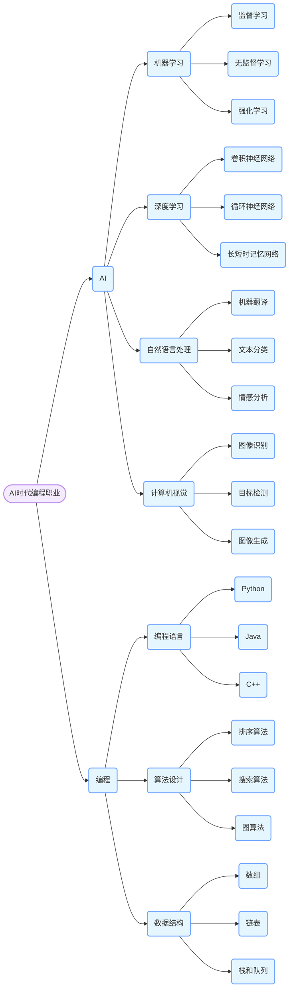

# AI时代编程职业的挑战与机遇

> 关键词：AI时代、编程职业、挑战、机遇、技术变革

> 摘要：本文深入探讨了AI时代编程职业所面临的挑战与机遇。随着人工智能技术的飞速发展，编程领域正在经历深刻的变革。文章首先介绍了研究的背景、目的、预期读者等内容，接着阐述了AI与编程相关的核心概念及联系，详细讲解了相关核心算法原理和操作步骤，分析了涉及的数学模型和公式。通过项目实战案例，展示了AI在编程中的实际应用。还探讨了编程职业在AI时代的实际应用场景，推荐了学习资源、开发工具框架和相关论文著作。最后总结了未来发展趋势与挑战，并对常见问题进行了解答，为编程从业者在AI时代的发展提供了全面的参考。

## 1. 背景介绍 
### 1.1 目的和范围
在当今的科技发展浪潮中，人工智能（AI）正以前所未有的速度改变着各个行业，编程领域也不例外。本文章的目的在于全面剖析AI时代编程职业所面临的挑战以及蕴含的机遇。通过深入研究相关技术原理、实际应用案例等，为编程从业者、相关专业学生以及对编程和AI感兴趣的人士提供清晰的认识和有价值的建议。范围涵盖了AI与编程的核心概念、算法原理、数学模型、实际应用场景等多个方面。

### 1.2 预期读者
本文预期读者主要包括以下几类人群：
- 编程从业者：希望通过了解AI时代的变化，提升自身的编程技能和职业竞争力，规划未来的职业发展方向。
- 计算机相关专业学生：为他们在学习编程和选择专业方向时提供参考，帮助他们更好地适应未来的就业市场。
- 对编程和AI感兴趣的爱好者：让他们了解AI时代编程职业的概况，激发他们进一步学习和探索的兴趣。

### 1.3 文档结构概述
本文按照以下结构进行组织：
- 核心概念与联系：介绍AI和编程相关的核心概念以及它们之间的联系，并通过示意图和流程图进行直观展示。
- 核心算法原理 & 具体操作步骤：详细讲解与AI编程相关的核心算法原理，并使用Python源代码进行阐述。
- 数学模型和公式 & 详细讲解 & 举例说明：分析AI编程中涉及的数学模型和公式，并通过具体例子进行说明。
- 项目实战：代码实际案例和详细解释说明：通过实际项目案例，展示AI在编程中的应用，包括开发环境搭建、源代码实现和代码解读。
- 实际应用场景：探讨编程职业在AI时代的各种实际应用场景。
- 工具和资源推荐：推荐学习资源、开发工具框架和相关论文著作。
- 总结：未来发展趋势与挑战：总结AI时代编程职业的未来发展趋势和面临的挑战。
- 附录：常见问题与解答：解答读者可能关心的常见问题。
- 扩展阅读 & 参考资料：提供相关的扩展阅读内容和参考资料。

### 1.4 术语表
#### 1.4.1 核心术语定义
- **人工智能（AI）**：是指计算机系统能够执行通常需要人类智能才能完成的任务，如学习、推理、解决问题等。
- **机器学习（ML）**：是AI的一个子集，它使计算机能够通过数据学习模式和规律，而无需明确编程。
- **深度学习（DL）**：是一种基于神经网络的机器学习方法，它可以自动从大量数据中学习复杂的模式和特征。
- **编程**：是指使用计算机语言编写指令，让计算机执行特定任务的过程。

#### 1.4.2 相关概念解释
- **自动化编程**：利用AI技术自动生成代码的过程，减少人工编写代码的工作量。
- **AI辅助编程**：AI工具为程序员提供代码建议、错误检查等辅助功能，提高编程效率。
- **强化学习**：一种机器学习方法，智能体通过与环境进行交互，根据奖励信号来学习最优策略。

#### 1.4.3 缩略词列表
- **AI**：Artificial Intelligence（人工智能）
- **ML**：Machine Learning（机器学习）
- **DL**：Deep Learning（深度学习）

## 2. 核心概念与联系 

### 核心概念原理
#### 人工智能（AI）
人工智能旨在让计算机模拟人类的智能行为。它涵盖了多个领域，包括自然语言处理、计算机视觉、知识表示与推理等。其核心原理是通过数据和算法让计算机学习和适应不同的任务。例如，在自然语言处理中，AI系统可以学习语言的语法和语义，从而实现机器翻译、语音识别等功能。

#### 编程
编程是将人类的思维和逻辑转化为计算机能够理解和执行的指令的过程。程序员使用各种编程语言，如Python、Java、C++等，来编写代码。编程的核心在于设计算法和数据结构，以解决特定的问题。

#### 机器学习（ML）与深度学习（DL）
机器学习是AI的重要分支，它通过数据和统计模型让计算机自动学习和改进。深度学习则是一种特殊的机器学习方法，它使用深度神经网络来处理复杂的数据。深度学习在图像识别、语音识别等领域取得了巨大的成功。

### 架构的文本示意图
以下是AI与编程关系的文本示意图：

```plaintext
AI
├── 机器学习
│   ├── 监督学习
│   ├── 无监督学习
│   ├── 强化学习
├── 深度学习
│   ├── 卷积神经网络（CNN）
│   ├── 循环神经网络（RNN）
│   ├── 长短时记忆网络（LSTM）
├── 自然语言处理
│   ├── 机器翻译
│   ├── 文本分类
│   ├── 情感分析
├── 计算机视觉
│   ├── 图像识别
│   ├── 目标检测
│   ├── 图像生成

编程
├── 编程语言
│   ├── Python
│   ├── Java
│   ├── C++
├── 算法设计
│   ├── 排序算法
│   ├── 搜索算法
│   ├── 图算法
├── 数据结构
│   ├── 数组
│   ├── 链表
│   ├── 栈和队列
```

### Mermaid流程图


## 3. 核心算法原理 & 具体操作步骤 

### 核心算法原理

#### 监督学习算法 - 线性回归
线性回归是一种简单而常用的监督学习算法，用于预测连续数值。其基本原理是通过找到一条最佳拟合直线，使得所有数据点到该直线的误差平方和最小。

假设我们有一组数据点 $(x_1, y_1), (x_2, y_2), \cdots, (x_n, y_n)$，线性回归模型可以表示为：

$y = \theta_0 + \theta_1x$

其中，$\theta_0$ 是截距，$\theta_1$ 是斜率。我们的目标是找到最优的 $\theta_0$ 和 $\theta_1$，使得误差函数最小。误差函数通常使用均方误差（MSE）：

$J(\theta_0, \theta_1) = \frac{1}{2n} \sum_{i=1}^{n} (y_i - (\theta_0 + \theta_1x_i))^2$

可以使用梯度下降算法来最小化误差函数。梯度下降算法的基本思想是沿着误差函数的负梯度方向更新参数，直到收敛。

#### 深度学习算法 - 卷积神经网络（CNN）
卷积神经网络主要用于处理具有网格结构的数据，如图像。它的核心组件包括卷积层、池化层和全连接层。

- **卷积层**：通过卷积核在输入数据上滑动，进行卷积操作，提取数据的特征。
- **池化层**：对卷积层的输出进行下采样，减少数据的维度，同时保留重要的特征。
- **全连接层**：将池化层的输出展开成一维向量，然后通过全连接神经网络进行分类或回归。

### 具体操作步骤

#### 线性回归的Python实现
```python
import numpy as np

# 生成一些示例数据
x = np.array([1, 2, 3, 4, 5])
y = np.array([2, 4, 6, 8, 10])

# 初始化参数
theta_0 = 0
theta_1 = 0

# 学习率
alpha = 0.01

# 迭代次数
num_iterations = 1000

# 样本数量
n = len(x)

# 梯度下降算法
for _ in range(num_iterations):
    # 计算预测值
    y_pred = theta_0 + theta_1 * x
    
    # 计算误差
    error = y_pred - y
    
    # 更新参数
    theta_0 = theta_0 - alpha * (1/n) * np.sum(error)
    theta_1 = theta_1 - alpha * (1/n) * np.sum(error * x)

print(f"截距 theta_0: {theta_0}")
print(f"斜率 theta_1: {theta_1}")
```

#### 卷积神经网络的Python实现（使用Keras）
```python
from tensorflow.keras.datasets import mnist
from tensorflow.keras.models import Sequential
from tensorflow.keras.layers import Conv2D, MaxPooling2D, Flatten, Dense
from tensorflow.keras.utils import to_categorical

# 加载MNIST数据集
(train_images, train_labels), (test_images, test_labels) = mnist.load_data()

# 数据预处理
train_images = train_images.reshape((60000, 28, 28, 1)).astype('float32') / 255
test_images = test_images.reshape((10000, 28, 28, 1)).astype('float32') / 255

train_labels = to_categorical(train_labels)
test_labels = to_categorical(test_labels)

# 构建卷积神经网络模型
model = Sequential()
model.add(Conv2D(32, (3, 3), activation='relu', input_shape=(28, 28, 1)))
model.add(MaxPooling2D((2, 2)))
model.add(Conv2D(64, (3, 3), activation='relu'))
model.add(MaxPooling2D((2, 2)))
model.add(Flatten())
model.add(Dense(64, activation='relu'))
model.add(Dense(10, activation='softmax'))

# 编译模型
model.compile(optimizer='adam',
              loss='categorical_crossentropy',
              metrics=['accuracy'])

# 训练模型
model.fit(train_images, train_labels, epochs=5, batch_size=64)

# 评估模型
test_loss, test_acc = model.evaluate(test_images, test_labels)
print(f"Test accuracy: {test_acc}")
```

## 4. 数学模型和公式 & 详细讲解 & 举例说明 

### 线性回归的数学模型和公式
线性回归的数学模型为：

$y = \theta_0 + \theta_1x$

其中，$y$ 是因变量，$x$ 是自变量，$\theta_0$ 和 $\theta_1$ 是模型的参数。

误差函数（均方误差）为：

$J(\theta_0, \theta_1) = \frac{1}{2n} \sum_{i=1}^{n} (y_i - (\theta_0 + \theta_1x_i))^2$

梯度下降算法的更新公式为：

$\theta_0 := \theta_0 - \alpha \frac{1}{n} \sum_{i=1}^{n} (y_i - (\theta_0 + \theta_1x_i))$

$\theta_1 := \theta_1 - \alpha \frac{1}{n} \sum_{i=1}^{n} (y_i - (\theta_0 + \theta_1x_i))x_i$

其中，$\alpha$ 是学习率，控制参数更新的步长。

#### 举例说明
假设我们有以下数据点：$(1, 2), (2, 4), (3, 6), (4, 8), (5, 10)$。我们可以使用线性回归来拟合这些数据。

首先，初始化参数 $\theta_0 = 0$ 和 $\theta_1 = 0$。然后，使用梯度下降算法进行迭代更新。经过多次迭代后，我们可以得到最优的 $\theta_0$ 和 $\theta_1$，使得误差函数最小。

### 卷积神经网络的数学模型和公式
#### 卷积操作
卷积操作可以表示为：

$y_{i,j} = \sum_{m=0}^{M-1} \sum_{n=0}^{N-1} x_{i+m, j+n} w_{m,n}$

其中，$x$ 是输入数据，$w$ 是卷积核，$y$ 是卷积输出。

#### 池化操作
最大池化操作可以表示为：

$y_{i,j} = \max_{m=0}^{M-1} \max_{n=0}^{N-1} x_{iM+m, jN+n}$

其中，$x$ 是输入数据，$y$ 是池化输出，$M$ 和 $N$ 是池化窗口的大小。

#### 举例说明
假设我们有一个 $3 \times 3$ 的输入图像：

$\begin{bmatrix}
1 & 2 & 3 \\
4 & 5 & 6 \\
7 & 8 & 9
\end{bmatrix}$

使用一个 $2 \times 2$ 的卷积核：

$\begin{bmatrix}
1 & 0 \\
0 & 1
\end{bmatrix}$

进行卷积操作后，得到的输出为：

$\begin{bmatrix}
6 & 8 \\
12 & 14
\end{bmatrix}$

如果使用 $2 \times 2$ 的最大池化窗口进行池化操作，得到的输出为：

$\begin{bmatrix}
8 \\
14
\end{bmatrix}$

## 5. 项目实战：代码实际案例和详细解释说明 

### 5.1  开发环境搭建
#### 安装Python
首先，需要安装Python。可以从Python官方网站（https://www.python.org/downloads/）下载适合自己操作系统的Python版本，并按照安装向导进行安装。

#### 安装相关库
使用pip（Python包管理工具）安装项目所需的库，如NumPy、Pandas、TensorFlow、Keras等。

```bash
pip install numpy pandas tensorflow keras
```

#### 安装开发工具
推荐使用PyCharm或Jupyter Notebook作为开发工具。PyCharm是一款功能强大的Python集成开发环境，Jupyter Notebook则适合进行交互式编程和数据分析。

### 5.2  源代码详细实现和代码解读

#### 项目描述
我们将实现一个简单的手写数字识别项目，使用卷积神经网络（CNN）对MNIST数据集进行分类。

#### 源代码实现
```python
from tensorflow.keras.datasets import mnist
from tensorflow.keras.models import Sequential
from tensorflow.keras.layers import Conv2D, MaxPooling2D, Flatten, Dense
from tensorflow.keras.utils import to_categorical

# 加载MNIST数据集
(train_images, train_labels), (test_images, test_labels) = mnist.load_data()

# 数据预处理
train_images = train_images.reshape((60000, 28, 28, 1)).astype('float32') / 255
test_images = test_images.reshape((10000, 28, 28, 1)).astype('float32') / 255

train_labels = to_categorical(train_labels)
test_labels = to_categorical(test_labels)

# 构建卷积神经网络模型
model = Sequential()
model.add(Conv2D(32, (3, 3), activation='relu', input_shape=(28, 28, 1)))
model.add(MaxPooling2D((2, 2)))
model.add(Conv2D(64, (3, 3), activation='relu'))
model.add(MaxPooling2D((2, 2)))
model.add(Flatten())
model.add(Dense(64, activation='relu'))
model.add(Dense(10, activation='softmax'))

# 编译模型
model.compile(optimizer='adam',
              loss='categorical_crossentropy',
              metrics=['accuracy'])

# 训练模型
model.fit(train_images, train_labels, epochs=5, batch_size=64)

# 评估模型
test_loss, test_acc = model.evaluate(test_images, test_labels)
print(f"Test accuracy: {test_acc}")
```

#### 代码解读
1. **数据加载**：使用`mnist.load_data()`函数加载MNIST数据集，该数据集包含60000个训练样本和10000个测试样本。
2. **数据预处理**：将图像数据的形状调整为适合CNN输入的形状，并将像素值归一化到0-1之间。同时，将标签进行one-hot编码。
3. **模型构建**：使用`Sequential`模型构建卷积神经网络，包含卷积层、池化层、全连接层。
4. **模型编译**：使用`adam`优化器和`categorical_crossentropy`损失函数编译模型，并指定评估指标为准确率。
5. **模型训练**：使用`fit`方法对模型进行训练，指定训练数据、训练轮数和批次大小。
6. **模型评估**：使用`evaluate`方法对模型进行评估，计算测试集上的损失和准确率。

### 5.3  代码解读与分析
#### 卷积层的作用
卷积层通过卷积核提取图像的特征，不同的卷积核可以提取不同的特征，如边缘、纹理等。通过多层卷积层的堆叠，可以提取更高级的特征。

#### 池化层的作用
池化层对卷积层的输出进行下采样，减少数据的维度，降低计算量，同时保留重要的特征。

#### 全连接层的作用
全连接层将池化层的输出展开成一维向量，然后通过全连接神经网络进行分类或回归。

#### 模型性能分析
通过训练和评估，我们可以得到模型在测试集上的准确率。如果准确率较低，可以尝试调整模型的结构、增加训练数据、调整超参数等方法来提高模型的性能。

## 6. 实际应用场景 
### 自然语言处理领域
- **机器翻译**：使用AI技术实现不同语言之间的自动翻译，如Google Translate。编程人员需要开发和优化翻译模型，处理大规模的语料库。
- **智能客服**：利用自然语言处理技术实现智能客服系统，自动回答用户的问题。编程人员需要构建对话模型和知识库。

### 计算机视觉领域
- **图像识别**：用于人脸识别、物体检测等应用。编程人员需要开发和训练图像识别模型，处理大量的图像数据。
- **自动驾驶**：通过计算机视觉技术实现车辆的自主导航。编程人员需要开发感知、决策和控制算法。

### 金融领域
- **风险评估**：使用AI技术对金融风险进行评估，预测贷款违约率等。编程人员需要构建风险评估模型，处理金融数据。
- **量化交易**：利用AI算法进行股票交易决策，实现自动化交易。编程人员需要开发交易策略和算法。

### 医疗领域
- **疾病诊断**：通过医学图像和病历数据进行疾病诊断。编程人员需要开发诊断模型，处理医学数据。
- **药物研发**：利用AI技术筛选药物分子，加速药物研发过程。编程人员需要开发分子模拟和筛选算法。

## 7. 工具和资源推荐
### 7.1 学习资源推荐
#### 7.1.1 书籍推荐
- 《Python深度学习》：由Francois Chollet所著，介绍了使用Python和Keras进行深度学习的方法和实践。
- 《机器学习》：由周志华所著，系统地介绍了机器学习的基本概念、算法和应用。
- 《深度学习》：由Ian Goodfellow、Yoshua Bengio和Aaron Courville所著，是深度学习领域的经典教材。

#### 7.1.2 在线课程
- Coursera上的《机器学习》课程：由Andrew Ng教授授课，是机器学习领域的经典课程。
- edX上的《深度学习》课程：由麻省理工学院等机构提供，介绍了深度学习的理论和实践。
- Kaggle上的机器学习和深度学习教程：提供了丰富的数据集和竞赛项目，适合实践学习。

#### 7.1.3 技术博客和网站
- Medium：有许多关于AI和编程的技术博客，如Towards Data Science。
- arXiv：提供了最新的AI研究论文。
- GitHub：可以找到许多开源的AI和编程项目。

### 7.2 开发工具框架推荐
#### 7.2.1 IDE和编辑器
- PyCharm：功能强大的Python集成开发环境，提供代码编辑、调试、版本控制等功能。
- Jupyter Notebook：适合进行交互式编程和数据分析，支持多种编程语言。
- Visual Studio Code：轻量级的代码编辑器，支持多种编程语言和插件。

#### 7.2.2 调试和性能分析工具
- TensorBoard：用于可视化深度学习模型的训练过程和性能指标。
- Py-Spy：用于分析Python代码的性能瓶颈。
- Numba：用于加速Python代码的执行。

#### 7.2.3 相关框架和库
- TensorFlow：由Google开发的深度学习框架，支持多种深度学习模型和算法。
- PyTorch：由Facebook开发的深度学习框架，具有动态图和易于使用的特点。
- Scikit-learn：用于机器学习的Python库，提供了丰富的机器学习算法和工具。

### 7.3 相关论文著作推荐
#### 7.3.1 经典论文
- 《Gradient-based learning applied to document recognition》：介绍了卷积神经网络在手写数字识别中的应用。
- 《ImageNet Classification with Deep Convolutional Neural Networks》：介绍了AlexNet卷积神经网络，开启了深度学习在计算机视觉领域的革命。
- 《Attention Is All You Need》：提出了Transformer模型，在自然语言处理领域取得了巨大的成功。

#### 7.3.2 最新研究成果
- 关注顶级学术会议，如NeurIPS、ICML、CVPR等，了解最新的AI研究成果。
- 关注知名研究机构和学者的研究动态，如OpenAI、DeepMind等。

#### 7.3.3 应用案例分析
- 《AI in Business》：介绍了AI在商业领域的应用案例和实践经验。
- 《AI in Healthcare》：探讨了AI在医疗领域的应用和挑战。

## 8. 总结：未来发展趋势与挑战
### 未来发展趋势
- **自动化编程的普及**：随着AI技术的发展，自动化编程将越来越普及，程序员可以使用AI工具自动生成代码，提高编程效率。
- **跨领域融合**：编程将与其他领域，如生物学、物理学等进行更深入的融合，创造出更多的创新应用。
- **量子计算与编程**：量子计算的发展将为编程带来新的机遇和挑战，程序员需要学习和掌握量子编程的知识。

### 挑战
- **技术更新换代快**：AI技术发展迅速，编程人员需要不断学习和更新知识，以适应技术的变化。
- **数据隐私和安全**：AI系统需要大量的数据进行训练，如何保护数据的隐私和安全是一个重要的挑战。
- **就业竞争加剧**：随着AI技术的普及，编程职业的竞争将越来越激烈，程序员需要不断提升自己的技能和竞争力。

## 9. 附录：常见问题与解答
### 问题1：AI会取代编程职业吗？
解答：虽然AI技术可以自动生成一些代码，但编程职业不会被完全取代。AI只能处理一些重复性和规律性的任务，而编程还需要人类的创造力、逻辑思维和问题解决能力。此外，AI系统的开发和维护也需要编程人员的参与。

### 问题2：如何在AI时代提升编程技能？
解答：可以通过以下方式提升编程技能：
- 学习AI和机器学习的相关知识，掌握相关的算法和工具。
- 参与开源项目，积累实践经验。
- 参加技术培训和课程，不断学习新的技术和方法。
- 阅读优秀的代码和技术文章，学习他人的经验和技巧。

### 问题3：AI编程需要哪些数学基础？
解答：AI编程需要一定的数学基础，主要包括线性代数、概率论、统计学和微积分等。线性代数用于处理矩阵和向量运算，概率论和统计学用于处理数据的概率分布和统计分析，微积分用于优化算法和计算梯度。

## 10. 扩展阅读 & 参考资料
### 扩展阅读
- 《AI 3.0》：作者李开复，探讨了AI的发展历程、现状和未来趋势。
- 《人类简史：从动物到上帝》：作者尤瓦尔·赫拉利，从人类历史的角度探讨了技术发展对人类社会的影响。

### 参考资料
- 相关学术论文和研究报告
- 官方文档和技术手册，如TensorFlow、PyTorch等的官方文档
- 知名技术博客和网站，如Medium、GitHub等