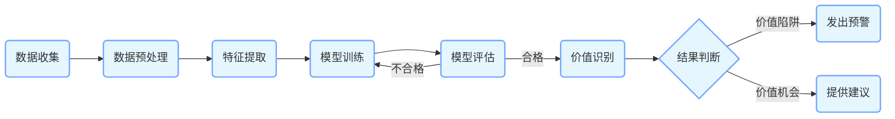

# AI智能体在识别价值陷阱和价值机会中的作用

> 关键词：AI智能体、价值陷阱、价值机会、数据分析、机器学习、金融市场、决策支持

> 摘要：本文深入探讨了AI智能体在识别价值陷阱和价值机会方面的重要作用。首先介绍了相关背景，包括研究目的、预期读者、文档结构和术语表。接着阐述了核心概念，如AI智能体、价值陷阱和价值机会的原理及其联系，并通过示意图和流程图进行说明。详细讲解了核心算法原理和具体操作步骤，同时结合数学模型和公式进行举例。通过项目实战，展示了AI智能体在实际应用中的代码实现和分析。分析了AI智能体在不同领域的实际应用场景，推荐了学习、开发工具和相关论文著作。最后总结了未来发展趋势与挑战，并给出常见问题解答和扩展阅读参考资料，旨在为读者全面理解AI智能体在识别价值陷阱和价值机会中的作用提供深入的技术知识和实践指导。

## 1. 背景介绍 
### 1.1 目的和范围
在当今复杂多变的市场环境中，无论是金融投资领域还是商业决策过程，准确识别价值陷阱和价值机会都是至关重要的。价值陷阱是指那些看似具有投资价值，但实际上可能会导致投资者遭受损失的资产或项目；而价值机会则是指那些具有潜在高回报的投资或商业机遇。本研究的目的在于探讨AI智能体在这一过程中所能发挥的作用，通过利用AI智能体强大的数据分析和决策能力，提高识别价值陷阱和价值机会的准确性和效率。

本研究的范围涵盖了多个领域，包括金融市场（如股票、债券、期货等）、商业领域（如企业并购、项目投资等）以及其他相关领域。我们将重点关注AI智能体如何利用各种数据资源和先进的算法技术，对不同类型的价值陷阱和价值机会进行有效识别。

### 1.2 预期读者
本文的预期读者包括金融投资者、投资顾问、企业决策者、数据分析人员、人工智能研究人员以及对AI在金融和商业领域应用感兴趣的人士。对于金融投资者和投资顾问来说，了解AI智能体在识别价值陷阱和价值机会方面的作用，可以帮助他们做出更明智的投资决策；企业决策者可以借鉴相关技术和方法，评估商业项目的潜在价值和风险；数据分析人员和人工智能研究人员可以从技术层面深入研究和改进AI智能体的性能；而对该领域感兴趣的人士则可以通过本文获得对AI智能体应用的初步了解。

### 1.3 文档结构概述
本文将按照以下结构进行组织：
1. 背景介绍：阐述研究的目的、范围、预期读者和文档结构，并给出相关术语的定义和解释。
2. 核心概念与联系：介绍AI智能体、价值陷阱和价值机会的核心概念，分析它们之间的联系，并通过示意图和流程图进行直观展示。
3. 核心算法原理 & 具体操作步骤：详细讲解AI智能体用于识别价值陷阱和价值机会的核心算法原理，并给出具体的操作步骤，同时使用Python源代码进行详细阐述。
4. 数学模型和公式 & 详细讲解 & 举例说明：建立相关的数学模型和公式，对其进行详细讲解，并通过实际例子说明其应用。
5. 项目实战：代码实际案例和详细解释说明：通过一个实际的项目案例，展示AI智能体在识别价值陷阱和价值机会中的具体应用，包括开发环境搭建、源代码实现和代码解读。
6. 实际应用场景：分析AI智能体在不同领域的实际应用场景，如金融市场、商业决策等。
7. 工具和资源推荐：推荐学习资源、开发工具框架和相关论文著作，帮助读者进一步深入学习和研究。
8. 总结：未来发展趋势与挑战：总结AI智能体在识别价值陷阱和价值机会方面的发展趋势，并分析可能面临的挑战。
9. 附录：常见问题与解答：解答读者在阅读过程中可能遇到的常见问题。
10. 扩展阅读 & 参考资料：提供相关的扩展阅读资料和参考文献，方便读者进一步探索该领域的知识。

### 1.4 术语表
#### 1.4.1 核心术语定义
- **AI智能体（AI Agent）**：是一种能够感知环境、进行决策并采取行动以实现特定目标的人工智能系统。它可以通过学习和适应不断提高自己的性能。
- **价值陷阱（Value Trap）**：指那些表面上看起来具有吸引力的投资机会，但实际上由于各种原因（如公司基本面恶化、行业竞争加剧等），可能会导致投资者遭受损失的情况。
- **价值机会（Value Opportunity）**：指那些具有潜在高回报的投资或商业机遇，通常是由于市场低估、行业发展趋势等因素导致的。
- **机器学习（Machine Learning）**：是一门多领域交叉学科，涉及概率论、统计学、逼近论、凸分析、算法复杂度理论等多门学科。它专门研究计算机怎样模拟或实现人类的学习行为，以获取新的知识或技能，重新组织已有的知识结构使之不断改善自身的性能。
- **深度学习（Deep Learning）**：是机器学习的一个分支领域，它试图使用包含复杂结构或由多重非线性变换构成的多个处理层对数据进行高层抽象的算法。

#### 1.4.2 相关概念解释
- **数据挖掘（Data Mining）**：是指从大量的数据中通过算法搜索隐藏于其中信息的过程。在本研究中，数据挖掘用于从各种数据源中提取与价值陷阱和价值机会相关的信息。
- **特征工程（Feature Engineering）**：是指对原始数据进行预处理、转换和提取特征的过程，以便更好地适用于机器学习算法。在识别价值陷阱和价值机会时，特征工程可以帮助我们选择和构建最具代表性的特征。
- **模型评估（Model Evaluation）**：是指使用特定的指标和方法对机器学习模型的性能进行评估的过程。在本研究中，模型评估用于评估AI智能体识别价值陷阱和价值机会的准确性和可靠性。

#### 1.4.3 缩略词列表
- **AI**：Artificial Intelligence（人工智能）
- **ML**：Machine Learning（机器学习）
- **DL**：Deep Learning（深度学习）
- **ANN**：Artificial Neural Network（人工神经网络）
- **CNN**：Convolutional Neural Network（卷积神经网络）
- **RNN**：Recurrent Neural Network（循环神经网络）

## 2. 核心概念与联系 

### 2.1 核心概念原理
#### 2.1.1 AI智能体
AI智能体是一种自主的系统，它可以感知周围环境的信息，并根据这些信息做出决策和采取行动。AI智能体通常由感知模块、决策模块和执行模块组成。感知模块负责收集环境信息，决策模块根据感知到的信息进行分析和推理，制定相应的策略，执行模块则根据决策结果采取具体的行动。

在识别价值陷阱和价值机会的过程中，AI智能体的感知模块可以收集各种数据源的信息，如财务报表、市场数据、新闻资讯等。决策模块则利用机器学习和数据分析算法对这些信息进行处理和分析，识别出潜在的价值陷阱和价值机会。执行模块可以根据决策结果，向投资者或决策者提供相应的建议或采取实际的投资行动。

#### 2.1.2 价值陷阱
价值陷阱通常是由于市场对某些资产或项目的错误定价导致的。这些资产或项目可能表面上看起来具有较高的价值，但实际上存在一些潜在的问题，如公司财务状况不佳、行业竞争激烈、技术创新不足等。投资者可能会因为被这些表面现象所迷惑，而忽略了潜在的风险，从而陷入价值陷阱。

例如，一家公司的股价可能因为短期的市场炒作而大幅上涨，但实际上该公司的基本面并没有得到改善，甚至可能在恶化。如果投资者仅仅根据股价的上涨而盲目买入该公司的股票，就可能会遭受损失。

#### 2.1.3 价值机会
价值机会是指那些被市场低估的资产或项目，它们具有潜在的高回报。这些价值机会可能是由于市场的短期波动、行业的发展趋势、公司的战略转型等因素导致的。投资者如果能够及时发现这些价值机会，并进行合理的投资，就有可能获得较高的回报。

例如，一家新兴科技公司可能由于技术创新和市场需求的增长，具有巨大的发展潜力，但由于市场对其了解不足，其股价可能被低估。如果投资者能够通过深入的研究和分析，发现该公司的价值机会，并在合适的时机买入其股票，就有可能获得丰厚的回报。

### 2.2 核心概念联系
AI智能体与价值陷阱和价值机会之间存在着密切的联系。AI智能体可以通过收集和分析大量的信息，帮助投资者和决策者更准确地识别价值陷阱和价值机会。具体来说，AI智能体可以通过以下方式发挥作用：
- **数据收集和整合**：AI智能体可以从各种数据源中收集与价值陷阱和价值机会相关的信息，如财务报表、市场数据、新闻资讯等，并将这些信息进行整合和预处理，以便后续的分析和处理。
- **特征提取和选择**：AI智能体可以利用特征工程技术，从收集到的数据中提取和选择最具代表性的特征，用于构建机器学习模型。这些特征可以帮助模型更好地识别价值陷阱和价值机会。
- **模型训练和优化**：AI智能体可以利用机器学习算法，对提取的特征进行训练和优化，构建识别价值陷阱和价值机会的模型。通过不断地调整模型的参数和结构，可以提高模型的准确性和可靠性。
- **决策支持**：AI智能体可以根据训练好的模型，对新的资产或项目进行评估和分析，识别出潜在的价值陷阱和价值机会，并向投资者和决策者提供相应的建议和决策支持。

### 2.3 文本示意图
```plaintext
            +------------------+
            |    AI智能体     |
            +------------------+
           /                   \
          /                     \
+----------------+        +----------------+
|  价值陷阱识别  |        |  价值机会识别  |
+----------------+        +----------------+
```
这个示意图展示了AI智能体在识别价值陷阱和价值机会中的核心作用。AI智能体作为一个整体系统，负责对各种信息进行处理和分析，最终实现对价值陷阱和价值机会的识别。

### 2.4 Mermaid流程图

这个流程图展示了AI智能体识别价值陷阱和价值机会的具体流程。首先，AI智能体收集各种数据，然后对数据进行预处理和特征提取。接着，使用提取的特征进行模型训练，并对训练好的模型进行评估。如果模型评估合格，则使用该模型进行价值识别；如果不合格，则返回模型训练步骤进行重新训练。最后，根据识别结果判断是价值陷阱还是价值机会，并采取相应的措施。

## 3. 核心算法原理 & 具体操作步骤 

### 3.1 核心算法原理
在识别价值陷阱和价值机会的过程中，常用的机器学习算法包括决策树、支持向量机、神经网络等。下面以神经网络为例，详细介绍其核心算法原理。

神经网络是一种模仿人类神经系统的计算模型，由大量的神经元组成。每个神经元接收输入信号，经过加权求和和非线性变换后，输出一个信号。神经网络通过不断地调整神经元之间的连接权重，来学习输入数据和输出结果之间的映射关系。

在识别价值陷阱和价值机会的任务中，我们可以将输入数据（如财务指标、市场数据等）作为神经网络的输入层，将识别结果（价值陷阱或价值机会）作为神经网络的输出层。通过训练神经网络，使其能够根据输入数据准确地预测输出结果。

### 3.2 具体操作步骤
#### 3.2.1 数据准备
首先，我们需要收集与价值陷阱和价值机会相关的数据。这些数据可以来自各种数据源，如财务报表、市场数据、新闻资讯等。然后，对收集到的数据进行预处理，包括数据清洗、缺失值处理、异常值处理等，以确保数据的质量和一致性。

#### 3.2.2 特征提取
从预处理后的数据中提取最具代表性的特征。这些特征可以是财务指标（如市盈率、市净率、净资产收益率等）、市场指标（如股价波动率、成交量等）、文本特征（如新闻情感分析结果等）。特征提取的目的是将原始数据转换为更适合机器学习算法处理的形式。

#### 3.2.3 模型构建
使用Python中的深度学习库（如TensorFlow、Keras等）构建神经网络模型。以下是一个简单的示例代码：

```python
import tensorflow as tf
from tensorflow.keras.models import Sequential
from tensorflow.keras.layers import Dense

# 构建模型
model = Sequential()
model.add(Dense(64, activation='relu', input_shape=(input_dim,)))
model.add(Dense(32, activation='relu'))
model.add(Dense(1, activation='sigmoid'))

# 编译模型
model.compile(optimizer='adam',
              loss='binary_crossentropy',
              metrics=['accuracy'])
```

在这个示例中，我们构建了一个简单的三层神经网络模型。输入层有`input_dim`个神经元，中间层有64个神经元，输出层有1个神经元。使用`relu`作为激活函数，`sigmoid`作为输出层的激活函数，以实现二分类任务（价值陷阱或价值机会）。

#### 3.2.4 模型训练
将准备好的训练数据输入到构建好的模型中进行训练。以下是训练模型的示例代码：

```python
# 训练模型
model.fit(X_train, y_train, epochs=10, batch_size=32, validation_data=(X_val, y_val))
```

在这个示例中，`X_train`和`y_train`分别是训练数据的特征和标签，`X_val`和`y_val`是验证数据的特征和标签。`epochs`表示训练的轮数，`batch_size`表示每次训练使用的样本数量。

#### 3.2.5 模型评估
使用测试数据对训练好的模型进行评估，以评估模型的性能。以下是评估模型的示例代码：

```python
# 评估模型
loss, accuracy = model.evaluate(X_test, y_test)
print(f"Test loss: {loss}, Test accuracy: {accuracy}")
```

在这个示例中，`X_test`和`y_test`分别是测试数据的特征和标签。通过计算测试数据的损失和准确率，我们可以评估模型的性能。

#### 3.2.6 价值识别
使用训练好的模型对新的资产或项目进行价值识别。以下是进行价值识别的示例代码：

```python
# 进行价值识别
predictions = model.predict(X_new)
for prediction in predictions:
    if prediction > 0.5:
        print("价值机会")
    else:
        print("价值陷阱")
```

在这个示例中，`X_new`是新的资产或项目的特征数据。通过模型的预测结果，我们可以判断该资产或项目是价值陷阱还是价值机会。

## 4. 数学模型和公式 & 详细讲解 & 举例说明 

### 4.1 数学模型
在识别价值陷阱和价值机会的任务中，我们可以使用逻辑回归模型作为一个简单的数学模型。逻辑回归是一种广义线性模型，用于处理二分类问题。

逻辑回归模型的基本形式为：
$$P(Y = 1|X) = \frac{1}{1 + e^{-(w_0 + w_1x_1 + w_2x_2 + \cdots + w_nx_n)}}$$
其中，$P(Y = 1|X)$ 表示在给定特征向量 $X = (x_1, x_2, \cdots, x_n)$ 的情况下，样本属于正类（价值机会）的概率；$w_0, w_1, w_2, \cdots, w_n$ 是模型的参数；$e$ 是自然常数。

### 4.2 公式详细讲解
- **线性组合**：$w_0 + w_1x_1 + w_2x_2 + \cdots + w_nx_n$ 是特征向量 $X$ 的线性组合，其中 $w_0$ 是截距项，$w_1, w_2, \cdots, w_n$ 是特征的权重。这个线性组合表示了特征向量 $X$ 对样本属于正类的影响程度。
- **Sigmoid函数**：$\frac{1}{1 + e^{-z}}$ 是Sigmoid函数，其中 $z = w_0 + w_1x_1 + w_2x_2 + \cdots + w_nx_n$。Sigmoid函数将线性组合的结果映射到 $[0, 1]$ 的区间内，从而得到样本属于正类的概率。

### 4.3 举例说明
假设我们有一个简单的数据集，包含两个特征 $x_1$ 和 $x_2$，以及对应的标签 $y$（0表示价值陷阱，1表示价值机会）。我们使用逻辑回归模型对这个数据集进行训练，得到模型的参数 $w_0 = -1$，$w_1 = 0.5$，$w_2 = 0.3$。

现在，我们有一个新的样本，其特征向量为 $X = (2, 3)$。我们可以使用逻辑回归模型计算该样本属于价值机会的概率：
$$z = w_0 + w_1x_1 + w_2x_2 = -1 + 0.5\times2 + 0.3\times3 = 0.9$$
$$P(Y = 1|X) = \frac{1}{1 + e^{-z}} = \frac{1}{1 + e^{-0.9}} \approx 0.71$$

由于 $P(Y = 1|X) > 0.5$，我们可以判断该样本属于价值机会。

## 5. 项目实战：代码实际案例和详细解释说明 

### 5.1  开发环境搭建
#### 5.1.1 安装Python
首先，我们需要安装Python环境。可以从Python官方网站（https://www.python.org/downloads/）下载适合自己操作系统的Python版本，并按照安装向导进行安装。

#### 5.1.2 安装必要的库
在识别价值陷阱和价值机会的项目中，我们需要使用一些Python库，如`pandas`、`numpy`、`scikit-learn`、`tensorflow`等。可以使用以下命令安装这些库：

```sh
pip install pandas numpy scikit-learn tensorflow
```

### 5.2  源代码详细实现和代码解读
以下是一个完整的项目实战代码示例，用于识别价值陷阱和价值机会：

```python
import pandas as pd
import numpy as np
from sklearn.model_selection import train_test_split
from sklearn.preprocessing import StandardScaler
from tensorflow.keras.models import Sequential
from tensorflow.keras.layers import Dense

# 1. 数据加载
data = pd.read_csv('data.csv')

# 2. 数据预处理
X = data.drop('label', axis=1)
y = data['label']

# 3. 数据划分
X_train, X_test, y_train, y_test = train_test_split(X, y, test_size=0.2, random_state=42)

# 4. 数据标准化
scaler = StandardScaler()
X_train = scaler.fit_transform(X_train)
X_test = scaler.transform(X_test)

# 5. 模型构建
model = Sequential()
model.add(Dense(64, activation='relu', input_shape=(X_train.shape[1],)))
model.add(Dense(32, activation='relu'))
model.add(Dense(1, activation='sigmoid'))

# 6. 模型编译
model.compile(optimizer='adam',
              loss='binary_crossentropy',
              metrics=['accuracy'])

# 7. 模型训练
model.fit(X_train, y_train, epochs=10, batch_size=32, validation_data=(X_test, y_test))

# 8. 模型评估
loss, accuracy = model.evaluate(X_test, y_test)
print(f"Test loss: {loss}, Test accuracy: {accuracy}")

# 9. 价值识别
new_data = np.array([[1, 2, 3, 4, 5]])  # 示例新数据
new_data = scaler.transform(new_data)
predictions = model.predict(new_data)
if predictions > 0.5:
    print("价值机会")
else:
    print("价值陷阱")
```

### 5.3  代码解读与分析
#### 5.3.1 数据加载
```python
data = pd.read_csv('data.csv')
```
这行代码使用`pandas`库的`read_csv`函数从CSV文件中加载数据。

#### 5.3.2 数据预处理
```python
X = data.drop('label', axis=1)
y = data['label']
```
这两行代码将数据分为特征矩阵 $X$ 和标签向量 $y$。`drop`函数用于删除`label`列，得到特征矩阵；`label`列作为标签向量。

#### 5.3.3 数据划分
```python
X_train, X_test, y_train, y_test = train_test_split(X, y, test_size=0.2, random_state=42)
```
这行代码使用`sklearn`库的`train_test_split`函数将数据划分为训练集和测试集，其中测试集占总数据的20%。

#### 5.3.4 数据标准化
```python
scaler = StandardScaler()
X_train = scaler.fit_transform(X_train)
X_test = scaler.transform(X_test)
```
这几行代码使用`sklearn`库的`StandardScaler`类对特征矩阵进行标准化处理，使特征具有零均值和单位方差，有助于提高模型的训练效果。

#### 5.3.5 模型构建
```python
model = Sequential()
model.add(Dense(64, activation='relu', input_shape=(X_train.shape[1],)))
model.add(Dense(32, activation='relu'))
model.add(Dense(1, activation='sigmoid'))
```
这几行代码使用`tensorflow.keras`库构建一个简单的三层神经网络模型。输入层有`X_train.shape[1]`个神经元，中间层有64个和32个神经元，输出层有1个神经元。使用`relu`作为激活函数，`sigmoid`作为输出层的激活函数。

#### 5.3.6 模型编译
```python
model.compile(optimizer='adam',
              loss='binary_crossentropy',
              metrics=['accuracy'])
```
这行代码使用`adam`优化器、`binary_crossentropy`损失函数和`accuracy`指标对模型进行编译。

#### 5.3.7 模型训练
```python
model.fit(X_train, y_train, epochs=10, batch_size=32, validation_data=(X_test, y_test))
```
这行代码使用训练集对模型进行训练，训练10个轮次，每次使用32个样本进行训练，并使用测试集进行验证。

#### 5.3.8 模型评估
```python
loss, accuracy = model.evaluate(X_test, y_test)
print(f"Test loss: {loss}, Test accuracy: {accuracy}")
```
这几行代码使用测试集对模型进行评估，计算测试集的损失和准确率，并输出结果。

#### 5.3.9 价值识别
```python
new_data = np.array([[1, 2, 3, 4, 5]])  # 示例新数据
new_data = scaler.transform(new_data)
predictions = model.predict(new_data)
if predictions > 0.5:
    print("价值机会")
else:
    print("价值陷阱")
```
这几行代码使用训练好的模型对新数据进行价值识别。首先将新数据进行标准化处理，然后使用模型进行预测，根据预测结果判断是价值机会还是价值陷阱。

## 6. 实际应用场景 
### 6.1 金融市场投资
在金融市场中，AI智能体可以帮助投资者识别股票、债券、期货等资产的价值陷阱和价值机会。例如，AI智能体可以通过分析公司的财务报表、市场数据、新闻资讯等信息，评估公司的基本面和市场前景，判断该公司的股票是否存在价值陷阱或价值机会。投资者可以根据AI智能体的建议，做出更明智的投资决策，降低投资风险，提高投资回报。

### 6.2 企业并购与投资决策
在企业并购和投资决策过程中，AI智能体可以帮助企业评估目标企业的价值和风险。通过分析目标企业的财务状况、市场竞争力、技术创新能力等因素，AI智能体可以识别出目标企业是否存在价值陷阱或价值机会。企业决策者可以根据AI智能体的评估结果，决定是否进行并购或投资，以及确定合理的交易价格和交易条款。

### 6.3 项目投资评估
在项目投资领域，AI智能体可以对各种项目进行评估和筛选。例如，在房地产项目投资中，AI智能体可以分析房地产市场的供求关系、地理位置、周边配套设施等因素，评估项目的潜在价值和风险。在创业项目投资中，AI智能体可以分析创业团队的背景、技术创新能力、市场前景等因素，判断项目是否具有投资价值。通过使用AI智能体进行项目投资评估，可以提高投资决策的准确性和效率。

### 6.4 风险管理
AI智能体可以帮助金融机构和企业进行风险管理。通过识别价值陷阱，AI智能体可以帮助金融机构和企业及时发现潜在的风险，并采取相应的措施进行防范和控制。例如，在信贷风险管理中，AI智能体可以分析借款人的信用状况、还款能力等因素，判断借款人是否存在违约风险。在市场风险管理中，AI智能体可以监测市场波动和风险因素，及时发出预警信号，帮助金融机构和企业调整投资组合，降低市场风险。

## 7. 工具和资源推荐
### 7.1 学习资源推荐
#### 7.1.1 书籍推荐
- 《机器学习》（周志华著）：这本书是机器学习领域的经典教材，全面介绍了机器学习的基本概念、算法和应用。
- 《深度学习》（Ian Goodfellow、Yoshua Bengio和Aaron Courville著）：这本书是深度学习领域的权威著作，深入讲解了深度学习的原理、模型和应用。
- 《Python数据分析实战》（Sebastian Raschka著）：这本书结合Python编程语言，介绍了数据分析的基本方法和技巧，适合初学者学习。

#### 7.1.2 在线课程
- Coursera平台上的“机器学习”课程（Andrew Ng教授主讲）：这是一门非常经典的机器学习课程，由斯坦福大学的Andrew Ng教授主讲，内容涵盖了机器学习的基本概念、算法和应用。
- edX平台上的“深度学习”课程（麻省理工学院开设）：这门课程深入讲解了深度学习的原理、模型和应用，适合有一定机器学习基础的学习者。
- 中国大学MOOC平台上的“Python语言程序设计”课程（北京理工大学开设）：这门课程适合初学者学习Python编程语言，为后续学习数据分析和机器学习打下基础。

#### 7.1.3 技术博客和网站
- 博客园（https://www.cnblogs.com/）：这是一个技术博客平台，有很多关于机器学习、深度学习和数据分析的技术文章。
- 知乎（https://www.zhihu.com/）：知乎上有很多关于人工智能和机器学习的讨论和问答，可以帮助学习者了解最新的技术动态和研究成果。
- Kaggle（https://www.kaggle.com/）：Kaggle是一个数据科学竞赛平台，上面有很多公开的数据集和优秀的解决方案，可以帮助学习者提高数据分析和机器学习的实践能力。

### 7.2 开发工具框架推荐
#### 7.2.1 IDE和编辑器
- PyCharm：这是一款专门为Python开发设计的集成开发环境（IDE），具有代码自动补全、调试、版本控制等功能，非常适合Python开发。
- Jupyter Notebook：这是一个交互式的开发环境，可以在浏览器中编写和运行Python代码，适合进行数据分析和机器学习的实验和演示。
- Visual Studio Code：这是一款轻量级的代码编辑器，支持多种编程语言，具有丰富的插件和扩展功能，可以满足不同的开发需求。

#### 7.2.2 调试和性能分析工具
- Py-Spy：这是一个用于Python代码性能分析的工具，可以帮助开发者找出代码中的性能瓶颈。
- TensorBoard：这是TensorFlow提供的一个可视化工具，可以帮助开发者可视化模型的训练过程和性能指标。
- cProfile：这是Python标准库中的一个性能分析模块，可以帮助开发者分析代码的运行时间和函数调用情况。

#### 7.2.3 相关框架和库
- TensorFlow：这是一个开源的深度学习框架，由Google开发，提供了丰富的深度学习模型和工具，支持多种编程语言。
- PyTorch：这是一个开源的深度学习框架，由Facebook开发，具有动态图机制，易于使用和调试。
- Scikit-learn：这是一个开源的机器学习库，提供了丰富的机器学习算法和工具，适合初学者和快速开发。

### 7.3 相关论文著作推荐
#### 7.3.1 经典论文
- “Gradient-Based Learning Applied to Document Recognition”（Yann LeCun、Léon Bottou、Yoshua Bengio和Patrick Haffner著）：这篇论文介绍了卷积神经网络（CNN）在手写数字识别中的应用，是深度学习领域的经典论文之一。
- “Long Short-Term Memory”（Sepp Hochreiter和Jürgen Schmidhuber著）：这篇论文提出了长短期记忆网络（LSTM），解决了循环神经网络（RNN）中的梯度消失问题，是深度学习领域的重要突破。
- “Attention Is All You Need”（Ashish Vaswani等人著）：这篇论文提出了Transformer模型，引入了注意力机制，在自然语言处理领域取得了巨大的成功。

#### 7.3.2 最新研究成果
- 可以关注顶级学术会议如NeurIPS（神经信息处理系统大会）、ICML（国际机器学习会议）、CVPR（计算机视觉与模式识别会议）等的论文，了解最新的研究成果和技术趋势。
- 一些知名的学术期刊如Journal of Artificial Intelligence Research（JAIR）、Artificial Intelligence等也会发表相关的研究论文。

#### 7.3.3 应用案例分析
- 《AI in Finance: From Algorithms to Infrastructure》（Richard Benson-Armer等人著）：这本书介绍了AI在金融领域的应用案例和实践经验，包括风险评估、投资决策、交易策略等方面。
- 《Artificial Intelligence in Business: The AI-Powered Organization》（F. Maxwell Harper和Joseph A. Konstan著）：这本书探讨了AI在商业领域的应用，包括客户服务、供应链管理、市场营销等方面的案例分析。

## 8. 总结：未来发展趋势与挑战
### 8.1 未来发展趋势
#### 8.1.1 多模态数据融合
未来，AI智能体将能够融合更多类型的数据，如文本、图像、音频、视频等，以更全面地了解价值陷阱和价值机会。例如，在金融市场分析中，除了财务报表和市场数据外，还可以结合新闻报道的文本信息、公司产品的图片和视频等，提高识别的准确性和可靠性。

#### 8.1.2 强化学习的应用
强化学习是一种通过智能体与环境进行交互并根据奖励信号进行学习的机器学习方法。未来，强化学习将在AI智能体识别价值陷阱和价值机会中得到更广泛的应用。例如，AI智能体可以通过不断地进行投资决策并根据投资回报进行学习，优化自己的决策策略，提高投资收益。

#### 8.1.3 与区块链技术的结合
区块链技术具有去中心化、不可篡改、安全可靠等特点。未来，AI智能体可以与区块链技术相结合，实现数据的安全共享和可信交易。例如，在金融市场中，区块链可以提供真实可靠的交易数据，AI智能体可以利用这些数据进行更准确的价值评估和风险分析。

#### 8.1.4 智能化决策支持系统的发展
未来，AI智能体将与决策支持系统深度融合，为投资者和决策者提供更加智能化、个性化的决策建议。例如，根据投资者的风险偏好、投资目标和资产状况，AI智能体可以为其量身定制投资组合和决策方案，提高决策的科学性和有效性。

### 8.2 挑战
#### 8.2.1 数据质量和隐私问题
数据是AI智能体的基础，数据质量的好坏直接影响到识别结果的准确性。然而，现实中的数据往往存在噪声、缺失值、异常值等问题，需要进行复杂的数据预处理。此外，随着数据的大量收集和使用，数据隐私问题也日益突出。如何在保证数据质量的同时，保护数据的隐私和安全，是一个亟待解决的问题。

#### 8.2.2 模型解释性和可解释性
虽然深度学习模型在识别价值陷阱和价值机会方面取得了很好的效果，但这些模型往往是黑盒模型，缺乏解释性。投资者和决策者很难理解模型的决策过程和依据，这在一定程度上限制了AI智能体的应用。如何提高模型的解释性和可解释性，使投资者和决策者能够信任模型的决策结果，是一个重要的挑战。

#### 8.2.3 市场变化和不确定性
市场是复杂多变的，价值陷阱和价值机会也会随着市场环境的变化而变化。AI智能体需要不断地学习和适应市场的变化，才能保持识别的准确性和可靠性。然而，市场的不确定性使得AI智能体很难准确预测未来的市场走势，这给识别工作带来了很大的挑战。

#### 8.2.4 法律法规和监管问题
随着AI智能体在金融和商业领域的广泛应用，相关的法律法规和监管问题也日益凸显。例如，如何规范AI智能体的使用，确保其决策的公正性和合法性；如何保护投资者和消费者的权益，避免AI智能体的不当使用带来的风险等。制定完善的法律法规和监管政策，是保障AI智能体健康发展的重要前提。

## 9. 附录：常见问题与解答
### 9.1 AI智能体识别价值陷阱和价值机会的准确率有多高？
AI智能体的识别准确率受到多种因素的影响，如数据质量、模型选择、特征工程等。一般来说，通过合理的数据预处理、模型选择和调优，AI智能体可以达到较高的识别准确率。但需要注意的是，市场是复杂多变的，存在一定的不确定性，因此AI智能体的识别结果也不能保证100%准确。

### 9.2 AI智能体可以完全替代人类进行投资决策吗？
目前，AI智能体还不能完全替代人类进行投资决策。虽然AI智能体具有强大的数据分析和决策能力，但人类的经验、直觉和判断力在投资决策中仍然起着重要的作用。AI智能体可以作为人类的辅助工具，为投资者提供决策建议和参考，但最终的投资决策还需要人类根据自己的情况进行综合考虑。

### 9.3 如何选择适合的AI算法和模型？
选择适合的AI算法和模型需要考虑多个因素，如数据类型、问题复杂度、计算资源等。一般来说，可以先对数据进行分析和探索，了解数据的特点和规律，然后根据问题的类型选择合适的算法和模型。例如，对于二分类问题，可以选择逻辑回归、决策树、神经网络等算法；对于多分类问题，可以选择支持向量机、随机森林等算法。同时，还可以通过交叉验证等方法对不同的算法和模型进行评估和比较，选择性能最优的模型。

### 9.4 AI智能体在识别价值陷阱和价值机会时需要哪些数据？
AI智能体在识别价值陷阱和价值机会时需要多种类型的数据，如财务数据（如资产负债表、利润表、现金流量表等）、市场数据（如股价、成交量、市盈率等）、宏观经济数据（如GDP、CPI、利率等）、新闻资讯等。这些数据可以从不同的数据源获取，如金融数据库、新闻网站、政府部门等。

### 9.5 如何评估AI智能体的性能？
评估AI智能体的性能可以使用多种指标，如准确率、召回率、F1值、AUC值等。准确率是指模型预测正确的样本数占总样本数的比例；召回率是指模型预测为正类的样本中实际为正类的样本数占实际正类样本数的比例；F1值是准确率和召回率的调和平均数；AUC值是ROC曲线下的面积，用于衡量模型的分类能力。可以根据具体的问题和需求选择合适的评估指标。

## 10. 扩展阅读 & 参考资料
### 10.1 扩展阅读
- 《智能时代》（吴军著）：这本书介绍了人工智能的发展历程、技术原理和应用场景，探讨了人工智能对社会和经济的影响。
- 《大数据时代》（维克托·迈尔 - 舍恩伯格、肯尼斯·库克耶著）：这本书介绍了大数据的概念、特点和应用，探讨了大数据对社会和经济的影响。
- 《未来简史：从智人到神人》（尤瓦尔·赫拉利著）：这本书探讨了人类未来的发展趋势，包括人工智能、生物技术等领域的发展对人类社会的影响。

### 10.2 参考资料
- 《机器学习实战》（Peter Harrington著）
- 《Python深度学习》（Francois Chollet著）
- 《数据挖掘：概念与技术》（Jiawei Han、Jian Pei和Jianwen Yin著）
- 相关学术期刊如Journal of Machine Learning Research（JMLR）、Artificial Intelligence等发表的论文
- 相关学术会议如NeurIPS、ICML、CVPR等的会议论文集