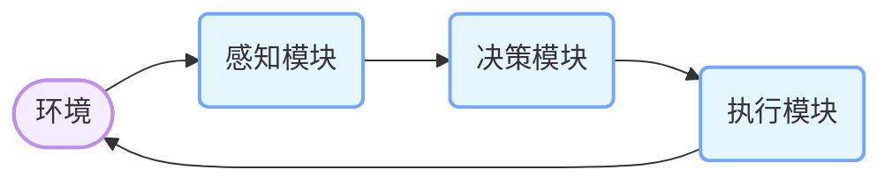

# AI智能体在识别经济护城河中的作用

> 关键词：AI智能体、经济护城河、识别作用、数据分析、机器学习

> 摘要：本文深入探讨了AI智能体在识别经济护城河方面的作用。首先介绍了研究的背景，包括目的、预期读者、文档结构和相关术语。接着阐述了AI智能体和经济护城河的核心概念及其联系，并通过示意图和流程图进行直观展示。详细讲解了核心算法原理及具体操作步骤，结合Python代码进行说明。同时给出了相关的数学模型和公式，并举例说明。通过项目实战案例，展示了代码实现和解读。分析了AI智能体在识别经济护城河中的实际应用场景，推荐了相关的学习资源、开发工具框架和论文著作。最后总结了未来发展趋势与挑战，解答了常见问题，并提供了扩展阅读和参考资料。旨在帮助读者全面了解AI智能体在识别经济护城河领域的重要价值和应用方法。

## 1. 背景介绍 
### 1.1 目的和范围
在当今复杂多变的经济环境中，准确识别企业的经济护城河对于投资者、分析师以及企业管理者都具有至关重要的意义。经济护城河是指企业拥有的一种可持续的竞争优势，它能够保护企业在长期内获得高于行业平均水平的利润。然而，传统的识别方法往往依赖于人工分析和经验判断，不仅效率低下，而且容易受到主观因素的影响。

本研究的目的在于探讨AI智能体在识别经济护城河方面的作用，通过利用AI智能体强大的数据处理和分析能力，提高识别的准确性和效率。研究范围涵盖了AI智能体的各种技术和算法，以及经济护城河的不同类型和特征。

### 1.2 预期读者
本文的预期读者包括但不限于以下几类人群：
- **投资者**：希望借助AI智能体的力量，更准确地识别具有经济护城河的企业，从而做出更明智的投资决策。
- **金融分析师**：利用AI智能体的分析结果，为客户提供更专业的投资建议，提高工作效率和分析质量。
- **企业管理者**：了解AI智能体在识别经济护城河方面的应用，有助于评估自身企业的竞争优势，制定更有效的战略规划。
- **技术爱好者**：对AI智能体和经济领域的交叉应用感兴趣，希望深入了解相关技术和方法。

### 1.3 文档结构概述
本文将按照以下结构进行组织：
- 核心概念与联系：介绍AI智能体和经济护城河的核心概念，以及它们之间的联系，并通过示意图和流程图进行直观展示。
- 核心算法原理 & 具体操作步骤：详细讲解AI智能体在识别经济护城河时所使用的核心算法原理，并给出具体的操作步骤，同时结合Python代码进行说明。
- 数学模型和公式 & 详细讲解 & 举例说明：给出相关的数学模型和公式，并进行详细讲解，通过具体的例子说明其应用。
- 项目实战：代码实际案例和详细解释说明：通过一个实际的项目案例，展示AI智能体在识别经济护城河方面的代码实现和详细解释。
- 实际应用场景：分析AI智能体在识别经济护城河中的实际应用场景。
- 工具和资源推荐：推荐相关的学习资源、开发工具框架和论文著作。
- 总结：未来发展趋势与挑战：总结AI智能体在识别经济护城河领域的未来发展趋势和面临的挑战。
- 附录：常见问题与解答：解答读者在阅读过程中可能遇到的常见问题。
- 扩展阅读 & 参考资料：提供相关的扩展阅读和参考资料，方便读者进一步深入学习。

### 1.4 术语表
#### 1.4.1 核心术语定义
- **AI智能体**：是一种能够感知环境、做出决策并采取行动以实现特定目标的软件或硬件系统。它可以通过学习和适应不断提高自己的性能。
- **经济护城河**：指企业所拥有的一种可持续的竞争优势，这种优势能够使企业在长期内抵御竞争对手的侵蚀，保持较高的盈利能力。
- **机器学习**：是一门多领域交叉学科，涉及概率论、统计学、逼近论、凸分析、算法复杂度理论等多门学科。它专门研究计算机怎样模拟或实现人类的学习行为，以获取新的知识或技能，重新组织已有的知识结构使之不断改善自身的性能。

#### 1.4.2 相关概念解释
- **数据挖掘**：是指从大量的数据中通过算法搜索隐藏于其中信息的过程。在识别经济护城河的过程中，数据挖掘可以帮助AI智能体从海量的经济数据中发现有价值的信息。
- **自然语言处理**：是计算机科学领域与人工智能领域中的一个重要方向。它研究能实现人与计算机之间用自然语言进行有效通信的各种理论和方法。在识别经济护城河时，自然语言处理可以用于分析企业的财务报告、新闻报道等文本信息。

#### 1.4.3 缩略词列表
- **AI**：Artificial Intelligence，人工智能
- **ML**：Machine Learning，机器学习
- **NLP**：Natural Language Processing，自然语言处理

## 2. 核心概念与联系 

### 2.1 AI智能体的原理和架构
AI智能体通常由感知模块、决策模块和执行模块组成。感知模块负责收集环境信息，决策模块根据感知到的信息进行分析和决策，执行模块则根据决策结果采取相应的行动。

以下是AI智能体的架构示意图：

在识别经济护城河的过程中，感知模块可以收集企业的财务数据、市场数据、行业数据等信息；决策模块通过对这些信息进行分析和处理，判断企业是否具有经济护城河以及经济护城河的强度；执行模块则可以根据决策结果为投资者提供投资建议或为企业管理者提供战略建议。

### 2.2 经济护城河的类型和特征
经济护城河主要有以下几种类型：
- **成本优势护城河**：企业通过降低生产成本，使其产品或服务的价格低于竞争对手，从而获得竞争优势。例如，一些大型制造业企业通过规模经济、先进的生产技术等方式降低成本。
- **无形资产护城河**：包括品牌、专利、商标等。具有强大品牌的企业可以吸引更多的客户，获得更高的溢价；拥有专利技术的企业可以在一定时期内垄断市场。
- **转换成本护城河**：当客户从一个产品或服务转换到另一个产品或服务时，需要付出较高的成本，这种成本就构成了企业的转换成本护城河。例如，企业使用的一些专业软件，由于员工已经熟悉了该软件的操作，更换软件需要重新培训员工，这就增加了企业的转换成本。
- **网络效应护城河**：随着使用产品或服务的用户数量的增加，产品或服务的价值也会随之增加，这种现象称为网络效应。例如，社交媒体平台、电商平台等，用户数量越多，平台的价值就越大。

### 2.3 AI智能体与经济护城河的联系
AI智能体可以通过对大量的数据进行分析和处理，识别企业的经济护城河。具体来说，AI智能体可以：
- 分析企业的财务数据，如毛利率、净利率、资产回报率等，判断企业是否具有成本优势护城河。
- 利用自然语言处理技术分析企业的品牌形象、专利数量等信息，评估企业的无形资产护城河。
- 通过分析客户的行为数据，了解客户的转换成本，判断企业是否具有转换成本护城河。
- 研究用户的增长数据和网络活跃度，评估企业的网络效应护城河。

## 3. 核心算法原理 & 具体操作步骤 

### 3.1 核心算法原理
在识别经济护城河的过程中，AI智能体主要使用机器学习算法。以下以决策树算法为例进行说明。

决策树是一种基于树结构进行决策的机器学习算法。它通过对数据进行递归划分，构建一个树形结构，每个内部节点表示一个属性上的测试，每个分支表示一个测试输出，每个叶节点表示一个类别或值。

决策树算法的基本步骤如下：
1. 选择一个最佳的属性作为根节点的测试属性。
2. 根据该属性的不同取值，将数据集划分为多个子集。
3. 对每个子集递归地重复步骤1和步骤2，直到满足停止条件。

### 3.2 具体操作步骤
以下是使用Python实现决策树算法识别经济护城河的具体操作步骤：

```python
# 步骤1：导入必要的库
import pandas as pd
from sklearn.model_selection import train_test_split
from sklearn.tree import DecisionTreeClassifier
from sklearn.metrics import accuracy_score

# 步骤2：加载数据集
data = pd.read_csv('economic_moat_data.csv')

# 步骤3：划分特征和标签
X = data.drop('has_moat', axis=1)
y = data['has_moat']

# 步骤4：划分训练集和测试集
X_train, X_test, y_train, y_test = train_test_split(X, y, test_size=0.2, random_state=42)

# 步骤5：创建决策树分类器
clf = DecisionTreeClassifier()

# 步骤6：训练模型
clf.fit(X_train, y_train)

# 步骤7：进行预测
y_pred = clf.predict(X_test)

# 步骤8：评估模型性能
accuracy = accuracy_score(y_test, y_pred)
print(f"模型准确率: {accuracy}")
```

### 3.3 代码解释
- **步骤1**：导入必要的库，包括`pandas`用于数据处理，`sklearn`中的相关模块用于数据划分、模型训练和评估。
- **步骤2**：加载包含经济护城河相关数据的CSV文件。
- **步骤3**：将数据集划分为特征`X`和标签`y`，其中`has_moat`表示企业是否具有经济护城河。
- **步骤4**：将数据集划分为训练集和测试集，测试集占比为20%。
- **步骤5**：创建决策树分类器。
- **步骤6**：使用训练集对模型进行训练。
- **步骤7**：使用训练好的模型对测试集进行预测。
- **步骤8**：计算模型的准确率并输出。

## 4. 数学模型和公式 & 详细讲解 & 举例说明 

### 4.1 信息熵
信息熵是衡量数据集中不确定性的一个指标。在决策树算法中，信息熵用于选择最佳的划分属性。信息熵的计算公式如下：

$$H(X) = -\sum_{i=1}^{n} p(x_i) \log_2 p(x_i)$$

其中，$X$ 是一个离散随机变量，$p(x_i)$ 是 $X$ 取值为 $x_i$ 的概率，$n$ 是 $X$ 的取值个数。

### 4.2 信息增益
信息增益是指划分前后信息熵的减少量。在决策树算法中，选择信息增益最大的属性作为划分属性。信息增益的计算公式如下：

$$IG(X, A) = H(X) - \sum_{v \in Values(A)} \frac{|S_v|}{|S|} H(S_v)$$

其中，$IG(X, A)$ 表示属性 $A$ 对数据集 $S$ 的信息增益，$H(X)$ 是数据集 $S$ 的信息熵，$Values(A)$ 是属性 $A$ 的所有可能取值，$S_v$ 是属性 $A$ 取值为 $v$ 的子集，$|S|$ 是数据集 $S$ 的样本数量，$|S_v|$ 是子集 $S_v$ 的样本数量。

### 4.3 举例说明
假设我们有一个数据集，包含企业的三个特征：毛利率、净利率和资产回报率，以及一个标签：是否具有经济护城河。数据集如下：

| 毛利率 | 净利率 | 资产回报率 | 是否具有经济护城河 |
| ---- | ---- | ---- | ---- |
| 高 | 高 | 高 | 是 |
| 高 | 低 | 高 | 是 |
| 低 | 高 | 高 | 否 |
| 低 | 低 | 低 | 否 |

首先，计算数据集的信息熵：

$p(是) = \frac{2}{4} = 0.5$，$p(否) = \frac{2}{4} = 0.5$

$H(X) = - (0.5 \log_2 0.5 + 0.5 \log_2 0.5) = 1$

然后，计算每个属性的信息增益。以毛利率为例：

当毛利率为高时，$S_{高} = \{(高, 高, 高, 是), (高, 低, 高, 是)\}$，$p(是) = 1$，$p(否) = 0$，$H(S_{高}) = - (1 \log_2 1 + 0 \log_2 0) = 0$

当毛利率为低时，$S_{低} = \{(低, 高, 高, 否), (低, 低, 低, 否)\}$，$p(是) = 0$，$p(否) = 1$，$H(S_{低}) = - (0 \log_2 0 + 1 \log_2 1) = 0$

$IG(X, 毛利率) = H(X) - (\frac{2}{4} H(S_{高}) + \frac{2}{4} H(S_{低})) = 1 - (\frac{2}{4} \times 0 + \frac{2}{4} \times 0) = 1$

同理，可以计算净利率和资产回报率的信息增益，然后选择信息增益最大的属性作为根节点的划分属性。

## 5. 项目实战：代码实际案例和详细解释说明 

### 5.1  开发环境搭建
在进行项目实战之前，需要搭建开发环境。以下是具体步骤：
1. **安装Python**：从Python官方网站（https://www.python.org/downloads/）下载并安装Python 3.x版本。
2. **安装必要的库**：使用`pip`命令安装所需的库，包括`pandas`、`scikit-learn`等。

```bash
pip install pandas scikit-learn
```

### 5.2  源代码详细实现和代码解读
以下是一个完整的Python代码示例，用于使用决策树算法识别经济护城河：

```python
import pandas as pd
from sklearn.model_selection import train_test_split
from sklearn.tree import DecisionTreeClassifier
from sklearn.metrics import accuracy_score
from sklearn.preprocessing import LabelEncoder

# 加载数据集
data = pd.read_csv('economic_moat_data.csv')

# 处理分类变量
categorical_columns = data.select_dtypes(include=['object']).columns
for col in categorical_columns:
    le = LabelEncoder()
    data[col] = le.fit_transform(data[col])

# 划分特征和标签
X = data.drop('has_moat', axis=1)
y = data['has_moat']

# 划分训练集和测试集
X_train, X_test, y_train, y_test = train_test_split(X, y, test_size=0.2, random_state=42)

# 创建决策树分类器
clf = DecisionTreeClassifier()

# 训练模型
clf.fit(X_train, y_train)

# 进行预测
y_pred = clf.predict(X_test)

# 评估模型性能
accuracy = accuracy_score(y_test, y_pred)
print(f"模型准确率: {accuracy}")

# 可视化决策树
from sklearn.tree import export_graphviz
import graphviz

dot_data = export_graphviz(clf, out_file=None, 
                           feature_names=X.columns,  
                           class_names=['No Moat', 'Has Moat'],  
                           filled=True, rounded=True,  
                           special_characters=True)  
graph = graphviz.Source(dot_data)  
graph.render("economic_moat_tree")
```

### 5.3  代码解读与分析
- **数据加载**：使用`pandas`库的`read_csv`函数加载包含经济护城河相关数据的CSV文件。
- **处理分类变量**：使用`LabelEncoder`将分类变量转换为数值变量，以便决策树算法能够处理。
- **特征和标签划分**：将数据集划分为特征`X`和标签`y`，其中`has_moat`表示企业是否具有经济护城河。
- **数据集划分**：使用`train_test_split`函数将数据集划分为训练集和测试集，测试集占比为20%。
- **模型创建和训练**：创建决策树分类器，并使用训练集对模型进行训练。
- **预测和评估**：使用训练好的模型对测试集进行预测，并计算模型的准确率。
- **决策树可视化**：使用`export_graphviz`和`graphviz`库将决策树可视化，保存为PDF文件。

## 6. 实际应用场景 
### 6.1 投资决策
投资者可以利用AI智能体识别具有经济护城河的企业，从而选择更有潜力的投资标的。例如，通过分析企业的财务数据、市场竞争力等信息，AI智能体可以判断企业是否具有可持续的竞争优势，为投资者提供投资建议。

### 6.2 企业战略规划
企业管理者可以使用AI智能体评估自身企业的经济护城河，了解企业的竞争优势和劣势。根据评估结果，企业可以制定相应的战略规划，如加强品牌建设、提高生产效率、拓展市场份额等，以增强企业的经济护城河。

### 6.3 行业分析
分析师可以利用AI智能体对整个行业进行分析，了解行业内企业的经济护城河分布情况。这有助于分析师发现行业的发展趋势和潜在机会，为行业研究和投资决策提供支持。

## 7. 工具和资源推荐
### 7.1 学习资源推荐
#### 7.1.1 书籍推荐
- 《人工智能：现代方法》：这是一本经典的人工智能教材，涵盖了AI的各个领域，包括机器学习、自然语言处理等。
- 《Python机器学习》：详细介绍了如何使用Python进行机器学习，包括各种算法的原理和实现。
- 《竞争优势：创造与维持卓越绩效》：介绍了企业竞争优势的相关理论和方法，对理解经济护城河有很大帮助。

#### 7.1.2 在线课程
- Coursera上的“机器学习”课程：由斯坦福大学教授Andrew Ng主讲，是学习机器学习的经典课程。
- edX上的“人工智能基础”课程：系统介绍了人工智能的基本概念、算法和应用。

#### 7.1.3 技术博客和网站
- Towards Data Science：是一个专注于数据科学和机器学习的博客平台，上面有很多优秀的技术文章和案例。
- Kaggle：是一个数据科学竞赛平台，上面有很多公开的数据集和优秀的解决方案，可以学习到很多实际应用的技巧。

### 7.2 开发工具框架推荐
#### 7.2.1 IDE和编辑器
- PyCharm：是一款专门为Python开发设计的集成开发环境，具有强大的代码编辑、调试和项目管理功能。
- Jupyter Notebook：是一个交互式的开发环境，适合进行数据分析和模型实验。

#### 7.2.2 调试和性能分析工具
- TensorBoard：是TensorFlow提供的一个可视化工具，可以用于监控模型的训练过程、分析模型的性能等。
- Scikit-learn的`GridSearchCV`：可以用于模型的参数调优，提高模型的性能。

#### 7.2.3 相关框架和库
- Scikit-learn：是一个简单易用的机器学习库，提供了各种机器学习算法的实现，包括决策树、神经网络等。
- TensorFlow：是一个开源的深度学习框架，广泛应用于图像识别、自然语言处理等领域。

### 7.3 相关论文著作推荐
#### 7.3.1 经典论文
- 《Machine Learning》：由Tom M. Mitchell所著，是机器学习领域的经典教材，其中包含了很多重要的算法和理论。
- 《The Nature of Statistical Learning Theory》：由Vladimir N. Vapnik所著，对统计学习理论进行了深入的探讨。

#### 7.3.2 最新研究成果
- 在IEEE Transactions on Neural Networks and Learning Systems、Journal of Artificial Intelligence Research等期刊上可以找到关于AI智能体和机器学习的最新研究成果。

#### 7.3.3 应用案例分析
- 《AI in Finance: From Machine Learning to Deep Learning》：介绍了AI在金融领域的应用案例，包括如何使用AI识别经济护城河等。

## 8. 总结：未来发展趋势与挑战
### 8.1 未来发展趋势
- **多模态数据融合**：未来的AI智能体将能够融合更多类型的数据，如文本、图像、音频等，以更全面地识别经济护城河。
- **强化学习的应用**：强化学习可以使AI智能体在动态环境中不断学习和优化决策，有望在识别经济护城河方面发挥更大的作用。
- **与区块链技术结合**：区块链技术可以提供更安全、可信的数据，与AI智能体结合可以提高识别经济护城河的准确性和可靠性。

### 8.2 挑战
- **数据质量问题**：经济数据往往存在噪声、缺失值等问题，如何处理这些数据以提高AI智能体的识别准确率是一个挑战。
- **模型解释性**：一些复杂的AI模型，如深度学习模型，往往缺乏解释性，难以理解模型的决策过程，这在金融领域是一个重要的问题。
- **法律法规和伦理问题**：AI智能体的应用可能会涉及到法律法规和伦理问题，如数据隐私保护、算法歧视等，需要制定相应的规范和准则。

## 9. 附录：常见问题与解答
### 9.1 问题1：AI智能体识别经济护城河的准确率有多高？
答：AI智能体识别经济护城河的准确率受到多种因素的影响，如数据质量、算法选择、模型参数等。一般来说，通过合理选择算法和优化模型参数，可以获得较高的准确率。但需要注意的是，经济环境是复杂多变的，AI智能体的识别结果也存在一定的不确定性。

### 9.2 问题2：AI智能体能否完全替代人工分析？
答：虽然AI智能体具有强大的数据处理和分析能力，但目前还不能完全替代人工分析。人工分析可以结合专业知识和经验，对AI智能体的分析结果进行进一步的验证和解释。在实际应用中，通常采用人机结合的方式，以提高识别的准确性和可靠性。

### 9.3 问题3：如何选择适合的AI算法来识别经济护城河？
答：选择适合的AI算法需要考虑多个因素，如数据类型、数据规模、问题的复杂度等。一般来说，对于简单的分类问题，可以选择决策树、逻辑回归等算法；对于复杂的问题，可以考虑使用深度学习算法，如神经网络。同时，还可以通过交叉验证等方法来选择最优的算法和参数。

## 10. 扩展阅读 & 参考资料
### 10.1 扩展阅读
- 《人工智能时代的金融科技》：介绍了人工智能在金融科技领域的应用，包括风险管理、投资决策等方面。
- 《数据挖掘：概念与技术》：详细介绍了数据挖掘的各种算法和技术，对理解AI智能体的数据处理过程有很大帮助。

### 10.2 参考资料
- 相关的学术论文和研究报告，如IEEE、ACM等学术会议和期刊上发表的文章。
- 金融机构和研究机构发布的行业报告和研究成果。