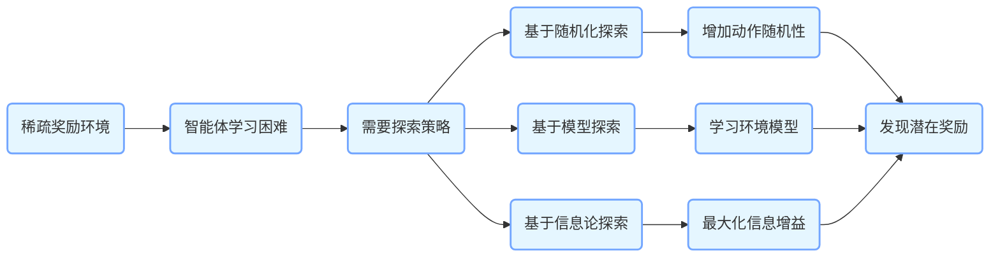

# AI系统在处理稀疏奖励环境时的探索策略

> 关键词：AI系统、稀疏奖励环境、探索策略、强化学习、奖励机制

> 摘要：本文聚焦于AI系统在处理稀疏奖励环境时的探索策略。首先介绍了研究的背景、目的、预期读者等内容。接着阐述了核心概念及其联系，包括稀疏奖励环境和探索策略的原理与架构，并给出相应的文本示意图和Mermaid流程图。详细讲解了核心算法原理，结合Python源代码说明具体操作步骤。通过数学模型和公式深入剖析探索策略的本质，并举例说明。提供了项目实战案例，包括开发环境搭建、源代码实现与解读。探讨了实际应用场景，推荐了相关的学习资源、开发工具框架以及论文著作。最后总结了未来发展趋势与挑战，还给出了常见问题解答和扩展阅读参考资料，旨在为相关领域的研究者和开发者提供全面而深入的指导。

## 1. 背景介绍 
### 1.1 目的和范围
在人工智能领域，强化学习是让智能体通过与环境进行交互，以最大化累积奖励为目标来学习最优策略的重要方法。然而，在许多实际应用场景中，智能体面临的是稀疏奖励环境，即智能体在大部分时间内只能获得零奖励，只有在极少数特定状态下才能获得非零奖励。这种环境给智能体的学习带来了极大的挑战，因为它很难找到有效的探索路径来发现奖励。

本文的目的在于深入研究AI系统在处理稀疏奖励环境时的各种探索策略，分析这些策略的原理、优缺点以及适用场景。范围涵盖了当前主流的探索策略，包括基于随机化的探索策略、基于模型的探索策略、基于信息论的探索策略等，并通过实际案例和代码演示来展示这些策略的应用。

### 1.2 预期读者
本文的预期读者包括人工智能、机器学习、强化学习领域的研究者、开发者，以及对AI系统在复杂环境下学习机制感兴趣的学生和技术爱好者。无论是从事学术研究，还是进行实际项目开发，读者都可以从本文中获得关于稀疏奖励环境下探索策略的全面知识和实践指导。

### 1.3 文档结构概述
本文将按照以下结构进行组织：
- 核心概念与联系：介绍稀疏奖励环境和探索策略的核心概念，以及它们之间的联系，并通过文本示意图和Mermaid流程图进行直观展示。
- 核心算法原理 & 具体操作步骤：详细讲解常见探索策略的算法原理，并使用Python源代码实现具体操作步骤。
- 数学模型和公式 & 详细讲解 & 举例说明：运用数学模型和公式深入分析探索策略的本质，并通过具体例子进行说明。
- 项目实战：代码实际案例和详细解释说明：通过一个实际的项目案例，展示如何在稀疏奖励环境中应用探索策略，包括开发环境搭建、源代码实现和代码解读。
- 实际应用场景：探讨稀疏奖励环境下探索策略在不同领域的实际应用场景。
- 工具和资源推荐：推荐相关的学习资源、开发工具框架和论文著作。
- 总结：未来发展趋势与挑战：总结当前探索策略的发展现状，分析未来的发展趋势和面临的挑战。
- 附录：常见问题与解答：解答读者在学习和应用过程中可能遇到的常见问题。
- 扩展阅读 & 参考资料：提供进一步学习和研究的扩展阅读材料和参考资料。

### 1.4 术语表
#### 1.4.1 核心术语定义
- **稀疏奖励环境**：在强化学习中，智能体在与环境交互的过程中，大部分时间获得的奖励为零，只有在极少数特定状态下才能获得非零奖励的环境。
- **探索策略**：智能体在稀疏奖励环境中为了发现潜在的奖励，而采用的一种行动策略，旨在平衡对已知策略的利用和对未知状态的探索。
- **强化学习**：一种机器学习范式，智能体通过与环境进行交互，根据环境反馈的奖励信号来学习最优策略。
- **智能体**：在强化学习中，能够感知环境状态并采取行动的实体。
- **策略**：智能体根据当前环境状态选择行动的规则。

#### 1.4.2 相关概念解释
- **奖励机制**：环境根据智能体的行动给予的反馈信号，用于指导智能体学习最优策略。在稀疏奖励环境中，奖励机制的设计尤为重要。
- **探索与利用平衡**：智能体在学习过程中需要在利用已经学到的策略来获取奖励和探索未知状态以发现新的奖励之间进行平衡。
- **状态空间**：环境中所有可能的状态组成的集合。在稀疏奖励环境中，状态空间通常非常大，增加了智能体探索的难度。

#### 1.4.3 缩略词列表
- **RL**：Reinforcement Learning，强化学习
- **DQN**：Deep Q-Network，深度Q网络
- **UCB**：Upper Confidence Bound，上置信界
- **MBRL**：Model-Based Reinforcement Learning，基于模型的强化学习

## 2. 核心概念与联系 

### 2.1 稀疏奖励环境
在强化学习中，环境通常由状态空间 $S$、动作空间 $A$ 和奖励函数 $R$ 组成。智能体在每个时间步 $t$ 观察到当前状态 $s_t \in S$，并根据策略 $\pi$ 选择一个动作 $a_t \in A$，然后环境会根据状态转移函数 $P(s_{t+1}|s_t, a_t)$ 转移到下一个状态 $s_{t+1}$，同时给予智能体一个奖励 $r_t = R(s_t, a_t, s_{t+1})$。

在稀疏奖励环境中，奖励函数 $R$ 的特点是大部分情况下 $r_t = 0$，只有在极少数特定状态下才能获得非零奖励。例如，在机器人导航任务中，机器人只有到达目标位置时才能获得正奖励，在其他位置移动时奖励为零；在游戏中，玩家只有在完成特定任务或达到特定关卡时才能获得奖励，在游戏过程中的大部分时间奖励为零。

### 2.2 探索策略
探索策略的目标是帮助智能体在稀疏奖励环境中有效地发现潜在的奖励。常见的探索策略可以分为以下几类：
- **基于随机化的探索策略**：通过在动作选择过程中引入随机性，让智能体尝试不同的动作，从而增加发现奖励的机会。例如，$\epsilon$-贪心策略就是一种简单的基于随机化的探索策略，它以概率 $\epsilon$ 随机选择一个动作，以概率 $1 - \epsilon$ 选择当前估计价值最大的动作。
- **基于模型的探索策略**：通过学习环境的模型，预测不同动作的后果，从而指导智能体进行探索。例如，基于模型的强化学习（MBRL）方法通过学习状态转移函数和奖励函数，利用模型来规划最优的探索路径。
- **基于信息论的探索策略**：通过最大化信息增益或最小化不确定性，让智能体选择能够提供更多信息的动作进行探索。例如，使用熵作为信息度量，智能体选择能够增加动作分布熵的动作，以探索更多未知的状态。

### 2.3 核心概念联系
稀疏奖励环境给智能体的学习带来了困难，因为智能体很难在大量的零奖励状态中找到有效的探索路径。而探索策略则是解决这一问题的关键，它帮助智能体在稀疏奖励环境中进行有效的探索，发现潜在的奖励。不同的探索策略适用于不同的稀疏奖励环境，选择合适的探索策略可以显著提高智能体的学习效率。

### 2.4 文本示意图
```plaintext
稀疏奖励环境
|
|-- 状态空间大且复杂
|-- 奖励分布稀疏
|
|-- 挑战：智能体难寻奖励
|
探索策略
|
|-- 基于随机化
|   |-- 增加动作随机性
|
|-- 基于模型
|   |-- 学习环境模型指导探索
|
|-- 基于信息论
|   |-- 最大化信息增益探索
|
|-- 作用：助智能体发现奖励
```

### 2.5 Mermaid流程图


## 3. 核心算法原理 & 具体操作步骤 

### 3.1 $\epsilon$-贪心策略
#### 3.1.1 算法原理
$\epsilon$-贪心策略是一种简单而常用的基于随机化的探索策略。在每个时间步 $t$，智能体以概率 $\epsilon$ 随机选择一个动作，以概率 $1 - \epsilon$ 选择当前估计价值最大的动作。具体来说，设 $Q(s, a)$ 表示在状态 $s$ 下选择动作 $a$ 的估计价值，$\pi(s)$ 表示智能体在状态 $s$ 下选择的动作，则 $\epsilon$-贪心策略的动作选择规则为：

$$
\pi(s) = 
\begin{cases}
\text{随机选择一个动作} & \text{以概率 } \epsilon \\
\arg\max_{a \in A} Q(s, a) & \text{以概率 } 1 - \epsilon
\end{cases}
$$

#### 3.1.2 Python代码实现
```python
import numpy as np

def epsilon_greedy_policy(Q, state, epsilon, num_actions):
    """
    Epsilon-greedy策略实现
    :param Q: Q表，存储状态-动作对的估计价值
    :param state: 当前状态
    :param epsilon: 探索概率
    :param num_actions: 动作数量
    :return: 选择的动作
    """
    if np.random.uniform(0, 1) < epsilon:
        # 以概率epsilon随机选择一个动作
        action = np.random.choice(num_actions)
    else:
        # 以概率1 - epsilon选择估计价值最大的动作
        action = np.argmax(Q[state])
    return action
```

### 3.2 上置信界（UCB）策略
#### 3.2.1 算法原理
上置信界（UCB）策略是一种基于置信区间的探索策略，它通过为每个动作的估计价值加上一个置信上界，来鼓励智能体探索那些估计价值不确定的动作。具体来说，设 $N(s, a)$ 表示在状态 $s$ 下选择动作 $a$ 的次数，$Q(s, a)$ 表示在状态 $s$ 下选择动作 $a$ 的估计价值，则 UCB 策略的动作选择规则为：

$$
\pi(s) = \arg\max_{a \in A} \left[Q(s, a) + c \sqrt{\frac{\ln t}{N(s, a)}}\right]
$$

其中，$t$ 表示当前时间步，$c$ 是一个常数，用于控制探索的程度。

#### 3.2.2 Python代码实现
```python
import numpy as np

def ucb_policy(Q, N, state, c, t):
    """
    UCB策略实现
    :param Q: Q表，存储状态-动作对的估计价值
    :param N: 记录每个状态-动作对的选择次数
    :param state: 当前状态
    :param c: 探索系数
    :param t: 当前时间步
    :return: 选择的动作
    """
    num_actions = len(Q[state])
    ucb_values = []
    for action in range(num_actions):
        if N[state][action] == 0:
            # 如果某个动作还没有被选择过，优先选择该动作
            return action
        # 计算每个动作的UCB值
        ucb_value = Q[state][action] + c * np.sqrt(np.log(t) / N[state][action])
        ucb_values.append(ucb_value)
    # 选择UCB值最大的动作
    action = np.argmax(ucb_values)
    return action
```

### 3.3 基于模型的探索策略（简单示例）
#### 3.3.1 算法原理
基于模型的探索策略通过学习环境的模型，预测不同动作的后果，从而指导智能体进行探索。这里我们以一个简单的基于模型的探索策略为例，假设我们已经学习了状态转移函数 $\hat{P}(s_{t+1}|s_t, a_t)$ 和奖励函数 $\hat{R}(s_t, a_t, s_{t+1})$，则智能体可以使用这些模型来规划最优的探索路径。

#### 3.3.2 Python代码实现
```python
import numpy as np

# 假设已经学习到的状态转移模型和奖励模型
def transition_model(state, action):
    """
    简单的状态转移模型示例
    :param state: 当前状态
    :param action: 选择的动作
    :return: 下一个状态
    """
    # 这里只是一个简单的示例，实际应用中需要根据具体环境学习状态转移模型
    next_state = state + action
    return next_state

def reward_model(state, action, next_state):
    """
    简单的奖励模型示例
    :param state: 当前状态
    :param action: 选择的动作
    :param next_state: 下一个状态
    :return: 奖励
    """
    # 这里只是一个简单的示例，实际应用中需要根据具体环境学习奖励模型
    if next_state == 10:
        reward = 1
    else:
        reward = 0
    return reward

def model_based_exploration(state, num_actions):
    """
    基于模型的探索策略示例
    :param state: 当前状态
    :param num_actions: 动作数量
    :return: 选择的动作
    """
    best_action = None
    best_reward = -np.inf
    for action in range(num_actions):
        # 使用状态转移模型预测下一个状态
        next_state = transition_model(state, action)
        # 使用奖励模型预测奖励
        reward = reward_model(state, action, next_state)
        if reward > best_reward:
            best_reward = reward
            best_action = action
    return best_action
```

## 4. 数学模型和公式 & 详细讲解 & 举例说明 

### 4.1 $\epsilon$-贪心策略的数学分析
#### 4.1.1 长期累积奖励分析
设 $V^{\pi}(s)$ 表示在策略 $\pi$ 下从状态 $s$ 开始的长期累积奖励的期望，即：

$$
V^{\pi}(s) = \mathbb{E}\left[\sum_{t=0}^{\infty} \gamma^t r_t \mid s_0 = s, \pi\right]
$$

其中，$\gamma \in [0, 1)$ 是折扣因子，用于权衡即时奖励和未来奖励的重要性。

在 $\epsilon$-贪心策略下，智能体以概率 $\epsilon$ 进行探索，以概率 $1 - \epsilon$ 进行利用。当 $\epsilon$ 较小时，智能体更倾向于利用已经学到的策略，长期累积奖励可能会收敛到一个局部最优解；当 $\epsilon$ 较大时，智能体更倾向于探索，虽然可能会发现更好的策略，但也会增加不必要的探索成本。

#### 4.1.2 举例说明
假设一个简单的马尔可夫决策过程（MDP），状态空间 $S = \{s_1, s_2\}$，动作空间 $A = \{a_1, a_2\}$，奖励函数如下：

| 状态 | 动作 | 下一个状态 | 奖励 |
|------|------|------------|------|
| $s_1$ | $a_1$ | $s_1$ | 0 |
| $s_1$ | $a_2$ | $s_2$ | 1 |
| $s_2$ | $a_1$ | $s_1$ | 0 |
| $s_2$ | $a_2$ | $s_2$ | 0 |

设初始状态为 $s_1$，折扣因子 $\gamma = 0.9$。如果使用 $\epsilon$-贪心策略，当 $\epsilon = 0$ 时，智能体总是选择当前估计价值最大的动作。假设初始时 $Q(s_1, a_1) = Q(s_1, a_2) = 0$，则智能体可能会一直选择 $a_1$，从而无法发现 $a_2$ 可以获得奖励。当 $\epsilon = 0.1$ 时，智能体有 10% 的概率随机选择动作，就有可能选择 $a_2$ 并获得奖励。

### 4.2 上置信界（UCB）策略的数学分析
#### 4.2.1 置信区间分析
UCB 策略通过为每个动作的估计价值加上一个置信上界，来鼓励智能体探索那些估计价值不确定的动作。置信上界 $c \sqrt{\frac{\ln t}{N(s, a)}}$ 的作用是随着时间的推移，当某个动作被选择的次数 $N(s, a)$ 增加时，置信上界会逐渐减小，从而减少对该动作的探索；而对于那些选择次数较少的动作，置信上界会较大，鼓励智能体进行探索。

#### 4.2.2 举例说明
假设一个多臂老虎机问题，有 $K$ 个老虎机，每个老虎机的奖励服从不同的分布。设 $Q(a)$ 表示选择第 $a$ 个老虎机的估计价值，$N(a)$ 表示选择第 $a$ 个老虎机的次数。在初始阶段，由于每个老虎机的选择次数都很少，置信上界会很大，智能体会尝试不同的老虎机。随着时间的推移，当某个老虎机被选择的次数较多时，其置信上界会减小，智能体会更倾向于选择估计价值高且置信上界小的老虎机。

### 4.3 基于模型的探索策略的数学分析
#### 4.3.1 模型学习误差分析
基于模型的探索策略依赖于学习到的状态转移模型 $\hat{P}(s_{t+1}|s_t, a_t)$ 和奖励模型 $\hat{R}(s_t, a_t, s_{t+1})$。模型学习误差会影响智能体的探索效果。设真实的状态转移模型为 $P(s_{t+1}|s_t, a_t)$，奖励模型为 $R(s_t, a_t, s_{t+1})$，则模型学习误差可以表示为：

$$
\Delta P = \sum_{s_t, a_t, s_{t+1}} \left|\hat{P}(s_{t+1}|s_t, a_t) - P(s_{t+1}|s_t, a_t)\right|
$$

$$
\Delta R = \sum_{s_t, a_t, s_{t+1}} \left|\hat{R}(s_t, a_t, s_{t+1}) - R(s_t, a_t, s_{t+1})\right|
$$

当模型学习误差较小时，智能体可以根据模型进行有效的探索；当模型学习误差较大时，智能体可能会做出错误的决策。

#### 4.3.2 举例说明
在机器人导航任务中，假设机器人学习到的状态转移模型不准确，例如预测机器人向前移动一步不会撞到障碍物，但实际上会撞到障碍物。那么机器人根据这个错误的模型进行探索，可能会导致碰撞事故，从而影响探索效率。

## 5. 项目实战：代码实际案例和详细解释说明 

### 5.1  开发环境搭建
#### 5.1.1 安装Python
首先需要安装Python，建议使用Python 3.6及以上版本。可以从Python官方网站（https://www.python.org/downloads/）下载安装包，按照安装向导进行安装。

#### 5.1.2 安装必要的库
在本项目中，我们需要使用一些常见的Python库，如 `numpy`、`gym` 等。可以使用 `pip` 命令进行安装：
```sh
pip install numpy gym
```

`numpy` 是一个用于科学计算的Python库，提供了高效的数组操作和数学函数。`gym` 是OpenAI开发的一个用于开发和比较强化学习算法的工具包，提供了各种模拟环境。

### 5.2  源代码详细实现和代码解读
#### 5.2.1 环境介绍
我们将使用 `gym` 库中的 `FrozenLake-v1` 环境作为示例。`FrozenLake-v1` 是一个简单的冰湖导航环境，智能体需要在一个 $4\times4$ 的冰湖上找到通往目标的路径。环境中有冰面（F）、起点（S）、目标（G）和洞（H），智能体的动作包括上下左右移动。如果智能体到达目标，将获得奖励 1；如果掉入洞，将获得奖励 0 并结束回合；在其他情况下，奖励为 0。

#### 5.2.2 代码实现
```python
import gym
import numpy as np

# 创建FrozenLake-v1环境
env = gym.make('FrozenLake-v1')

# 初始化Q表
num_states = env.observation_space.n
num_actions = env.action_space.n
Q = np.zeros((num_states, num_actions))

# 定义超参数
epsilon = 0.1
alpha = 0.1
gamma = 0.9
num_episodes = 1000

# 定义epsilon-greedy策略
def epsilon_greedy_policy(Q, state, epsilon, num_actions):
    if np.random.uniform(0, 1) < epsilon:
        action = np.random.choice(num_actions)
    else:
        action = np.argmax(Q[state])
    return action

# 训练循环
for episode in range(num_episodes):
    state = env.reset()
    done = False
    while not done:
        # 根据epsilon-greedy策略选择动作
        action = epsilon_greedy_policy(Q, state, epsilon, num_actions)
        # 执行动作并获取下一个状态、奖励和是否结束的信息
        next_state, reward, done, _ = env.step(action)
        # 更新Q表
        Q[state][action] = Q[state][action] + alpha * (reward + gamma * np.max(Q[next_state]) - Q[state][action])
        state = next_state

# 测试智能体
state = env.reset()
done = False
total_reward = 0
while not done:
    action = np.argmax(Q[state])
    next_state, reward, done, _ = env.step(action)
    total_reward += reward
    state = next_state

print(f"Total reward in test: {total_reward}")

# 关闭环境
env.close()
```

#### 5.2.3 代码解读
1. **环境创建**：使用 `gym.make('FrozenLake-v1')` 创建 `FrozenLake-v1` 环境。
2. **Q表初始化**：初始化一个 $Q$ 表，用于存储每个状态-动作对的估计价值。
3. **超参数设置**：设置探索概率 $\epsilon$、学习率 $\alpha$、折扣因子 $\gamma$ 和训练回合数 `num_episodes`。
4. **epsilon-greedy策略定义**：定义 `epsilon_greedy_policy` 函数，用于根据 $\epsilon$-贪心策略选择动作。
5. **训练循环**：在每个训练回合中，智能体根据 $\epsilon$-贪心策略选择动作，执行动作并获取下一个状态、奖励和是否结束的信息，然后使用Q学习算法更新 $Q$ 表。
6. **测试智能体**：在训练结束后，使用训练好的 $Q$ 表进行测试，选择估计价值最大的动作，计算总奖励。
7. **环境关闭**：使用 `env.close()` 关闭环境。

### 5.3  代码解读与分析
#### 5.3.1 Q学习算法分析
Q学习是一种无模型的强化学习算法，其更新公式为：

$$
Q(s, a) \leftarrow Q(s, a) + \alpha \left[r + \gamma \max_{a'} Q(s', a') - Q(s, a)\right]
$$

其中，$s$ 是当前状态，$a$ 是选择的动作，$r$ 是获得的奖励，$s'$ 是下一个状态，$\alpha$ 是学习率，$\gamma$ 是折扣因子。

Q学习算法的核心思想是通过不断更新 $Q$ 表，使得 $Q(s, a)$ 逐渐逼近在状态 $s$ 下选择动作 $a$ 的最优长期累积奖励。

#### 5.3.2 探索与利用平衡分析
在本代码中，使用 $\epsilon$-贪心策略来平衡探索与利用。在训练初期，由于智能体对环境还不了解，需要通过探索来发现潜在的奖励，因此 $\epsilon$ 可以设置得较大；随着训练的进行，智能体逐渐学习到了一些有效的策略，此时可以适当减小 $\epsilon$，以更多地利用已经学到的策略。

#### 5.3.3 超参数影响分析
- **学习率 $\alpha$**：学习率 $\alpha$ 控制了每次更新 $Q$ 表时的步长。如果 $\alpha$ 过大，$Q$ 表的更新会过于剧烈，可能导致算法无法收敛；如果 $\alpha$ 过小，$Q$ 表的更新会过于缓慢，算法的收敛速度会变慢。
- **折扣因子 $\gamma$**：折扣因子 $\gamma$ 用于权衡即时奖励和未来奖励的重要性。如果 $\gamma$ 接近 1，智能体更注重未来的奖励；如果 $\gamma$ 接近 0，智能体更注重即时奖励。
- **探索概率 $\epsilon$**：探索概率 $\epsilon$ 控制了智能体的探索程度。如果 $\epsilon$ 过大，智能体可能会进行过多的无效探索；如果 $\epsilon$ 过小，智能体可能会陷入局部最优解。

## 6. 实际应用场景 
### 6.1 机器人导航
在机器人导航任务中，机器人需要在一个未知的环境中找到目标位置。环境中可能存在障碍物、未知区域等，奖励通常是稀疏的，只有当机器人到达目标位置时才能获得正奖励。使用探索策略可以帮助机器人在稀疏奖励环境中有效地探索未知区域，发现通往目标的路径。例如，机器人可以使用基于模型的探索策略，学习环境的地图和障碍物信息，规划最优的探索路径；也可以使用基于随机化的探索策略，随机选择动作进行探索，增加发现目标的机会。

### 6.2 游戏开发
在游戏开发中，许多游戏的奖励是稀疏的。例如，在角色扮演游戏中，玩家只有在完成特定任务、击败特定敌人或达到特定等级时才能获得奖励；在策略游戏中，玩家只有在取得胜利或达到特定目标时才能获得奖励。使用探索策略可以帮助智能玩家在游戏中探索不同的策略和玩法，发现隐藏的奖励和通关方法。例如，智能玩家可以使用 $\epsilon$-贪心策略，在游戏初期以一定的概率尝试不同的动作，学习游戏规则和策略；在游戏后期，逐渐减少探索概率，利用已经学到的策略来获取更高的分数。

### 6.3 推荐系统
在推荐系统中，用户的反馈通常是稀疏的，只有当用户对推荐的内容进行点击、购买等操作时才能获得正反馈。使用探索策略可以帮助推荐系统在稀疏反馈环境中探索不同的推荐策略，发现用户感兴趣的内容。例如，推荐系统可以使用基于信息论的探索策略，最大化推荐内容的信息增益，推荐那些能够提供更多信息的内容，从而提高用户的点击率和满意度。

### 6.4 金融投资
在金融投资领域，投资者需要在复杂的市场环境中做出投资决策。市场的回报通常是稀疏的，只有在正确预测市场走势并做出合理的投资决策时才能获得收益。使用探索策略可以帮助投资者在稀疏回报环境中探索不同的投资策略，发现潜在的投资机会。例如，投资者可以使用基于模型的探索策略，学习市场的历史数据和规律，预测市场走势，制定最优的投资策略；也可以使用基于随机化的探索策略，尝试不同的投资组合，增加发现高收益投资机会的可能性。

## 7. 工具和资源推荐
### 7.1 学习资源推荐
#### 7.1.1 书籍推荐
- 《Reinforcement Learning: An Introduction》（《强化学习：原理与Python实现》）：这是一本经典的强化学习教材，全面介绍了强化学习的基本概念、算法和应用。书中包含了丰富的示例和代码，适合初学者和有一定基础的读者阅读。
- 《Deep Reinforcement Learning Hands-On》（《深度强化学习实战》）：本书重点介绍了深度强化学习的相关知识和技术，包括深度Q网络（DQN）、策略梯度算法等。通过实际案例和代码演示，帮助读者掌握深度强化学习的应用。
- 《Algorithms for Reinforcement Learning》（《强化学习算法》）：这本书深入探讨了强化学习的算法原理和数学基础，适合对算法细节感兴趣的读者阅读。

#### 7.1.2 在线课程
- Coursera上的《Reinforcement Learning Specialization》：这是一个由阿尔伯塔大学提供的强化学习专项课程，包括四门课程，从基础的强化学习概念到高级的深度强化学习算法都有涉及。课程由知名教授授课，内容丰富，适合不同层次的学习者。
- edX上的《Introduction to Reinforcement Learning》：这是一门由加州大学伯克利分校提供的强化学习入门课程，介绍了强化学习的基本概念、算法和应用。课程配有在线实验和作业，帮助学习者加深对知识的理解。
- OpenAI的Spinning Up in Deep RL：这是OpenAI提供的一个深度强化学习教程，包含了详细的文档、代码示例和教学视频，适合想要快速上手深度强化学习的开发者。

#### 7.1.3 技术博客和网站
- OpenAI Blog：OpenAI的官方博客，发布了许多关于人工智能和强化学习的最新研究成果和技术文章。
- DeepMind Blog：DeepMind的官方博客，分享了他们在人工智能领域的研究进展和应用案例，包括许多关于强化学习的内容。
- Towards Data Science：这是一个专注于数据科学和机器学习的技术博客平台，有许多关于强化学习的优质文章和教程。

### 7.2 开发工具框架推荐
#### 7.2.1 IDE和编辑器
- PyCharm：这是一个专业的Python集成开发环境（IDE），提供了丰富的代码编辑、调试和项目管理功能，适合开发强化学习项目。
- Jupyter Notebook：这是一个交互式的笔记本环境，支持Python代码的编写、运行和可视化，非常适合进行实验和数据分析，在强化学习研究中广泛使用。
- Visual Studio Code：这是一个轻量级的代码编辑器，支持多种编程语言和插件扩展，具有良好的代码编辑和调试功能，也可以用于开发强化学习项目。

#### 7.2.2 调试和性能分析工具
- TensorBoard：这是TensorFlow提供的一个可视化工具，可以用于监控训练过程中的各种指标，如损失函数、奖励曲线等，帮助开发者调试和优化模型。
- Py-Spy：这是一个Python性能分析工具，可以实时分析Python程序的性能瓶颈，找出代码中的耗时部分，提高程序的运行效率。
- cProfile：这是Python标准库中的一个性能分析模块，可以用于分析Python程序的函数调用时间和次数，帮助开发者找出性能问题。

#### 7.2.3 相关框架和库
- OpenAI Gym：这是一个用于开发和比较强化学习算法的工具包，提供了各种模拟环境，如机器人导航、游戏等，方便开发者进行实验和测试。
- Stable Baselines3：这是一个基于PyTorch的强化学习库，实现了许多常见的强化学习算法，如DQN、A2C、PPO等，具有简单易用的API，适合快速开发和测试强化学习模型。
- TensorFlow和PyTorch：这是两个广泛使用的深度学习框架，提供了丰富的神经网络模型和工具，可用于实现深度强化学习算法。

### 7.3 相关论文著作推荐
#### 7.3.1 经典论文
- "Q-learning" by Watkins and Dayan：这是Q学习算法的经典论文，首次提出了Q学习的概念和算法，为无模型强化学习奠定了基础。
- "Playing Atari with Deep Reinforcement Learning" by Mnih et al.：这篇论文首次将深度神经网络应用于强化学习，提出了深度Q网络（DQN）算法，在Atari游戏上取得了显著的成果，开启了深度强化学习的时代。
- "Asynchronous Methods for Deep Reinforcement Learning" by Mnih et al.：这篇论文提出了异步优势演员-评论家（A3C）算法，通过异步训练的方式提高了深度强化学习的训练效率。

#### 7.3.2 最新研究成果
- "Proximal Policy Optimization Algorithms" by Schulman et al.：这篇论文提出了近端策略优化（PPO）算法，是一种高效的策略梯度算法，在许多强化学习任务中取得了优异的性能。
- "Dream to Control: Learning Behaviors by Latent Imagination" by Hafner et al.：这篇论文提出了一种基于模型的深度强化学习方法，通过学习环境的潜在表示来进行想象和规划，提高了智能体在稀疏奖励环境中的学习效率。
- "Exploration by Random Network Distillation" by Burda et al.：这篇论文提出了一种基于随机网络蒸馏（RND）的探索策略，通过最大化预测误差来鼓励智能体进行探索，在稀疏奖励环境中取得了良好的效果。

#### 7.3.3 应用案例分析
- "Mastering the Game of Go without Human Knowledge" by Silver et al.：这篇论文介绍了AlphaGo Zero的工作原理和实现方法，展示了深度强化学习在复杂游戏中的强大应用能力。
- "Solving Rubik's Cube with a Robot Hand" by OpenAI：这篇论文介绍了OpenAI使用强化学习训练机器人手解决魔方问题的研究成果，展示了强化学习在机器人控制领域的应用潜力。
- "Deep Reinforcement Learning for Automated Stock Trading: An Ensemble Strategy" by Deng et al.：这篇论文探讨了深度强化学习在金融投资领域的应用，提出了一种基于集成策略的自动化股票交易方法。

## 8. 总结：未来发展趋势与挑战
### 8.1 未来发展趋势
#### 8.1.1 结合多模态信息
未来的探索策略可能会结合多模态信息，如视觉、听觉、触觉等，以更全面地感知环境，提高智能体在稀疏奖励环境中的探索能力。例如，在机器人导航任务中，机器人可以同时利用视觉信息识别障碍物和目标位置，利用触觉信息感知与环境的交互，从而更有效地进行探索。

#### 8.1.2 元学习与探索策略的结合
元学习是一种让智能体快速学习新任务的方法。将元学习与探索策略相结合，可以让智能体在不同的稀疏奖励环境中快速适应和学习，提高探索效率。例如，智能体可以通过元学习学习到一些通用的探索策略，在面对新的环境时能够迅速调整探索方式。

#### 8.1.3 基于深度学习的探索策略
随着深度学习技术的不断发展，基于深度学习的探索策略将成为未来的研究热点。例如，使用深度神经网络学习环境的复杂特征和动态，设计更加智能和高效的探索策略。同时，结合生成对抗网络（GAN）、变分自编码器（VAE）等技术，生成虚拟的探索数据，提高智能体的探索能力。

#### 8.1.4 多智能体协同探索
在许多实际应用场景中，需要多个智能体协同完成任务。多智能体协同探索策略可以让多个智能体通过合作和交流，更有效地探索稀疏奖励环境。例如，在大规模的机器人搜索和救援任务中，多个机器人可以通过协同探索，快速找到被困人员。

### 8.2 挑战
#### 8.2.1 计算资源需求
随着探索策略的不断复杂和环境的不断增大，计算资源的需求也会越来越高。例如，基于深度学习的探索策略需要大量的计算资源来训练深度神经网络，这对于一些资源受限的设备来说是一个挑战。

#### 8.2.2 可解释性问题
许多基于深度学习的探索策略是黑盒模型，难以解释其决策过程和行为。在一些对安全性和可靠性要求较高的应用场景中，如医疗、交通等，可解释性问题是一个亟待解决的问题。

#### 8.2.3 环境不确定性
在实际应用中，环境往往是不确定的，存在噪声、动态变化等因素。这些不确定性会影响智能体的探索效果，如何设计能够适应环境不确定性的探索策略是一个挑战。

#### 8.2.4 奖励设计困难
在稀疏奖励环境中，奖励设计是一个关键问题。不合理的奖励设计可能会导致智能体陷入局部最优解或无法学习到有效的策略。如何设计合理的奖励函数，引导智能体进行有效的探索，是一个具有挑战性的问题。

## 9. 附录：常见问题与解答
### 9.1 如何选择合适的探索策略？
选择合适的探索策略需要考虑多个因素，如环境的特点、智能体的学习能力、计算资源等。如果环境的状态空间较小，基于随机化的探索策略（如 $\epsilon$-贪心策略）可能是一个简单有效的选择；如果环境的动态可以建模，基于模型的探索策略可能会更有效；如果需要最大化信息增益，基于信息论的探索策略可能是一个不错的选择。

### 9.2 探索策略中的超参数如何调整？
探索策略中的超参数（如 $\epsilon$、$c$、$\alpha$、$\gamma$ 等）的调整通常需要通过实验来确定。可以使用网格搜索、随机搜索等方法在一定范围内尝试不同的超参数组合，选择性能最优的超参数。同时，也可以使用一些自适应的方法，让超参数在学习过程中自动调整。

### 9.3 基于模型的探索策略中，如何学习准确的环境模型？
学习准确的环境模型需要大量的训练数据和合适的学习算法。可以使用监督学习方法，如神经网络、决策树等，根据智能体与环境的交互数据来学习状态转移模型和奖励模型。同时，需要注意避免过拟合问题，可以使用正则化、交叉验证等方法来提高模型的泛化能力。

### 9.4 探索策略在实际应用中可能会遇到哪些问题？
探索策略在实际应用中可能会遇到以下问题：
- **探索效率低下**：如果探索策略设计不合理，智能体可能会进行大量的无效探索，导致学习效率低下。
- **陷入局部最优解**：在某些情况下，智能体可能会陷入局部最优解，无法找到全局最优策略。
- **环境变化**：如果环境发生变化，原有的探索策略可能不再适用，需要重新调整或学习。
- **计算资源不足**：一些复杂的探索策略需要大量的计算资源，可能会受到设备性能的限制。

## 10. 扩展阅读 & 参考资料
### 10.1 扩展阅读
- Sutton, Richard S., and Andrew G. Barto. *Reinforcement Learning: An Introduction*. MIT press, 2018.
- Lillicrap, Timothy P., et al. "Continuous control with deep reinforcement learning." *arXiv preprint arXiv:1509.02971* (2015).
- Silver, David, et al. "Mastering the game of Go with deep neural networks and tree search." *nature* 529.7587 (2016): 484-489.

### 10.2 参考资料
- OpenAI Gym官方文档：https://gym.openai.com/docs/
- Stable Baselines3官方文档：https://stable-baselines3.readthedocs.io/en/master/
- TensorFlow官方文档：https://www.tensorflow.org/api_docs
- PyTorch官方文档：https://pytorch.org/docs/stable/index.html