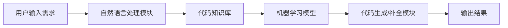

# AI编程工具：程序员的助手还是对手？

> 关键词：AI编程工具、程序员、助手、对手、编程效率、代码质量、未来趋势

> 摘要：本文围绕AI编程工具是程序员的助手还是对手这一核心问题展开深入探讨。首先介绍了相关背景，包括研究目的、预期读者、文档结构和术语表。接着阐述了AI编程工具的核心概念及其与程序员的联系，通过原理和架构示意图以及Mermaid流程图进行清晰展示。详细讲解了其核心算法原理和具体操作步骤，结合Python代码进行说明。给出了数学模型和公式并举例。通过项目实战案例展示了AI编程工具的实际应用，包括开发环境搭建、源代码实现和解读。分析了其实际应用场景，推荐了学习资源、开发工具框架和相关论文著作。最后总结了未来发展趋势与挑战，解答了常见问题，并提供了扩展阅读和参考资料，旨在帮助读者全面理解AI编程工具在编程领域中的角色和影响。

## 1. 背景介绍 
### 1.1 目的和范围
在当今数字化时代，AI编程工具如雨后春笋般涌现，它们以其强大的功能和高效的表现吸引了众多程序员的关注。本文章的目的在于深入探讨AI编程工具对于程序员而言，究竟是助力其提升工作效率和代码质量的得力助手，还是可能会对其职业发展构成威胁的对手。文章将涵盖AI编程工具的核心概念、算法原理、实际应用场景等多个方面，旨在为读者提供一个全面且深入的视角来理解这一问题。

### 1.2 预期读者
本文的预期读者主要包括广大程序员群体，他们希望了解AI编程工具的发展现状、功能特点以及对自身职业的影响；软件开发者和架构师，他们关注如何利用AI编程工具优化软件开发流程和提高软件质量；技术爱好者和研究者，他们对人工智能在编程领域的应用感兴趣，希望深入了解相关技术原理和发展趋势。

### 1.3 文档结构概述
本文将按照以下结构进行组织：首先介绍AI编程工具的背景信息，包括目的、预期读者和文档结构概述，以及相关术语的定义和解释。接着阐述AI编程工具的核心概念，展示其原理和架构示意图，并通过Mermaid流程图进行可视化呈现。然后详细讲解核心算法原理，结合Python代码给出具体操作步骤。再介绍相关的数学模型和公式，并举例说明其应用。通过项目实战案例，展示AI编程工具在实际开发中的应用，包括开发环境搭建、源代码实现和代码解读。分析AI编程工具的实际应用场景，推荐相关的学习资源、开发工具框架和论文著作。最后总结AI编程工具的未来发展趋势与挑战，解答常见问题，并提供扩展阅读和参考资料。

### 1.4 术语表
#### 1.4.1 核心术语定义
- **AI编程工具**：利用人工智能技术开发的，能够辅助程序员进行代码编写、调试、优化等编程工作的软件工具。
- **代码补全**：AI编程工具根据程序员输入的部分代码，自动预测并提供完整代码的功能。
- **代码生成**：AI编程工具根据用户的需求描述，自动生成相应代码的功能。
- **代码分析**：AI编程工具对现有代码进行检查、评估和优化建议的功能。

#### 1.4.2 相关概念解释
- **机器学习**：是人工智能的一个分支，通过让计算机从数据中学习模式和规律，从而实现预测和决策等功能。AI编程工具通常会利用机器学习算法来实现代码补全、代码生成等功能。
- **自然语言处理**：研究如何让计算机理解和处理人类语言的技术。在AI编程工具中，自然语言处理技术可以用于将用户的自然语言需求转换为代码。

#### 1.4.3 缩略词列表
- **ML**：Machine Learning，机器学习
- **NLP**：Natural Language Processing，自然语言处理

## 2. 核心概念与联系 

### 核心概念原理
AI编程工具的核心原理主要基于机器学习和自然语言处理技术。机器学习算法可以对大量的代码数据进行学习和分析，从而掌握不同编程语言的语法规则、代码模式和常见编程习惯。自然语言处理技术则可以将用户的自然语言描述转换为计算机能够理解的指令，进而实现根据需求生成代码的功能。

以代码补全功能为例，AI编程工具会分析程序员输入的代码上下文，结合其学习到的代码模式，预测程序员接下来可能要输入的代码，并提供相应的补全建议。对于代码生成功能，工具会先对用户的自然语言需求进行解析，提取关键信息，然后根据这些信息在其代码知识库中搜索匹配的代码片段，或者利用生成式模型生成符合需求的代码。

### 架构示意图
以下是一个简化的AI编程工具架构示意图：

```plaintext
+-------------------+
|  用户界面         |
|  (输入需求、查看结果) |
+-------------------+
         |
         v
+-------------------+
|  自然语言处理模块  |
|  (解析用户需求)    |
+-------------------+
         |
         v
+-------------------+
|  代码知识库        |
|  (存储大量代码数据) |
+-------------------+
         |
         v
+-------------------+
|  机器学习模型      |
|  (训练、预测)      |
+-------------------+
         |
         v
+-------------------+
|  代码生成/补全模块 |
|  (生成或补全代码)  |
+-------------------+
         |
         v
+-------------------+
|  输出结果         |
|  (显示生成的代码)  |
+-------------------+
```

### Mermaid流程图


从流程图可以看出，用户输入需求后，自然语言处理模块对其进行解析，然后从代码知识库中获取相关信息，机器学习模型根据这些信息进行预测和推理，最后代码生成/补全模块生成相应的代码并输出给用户。

## 3. 核心算法原理 & 具体操作步骤 

### 核心算法原理
AI编程工具中常用的核心算法包括深度学习中的循环神经网络（RNN）及其变体长短期记忆网络（LSTM）、门控循环单元（GRU），以及Transformer架构。这些算法能够处理序列数据，非常适合用于代码的预测和生成。

以LSTM为例，它是一种特殊的RNN，能够解决传统RNN在处理长序列时的梯度消失问题。LSTM通过门控机制来控制信息的流动，包括输入门、遗忘门和输出门。输入门决定了新输入信息的哪些部分可以进入细胞状态，遗忘门决定了细胞状态中哪些信息需要被遗忘，输出门决定了细胞状态的哪些部分将作为当前时间步的输出。

### Python代码实现
以下是一个简单的使用LSTM进行代码补全的Python示例：

```python
import numpy as np
import tensorflow as tf
from tensorflow.keras.models import Sequential
from tensorflow.keras.layers import LSTM, Dense

# 假设我们有一些简单的代码数据
code_data = [
    "print('Hello, World!')",
    "x = 10",
    "y = x + 5",
    "if x > 5:",
    "    print('x is greater than 5')"
]

# 构建字符到索引和索引到字符的映射
chars = sorted(list(set(''.join(code_data))))
char_to_index = {char: index for index, char in enumerate(chars)}
index_to_char = {index: char for index, char in enumerate(chars)}

# 准备训练数据
sequence_length = 20
input_sequences = []
target_sequences = []
for code in code_data:
    for i in range(0, len(code) - sequence_length):
        input_seq = code[i:i + sequence_length]
        target_seq = code[i + sequence_length]
        input_sequences.append([char_to_index[char] for char in input_seq])
        target_sequences.append(char_to_index[target_seq])

input_sequences = np.array(input_sequences)
target_sequences = np.array(target_sequences)

# 构建LSTM模型
model = Sequential()
model.add(LSTM(128, input_shape=(sequence_length, 1)))
model.add(Dense(len(chars), activation='softmax'))

model.compile(loss='sparse_categorical_crossentropy', optimizer='adam')

# 训练模型
model.fit(input_sequences.reshape(-1, sequence_length, 1), target_sequences, epochs=100, batch_size=32)

# 代码补全函数
def complete_code(input_text):
    input_seq = [char_to_index[char] for char in input_text[-sequence_length:]]
    input_seq = np.array(input_seq).reshape(1, sequence_length, 1)
    prediction = model.predict(input_seq)
    predicted_index = np.argmax(prediction)
    predicted_char = index_to_char[predicted_index]
    return predicted_char

# 测试代码补全
input_text = "print('Hel"
next_char = complete_code(input_text)
print(f"输入文本: {input_text}")
print(f"预测的下一个字符: {next_char}")
```

### 具体操作步骤
1. **数据准备**：收集大量的代码数据，并进行预处理，包括构建字符到索引和索引到字符的映射，将代码数据转换为适合模型输入的序列。
2. **模型构建**：使用Keras等深度学习框架构建LSTM模型，设置合适的层和参数。
3. **模型训练**：将准备好的训练数据输入到模型中进行训练，设置合适的训练轮数和批次大小。
4. **代码补全**：编写代码补全函数，根据输入的文本预测下一个字符。

## 4. 数学模型和公式 & 详细讲解 & 举例说明 

### 数学模型和公式
在AI编程工具中，LSTM的数学模型可以用以下公式表示：

- 遗忘门：
$$
f_t = \sigma(W_f[h_{t - 1}, x_t] + b_f)
$$

- 输入门：
$$
i_t = \sigma(W_i[h_{t - 1}, x_t] + b_i)
$$

- 细胞状态候选值：
$$
\tilde{C}_t = \tanh(W_C[h_{t - 1}, x_t] + b_C)
$$

- 细胞状态更新：
$$
C_t = f_t \odot C_{t - 1} + i_t \odot \tilde{C}_t
$$

- 输出门：
$$
o_t = \sigma(W_o[h_{t - 1}, x_t] + b_o)
$$

- 隐藏状态输出：
$$
h_t = o_t \odot \tanh(C_t)
$$

其中，$x_t$ 是当前时间步的输入，$h_{t - 1}$ 是上一个时间步的隐藏状态，$C_{t - 1}$ 是上一个时间步的细胞状态，$W_f$、$W_i$、$W_C$、$W_o$ 是权重矩阵，$b_f$、$b_i$、$b_C$、$b_o$ 是偏置向量，$\sigma$ 是Sigmoid函数，$\tanh$ 是双曲正切函数，$\odot$ 表示逐元素相乘。

### 详细讲解
- **遗忘门**：决定了上一个时间步的细胞状态 $C_{t - 1}$ 中哪些信息需要被遗忘。$f_t$ 是一个取值在 $[0, 1]$ 之间的向量，每个元素表示对应信息的遗忘程度。
- **输入门**：决定了新输入信息 $x_t$ 的哪些部分可以进入细胞状态。$i_t$ 同样是一个取值在 $[0, 1]$ 之间的向量。
- **细胞状态候选值**：通过 $\tanh$ 函数计算新输入信息和上一个隐藏状态的线性组合，得到一个候选的细胞状态更新值。
- **细胞状态更新**：将上一个细胞状态 $C_{t - 1}$ 乘以遗忘门的输出 $f_t$，再加上输入门的输出 $i_t$ 乘以细胞状态候选值 $\tilde{C}_t$，得到当前时间步的细胞状态 $C_t$。
- **输出门**：决定了细胞状态 $C_t$ 的哪些部分将作为当前时间步的输出。$o_t$ 是一个取值在 $[0, 1]$ 之间的向量。
- **隐藏状态输出**：将细胞状态 $C_t$ 通过 $\tanh$ 函数处理后，再乘以输出门的输出 $o_t$，得到当前时间步的隐藏状态 $h_t$。

### 举例说明
假设我们有一个简单的LSTM单元，输入 $x_t$ 是一个长度为3的向量，上一个隐藏状态 $h_{t - 1}$ 也是一个长度为3的向量。权重矩阵 $W_f$、$W_i$、$W_C$、$W_o$ 的形状分别为 $(3, 6)$，偏置向量 $b_f$、$b_i$、$b_C$、$b_o$ 的形状分别为 $(3,)$。

首先计算遗忘门：
$$
f_t = \sigma(W_f[h_{t - 1}, x_t] + b_f)
$$

假设 $W_f$、$h_{t - 1}$、$x_t$ 和 $b_f$ 的值如下：
$$
W_f = \begin{bmatrix}
0.1 & 0.2 & 0.3 & 0.4 & 0.5 & 0.6 \\
0.7 & 0.8 & 0.9 & 0.1 & 0.2 & 0.3 \\
0.4 & 0.5 & 0.6 & 0.7 & 0.8 & 0.9
\end{bmatrix}
$$
$$
h_{t - 1} = \begin{bmatrix}
0.1 \\
0.2 \\
0.3
\end{bmatrix}
$$
$$
x_t = \begin{bmatrix}
0.4 \\
0.5 \\
0.6
\end{bmatrix}
$$
$$
b_f = \begin{bmatrix}
0.1 \\
0.2 \\
0.3
\end{bmatrix}
$$

将 $h_{t - 1}$ 和 $x_t$ 拼接成一个长度为6的向量：
$$
[h_{t - 1}, x_t] = \begin{bmatrix}
0.1 \\
0.2 \\
0.3 \\
0.4 \\
0.5 \\
0.6
\end{bmatrix}
$$

计算 $W_f[h_{t - 1}, x_t]$：
$$
W_f[h_{t - 1}, x_t] = \begin{bmatrix}
0.1 & 0.2 & 0.3 & 0.4 & 0.5 & 0.6 \\
0.7 & 0.8 & 0.9 & 0.1 & 0.2 & 0.3 \\
0.4 & 0.5 & 0.6 & 0.7 & 0.8 & 0.9
\end{bmatrix}
\begin{bmatrix}
0.1 \\
0.2 \\
0.3 \\
0.4 \\
0.5 \\
0.6
\end{bmatrix}
= \begin{bmatrix}
0.7 \\
0.9 \\
1.3
\end{bmatrix}
$$

再加上偏置向量 $b_f$：
$$
W_f[h_{t - 1}, x_t] + b_f = \begin{bmatrix}
0.7 + 0.1 \\
0.9 + 0.2 \\
1.3 + 0.3
\end{bmatrix}
= \begin{bmatrix}
0.8 \\
1.1 \\
1.6
\end{bmatrix}
$$

最后通过Sigmoid函数得到遗忘门的输出 $f_t$：
$$
f_t = \sigma\begin{bmatrix}
0.8 \\
1.1 \\
1.6
\end{bmatrix}
= \begin{bmatrix}
0.69 \\
0.75 \\
0.83
\end{bmatrix}
$$

按照同样的方法可以计算输入门、细胞状态候选值、细胞状态更新、输出门和隐藏状态输出。

## 5. 项目实战：代码实际案例和详细解释说明 

### 5.1  开发环境搭建
为了实现一个简单的基于AI编程工具的代码生成项目，我们可以使用Python和一些常见的深度学习库。以下是开发环境搭建的步骤：

1. **安装Python**：建议安装Python 3.7及以上版本，可以从Python官方网站（https://www.python.org/downloads/）下载并安装。
2. **创建虚拟环境**：使用 `venv` 或 `conda` 创建一个虚拟环境，以隔离项目的依赖。例如，使用 `venv` 创建虚拟环境：
```bash
python -m venv myenv
```
激活虚拟环境：
```bash
# 在Windows上
myenv\Scripts\activate
# 在Linux或Mac上
source myenv/bin/activate
```
3. **安装依赖库**：安装TensorFlow、Keras等深度学习库，以及其他必要的库。可以使用 `pip` 进行安装：
```bash
pip install tensorflow keras numpy
```

### 5.2  源代码详细实现和代码解读
以下是一个基于Transformer架构的代码生成项目的源代码：

```python
import tensorflow as tf
from tensorflow.keras.layers import Input, Dense, Embedding, Dropout, MultiHeadAttention
from tensorflow.keras.models import Model
from tensorflow.keras.preprocessing.text import Tokenizer
from tensorflow.keras.preprocessing.sequence import pad_sequences

# 假设我们有一些代码数据
code_data = [
    "print('Hello, World!')",
    "x = 10",
    "y = x + 5",
    "if x > 5:",
    "    print('x is greater than 5')"
]

# 分词处理
tokenizer = Tokenizer()
tokenizer.fit_on_texts(code_data)
total_words = len(tokenizer.word_index) + 1

# 准备训练数据
input_sequences = []
for line in code_data:
    token_list = tokenizer.texts_to_sequences([line])[0]
    for i in range(1, len(token_list)):
        n_gram_sequence = token_list[:i+1]
        input_sequences.append(n_gram_sequence)

max_sequence_length = max([len(x) for x in input_sequences])
input_sequences = pad_sequences(input_sequences, maxlen=max_sequence_length, padding='pre')

xs, labels = input_sequences[:,:-1], input_sequences[:,-1]
ys = tf.keras.utils.to_categorical(labels, num_classes=total_words)

# 构建Transformer模型
def transformer_model(input_dim, output_dim, max_length):
    inputs = Input(shape=(max_length - 1,))
    embedding_layer = Embedding(input_dim, 100)(inputs)
    attention_layer = MultiHeadAttention(num_heads=2, key_dim=100)(embedding_layer, embedding_layer)
    dropout_layer = Dropout(0.2)(attention_layer)
    flatten_layer = tf.keras.layers.Flatten()(dropout_layer)
    outputs = Dense(output_dim, activation='softmax')(flatten_layer)
    model = Model(inputs=inputs, outputs=outputs)
    model.compile(loss='categorical_crossentropy', optimizer='adam', metrics=['accuracy'])
    return model

model = transformer_model(total_words, total_words, max_sequence_length)

# 训练模型
model.fit(xs, ys, epochs=100, verbose=1)

# 代码生成函数
def generate_code(seed_text, next_words, model, max_sequence_length):
    for _ in range(next_words):
        token_list = tokenizer.texts_to_sequences([seed_text])[0]
        token_list = pad_sequences([token_list], maxlen=max_sequence_length - 1, padding='pre')
        predicted = model.predict(token_list, verbose=0)
        predicted_index = tf.argmax(predicted, axis=-1).numpy()[0]
        output_word = ""
        for word, index in tokenizer.word_index.items():
            if index == predicted_index:
                output_word = word
                break
        seed_text += " " + output_word
    return seed_text

# 测试代码生成
seed_text = "print('Hel"
generated_code = generate_code(seed_text, 3, model, max_sequence_length)
print(f"生成的代码: {generated_code}")
```

### 5.3  代码解读与分析
1. **数据预处理**：
    - 使用 `Tokenizer` 对代码数据进行分词处理，将文本转换为序列。
    - 构建输入序列，每个序列表示代码的一个片段。
    - 使用 `pad_sequences` 对输入序列进行填充，使其长度一致。
    - 将标签进行one-hot编码。

2. **模型构建**：
    - 定义一个Transformer模型，包括嵌入层、多头注意力层、Dropout层和全连接层。
    - 编译模型，使用交叉熵损失函数和Adam优化器。

3. **模型训练**：
    - 将准备好的训练数据输入到模型中进行训练，设置训练轮数为100。

4. **代码生成**：
    - 编写代码生成函数，根据输入的种子文本预测下一个单词，并不断更新种子文本，直到生成指定数量的单词。

通过这个项目实战，我们可以看到如何使用AI编程工具的思想来实现一个简单的代码生成系统。

## 6. 实际应用场景 
AI编程工具在实际编程中有广泛的应用场景，以下是一些常见的应用场景：

### 代码补全
在编写代码时，AI编程工具可以根据程序员输入的部分代码，自动预测并提供完整的代码建议。例如，当程序员输入 `pri` 时，工具可能会提示 `print` 并补全相应的括号和参数。这可以大大提高编程效率，减少输入错误。

### 代码生成
根据用户的自然语言需求，AI编程工具可以自动生成相应的代码。例如，用户输入“创建一个包含10个元素的列表，每个元素的值为其索引的平方”，工具可以生成如下代码：
```python
my_list = [i**2 for i in range(10)]
```

### 代码优化
AI编程工具可以对现有代码进行分析，找出潜在的性能问题和代码风格问题，并提供优化建议。例如，工具可以检测到代码中存在的冗余循环，并建议使用更高效的算法进行替换。

### 错误检测和调试
工具可以对代码进行静态分析，检测语法错误、逻辑错误和潜在的运行时错误。当程序员编写的代码存在错误时，工具可以及时给出提示，并指出错误的位置和可能的原因。在调试过程中，工具还可以提供代码执行路径的可视化，帮助程序员更快地定位问题。

### 学习和教育
对于初学者来说，AI编程工具可以作为一个学习辅助工具。工具可以解释代码的含义和功能，提供示例代码和教程，帮助初学者更好地理解编程概念和语法规则。同时，工具还可以根据初学者的学习进度和水平，提供个性化的学习建议和练习。

## 7. 工具和资源推荐
### 7.1 学习资源推荐
#### 7.1.1 书籍推荐
- 《深度学习》（Deep Learning）：由Ian Goodfellow、Yoshua Bengio和Aaron Courville所著，是深度学习领域的经典教材，全面介绍了深度学习的理论和方法。
- 《Python深度学习》（Deep Learning with Python）：由Francois Chollet所著，结合Keras框架，详细介绍了如何使用Python进行深度学习开发。
- 《自然语言处理入门》：由何晗所著，系统介绍了自然语言处理的基本概念、方法和技术，适合初学者入门。

#### 7.1.2 在线课程
- Coursera上的“深度学习专项课程”（Deep Learning Specialization）：由Andrew Ng教授授课，包括神经网络和深度学习、改善深层神经网络、结构化机器学习项目、卷积神经网络和序列模型等多个模块，是学习深度学习的优质课程。
- edX上的“自然语言处理基础”（Foundations of Natural Language Processing）：由哥伦比亚大学的教授授课，介绍了自然语言处理的基本概念、算法和应用。
- 哔哩哔哩（Bilibili）上有许多关于AI编程工具和深度学习的教程视频，如“TensorFlow实战教程”“PyTorch入门教程”等，可以根据自己的需求选择学习。

#### 7.1.3 技术博客和网站
- Medium：上面有许多技术专家分享的关于AI编程工具、深度学习和自然语言处理的文章，内容丰富且具有一定的深度。
- Towards Data Science：专注于数据科学和人工智能领域的技术博客，提供了大量的技术文章和案例分析。
- AI Stack Exchange：一个关于人工智能的问答社区，用户可以在这里提问、回答问题，与其他开发者交流经验。

### 7.2 开发工具框架推荐
#### 7.2.1 IDE和编辑器
- PyCharm：是一款专门为Python开发设计的集成开发环境（IDE），具有代码自动补全、语法检查、调试等功能，非常适合Python开发者使用。
- Visual Studio Code（VS Code）：是一款轻量级的代码编辑器，支持多种编程语言，拥有丰富的插件生态系统，可以通过安装插件来实现AI编程工具的相关功能，如代码补全、代码分析等。
- Jupyter Notebook：是一个交互式的笔记本环境，适合进行数据探索、模型训练和代码演示。在AI编程中，Jupyter Notebook可以方便地展示代码的运行结果和可视化图表。

#### 7.2.2 调试和性能分析工具
- TensorBoard：是TensorFlow的可视化工具，可以帮助开发者监控模型的训练过程，查看损失函数、准确率等指标的变化曲线，还可以可视化模型的结构和计算图。
- Py-Spy：是一个用于Python代码性能分析的工具，可以实时查看Python程序的CPU使用率和函数调用时间，帮助开发者找出性能瓶颈。
- PDB（Python Debugger）：是Python自带的调试器，可以在代码中设置断点，单步执行代码，查看变量的值，帮助开发者快速定位和解决代码中的问题。

#### 7.2.3 相关框架和库
- TensorFlow：是一个开源的深度学习框架，由Google开发和维护，具有高效的计算性能和丰富的工具集，广泛应用于图像识别、自然语言处理等领域。
- PyTorch：是另一个流行的深度学习框架，由Facebook开发，具有动态图机制，易于使用和调试，在学术界和工业界都有广泛的应用。
- Hugging Face Transformers：是一个用于自然语言处理的开源库，提供了预训练的模型和工具，方便开发者进行文本分类、文本生成等任务。

### 7.3 相关论文著作推荐
#### 7.3.1 经典论文
- “Attention Is All You Need”：提出了Transformer架构，是自然语言处理领域的里程碑式论文，为后续的许多模型和研究奠定了基础。
- “Long Short-Term Memory”：介绍了LSTM的原理和应用，解决了传统RNN在处理长序列时的梯度消失问题，是深度学习领域的经典论文之一。
- “Generative Adversarial Networks”：提出了生成对抗网络（GAN）的概念，在图像生成、数据增强等领域有广泛的应用。

#### 7.3.2 最新研究成果
- 可以关注顶级学术会议如NeurIPS（神经信息处理系统大会）、ICML（国际机器学习会议）、ACL（计算语言学协会年会）等的论文，了解AI编程工具和相关领域的最新研究进展。
- arXiv是一个预印本平台，上面有许多最新的研究论文，包括AI编程工具、深度学习和自然语言处理等方面的研究成果。

#### 7.3.3 应用案例分析
- 可以参考一些知名科技公司的技术博客和案例分享，如Google AI Blog、Facebook AI Research等，了解他们在实际项目中如何应用AI编程工具和相关技术。
- 一些开源项目的文档和README文件也会提供详细的应用案例和使用说明，可以从中学习到实际应用中的经验和技巧。

## 8. 总结：未来发展趋势与挑战
### 未来发展趋势
- **功能不断增强**：AI编程工具的功能将不断丰富和完善，除了现有的代码补全、代码生成、代码分析等功能外，还可能会增加更多的智能辅助功能，如自动代码重构、智能测试用例生成等。
- **与开发流程深度融合**：AI编程工具将与软件开发的整个流程深度融合，从需求分析、设计阶段到编码、测试、部署阶段，都能提供相应的支持和帮助，提高软件开发的整体效率和质量。
- **个性化定制**：根据程序员的编程习惯、技能水平和项目需求，AI编程工具将提供个性化的服务和建议，更好地满足不同用户的需求。
- **跨语言和跨平台支持**：未来的AI编程工具将支持更多的编程语言和开发平台，能够在不同的环境中无缝使用，为开发者提供更加便捷的编程体验。

### 挑战
- **数据隐私和安全问题**：AI编程工具需要大量的代码数据进行训练，这些数据可能包含敏感信息，如商业机密、用户隐私等。如何保护数据的隐私和安全是一个亟待解决的问题。
- **模型可解释性**：目前的AI编程工具大多基于深度学习模型，这些模型通常是黑盒模型，难以解释其决策过程和结果。在一些对安全性和可靠性要求较高的场景中，模型的可解释性是一个重要的挑战。
- **技术人才短缺**：开发和应用AI编程工具需要具备深厚的人工智能和编程知识的技术人才。目前，这类人才相对短缺，限制了AI编程工具的发展和推广。
- **伦理和法律问题**：随着AI编程工具的广泛应用，可能会引发一些伦理和法律问题，如代码的版权归属、AI生成代码的责任认定等。需要建立相应的伦理和法律框架来规范其使用。

## 9. 附录：常见问题与解答
### 问题1：AI编程工具会取代程序员吗？
解答：目前来看，AI编程工具虽然具有强大的功能，但还无法完全取代程序员。AI编程工具可以辅助程序员提高工作效率和代码质量，但编程不仅仅是代码的编写，还包括需求分析、系统设计、架构规划、问题解决等多个方面，这些都需要程序员的专业知识和经验。此外，程序员还需要具备创造性思维和沟通能力，能够与团队成员和客户进行有效的沟通和协作。因此，AI编程工具更像是程序员的助手，而不是对手。

### 问题2：使用AI编程工具会影响程序员的技能提升吗？
解答：合理使用AI编程工具不会影响程序员的技能提升，反而可以帮助程序员更快地学习和掌握新的知识和技能。AI编程工具可以提供代码示例和解释，帮助程序员理解复杂的编程概念和语法规则。同时，在使用工具的过程中，程序员也需要对工具生成的代码进行审查和优化，这有助于提高程序员的代码理解和调试能力。但是，如果过度依赖AI编程工具，而不进行自主思考和学习，可能会导致程序员的技能提升受到一定的影响。

### 问题3：AI编程工具生成的代码质量可靠吗？
解答：AI编程工具生成的代码质量在一定程度上是可靠的，但也存在一些局限性。工具通常是基于大量的代码数据进行训练的，能够生成符合语法规则和常见编程模式的代码。然而，在一些复杂的业务逻辑和特定的应用场景中，工具生成的代码可能无法满足需求，需要程序员进行手动修改和优化。此外，工具生成的代码可能存在潜在的安全隐患和性能问题，需要程序员进行仔细的审查和测试。

### 问题4：如何选择适合自己的AI编程工具？
解答：选择适合自己的AI编程工具需要考虑以下几个因素：
- **功能需求**：根据自己的编程需求，选择具有相应功能的工具，如代码补全、代码生成、代码分析等。
- **易用性**：工具的界面和操作应该简单易懂，方便使用。
- **兼容性**：确保工具与自己使用的编程语言、开发环境和操作系统兼容。
- **社区支持**：选择有活跃社区支持的工具，这样可以获得更多的技术文档、教程和插件资源，也方便与其他开发者交流经验。

## 10. 扩展阅读 & 参考资料
### 扩展阅读
- 《人工智能时代的编程革命》：探讨了AI编程工具对编程行业的影响和变革，以及未来编程的发展趋势。
- 《智能编程之道》：介绍了如何利用人工智能技术提高编程效率和质量的方法和技巧。
- 《代码的未来》：从多个角度分析了代码的发展趋势和面临的挑战，包括AI编程工具的应用和影响。

### 参考资料
- [TensorFlow官方文档](https://www.tensorflow.org/api_docs)
- [PyTorch官方文档](https://pytorch.org/docs/stable/index.html)
- [Hugging Face Transformers文档](https://huggingface.co/docs/transformers/index)
- [Coursera课程网站](https://www.coursera.org/)
- [edX课程网站](https://www.edx.org/)
- [arXiv预印本平台](https://arxiv.org/)