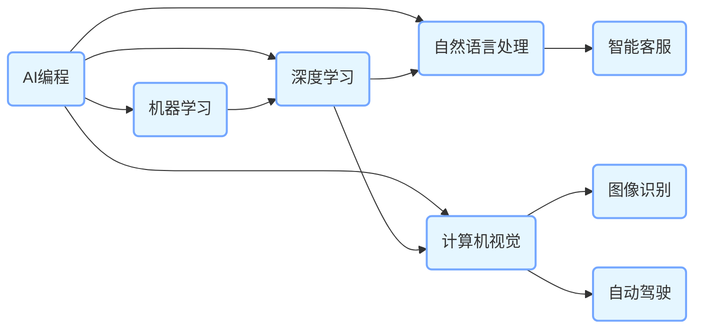

# AI编程的未来趋势：我们该如何抓住机遇？

> 关键词：AI编程、未来趋势、机遇、技术发展、编程技巧、应用场景、职业发展

> 摘要：本文深入探讨了AI编程的未来发展趋势，旨在帮助读者清晰了解该领域的发展方向，从而把握其中蕴含的机遇。文章首先介绍了AI编程的背景知识，包括目的、预期读者等内容。接着详细阐述了AI编程的核心概念、算法原理、数学模型等技术要点。通过项目实战案例，让读者直观感受AI编程在实际中的应用。同时，列举了AI编程的实际应用场景，推荐了相关的学习工具和资源。最后对AI编程的未来发展趋势与挑战进行总结，并提供常见问题解答和扩展阅读参考资料，为读者全面了解和参与AI编程提供有力的支持和指导。

## 1. 背景介绍 
### 1.1 目的和范围
AI编程作为当今科技领域的前沿方向，正以前所未有的速度改变着我们的生活和工作方式。本文的目的在于全面且深入地剖析AI编程的未来发展趋势，不仅涵盖技术层面的创新，还包括其在各个行业的应用拓展。通过研究这些趋势，为广大从业者、学习者以及对AI编程感兴趣的人群提供有价值的信息和指导，帮助他们在这个快速发展的领域中准确把握机遇，实现个人和职业的成长。

### 1.2 预期读者
本文预期读者广泛，包括但不限于专业的程序员、软件开发者、AI研究者、科技爱好者、企业管理者以及正在学习计算机科学和相关专业的学生。无论您是希望在AI编程领域深入钻研技术的专业人士，还是想要了解行业动态、寻找商业机会的企业管理者，亦或是对AI编程充满好奇的初学者，都能从本文中获得有用的信息和启发。

### 1.3 文档结构概述
本文将按照逻辑清晰的结构展开。首先介绍AI编程的背景知识，让读者对其有初步的认识。接着阐述核心概念与联系，帮助读者理解AI编程的基本原理和架构。然后详细讲解核心算法原理和具体操作步骤，并结合数学模型和公式进行深入分析。通过项目实战部分，展示AI编程在实际中的应用和实现过程。随后探讨AI编程的实际应用场景，让读者了解其广泛的用途。推荐相关的工具和资源，为读者提供学习和实践的途径。最后总结AI编程的未来发展趋势与挑战，解答常见问题，并提供扩展阅读和参考资料，使读者能够全面深入地了解AI编程。

### 1.4 术语表
#### 1.4.1 核心术语定义
- **AI编程**：即人工智能编程，指利用计算机编程语言和相关技术，开发能够模拟人类智能的软件和系统的过程。
- **机器学习**：是AI编程中的一个重要领域，让计算机通过数据和算法自动学习和改进，无需明确的编程指令。
- **深度学习**：一种基于人工神经网络的机器学习方法，通过多层神经网络对数据进行特征提取和模式识别。
- **自然语言处理**：研究如何让计算机理解、处理和生成人类语言的技术。
- **计算机视觉**：使计算机能够理解和解释图像和视频内容的技术。

#### 1.4.2 相关概念解释
- **神经网络**：是一种模仿人类神经系统的计算模型，由大量的神经元组成，通过对数据的学习和训练来完成各种任务。
- **强化学习**：智能体通过与环境进行交互，根据环境反馈的奖励信号来学习最优行为策略的学习方法。
- **生成对抗网络（GAN）**：由生成器和判别器组成的对抗性网络，用于生成新的数据样本。

#### 1.4.3 缩略词列表
- **AI**：Artificial Intelligence（人工智能）
- **ML**：Machine Learning（机器学习）
- **DL**：Deep Learning（深度学习）
- **NLP**：Natural Language Processing（自然语言处理）
- **CV**：Computer Vision（计算机视觉）
- **GAN**：Generative Adversarial Network（生成对抗网络）

## 2. 核心概念与联系 
AI编程涉及多个核心概念，这些概念相互关联，共同构成了AI编程的技术体系。

### 核心概念原理和架构的文本示意图
AI编程的核心概念主要围绕人工智能的各个领域展开，其中机器学习是基础，它为其他领域提供了数据处理和模型训练的方法。深度学习作为机器学习的一个分支，通过深度神经网络实现更强大的学习和处理能力。自然语言处理和计算机视觉则是AI编程在不同应用场景下的具体体现，它们利用机器学习和深度学习的技术来实现对语言和图像的理解和处理。

例如，在一个智能客服系统中，自然语言处理技术用于理解用户的问题，机器学习算法对用户问题进行分类和分析，深度学习模型则通过训练来提高回答的准确性。同时，计算机视觉技术可以用于识别用户的表情和手势，进一步提升用户体验。

### Mermaid 流程图

这个流程图展示了AI编程的核心概念及其之间的联系。AI编程作为一个整体，包含了机器学习、深度学习、自然语言处理和计算机视觉等重要领域。机器学习是深度学习的基础，深度学习为自然语言处理和计算机视觉提供了强大的技术支持。自然语言处理和计算机视觉则在不同的应用场景中得到具体应用，如智能客服、图像识别和自动驾驶等。

## 3. 核心算法原理 & 具体操作步骤 
### 机器学习算法 - 线性回归
线性回归是一种简单而常用的机器学习算法，用于预测连续数值的输出。其基本原理是通过找到一条最佳的直线，使得所有数据点到该直线的距离之和最小。

#### 算法原理讲解
线性回归的数学模型可以表示为：
$$y = \theta_0 + \theta_1x_1 + \theta_2x_2 + \cdots + \theta_nx_n$$
其中，$y$ 是预测值，$x_1, x_2, \cdots, x_n$ 是输入特征，$\theta_0, \theta_1, \cdots, \theta_n$ 是模型的参数。

为了找到最佳的参数 $\theta$，我们通常使用最小二乘法，即最小化预测值与真实值之间的误差平方和：
$$J(\theta) = \frac{1}{2m}\sum_{i=1}^{m}(h_{\theta}(x^{(i)}) - y^{(i)})^2$$
其中，$m$ 是样本数量，$h_{\theta}(x^{(i)})$ 是第 $i$ 个样本的预测值，$y^{(i)}$ 是第 $i$ 个样本的真实值。

#### Python源代码实现
```python
import numpy as np

class LinearRegression:
    def __init__(self):
        self.theta = None

    def fit(self, X, y):
        # 在 X 矩阵中添加一列全为 1 的列，用于表示截距项
        X_b = np.c_[np.ones((X.shape[0], 1)), X]
        # 使用正规方程求解参数 theta
        self.theta = np.linalg.inv(X_b.T.dot(X_b)).dot(X_b.T).dot(y)

    def predict(self, X):
        # 在 X 矩阵中添加一列全为 1 的列，用于表示截距项
        X_b = np.c_[np.ones((X.shape[0], 1)), X]
        # 计算预测值
        return X_b.dot(self.theta)
```
#### 具体操作步骤
1. **数据准备**：收集和整理包含输入特征 $X$ 和目标值 $y$ 的数据集。
2. **模型初始化**：创建 `LinearRegression` 类的实例。
3. **模型训练**：调用 `fit` 方法，将数据集 $X$ 和 $y$ 作为参数传入，计算模型的参数 $\theta$。
4. **模型预测**：调用 `predict` 方法，传入新的输入特征 $X$，得到预测值。

### 深度学习算法 - 神经网络
神经网络是深度学习的核心算法，由输入层、隐藏层和输出层组成。每个神经元接收来自上一层神经元的输入，并通过激活函数进行处理，然后将结果传递给下一层神经元。

#### 算法原理讲解
神经网络的基本计算过程可以表示为：
$$z^{[l]} = W^{[l]}a^{[l-1]} + b^{[l]}$$
$$a^{[l]} = g(z^{[l]})$$
其中，$z^{[l]}$ 是第 $l$ 层的加权输入，$W^{[l]}$ 是第 $l$ 层的权重矩阵，$a^{[l-1]}$ 是第 $l-1$ 层的输出，$b^{[l]}$ 是第 $l$ 层的偏置向量，$g$ 是激活函数。

为了训练神经网络，我们通常使用反向传播算法，通过计算损失函数对各个参数的梯度，然后使用梯度下降法更新参数，以最小化损失函数。

#### Python源代码实现
```python
import numpy as np

class NeuralNetwork:
    def __init__(self, layer_sizes):
        self.layer_sizes = layer_sizes
        self.num_layers = len(layer_sizes)
        self.weights = [np.random.randn(y, x) for x, y in zip(layer_sizes[:-1], layer_sizes[1:])]
        self.biases = [np.random.randn(y, 1) for y in layer_sizes[1:]]

    def sigmoid(self, z):
        return 1.0 / (1.0 + np.exp(-z))

    def sigmoid_prime(self, z):
        return self.sigmoid(z) * (1 - self.sigmoid(z))

    def feedforward(self, a):
        for w, b in zip(self.weights, self.biases):
            a = self.sigmoid(np.dot(w, a) + b)
        return a

    def backprop(self, x, y):
        nabla_b = [np.zeros(b.shape) for b in self.biases]
        nabla_w = [np.zeros(w.shape) for w in self.weights]
        # 前向传播
        activation = x
        activations = [x]
        zs = []
        for w, b in zip(self.weights, self.biases):
            z = np.dot(w, activation) + b
            zs.append(z)
            activation = self.sigmoid(z)
            activations.append(activation)
        # 反向传播
        delta = self.cost_derivative(activations[-1], y) * self.sigmoid_prime(zs[-1])
        nabla_b[-1] = delta
        nabla_w[-1] = np.dot(delta, activations[-2].transpose())
        for l in range(2, self.num_layers):
            z = zs[-l]
            sp = self.sigmoid_prime(z)
            delta = np.dot(self.weights[-l + 1].transpose(), delta) * sp
            nabla_b[-l] = delta
            nabla_w[-l] = np.dot(delta, activations[-l - 1].transpose())
        return (nabla_b, nabla_w)

    def cost_derivative(self, output_activations, y):
        return (output_activations - y)

    def update_mini_batch(self, mini_batch, eta):
        nabla_b = [np.zeros(b.shape) for b in self.biases]
        nabla_w = [np.zeros(w.shape) for w in self.weights]
        for x, y in mini_batch:
            delta_nabla_b, delta_nabla_w = self.backprop(x, y)
            nabla_b = [nb + dnb for nb, dnb in zip(nabla_b, delta_nabla_b)]
            nabla_w = [nw + dnw for nw, dnw in zip(nabla_w, delta_nabla_w)]
        self.weights = [w - (eta / len(mini_batch)) * nw for w, nw in zip(self.weights, nabla_w)]
        self.biases = [b - (eta / len(mini_batch)) * nb for b, nb in zip(self.biases, nabla_b)]

    def SGD(self, training_data, epochs, mini_batch_size, eta):
        n = len(training_data)
        for j in range(epochs):
            np.random.shuffle(training_data)
            mini_batches = [training_data[k:k + mini_batch_size] for k in range(0, n, mini_batch_size)]
            for mini_batch in mini_batches:
                self.update_mini_batch(mini_batch, eta)
```
#### 具体操作步骤
1. **数据准备**：收集和整理包含输入特征 $X$ 和目标值 $y$ 的数据集，并将其划分为训练集、验证集和测试集。
2. **模型初始化**：创建 `NeuralNetwork` 类的实例，指定神经网络的层数和每层的神经元数量。
3. **模型训练**：调用 `SGD` 方法，传入训练数据集、训练轮数、小批量大小和学习率等参数，进行模型训练。
4. **模型评估**：使用验证集和测试集对训练好的模型进行评估，计算准确率、损失值等指标。
5. **模型预测**：使用训练好的模型对新的数据进行预测。

## 4. 数学模型和公式 & 详细讲解 & 举例说明 
### 线性回归的数学模型和公式
线性回归的数学模型为：
$$y = \theta_0 + \theta_1x_1 + \theta_2x_2 + \cdots + \theta_nx_n$$
其中，$y$ 是预测值，$x_1, x_2, \cdots, x_n$ 是输入特征，$\theta_0, \theta_1, \cdots, \theta_n$ 是模型的参数。

损失函数使用最小二乘法：
$$J(\theta) = \frac{1}{2m}\sum_{i=1}^{m}(h_{\theta}(x^{(i)}) - y^{(i)})^2$$
其中，$m$ 是样本数量，$h_{\theta}(x^{(i)})$ 是第 $i$ 个样本的预测值，$y^{(i)}$ 是第 $i$ 个样本的真实值。

为了找到使损失函数最小的参数 $\theta$，我们对 $J(\theta)$ 求偏导数：
$$\frac{\partial J(\theta)}{\partial \theta_j} = \frac{1}{m}\sum_{i=1}^{m}(h_{\theta}(x^{(i)}) - y^{(i)})x_j^{(i)}$$
然后使用梯度下降法更新参数：
$$\theta_j := \theta_j - \alpha\frac{\partial J(\theta)}{\partial \theta_j}$$
其中，$\alpha$ 是学习率。

#### 举例说明
假设我们有一个简单的数据集，包含房屋面积 $x$ 和房屋价格 $y$ 的信息：
| 房屋面积 ($x$) | 房屋价格 ($y$) |
| --- | --- |
| 100 | 200000 |
| 200 | 300000 |
| 300 | 400000 |

我们可以使用线性回归模型来预测房屋价格。首先，我们将数据集表示为矩阵形式：
$$X = \begin{bmatrix}
1 & 100 \\
1 & 200 \\
1 & 300
\end{bmatrix}$$
$$y = \begin{bmatrix}
200000 \\
300000 \\
400000
\end{bmatrix}$$
然后，使用正规方程求解参数 $\theta$：
$$\theta = (X^TX)^{-1}X^Ty$$
将 $X$ 和 $y$ 代入公式，得到：
$$\theta = \begin{bmatrix}
100000 \\
1000
\end{bmatrix}$$
因此，线性回归模型为：
$$y = 100000 + 1000x$$
这意味着房屋面积每增加 1 平方米，房屋价格预计增加 1000 元。

### 神经网络的数学模型和公式
神经网络的基本计算过程可以表示为：
$$z^{[l]} = W^{[l]}a^{[l-1]} + b^{[l]}$$
$$a^{[l]} = g(z^{[l]})$$
其中，$z^{[l]}$ 是第 $l$ 层的加权输入，$W^{[l]}$ 是第 $l$ 层的权重矩阵，$a^{[l-1]}$ 是第 $l-1$ 层的输出，$b^{[l]}$ 是第 $l$ 层的偏置向量，$g$ 是激活函数。

常用的激活函数有 sigmoid 函数、ReLU 函数等。sigmoid 函数的定义为：
$$\sigma(z) = \frac{1}{1 + e^{-z}}$$
其导数为：
$$\sigma'(z) = \sigma(z)(1 - \sigma(z))$$

为了训练神经网络，我们通常使用反向传播算法，通过计算损失函数对各个参数的梯度，然后使用梯度下降法更新参数，以最小化损失函数。

损失函数通常使用交叉熵损失函数：
$$L(y, \hat{y}) = -\sum_{i=1}^{n}y_i\log(\hat{y}_i) + (1 - y_i)\log(1 - \hat{y}_i)$$
其中，$y$ 是真实标签，$\hat{y}$ 是预测标签。

#### 举例说明
假设我们有一个简单的神经网络，包含输入层（2 个神经元）、隐藏层（3 个神经元）和输出层（1 个神经元）。输入数据为 $x = \begin{bmatrix}0.5 \\ 0.3\end{bmatrix}$，真实标签为 $y = 1$。

首先，我们初始化权重矩阵和偏置向量：
$$W^{[1]} = \begin{bmatrix}
0.1 & 0.2 \\
0.3 & 0.4 \\
0.5 & 0.6
\end{bmatrix}$$
$$b^{[1]} = \begin{bmatrix}
0.1 \\
0.2 \\
0.3
\end{bmatrix}$$
$$W^{[2]} = \begin{bmatrix}
0.7 & 0.8 & 0.9
\end{bmatrix}$$
$$b^{[2]} = \begin{bmatrix}
0.4
\end{bmatrix}$$
然后，进行前向传播：
$$z^{[1]} = W^{[1]}x + b^{[1]} = \begin{bmatrix}
0.1\times0.5 + 0.2\times0.3 + 0.1 \\
0.3\times0.5 + 0.4\times0.3 + 0.2 \\
0.5\times0.5 + 0.6\times0.3 + 0.3
\end{bmatrix} = \begin{bmatrix}
0.21 \\
0.47 \\
0.73
\end{bmatrix}$$
$$a^{[1]} = \sigma(z^{[1]}) = \begin{bmatrix}
\frac{1}{1 + e^{-0.21}} \\
\frac{1}{1 + e^{-0.47}} \\
\frac{1}{1 + e^{-0.73}}
\end{bmatrix} = \begin{bmatrix}
0.552 \\
0.616 \\
0.673
\end{bmatrix}$$
$$z^{[2]} = W^{[2]}a^{[1]} + b^{[2]} = 0.7\times0.552 + 0.8\times0.616 + 0.9\times0.673 + 0.4 = 1.87$$
$$\hat{y} = \sigma(z^{[2]}) = \frac{1}{1 + e^{-1.87}} = 0.867$$
接着，计算损失函数：
$$L(y, \hat{y}) = -1\times\log(0.867) - (1 - 1)\times\log(1 - 0.867) = 0.143$$
最后，使用反向传播算法计算梯度，并更新参数。

## 5. 项目实战：代码实际案例和详细解释说明 
### 5.1  开发环境搭建
#### 安装 Python
首先，我们需要安装 Python 开发环境。可以从 Python 官方网站（https://www.python.org/downloads/） 下载适合自己操作系统的 Python 安装包，并按照安装向导进行安装。

#### 安装深度学习框架
在本项目中，我们将使用 TensorFlow 深度学习框架。可以使用以下命令安装 TensorFlow：
```sh
pip install tensorflow
```
#### 安装其他依赖库
还需要安装一些其他的依赖库，如 NumPy、Pandas、Matplotlib 等。可以使用以下命令安装：
```sh
pip install numpy pandas matplotlib
```

### 5.2  源代码详细实现和代码解读
#### 项目背景
我们将实现一个简单的手写数字识别项目，使用 MNIST 数据集。MNIST 数据集包含 60000 个训练样本和 10000 个测试样本，每个样本是一个 28x28 像素的手写数字图像。

#### 代码实现
```python
import tensorflow as tf
from tensorflow.keras.datasets import mnist
from tensorflow.keras.models import Sequential
from tensorflow.keras.layers import Dense, Flatten
from tensorflow.keras.utils import to_categorical
import matplotlib.pyplot as plt

# 加载 MNIST 数据集
(x_train, y_train), (x_test, y_test) = mnist.load_data()

# 数据预处理
x_train = x_train / 255.0
x_test = x_test / 255.0
y_train = to_categorical(y_train)
y_test = to_categorical(y_test)

# 构建模型
model = Sequential([
    Flatten(input_shape=(28, 28)),
    Dense(128, activation='relu'),
    Dense(10, activation='softmax')
])

# 编译模型
model.compile(optimizer='adam',
              loss='categorical_crossentropy',
              metrics=['accuracy'])

# 训练模型
history = model.fit(x_train, y_train, epochs=5, validation_data=(x_test, y_test))

# 评估模型
test_loss, test_acc = model.evaluate(x_test, y_test)
print(f"Test accuracy: {test_acc}")

# 绘制训练过程中的损失和准确率曲线
plt.plot(history.history['accuracy'])
plt.plot(history.history['val_accuracy'])
plt.title('Model accuracy')
plt.ylabel('Accuracy')
plt.xlabel('Epoch')
plt.legend(['Train', 'Test'], loc='upper left')
plt.show()

plt.plot(history.history['loss'])
plt.plot(history.history['val_loss'])
plt.title('Model loss')
plt.ylabel('Loss')
plt.xlabel('Epoch')
plt.legend(['Train', 'Test'], loc='upper left')
plt.show()
```
#### 代码解读
1. **数据加载**：使用 `mnist.load_data()` 函数加载 MNIST 数据集。
2. **数据预处理**：将图像像素值归一化到 0 到 1 之间，并将标签进行 one-hot 编码。
3. **模型构建**：使用 `Sequential` 模型构建一个简单的神经网络，包含一个 `Flatten` 层、一个 `Dense` 层和一个输出层。
4. **模型编译**：使用 `compile` 方法编译模型，指定优化器、损失函数和评估指标。
5. **模型训练**：使用 `fit` 方法训练模型，指定训练数据、训练轮数和验证数据。
6. **模型评估**：使用 `evaluate` 方法评估模型在测试集上的性能。
7. **绘制曲线**：使用 `matplotlib` 库绘制训练过程中的损失和准确率曲线。

### 5.3  代码解读与分析
#### 模型结构分析
- **Flatten 层**：将 28x28 像素的图像转换为一维向量，方便后续的全连接层处理。
- **Dense 层**：包含 128 个神经元，使用 ReLU 激活函数，用于提取图像的特征。
- **输出层**：包含 10 个神经元，使用 softmax 激活函数，用于输出每个数字的预测概率。

#### 损失函数和优化器分析
- **损失函数**：使用 `categorical_crossentropy` 损失函数，适用于多分类问题。
- **优化器**：使用 `adam` 优化器，自适应调整学习率，提高训练效率。

#### 训练过程分析
通过绘制训练过程中的损失和准确率曲线，我们可以观察到模型的训练效果。如果训练集和验证集的准确率都不断提高，且损失不断下降，说明模型训练效果良好。如果出现过拟合现象，即训练集准确率很高，但验证集准确率较低，我们可以采取一些措施，如增加训练数据、使用正则化方法等。

## 6. 实际应用场景 
### 医疗领域
AI编程在医疗领域有着广泛的应用。例如，通过计算机视觉技术，可以对医学影像（如X光、CT、MRI等）进行分析和诊断，帮助医生更准确地发现病变和疾病。利用自然语言处理技术，可以对电子病历进行分析和挖掘，提取有用的信息，辅助医生进行决策。此外，AI编程还可以用于药物研发、疾病预测和健康管理等方面。

### 金融领域
在金融领域，AI编程可以用于风险评估、信用评分、欺诈检测等方面。通过机器学习算法，可以对大量的金融数据进行分析和建模，预测市场趋势和风险。利用自然语言处理技术，可以对新闻、公告等文本信息进行分析，帮助投资者做出决策。此外，AI编程还可以用于智能客服、投资顾问等方面，提高金融服务的效率和质量。

### 交通领域
AI编程在交通领域的应用也越来越广泛。例如，自动驾驶技术就是AI编程的一个重要应用方向。通过计算机视觉、传感器技术和机器学习算法，自动驾驶汽车可以感知周围环境，做出决策并控制车辆行驶。此外，AI编程还可以用于交通流量预测、智能交通管理等方面，提高交通效率和安全性。

### 教育领域
在教育领域，AI编程可以用于个性化学习、智能辅导、教育评估等方面。通过机器学习算法，可以对学生的学习数据进行分析和建模，了解学生的学习习惯和能力，为学生提供个性化的学习方案。利用自然语言处理技术，可以开发智能辅导系统，帮助学生解决学习中的问题。此外，AI编程还可以用于教育资源的推荐和管理，提高教育质量和效率。

### 娱乐领域
AI编程在娱乐领域也有着重要的应用。例如，通过生成对抗网络（GAN）技术，可以生成逼真的图像、视频和音乐等内容。利用自然语言处理技术，可以开发智能聊天机器人和游戏AI，提高游戏的趣味性和互动性。此外，AI编程还可以用于影视制作、虚拟现实和增强现实等方面，为用户带来更加丰富的娱乐体验。

## 7. 工具和资源推荐
### 7.1 学习资源推荐
#### 7.1.1 书籍推荐
- 《深度学习》（Deep Learning）：由 Ian Goodfellow、Yoshua Bengio 和 Aaron Courville 合著，是深度学习领域的经典教材，全面介绍了深度学习的基本概念、算法和应用。
- 《Python 深度学习》（Deep Learning with Python）：由 Francois Chollet 著，结合 Keras 框架，详细介绍了如何使用 Python 进行深度学习开发。
- 《机器学习》（Machine Learning）：由 Tom Mitchell 著，是机器学习领域的经典教材，系统介绍了机器学习的基本概念、算法和应用。

#### 7.1.2 在线课程
- Coursera 上的“机器学习”课程：由 Andrew Ng 教授授课，是机器学习领域的经典课程，全面介绍了机器学习的基本概念、算法和应用。
- edX 上的“深度学习”课程：由 MIT 教授授课，深入介绍了深度学习的原理和应用。
- Udemy 上的“Python 数据科学和机器学习实战”课程：结合 Python 语言和实际项目，详细介绍了数据科学和机器学习的基本概念、算法和应用。

#### 7.1.3 技术博客和网站
- Medium：一个技术博客平台，有很多关于 AI 编程的优秀文章和教程。
- Towards Data Science：专注于数据科学和机器学习领域的技术博客，提供了很多有价值的文章和案例。
- AI 科技评论：国内专注于人工智能领域的科技媒体，提供了很多关于 AI 编程的最新技术和应用案例。

### 7.2 开发工具框架推荐
#### 7.2.1 IDE和编辑器
- PyCharm：一款专业的 Python 集成开发环境，提供了丰富的代码编辑、调试和项目管理功能。
- Jupyter Notebook：一个交互式的开发环境，适合进行数据探索、模型训练和可视化等工作。
- Visual Studio Code：一款轻量级的代码编辑器，支持多种编程语言和插件，适合快速开发和调试。

#### 7.2.2 调试和性能分析工具
- TensorBoard：TensorFlow 提供的可视化工具，用于监控模型训练过程、分析模型性能和可视化数据。
- PyTorch Profiler：PyTorch 提供的性能分析工具，用于分析模型的计算效率和内存使用情况。
- cProfile：Python 内置的性能分析工具，用于分析 Python 代码的执行时间和调用关系。

#### 7.2.3 相关框架和库
- TensorFlow：一个开源的深度学习框架，提供了丰富的工具和接口，支持多种深度学习模型的开发和训练。
- PyTorch：一个开源的深度学习框架，具有动态计算图的特点，适合快速开发和实验。
- Scikit-learn：一个开源的机器学习库，提供了丰富的机器学习算法和工具，适合进行数据预处理、模型选择和评估等工作。

### 7.3 相关论文著作推荐
#### 7.3.1 经典论文
- “ImageNet Classification with Deep Convolutional Neural Networks”：由 Alex Krizhevsky、Ilya Sutskever 和 Geoffrey E. Hinton 发表，介绍了 AlexNet 模型，开启了深度学习在计算机视觉领域的应用热潮。
- “Long Short-Term Memory”：由 Sepp Hochreiter 和 Jürgen Schmidhuber 发表，介绍了 LSTM 模型，解决了循环神经网络中的梯度消失问题。
- “Generative Adversarial Nets”：由 Ian J. Goodfellow 等人发表，介绍了生成对抗网络（GAN）的基本原理和应用。

#### 7.3.2 最新研究成果
- 关注顶级学术会议，如 NeurIPS（神经信息处理系统大会）、ICML（国际机器学习会议）、CVPR（计算机视觉与模式识别会议）等，了解 AI 编程领域的最新研究成果。
- 关注知名学术期刊，如 Journal of Artificial Intelligence Research（JAIR）、Artificial Intelligence（AI）等，获取 AI 编程领域的前沿研究论文。

#### 7.3.3 应用案例分析
- 关注各大科技公司的技术博客和开源项目，了解他们在 AI 编程领域的应用案例和实践经验。
- 参考相关的书籍和报告，如《AI 应用案例集》等，学习不同行业中 AI 编程的应用案例和解决方案。

## 8. 总结：未来发展趋势与挑战
### 未来发展趋势
#### 自动化编程
随着 AI 技术的不断发展，自动化编程将成为未来的一个重要趋势。AI 可以根据需求自动生成代码，提高编程效率和质量。例如，一些智能代码补全工具已经可以根据上下文自动推荐代码，未来的自动化编程系统可能会更加智能和强大。

#### 跨学科融合
AI 编程将与其他学科，如生物学、物理学、化学等进行更深入的融合。例如，在生物信息学中，AI 可以用于分析基因序列、预测蛋白质结构等。通过跨学科融合，可以解决更复杂的问题，推动科学技术的发展。

#### 边缘计算与 AI
边缘计算将与 AI 技术相结合，实现更高效的数据处理和分析。在边缘设备上运行 AI 模型，可以减少数据传输延迟，提高系统的实时性和可靠性。例如，在智能物联网设备中，边缘计算与 AI 技术可以实现设备的自主决策和控制。

#### 强化学习的广泛应用
强化学习作为一种重要的机器学习方法，将在更多领域得到广泛应用。例如，在自动驾驶、机器人控制、游戏等领域，强化学习可以帮助智能体学习最优行为策略，提高系统的性能和效率。

### 挑战
#### 数据隐私和安全
AI 编程需要大量的数据进行训练，而这些数据往往包含用户的个人信息和敏感信息。因此，数据隐私和安全是 AI 编程面临的一个重要挑战。如何保护用户的数据隐私，防止数据泄露和滥用，是需要解决的关键问题。

#### 算法可解释性
深度学习模型通常是黑盒模型，其决策过程难以解释。在一些关键领域，如医疗、金融等，算法的可解释性非常重要。如何提高算法的可解释性，让用户理解模型的决策过程，是 AI 编程需要解决的另一个挑战。

#### 伦理和道德问题
AI 编程的发展也带来了一系列伦理和道德问题。例如，AI 系统可能会产生偏见和歧视，影响公平性和公正性。如何确保 AI 系统的伦理和道德合理性，是需要深入研究和探讨的问题。

#### 人才短缺
AI 编程是一个新兴领域，需要具备多学科知识和技能的人才。目前，全球范围内 AI 编程人才短缺，这限制了 AI 技术的发展和应用。如何培养更多的 AI 编程人才，是需要解决的重要问题。

## 9. 附录：常见问题与解答
### 1. 学习 AI 编程需要具备哪些基础知识？
学习 AI 编程需要具备一定的数学基础，如线性代数、概率论、统计学等。同时，还需要掌握一门编程语言，如 Python。此外，了解机器学习和深度学习的基本概念和算法也是很有必要的。

### 2. 如何选择适合自己的深度学习框架？
选择适合自己的深度学习框架需要考虑多个因素，如学习成本、性能、社区支持等。如果是初学者，建议选择简单易用的框架，如 Keras。如果需要进行大规模的深度学习开发，建议选择功能强大的框架，如 TensorFlow 或 PyTorch。

### 3. 如何解决 AI 编程中的过拟合问题？
解决 AI 编程中的过拟合问题可以采取以下措施：增加训练数据、使用正则化方法（如 L1 和 L2 正则化）、早停法、使用 Dropout 等。

### 4. 如何评估 AI 模型的性能？
评估 AI 模型的性能可以使用不同的指标，如准确率、召回率、F1 值、均方误差等。具体选择哪种指标需要根据问题的类型和需求来确定。

### 5. AI 编程在实际应用中面临哪些挑战？
AI 编程在实际应用中面临的数据隐私和安全、算法可解释性、伦理和道德问题、人才短缺等挑战。

## 10. 扩展阅读 & 参考资料
### 扩展阅读
- 《人工智能时代》（The Age of AI）：探讨了 AI 技术对社会、经济和人类生活的影响。
- 《未来简史》（Homo Deus: A Brief History of Tomorrow）：从人类历史的角度出发，探讨了 AI 技术对人类未来的影响。
- 《AI 未来》（AI Superpowers: China, Silicon Valley, and the New World Order）：分析了中美两国在 AI 领域的竞争和合作。

### 参考资料
- 各深度学习框架的官方文档，如 TensorFlow 官方文档（https://www.tensorflow.org/）、PyTorch 官方文档（https://pytorch.org/）等。
- 各学术会议和期刊的论文，如 NeurIPS、ICML、CVPR 等会议的论文，以及 Journal of Artificial Intelligence Research、Artificial Intelligence 等期刊的论文。
- 相关的书籍和报告，如《深度学习》《Python 深度学习》《机器学习》等书籍，以及《AI 应用案例集》等报告。