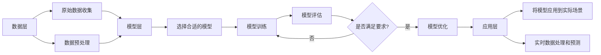

# AI编程的革命：程序员的生存策略

> 关键词：AI编程、程序员、生存策略、技术变革、职业发展

> 摘要：本文聚焦于AI编程带来的革命性变化，深入探讨了程序员在这一变革浪潮中的生存策略。首先介绍了文章的背景信息，包括目的、预期读者、文档结构和术语表。接着阐述了AI编程的核心概念、联系、算法原理、数学模型等基础知识。通过项目实战案例展示了AI编程的实际应用，并分析了其在不同场景下的应用情况。同时，推荐了一系列学习资源、开发工具和相关论文著作。最后总结了AI编程的未来发展趋势与挑战，解答了常见问题，并提供了扩展阅读和参考资料，旨在帮助程序员更好地适应AI编程革命，实现职业的可持续发展。

## 1. 背景介绍 

### 1.1 目的和范围
随着人工智能技术的飞速发展，AI编程正逐渐成为软件开发领域的主流趋势。本文章的目的在于全面剖析AI编程革命给程序员带来的影响，并为程序员提供切实可行的生存策略。文章将涵盖AI编程的核心概念、算法原理、实际应用场景等多个方面，帮助程序员深入了解这一领域的发展动态，提升自身的技术能力和职业竞争力。

### 1.2 预期读者
本文主要面向广大程序员群体，无论是初入职场的新手程序员，还是经验丰富的资深开发者，都能从文章中获取有价值的信息。此外，对AI编程感兴趣的技术爱好者、相关领域的研究人员以及企业技术管理者也可以参考本文，了解AI编程的发展趋势和应对策略。

### 1.3 文档结构概述
本文将按照以下结构展开：首先介绍背景信息，包括目的、读者、结构和术语表；接着阐述AI编程的核心概念和联系，包括原理和架构的示意图及流程图；然后详细讲解核心算法原理和具体操作步骤，并给出Python源代码示例；随后介绍数学模型和公式，并进行详细讲解和举例说明；通过项目实战展示代码实际案例和详细解释；分析AI编程的实际应用场景；推荐学习资源、开发工具和相关论文著作；总结未来发展趋势与挑战；解答常见问题；最后提供扩展阅读和参考资料。

### 1.4 术语表
#### 1.4.1 核心术语定义
- **AI编程**：指利用人工智能技术进行软件开发的过程，包括使用机器学习、深度学习等算法实现智能功能。
- **机器学习**：是一门多领域交叉学科，涉及概率论、统计学、逼近论、凸分析、算法复杂度理论等多门学科。它专门研究计算机怎样模拟或实现人类的学习行为，以获取新的知识或技能，重新组织已有的知识结构使之不断改善自身的性能。
- **深度学习**：是机器学习的一个分支领域，它是一种基于对数据进行表征学习的方法。深度学习通过构建具有很多层的神经网络模型，自动从大量数据中学习特征和模式。
- **自然语言处理**：是计算机科学领域与人工智能领域中的一个重要方向。它研究能实现人与计算机之间用自然语言进行有效通信的各种理论和方法。
- **计算机视觉**：是一门研究如何使机器“看”的科学，也就是指用摄影机和电脑代替人眼对目标进行识别、跟踪和测量等机器视觉，并进一步做图形处理，使电脑处理成为更适合人眼观察或传送给仪器检测的图像。

#### 1.4.2 相关概念解释
- **算法复杂度**：是指算法在编写成可执行程序后，运行时所需要的资源，资源包括时间资源和内存资源。算法复杂度分为时间复杂度和空间复杂度。
- **数据集**：是指在机器学习和数据分析领域中，用于训练和测试模型的数据集合。数据集通常包含输入数据和对应的标签或目标值。
- **模型训练**：是指使用数据集对机器学习或深度学习模型进行参数调整的过程，目的是使模型能够在给定的任务上达到较好的性能。
- **模型评估**：是指使用评估指标对训练好的模型进行性能评估的过程，以确定模型的准确性、可靠性和泛化能力。

#### 1.4.3 缩略词列表
- **AI**：Artificial Intelligence，人工智能
- **ML**：Machine Learning，机器学习
- **DL**：Deep Learning，深度学习
- **NLP**：Natural Language Processing，自然语言处理
- **CV**：Computer Vision，计算机视觉

## 2. 核心概念与联系 

### 核心概念原理
AI编程的核心在于利用人工智能技术实现软件的智能化功能。机器学习和深度学习是AI编程的重要基础。机器学习通过让计算机从数据中学习模式和规律，从而实现对未知数据的预测和分类。深度学习则是通过构建多层神经网络，自动从数据中学习更高级的特征表示，在图像识别、语音识别、自然语言处理等领域取得了显著的成果。

自然语言处理是AI编程的一个重要应用领域，它涉及到对人类语言的理解和生成。计算机视觉则是让计算机能够像人类一样“看”世界，实现对图像和视频的分析和处理。

### 架构的文本示意图
以下是一个简单的AI编程架构示意图：

```plaintext
数据层
|
|-- 原始数据收集
|-- 数据预处理（清洗、转换、归一化等）
|
模型层
|
|-- 选择合适的模型（机器学习模型或深度学习模型）
|-- 模型训练（使用训练数据集）
|-- 模型评估（使用验证数据集）
|-- 模型优化（调整模型参数）
|
应用层
|
|-- 将训练好的模型应用到实际场景中
|-- 实时数据处理和预测
```

### Mermaid流程图


## 3. 核心算法原理 & 具体操作步骤 

### 线性回归算法原理
线性回归是一种简单而常用的机器学习算法，用于预测连续数值。其基本原理是通过找到一条最佳的直线，使得所有数据点到该直线的距离之和最小。

假设我们有一组数据集 $\{(x_1, y_1), (x_2, y_2), \cdots, (x_n, y_n)\}$，其中 $x_i$ 是输入特征，$y_i$ 是对应的目标值。线性回归模型的表达式为：

$$y = \theta_0 + \theta_1x$$

其中 $\theta_0$ 是截距，$\theta_1$ 是斜率。我们的目标是找到最优的 $\theta_0$ 和 $\theta_1$，使得预测值 $\hat{y}$ 与真实值 $y$ 之间的误差最小。常用的误差度量方法是均方误差（MSE）：

$$MSE = \frac{1}{n}\sum_{i=1}^{n}(y_i - \hat{y}_i)^2$$

### 具体操作步骤
1. **数据准备**：收集和整理数据集，将其分为训练集和测试集。
2. **模型初始化**：随机初始化 $\theta_0$ 和 $\theta_1$。
3. **模型训练**：使用梯度下降算法不断更新 $\theta_0$ 和 $\theta_1$，直到误差收敛。
4. **模型评估**：使用测试集评估模型的性能。

### Python源代码实现
```python
import numpy as np
import matplotlib.pyplot as plt

# 生成数据集
np.random.seed(0)
X = 2 * np.random.rand(100, 1)
y = 4 + 3 * X + np.random.randn(100, 1)

# 数据预处理
X_b = np.c_[np.ones((100, 1)), X]  # 添加偏置项

# 模型初始化
theta = np.random.randn(2, 1)

# 超参数设置
learning_rate = 0.1
n_iterations = 1000
m = 100

# 梯度下降算法
for iteration in range(n_iterations):
    gradients = 2/m * X_b.T.dot(X_b.dot(theta) - y)
    theta = theta - learning_rate * gradients

# 模型评估
X_new = np.array([[0], [2]])
X_new_b = np.c_[np.ones((2, 1)), X_new]
y_predict = X_new_b.dot(theta)

# 可视化结果
plt.plot(X_new, y_predict, "r-")
plt.plot(X, y, "b.")
plt.axis([0, 2, 0, 15])
plt.show()
```

### 代码解释
1. **数据生成**：使用 `np.random.rand` 生成随机输入特征 $X$，并根据线性关系 $y = 4 + 3X + \epsilon$ 生成对应的目标值 $y$，其中 $\epsilon$ 是随机噪声。
2. **数据预处理**：在输入特征 $X$ 中添加偏置项，得到 $X_b$。
3. **模型初始化**：随机初始化参数 $\theta$。
4. **梯度下降算法**：使用梯度下降算法更新参数 $\theta$，直到误差收敛。
5. **模型评估**：使用训练好的模型对新的输入数据进行预测，并可视化结果。

## 4. 数学模型和公式 & 详细讲解 & 举例说明 

### 线性回归的数学模型
线性回归的数学模型可以表示为：

$$y = \theta_0 + \theta_1x_1 + \theta_2x_2 + \cdots + \theta_nx_n + \epsilon$$

其中 $y$ 是目标值，$x_1, x_2, \cdots, x_n$ 是输入特征，$\theta_0, \theta_1, \cdots, \theta_n$ 是模型参数，$\epsilon$ 是随机误差。

### 均方误差公式
均方误差（MSE）是线性回归中常用的误差度量方法，其公式为：

$$MSE = \frac{1}{n}\sum_{i=1}^{n}(y_i - \hat{y}_i)^2$$

其中 $y_i$ 是真实值，$\hat{y}_i$ 是预测值。

### 梯度下降公式
梯度下降是一种常用的优化算法，用于求解模型的最优参数。其基本思想是沿着误差函数的负梯度方向更新参数，直到误差收敛。

对于线性回归模型，误差函数 $J(\theta)$ 为均方误差：

$$J(\theta) = \frac{1}{2n}\sum_{i=1}^{n}(y_i - \theta^T x_i)^2$$

其中 $\theta$ 是模型参数，$x_i$ 是输入特征。

梯度下降的更新公式为：

$$\theta_j := \theta_j - \alpha \frac{\partial J(\theta)}{\partial \theta_j}$$

其中 $\alpha$ 是学习率，$\frac{\partial J(\theta)}{\partial \theta_j}$ 是误差函数 $J(\theta)$ 关于参数 $\theta_j$ 的偏导数。

### 举例说明
假设我们有一个简单的线性回归问题，数据集如下：

| $x$ | $y$ |
| --- | --- |
| 1 | 3 |
| 2 | 5 |
| 3 | 7 |

我们的目标是找到一条直线 $y = \theta_0 + \theta_1x$，使得该直线能够最好地拟合这些数据点。

首先，我们计算误差函数 $J(\theta)$：

$$J(\theta) = \frac{1}{2\times3}[(3 - (\theta_0 + \theta_1\times1))^2 + (5 - (\theta_0 + \theta_1\times2))^2 + (7 - (\theta_0 + \theta_1\times3))^2]$$

然后，我们使用梯度下降算法更新参数 $\theta_0$ 和 $\theta_1$：

$$\theta_0 := \theta_0 - \alpha \frac{\partial J(\theta)}{\partial \theta_0}$$

$$\theta_1 := \theta_1 - \alpha \frac{\partial J(\theta)}{\partial \theta_1}$$

经过多次迭代，直到误差收敛，我们就可以得到最优的参数 $\theta_0$ 和 $\theta_1$。

## 5. 项目实战：代码实际案例和详细解释说明 

### 5.1  开发环境搭建
#### 安装Python
首先，我们需要安装Python。可以从Python官方网站（https://www.python.org/downloads/）下载适合你操作系统的Python版本，并按照安装向导进行安装。

#### 安装必要的库
在命令行中使用以下命令安装必要的库：
```sh
pip install numpy pandas matplotlib scikit-learn
```

### 5.2  源代码详细实现和代码解读
#### 项目背景
我们将使用一个简单的房价预测数据集来演示线性回归的应用。该数据集包含房屋的面积和对应的房价信息，我们的目标是根据房屋面积预测房价。

#### 代码实现
```python
import numpy as np
import pandas as pd
import matplotlib.pyplot as plt
from sklearn.model_selection import train_test_split
from sklearn.linear_model import LinearRegression
from sklearn.metrics import mean_squared_error

# 加载数据集
data = pd.read_csv('housing.csv')

# 提取特征和目标值
X = data[['area']].values
y = data['price'].values

# 划分训练集和测试集
X_train, X_test, y_train, y_test = train_test_split(X, y, test_size=0.2, random_state=42)

# 创建线性回归模型
model = LinearRegression()

# 模型训练
model.fit(X_train, y_train)

# 模型预测
y_pred = model.predict(X_test)

# 模型评估
mse = mean_squared_error(y_test, y_pred)
rmse = np.sqrt(mse)
print(f"均方误差: {mse}")
print(f"均方根误差: {rmse}")

# 可视化结果
plt.scatter(X_test, y_test, color='blue')
plt.plot(X_test, y_pred, color='red', linewidth=2)
plt.xlabel('房屋面积')
plt.ylabel('房价')
plt.title('房价预测')
plt.show()
```

#### 代码解读
1. **数据加载**：使用 `pandas` 库的 `read_csv` 函数加载房价预测数据集。
2. **特征提取**：从数据集中提取房屋面积作为特征 $X$，房价作为目标值 $y$。
3. **数据集划分**：使用 `train_test_split` 函数将数据集划分为训练集和测试集，其中测试集占比为20%。
4. **模型创建**：使用 `LinearRegression` 类创建线性回归模型。
5. **模型训练**：使用训练集对模型进行训练，调用 `fit` 方法。
6. **模型预测**：使用训练好的模型对测试集进行预测，调用 `predict` 方法。
7. **模型评估**：使用 `mean_squared_error` 函数计算均方误差，并计算均方根误差。
8. **结果可视化**：使用 `matplotlib` 库绘制散点图和拟合直线，直观展示模型的预测效果。

### 5.3  代码解读与分析
#### 模型性能分析
均方误差（MSE）和均方根误差（RMSE）是评估线性回归模型性能的常用指标。MSE 表示预测值与真实值之间误差的平方的平均值，RMSE 是 MSE 的平方根。RMSE 更直观地反映了预测值与真实值之间的平均误差。

#### 模型优化
为了提高模型的性能，我们可以尝试以下方法：
- **特征工程**：除了房屋面积，我们可以考虑添加其他相关特征，如房屋卧室数量、卫生间数量等。
- **模型选择**：尝试使用其他机器学习模型，如决策树回归、随机森林回归等。
- **超参数调整**：调整模型的超参数，如学习率、正则化参数等。

## 6. 实际应用场景 
### 自然语言处理
- **智能客服**：使用自然语言处理技术实现智能客服系统，能够自动回答用户的问题，提高客户服务效率。
- **机器翻译**：通过深度学习模型实现不同语言之间的自动翻译，打破语言障碍。
- **文本分类**：对新闻文章、评论等文本进行分类，如情感分析、主题分类等。

### 计算机视觉
- **人脸识别**：在安防、门禁系统等领域广泛应用，实现对人脸的识别和验证。
- **图像识别**：用于图像搜索、医学图像分析、自动驾驶等领域，识别图像中的物体和场景。
- **视频监控**：通过计算机视觉技术对视频进行分析，实现目标检测、行为分析等功能。

### 金融领域
- **风险评估**：使用机器学习算法对客户的信用风险进行评估，帮助金融机构做出更明智的决策。
- **股票预测**：通过分析历史股票数据和相关新闻信息，预测股票价格的走势。
- **欺诈检测**：利用数据挖掘和机器学习技术识别金融交易中的欺诈行为。

### 医疗领域
- **疾病诊断**：通过分析医学影像、病历数据等，辅助医生进行疾病诊断。
- **药物研发**：利用机器学习算法筛选潜在的药物靶点，加速药物研发过程。
- **健康管理**：通过可穿戴设备收集用户的健康数据，提供个性化的健康建议。

## 7. 工具和资源推荐
### 7.1 学习资源推荐
#### 7.1.1 书籍推荐
- 《Python机器学习》：介绍了Python在机器学习领域的应用，包括各种机器学习算法的原理和实现。
- 《深度学习》：由深度学习领域的三位权威专家Ian Goodfellow、Yoshua Bengio和Aaron Courville撰写，全面介绍了深度学习的理论和实践。
- 《统计学习方法》：李航著，系统地介绍了统计学习的主要方法，包括感知机、k近邻法、朴素贝叶斯法、决策树、逻辑斯谛回归与最大熵模型、支持向量机、提升方法、EM算法、隐马尔可夫模型和条件随机场等。

#### 7.1.2 在线课程
- Coursera上的“机器学习”课程：由Andrew Ng教授授课，是机器学习领域的经典课程，涵盖了机器学习的基本概念、算法和应用。
- edX上的“深度学习微硕士项目”：提供了深度学习的深入学习课程，包括卷积神经网络、循环神经网络、强化学习等内容。
- 中国大学MOOC上的“人工智能基础”课程：由国内知名高校的教授授课，介绍了人工智能的基本概念、方法和应用。

#### 7.1.3 技术博客和网站
- Medium：是一个技术博客平台，上面有很多关于AI编程的优质文章。
- Towards Data Science：专注于数据科学和机器学习领域的技术博客，提供了大量的教程和案例。
- AI研习社：国内专注于人工智能技术分享和交流的平台，有很多优质的技术文章和案例。

### 7.2 开发工具框架推荐
#### 7.2.1 IDE和编辑器
- PyCharm：是一款专门为Python开发设计的集成开发环境，提供了丰富的功能和插件，如代码自动补全、调试工具、版本控制等。
- Jupyter Notebook：是一个交互式的开发环境，适合进行数据探索、模型实验和代码演示。
- Visual Studio Code：是一款轻量级的代码编辑器，支持多种编程语言，并且有丰富的插件可以扩展其功能。

#### 7.2.2 调试和性能分析工具
- TensorBoard：是TensorFlow提供的可视化工具，用于监控模型训练过程、可视化模型结构和分析模型性能。
- PyTorch Profiler：是PyTorch提供的性能分析工具，用于分析模型的运行时间和内存使用情况。
- cProfile：是Python内置的性能分析工具，用于分析Python代码的运行时间和函数调用次数。

#### 7.2.3 相关框架和库
- TensorFlow：是Google开发的开源机器学习框架，提供了丰富的工具和接口，支持分布式训练和模型部署。
- PyTorch：是Facebook开发的开源深度学习框架，具有动态图机制，易于使用和调试。
- Scikit-learn：是一个简单易用的机器学习库，提供了各种机器学习算法的实现，如分类、回归、聚类等。

### 7.3 相关论文著作推荐
#### 7.3.1 经典论文
- “ImageNet Classification with Deep Convolutional Neural Networks”：介绍了AlexNet卷积神经网络，开启了深度学习在计算机视觉领域的热潮。
- “Long Short-Term Memory”：提出了长短期记忆网络（LSTM），解决了传统循环神经网络的梯度消失问题。
- “Attention Is All You Need”：提出了Transformer架构，在自然语言处理领域取得了巨大的成功。

#### 7.3.2 最新研究成果
- arXiv：是一个预印本平台，上面有很多关于AI编程的最新研究成果和论文。
- NeurIPS、ICML、CVPR等顶级学术会议：每年都会发布很多关于人工智能领域的最新研究成果。

#### 7.3.3 应用案例分析
- Kaggle：是一个数据科学竞赛平台，上面有很多实际的数据集和应用案例，可以学习到不同领域的AI编程应用。
- GitHub：是一个代码托管平台，上面有很多开源的AI编程项目和代码实现，可以参考学习。

## 8. 总结：未来发展趋势与挑战
### 未来发展趋势
- **AI与其他技术的融合**：AI将与物联网、大数据、区块链等技术深度融合，创造出更多的应用场景和商业价值。
- **自动化编程**：随着AI技术的发展，自动化编程将逐渐成为现实，程序员可以通过AI工具自动生成代码，提高开发效率。
- **个性化AI**：AI系统将更加注重个性化服务，根据用户的需求和偏好提供定制化的解决方案。
- **边缘计算与AI**：边缘计算将AI能力下沉到设备端，减少数据传输延迟，提高系统的实时性和可靠性。

### 挑战
- **数据隐私和安全**：AI系统需要大量的数据进行训练，如何保护数据的隐私和安全是一个重要的挑战。
- **算法可解释性**：深度学习模型通常是黑盒模型，难以解释其决策过程，这在一些关键领域如医疗、金融等应用时存在风险。
- **人才短缺**：AI编程领域的快速发展导致对专业人才的需求急剧增加，人才短缺成为制约行业发展的重要因素。
- **伦理和法律问题**：AI技术的发展带来了一系列伦理和法律问题，如算法偏见、AI的责任认定等，需要建立相应的法律法规和伦理准则。

## 9. 附录：常见问题与解答
### 问题1：AI编程是否会取代程序员？
解答：虽然AI编程技术的发展会对程序员的工作产生一定的影响，但不会完全取代程序员。AI编程工具可以帮助程序员提高开发效率，但在系统设计、算法优化、业务理解等方面，程序员的专业知识和经验仍然是不可或缺的。

### 问题2：学习AI编程需要具备哪些基础知识？
解答：学习AI编程需要具备一定的数学基础，如线性代数、概率论、统计学等。同时，还需要掌握一门编程语言，如Python，以及相关的机器学习和深度学习知识。

### 问题3：如何选择适合自己的AI编程框架？
解答：选择适合自己的AI编程框架需要考虑多个因素，如项目需求、个人技术栈、框架的易用性和性能等。TensorFlow和PyTorch是目前比较流行的深度学习框架，Scikit-learn则适合初学者快速上手机器学习。

### 问题4：如何提高自己的AI编程能力？
解答：提高AI编程能力可以通过以下途径：学习相关的理论知识，阅读经典的论文和书籍；进行实践项目，通过实际操作加深对知识的理解；参与开源项目和技术社区，与其他开发者交流和学习；关注行业动态，了解最新的技术发展趋势。

## 10. 扩展阅读 & 参考资料
### 扩展阅读
- 《人工智能时代的人类未来》：探讨了人工智能技术对人类社会的影响和挑战，以及人类应该如何应对。
- 《第四次工业革命》：介绍了第四次工业革命的特点和趋势，以及AI编程在其中的重要作用。

### 参考资料
- 《Python机器学习实战》：提供了丰富的Python代码示例和实际案例，帮助读者更好地理解和应用机器学习算法。
- 《深度学习实战》：详细介绍了深度学习的原理和实践，包括卷积神经网络、循环神经网络等模型的实现。
- 各大技术博客和网站上的文章，如Medium、Towards Data Science等。