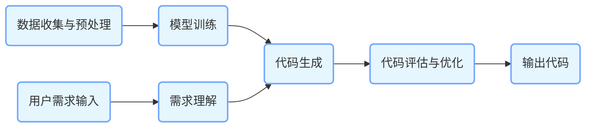

# AI编程：是解放程序员还是毁灭程序员？

> 关键词：AI编程、程序员、解放、毁灭、编程自动化、未来趋势

> 摘要：本文深入探讨了AI编程对程序员职业的影响，分析了AI编程是会解放程序员还是毁灭程序员这一具有争议性的话题。文章首先介绍了相关背景，阐述了核心概念和联系，讲解了AI编程的核心算法原理及操作步骤，引入了数学模型和公式。通过项目实战案例展示了AI编程在实际中的应用，列举了AI编程的实际应用场景。同时推荐了学习AI编程的工具和资源，最后总结了AI编程的未来发展趋势与挑战，并对常见问题进行了解答。旨在为程序员和关注编程行业发展的人士提供全面且深入的思考。

## 1. 背景介绍 
### 1.1 目的和范围
随着人工智能技术的飞速发展，AI编程逐渐成为编程领域的热门话题。本文的目的是全面、深入地分析AI编程对程序员职业的影响，探讨AI编程究竟是解放程序员，让他们从繁琐的编程工作中解脱出来，专注于更具创造性的任务，还是会对程序员的职业造成威胁，甚至有毁灭程序员职业的可能性。范围涵盖了AI编程的技术原理、实际应用、对程序员工作的影响以及未来发展趋势等方面。

### 1.2 预期读者
本文的预期读者主要包括程序员、编程爱好者、计算机科学专业的学生以及关注科技行业发展的人士。对于程序员来说，了解AI编程的影响有助于他们规划自己的职业发展；编程爱好者可以通过本文深入了解AI编程这一前沿技术；计算机科学专业的学生能从中获取关于行业发展的信息，为未来的学习和职业选择提供参考；而关注科技行业发展的人士则可以通过本文了解AI编程在整个科技生态中的地位和作用。

### 1.3 文档结构概述
本文将按照以下结构展开：首先介绍AI编程的核心概念与联系，包括其原理和架构；接着详细讲解AI编程的核心算法原理和具体操作步骤，并给出Python源代码示例；然后引入数学模型和公式，进一步阐述AI编程的理论基础；通过项目实战展示AI编程在实际中的应用，包括开发环境搭建、源代码实现和代码解读；列举AI编程的实际应用场景；推荐学习AI编程的工具和资源，包括书籍、在线课程、技术博客、开发工具框架和相关论文著作；最后总结AI编程的未来发展趋势与挑战，解答常见问题，并提供扩展阅读和参考资料。

### 1.4 术语表
#### 1.4.1 核心术语定义
- **AI编程**：指利用人工智能技术辅助或自动完成编程任务的过程。它可以通过机器学习、自然语言处理等技术，根据用户的需求生成代码、优化代码或进行代码调试。
- **机器学习**：是一门多领域交叉学科，涉及概率论、统计学、逼近论、凸分析、算法复杂度理论等多门学科。它专门研究计算机怎样模拟或实现人类的学习行为，以获取新的知识或技能，重新组织已有的知识结构使之不断改善自身的性能。
- **自然语言处理**：是计算机科学、人工智能和语言学的交叉领域，旨在让计算机能够理解、处理和生成人类语言。在AI编程中，自然语言处理技术可以用于将人类的自然语言描述转化为代码。
- **代码生成器**：是AI编程中的一种工具，它可以根据用户提供的需求或输入的信息，自动生成符合要求的代码。

#### 1.4.2 相关概念解释
- **编程自动化**：编程自动化是指利用各种技术和工具，自动完成编程过程中的某些任务，如代码生成、测试、部署等。AI编程是编程自动化的一种高级形式，它利用人工智能技术实现更智能、更灵活的编程自动化。
- **代码优化**：代码优化是指对已有的代码进行改进，以提高代码的性能、可读性、可维护性等。AI编程可以通过分析代码的结构和性能，自动生成优化建议或直接对代码进行优化。

#### 1.4.3 缩略词列表
- **ML**：Machine Learning，机器学习
- **NLP**：Natural Language Processing，自然语言处理

## 2. 核心概念与联系 

### 核心概念原理
AI编程的核心原理是利用机器学习和自然语言处理技术，让计算机能够理解人类的需求，并根据这些需求生成或优化代码。具体来说，AI编程系统通常会经过以下几个步骤：

1. **数据收集与预处理**：收集大量的代码数据，包括开源项目、代码片段等，并对这些数据进行清洗、标注和特征提取等预处理操作，以便后续的模型训练。
2. **模型训练**：使用预处理后的数据训练机器学习模型，如深度学习模型。常见的深度学习模型包括循环神经网络（RNN）、长短期记忆网络（LSTM）、变换器（Transformer）等。这些模型可以学习代码的语法、语义和结构，从而具备生成代码的能力。
3. **需求理解**：当用户输入编程需求时，AI编程系统会使用自然语言处理技术对需求进行理解和解析，将自然语言描述转化为计算机能够处理的形式。
4. **代码生成**：根据用户的需求和训练好的模型，AI编程系统会生成符合要求的代码。在生成过程中，系统会考虑代码的语法正确性、语义合理性和性能优化等因素。
5. **代码评估与优化**：生成的代码会经过评估和优化，系统会检查代码的质量，如是否存在语法错误、是否符合编程规范等，并根据评估结果对代码进行优化。

### 架构示意图
以下是一个简单的AI编程系统架构示意图：



这个架构图展示了AI编程系统的主要组成部分和工作流程。首先，系统会进行数据收集和预处理，然后使用这些数据训练模型。当用户输入编程需求时，系统会对需求进行理解，结合训练好的模型生成代码，最后对生成的代码进行评估和优化，输出最终的代码。

## 3. 核心算法原理 & 具体操作步骤 

### 核心算法原理
在AI编程中，变换器（Transformer）模型是一种常用的深度学习模型，它在自然语言处理和代码生成方面取得了很好的效果。下面我们将详细介绍变换器模型的原理，并给出Python代码示例。

变换器模型的核心是注意力机制（Attention Mechanism），它可以让模型在处理序列数据时，动态地关注序列中的不同部分。具体来说，注意力机制通过计算输入序列中每个位置与其他位置之间的相关性，为每个位置分配一个权重，然后根据这些权重对输入序列进行加权求和，得到每个位置的表示。

变换器模型由编码器（Encoder）和解码器（Decoder）两部分组成。编码器负责对输入序列进行编码，将输入序列转化为一系列的特征表示；解码器则根据编码器的输出和之前生成的输出，生成下一个输出。

### 具体操作步骤

#### 1. 安装必要的库
在Python中，我们可以使用`torch`库来实现变换器模型。首先，确保你已经安装了`torch`库：
```python
pip install torch
```

#### 2. 定义变换器模型
以下是一个简单的变换器模型的Python代码示例：
```python
import torch
import torch.nn as nn

class TransformerModel(nn.Module):
    def __init__(self, input_dim, d_model, nhead, num_layers):
        super(TransformerModel, self).__init__()
        self.embedding = nn.Embedding(input_dim, d_model)
        self.transformer_encoder = nn.TransformerEncoder(
            nn.TransformerEncoderLayer(d_model=d_model, nhead=nhead),
            num_layers=num_layers
        )
        self.decoder = nn.Linear(d_model, input_dim)

    def forward(self, src):
        src = self.embedding(src)
        output = self.transformer_encoder(src)
        output = self.decoder(output)
        return output

# 示例参数
input_dim = 1000
d_model = 512
nhead = 8
num_layers = 6

model = TransformerModel(input_dim, d_model, nhead, num_layers)
```

#### 3. 训练模型
在训练模型之前，我们需要准备训练数据，并定义损失函数和优化器。以下是一个简单的训练代码示例：
```python
import torch.optim as optim

# 定义损失函数和优化器
criterion = nn.CrossEntropyLoss()
optimizer = optim.Adam(model.parameters(), lr=0.001)

# 模拟训练数据
src = torch.randint(0, input_dim, (10, 32))  # 输入序列
target = torch.randint(0, input_dim, (10, 32))  # 目标序列

# 训练模型
num_epochs = 10
for epoch in range(num_epochs):
    optimizer.zero_grad()
    output = model(src)
    loss = criterion(output.view(-1, input_dim), target.view(-1))
    loss.backward()
    optimizer.step()
    print(f'Epoch {epoch+1}/{num_epochs}, Loss: {loss.item()}')
```

#### 4. 生成代码
训练好模型后，我们可以使用它来生成代码。以下是一个简单的代码生成示例：
```python
# 生成代码
input_seq = torch.randint(0, input_dim, (1, 10))  # 输入序列
output_seq = model(input_seq)
predicted_seq = torch.argmax(output_seq, dim=-1)
print('Generated sequence:', predicted_seq)
```

## 4. 数学模型和公式 & 详细讲解 & 举例说明 

### 注意力机制公式
注意力机制的核心公式如下：

$$
\text{Attention}(Q, K, V) = \text{softmax}\left(\frac{QK^T}{\sqrt{d_k}}\right)V
$$

其中，$Q$ 是查询矩阵（Query），$K$ 是键矩阵（Key），$V$ 是值矩阵（Value），$d_k$ 是键向量的维度。$\text{softmax}$ 函数用于将注意力分数转化为概率分布，确保所有注意力权重之和为1。

### 详细讲解
- **查询矩阵 $Q$**：查询矩阵表示当前位置需要关注的信息。在变换器模型中，查询矩阵通常是由输入序列经过线性变换得到的。
- **键矩阵 $K$**：键矩阵表示输入序列中每个位置的特征信息。同样，键矩阵也是由输入序列经过线性变换得到的。
- **值矩阵 $V$**：值矩阵表示输入序列中每个位置的具体内容。值矩阵也是由输入序列经过线性变换得到的。
- **注意力分数**：$QK^T$ 计算了查询矩阵和键矩阵之间的相似度，得到一个注意力分数矩阵。$\frac{QK^T}{\sqrt{d_k}}$ 是为了防止注意力分数过大，导致 $\text{softmax}$ 函数的梯度消失。
- **注意力权重**：$\text{softmax}\left(\frac{QK^T}{\sqrt{d_k}}\right)$ 计算了每个位置的注意力权重，这些权重表示了当前位置对输入序列中其他位置的关注程度。
- **输出**：$\text{Attention}(Q, K, V)$ 是通过将注意力权重与值矩阵相乘得到的，它表示了当前位置的最终表示。

### 举例说明
假设我们有一个输入序列 $x = [x_1, x_2, x_3]$，每个元素的维度为 $d$。我们将输入序列分别通过三个线性变换得到查询矩阵 $Q$、键矩阵 $K$ 和值矩阵 $V$：

$$
Q = W_Q x, \quad K = W_K x, \quad V = W_V x
$$

其中，$W_Q$、$W_K$ 和 $W_V$ 是可学习的权重矩阵。

假设 $d_k = 2$，则注意力分数矩阵为：

$$
\text{Score} = \frac{QK^T}{\sqrt{d_k}} = \frac{1}{\sqrt{2}}
\begin{bmatrix}
q_1^T k_1 & q_1^T k_2 & q_1^T k_3 \\
q_2^T k_1 & q_2^T k_2 & q_2^T k_3 \\
q_3^T k_1 & q_3^T k_2 & q_3^T k_3
\end{bmatrix}
$$

其中，$q_i$ 和 $k_j$ 分别是查询矩阵和键矩阵的第 $i$ 行和第 $j$ 行。

然后，我们使用 $\text{softmax}$ 函数计算注意力权重矩阵：

$$
\text{AttentionWeights} = \text{softmax}(\text{Score})
$$

最后，我们将注意力权重矩阵与值矩阵相乘，得到输出矩阵：

$$
\text{Output} = \text{AttentionWeights} V
$$

## 5. 项目实战：代码实际案例和详细解释说明 

### 5.1  开发环境搭建
在本项目实战中，我们将使用Python和`torch`库来实现一个简单的AI编程应用，即根据自然语言描述生成Python代码。以下是开发环境搭建的步骤：

1. **安装Python**：确保你已经安装了Python 3.6或更高版本。可以从Python官方网站（https://www.python.org/downloads/）下载并安装Python。
2. **安装`torch`库**：使用以下命令安装`torch`库：
```python
pip install torch
```
3. **安装其他必要的库**：为了处理自然语言数据，我们还需要安装`transformers`库：
```python
pip install transformers
```

### 5.2  源代码详细实现和代码解读
以下是一个简单的AI编程应用的Python代码示例：
```python
from transformers import AutoTokenizer, AutoModelForCausalLM

# 加载预训练的模型和分词器
tokenizer = AutoTokenizer.from_pretrained("gpt2")
model = AutoModelForCausalLM.from_pretrained("gpt2")

# 定义自然语言描述
input_text = "Write a Python function to calculate the sum of two numbers."

# 将自然语言描述转化为输入张量
input_ids = tokenizer.encode(input_text, return_tensors='pt')

# 生成代码
output = model.generate(input_ids, max_length=100, num_beams=5, no_repeat_ngram_size=2, early_stopping=True)

# 将生成的代码解码为文本
generated_code = tokenizer.decode(output[0], skip_special_tokens=True)

print('Generated code:')
print(generated_code)
```

### 代码解读与分析
1. **加载预训练的模型和分词器**：
```python
tokenizer = AutoTokenizer.from_pretrained("gpt2")
model = AutoModelForCausalLM.from_pretrained("gpt2")
```
这两行代码使用`transformers`库加载了预训练的GPT-2模型和对应的分词器。GPT-2是一种强大的语言模型，它可以用于生成文本。

2. **定义自然语言描述**：
```python
input_text = "Write a Python function to calculate the sum of two numbers."
```
这行代码定义了一个自然语言描述，即需要生成的代码的功能。

3. **将自然语言描述转化为输入张量**：
```python
input_ids = tokenizer.encode(input_text, return_tensors='pt')
```
这行代码使用分词器将自然语言描述转化为输入张量，以便模型能够处理。

4. **生成代码**：
```python
output = model.generate(input_ids, max_length=100, num_beams=5, no_repeat_ngram_size=2, early_stopping=True)
```
这行代码使用模型生成代码。`max_length`参数指定了生成代码的最大长度，`num_beams`参数指定了束搜索的束数，`no_repeat_ngram_size`参数用于避免生成重复的代码，`early_stopping`参数用于在生成过程中提前停止。

5. **将生成的代码解码为文本**：
```python
generated_code = tokenizer.decode(output[0], skip_special_tokens=True)
```
这行代码使用分词器将生成的代码张量解码为文本。

## 6. 实际应用场景 
### 代码生成
AI编程可以根据用户的自然语言描述生成代码，大大提高了编程效率。例如，在开发一个Web应用时，开发者可以通过输入“创建一个简单的Flask应用，包含一个首页和一个关于页面”这样的自然语言描述，AI编程系统就可以自动生成相应的Python代码。

### 代码优化
AI编程可以分析已有的代码，找出代码中的性能瓶颈和潜在问题，并提供优化建议或直接对代码进行优化。例如，对于一个复杂的算法代码，AI编程系统可以通过分析代码的时间复杂度和空间复杂度，提出优化方案，如使用更高效的数据结构或算法。

### 代码调试
AI编程可以帮助开发者快速定位代码中的错误。当代码出现错误时，AI编程系统可以通过分析错误信息和代码上下文，给出可能的错误原因和解决方案。例如，当代码出现语法错误时，AI编程系统可以指出错误的位置，并提供修正建议。

### 智能编程助手
AI编程可以作为智能编程助手，为开发者提供实时的编程建议和帮助。例如，在编写代码时，开发者可以向AI编程助手询问某个函数的使用方法、某个算法的实现思路等，AI编程助手可以及时给出回答和建议。

## 7. 工具和资源推荐
### 7.1 学习资源推荐
#### 7.1.1 书籍推荐
- 《Python深度学习》（Francois Chollet著）：这本书详细介绍了Python在深度学习中的应用，包括神经网络、卷积神经网络、循环神经网络等，对于学习AI编程非常有帮助。
- 《深度学习》（Ian Goodfellow、Yoshua Bengio和Aaron Courville著）：这是一本深度学习领域的经典教材，全面介绍了深度学习的理论和实践，适合有一定编程基础的读者深入学习。
- 《自然语言处理入门》（何晗著）：这本书系统地介绍了自然语言处理的基本概念、方法和技术，对于理解AI编程中的自然语言处理部分非常有帮助。

#### 7.1.2 在线课程
- Coursera上的“深度学习专项课程”（Deep Learning Specialization）：由Andrew Ng教授授课，包括神经网络和深度学习、改善深层神经网络、结构化机器学习项目、卷积神经网络和序列模型等五个课程，全面涵盖了深度学习的各个方面。
- edX上的“人工智能导论”（Introduction to Artificial Intelligence）：这门课程介绍了人工智能的基本概念、方法和技术，包括搜索算法、机器学习、自然语言处理等，适合初学者入门。
- 哔哩哔哩上的“Python人工智能实战教程”：这是一系列免费的Python人工智能实战教程，包括机器学习、深度学习、自然语言处理等内容，通过实际案例让学习者快速掌握AI编程的技能。

#### 7.1.3 技术博客和网站
- Medium：Medium上有很多关于AI编程的技术博客和文章，涵盖了机器学习、深度学习、自然语言处理等各个领域。例如，Towards Data Science是一个专注于数据科学和人工智能的博客社区，上面有很多高质量的文章。
- GitHub：GitHub是一个开源代码托管平台，上面有很多优秀的AI编程项目和代码示例。通过学习这些项目和代码，可以快速掌握AI编程的技巧和方法。
- Kaggle：Kaggle是一个数据科学竞赛平台，上面有很多关于AI编程的竞赛和数据集。通过参加竞赛和使用数据集，可以提高自己的AI编程能力。

### 7.2 开发工具框架推荐
#### 7.2.1 IDE和编辑器
- PyCharm：PyCharm是一款专门为Python开发设计的集成开发环境（IDE），它提供了丰富的功能，如代码编辑、调试、代码分析、版本控制等，非常适合AI编程开发。
- Visual Studio Code：Visual Studio Code是一款轻量级的代码编辑器，它支持多种编程语言，包括Python。通过安装各种插件，Visual Studio Code可以实现代码调试、代码格式化、代码智能提示等功能，是AI编程开发的常用工具之一。

#### 7.2.2 调试和性能分析工具
- PDB：PDB是Python自带的调试工具，它可以帮助开发者在代码中设置断点、单步执行代码、查看变量值等，方便调试代码。
- cProfile：cProfile是Python的性能分析工具，它可以帮助开发者分析代码的执行时间和调用次数，找出代码中的性能瓶颈。

#### 7.2.3 相关框架和库
- TensorFlow：TensorFlow是一个开源的机器学习框架，由Google开发。它提供了丰富的工具和接口，支持各种深度学习模型的开发和训练，如卷积神经网络、循环神经网络等。
- PyTorch：PyTorch是一个开源的深度学习框架，由Facebook开发。它具有动态计算图的特点，使得模型的开发和调试更加方便，是AI编程领域中非常受欢迎的框架之一。
- Transformers：Transformers是一个开源的自然语言处理库，由Hugging Face开发。它提供了各种预训练的语言模型，如GPT-2、BERT等，以及相应的工具和接口，方便开发者进行自然语言处理任务的开发。

### 7.3 相关论文著作推荐
#### 7.3.1 经典论文
- 《Attention Is All You Need》：这篇论文提出了变换器（Transformer）模型，是自然语言处理领域的经典论文之一。变换器模型通过引入注意力机制，解决了传统循环神经网络在处理长序列数据时的问题，大大提高了模型的性能。
- 《Generative Adversarial Nets》：这篇论文提出了生成对抗网络（GAN），是深度学习领域的重要突破之一。GAN由生成器和判别器两个网络组成，通过对抗训练的方式生成逼真的数据，如图像、文本等。

#### 7.3.2 最新研究成果
- 《Scaling Laws for Neural Language Models》：这篇论文研究了神经网络语言模型的规模与性能之间的关系，提出了一些关于模型训练和优化的新方法和思路。
- 《Improving Language Understanding by Generative Pre-Training》：这篇论文介绍了GPT模型的预训练方法，通过在大规模无监督数据上进行预训练，使得模型在各种自然语言处理任务上取得了很好的效果。

#### 7.3.3 应用案例分析
- 《AI Programming with Python》：这本书通过实际案例介绍了Python在AI编程中的应用，包括机器学习、深度学习、自然语言处理等方面，对于初学者来说是一本很好的入门书籍。
- 《Deep Learning for Natural Language Processing》：这本书详细介绍了深度学习在自然语言处理中的应用，包括文本分类、情感分析、机器翻译等任务，通过实际案例展示了如何使用深度学习模型解决自然语言处理问题。

## 8. 总结：未来发展趋势与挑战
### 未来发展趋势
- **更智能的代码生成**：未来，AI编程系统将能够生成更加复杂、高质量的代码。它们将能够理解更广泛的编程需求，生成的代码将更加符合编程规范和最佳实践。
- **与人类程序员的深度协作**：AI编程不会完全取代人类程序员，而是会与人类程序员形成深度协作的关系。人类程序员可以利用AI编程系统的优势，提高编程效率，而AI编程系统则可以从人类程序员的经验和创造力中学习，不断提高自身的性能。
- **跨领域编程**：随着AI编程技术的发展，它将能够应用于更多的领域，如医疗、金融、教育等。AI编程系统将能够根据不同领域的需求，生成相应的代码，为各个领域的数字化转型提供支持。

### 挑战
- **数据隐私和安全问题**：AI编程需要大量的代码数据进行训练，这些数据可能包含敏感信息。如何保护数据的隐私和安全，防止数据泄露和滥用，是AI编程面临的一个重要挑战。
- **模型可解释性问题**：目前，许多AI编程模型是基于深度学习的，这些模型通常是黑盒模型，难以解释其决策过程和结果。在一些对安全性和可靠性要求较高的领域，如医疗和金融，模型的可解释性是一个关键问题。
- **就业结构调整问题**：AI编程的发展可能会导致编程行业的就业结构发生调整。一些重复性、规律性的编程工作可能会被AI编程系统取代，而对具备AI编程技能和创新能力的程序员的需求将会增加。如何应对这种就业结构调整，是程序员和社会需要共同面对的挑战。

## 9. 附录：常见问题与解答
### 问题1：AI编程会完全取代程序员吗？
答：不会。虽然AI编程可以自动完成一些编程任务，但它无法完全取代程序员。程序员的创造力、逻辑思维和问题解决能力是AI编程系统所不具备的。未来，AI编程将与程序员形成深度协作的关系，帮助程序员提高编程效率。

### 问题2：学习AI编程需要具备哪些基础？
答：学习AI编程需要具备一定的编程基础，如Python编程基础。此外，还需要了解一些机器学习和自然语言处理的基本概念和方法。对于有一定编程基础的人来说，可以通过学习相关的书籍、在线课程和实践项目来快速掌握AI编程的技能。

### 问题3：AI编程生成的代码质量如何？
答：AI编程生成的代码质量取决于多种因素，如训练数据的质量、模型的性能和复杂度等。目前，AI编程生成的代码在一些简单的编程任务上已经可以达到较高的质量，但在复杂的编程任务上还存在一定的局限性。在实际应用中，需要对生成的代码进行人工审核和优化。

### 问题4：如何提高AI编程的性能？
答：可以通过以下几种方法提高AI编程的性能：
- 使用更多、更高质量的训练数据。
- 选择合适的模型架构和参数。
- 进行模型调优和优化，如调整学习率、增加训练轮数等。
- 结合人类程序员的经验和创造力，对生成的代码进行人工审核和优化。

## 10. 扩展阅读 & 参考资料
### 扩展阅读
- 《人工智能简史》（尼克著）：这本书介绍了人工智能的发展历程和重要事件，对于了解AI编程的背景和发展趋势非常有帮助。
- 《代码大全》（Steve McConnell著）：这是一本关于软件开发的经典书籍，涵盖了软件开发的各个方面，如需求分析、设计、编码、测试等，对于提高编程能力和代码质量非常有帮助。

### 参考资料
- 《Python官方文档》（https://docs.python.org/）：Python官方文档是学习Python编程的权威资料，提供了详细的Python语言参考和标准库文档。
- 《torch官方文档》（https://pytorch.org/docs/stable/）：torch官方文档是学习torch库的权威资料，提供了详细的torch库参考和教程。
- 《transformers官方文档》（https://huggingface.co/transformers/）：transformers官方文档是学习transformers库的权威资料，提供了详细的transformers库参考和教程。