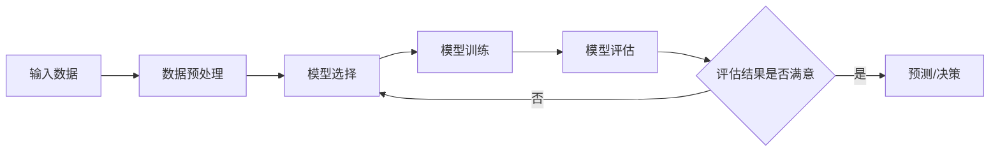

# AI编程：未来的技术创新

> 关键词：AI编程、技术创新、人工智能算法、机器学习、深度学习、应用场景、未来趋势

> 摘要：本文深入探讨了AI编程在未来技术创新中的关键作用。首先介绍了文章的背景，包括目的、预期读者、文档结构和相关术语。接着阐述了AI编程的核心概念及其联系，详细讲解了核心算法原理和具体操作步骤，并给出了Python源代码示例。通过数学模型和公式进一步剖析其原理，还进行了项目实战，包括开发环境搭建、源代码实现与解读。分析了AI编程在多个领域的实际应用场景，推荐了相关的学习资源、开发工具框架和论文著作。最后总结了未来发展趋势与挑战，并提供了常见问题解答和扩展阅读参考资料，旨在帮助读者全面了解AI编程及其在未来技术创新中的重要性和潜力。

## 1. 背景介绍 
### 1.1 目的和范围
本文旨在全面介绍AI编程在未来技术创新中的重要性、原理、应用和发展趋势。范围涵盖AI编程的核心概念、算法原理、数学模型、实际应用场景等方面，通过详细的讲解和代码示例，帮助读者深入理解AI编程，并为其在实际项目中的应用提供指导。

### 1.2 预期读者
本文预期读者包括对AI编程感兴趣的初学者、有一定编程基础想要深入学习AI技术的程序员、软件架构师以及关注未来技术创新的行业人士。

### 1.3 文档结构概述
本文首先介绍背景信息，让读者了解文章的目的和适用范围。接着阐述AI编程的核心概念和它们之间的联系，包括原理和架构的示意图与流程图。然后详细讲解核心算法原理和具体操作步骤，并用Python代码进行说明。通过数学模型和公式进一步剖析AI编程的原理，并举例说明。进行项目实战，包括开发环境搭建、源代码实现和解读。分析AI编程在不同领域的实际应用场景。推荐相关的学习资源、开发工具框架和论文著作。最后总结未来发展趋势与挑战，提供常见问题解答和扩展阅读参考资料。

### 1.4 术语表
#### 1.4.1 核心术语定义
- **AI编程**：将人工智能技术与编程相结合，通过编写代码实现智能算法和系统，使计算机能够模拟人类的智能行为，如学习、推理、决策等。
- **机器学习**：是AI的一个重要分支，它让计算机通过数据和经验来自动改进性能，而无需明确的编程指令。
- **深度学习**：一种基于人工神经网络的机器学习技术，通过构建多层神经网络来学习数据的深层次特征和模式。
- **神经网络**：由大量的神经元组成的计算模型，模仿人类大脑的神经系统，用于处理复杂的非线性问题。
- **算法**：解决特定问题的一系列计算步骤和方法。

#### 1.4.2 相关概念解释
- **数据预处理**：在将数据输入到AI模型之前，对数据进行清洗、转换、归一化等操作，以提高数据的质量和可用性。
- **模型训练**：使用训练数据对AI模型进行调整和优化，使其能够学习到数据中的模式和规律。
- **模型评估**：使用测试数据对训练好的模型进行评估，衡量模型的性能和准确性。
- **超参数**：在模型训练之前需要手动设置的参数，如学习率、迭代次数等，它们会影响模型的训练效果和性能。

#### 1.4.3 缩略词列表
- **AI**：Artificial Intelligence（人工智能）
- **ML**：Machine Learning（机器学习）
- **DL**：Deep Learning（深度学习）
- **ANN**：Artificial Neural Network（人工神经网络）
- **CNN**：Convolutional Neural Network（卷积神经网络）
- **RNN**：Recurrent Neural Network（循环神经网络）

## 2. 核心概念与联系 
### 2.1 核心概念原理
AI编程的核心概念主要包括机器学习、深度学习和神经网络。

#### 2.1.1 机器学习
机器学习的原理是让计算机从数据中自动学习模式和规律。它通常包括监督学习、无监督学习和强化学习三种类型。

- **监督学习**：在监督学习中，训练数据包含输入特征和对应的标签。模型的目标是学习输入特征和标签之间的映射关系，以便对新的输入数据进行预测。例如，在图像分类任务中，输入是图像的像素值，标签是图像所属的类别。
- **无监督学习**：无监督学习的训练数据只包含输入特征，没有对应的标签。模型的目标是发现数据中的内在结构和模式，如聚类分析、降维等。
- **强化学习**：强化学习通过智能体与环境进行交互，根据环境反馈的奖励信号来学习最优的行为策略。例如，在游戏中，智能体通过不断尝试不同的动作，根据游戏的得分来调整自己的策略。

#### 2.1.2 深度学习
深度学习是机器学习的一个子集，它基于人工神经网络。深度学习通过构建多层神经网络，让模型能够自动学习数据的深层次特征和模式。深度学习在图像识别、语音识别、自然语言处理等领域取得了巨大的成功。

#### 2.1.3 神经网络
神经网络由大量的神经元组成，每个神经元接收输入信号，经过加权求和和激活函数处理后输出结果。多个神经元组成一层，多层神经元相互连接形成神经网络。常见的神经网络结构包括前馈神经网络、卷积神经网络和循环神经网络。

### 2.2 架构的文本示意图
以下是一个简单的AI编程架构示意图：

```plaintext
输入数据 -> 数据预处理 -> 模型选择 -> 模型训练 -> 模型评估 -> 预测/决策
```

### 2.3 Mermaid流程图


## 3. 核心算法原理 & 具体操作步骤 
### 3.1 线性回归算法原理
线性回归是一种简单而常用的监督学习算法，用于预测连续值的输出。其基本原理是找到一条直线（在多维空间中是一个超平面），使得所有数据点到该直线的距离之和最小。

线性回归的数学模型可以表示为：

$$y = \theta_0 + \theta_1x_1 + \theta_2x_2 + \cdots + \theta_nx_n$$

其中，$y$ 是预测值，$x_1, x_2, \cdots, x_n$ 是输入特征，$\theta_0, \theta_1, \cdots, \theta_n$ 是模型的参数。

### 3.2 具体操作步骤
#### 3.2.1 数据准备
首先，我们需要准备训练数据和测试数据。假设我们有一个二维数据集，包含输入特征 $x$ 和对应的目标值 $y$。

```python
import numpy as np

# 生成一些示例数据
np.random.seed(0)
X = 2 * np.random.rand(100, 1)
y = 4 + 3 * X + np.random.randn(100, 1)

# 划分训练集和测试集
X_train, X_test = X[:80], X[80:]
y_train, y_test = y[:80], y[80:]
```

#### 3.2.2 模型训练
使用最小二乘法来计算模型的参数 $\theta$。最小二乘法的目标是最小化误差平方和：

$$J(\theta) = \frac{1}{2m}\sum_{i=1}^{m}(h_{\theta}(x^{(i)}) - y^{(i)})^2$$

其中，$m$ 是样本数量，$h_{\theta}(x)$ 是模型的预测值。

```python
# 添加偏置项
X_b = np.c_[np.ones((80, 1)), X_train]

# 使用最小二乘法计算参数
theta_best = np.linalg.inv(X_b.T.dot(X_b)).dot(X_b.T).dot(y_train)

print("模型参数 theta:", theta_best)
```

#### 3.2.3 模型预测
使用训练好的模型对测试数据进行预测。

```python
# 添加偏置项到测试数据
X_test_b = np.c_[np.ones((20, 1)), X_test]

# 进行预测
y_pred = X_test_b.dot(theta_best)

print("预测结果:", y_pred)
```

### 3.3 逻辑回归算法原理
逻辑回归是一种用于分类问题的监督学习算法。它通过逻辑函数（也称为 sigmoid 函数）将线性回归的输出映射到 $[0, 1]$ 区间，从而实现概率预测。

逻辑函数的定义为：

$$\sigma(z) = \frac{1}{1 + e^{-z}}$$

其中，$z$ 是线性回归的输出。

逻辑回归的预测概率可以表示为：

$$P(y = 1|x) = \sigma(\theta^T x)$$

### 3.4 具体操作步骤
#### 3.4.1 数据准备
同样，我们需要准备训练数据和测试数据。假设我们有一个二分类数据集。

```python
from sklearn.datasets import make_classification
from sklearn.model_selection import train_test_split

# 生成二分类数据集
X, y = make_classification(n_samples=100, n_features=2, n_informative=2, n_redundant=0, random_state=0)

# 划分训练集和测试集
X_train, X_test, y_train, y_test = train_test_split(X, y, test_size=0.2, random_state=0)
```

#### 3.4.2 模型训练
使用梯度下降法来更新模型的参数 $\theta$，以最小化对数损失函数：

$$J(\theta) = -\frac{1}{m}\sum_{i=1}^{m}[y^{(i)}\log(h_{\theta}(x^{(i)})) + (1 - y^{(i)})\log(1 - h_{\theta}(x^{(i)}))]$$

```python
def sigmoid(z):
    return 1 / (1 + np.exp(-z))

def logistic_regression(X, y, learning_rate=0.01, num_iterations=1000):
    m, n = X.shape
    theta = np.zeros((n, 1))
    
    for iteration in range(num_iterations):
        z = np.dot(X, theta)
        h = sigmoid(z)
        gradient = np.dot(X.T, (h - y.reshape(-1, 1))) / m
        theta = theta - learning_rate * gradient
    
    return theta

# 训练逻辑回归模型
theta = logistic_regression(X_train, y_train)

print("模型参数 theta:", theta)
```

#### 3.4.3 模型预测
使用训练好的模型对测试数据进行预测。

```python
def predict(X, theta):
    z = np.dot(X, theta)
    h = sigmoid(z)
    y_pred = (h >= 0.5).astype(int)
    return y_pred

# 进行预测
y_pred = predict(X_test, theta)

print("预测结果:", y_pred.flatten())
```

## 4. 数学模型和公式 & 详细讲解 & 举例说明 
### 4.1 线性回归的数学模型和公式
线性回归的数学模型为：

$$y = \theta_0 + \theta_1x_1 + \theta_2x_2 + \cdots + \theta_nx_n$$

可以写成矩阵形式：

$$y = X\theta$$

其中，$y$ 是 $m \times 1$ 的目标值向量，$X$ 是 $m \times (n + 1)$ 的特征矩阵（第一列全为 1 表示偏置项），$\theta$ 是 $(n + 1) \times 1$ 的参数向量。

最小二乘法的目标是最小化误差平方和：

$$J(\theta) = \frac{1}{2m}\sum_{i=1}^{m}(h_{\theta}(x^{(i)}) - y^{(i)})^2 = \frac{1}{2m}(X\theta - y)^T(X\theta - y)$$

对 $J(\theta)$ 求偏导数并令其为 0，可以得到最小二乘法的解：

$$\theta = (X^T X)^{-1} X^T y$$

**举例说明**：假设我们有一个简单的二维数据集，包含两个数据点 $(x_1, y_1) = (1, 3)$ 和 $(x_2, y_2) = (2, 5)$。我们可以将其表示为矩阵形式：

$$X = \begin{bmatrix} 1 & 1 \\ 1 & 2 \end{bmatrix}, y = \begin{bmatrix} 3 \\ 5 \end{bmatrix}$$

计算 $(X^T X)^{-1} X^T y$：

```python
X = np.array([[1, 1], [1, 2]])
y = np.array([[3], [5]])

X_b = np.c_[np.ones((2, 1)), X[:, 1:]]
theta_best = np.linalg.inv(X_b.T.dot(X_b)).dot(X_b.T).dot(y)

print("模型参数 theta:", theta_best)
```

### 4.2 逻辑回归的数学模型和公式
逻辑回归的预测概率为：

$$P(y = 1|x) = \sigma(\theta^T x) = \frac{1}{1 + e^{-\theta^T x}}$$

对数损失函数为：

$$J(\theta) = -\frac{1}{m}\sum_{i=1}^{m}[y^{(i)}\log(h_{\theta}(x^{(i)})) + (1 - y^{(i)})\log(1 - h_{\theta}(x^{(i)}))]$$

梯度下降法的更新公式为：

$$\theta = \theta - \alpha \frac{\partial J(\theta)}{\partial \theta}$$

其中，$\alpha$ 是学习率，$\frac{\partial J(\theta)}{\partial \theta}$ 是 $J(\theta)$ 对 $\theta$ 的偏导数：

$$\frac{\partial J(\theta)}{\partial \theta} = \frac{1}{m} \sum_{i=1}^{m} (h_{\theta}(x^{(i)}) - y^{(i)}) x^{(i)}$$

**举例说明**：假设我们有一个简单的二分类数据集，包含两个数据点 $(x_1, y_1) = (1, 1)$ 和 $(x_2, y_2) = (2, 0)$。我们可以使用梯度下降法来训练逻辑回归模型。

```python
X = np.array([[1], [2]])
y = np.array([1, 0])

# 添加偏置项
X_b = np.c_[np.ones((2, 1)), X]

# 初始化参数
theta = np.zeros((2, 1))

# 梯度下降法训练模型
learning_rate = 0.1
num_iterations = 1000

for iteration in range(num_iterations):
    z = np.dot(X_b, theta)
    h = sigmoid(z)
    gradient = np.dot(X_b.T, (h - y.reshape(-1, 1))) / 2
    theta = theta - learning_rate * gradient

print("模型参数 theta:", theta)
```

## 5. 项目实战：代码实际案例和详细解释说明 
### 5.1  开发环境搭建
#### 5.1.1 安装 Python
首先，需要安装 Python 环境。建议使用 Python 3.7 及以上版本。可以从 Python 官方网站（https://www.python.org/downloads/） 下载并安装适合自己操作系统的 Python 版本。

#### 5.1.2 安装必要的库
使用 pip 安装以下必要的库：

```sh
pip install numpy pandas scikit-learn matplotlib
```

- **numpy**：用于数值计算和数组操作。
- **pandas**：用于数据处理和分析。
- **scikit-learn**：提供了丰富的机器学习算法和工具。
- **matplotlib**：用于数据可视化。

### 5.2  源代码详细实现和代码解读
#### 5.2.1 数据集准备
我们使用 sklearn 中的鸢尾花数据集进行分类任务。

```python
from sklearn.datasets import load_iris
from sklearn.model_selection import train_test_split

# 加载鸢尾花数据集
iris = load_iris()
X = iris.data
y = iris.target

# 划分训练集和测试集
X_train, X_test, y_train, y_test = train_test_split(X, y, test_size=0.2, random_state=0)
```

**代码解读**：
- `load_iris()` 函数用于加载鸢尾花数据集。
- `train_test_split()` 函数用于将数据集划分为训练集和测试集，`test_size=0.2` 表示测试集占总数据集的 20%。

#### 5.2.2 模型选择和训练
我们选择使用逻辑回归模型进行分类。

```python
from sklearn.linear_model import LogisticRegression

# 创建逻辑回归模型
model = LogisticRegression()

# 训练模型
model.fit(X_train, y_train)
```

**代码解读**：
- `LogisticRegression()` 用于创建逻辑回归模型。
- `fit()` 方法用于训练模型，将训练数据 `X_train` 和对应的标签 `y_train` 作为输入。

#### 5.2.3 模型预测和评估
使用训练好的模型对测试数据进行预测，并评估模型的性能。

```python
from sklearn.metrics import accuracy_score

# 进行预测
y_pred = model.predict(X_test)

# 计算准确率
accuracy = accuracy_score(y_test, y_pred)

print("模型准确率:", accuracy)
```

**代码解读**：
- `predict()` 方法用于对测试数据 `X_test` 进行预测，返回预测结果 `y_pred`。
- `accuracy_score()` 函数用于计算预测结果的准确率，将真实标签 `y_test` 和预测标签 `y_pred` 作为输入。

### 5.3  代码解读与分析
#### 5.3.1 数据准备阶段
数据准备是机器学习项目的重要步骤。在这个阶段，我们需要加载数据集、划分训练集和测试集。划分训练集和测试集的目的是为了评估模型在未见过的数据上的性能，避免过拟合。

#### 5.3.2 模型训练阶段
在模型训练阶段，我们选择合适的模型，并使用训练数据对模型进行训练。逻辑回归是一种简单而有效的分类模型，它通过逻辑函数将线性回归的输出映射到 $[0, 1]$ 区间，从而实现概率预测。

#### 5.3.3 模型评估阶段
模型评估是为了衡量模型的性能。在这个阶段，我们使用测试数据对训练好的模型进行预测，并计算预测结果的准确率。准确率是一种常用的评估指标，它表示预测正确的样本数占总样本数的比例。

## 6. 实际应用场景 
### 6.1 医疗领域
- **疾病诊断**：AI编程可以分析患者的病历、影像数据（如X光、CT、MRI等），帮助医生更准确地诊断疾病。例如，通过深度学习算法对肺部影像进行分析，检测肺癌的早期症状。
- **药物研发**：利用AI技术可以预测药物的疗效和副作用，加速药物研发的过程。通过分析大量的生物数据和化学结构，筛选出潜在的药物分子。

### 6.2 金融领域
- **风险评估**：AI编程可以分析客户的信用记录、财务状况等数据，评估客户的信用风险。银行可以根据评估结果决定是否给予贷款以及贷款的额度和利率。
- **股票预测**：通过分析历史股票数据、新闻资讯、社交媒体情绪等信息，使用机器学习算法预测股票价格的走势，为投资者提供决策参考。

### 6.3 交通领域
- **自动驾驶**：AI编程是自动驾驶技术的核心。通过传感器收集车辆周围的环境信息，使用深度学习算法对这些信息进行处理和分析，实现车辆的自主导航、避障和决策。
- **交通流量预测**：分析交通传感器数据、地图信息等，预测交通流量的变化，帮助交通管理部门优化交通信号控制，缓解交通拥堵。

### 6.4 教育领域
- **个性化学习**：根据学生的学习进度、学习习惯和能力水平，使用AI算法为学生提供个性化的学习方案和学习资源。例如，智能辅导系统可以根据学生的答题情况，提供针对性的辅导和练习。
- **考试评估**：利用自然语言处理技术对学生的作文、简答题等进行自动评分，提高评分的效率和准确性。

### 6.5 娱乐领域
- **游戏开发**：AI编程可以实现游戏中的智能对手、剧情生成等功能。例如，在策略游戏中，AI对手可以根据玩家的策略做出相应的反应，增加游戏的趣味性和挑战性。
- **内容推荐**：根据用户的浏览历史、收藏记录等信息，使用推荐算法为用户推荐个性化的音乐、电影、书籍等娱乐内容。

## 7. 工具和资源推荐
### 7.1 学习资源推荐
#### 7.1.1 书籍推荐
- 《Python机器学习》：本书详细介绍了Python在机器学习中的应用，包括各种机器学习算法的原理和实现。
- 《深度学习》：由深度学习领域的三位顶尖专家所著，全面介绍了深度学习的理论和实践。
- 《人工智能：一种现代的方法》：是人工智能领域的经典教材，涵盖了人工智能的各个方面，包括搜索算法、知识表示、机器学习等。

#### 7.1.2 在线课程
- Coursera上的“机器学习”课程：由斯坦福大学的Andrew Ng教授授课，是学习机器学习的经典课程。
- edX上的“深度学习微硕士项目”：提供了系统的深度学习课程，包括卷积神经网络、循环神经网络等。
- 中国大学MOOC上的“人工智能基础”课程：适合初学者了解人工智能的基本概念和方法。

#### 7.1.3 技术博客和网站
- Medium：有许多关于AI编程的优质文章，涵盖了最新的技术和研究成果。
- Towards Data Science：专注于数据科学和机器学习领域，提供了大量的技术教程和案例分析。
- Kaggle：是一个数据科学竞赛平台，上面有很多优秀的数据科学项目和代码可供学习。

### 7.2 开发工具框架推荐
#### 7.2.1 IDE和编辑器
- PyCharm：是一款专门为Python开发设计的集成开发环境，具有强大的代码编辑、调试和自动补全功能。
- Jupyter Notebook：是一个交互式的开发环境，适合进行数据探索和模型实验。
- Visual Studio Code：是一款轻量级的代码编辑器，支持多种编程语言，并且有丰富的插件可以扩展功能。

#### 7.2.2 调试和性能分析工具
- TensorBoard：是TensorFlow提供的可视化工具，可以用于监控模型的训练过程、可视化模型结构等。
- Py-Spy：是一个Python性能分析工具，可以分析Python程序的CPU使用情况和函数调用时间。
- cProfile：是Python标准库中的性能分析模块，可以统计函数的调用次数和执行时间。

#### 7.2.3 相关框架和库
- TensorFlow：是Google开发的开源深度学习框架，提供了丰富的工具和接口，支持分布式训练和模型部署。
- PyTorch：是Facebook开发的深度学习框架，具有动态图的特点，易于使用和调试。
- Scikit-learn：是一个简单而高效的机器学习库，提供了各种机器学习算法和工具，适合初学者使用。

### 7.3 相关论文著作推荐
#### 7.3.1 经典论文
- “Gradient-Based Learning Applied to Document Recognition”：介绍了卷积神经网络在手写数字识别中的应用，是深度学习领域的经典论文。
- “Long Short-Term Memory”：提出了长短期记忆网络（LSTM），解决了循环神经网络中的梯度消失问题。
- “Attention Is All You Need”：提出了Transformer架构，在自然语言处理领域取得了巨大的成功。

#### 7.3.2 最新研究成果
- 在arXiv.org上可以找到许多关于AI编程的最新研究论文，涵盖了各个领域的前沿技术。
- 顶会论文，如NeurIPS（神经信息处理系统大会）、ICML（国际机器学习会议）、CVPR（计算机视觉与模式识别会议）等，发表了许多高质量的研究成果。

#### 7.3.3 应用案例分析
- 《AI 超级应用案例集》：介绍了AI在各个行业的应用案例，包括医疗、金融、交通等领域。
- 各大科技公司的技术博客，如Google AI Blog、Facebook AI Research等，会分享他们在AI编程方面的应用案例和实践经验。

## 8. 总结：未来发展趋势与挑战
### 8.1 未来发展趋势
#### 8.1.1 自动化和智能化
AI编程将越来越自动化和智能化。未来，开发者可以使用低代码或无代码平台进行AI开发，通过简单的拖拽和配置就可以构建复杂的AI模型。同时，AI系统将能够自动学习和优化，不断提高性能和效率。

#### 8.1.2 跨领域融合
AI编程将与其他技术领域进行更深入的融合，如物联网、区块链、量子计算等。例如，AI与物联网结合可以实现智能城市、智能家居等应用；AI与区块链结合可以提高数据的安全性和可信度。

#### 8.1.3 强化学习和自主智能
强化学习将在更多领域得到应用，使AI系统能够在复杂的环境中自主学习和决策。未来的AI系统将具有更高的自主性和适应性，能够应对各种未知的情况。

#### 8.1.4 边缘计算和端侧智能
随着物联网设备的普及，边缘计算和端侧智能将成为发展趋势。AI模型可以在边缘设备上运行，实现实时处理和决策，减少数据传输和延迟。

### 8.2 挑战
#### 8.2.1 数据隐私和安全
AI编程需要大量的数据进行训练，而这些数据往往包含用户的隐私信息。如何保护数据的隐私和安全是一个重要的挑战。同时，AI系统也可能受到攻击，导致模型被篡改或数据泄露。

#### 8.2.2 算法可解释性
许多AI算法，如深度学习，是黑盒模型，很难解释其决策过程和结果。在一些关键领域，如医疗、金融等，算法的可解释性至关重要。如何提高AI算法的可解释性是一个亟待解决的问题。

#### 8.2.3 人才短缺
AI编程是一个新兴领域，目前相关的专业人才短缺。培养更多的AI编程人才需要加强教育和培训，提高人们对AI技术的认识和理解。

#### 8.2.4 伦理和社会问题
AI技术的发展也带来了一系列伦理和社会问题，如失业、贫富差距扩大、算法偏见等。如何在发展AI技术的同时，解决这些伦理和社会问题，是一个需要全社会共同关注和努力的问题。

## 9. 附录：常见问题与解答
### 9.1 AI编程难学吗？
AI编程对于初学者来说可能有一定的难度，因为它涉及到数学、机器学习算法、编程等多个领域的知识。但是，只要有一定的编程基础和学习热情，通过系统的学习和实践，是可以掌握AI编程的。

### 9.2 学习AI编程需要哪些基础知识？
学习AI编程需要掌握Python编程基础、线性代数、概率论与数理统计等基础知识。同时，了解机器学习和深度学习的基本概念和算法也是必要的。

### 9.3 如何选择适合自己的AI框架？
选择适合自己的AI框架需要考虑以下几个因素：学习成本、应用场景、社区支持等。对于初学者来说，Scikit-learn是一个不错的选择，它简单易用，适合快速上手。对于深度学习，TensorFlow和PyTorch是两个主流的框架，可以根据自己的需求和喜好进行选择。

### 9.4 AI编程可以应用于哪些领域？
AI编程可以应用于医疗、金融、交通、教育、娱乐等多个领域，如疾病诊断、风险评估、自动驾驶、个性化学习、内容推荐等。

### 9.5 如何提高AI模型的性能？
提高AI模型的性能可以从以下几个方面入手：选择合适的模型和算法、进行数据预处理和特征工程、调整模型的超参数、增加训练数据等。

## 10. 扩展阅读 & 参考资料
### 10.1 扩展阅读
- 《AI未来进行式》：探讨了AI技术对未来社会的影响和挑战。
- 《智能时代》：介绍了AI技术在各个领域的应用和发展趋势。
- 《人类简史：从动物到上帝》：从人类历史的角度探讨了AI技术对人类社会的影响。

### 10.2 参考资料
- 各开源框架的官方文档，如TensorFlow官方文档（https://www.tensorflow.org/）、PyTorch官方文档（https://pytorch.org/）等。
- 学术数据库，如IEEE Xplore、ACM Digital Library等，提供了大量的学术论文和研究成果。
- 科技媒体，如TechCrunch、Wired等，报道了AI领域的最新动态和趋势。