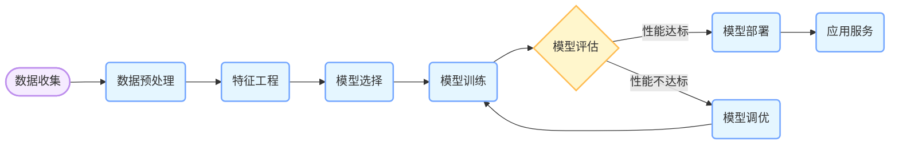

# AI编程：未来的技术趋势

> 关键词：AI编程、技术趋势、机器学习、深度学习、人工智能算法、自动化编程、智能代码辅助

> 摘要：本文深入探讨了AI编程在未来的技术趋势。从背景介绍入手，阐述了目的、预期读者等内容。详细讲解了AI编程的核心概念与联系，包括其原理和架构，并通过Mermaid流程图直观呈现。剖析了核心算法原理，结合Python源代码进行具体说明，还介绍了相关数学模型和公式。通过项目实战案例，展示了开发环境搭建、源代码实现及解读。分析了AI编程的实际应用场景，推荐了学习、开发等方面的工具和资源。最后总结了未来发展趋势与挑战，解答常见问题并提供扩展阅读与参考资料，旨在为读者全面呈现AI编程的未来发展图景。

## 1. 背景介绍 
### 1.1 目的和范围
AI编程作为当今科技领域最具活力和潜力的方向之一，正深刻地改变着软件开发的方式和未来走向。本文的目的在于全面且深入地探讨AI编程在未来的技术趋势，涵盖从基础概念到实际应用，从算法原理到项目实战等多个层面。范围包括AI编程的核心技术，如机器学习、深度学习等相关算法，以及这些技术在不同领域的应用和未来的发展方向。通过对这些内容的研究和分析，帮助读者了解AI编程的全貌，把握未来技术发展的脉搏，为从事相关工作或对该领域感兴趣的人士提供有价值的参考。

### 1.2 预期读者
本文预期读者广泛，包括但不限于计算机科学专业的学生、软件开发人员、人工智能研究者、技术爱好者以及企业的技术决策者等。对于学生来说，本文可以作为他们了解AI编程前沿知识，拓宽专业视野的学习资料；软件开发人员可以从中获取新的编程思路和技术方法，提升自己的编程能力和解决问题的能力；人工智能研究者能够在其中找到关于AI编程技术趋势的深入分析和探讨，为自己的研究提供参考；技术爱好者可以通过本文满足对新兴技术的好奇心，了解AI编程的魅力；企业技术决策者则可以依据本文的内容，对企业的技术发展战略和投资方向做出更明智的决策。

### 1.3 文档结构概述
本文将按照以下结构展开：首先介绍AI编程的背景信息，包括目的、预期读者和文档结构概述等；接着深入讲解AI编程的核心概念与联系，通过文本示意图和Mermaid流程图清晰呈现其原理和架构；然后详细阐述核心算法原理，并结合Python源代码进行具体操作步骤的说明；随后介绍AI编程涉及的数学模型和公式，并举例说明；通过项目实战，展示开发环境搭建、源代码实现和代码解读；分析AI编程的实际应用场景；推荐学习、开发等方面的工具和资源；总结未来发展趋势与挑战；解答常见问题；最后提供扩展阅读与参考资料，为读者进一步深入学习提供指引。

### 1.4 术语表
#### 1.4.1 核心术语定义
- **AI编程（Artificial Intelligence Programming）**：指利用人工智能技术和方法进行软件开发的过程，旨在让计算机系统具备智能行为，如学习、推理、决策等。
- **机器学习（Machine Learning）**：是一门多领域交叉学科，涉及概率论、统计学、逼近论、凸分析、算法复杂度理论等多门学科。它专门研究计算机怎样模拟或实现人类的学习行为，以获取新的知识或技能，重新组织已有的知识结构使之不断改善自身的性能。
- **深度学习（Deep Learning）**：是机器学习的一个分支领域，它是一种基于对数据进行表征学习的方法。深度学习通过构建具有很多层的神经网络模型，自动从大量数据中学习特征和模式，从而实现对数据的分类、预测等任务。
- **人工智能算法（Artificial Intelligence Algorithm）**：是实现人工智能功能的一系列计算方法和规则，包括搜索算法、优化算法、决策算法等，用于解决各种人工智能问题。
- **自动化编程（Automated Programming）**：指利用计算机程序自动生成代码的过程，减少人工编写代码的工作量，提高编程效率和质量。
- **智能代码辅助（Intelligent Code Assistance）**：借助人工智能技术为程序员提供代码自动补全、错误提示、代码优化建议等功能的工具和系统。

#### 1.4.2 相关概念解释
- **神经网络（Neural Network）**：是一种模仿人类神经系统的计算模型，由大量的神经元组成。神经元之间通过连接传递信息，通过调整连接的权重来学习数据中的模式和规律。
- **训练数据（Training Data）**：用于训练机器学习和深度学习模型的数据集合。模型通过对训练数据的学习，调整自身的参数，以达到对数据的良好拟合和预测能力。
- **验证数据（Validation Data）**：在模型训练过程中，用于评估模型性能和调整超参数的数据集合。验证数据可以帮助我们判断模型是否过拟合或欠拟合，从而选择合适的模型和参数。
- **测试数据（Test Data）**：在模型训练完成后，用于最终评估模型性能的数据集合。测试数据应该是模型在训练和验证过程中未见过的数据，以保证评估结果的客观性和准确性。

#### 1.4.3 缩略词列表
- **AI**：Artificial Intelligence（人工智能）
- **ML**：Machine Learning（机器学习）
- **DL**：Deep Learning（深度学习）
- **CNN**：Convolutional Neural Network（卷积神经网络）
- **RNN**：Recurrent Neural Network（循环神经网络）
- **LSTM**：Long Short - Term Memory（长短期记忆网络）

## 2. 核心概念与联系 
AI编程的核心概念主要围绕人工智能技术在编程领域的应用展开，涉及机器学习、深度学习等多个方面。其基本原理是通过让计算机系统学习大量的数据，从中发现模式和规律，进而实现智能的决策和行为。

### 核心概念原理和架构的文本示意图
AI编程的核心架构可以分为数据层、模型层和应用层。数据层是整个系统的基础，负责收集、存储和预处理各种数据，包括结构化数据和非结构化数据。模型层是核心部分，包含各种机器学习和深度学习模型，如神经网络、决策树等。这些模型通过对数据层提供的数据进行学习和训练，提取数据中的特征和模式。应用层则是将训练好的模型应用到实际的业务场景中，如图像识别、自然语言处理等。

### Mermaid流程图

这个流程图展示了AI编程的基本流程。首先进行数据收集，然后对收集到的数据进行预处理和特征工程，接着选择合适的模型进行训练。训练完成后对模型进行评估，如果性能达标则进行模型部署，应用到实际服务中；如果性能不达标则进行模型调优等操作，重新进行训练，直到模型性能满足要求。

## 3. 核心算法原理 & 具体操作步骤 
### 机器学习中的线性回归算法原理及Python实现
线性回归是一种简单而常用的机器学习算法，用于建立自变量和因变量之间的线性关系。其基本原理是通过最小化预测值与真实值之间的误差平方和，来确定最佳的回归系数。

线性回归的数学模型可以表示为：
$$y = \theta_0 + \theta_1x_1 + \theta_2x_2 + \cdots + \theta_nx_n + \epsilon$$
其中，$y$ 是因变量，$x_1, x_2, \cdots, x_n$ 是自变量，$\theta_0, \theta_1, \cdots, \theta_n$ 是回归系数，$\epsilon$ 是误差项。

以下是使用Python实现线性回归的具体代码：
```python
import numpy as np
from sklearn.model_selection import train_test_split
from sklearn.linear_model import LinearRegression
from sklearn.metrics import mean_squared_error

# 生成一些示例数据
np.random.seed(0)
X = 2 * np.random.rand(100, 1)
y = 4 + 3 * X + np.random.randn(100, 1)

# 划分训练集和测试集
X_train, X_test, y_train, y_test = train_test_split(X, y, test_size=0.2, random_state=42)

# 创建线性回归模型
model = LinearRegression()

# 训练模型
model.fit(X_train, y_train)

# 进行预测
y_pred = model.predict(X_test)

# 计算均方误差
mse = mean_squared_error(y_test, y_pred)
print(f"均方误差: {mse}")
```
### 代码解释
1. **数据生成**：使用 `numpy` 生成一些随机数据作为示例，$X$ 是自变量，$y$ 是因变量，同时添加了一些随机噪声。
2. **数据划分**：使用 `train_test_split` 函数将数据划分为训练集和测试集，测试集占比为20%。
3. **模型创建**：创建一个 `LinearRegression` 类的实例，作为线性回归模型。
4. **模型训练**：使用 `fit` 方法对模型进行训练，传入训练集的自变量和因变量。
5. **模型预测**：使用 `predict` 方法对测试集进行预测，得到预测值。
6. **模型评估**：使用 `mean_squared_error` 函数计算预测值和真实值之间的均方误差，评估模型的性能。

### 深度学习中的卷积神经网络（CNN）原理及Python实现
卷积神经网络是一种专门用于处理具有网格结构数据（如图像）的深度学习模型。其核心组件包括卷积层、池化层和全连接层。

卷积层通过卷积核在输入数据上滑动，提取数据的局部特征。池化层用于对特征图进行下采样，减少数据的维度，同时保留重要的特征信息。全连接层则将前面提取的特征进行整合，输出最终的分类或预测结果。

以下是使用 `Keras` 实现一个简单的卷积神经网络用于图像分类的代码：
```python
from keras.datasets import mnist
from keras.models import Sequential
from keras.layers import Conv2D, MaxPooling2D, Flatten, Dense
from keras.utils import to_categorical

# 加载MNIST数据集
(train_images, train_labels), (test_images, test_labels) = mnist.load_data()

# 数据预处理
train_images = train_images.reshape((60000, 28, 28, 1))
train_images = train_images.astype('float32') / 255
test_images = test_images.reshape((10000, 28, 28, 1))
test_images = test_images.astype('float32') / 255

train_labels = to_categorical(train_labels)
test_labels = to_categorical(test_labels)

# 创建卷积神经网络模型
model = Sequential()
model.add(Conv2D(32, (3, 3), activation='relu', input_shape=(28, 28, 1)))
model.add(MaxPooling2D((2, 2)))
model.add(Conv2D(64, (3, 3), activation='relu'))
model.add(MaxPooling2D((2, 2)))
model.add(Flatten())
model.add(Dense(64, activation='relu'))
model.add(Dense(10, activation='softmax'))

# 编译模型
model.compile(optimizer='adam',
              loss='categorical_crossentropy',
              metrics=['accuracy'])

# 训练模型
model.fit(train_images, train_labels, epochs=5, batch_size=64)

# 评估模型
test_loss, test_acc = model.evaluate(test_images, test_labels)
print(f"测试集损失: {test_loss}, 测试集准确率: {test_acc}")
```
### 代码解释
1. **数据加载**：使用 `mnist.load_data()` 加载MNIST手写数字数据集。
2. **数据预处理**：将图像数据进行形状调整和归一化处理，将标签数据进行one - hot编码。
3. **模型创建**：使用 `Sequential` 模型依次添加卷积层、池化层、全连接层等组件。
4. **模型编译**：指定优化器、损失函数和评估指标。
5. **模型训练**：使用 `fit` 方法对模型进行训练，指定训练数据、训练轮数和批次大小。
6. **模型评估**：使用 `evaluate` 方法对模型在测试集上的性能进行评估，输出测试集的损失和准确率。

## 4. 数学模型和公式 & 详细讲解 & 举例说明 
### 线性回归的数学模型和公式
线性回归的目标是找到一组回归系数 $\theta = [\theta_0, \theta_1, \cdots, \theta_n]$，使得预测值 $\hat{y}$ 与真实值 $y$ 之间的误差平方和最小。误差平方和可以表示为：
$$J(\theta) = \frac{1}{2m}\sum_{i = 1}^{m}(h_{\theta}(x^{(i)}) - y^{(i)})^2$$
其中，$m$ 是样本数量，$h_{\theta}(x^{(i)})$ 是第 $i$ 个样本的预测值，$y^{(i)}$ 是第 $i$ 个样本的真实值。

为了找到使 $J(\theta)$ 最小的 $\theta$，可以使用梯度下降算法。梯度下降算法的更新公式为：
$$\theta_j := \theta_j - \alpha\frac{\partial J(\theta)}{\partial \theta_j}$$
其中，$\alpha$ 是学习率，$\frac{\partial J(\theta)}{\partial \theta_j}$ 是 $J(\theta)$ 关于 $\theta_j$ 的偏导数。

对于线性回归，$\frac{\partial J(\theta)}{\partial \theta_j}$ 的计算公式为：
$$\frac{\partial J(\theta)}{\partial \theta_j} = \frac{1}{m}\sum_{i = 1}^{m}(h_{\theta}(x^{(i)}) - y^{(i)})x_j^{(i)}$$

### 举例说明
假设有以下数据集：
| $x$ | $y$ |
|---|---|
| 1 | 3 |
| 2 | 5 |
| 3 | 7 |

我们要使用线性回归模型 $y = \theta_0 + \theta_1x$ 来拟合这些数据。

首先，初始化 $\theta_0 = 0$，$\theta_1 = 0$，学习率 $\alpha = 0.1$。

计算 $h_{\theta}(x^{(i)}) = \theta_0 + \theta_1x^{(i)}$，$J(\theta)$ 和 $\frac{\partial J(\theta)}{\partial \theta_j}$：
- 当 $i = 1$ 时，$x^{(1)} = 1$，$y^{(1)} = 3$，$h_{\theta}(x^{(1)}) = 0 + 0\times1 = 0$
- 当 $i = 2$ 时，$x^{(2)} = 2$，$y^{(2)} = 5$，$h_{\theta}(x^{(2)}) = 0 + 0\times2 = 0$
- 当 $i = 3$ 时，$x^{(3)} = 3$，$y^{(3)} = 7$，$h_{\theta}(x^{(3)}) = 0 + 0\times3 = 0$

$J(\theta) = \frac{1}{2\times3}[(0 - 3)^2+(0 - 5)^2+(0 - 7)^2]=\frac{1}{6}(9 + 25 + 49)=\frac{83}{6}\approx13.83$

$\frac{\partial J(\theta)}{\partial \theta_0}=\frac{1}{3}[(0 - 3)+(0 - 5)+(0 - 7)]=\frac{-15}{3}=-5$

$\frac{\partial J(\theta)}{\partial \theta_1}=\frac{1}{3}[(0 - 3)\times1+(0 - 5)\times2+(0 - 7)\times3]=\frac{-3 - 10 - 21}{3}=\frac{-34}{3}\approx - 11.33$

更新 $\theta$：
$\theta_0 := \theta_0 - \alpha\frac{\partial J(\theta)}{\partial \theta_0}=0 - 0.1\times(-5)=0.5$
$\theta_1 := \theta_1 - \alpha\frac{\partial J(\theta)}{\partial \theta_1}=0 - 0.1\times(-11.33)=1.133$

重复上述步骤，直到 $J(\theta)$ 收敛到一个较小的值。

### 卷积神经网络的数学模型和公式
卷积层的核心操作是卷积运算。假设输入特征图为 $X$，卷积核为 $K$，输出特征图为 $Y$，则卷积运算可以表示为：
$$Y_{i,j}^c=\sum_{m = 0}^{M - 1}\sum_{n = 0}^{N - 1}X_{i + m,j + n}^fK_{m,n}^{f,c}$$
其中，$M$ 和 $N$ 是卷积核的大小，$f$ 是输入特征图的通道数，$c$ 是输出特征图的通道数。

池化层的常见操作是最大池化。假设输入特征图为 $X$，池化窗口大小为 $P\times P$，输出特征图为 $Y$，则最大池化运算可以表示为：
$$Y_{i,j}^c=\max_{m = 0}^{P - 1}\max_{n = 0}^{P - 1}X_{i\times P + m,j\times P + n}^c$$

### 举例说明
假设有一个输入特征图 $X$ 为：
$$X=\begin{bmatrix}
1 & 2 & 3\\
4 & 5 & 6\\
7 & 8 & 9
\end{bmatrix}$$
卷积核 $K$ 为：
$$K=\begin{bmatrix}
1 & 0\\
0 & 1
\end{bmatrix}$$

进行卷积运算：
- 当 $i = 0$，$j = 0$ 时，$Y_{0,0}=\sum_{m = 0}^{1}\sum_{n = 0}^{1}X_{0 + m,0 + n}K_{m,n}=1\times1+2\times0 + 4\times0+5\times1 = 6$
- 当 $i = 0$，$j = 1$ 时，$Y_{0,1}=\sum_{m = 0}^{1}\sum_{n = 0}^{1}X_{0 + m,1 + n}K_{m,n}=2\times1+3\times0 + 5\times0+6\times1 = 8$
- 当 $i = 1$，$j = 0$ 时，$Y_{1,0}=\sum_{m = 0}^{1}\sum_{n = 0}^{1}X_{1 + m,0 + n}K_{m,n}=4\times1+5\times0 + 7\times0+8\times1 = 12$
- 当 $i = 1$，$j = 1$ 时，$Y_{1,1}=\sum_{m = 0}^{1}\sum_{n = 0}^{1}X_{1 + m,1 + n}K_{m,n}=5\times1+6\times0 + 8\times0+9\times1 = 14$

输出特征图 $Y$ 为：
$$Y=\begin{bmatrix}
6 & 8\\
12 & 14
\end{bmatrix}$$

如果进行 $2\times2$ 的最大池化操作，输入特征图 $X$ 经过最大池化后，$Y_{0,0}=\max\{1,2,4,5\}=5$，$Y_{0,1}=\max\{3,6\}=6$，$Y_{1,0}=\max\{7,8\}=8$，$Y_{1,1}=\max\{9\}=9$，输出特征图 $Y$ 为：
$$Y=\begin{bmatrix}
5 & 6\\
8 & 9
\end{bmatrix}$$

## 5. 项目实战：代码实际案例和详细解释说明 
### 5.1  开发环境搭建
#### 安装Python
首先，需要安装Python环境。可以从Python官方网站（https://www.python.org/downloads/） 下载适合自己操作系统的Python安装包，按照安装向导进行安装。建议安装Python 3.6及以上版本。

#### 安装必要的库
使用 `pip` 包管理工具安装一些必要的库，如 `numpy`、`pandas`、`scikit - learn`、`tensorflow`、`keras` 等。可以使用以下命令进行安装：
```sh
pip install numpy pandas scikit-learn tensorflow keras
```

#### 安装开发工具
可以选择使用集成开发环境（IDE），如PyCharm、Jupyter Notebook等。PyCharm是一款功能强大的Python IDE，提供了代码编辑、调试、版本控制等丰富的功能；Jupyter Notebook则是一个交互式的开发环境，适合进行数据探索和模型实验。

### 5.2  源代码详细实现和代码解读
#### 项目背景
我们要实现一个简单的电影推荐系统，使用协同过滤算法。协同过滤算法基于用户的历史行为数据，找到与目标用户兴趣相似的其他用户，然后根据这些相似用户的喜好来推荐电影。

#### 代码实现
```python
import pandas as pd
from sklearn.metrics.pairwise import cosine_similarity

# 加载数据
ratings_data = pd.read_csv('ratings.csv')
movies_data = pd.read_csv('movies.csv')

# 合并数据
merged_data = pd.merge(ratings_data, movies_data, on='movieId')

# 创建用户 - 电影评分矩阵
user_movie_matrix = merged_data.pivot_table(index='userId', columns='movieId', values='rating')

# 填充缺失值
user_movie_matrix = user_movie_matrix.fillna(0)

# 计算用户之间的相似度
user_similarity = cosine_similarity(user_movie_matrix)

# 定义推荐函数
def recommend_movies(user_id, top_n=10):
    # 获取目标用户的相似度向量
    user_similarity_vector = user_similarity[user_id - 1]

    # 找到与目标用户最相似的用户
    similar_users = user_similarity_vector.argsort()[::-1][1:top_n + 1]

    # 找到这些相似用户评分高但目标用户未看过的电影
    target_user_ratings = user_movie_matrix.loc[user_id]
    recommended_movies = []
    for similar_user_id in similar_users:
        similar_user_ratings = user_movie_matrix.iloc[similar_user_id]
        for movie_id in similar_user_ratings.index:
            if target_user_ratings[movie_id] == 0 and similar_user_ratings[movie_id] > 0:
                recommended_movies.append(movie_id)

    # 去除重复的电影
    recommended_movies = list(set(recommended_movies))

    # 获取电影名称
    recommended_movie_names = movies_data[movies_data['movieId'].isin(recommended_movies)]['title'].tolist()

    return recommended_movie_names

# 测试推荐函数
user_id = 1
recommended_movies = recommend_movies(user_id)
print(f"为用户 {user_id} 推荐的电影：")
for movie in recommended_movies:
    print(movie)
```
#### 代码解读
1. **数据加载**：使用 `pandas` 库的 `read_csv` 函数加载电影评分数据和电影信息数据。
2. **数据合并**：使用 `merge` 函数将评分数据和电影信息数据根据 `movieId` 进行合并。
3. **创建用户 - 电影评分矩阵**：使用 `pivot_table` 函数将数据转换为用户 - 电影评分矩阵，其中行表示用户，列表示电影，值表示用户对电影的评分。
4. **填充缺失值**：由于不是每个用户都对所有电影进行了评分，矩阵中会存在缺失值，使用 `fillna` 函数将缺失值填充为0。
5. **计算用户相似度**：使用 `cosine_similarity` 函数计算用户之间的余弦相似度，得到用户相似度矩阵。
6. **推荐函数**：定义 `recommend_movies` 函数，根据目标用户的相似度向量找到最相似的用户，然后找到这些相似用户评分高但目标用户未看过的电影，最后返回电影名称。
7. **测试推荐函数**：选择一个用户ID，调用推荐函数并输出推荐的电影名称。

### 5.3  代码解读与分析
#### 优点
- **简单易懂**：协同过滤算法是一种简单而有效的推荐算法，代码实现相对简单，易于理解和维护。
- **基于用户行为**：该算法利用用户的历史行为数据进行推荐，能够反映用户的真实兴趣。

#### 缺点
- **数据稀疏性**：在实际应用中，用户 - 电影评分矩阵往往非常稀疏，这会影响相似度计算的准确性。
- **冷启动问题**：对于新用户或新电影，由于缺乏历史数据，难以进行准确的推荐。

#### 改进方向
- **使用其他相似度计算方法**：除了余弦相似度，还可以尝试使用皮尔逊相关系数等其他相似度计算方法。
- **结合内容信息**：可以结合电影的内容信息，如类型、演员、导演等，来缓解冷启动问题。

## 6. 实际应用场景 
### 自然语言处理领域
- **智能客服**：AI编程可以实现智能客服系统，通过自然语言处理技术理解用户的问题，并自动给出回答。例如，电商平台的智能客服可以快速解答用户关于商品信息、订单状态等问题，提高用户服务效率。
- **机器翻译**：利用深度学习模型，如Transformer架构，实现高质量的机器翻译。谷歌翻译等产品就是AI编程在机器翻译领域的典型应用，能够将一种语言翻译成另一种语言，促进跨语言交流。
- **文本生成**：可以用于生成新闻报道、故事、诗歌等文本内容。例如，一些媒体机构使用AI编程技术自动生成体育赛事、财经新闻等简单的报道，提高新闻生产效率。

### 计算机视觉领域
- **图像识别**：在安防监控中，AI编程可以实现人脸识别、车牌识别等功能，帮助警方快速识别嫌疑人或车辆信息。在医疗领域，图像识别技术可以辅助医生进行疾病诊断，如识别X光、CT等医学影像中的病变。
- **目标检测**：在自动驾驶领域，目标检测技术可以识别道路上的车辆、行人、交通标志等目标，为自动驾驶决策提供依据。在智能物流中，目标检测可以帮助机器人识别货物，实现自动化的货物搬运和分拣。
- **图像生成**：通过生成对抗网络（GAN）等技术，可以生成逼真的图像。例如，艺术创作中可以使用AI编程生成独特的艺术作品，游戏开发中可以生成虚拟场景和角色。

### 金融领域
- **风险评估**：AI编程可以分析大量的金融数据，如客户的信用记录、交易历史等，评估客户的信用风险和投资风险。银行可以利用这些风险评估结果来决定是否批准贷款申请或进行投资决策。
- **欺诈检测**：通过机器学习算法，检测金融交易中的异常行为，识别潜在的欺诈行为。例如，信用卡公司可以实时监测用户的消费行为，一旦发现异常交易，及时采取措施，保障用户的资金安全。
- **量化交易**：利用AI编程技术分析市场数据，制定交易策略。量化交易系统可以根据市场趋势、股票价格等因素自动进行买卖操作，提高交易效率和收益。

### 医疗领域
- **疾病预测**：分析患者的病历数据、基因数据等，预测患者患某种疾病的风险。例如，通过对乳腺癌患者的基因数据进行分析，预测患者的复发风险，为个性化治疗提供依据。
- **药物研发**：AI编程可以加速药物研发过程。通过模拟分子结构和药物作用机制，筛选出可能有效的药物分子，减少研发时间和成本。
- **医疗影像诊断辅助**：帮助医生更准确地解读医疗影像。例如，在肺癌的早期诊断中，AI编程技术可以辅助医生检测肺部的小结节，提高诊断的准确性。

## 7. 工具和资源推荐
### 7.1 学习资源推荐
#### 7.1.1 书籍推荐
- 《Python机器学习》（Sebastian Raschka著）：这本书详细介绍了使用Python进行机器学习的方法和技术，包括各种机器学习算法的原理和实现，适合初学者入门。
- 《深度学习》（Ian Goodfellow、Yoshua Bengio和Aaron Courville著）：被称为深度学习领域的“圣经”，全面介绍了深度学习的理论和实践，适合有一定基础的读者深入学习。
- 《人工智能：一种现代的方法》（Stuart Russell和Peter Norvig著）：是人工智能领域的经典教材，涵盖了人工智能的各个方面，包括搜索算法、知识表示、机器学习等，对理解人工智能的全貌有很大帮助。

#### 7.1.2 在线课程
- Coursera上的“机器学习”课程（Andrew Ng教授）：这是一门非常经典的机器学习课程，通过视频讲解、编程作业等方式，系统地介绍了机器学习的基本概念和算法。
- edX上的“深度学习基础”课程（deeplearning.ai）：由深度学习领域的知名专家授课，深入讲解了深度学习的核心技术和应用。
- 中国大学MOOC上的“人工智能基础”课程：国内多所高校的优秀教师联合授课，结合国内的教学特点和实际案例，帮助学生掌握人工智能的基础知识。

#### 7.1.3 技术博客和网站
- Medium（https://medium.com/）：上面有很多关于AI编程的技术文章和经验分享，作者来自世界各地，内容丰富多样。
- Towards Data Science（https://towardsdatascience.com/）：专注于数据科学和人工智能领域，提供了大量的高质量文章，包括算法讲解、实践案例等。
- AI开源社区（https://www.aiopen.com.cn/）：国内的一个AI开源社区，有很多国内开发者分享的技术文章和项目经验，同时也提供了一些开源的AI项目和数据集。

### 7.2 开发工具框架推荐
#### 7.2.1 IDE和编辑器
- PyCharm：一款功能强大的Python IDE，提供了代码编辑、调试、版本控制等丰富的功能，支持多种Python框架和库，适合专业的Python开发者。
- Jupyter Notebook：一个交互式的开发环境，支持多种编程语言，如Python、R等。它以笔记本的形式呈现代码和文档，方便进行数据探索、模型实验和结果展示，适合数据科学家和研究者。
- Visual Studio Code：一款轻量级的代码编辑器，支持多种编程语言和插件扩展。它具有丰富的代码提示、调试功能，并且可以与Git等版本控制系统集成，适合快速开发和学习。

#### 7.2.2 调试和性能分析工具
- TensorBoard：TensorFlow的可视化工具，可以帮助开发者可视化训练过程中的各种指标，如损失函数、准确率等，还可以查看模型的结构和参数分布，方便调试和优化模型。
- PyTorch Profiler：PyTorch的性能分析工具，可以帮助开发者分析模型的性能瓶颈，找出耗时的操作和模块，从而进行优化。
- cProfile：Python的内置性能分析工具，可以统计代码中各个函数的调用次数和执行时间，帮助开发者找出性能问题所在。

#### 7.2.3 相关框架和库
- TensorFlow：一个开源的机器学习框架，由Google开发和维护。它提供了丰富的工具和接口，支持各种深度学习模型的开发和训练，广泛应用于工业界和学术界。
- PyTorch：另一个流行的深度学习框架，由Facebook开发。它具有动态计算图的特点，代码简洁易懂，适合快速原型开发和研究。
- Scikit - learn：一个简单而高效的机器学习库，提供了各种机器学习算法的实现，如分类、回归、聚类等，适合初学者和快速实验。

### 7.3 相关论文著作推荐
#### 7.3.1 经典论文
- “Gradient - Based Learning Applied to Document Recognition”（Yann LeCun等）：介绍了卷积神经网络（CNN）的经典论文，为图像识别领域的发展奠定了基础。
- “Attention Is All You Need”（Ashish Vaswani等）：提出了Transformer架构，在自然语言处理领域引起了巨大的变革，成为了当前很多自然语言处理模型的基础。
- “Generative Adversarial Nets”（Ian Goodfellow等）：首次提出了生成对抗网络（GAN）的概念，为图像生成、数据增强等领域提供了新的方法和思路。

#### 7.3.2 最新研究成果
- 关注顶级学术会议，如NeurIPS（神经信息处理系统大会）、ICML（国际机器学习会议）、CVPR（计算机视觉与模式识别会议）等，这些会议上会发表很多关于AI编程的最新研究成果。
- 关注知名学术期刊，如Journal of Artificial Intelligence Research（JAIR）、Artificial Intelligence等，这些期刊上的论文质量较高，反映了AI编程领域的前沿研究。

#### 7.3.3 应用案例分析
- 一些知名科技公司的技术博客，如Google AI Blog、Facebook AI Research等，会分享他们在AI编程应用方面的实践经验和案例分析。
- 开源项目的文档和README文件，很多开源的AI项目会详细介绍项目的背景、实现方法和应用场景，通过学习这些项目可以了解AI编程在实际中的应用。

## 8. 总结：未来发展趋势与挑战
### 未来发展趋势
#### 自动化编程程度不断提高
未来，AI编程将实现更高程度的自动化。智能代码辅助工具将更加智能，能够根据开发者的需求自动生成高质量的代码。自动化编程系统可以根据业务需求自动设计和实现软件系统，大大减少人工编程的工作量，提高软件开发效率。

#### 跨领域融合加深
AI编程将与其他领域，如生物学、物理学、化学等进行更深入的融合。在生物医学领域，AI编程可以辅助基因测序、药物研发等工作；在物理学领域，AI编程可以帮助分析实验数据、模拟物理过程等。通过跨领域融合，将为各个领域带来新的发展机遇。

#### 强化学习和元学习的发展
强化学习在机器人控制、自动驾驶等领域具有广阔的应用前景。未来，强化学习算法将不断优化，能够更好地处理复杂的环境和任务。元学习则可以让模型更快地学习新的任务，提高模型的泛化能力和适应性。

#### 边缘AI编程兴起
随着物联网设备的普及，边缘计算的需求越来越大。边缘AI编程将使得AI模型能够在边缘设备上运行，减少数据传输延迟，提高系统的实时性和隐私性。例如，智能摄像头可以在本地进行图像识别，而不需要将数据传输到云端进行处理。

### 挑战
#### 数据隐私和安全问题
AI编程依赖大量的数据进行训练，这些数据可能包含用户的个人隐私信息。如何保护数据的隐私和安全，防止数据泄露和滥用，是一个亟待解决的问题。同时，AI模型也可能受到攻击，如对抗攻击，导致模型的性能下降或输出错误的结果。

#### 算法可解释性问题
很多深度学习模型，如神经网络，是一种黑盒模型，其决策过程难以解释。在一些关键领域，如医疗、金融等，模型的可解释性非常重要。如何提高AI算法的可解释性，让人们能够理解模型的决策依据，是一个挑战。

#### 人才短缺问题
AI编程是一个新兴领域，需要掌握多种知识和技能，如机器学习、深度学习、编程语言等。目前，相关领域的专业人才短缺，难以满足市场的需求。培养更多的AI编程人才，提高人才的素质和能力，是推动AI编程发展的关键。

#### 伦理和道德问题
AI编程的发展可能会带来一些伦理和道德问题，如人工智能的决策是否公平、是否会导致人类失业等。如何制定合理的伦理和道德准则，引导AI编程的健康发展，是一个需要关注的问题。

## 9. 附录：常见问题与解答
### 1. 什么是AI编程？
AI编程指利用人工智能技术和方法进行软件开发的过程，旨在让计算机系统具备智能行为，如学习、推理、决策等。通过让计算机学习大量的数据，从中发现模式和规律，进而实现各种智能应用。

### 2. 学习AI编程需要具备哪些基础知识？
学习AI编程需要具备一定的数学基础，如线性代数、概率论、统计学等，这些知识是理解机器学习和深度学习算法的基础。同时，还需要掌握一门编程语言，如Python，以及相关的编程库和框架，如TensorFlow、PyTorch等。

### 3. AI编程和传统编程有什么区别？
传统编程是程序员根据明确的规则和逻辑编写代码，计算机按照这些规则执行任务。而AI编程则是让计算机通过学习数据来自动发现规律和模式，从而实现智能决策。AI编程更注重数据和模型的训练，而传统编程更注重算法和逻辑的实现。

### 4. 如何选择适合的AI编程框架？
选择适合的AI编程框架需要考虑多个因素，如项目的需求、个人的技术水平、框架的性能和社区支持等。如果是初学者，推荐使用Scikit - learn，它简单易用，适合快速实验和学习。如果是进行深度学习开发，可以选择TensorFlow或PyTorch，它们功能强大，社区活跃。

### 5. AI编程在实际应用中面临哪些挑战？
AI编程在实际应用中面临数据隐私和安全问题、算法可解释性问题、人才短缺问题以及伦理和道德问题等。需要采取相应的措施来解决这些问题，确保AI编程的健康发展。

## 10. 扩展阅读 & 参考资料
### 扩展阅读
- 《AI未来进行式》（李开复、王咏刚著）：这本书通过大量的案例和故事，介绍了AI在各个领域的应用和未来发展趋势，对了解AI编程的应用场景有很大帮助。
- 《奇点临近》（雷·库兹韦尔著）：探讨了人工智能的发展对人类社会的影响，提出了奇点理论，引发了人们对AI未来发展的思考。

### 参考资料
- 相关的学术论文和研究报告，可以从IEEE Xplore、ACM Digital Library等学术数据库中获取。
- 开源项目的文档和代码，如GitHub上的TensorFlow、PyTorch等项目。
- 各大科技公司的技术博客和官方文档，如Google AI Blog、Facebook AI Research等。