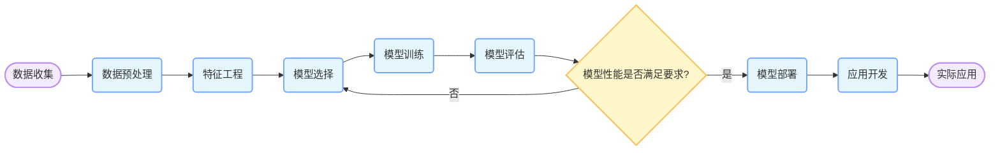

# AI编程：未来的技术趋势

> 关键词：AI编程、技术趋势、机器学习、深度学习、自然语言处理、计算机视觉、自动化编程

> 摘要：本文围绕AI编程这一前沿领域展开，深入探讨其未来的技术趋势。首先介绍了AI编程的背景信息，包括目的、预期读者、文档结构和相关术语。接着阐述了AI编程的核心概念、联系、算法原理、数学模型等基础内容。通过项目实战展示了具体的开发过程和代码实现。同时，分析了AI编程在多个实际场景中的应用。还推荐了学习资源、开发工具框架以及相关论文著作。最后总结了AI编程未来的发展趋势与挑战，并给出常见问题解答和参考资料，旨在为读者全面呈现AI编程的全貌及其未来走向。

## 1. 背景介绍 
### 1.1 目的和范围
本文章的目的在于全面且深入地探讨AI编程未来的技术趋势。随着人工智能技术的飞速发展，AI编程在各个领域的应用日益广泛，了解其未来趋势对于技术从业者、研究者以及相关行业的决策者都具有重要意义。文章的范围涵盖AI编程的核心概念、算法原理、数学模型、实际应用场景等多个方面，旨在为读者构建一个系统、完整的AI编程知识体系，帮助读者把握AI编程的发展方向。

### 1.2 预期读者
本文预期读者包括但不限于以下几类人群：
- **技术开发者**：希望深入了解AI编程技术，掌握最新的编程方法和工具，提升自己在AI领域的开发能力。
- **研究者**：对AI编程的理论和技术研究感兴趣，希望通过本文获取前沿的研究成果和发展趋势，为自己的研究提供参考。
- **企业决策者**：关注AI技术在企业中的应用和发展，希望通过了解AI编程的趋势，为企业的战略决策提供依据。
- **学生和爱好者**：对AI编程充满好奇，希望通过本文初步了解AI编程的基本概念和未来发展方向，激发学习兴趣。

### 1.3 文档结构概述
本文的结构如下：
- **核心概念与联系**：介绍AI编程的核心概念、原理和架构，通过文本示意图和Mermaid流程图进行直观展示。
- **核心算法原理 & 具体操作步骤**：详细讲解AI编程中常用的算法原理，并使用Python源代码进行阐述。
- **数学模型和公式 & 详细讲解 & 举例说明**：介绍AI编程中的数学模型和公式，并通过具体例子进行详细讲解。
- **项目实战：代码实际案例和详细解释说明**：通过一个具体的项目实战，展示AI编程的开发过程，包括开发环境搭建、源代码实现和代码解读。
- **实际应用场景**：分析AI编程在不同领域的实际应用场景。
- **工具和资源推荐**：推荐学习资源、开发工具框架以及相关论文著作。
- **总结：未来发展趋势与挑战**：总结AI编程未来的发展趋势和面临的挑战。
- **附录：常见问题与解答**：解答读者在学习和实践AI编程过程中常见的问题。
- **扩展阅读 & 参考资料**：提供相关的扩展阅读材料和参考资料。

### 1.4 术语表
#### 1.4.1 核心术语定义
- **AI编程**：指利用人工智能技术进行编程的过程，包括使用机器学习、深度学习等算法和技术来开发智能软件和系统。
- **机器学习**：是一门多领域交叉学科，涉及概率论、统计学、逼近论、凸分析、算法复杂度理论等多门学科。它专门研究计算机怎样模拟或实现人类的学习行为，以获取新的知识或技能，重新组织已有的知识结构使之不断改善自身的性能。
- **深度学习**：是机器学习的一个分支领域，它是一种基于对数据进行表征学习的方法。深度学习通过构建具有很多层的神经网络模型，自动从大量数据中学习特征和模式。
- **自然语言处理**：是计算机科学与语言学的交叉领域，旨在让计算机能够理解、处理和生成人类语言。
- **计算机视觉**：是一门研究如何使机器“看”的科学，即给计算机装备上图像或视频输入设备，让计算机像人一样对目标进行识别、跟踪和测量等。

#### 1.4.2 相关概念解释
- **神经网络**：是一种模仿人类神经系统的计算模型，由大量的神经元组成。神经网络可以自动从数据中学习特征和模式，在图像识别、语音识别等领域有广泛应用。
- **监督学习**：是机器学习的一种方法，在监督学习中，模型通过学习带有标签的训练数据来进行预测。例如，在图像分类任务中，训练数据包含图像和对应的类别标签，模型通过学习这些数据来预测新图像的类别。
- **无监督学习**：与监督学习不同，无监督学习使用的训练数据没有标签。模型通过对数据的分析和聚类，发现数据中的内在结构和模式。
- **强化学习**：是一种通过智能体与环境进行交互来学习最优行为策略的机器学习方法。智能体在环境中采取行动，根据环境反馈的奖励信号来调整自己的行为策略，以最大化长期累积奖励。

#### 1.4.3 缩略词列表
- **AI**：Artificial Intelligence，人工智能
- **ML**：Machine Learning，机器学习
- **DL**：Deep Learning，深度学习
- **NLP**：Natural Language Processing，自然语言处理
- **CV**：Computer Vision，计算机视觉

## 2. 核心概念与联系 

### 2.1 核心概念原理
AI编程的核心在于利用人工智能技术来实现智能系统和软件的开发。其中，机器学习和深度学习是AI编程的重要组成部分。

机器学习的基本原理是通过对数据的学习来构建模型，从而实现对未知数据的预测和分类。其主要步骤包括数据收集、数据预处理、模型选择、模型训练和模型评估。例如，在一个简单的垃圾邮件分类任务中，首先收集大量的邮件数据，然后对数据进行预处理，如去除停用词、提取特征等。接着选择合适的分类模型，如决策树、支持向量机等，使用预处理后的数据对模型进行训练。最后，使用测试数据对训练好的模型进行评估，以确定模型的性能。

深度学习则是在机器学习的基础上发展而来，它通过构建深度神经网络来自动学习数据的特征和模式。深度神经网络由多个隐藏层组成，每个隐藏层包含多个神经元。神经元之间通过权重相互连接，权重的大小决定了神经元之间的信息传递强度。在训练过程中，深度学习模型通过反向传播算法不断调整权重，以最小化预测结果与真实标签之间的误差。

自然语言处理和计算机视觉是AI编程在不同领域的具体应用。自然语言处理的目标是让计算机能够理解和处理人类语言，包括文本分类、情感分析、机器翻译等任务。计算机视觉则致力于让计算机能够理解和处理图像和视频，如图像分类、目标检测、语义分割等任务。

### 2.2 架构的文本示意图
AI编程的架构可以分为数据层、模型层和应用层。

数据层是AI编程的基础，它包含了用于训练和测试模型的各种数据。数据可以来自不同的数据源，如数据库、文件系统、传感器等。在数据层，需要对数据进行收集、存储、管理和预处理，以确保数据的质量和可用性。

模型层是AI编程的核心，它包含了各种机器学习和深度学习模型。模型的选择和设计取决于具体的任务和数据特点。在模型层，需要对模型进行训练、评估和优化，以提高模型的性能和泛化能力。

应用层是AI编程的最终目标，它将训练好的模型应用到实际的业务场景中。应用层可以是一个Web应用、移动应用、智能硬件等。在应用层，需要将模型与具体的业务逻辑相结合，实现智能决策和自动化处理。

### 2.3 Mermaid流程图


## 3. 核心算法原理 & 具体操作步骤 

### 3.1 线性回归算法原理
线性回归是一种简单而常用的机器学习算法，用于预测连续数值。其基本原理是通过寻找一条直线（在二维空间中）或超平面（在多维空间中），使得数据点到该直线或超平面的距离之和最小。

线性回归的数学模型可以表示为：

$y = \theta_0 + \theta_1x_1 + \theta_2x_2 + \cdots + \theta_nx_n$

其中，$y$ 是预测值，$x_1, x_2, \cdots, x_n$ 是输入特征，$\theta_0, \theta_1, \cdots, \theta_n$ 是模型的参数。

为了找到最优的参数 $\theta$，通常使用最小二乘法。最小二乘法的目标是最小化预测值与真实值之间的误差平方和，即：

$J(\theta) = \frac{1}{2m}\sum_{i=1}^{m}(h_{\theta}(x^{(i)}) - y^{(i)})^2$

其中，$m$ 是样本数量，$h_{\theta}(x^{(i)})$ 是第 $i$ 个样本的预测值，$y^{(i)}$ 是第 $i$ 个样本的真实值。

### 3.2 线性回归算法的Python实现
```python
import numpy as np

class LinearRegression:
    def __init__(self):
        self.theta = None

    def fit(self, X, y):
        # 在 X 中添加一列全为 1 的列，用于表示截距
        X_b = np.c_[np.ones((X.shape[0], 1)), X]
        # 使用正规方程求解最优参数
        self.theta = np.linalg.inv(X_b.T.dot(X_b)).dot(X_b.T).dot(y)

    def predict(self, X):
        X_b = np.c_[np.ones((X.shape[0], 1)), X]
        return X_b.dot(self.theta)

# 生成一些示例数据
X = 2 * np.random.rand(100, 1)
y = 4 + 3 * X + np.random.randn(100, 1)

# 创建线性回归模型
lin_reg = LinearRegression()
# 训练模型
lin_reg.fit(X, y)
# 进行预测
X_new = np.array([[0], [2]])
y_pred = lin_reg.predict(X_new)

print("预测结果:", y_pred)
```

### 3.3 代码解释
1. **类的初始化**：在 `__init__` 方法中，初始化模型的参数 `theta` 为 `None`。
2. **模型训练**：在 `fit` 方法中，首先在输入特征矩阵 `X` 中添加一列全为 1 的列，用于表示截距。然后使用正规方程求解最优参数 `theta`。
3. **模型预测**：在 `predict` 方法中，同样在输入特征矩阵 `X` 中添加一列全为 1 的列，然后使用训练好的参数 `theta` 进行预测。
4. **示例数据生成**：使用 `np.random.rand` 生成随机的输入特征矩阵 `X`，并根据线性关系生成对应的目标值 `y`，同时添加一些随机噪声。
5. **模型训练和预测**：创建线性回归模型实例，调用 `fit` 方法进行训练，然后使用 `predict` 方法对新的数据进行预测。

### 3.4 逻辑回归算法原理
逻辑回归是一种用于分类的机器学习算法，主要用于二分类问题。它通过逻辑函数（也称为 Sigmoid 函数）将线性回归的输出映射到 $[0, 1]$ 之间的概率值。

逻辑函数的定义为：

$\sigma(z) = \frac{1}{1 + e^{-z}}$

其中，$z$ 是线性回归的输出。

逻辑回归的目标是找到一组参数 $\theta$，使得对于每个样本 $x$，其预测的概率 $\hat{y} = \sigma(\theta^T x)$ 尽可能接近真实标签 $y$。通常使用对数损失函数（也称为交叉熵损失函数）来衡量预测概率与真实标签之间的差异：

$J(\theta) = -\frac{1}{m}\sum_{i=1}^{m}[y^{(i)}\log(\hat{y}^{(i)}) + (1 - y^{(i)})\log(1 - \hat{y}^{(i)})]$

其中，$m$ 是样本数量，$y^{(i)}$ 是第 $i$ 个样本的真实标签，$\hat{y}^{(i)}$ 是第 $i$ 个样本的预测概率。

### 3.5 逻辑回归算法的Python实现
```python
import numpy as np

class LogisticRegression:
    def __init__(self, learning_rate=0.01, num_iterations=1000):
        self.learning_rate = learning_rate
        self.num_iterations = num_iterations
        self.weights = None
        self.bias = None

    def sigmoid(self, z):
        return 1 / (1 + np.exp(-z))

    def fit(self, X, y):
        num_samples, num_features = X.shape
        self.weights = np.zeros((num_features, 1))
        self.bias = 0

        for _ in range(self.num_iterations):
            linear_model = np.dot(X, self.weights) + self.bias
            y_pred = self.sigmoid(linear_model)

            dw = (1 / num_samples) * np.dot(X.T, (y_pred - y))
            db = (1 / num_samples) * np.sum(y_pred - y)

            self.weights -= self.learning_rate * dw
            self.bias -= self.learning_rate * db

    def predict(self, X):
        linear_model = np.dot(X, self.weights) + self.bias
        y_pred = self.sigmoid(linear_model)
        y_pred_cls = [1 if i > 0.5 else 0 for i in y_pred]
        return np.array(y_pred_cls)

# 生成一些示例数据
X = np.array([[0.5, 1.5], [1, 1], [1.5, 0.5], [3, 0.5], [2, 2], [1, 2.5]])
y = np.array([[0], [0], [0], [1], [1], [1]])

# 创建逻辑回归模型
log_reg = LogisticRegression()
# 训练模型
log_reg.fit(X, y)
# 进行预测
y_pred = log_reg.predict(X)

print("预测结果:", y_pred)
```

### 3.6 代码解释
1. **类的初始化**：在 `__init__` 方法中，初始化学习率 `learning_rate`、迭代次数 `num_iterations`、权重 `weights` 和偏置 `bias`。
2. **Sigmoid 函数**：在 `sigmoid` 方法中，实现 Sigmoid 函数，将线性回归的输出映射到 $[0, 1]$ 之间的概率值。
3. **模型训练**：在 `fit` 方法中，首先初始化权重和偏置。然后进行多次迭代，每次迭代计算线性模型的输出，通过 Sigmoid 函数得到预测概率。接着计算权重和偏置的梯度，并使用梯度下降法更新权重和偏置。
4. **模型预测**：在 `predict` 方法中，计算线性模型的输出，通过 Sigmoid 函数得到预测概率。根据预测概率是否大于 0.5，将其转换为 0 或 1 的类别标签。
5. **示例数据生成**：手动生成一些示例数据 `X` 和对应的标签 `y`。
6. **模型训练和预测**：创建逻辑回归模型实例，调用 `fit` 方法进行训练，然后使用 `predict` 方法对数据进行预测。

## 4. 数学模型和公式 & 详细讲解 & 举例说明 

### 4.1 线性回归的数学模型和公式
线性回归的数学模型为：

$y = \theta_0 + \theta_1x_1 + \theta_2x_2 + \cdots + \theta_nx_n$

可以用矩阵形式表示为：

$y = X\theta$

其中，$y$ 是 $m \times 1$ 的向量，包含 $m$ 个样本的目标值；$X$ 是 $m \times (n + 1)$ 的矩阵，包含 $m$ 个样本的特征值，第一列全为 1 表示截距；$\theta$ 是 $(n + 1) \times 1$ 的向量，包含模型的参数。

最小二乘法的目标是最小化误差平方和：

$J(\theta) = \frac{1}{2m}\sum_{i=1}^{m}(h_{\theta}(x^{(i)}) - y^{(i)})^2 = \frac{1}{2m}(X\theta - y)^T(X\theta - y)$

为了找到最优的参数 $\theta$，对 $J(\theta)$ 求关于 $\theta$ 的偏导数，并令其等于 0：

$\frac{\partial J(\theta)}{\partial \theta} = \frac{1}{m}X^T(X\theta - y) = 0$

解得：

$\theta = (X^TX)^{-1}X^Ty$

这就是正规方程的解。

### 4.2 举例说明
假设我们有以下数据集：

| $x$ | $y$ |
| --- | --- |
| 1 | 2 |
| 2 | 4 |
| 3 | 6 |

我们可以将其表示为矩阵形式：

$X = \begin{bmatrix} 1 & 1 \\ 1 & 2 \\ 1 & 3 \end{bmatrix}$，$y = \begin{bmatrix} 2 \\ 4 \\ 6 \end{bmatrix}$

根据正规方程求解参数 $\theta$：

$X^TX = \begin{bmatrix} 1 & 1 & 1 \\ 1 & 2 & 3 \end{bmatrix}\begin{bmatrix} 1 & 1 \\ 1 & 2 \\ 1 & 3 \end{bmatrix} = \begin{bmatrix} 3 & 6 \\ 6 & 14 \end{bmatrix}$

$(X^TX)^{-1} = \frac{1}{3 \times 14 - 6 \times 6}\begin{bmatrix} 14 & -6 \\ -6 & 3 \end{bmatrix} = \begin{bmatrix} \frac{7}{3} & -1 \\ -1 & \frac{1}{2} \end{bmatrix}$

$X^Ty = \begin{bmatrix} 1 & 1 & 1 \\ 1 & 2 & 3 \end{bmatrix}\begin{bmatrix} 2 \\ 4 \\ 6 \end{bmatrix} = \begin{bmatrix} 12 \\ 28 \end{bmatrix}$

$\theta = (X^TX)^{-1}X^Ty = \begin{bmatrix} \frac{7}{3} & -1 \\ -1 & \frac{1}{2} \end{bmatrix}\begin{bmatrix} 12 \\ 28 \end{bmatrix} = \begin{bmatrix} 0 \\ 2 \end{bmatrix}$

所以，线性回归模型为 $y = 0 + 2x$，这与我们直观的观察是一致的。

### 4.3 逻辑回归的数学模型和公式
逻辑回归的数学模型为：

$\hat{y} = \sigma(\theta^T x)$

其中，$\sigma(z) = \frac{1}{1 + e^{-z}}$ 是 Sigmoid 函数。

对数损失函数为：

$J(\theta) = -\frac{1}{m}\sum_{i=1}^{m}[y^{(i)}\log(\hat{y}^{(i)}) + (1 - y^{(i)})\log(1 - \hat{y}^{(i)})]$

为了最小化对数损失函数，使用梯度下降法更新参数 $\theta$。梯度下降法的更新公式为：

$\theta_j := \theta_j - \alpha\frac{\partial J(\theta)}{\partial \theta_j}$

其中，$\alpha$ 是学习率，$\frac{\partial J(\theta)}{\partial \theta_j}$ 是 $J(\theta)$ 关于 $\theta_j$ 的偏导数。

对于逻辑回归，$\frac{\partial J(\theta)}{\partial \theta_j} = \frac{1}{m}\sum_{i=1}^{m}(\hat{y}^{(i)} - y^{(i)})x_j^{(i)}$

### 4.4 举例说明
假设我们有以下数据集：

| $x_1$ | $x_2$ | $y$ |
| --- | --- | --- |
| 0 | 0 | 0 |
| 0 | 1 | 0 |
| 1 | 0 | 0 |
| 1 | 1 | 1 |

我们可以使用逻辑回归模型来对这些数据进行分类。首先，初始化参数 $\theta = [0, 0, 0]$（包括截距）。然后，使用梯度下降法进行迭代更新。

在每次迭代中，计算预测概率 $\hat{y}$，并根据对数损失函数的梯度更新参数 $\theta$。经过多次迭代后，模型会收敛到一个最优的参数值，使得对数损失函数最小。

## 5. 项目实战：代码实际案例和详细解释说明 

### 5.1  开发环境搭建
#### 5.1.1 安装Python
首先，确保你已经安装了Python。可以从Python官方网站（https://www.python.org/downloads/） 下载并安装适合你操作系统的Python版本。建议安装Python 3.7及以上版本。

#### 5.1.2 安装必要的库
在项目中，我们将使用以下几个常用的Python库：
- **NumPy**：用于数值计算和数组操作。
- **Pandas**：用于数据处理和分析。
- **Scikit-learn**：提供了丰富的机器学习算法和工具。
- **Matplotlib**：用于数据可视化。

可以使用以下命令来安装这些库：
```sh
pip install numpy pandas scikit-learn matplotlib
```

### 5.2  源代码详细实现和代码解读
#### 5.2.1 项目背景
我们将使用鸢尾花数据集进行分类任务。鸢尾花数据集是一个经典的机器学习数据集，包含了 150 个样本，分为 3 个类别（Setosa、Versicolour 和 Virginica），每个样本有 4 个特征（花萼长度、花萼宽度、花瓣长度、花瓣宽度）。

#### 5.2.2 代码实现
```python
import numpy as np
import pandas as pd
from sklearn.datasets import load_iris
from sklearn.model_selection import train_test_split
from sklearn.preprocessing import StandardScaler
from sklearn.linear_model import LogisticRegression
from sklearn.metrics import accuracy_score
import matplotlib.pyplot as plt

# 加载鸢尾花数据集
iris = load_iris()
X = iris.data
y = iris.target

# 划分训练集和测试集
X_train, X_test, y_train, y_test = train_test_split(X, y, test_size=0.2, random_state=42)

# 数据标准化
scaler = StandardScaler()
X_train = scaler.fit_transform(X_train)
X_test = scaler.transform(X_test)

# 创建逻辑回归模型
model = LogisticRegression()

# 训练模型
model.fit(X_train, y_train)

# 进行预测
y_pred = model.predict(X_test)

# 计算准确率
accuracy = accuracy_score(y_test, y_pred)
print("准确率:", accuracy)

# 可视化特征重要性
feature_importance = model.coef_[0]
feature_names = iris.feature_names
plt.bar(feature_names, feature_importance)
plt.xlabel('特征')
plt.ylabel('重要性')
plt.title('特征重要性')
plt.show()
```

### 5.3  代码解读与分析
#### 5.3.1 数据加载和划分
- `load_iris()` 函数用于加载鸢尾花数据集。
- `train_test_split()` 函数将数据集划分为训练集和测试集，`test_size=0.2` 表示测试集占总数据集的 20%，`random_state=42` 用于确保每次划分的结果相同。

#### 5.3.2 数据标准化
- `StandardScaler()` 用于对数据进行标准化处理，使得每个特征的均值为 0，标准差为 1。标准化可以提高模型的训练效率和性能。

#### 5.3.3 模型创建和训练
- `LogisticRegression()` 创建一个逻辑回归模型实例。
- `model.fit(X_train, y_train)` 使用训练集数据对模型进行训练。

#### 5.3.4 模型预测和评估
- `model.predict(X_test)` 使用训练好的模型对测试集数据进行预测。
- `accuracy_score(y_test, y_pred)` 计算预测结果的准确率。

#### 5.3.5 特征重要性可视化
- `model.coef_[0]` 获取模型的系数，系数的绝对值越大表示该特征对分类结果的影响越大。
- `plt.bar()` 函数用于绘制柱状图，展示每个特征的重要性。

## 6. 实际应用场景 
### 6.1 医疗领域
- **疾病诊断**：AI编程可以利用机器学习和深度学习算法，对医学影像（如X光、CT、MRI等）进行分析，辅助医生进行疾病的诊断。例如，通过训练深度神经网络模型，可以识别出肺部的肿瘤、心脏疾病等。
- **药物研发**：AI编程可以帮助筛选和设计新的药物分子。通过对大量的生物数据和化学数据进行分析，预测药物的活性和副作用，加速药物研发的进程。
- **医疗管理**：利用AI编程可以优化医院的资源分配，如病床管理、手术排班等。通过对患者数据和医疗资源的分析，提高医院的运营效率和服务质量。

### 6.2 金融领域
- **风险评估**：银行和金融机构可以使用AI编程来评估客户的信用风险。通过对客户的个人信息、信用记录、财务状况等数据进行分析，预测客户的违约概率，从而做出合理的信贷决策。
- **投资决策**：AI编程可以帮助投资者分析市场趋势和股票走势。通过对大量的金融数据和新闻信息进行分析，预测股票的价格波动，为投资者提供投资建议。
- **欺诈检测**：金融机构可以利用AI编程来检测信用卡欺诈、洗钱等金融犯罪行为。通过对交易数据的实时分析，识别出异常的交易模式，及时采取措施防范风险。

### 6.3 交通领域
- **自动驾驶**：AI编程是自动驾驶技术的核心。通过使用计算机视觉、传感器融合、机器学习等技术，让汽车能够感知周围环境、做出决策并控制车辆的行驶。自动驾驶技术可以提高交通安全、减少交通拥堵。
- **智能交通管理**：利用AI编程可以对交通流量进行实时监测和预测，优化交通信号灯的控制策略，提高道路的通行效率。例如，通过分析交通数据，动态调整信号灯的时长，减少车辆的等待时间。
- **物流配送**：AI编程可以优化物流配送路线，提高配送效率。通过对订单信息、车辆信息、路况信息等数据进行分析，规划出最优的配送路线，减少配送时间和成本。

### 6.4 教育领域
- **个性化学习**：AI编程可以根据学生的学习进度、学习能力和兴趣爱好，为学生提供个性化的学习方案。例如，通过对学生的作业、考试成绩等数据进行分析，推荐适合学生的学习资源和练习题目。
- **智能辅导**：利用AI编程可以开发智能辅导系统，为学生提供实时的辅导和答疑。智能辅导系统可以根据学生的问题，自动生成解答思路和解决方案，帮助学生提高学习效果。
- **教育评估**：AI编程可以对学生的学习成果进行全面、客观的评估。通过对学生的课堂表现、作业、考试等数据进行分析，评估学生的学习能力和知识掌握程度，为教师提供教学反馈。

### 6.5 娱乐领域
- **游戏开发**：AI编程可以用于游戏中的角色行为控制、游戏难度调整、游戏剧情生成等。例如，在角色扮演游戏中，使用AI算法控制游戏角色的行为，使其表现得更加智能和真实。
- **内容推荐**：娱乐平台可以利用AI编程为用户推荐个性化的内容。通过对用户的历史行为数据（如观看记录、收藏记录等）进行分析，预测用户的兴趣偏好，推荐符合用户口味的电影、音乐、视频等内容。
- **虚拟偶像**：AI编程可以创建虚拟偶像，实现虚拟偶像的形象设计、动作表演、语音交互等功能。虚拟偶像可以在直播、演唱会等场景中与用户进行互动，为用户带来全新的娱乐体验。

## 7. 工具和资源推荐
### 7.1 学习资源推荐
#### 7.1.1 书籍推荐
- 《机器学习》（周志华）：该书全面介绍了机器学习的基本概念、算法和应用，是机器学习领域的经典教材。
- 《深度学习》（Ian Goodfellow、Yoshua Bengio、Aaron Courville）：由深度学习领域的三位先驱撰写，系统地介绍了深度学习的理论和实践。
- 《Python机器学习实战》（Sebastian Raschka）：通过实际的案例，介绍了如何使用Python进行机器学习的开发，适合初学者入门。

#### 7.1.2 在线课程
- **Coursera上的《机器学习》课程**：由斯坦福大学的Andrew Ng教授授课，是机器学习领域最受欢迎的在线课程之一。
- **edX上的《深度学习微硕士学位项目》**：提供了深度学习的系统学习路径，包括多个课程和实践项目。
- **Udemy上的《Python for Data Science and Machine Learning Bootcamp》**：该课程详细介绍了如何使用Python进行数据科学和机器学习的开发。

#### 7.1.3 技术博客和网站
- **Medium**：是一个技术博客平台，上面有很多关于AI编程的优质文章和教程。
- **Towards Data Science**：专注于数据科学和机器学习领域，提供了大量的技术文章、案例分析和实践经验分享。
- **OpenAI Blog**：OpenAI官方博客，分享了关于人工智能领域的最新研究成果和技术进展。

### 7.2 开发工具框架推荐
#### 7.2.1 IDE和编辑器
- **PyCharm**：是一款专业的Python集成开发环境，提供了丰富的功能和插件，适合大规模的Python项目开发。
- **Jupyter Notebook**：是一个交互式的开发环境，适合数据探索、模型实验和代码演示。
- **Visual Studio Code**：是一款轻量级的代码编辑器，支持多种编程语言和插件，具有良好的扩展性。

#### 7.2.2 调试和性能分析工具
- **pdb**：是Python内置的调试器，可以帮助开发者调试代码，查找和解决问题。
- **TensorBoard**：是TensorFlow提供的可视化工具，可以用于查看模型的训练过程、损失函数变化、模型结构等信息。
- **cProfile**：是Python的性能分析工具，可以帮助开发者分析代码的性能瓶颈，优化代码。

#### 7.2.3 相关框架和库
- **TensorFlow**：是Google开发的开源深度学习框架，提供了丰富的工具和接口，支持分布式训练和部署。
- **PyTorch**：是Facebook开发的开源深度学习框架，具有动态图的优势，适合快速原型开发和研究。
- **Scikit-learn**：是一个简单易用的机器学习库，提供了多种机器学习算法和工具，适合初学者和快速开发。

### 7.3 相关论文著作推荐
#### 7.3.1 经典论文
- **《Gradient-based learning applied to document recognition》**：由Yann LeCun等人发表，介绍了卷积神经网络（CNN）在手写数字识别中的应用，是CNN领域的经典论文。
- **《Long Short-Term Memory》**：由Sepp Hochreiter和Jürgen Schmidhuber发表，提出了长短期记忆网络（LSTM），解决了循环神经网络（RNN）中的梯度消失问题。
- **《Attention Is All You Need》**：由Vaswani等人发表，提出了Transformer模型，是自然语言处理领域的重要突破。

#### 7.3.2 最新研究成果
- **arXiv**：是一个预印本平台，上面有很多关于AI编程的最新研究成果和论文。
- **NeurIPS**：是神经信息处理系统大会，是人工智能领域的顶级学术会议，每年会发表很多高质量的研究论文。
- **ICML**：是国际机器学习会议，也是人工智能领域的重要学术会议，关注机器学习的理论和应用研究。

#### 7.3.3 应用案例分析
- **Kaggle**：是一个数据科学竞赛平台，上面有很多实际的应用案例和数据集。通过参与Kaggle竞赛，可以学习到不同领域的AI编程应用和解决问题的方法。
- **AI Trends**：是一个关注人工智能行业动态和应用案例的网站，提供了很多实际的AI应用案例和分析报告。

## 8. 总结：未来发展趋势与挑战
### 8.1 未来发展趋势
#### 8.1.1 自动化编程
随着AI技术的发展，自动化编程将成为未来的一个重要趋势。AI可以根据用户的需求自动生成代码，大大提高编程效率。例如，一些智能代码补全工具已经可以根据上下文自动预测和补全代码，未来的自动化编程系统可能会更加智能和强大。

#### 8.1.2 跨领域融合
AI编程将与其他领域进行更深入的融合，如生物学、物理学、天文学等。通过跨领域的合作，可以解决一些复杂的科学问题和实际应用问题。例如，在生物学中，AI编程可以用于基因序列分析、蛋白质结构预测等；在天文学中，AI编程可以用于天体图像识别、星系演化模拟等。

#### 8.1.3 边缘计算与AI
随着物联网的发展，边缘计算与AI的结合将越来越紧密。边缘设备（如传感器、摄像头等）可以在本地进行AI计算，减少数据传输延迟，提高系统的实时性和可靠性。例如，在智能交通系统中，路边的摄像头可以在本地进行目标检测和识别，将处理结果直接反馈给交通控制系统，而不需要将大量的图像数据传输到云端进行处理。

#### 8.1.4 量子计算与AI
量子计算的发展将为AI编程带来新的机遇。量子计算机具有强大的计算能力，可以加速一些复杂的AI算法的计算过程。例如，在深度学习中，量子计算可以用于快速训练大规模的神经网络模型，提高模型的性能和效率。

### 8.2 挑战
#### 8.2.1 数据隐私和安全
随着AI编程的广泛应用，数据隐私和安全问题变得越来越重要。AI系统通常需要大量的数据来进行训练，这些数据可能包含用户的个人信息和敏感信息。如果这些数据被泄露或滥用，将给用户带来严重的损失。因此，如何保护数据的隐私和安全是AI编程面临的一个重要挑战。

#### 8.2.2 算法可解释性
许多AI算法（如深度学习模型）是黑盒模型，其决策过程难以解释。在一些关键领域（如医疗、金融等），算法的可解释性非常重要。例如，在医疗诊断中，医生需要了解AI系统做出诊断的依据，以便做出合理的决策。因此，如何提高AI算法的可解释性是当前研究的一个热点问题。

#### 8.2.3 人才短缺
AI编程是一个新兴的领域，需要具备多学科知识和技能的人才。目前，市场上对AI编程人才的需求远远超过了供给，人才短缺是制约AI编程发展的一个重要因素。因此，如何培养更多的AI编程人才是未来需要解决的一个重要问题。

#### 8.2.4 伦理和社会影响
AI编程的发展将对社会产生深远的影响，如就业结构的变化、社会公平性等。例如，一些重复性的工作可能会被AI系统取代，导致部分人员失业。因此，如何应对AI编程带来的伦理和社会影响是一个需要认真思考的问题。

## 9. 附录：常见问题与解答
### 9.1 什么是AI编程？
AI编程是指利用人工智能技术进行编程的过程，包括使用机器学习、深度学习等算法和技术来开发智能软件和系统。AI编程的目标是让计算机能够模拟人类的智能行为，如学习、推理、决策等。

### 9.2 AI编程和传统编程有什么区别？
传统编程通常是基于规则和逻辑的，程序员需要明确地定义程序的行为和步骤。而AI编程则是基于数据和模型的，程序通过学习大量的数据来自动发现规律和模式，从而实现智能行为。AI编程更加灵活和自适应，但也需要更多的数据和计算资源。

### 9.3 学习AI编程需要具备哪些基础知识？
学习AI编程需要具备一定的数学基础，如线性代数、概率论、统计学等。同时，还需要掌握一门编程语言，如Python。此外，了解机器学习和深度学习的基本概念和算法也是必要的。

### 9.4 如何选择合适的AI算法？
选择合适的AI算法需要考虑多个因素，如问题的类型（分类、回归、聚类等）、数据的特点（数据量、维度、分布等）、计算资源的限制等。一般来说，可以先尝试一些简单的算法，如线性回归、逻辑回归等，然后根据实验结果选择更复杂的算法。

### 9.5 AI编程的发展前景如何？
AI编程的发展前景非常广阔。随着人工智能技术的不断发展，AI编程将在各个领域得到更广泛的应用，如医疗、金融、交通、教育等。同时，AI编程也将带来新的商业机会和就业岗位。因此，学习和掌握AI编程技术将具有重要的意义。

## 10. 扩展阅读 & 参考资料
### 10.1 扩展阅读
- 《AI未来进行式》（李开复、王咏刚）：该书介绍了AI在各个领域的应用和发展趋势，以及AI对社会和人类的影响。
- 《智能时代》（吴军）：探讨了AI技术的发展对人类社会的变革和影响，以及未来的发展方向。
- 《AI 3.0》（梅拉妮·米歇尔）：介绍了AI的发展历程、现状和未来挑战，对AI的本质和局限性进行了深入思考。

### 10.2 参考资料
- **Python官方文档**：https://docs.python.org/3/
- **TensorFlow官方文档**：https://www.tensorflow.org/api_docs
- **PyTorch官方文档**：https://pytorch.org/docs/stable/
- **Scikit-learn官方文档**：https://scikit-learn.org/stable/documentation.html