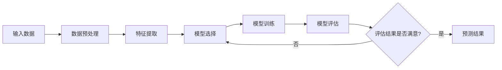

# AI编程：程序员的职业新方向

> 关键词：AI编程、程序员职业发展、人工智能算法、代码实现、应用场景

> 摘要：本文聚焦于AI编程这一程序员的职业新方向。首先介绍了文章的背景，包括目的、预期读者、文档结构和相关术语。接着阐述了AI编程的核心概念、算法原理、数学模型。通过项目实战展示了代码的实际案例和详细解释。分析了AI编程的实际应用场景，推荐了学习资源、开发工具和相关论文。最后总结了AI编程的未来发展趋势与挑战，并提供了常见问题解答和扩展阅读参考资料，旨在为程序员了解和进入AI编程领域提供全面且深入的指导。

## 1. 背景介绍 
### 1.1 目的和范围
随着人工智能技术的飞速发展，AI编程逐渐成为程序员职业发展的热门方向。本文的目的在于全面介绍AI编程，帮助程序员了解AI编程的核心概念、算法原理、实际应用等方面的知识，为他们探索这一职业新方向提供详细的指导。范围涵盖了AI编程的基础理论、代码实现、实际应用场景，以及相关的学习资源和未来发展趋势。

### 1.2 预期读者
本文主要面向有一定编程基础，希望拓展职业领域，进入AI编程领域的程序员。同时，对于对人工智能技术感兴趣，想要了解AI编程具体内容的技术爱好者也具有一定的参考价值。

### 1.3 文档结构概述
本文首先介绍背景信息，包括目的、读者和文档结构。接着阐述AI编程的核心概念与联系，包括原理和架构的示意图及流程图。然后详细讲解核心算法原理和具体操作步骤，并给出Python源代码。随后介绍数学模型和公式，并举例说明。通过项目实战展示代码的实际应用和详细解读。分析AI编程的实际应用场景，推荐相关的学习资源、开发工具和论文著作。最后总结未来发展趋势与挑战，提供常见问题解答和扩展阅读参考资料。

### 1.4 术语表
#### 1.4.1 核心术语定义
- **AI编程**：即人工智能编程，是指利用编程语言和相关工具，实现人工智能算法和模型，以解决各种实际问题的过程。
- **机器学习**：是AI编程中的一个重要领域，它让计算机通过数据学习模式和规律，从而进行预测和决策。
- **深度学习**：是机器学习的一个分支，基于人工神经网络，通过多层神经网络对数据进行特征提取和学习。
- **神经网络**：是一种模仿人类神经系统的计算模型，由大量的神经元组成，用于处理和分析数据。

#### 1.4.2 相关概念解释
- **数据预处理**：在将数据输入到AI模型之前，对数据进行清洗、转换、归一化等操作，以提高数据质量和模型性能。
- **模型训练**：使用训练数据对AI模型进行参数调整，使模型能够学习到数据中的模式和规律。
- **模型评估**：使用测试数据对训练好的模型进行评估，衡量模型的性能和准确性。

#### 1.4.3 缩略词列表
- **ML**：Machine Learning，机器学习
- **DL**：Deep Learning，深度学习
- **ANN**：Artificial Neural Network，人工神经网络
- **CNN**：Convolutional Neural Network，卷积神经网络
- **RNN**：Recurrent Neural Network，循环神经网络

## 2. 核心概念与联系 

### 核心概念原理
AI编程的核心在于利用算法和模型让计算机模拟人类的智能行为。机器学习是AI编程的重要组成部分，它通过对大量数据的学习来发现模式和规律。深度学习则是机器学习的一种更高级形式，它使用多层神经网络来自动提取数据的特征。

神经网络是深度学习的基础，它由输入层、隐藏层和输出层组成。输入层接收数据，隐藏层对数据进行处理和转换，输出层给出最终的结果。神经元是神经网络的基本单元，它接收输入信号，经过加权求和和激活函数处理后输出结果。

### 架构的文本示意图
```plaintext
输入数据 -> 数据预处理 -> 特征提取 -> 模型选择 -> 模型训练 -> 模型评估 -> 预测结果
```

### Mermaid流程图


## 3. 核心算法原理 & 具体操作步骤 

### 线性回归算法原理
线性回归是一种简单而常用的机器学习算法，用于建立自变量和因变量之间的线性关系。其数学模型可以表示为：

$$y = \theta_0 + \theta_1x_1 + \theta_2x_2 + \cdots + \theta_nx_n + \epsilon$$

其中，$y$ 是因变量，$x_1, x_2, \cdots, x_n$ 是自变量，$\theta_0, \theta_1, \theta_2, \cdots, \theta_n$ 是模型的参数，$\epsilon$ 是误差项。

线性回归的目标是找到一组最优的参数 $\theta$，使得预测值与真实值之间的误差最小。通常使用最小二乘法来求解最优参数，即最小化误差平方和：

$$J(\theta) = \frac{1}{2m}\sum_{i=1}^{m}(h_{\theta}(x^{(i)}) - y^{(i)})^2$$

其中，$m$ 是样本数量，$h_{\theta}(x^{(i)})$ 是第 $i$ 个样本的预测值，$y^{(i)}$ 是第 $i$ 个样本的真实值。

### 具体操作步骤
1. **数据准备**：收集和整理数据集，将其分为训练集和测试集。
2. **模型初始化**：初始化模型的参数 $\theta$。
3. **模型训练**：使用训练集对模型进行训练，通过迭代更新参数 $\theta$，使得损失函数 $J(\theta)$ 最小化。
4. **模型评估**：使用测试集对训练好的模型进行评估，计算评估指标，如均方误差（MSE）、决定系数（$R^2$）等。
5. **预测**：使用训练好的模型对新的数据进行预测。

### Python源代码实现
```python
import numpy as np
from sklearn.model_selection import train_test_split
from sklearn.linear_model import LinearRegression
from sklearn.metrics import mean_squared_error, r2_score

# 生成示例数据
np.random.seed(0)
X = 2 * np.random.rand(100, 1)
y = 4 + 3 * X + np.random.randn(100, 1)

# 划分训练集和测试集
X_train, X_test, y_train, y_test = train_test_split(X, y, test_size=0.2, random_state=42)

# 初始化线性回归模型
model = LinearRegression()

# 模型训练
model.fit(X_train, y_train)

# 模型预测
y_pred = model.predict(X_test)

# 模型评估
mse = mean_squared_error(y_test, y_pred)
r2 = r2_score(y_test, y_pred)

print(f"均方误差 (MSE): {mse}")
print(f"决定系数 (R^2): {r2}")
```

### 代码解释
1. **数据生成**：使用 `np.random.rand` 生成自变量 $X$，并根据线性关系生成因变量 $y$，同时添加一些随机噪声。
2. **数据划分**：使用 `train_test_split` 函数将数据集划分为训练集和测试集，测试集占比为 20%。
3. **模型初始化**：使用 `LinearRegression` 初始化线性回归模型。
4. **模型训练**：使用 `fit` 方法对模型进行训练，传入训练集的自变量和因变量。
5. **模型预测**：使用 `predict` 方法对测试集进行预测，得到预测结果。
6. **模型评估**：使用 `mean_squared_error` 和 `r2_score` 函数计算均方误差和决定系数，评估模型的性能。

## 4. 数学模型和公式 & 详细讲解 & 举例说明 

### 线性回归的数学模型
线性回归的数学模型可以表示为：

$$y = \theta_0 + \theta_1x_1 + \theta_2x_2 + \cdots + \theta_nx_n + \epsilon$$

其中，$y$ 是因变量，$x_1, x_2, \cdots, x_n$ 是自变量，$\theta_0, \theta_1, \theta_2, \cdots, \theta_n$ 是模型的参数，$\epsilon$ 是误差项。

### 最小二乘法原理
最小二乘法的目标是找到一组最优的参数 $\theta$，使得预测值与真实值之间的误差最小。误差平方和可以表示为：

$$J(\theta) = \frac{1}{2m}\sum_{i=1}^{m}(h_{\theta}(x^{(i)}) - y^{(i)})^2$$

其中，$m$ 是样本数量，$h_{\theta}(x^{(i)})$ 是第 $i$ 个样本的预测值，$y^{(i)}$ 是第 $i$ 个样本的真实值。

为了找到最优的参数 $\theta$，我们需要对损失函数 $J(\theta)$ 求偏导数，并令其等于 0：

$$\frac{\partial J(\theta)}{\partial \theta_j} = \frac{1}{m}\sum_{i=1}^{m}(h_{\theta}(x^{(i)}) - y^{(i)})x_j^{(i)} = 0$$

通过求解上述方程组，可以得到最优的参数 $\theta$。

### 举例说明
假设我们有一个简单的线性回归问题，自变量 $x$ 和因变量 $y$ 的关系如下：

| $x$ | $y$ |
| --- | --- |
| 1   | 3   |
| 2   | 5   |
| 3   | 7   |

我们可以使用最小二乘法来求解模型的参数 $\theta_0$ 和 $\theta_1$。

首先，计算预测值 $h_{\theta}(x)$：

$$h_{\theta}(x) = \theta_0 + \theta_1x$$

然后，计算误差平方和 $J(\theta)$：

$$J(\theta) = \frac{1}{2 \times 3}[(h_{\theta}(1) - 3)^2 + (h_{\theta}(2) - 5)^2 + (h_{\theta}(3) - 7)^2]$$

对 $J(\theta)$ 求偏导数，并令其等于 0：

$$\frac{\partial J(\theta)}{\partial \theta_0} = \frac{1}{3}[(h_{\theta}(1) - 3) + (h_{\theta}(2) - 5) + (h_{\theta}(3) - 7)] = 0$$

$$\frac{\partial J(\theta)}{\partial \theta_1} = \frac{1}{3}[(h_{\theta}(1) - 3) \times 1 + (h_{\theta}(2) - 5) \times 2 + (h_{\theta}(3) - 7) \times 3] = 0$$

解上述方程组，可以得到 $\theta_0 = 1$，$\theta_1 = 2$。

因此，线性回归模型为：

$$y = 1 + 2x$$

## 5. 项目实战：代码实际案例和详细解释说明 

### 5.1  开发环境搭建
- **Python环境**：建议使用 Python 3.7 及以上版本。可以从 Python 官方网站（https://www.python.org/downloads/）下载并安装。
- **开发工具**：推荐使用 PyCharm 或 Jupyter Notebook。PyCharm 是一款功能强大的 Python 集成开发环境，Jupyter Notebook 则适合进行交互式编程和数据分析。
- **相关库安装**：使用 `pip` 安装必要的库，如 `numpy`、`pandas`、`scikit-learn`、`tensorflow` 等。

```bash
pip install numpy pandas scikit-learn tensorflow
```

### 5.2  源代码详细实现和代码解读
#### 项目描述
我们将实现一个简单的手写数字识别项目，使用 MNIST 数据集。MNIST 数据集包含 60,000 个训练样本和 10,000 个测试样本，每个样本是一个 28x28 像素的手写数字图像。

#### 代码实现
```python
import tensorflow as tf
from tensorflow.keras.datasets import mnist
from tensorflow.keras.models import Sequential
from tensorflow.keras.layers import Flatten, Dense
from tensorflow.keras.utils import to_categorical
import matplotlib.pyplot as plt

# 加载 MNIST 数据集
(train_images, train_labels), (test_images, test_labels) = mnist.load_data()

# 数据预处理
train_images = train_images / 255.0
test_images = test_images / 255.0

train_labels = to_categorical(train_labels)
test_labels = to_categorical(test_labels)

# 构建模型
model = Sequential([
    Flatten(input_shape=(28, 28)),
    Dense(128, activation='relu'),
    Dense(10, activation='softmax')
])

# 编译模型
model.compile(optimizer='adam',
              loss='categorical_crossentropy',
              metrics=['accuracy'])

# 训练模型
history = model.fit(train_images, train_labels, epochs=5, validation_data=(test_images, test_labels))

# 评估模型
test_loss, test_acc = model.evaluate(test_images, test_labels)
print(f"测试集损失: {test_loss}")
print(f"测试集准确率: {test_acc}")

# 可视化训练过程
plt.plot(history.history['accuracy'])
plt.plot(history.history['val_accuracy'])
plt.title('Model accuracy')
plt.ylabel('Accuracy')
plt.xlabel('Epoch')
plt.legend(['Train', 'Test'], loc='upper left')
plt.show()

plt.plot(history.history['loss'])
plt.plot(history.history['val_loss'])
plt.title('Model loss')
plt.ylabel('Loss')
plt.xlabel('Epoch')
plt.legend(['Train', 'Test'], loc='upper left')
plt.show()
```

#### 代码解读
1. **数据加载**：使用 `mnist.load_data()` 加载 MNIST 数据集，将其分为训练集和测试集。
2. **数据预处理**：将图像像素值归一化到 0 到 1 之间，将标签进行 one-hot 编码。
3. **模型构建**：使用 `Sequential` 模型构建一个简单的神经网络，包含一个 `Flatten` 层将图像展平，一个 `Dense` 层作为隐藏层，一个 `Dense` 层作为输出层，使用 `softmax` 激活函数输出概率分布。
4. **模型编译**：使用 `adam` 优化器，`categorical_crossentropy` 损失函数，`accuracy` 作为评估指标。
5. **模型训练**：使用 `fit` 方法对模型进行训练，指定训练数据、训练轮数和验证数据。
6. **模型评估**：使用 `evaluate` 方法对模型进行评估，计算测试集的损失和准确率。
7. **可视化训练过程**：使用 `matplotlib` 库绘制训练过程中的准确率和损失曲线。

### 5.3  代码解读与分析
- **数据预处理的重要性**：将图像像素值归一化到 0 到 1 之间可以加速模型的训练过程，避免梯度消失或爆炸的问题。one-hot 编码可以将标签转换为适合分类任务的格式。
- **模型结构的选择**：使用 `Flatten` 层将图像展平，方便后续的全连接层处理。隐藏层使用 `relu` 激活函数可以引入非线性，提高模型的表达能力。输出层使用 `softmax` 激活函数可以输出每个类别的概率分布。
- **优化器和损失函数的选择**：`adam` 优化器是一种自适应学习率的优化器，能够在不同的参数上自动调整学习率，提高训练效率。`categorical_crossentropy` 损失函数适用于多分类任务。
- **训练过程的可视化**：通过绘制准确率和损失曲线，可以直观地观察模型的训练过程，判断模型是否过拟合或欠拟合。

## 6. 实际应用场景 
### 图像识别
AI编程在图像识别领域有广泛的应用，如人脸识别、物体检测、图像分类等。例如，在安防领域，人脸识别技术可以用于门禁系统、监控系统等；在医疗领域，图像识别技术可以用于医学影像诊断，帮助医生检测疾病。

### 自然语言处理
自然语言处理是AI编程的另一个重要应用领域，包括文本分类、情感分析、机器翻译、问答系统等。例如，在智能客服领域，问答系统可以自动回答用户的问题，提高客户服务效率；在信息检索领域，文本分类技术可以对大量的文本数据进行分类和筛选。

### 推荐系统
推荐系统是电商、社交媒体等领域常用的技术，通过分析用户的历史行为和偏好，为用户推荐个性化的商品、文章、视频等。AI编程可以帮助构建更准确、更智能的推荐系统，提高用户的满意度和转化率。

### 自动驾驶
自动驾驶是AI编程的前沿应用领域，涉及到计算机视觉、传感器技术、决策规划等多个方面。通过AI编程，可以让车辆自动感知周围环境，做出决策和控制，实现自动驾驶的功能。

## 7. 工具和资源推荐
### 7.1 学习资源推荐
#### 7.1.1 书籍推荐
- 《Python机器学习基础教程》：介绍了Python在机器学习中的应用，包括数据预处理、模型选择、评估等方面的知识。
- 《深度学习》：由深度学习领域的三位权威专家撰写，系统地介绍了深度学习的基本原理、算法和应用。
- 《人工智能：一种现代的方法》：是人工智能领域的经典教材，涵盖了人工智能的各个方面，包括搜索算法、知识表示、机器学习等。

#### 7.1.2 在线课程
- Coursera上的《机器学习》课程：由斯坦福大学教授吴恩达讲授，是机器学习领域的经典课程，涵盖了机器学习的基本概念、算法和应用。
- edX上的《深度学习》课程：由深度学习领域的专家授课，介绍了深度学习的基本原理、算法和应用。
- 中国大学MOOC上的《人工智能基础》课程：由国内高校的教师授课，适合初学者了解人工智能的基本概念和方法。

#### 7.1.3 技术博客和网站
- Medium：是一个技术博客平台，上面有很多关于AI编程的文章和教程。
- Towards Data Science：专注于数据科学和机器学习领域，提供了很多高质量的文章和教程。
- AI开源社区：如GitHub、GitLab等，上面有很多开源的AI项目和代码，可以学习和参考。

### 7.2 开发工具框架推荐
#### 7.2.1 IDE和编辑器
- PyCharm：是一款功能强大的Python集成开发环境，提供了代码编辑、调试、版本控制等功能。
- Jupyter Notebook：适合进行交互式编程和数据分析，支持多种编程语言，如Python、R等。
- Visual Studio Code：是一款轻量级的代码编辑器，支持多种编程语言和插件，具有丰富的扩展功能。

#### 7.2.2 调试和性能分析工具
- TensorBoard：是TensorFlow提供的可视化工具，可以帮助用户可视化模型的训练过程、性能指标等。
- PyTorch Profiler：是PyTorch提供的性能分析工具，可以帮助用户分析模型的性能瓶颈，优化代码。
- cProfile：是Python标准库中的性能分析工具，可以帮助用户分析Python代码的性能。

#### 7.2.3 相关框架和库
- TensorFlow：是Google开发的开源深度学习框架，提供了丰富的工具和库，支持多种深度学习模型和算法。
- PyTorch：是Facebook开发的开源深度学习框架，具有动态图的特点，易于使用和调试。
- Scikit-learn：是Python中常用的机器学习库，提供了丰富的机器学习算法和工具，如分类、回归、聚类等。

### 7.3 相关论文著作推荐
#### 7.3.1 经典论文
- 《Gradient-based learning applied to document recognition》：介绍了卷积神经网络在手写数字识别中的应用，是深度学习领域的经典论文。
- 《Long Short-Term Memory》：介绍了长短期记忆网络（LSTM）的原理和应用，是循环神经网络领域的经典论文。
- 《Attention Is All You Need》：介绍了Transformer模型的原理和应用，是自然语言处理领域的重要论文。

#### 7.3.2 最新研究成果
- arXiv：是一个预印本平台，上面有很多最新的AI研究成果和论文。
- NeurIPS、ICML、CVPR等学术会议：是AI领域的顶级学术会议，每年都会发表很多最新的研究成果和论文。

#### 7.3.3 应用案例分析
- 《AI Superpowers: China, Silicon Valley, and the New World Order》：分析了中美两国在AI领域的发展现状和竞争态势，提供了很多实际应用案例。
- 《The Hundred-Page Machine Learning Book》：介绍了机器学习的基本概念、算法和应用，包含了很多实际应用案例和代码实现。

## 8. 总结：未来发展趋势与挑战
### 未来发展趋势
- **融合发展**：AI编程将与其他技术，如物联网、区块链、云计算等深度融合，创造出更多的应用场景和商业价值。
- **自动化和智能化**：随着技术的发展，AI编程将越来越自动化和智能化，程序员可以使用更多的工具和框架来快速开发和部署AI应用。
- **跨领域应用**：AI编程将在更多的领域得到应用，如医疗、教育、金融、交通等，为这些领域带来新的变革和发展。

### 挑战
- **数据隐私和安全**：AI编程需要大量的数据来训练模型，如何保护数据的隐私和安全是一个重要的挑战。
- **算法可解释性**：深度学习模型通常是黑盒模型，难以解释其决策过程和结果，如何提高算法的可解释性是一个亟待解决的问题。
- **人才短缺**：AI编程是一个新兴领域，目前相关的人才短缺，如何培养和吸引更多的AI编程人才是一个挑战。

## 9. 附录：常见问题与解答
### 问题1：AI编程需要具备哪些基础知识？
答：AI编程需要具备一定的编程基础，如Python语言、数据结构和算法等。同时，还需要了解机器学习、深度学习的基本概念和算法，以及数学知识，如线性代数、概率论、统计学等。

### 问题2：如何选择适合的AI框架？
答：选择适合的AI框架需要考虑多个因素，如项目需求、个人偏好、框架的性能和易用性等。TensorFlow和PyTorch是目前最流行的深度学习框架，TensorFlow适合大规模的工业应用，PyTorch适合学术研究和快速开发。

### 问题3：如何处理数据不平衡问题？
答：数据不平衡是指数据集中不同类别的样本数量差异较大的问题。可以使用以下方法处理数据不平衡问题：
- **采样方法**：如过采样、欠采样等，增加少数类样本的数量或减少多数类样本的数量。
- **代价敏感学习**：在模型训练时，对不同类别的样本赋予不同的权重，使得模型更加关注少数类样本。
- **集成学习**：使用多个模型进行集成，提高模型的性能和稳定性。

### 问题4：如何避免模型过拟合？
答：过拟合是指模型在训练集上表现很好，但在测试集上表现较差的问题。可以使用以下方法避免模型过拟合：
- **增加训练数据**：增加训练数据的数量可以提高模型的泛化能力。
- **正则化**：如L1正则化、L2正则化等，通过在损失函数中添加正则化项，限制模型的复杂度。
- **早停法**：在模型训练过程中，当验证集的性能不再提高时，停止训练，避免模型过拟合。
- **Dropout**：在神经网络中，随机丢弃一些神经元，减少神经元之间的依赖关系，提高模型的泛化能力。

## 10. 扩展阅读 & 参考资料
### 扩展阅读
- 《AI 3.0》：探讨了人工智能的发展现状和未来趋势，分析了人工智能面临的挑战和机遇。
- 《智能时代》：介绍了人工智能在各个领域的应用，以及对社会和人类的影响。

### 参考资料
- 《Python机器学习》
- 《深度学习实战》
- TensorFlow官方文档
- PyTorch官方文档
- Scikit-learn官方文档