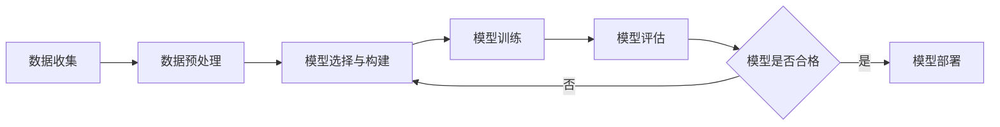

# AI编程：程序员的职业新机遇

> 关键词：AI编程、程序员、职业机遇、人工智能算法、代码实践

> 摘要：本文深入探讨了AI编程为程序员带来的职业新机遇。从背景介绍入手，阐述了目的、预期读者等内容。详细讲解了AI编程的核心概念、算法原理、数学模型等基础知识，通过Python代码进行了原理阐述。结合实际项目案例，展示了AI编程的开发环境搭建、代码实现与解读。分析了AI编程在不同领域的实际应用场景，并推荐了学习资源、开发工具和相关论文著作。最后总结了AI编程的未来发展趋势与挑战，为程序员把握这一职业新机遇提供全面的参考。

## 1. 背景介绍 
### 1.1 目的和范围
随着人工智能技术的飞速发展，AI编程已经成为编程领域的热门方向。本文的目的在于全面剖析AI编程为程序员带来的职业新机遇，详细介绍AI编程的相关知识和技能，帮助程序员了解如何在这个领域中发展。范围涵盖AI编程的核心概念、算法原理、数学模型、实际项目案例、应用场景以及学习资源等方面。

### 1.2 预期读者
本文主要面向广大程序员群体，包括有一定编程基础但对AI编程了解较少的初学者，以及希望在AI编程领域进一步提升技能的有经验的程序员。同时，对人工智能技术感兴趣的计算机相关专业的学生也可以从本文中获取有价值的信息。

### 1.3 文档结构概述
本文将按照以下结构进行阐述：首先介绍AI编程的背景信息，包括目的、读者群体和文档结构等。接着深入讲解AI编程的核心概念和联系，包括相关原理和架构的示意图及流程图。然后详细阐述核心算法原理和具体操作步骤，并用Python代码进行说明。之后介绍AI编程涉及的数学模型和公式，并举例说明。通过实际项目案例展示AI编程的开发过程和代码实现。分析AI编程在不同领域的实际应用场景。推荐学习AI编程的工具和资源，包括书籍、在线课程、开发工具等。最后总结AI编程的未来发展趋势与挑战，并提供常见问题解答和扩展阅读参考资料。

### 1.4 术语表
#### 1.4.1 核心术语定义
- **AI编程（Artificial Intelligence Programming）**：指利用计算机编程技术实现人工智能相关功能和算法的过程，包括机器学习、深度学习、自然语言处理等领域的编程。
- **机器学习（Machine Learning）**：是一门多领域交叉学科，涉及概率论、统计学、逼近论、凸分析、算法复杂度理论等多门学科。它专门研究计算机怎样模拟或实现人类的学习行为，以获取新的知识或技能，重新组织已有的知识结构使之不断改善自身的性能。
- **深度学习（Deep Learning）**：是机器学习的一个分支领域，它是一种基于对数据进行表征学习的方法。深度学习通过构建具有很多层的神经网络模型，自动从大量数据中学习特征和模式。
- **自然语言处理（Natural Language Processing，NLP）**：是计算机科学、人工智能和语言学的交叉领域，主要研究如何让计算机理解和处理人类语言，包括文本分类、情感分析、机器翻译等任务。

#### 1.4.2 相关概念解释
- **神经网络（Neural Network）**：是一种模仿人类神经系统的计算模型，由大量的神经元组成。神经元之间通过连接进行信息传递和处理，通过调整连接的权重来学习数据中的模式和特征。
- **训练数据（Training Data）**：用于训练机器学习模型的数据集合，模型通过对训练数据的学习来调整自身的参数，以提高对未知数据的预测能力。
- **验证数据（Validation Data）**：在模型训练过程中，用于评估模型性能和调整超参数的数据集合。验证数据不参与模型的训练，主要用于监测模型的泛化能力。
- **测试数据（Test Data）**：在模型训练完成后，用于最终评估模型性能的数据集合。测试数据与训练数据和验证数据相互独立，以确保对模型性能的客观评估。

#### 1.4.3 缩略词列表
- **AI**：Artificial Intelligence，人工智能
- **ML**：Machine Learning，机器学习
- **DL**：Deep Learning，深度学习
- **NLP**：Natural Language Processing，自然语言处理
- **ANN**：Artificial Neural Network，人工神经网络
- **CNN**：Convolutional Neural Network，卷积神经网络
- **RNN**：Recurrent Neural Network，循环神经网络

## 2. 核心概念与联系 
### 核心概念原理
AI编程的核心概念主要围绕机器学习和深度学习展开。机器学习是AI编程的基础，它通过让计算机从数据中学习模式和规律，从而实现对未知数据的预测和决策。深度学习则是机器学习的一个高级分支，它通过构建深度神经网络模型，能够自动从大量数据中学习到复杂的特征和模式。

以图像识别为例，传统的机器学习方法需要人工提取图像的特征，如颜色、纹理等，然后将这些特征输入到分类器中进行分类。而深度学习方法则可以直接将原始图像输入到卷积神经网络（CNN）中，网络会自动学习图像中的特征，从而实现更准确的图像分类。

### 架构的文本示意图
以下是一个简单的AI编程架构示意图：

```plaintext
数据收集 -> 数据预处理 -> 模型选择与构建 -> 模型训练 -> 模型评估 -> 模型部署
```

- **数据收集**：收集与任务相关的原始数据，如图片、文本、音频等。
- **数据预处理**：对收集到的数据进行清洗、转换、归一化等操作，以提高数据的质量和可用性。
- **模型选择与构建**：根据任务的需求选择合适的机器学习或深度学习模型，并构建模型的结构。
- **模型训练**：使用预处理后的数据对模型进行训练，调整模型的参数，使模型能够学习到数据中的模式和规律。
- **模型评估**：使用验证数据对训练好的模型进行评估，计算模型的性能指标，如准确率、召回率等。
- **模型部署**：将评估合格的模型部署到实际应用中，为用户提供服务。

### Mermaid流程图


## 3. 核心算法原理 & 具体操作步骤 
### 线性回归算法原理
线性回归是一种简单而常用的机器学习算法，用于建立自变量和因变量之间的线性关系。其基本原理是通过最小化预测值与真实值之间的误差平方和，来确定最佳的回归系数。

假设我们有一组数据 $(x_1, y_1), (x_2, y_2), \cdots, (x_n, y_n)$，其中 $x_i$ 是自变量，$y_i$ 是因变量。线性回归模型可以表示为：

$y = \theta_0 + \theta_1x$

其中，$\theta_0$ 是截距，$\theta_1$ 是斜率。我们的目标是找到最佳的 $\theta_0$ 和 $\theta_1$，使得预测值 $\hat{y}$ 与真实值 $y$ 之间的误差平方和最小。误差平方和可以表示为：

$J(\theta_0, \theta_1) = \frac{1}{2n} \sum_{i=1}^{n} (y_i - (\theta_0 + \theta_1x_i))^2$

为了找到最小化 $J(\theta_0, \theta_1)$ 的 $\theta_0$ 和 $\theta_1$，我们可以使用梯度下降算法。梯度下降算法的基本思想是沿着误差函数的负梯度方向不断更新参数，直到找到误差函数的最小值。

### 具体操作步骤
1. **初始化参数**：随机初始化 $\theta_0$ 和 $\theta_1$。
2. **计算梯度**：计算误差函数 $J(\theta_0, \theta_1)$ 关于 $\theta_0$ 和 $\theta_1$ 的梯度。
3. **更新参数**：根据梯度下降公式更新 $\theta_0$ 和 $\theta_1$。
4. **重复步骤2和3**：直到误差函数收敛或达到最大迭代次数。

### Python源代码实现
```python
import numpy as np

# 定义梯度下降函数
def gradient_descent(x, y, theta0, theta1, alpha, num_iters):
    n = len(x)
    for iter in range(num_iters):
        # 计算预测值
        y_pred = theta0 + theta1 * x
        # 计算误差
        error = y_pred - y
        # 计算梯度
        theta0_gradient = (1 / n) * np.sum(error)
        theta1_gradient = (1 / n) * np.sum(error * x)
        # 更新参数
        theta0 = theta0 - alpha * theta0_gradient
        theta1 = theta1 - alpha * theta1_gradient
    return theta0, theta1

# 生成一些示例数据
x = np.array([1, 2, 3, 4, 5])
y = np.array([2, 4, 6, 8, 10])

# 初始化参数
theta0 = 0
theta1 = 0

# 学习率
alpha = 0.01

# 迭代次数
num_iters = 1000

# 调用梯度下降函数
theta0, theta1 = gradient_descent(x, y, theta0, theta1, alpha, num_iters)

print("截距 theta0:", theta0)
print("斜率 theta1:", theta1)
```

### 代码解释
1. **导入必要的库**：导入 `numpy` 库，用于处理数值计算。
2. **定义梯度下降函数**：`gradient_descent` 函数接受输入数据 `x` 和 `y`，初始参数 `theta0` 和 `theta1`，学习率 `alpha` 和迭代次数 `num_iters` 作为参数。在函数内部，通过循环不断更新参数，直到达到最大迭代次数。
3. **生成示例数据**：使用 `numpy` 数组生成一些示例数据。
4. **初始化参数**：初始化截距 `theta0` 和斜率 `theta1` 为 0。
5. **设置学习率和迭代次数**：设置学习率 `alpha` 为 0.01，迭代次数 `num_iters` 为 1000。
6. **调用梯度下降函数**：调用 `gradient_descent` 函数，得到最终的截距和斜率。
7. **输出结果**：打印最终的截距和斜率。

## 4. 数学模型和公式 & 详细讲解 & 举例说明 
### 线性回归的数学模型和公式
线性回归的数学模型可以表示为：

$y = \theta_0 + \theta_1x_1 + \theta_2x_2 + \cdots + \theta_nx_n + \epsilon$

其中，$y$ 是因变量，$x_1, x_2, \cdots, x_n$ 是自变量，$\theta_0, \theta_1, \cdots, \theta_n$ 是回归系数，$\epsilon$ 是误差项。

在简单线性回归中，只有一个自变量，即 $n = 1$，模型可以简化为：

$y = \theta_0 + \theta_1x + \epsilon$

误差平方和的公式为：

$J(\theta_0, \theta_1) = \frac{1}{2n} \sum_{i=1}^{n} (y_i - (\theta_0 + \theta_1x_i))^2$

梯度下降算法的更新公式为：

$\theta_0 := \theta_0 - \alpha \frac{\partial J(\theta_0, \theta_1)}{\partial \theta_0}$

$\theta_1 := \theta_1 - \alpha \frac{\partial J(\theta_0, \theta_1)}{\partial \theta_1}$

其中，$\alpha$ 是学习率，$\frac{\partial J(\theta_0, \theta_1)}{\partial \theta_0}$ 和 $\frac{\partial J(\theta_0, \theta_1)}{\partial \theta_1}$ 分别是误差函数 $J(\theta_0, \theta_1)$ 关于 $\theta_0$ 和 $\theta_1$ 的偏导数。

### 详细讲解
- **误差平方和**：误差平方和是衡量模型预测值与真实值之间误差的一种常用方法。通过最小化误差平方和，我们可以找到最佳的回归系数，使得模型的预测效果最好。
- **梯度下降算法**：梯度下降算法是一种迭代优化算法，用于找到误差函数的最小值。在每次迭代中，我们根据误差函数的梯度方向更新参数，使得误差函数逐渐减小。
- **学习率**：学习率 $\alpha$ 控制了每次迭代中参数更新的步长。如果学习率过大，可能会导致算法无法收敛；如果学习率过小，算法的收敛速度会很慢。

### 举例说明
假设我们有以下数据集：

| $x$ | $y$ |
| --- | --- |
| 1 | 2 |
| 2 | 4 |
| 3 | 6 |
| 4 | 8 |
| 5 | 10 |

我们可以使用线性回归模型来拟合这些数据。首先，我们初始化参数 $\theta_0 = 0$ 和 $\theta_1 = 0$，学习率 $\alpha = 0.01$，迭代次数 $num\_iters = 1000$。然后，使用梯度下降算法不断更新参数，直到误差函数收敛。

最终得到的回归系数 $\theta_0$ 接近 0，$\theta_1$ 接近 2，这与我们的预期一致，因为 $y = 2x$ 是这些数据的真实线性关系。

## 5. 项目实战：代码实际案例和详细解释说明 
### 5.1  开发环境搭建
#### 安装Python
首先，我们需要安装Python。可以从Python官方网站（https://www.python.org/downloads/）下载适合自己操作系统的Python安装包，并按照安装向导进行安装。

#### 安装开发环境
推荐使用Anaconda作为Python的开发环境。Anaconda是一个开源的Python发行版，包含了Python解释器、常用的科学计算库和开发工具。可以从Anaconda官方网站（https://www.anaconda.com/products/individual）下载适合自己操作系统的Anaconda安装包，并按照安装向导进行安装。

#### 创建虚拟环境
为了避免不同项目之间的依赖冲突，我们可以使用Anaconda创建一个虚拟环境。打开Anaconda Prompt（Windows）或终端（Linux/Mac），执行以下命令：

```sh
conda create -n ai_programming python=3.8
```

这将创建一个名为 `ai_programming` 的虚拟环境，使用Python 3.8版本。

#### 激活虚拟环境
执行以下命令激活虚拟环境：

```sh
conda activate ai_programming
```

#### 安装必要的库
在虚拟环境中，我们需要安装一些必要的库，如 `numpy`、`pandas`、`scikit-learn`、`tensorflow` 等。执行以下命令安装这些库：

```sh
pip install numpy pandas scikit-learn tensorflow
```

### 5.2  源代码详细实现和代码解读
#### 项目背景
我们将实现一个简单的手写数字识别项目，使用MNIST数据集。MNIST数据集包含了60000张训练图片和10000张测试图片，每张图片都是28x28像素的灰度图像，代表了0-9之间的一个数字。

#### 代码实现
```python
import tensorflow as tf
from tensorflow.keras.datasets import mnist
from tensorflow.keras.models import Sequential
from tensorflow.keras.layers import Flatten, Dense

# 加载MNIST数据集
(x_train, y_train), (x_test, y_test) = mnist.load_data()

# 数据预处理
x_train = x_train / 255.0
x_test = x_test / 255.0

# 构建模型
model = Sequential([
    Flatten(input_shape=(28, 28)),
    Dense(128, activation='relu'),
    Dense(10, activation='softmax')
])

# 编译模型
model.compile(optimizer='adam',
              loss='sparse_categorical_crossentropy',
              metrics=['accuracy'])

# 训练模型
model.fit(x_train, y_train, epochs=5)

# 评估模型
test_loss, test_acc = model.evaluate(x_test, y_test)
print(f"Test accuracy: {test_acc}")
```

#### 代码解读
1. **导入必要的库**：导入 `tensorflow` 库和相关的模块，用于构建和训练神经网络模型。
2. **加载MNIST数据集**：使用 `mnist.load_data()` 函数加载MNIST数据集，将其分为训练集和测试集。
3. **数据预处理**：将图像像素值归一化到0-1之间，以提高模型的训练效果。
4. **构建模型**：使用 `Sequential` 模型构建一个简单的神经网络，包含一个 `Flatten` 层将二维图像数据转换为一维向量，一个 `Dense` 层作为隐藏层，使用 `relu` 激活函数，一个 `Dense` 层作为输出层，使用 `softmax` 激活函数。
5. **编译模型**：使用 `compile` 方法编译模型，指定优化器、损失函数和评估指标。
6. **训练模型**：使用 `fit` 方法训练模型，指定训练数据、训练轮数等参数。
7. **评估模型**：使用 `evaluate` 方法评估模型在测试集上的性能，打印测试准确率。

### 5.3  代码解读与分析
#### 模型结构分析
- **Flatten层**：将输入的二维图像数据（28x28像素）转换为一维向量（长度为784），方便后续的全连接层处理。
- **Dense层（隐藏层）**：包含128个神经元，使用 `relu` 激活函数。`relu` 激活函数可以引入非线性因素，提高模型的表达能力。
- **Dense层（输出层）**：包含10个神经元，使用 `softmax` 激活函数。`softmax` 激活函数可以将输出转换为概率分布，每个神经元的输出表示对应数字的概率。

#### 损失函数和优化器
- **损失函数**：使用 `sparse_categorical_crossentropy` 损失函数，适用于多分类问题，其中标签是整数编码的。
- **优化器**：使用 `adam` 优化器，它是一种自适应学习率的优化算法，能够自动调整学习率，提高模型的训练效率。

#### 训练和评估
- **训练**：使用 `fit` 方法进行模型训练，指定训练数据和训练轮数。在每一轮训练中，模型会根据训练数据更新自身的参数，以减小损失函数的值。
- **评估**：使用 `evaluate` 方法在测试集上评估模型的性能，计算测试损失和测试准确率。测试准确率表示模型在测试集上正确分类的样本比例。

## 6. 实际应用场景 
### 医疗领域
AI编程在医疗领域有着广泛的应用。例如，通过深度学习算法可以对医学影像（如X光、CT、MRI等）进行分析，帮助医生更准确地诊断疾病。AI还可以用于药物研发，通过对大量的生物数据进行分析，预测药物的疗效和副作用，加速药物研发的进程。此外，AI还可以实现智能健康监测，通过可穿戴设备收集人体的生理数据，实时监测健康状况，并提供个性化的健康建议。

### 金融领域
在金融领域，AI编程可以用于风险评估和预测。通过分析客户的信用历史、财务状况等数据，AI模型可以预测客户的违约概率，帮助银行和金融机构做出更明智的贷款决策。AI还可以用于股票市场预测，通过对历史股价、宏观经济数据等进行分析，预测股票价格的走势。此外，AI还可以实现智能投资顾问，根据客户的风险偏好和投资目标，为客户提供个性化的投资建议。

### 交通领域
AI编程在交通领域的应用也越来越广泛。例如，自动驾驶技术就是AI在交通领域的典型应用。通过使用传感器、摄像头等设备收集车辆周围的环境信息，AI模型可以实时决策车辆的行驶方向、速度等，实现自动驾驶。AI还可以用于交通流量预测，通过对历史交通数据和实时交通信息进行分析，预测交通流量的变化，帮助交通管理部门优化交通信号控制，缓解交通拥堵。

### 教育领域
在教育领域，AI编程可以实现个性化学习。通过分析学生的学习数据，如学习进度、学习习惯、考试成绩等，AI模型可以为学生提供个性化的学习计划和学习资源，帮助学生提高学习效率和学习成绩。AI还可以用于智能辅导，通过自然语言处理技术，实现与学生的智能交互，解答学生的问题，提供学习指导。

## 7. 工具和资源推荐
### 7.1 学习资源推荐
#### 7.1.1 书籍推荐
- 《Python机器学习》：本书详细介绍了使用Python进行机器学习的方法和技术，包括数据预处理、模型选择、模型评估等内容，适合初学者入门。
- 《深度学习》：由深度学习领域的三位顶尖专家Ian Goodfellow、Yoshua Bengio和Aaron Courville撰写，是深度学习领域的经典教材，全面介绍了深度学习的理论和实践。
- 《动手学深度学习》：本书结合实际代码，详细介绍了深度学习的基本概念和常用算法，通过大量的代码示例帮助读者快速掌握深度学习的编程技巧。

#### 7.1.2 在线课程
- Coursera上的《机器学习》课程：由斯坦福大学教授Andrew Ng主讲，是机器学习领域的经典课程，涵盖了机器学习的基本概念、算法和应用。
- edX上的《深度学习》课程：由深度学习领域的专家开设，介绍了深度学习的最新技术和应用，适合有一定机器学习基础的学习者。
- 吴恩达的《深度学习专项课程》：包含多个深度学习相关的课程，如神经网络和深度学习、改善深层神经网络、结构化机器学习项目等，全面深入地介绍了深度学习的各个方面。

#### 7.1.3 技术博客和网站
- Medium：是一个知名的技术博客平台，上面有很多关于AI编程的优秀文章，涵盖了机器学习、深度学习、自然语言处理等多个领域。
- Towards Data Science：专注于数据科学和机器学习领域的技术博客，提供了很多实用的教程和案例分析。
- Kaggle：是一个数据科学竞赛平台，上面有很多关于AI编程的数据集和竞赛项目，可以通过参与竞赛来提高自己的编程能力。

### 7.2 开发工具框架推荐
#### 7.2.1 IDE和编辑器
- PyCharm：是一款专门为Python开发设计的集成开发环境（IDE），提供了丰富的代码编辑、调试、版本控制等功能，适合专业的Python开发者。
- Jupyter Notebook：是一个交互式的开发环境，支持Python、R等多种编程语言。它以网页的形式展示代码和运行结果，方便进行数据分析和模型实验。
- Visual Studio Code：是一款轻量级的代码编辑器，支持多种编程语言，通过安装Python扩展可以实现Python代码的编辑、调试等功能。

#### 7.2.2 调试和性能分析工具
- TensorBoard：是TensorFlow提供的一个可视化工具，可以用于可视化模型的训练过程、评估指标、网络结构等，帮助开发者更好地理解和调试模型。
- Py-Spy：是一个Python性能分析工具，可以实时监测Python程序的CPU使用情况、函数调用时间等，帮助开发者找出性能瓶颈。
- cProfile：是Python标准库中的一个性能分析模块，可以统计Python程序中各个函数的调用次数、执行时间等信息，帮助开发者优化代码性能。

#### 7.2.3 相关框架和库
- TensorFlow：是一个开源的深度学习框架，由Google开发和维护。它提供了丰富的深度学习模型和工具，支持CPU、GPU等多种计算设备，广泛应用于图像识别、自然语言处理等领域。
- PyTorch：是另一个开源的深度学习框架，由Facebook开发和维护。它具有动态图的特点，代码简洁易懂，适合快速开发和实验。
- Scikit-learn：是一个用于机器学习的Python库，提供了丰富的机器学习算法和工具，如分类、回归、聚类等，适合初学者入门。

### 7.3 相关论文著作推荐
#### 7.3.1 经典论文
- 《Gradient-based learning applied to document recognition》：由Yann LeCun等人发表，介绍了卷积神经网络（CNN）在手写数字识别中的应用，是CNN领域的经典论文。
- 《ImageNet Classification with Deep Convolutional Neural Networks》：由Alex Krizhevsky等人发表，介绍了AlexNet模型，该模型在2012年的ImageNet图像分类竞赛中取得了显著的成绩，开启了深度学习在计算机视觉领域的热潮。
- 《Long Short-Term Memory》：由Sepp Hochreiter和Jürgen Schmidhuber发表，介绍了长短期记忆网络（LSTM），该模型在处理序列数据方面具有很好的效果，广泛应用于自然语言处理等领域。

#### 7.3.2 最新研究成果
- 关注顶级学术会议，如NeurIPS（神经信息处理系统大会）、ICML（国际机器学习会议）、CVPR（计算机视觉与模式识别会议）等，这些会议上会发表很多AI编程领域的最新研究成果。
- 关注知名学术期刊，如Journal of Artificial Intelligence Research（JAIR）、Artificial Intelligence等，这些期刊上会发表一些高质量的AI编程相关的研究论文。

#### 7.3.3 应用案例分析
- 《AI in Practice: How 50 Successful Companies Used Artificial Intelligence to Solve Problems》：本书介绍了50个成功应用人工智能解决实际问题的案例，涵盖了医疗、金融、交通等多个领域，可以帮助读者了解AI编程在实际应用中的方法和技巧。
- Kaggle上的优秀解决方案：Kaggle上有很多数据科学竞赛的优秀解决方案，这些方案展示了如何使用AI编程解决实际问题，可以通过学习这些方案来提高自己的编程能力。

## 8. 总结：未来发展趋势与挑战
### 未来发展趋势
- **多领域融合**：AI编程将与更多的领域进行融合，如医疗、金融、交通、教育等，为这些领域带来更高效、更智能的解决方案。
- **自动化和智能化**：随着技术的不断发展，AI编程将越来越自动化和智能化。例如，自动机器学习（AutoML）技术可以自动完成模型选择、超参数调优等任务，降低AI编程的门槛。
- **边缘计算和物联网**：随着物联网设备的普及，AI编程将更多地应用于边缘计算场景。边缘设备可以在本地进行数据处理和模型推理，减少数据传输延迟，提高系统的实时性和可靠性。
- **量子计算**：量子计算技术的发展将为AI编程带来新的机遇。量子计算具有强大的计算能力，可以加速AI模型的训练和推理过程，解决一些传统计算机难以处理的复杂问题。

### 挑战
- **数据隐私和安全**：AI编程需要大量的数据进行训练，而这些数据往往包含用户的个人隐私信息。如何保护数据的隐私和安全，防止数据泄露和滥用，是AI编程面临的一个重要挑战。
- **算法可解释性**：深度学习模型通常是一个黑盒模型，其决策过程难以解释。在一些关键领域，如医疗、金融等，模型的可解释性至关重要。如何提高AI算法的可解释性，是当前研究的一个热点问题。
- **人才短缺**：AI编程是一个新兴的领域，需要具备机器学习、深度学习、数学等多方面知识的复合型人才。目前，AI编程领域的人才短缺问题比较严重，如何培养和吸引更多的AI编程人才，是行业发展面临的一个挑战。
- **伦理和社会问题**：AI编程的发展可能会带来一些伦理和社会问题，如失业、算法歧视等。如何制定合理的政策和法规，引导AI编程的健康发展，是社会需要面对的一个重要问题。

## 9. 附录：常见问题与解答
### 问题1：AI编程需要具备哪些基础知识？
解答：AI编程需要具备一定的编程基础，如Python语言。此外，还需要了解数学基础知识，如线性代数、概率论、统计学等，以及机器学习和深度学习的基本概念和算法。

### 问题2：如何选择合适的AI编程框架？
解答：选择合适的AI编程框架需要考虑多个因素，如项目需求、个人喜好、社区支持等。TensorFlow和PyTorch是两个比较流行的深度学习框架，TensorFlow功能强大，适合工业级应用；PyTorch代码简洁，适合快速开发和实验。Scikit-learn是一个用于机器学习的Python库，适合初学者入门。

### 问题3：如何提高AI模型的性能？
解答：提高AI模型的性能可以从多个方面入手，如数据预处理、模型选择、超参数调优、增加训练数据等。数据预处理可以提高数据的质量和可用性；选择合适的模型可以提高模型的表达能力；超参数调优可以找到最佳的模型参数；增加训练数据可以提高模型的泛化能力。

### 问题4：AI编程在实际应用中会遇到哪些问题？
解答：AI编程在实际应用中可能会遇到数据质量问题、模型过拟合或欠拟合问题、计算资源不足问题等。数据质量问题可能会导致模型的性能下降；模型过拟合或欠拟合问题会影响模型的泛化能力；计算资源不足问题会限制模型的训练和推理速度。

### 问题5：如何学习AI编程？
解答：学习AI编程可以通过阅读相关书籍、参加在线课程、实践项目等方式。可以先学习Python编程和数学基础知识，然后学习机器学习和深度学习的基本概念和算法。通过实践项目来巩固所学知识，提高编程能力。

## 10. 扩展阅读 & 参考资料
### 扩展阅读
- 《人工智能时代》：本书介绍了人工智能的发展历程、现状和未来趋势，探讨了人工智能对社会、经济、文化等方面的影响。
- 《人类简史：从动物到上帝》：作者从人类的进化历程出发，探讨了人类与其他动物的区别，以及人类如何通过虚构故事来构建社会和文化。虽然本书不是专门关于AI编程的书籍，但可以帮助读者从更宏观的角度理解人类与技术的关系。
- 《奇点临近》：本书提出了奇点的概念，认为随着技术的不断发展，人工智能将超越人类智能，带来前所未有的变革。

### 参考资料
- [TensorFlow官方文档](https://www.tensorflow.org/)
- [PyTorch官方文档](https://pytorch.org/)
- [Scikit-learn官方文档](https://scikit-learn.org/)
- [Kaggle官方网站](https://www.kaggle.com/)
- [Coursera官方网站](https://www.coursera.org/)
- [edX官方网站](https://www.edx.org/)