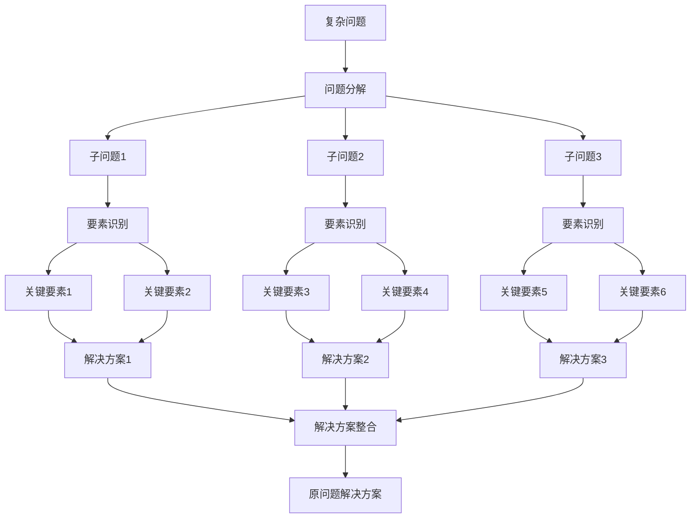

# AI解题能力:问题分解与要素识别的重要性

> 关键词：AI解题能力、问题分解、要素识别、复杂问题处理、智能决策

> 摘要：本文深入探讨了AI解题能力中问题分解与要素识别的重要性。首先介绍了相关背景，包括目的、预期读者、文档结构和术语表。接着阐述了核心概念及其联系，详细讲解了核心算法原理与具体操作步骤，通过Python代码进行说明。分析了相关数学模型和公式，并举例说明。结合项目实战，给出代码实际案例及详细解释。探讨了实际应用场景，推荐了学习、开发工具和相关论文著作。最后总结了未来发展趋势与挑战，提供了常见问题解答和扩展阅读参考资料。通过全面的分析，揭示了问题分解与要素识别对于提升AI解题能力的关键作用。

## 1. 背景介绍 
### 1.1 目的和范围
随着人工智能技术的飞速发展，AI在各个领域的应用越来越广泛，其解题能力也成为衡量其性能的重要指标。本文章的目的在于深入探讨问题分解与要素识别在AI解题能力中的重要性，通过理论分析、算法讲解、项目实战等方式，全面阐述这两个关键环节对于提升AI处理复杂问题的能力。文章的范围涵盖了AI解题能力的基本概念、核心算法、实际应用场景等多个方面，旨在为读者提供一个系统的、深入的理解。

### 1.2 预期读者
本文预期读者包括人工智能领域的研究人员、开发者、学生，以及对AI解题能力感兴趣的技术爱好者。对于研究人员和开发者，本文可以为他们的研究和开发工作提供理论支持和实践指导；对于学生，有助于他们深入理解AI解题的原理和方法；对于技术爱好者，能够帮助他们拓宽知识面，了解AI在解决问题方面的核心技术。

### 1.3 文档结构概述
本文共分为十个部分。第一部分为背景介绍，包括目的和范围、预期读者、文档结构概述和术语表；第二部分阐述核心概念与联系，给出核心概念原理和架构的文本示意图和Mermaid流程图；第三部分讲解核心算法原理与具体操作步骤，使用Python源代码详细阐述；第四部分分析数学模型和公式，并进行详细讲解和举例说明；第五部分是项目实战，包括开发环境搭建、源代码详细实现和代码解读；第六部分探讨实际应用场景；第七部分推荐工具和资源，包括学习资源、开发工具框架和相关论文著作；第八部分总结未来发展趋势与挑战；第九部分为附录，提供常见问题与解答；第十部分给出扩展阅读和参考资料。

### 1.4 术语表
#### 1.4.1 核心术语定义
- **AI解题能力**：指人工智能系统在面对各种问题时，能够运用自身的算法和模型，找到有效解决方案的能力。
- **问题分解**：将一个复杂的问题拆分成多个相对简单的子问题，以便于分别进行处理和解决。
- **要素识别**：从问题中提取出关键的信息和元素，明确问题的核心和边界。

#### 1.4.2 相关概念解释
- **复杂问题**：具有多个相互关联的因素、不确定因素较多、解决方案不明确的问题。
- **子问题**：通过问题分解得到的相对简单的问题，是解决复杂问题的中间步骤。
- **关键要素**：对问题的解决起决定性作用的信息和元素。

#### 1.4.3 缩略词列表
- **AI**：Artificial Intelligence，人工智能
- **ML**：Machine Learning，机器学习
- **DL**：Deep Learning，深度学习

## 2. 核心概念与联系 

### 核心概念原理
问题分解和要素识别是AI解题能力的两个核心环节，它们相互关联、相互影响。问题分解的目的是将复杂问题简化，使其更易于处理。通过将大问题拆分成多个子问题，AI可以分别对这些子问题进行分析和解决，最终整合子问题的解决方案得到原问题的答案。

要素识别则是在问题分解的基础上，从每个子问题中提取关键信息和元素。这些关键要素是解决问题的核心，AI可以根据这些要素选择合适的算法和模型进行处理。例如，在图像识别问题中，要素识别可能包括识别图像中的物体类别、位置、颜色等信息，然后根据这些信息进行分类和识别。

### 架构的文本示意图
```plaintext
复杂问题
|
|-- 问题分解
|   |-- 子问题1
|   |   |-- 要素识别
|   |   |   |-- 关键要素1
|   |   |   |-- 关键要素2
|   |   |   |-- ...
|   |   |-- 解决方案1
|   |-- 子问题2
|   |   |-- 要素识别
|   |   |   |-- 关键要素3
|   |   |   |-- 关键要素4
|   |   |   |-- ...
|   |   |-- 解决方案2
|   |-- ...
|
|-- 解决方案整合
|   |-- 原问题解决方案
```

### Mermaid流程图


## 3. 核心算法原理 & 具体操作步骤 

### 核心算法原理
在AI解题中，问题分解和要素识别可以通过多种算法实现。这里以基于规则的方法和机器学习方法为例进行说明。

#### 基于规则的方法
基于规则的方法是根据预先定义的规则对问题进行分解和要素识别。例如，在自然语言处理中，可以通过语法规则将一个句子分解成多个短语，然后根据语义规则识别每个短语中的关键要素。

以下是一个简单的基于规则的问题分解和要素识别的Python示例代码：
```python
# 定义规则
def decompose_problem(problem):
    # 简单的问题分解，根据空格分割问题
    sub_problems = problem.split(" ")
    return sub_problems

def identify_elements(sub_problem):
    # 简单的要素识别，假设每个单词都是一个要素
    elements = [sub_problem]
    return elements

# 测试代码
problem = "How to solve a complex problem"
sub_problems = decompose_problem(problem)
for sub_problem in sub_problems:
    elements = identify_elements(sub_problem)
    print(f"Sub-problem: {sub_problem}, Elements: {elements}")
```
在上述代码中，`decompose_problem` 函数根据空格将问题分解成多个子问题，`identify_elements` 函数将每个子问题作为一个要素。

#### 机器学习方法
机器学习方法通过训练模型来实现问题分解和要素识别。例如，可以使用深度学习模型对文本进行分类和实体识别，从而实现问题分解和要素识别。

以下是一个使用Python和`transformers`库进行文本分类和实体识别的示例代码：
```python
from transformers import AutoTokenizer, AutoModelForSequenceClassification, AutoModelForTokenClassification
import torch

# 加载预训练模型和分词器
tokenizer = AutoTokenizer.from_pretrained("bert-base-uncased")
model_classification = AutoModelForSequenceClassification.from_pretrained("bert-base-uncased")
model_token = AutoModelForTokenClassification.from_pretrained("bert-base-uncased")

# 定义问题
problem = "How to solve a complex problem"

# 进行文本分类
inputs = tokenizer(problem, return_tensors="pt")
outputs = model_classification(**inputs)
logits = outputs.logits
predicted_class = torch.argmax(logits, dim=1).item()

# 进行实体识别
inputs_token = tokenizer(problem, return_tensors="pt")
outputs_token = model_token(**inputs_token)
logits_token = outputs_token.logits
predicted_tokens = torch.argmax(logits_token, dim=2).squeeze().tolist()

# 解码实体识别结果
tokens = tokenizer.convert_ids_to_tokens(inputs_token["input_ids"].squeeze())
entities = []
for token, label in zip(tokens, predicted_tokens):
    entities.append((token, label))

print(f"Predicted class: {predicted_class}")
print(f"Entities: {entities}")
```
在上述代码中，使用了预训练的BERT模型进行文本分类和实体识别。文本分类可以将问题归类到不同的类别中，实体识别可以识别问题中的关键要素。

### 具体操作步骤
1. **数据收集**：收集与问题相关的数据，包括问题描述、解决方案等。
2. **数据预处理**：对收集到的数据进行清洗、标注等预处理操作，以便于模型训练。
3. **模型选择和训练**：根据问题的特点选择合适的算法和模型，如基于规则的方法、机器学习方法等，并使用预处理后的数据进行训练。
4. **问题分解和要素识别**：使用训练好的模型对新的问题进行分解和要素识别。
5. **解决方案生成**：根据识别出的要素和问题分解结果，生成解决方案。
6. **评估和优化**：对生成的解决方案进行评估，根据评估结果对模型进行优化。

## 4. 数学模型和公式 & 详细讲解 & 举例说明 

### 数学模型
在问题分解和要素识别中，常用的数学模型包括图模型、概率模型等。

#### 图模型
图模型可以用来表示问题和子问题之间的关系，以及要素之间的关联。例如，在知识图谱中，节点表示实体（要素），边表示实体之间的关系。

假设我们有一个问题图 $G=(V, E)$，其中 $V$ 是节点集合，代表问题和子问题、要素等；$E$ 是边集合，代表节点之间的关系。问题分解可以看作是将图 $G$ 拆分成多个子图 $G_1, G_2, ..., G_n$，每个子图对应一个子问题。

#### 概率模型
概率模型可以用来描述要素出现的概率和要素之间的依赖关系。例如，在自然语言处理中，使用隐马尔可夫模型（HMM）或条件随机场（CRF）来进行词性标注和实体识别。

### 数学公式
#### 图模型
图的邻接矩阵 $A$ 可以用来表示图中节点之间的关系。对于一个有 $n$ 个节点的图 $G=(V, E)$，邻接矩阵 $A$ 是一个 $n \times n$ 的矩阵，其中 $A_{ij}$ 表示节点 $i$ 和节点 $j$ 之间是否存在边。

如果节点 $i$ 和节点 $j$ 之间存在边，则 $A_{ij}=1$；否则 $A_{ij}=0$。

#### 概率模型
在隐马尔可夫模型中，状态转移概率 $a_{ij}$ 表示从状态 $i$ 转移到状态 $j$ 的概率，观测概率 $b_{j}(k)$ 表示在状态 $j$ 下观测到符号 $k$ 的概率。

状态转移概率矩阵 $A$ 和观测概率矩阵 $B$ 可以表示为：

$$A = \begin{bmatrix}
a_{11} & a_{12} & \cdots & a_{1n} \\
a_{21} & a_{22} & \cdots & a_{2n} \\
\vdots & \vdots & \ddots & \vdots \\
a_{n1} & a_{n2} & \cdots & a_{nn}
\end{bmatrix}$$

$$B = \begin{bmatrix}
b_{1}(1) & b_{1}(2) & \cdots & b_{1}(m) \\
b_{2}(1) & b_{2}(2) & \cdots & b_{2}(m) \\
\vdots & \vdots & \ddots & \vdots \\
b_{n}(1) & b_{n}(2) & \cdots & b_{n}(m)
\end{bmatrix}$$

其中 $n$ 是状态的数量，$m$ 是观测符号的数量。

### 详细讲解
#### 图模型
图模型可以直观地表示问题的结构和要素之间的关系。通过图的遍历和分割算法，可以实现问题的分解。例如，使用广度优先搜索（BFS）或深度优先搜索（DFS）算法遍历图，找到相关的子图。

#### 概率模型
概率模型可以处理不确定性和模糊性。在自然语言处理中，通过训练概率模型，可以预测单词的词性和实体类型。例如，在隐马尔可夫模型中，通过前向 - 后向算法可以计算状态的概率分布，从而进行词性标注和实体识别。

### 举例说明
#### 图模型
假设我们有一个问题图，其中节点表示不同的任务，边表示任务之间的依赖关系。通过图的分解算法，我们可以将这个问题图拆分成多个子图，每个子图对应一个可以独立执行的子任务。

#### 概率模型
在词性标注任务中，我们可以使用隐马尔可夫模型。给定一个句子，模型可以根据状态转移概率和观测概率，预测每个单词的词性。例如，对于句子 “The dog runs fast”，模型可以预测 “The” 是限定词，“dog” 是名词，“runs” 是动词，“fast” 是副词。

## 5. 项目实战：代码实际案例和详细解释说明 

### 5.1  开发环境搭建
为了实现问题分解和要素识别的项目，我们需要搭建相应的开发环境。以下是具体步骤：

#### 安装Python
首先，确保你已经安装了Python。可以从Python官方网站（https://www.python.org/downloads/）下载并安装适合你操作系统的Python版本。建议使用Python 3.7及以上版本。

#### 安装必要的库
使用pip命令安装以下必要的库：
```bash
pip install transformers torch numpy pandas
```
- `transformers`：用于加载预训练的深度学习模型。
- `torch`：深度学习框架，支持模型的训练和推理。
- `numpy`：用于数值计算。
- `pandas`：用于数据处理和分析。

### 5.2  源代码详细实现和代码解读
以下是一个使用`transformers`库进行文本问题分解和要素识别的完整代码示例：

```python
import torch
from transformers import AutoTokenizer, AutoModelForTokenClassification

# 加载预训练的分词器和模型
tokenizer = AutoTokenizer.from_pretrained("dslim/bert-base-NER")
model = AutoModelForTokenClassification.from_pretrained("dslim/bert-base-NER")

# 定义问题文本
problem = "How to solve the problem of high CPU usage in a server?"

# 对问题进行分词
inputs = tokenizer(problem, return_tensors="pt")

# 进行实体识别
outputs = model(**inputs)
logits = outputs.logits
predicted_ids = torch.argmax(logits, dim=2)

# 解码预测结果
tokens = tokenizer.convert_ids_to_tokens(inputs["input_ids"].squeeze())
predicted_labels = []
for token, label_id in zip(tokens, predicted_ids.squeeze()):
    label = model.config.id2label[label_id.item()]
    predicted_labels.append((token, label))

# 问题分解和要素提取
sub_problems = []
current_sub_problem = []
current_element = []
for token, label in predicted_labels:
    if label.startswith("B-"):
        if current_sub_problem:
            sub_problems.append((current_sub_problem, current_element))
            current_sub_problem = []
            current_element = []
        current_sub_problem.append(token)
        current_element.append(token)
    elif label.startswith("I-"):
        current_sub_problem.append(token)
        current_element.append(token)
    else:
        if current_sub_problem:
            sub_problems.append((current_sub_problem, current_element))
            current_sub_problem = []
            current_element = []
if current_sub_problem:
    sub_problems.append((current_sub_problem, current_element))

# 输出结果
for sub_problem, element in sub_problems:
    sub_problem_text = " ".join(sub_problem)
    element_text = " ".join(element)
    print(f"Sub-problem: {sub_problem_text}, Element: {element_text}")
```

### 5.3  代码解读与分析
#### 加载预训练模型和分词器
```python
tokenizer = AutoTokenizer.from_pretrained("dslim/bert-base-NER")
model = AutoModelForTokenClassification.from_pretrained("dslim/bert-base-NER")
```
这两行代码使用`transformers`库加载了预训练的分词器和用于命名实体识别（NER）的模型。`dslim/bert-base-NER`是一个在大量文本数据上训练好的模型，可以用于识别文本中的实体。

#### 对问题进行分词
```python
inputs = tokenizer(problem, return_tensors="pt")
```
这行代码使用分词器将问题文本转换为模型可以接受的输入格式，`return_tensors="pt"`表示返回PyTorch张量。

#### 进行实体识别
```python
outputs = model(**inputs)
logits = outputs.logits
predicted_ids = torch.argmax(logits, dim=2)
```
这几行代码将输入数据传递给模型进行推理，得到模型的输出`logits`。然后使用`torch.argmax`函数找到每个位置上概率最大的标签的索引。

#### 解码预测结果
```python
tokens = tokenizer.convert_ids_to_tokens(inputs["input_ids"].squeeze())
predicted_labels = []
for token, label_id in zip(tokens, predicted_ids.squeeze()):
    label = model.config.id2label[label_id.item()]
    predicted_labels.append((token, label))
```
这几行代码将模型预测的标签索引转换为实际的标签名称，并将每个单词和对应的标签组合成一个元组。

#### 问题分解和要素提取
```python
sub_problems = []
current_sub_problem = []
current_element = []
for token, label in predicted_labels:
    if label.startswith("B-"):
        if current_sub_problem:
            sub_problems.append((current_sub_problem, current_element))
            current_sub_problem = []
            current_element = []
        current_sub_problem.append(token)
        current_element.append(token)
    elif label.startswith("I-"):
        current_sub_problem.append(token)
        current_element.append(token)
    else:
        if current_sub_problem:
            sub_problems.append((current_sub_problem, current_element))
            current_sub_problem = []
            current_element = []
if current_sub_problem:
    sub_problems.append((current_sub_problem, current_element))
```
这部分代码根据命名实体识别的结果进行问题分解和要素提取。以`B-`开头的标签表示一个新的实体的开始，以`I-`开头的标签表示该实体的延续。当遇到非实体标签时，如果当前有正在处理的子问题，则将其添加到`sub_problems`列表中。

#### 输出结果
```python
for sub_problem, element in sub_problems:
    sub_problem_text = " ".join(sub_problem)
    element_text = " ".join(element)
    print(f"Sub-problem: {sub_problem_text}, Element: {element_text}")
```
最后，将分解得到的子问题和提取的要素输出。

## 6. 实际应用场景 
### 自然语言处理
在自然语言处理领域，问题分解和要素识别有着广泛的应用。例如，在问答系统中，当用户提出一个复杂的问题时，系统需要将问题分解成多个子问题，并识别出问题中的关键要素，如实体、属性、关系等。然后，系统可以根据这些子问题和要素，从知识库中查找相关的信息，生成准确的答案。

在文本摘要任务中，问题分解可以将一篇长文本分解成多个段落或句子，要素识别可以提取出文本中的关键信息和主题。通过对这些子问题和要素的处理，系统可以生成简洁、准确的文本摘要。

### 图像识别
在图像识别中，问题分解可以将一幅图像分解成多个区域或对象，要素识别可以识别出每个区域或对象的特征和属性。例如，在目标检测任务中，系统需要将图像中的不同目标（如人、车、动物等）识别出来，并确定它们的位置和类别。通过问题分解和要素识别，系统可以提高目标检测的准确性和效率。

在图像分割任务中，问题分解可以将图像分割成不同的语义区域，要素识别可以提取出每个区域的特征和边界。这样，系统可以更精确地对图像进行分割，为后续的分析和处理提供基础。

### 智能决策
在智能决策领域，问题分解和要素识别可以帮助决策者更好地理解问题的本质和关键因素。例如，在企业决策中，当面临一个复杂的商业问题时，决策者可以将问题分解成多个子问题，如市场分析、竞争态势、成本效益等。然后，通过要素识别，确定每个子问题的关键要素，如市场份额、竞争对手策略、成本结构等。最后，根据这些子问题和要素，制定出合理的决策方案。

在医疗决策中，医生可以将患者的病情问题分解成多个子问题，如症状分析、病因诊断、治疗方案选择等。通过要素识别，提取出关键的病情要素，如症状表现、检查结果、病史等。这样，医生可以更准确地做出诊断和治疗决策，提高医疗质量。

### 机器人控制
在机器人控制中，问题分解和要素识别可以帮助机器人更好地理解任务和环境。例如，在机器人导航任务中，机器人需要将导航问题分解成多个子问题，如路径规划、障碍物检测、姿态调整等。通过要素识别，确定每个子问题的关键要素，如地图信息、障碍物位置、机器人姿态等。然后，机器人可以根据这些子问题和要素，采取相应的行动，实现自主导航。

在机器人抓取任务中，机器人需要将抓取问题分解成多个子问题，如目标识别、抓取姿态规划、力控制等。通过要素识别，提取出目标物体的特征和位置，以及抓取所需的关键要素，如物体形状、重量、材质等。这样，机器人可以更准确地完成抓取任务。

## 7. 工具和资源推荐
### 7.1 学习资源推荐
#### 7.1.1 书籍推荐
- 《人工智能：一种现代的方法》：这本书是人工智能领域的经典教材，全面介绍了人工智能的基本概念、算法和应用。其中包括问题求解、搜索算法、知识表示等与问题分解和要素识别相关的内容。
- 《Python自然语言处理》：详细介绍了使用Python进行自然语言处理的方法和技术，包括文本分类、实体识别、信息提取等，对于理解自然语言处理中的问题分解和要素识别有很大帮助。
- 《深度学习》：由Ian Goodfellow、Yoshua Bengio和Aaron Courville合著，这本书系统地介绍了深度学习的理论和实践，包括神经网络、卷积神经网络、循环神经网络等，为使用深度学习方法进行问题分解和要素识别提供了理论基础。

#### 7.1.2 在线课程
- Coursera上的“人工智能基础”课程：由知名高校的教授授课，涵盖了人工智能的基本概念、算法和应用，包括问题求解和搜索算法等内容。
- edX上的“自然语言处理”课程：介绍了自然语言处理的基本技术和方法，如分词、词性标注、命名实体识别等，与问题分解和要素识别密切相关。
- Udemy上的“深度学习实战”课程：通过实际项目案例，讲解深度学习的应用，包括图像识别、语音识别等领域，对于理解如何使用深度学习进行问题分解和要素识别有很大帮助。

#### 7.1.3 技术博客和网站
- Medium：上面有很多人工智能领域的技术博客文章，涵盖了问题分解、要素识别等方面的最新研究成果和实践经验。
- arXiv：提供了大量的学术论文，包括人工智能、机器学习、自然语言处理等领域的最新研究，对于深入了解问题分解和要素识别的理论和方法有很大帮助。
- AI Stack Exchange：一个专门的人工智能问答社区，用户可以在这里提出问题、分享经验和交流思想，对于解决实际问题和学习新技术有很大帮助。

### 7.2 开发工具框架推荐
#### 7.2.1 IDE和编辑器
- PyCharm：一款专门为Python开发设计的集成开发环境（IDE），具有代码编辑、调试、版本控制等功能，非常适合进行人工智能项目的开发。
- Jupyter Notebook：一个交互式的开发环境，支持Python、R等多种编程语言。它可以将代码、文本、图像等内容整合在一起，方便进行数据分析和模型开发。
- Visual Studio Code：一款轻量级的代码编辑器，支持多种编程语言和插件扩展。它具有丰富的代码提示和调试功能，对于快速开发和调试人工智能项目非常有用。

#### 7.2.2 调试和性能分析工具
- TensorBoard：一个用于可视化和分析深度学习模型训练过程的工具，它可以展示模型的损失函数、准确率、梯度等信息，帮助开发者调试和优化模型。
- PyTorch Profiler：PyTorch提供的性能分析工具，可以帮助开发者分析模型的性能瓶颈，如计算时间、内存使用等，从而进行优化。
- cProfile：Python内置的性能分析工具，可以对Python代码进行性能分析，找出代码中的瓶颈和耗时操作。

#### 7.2.3 相关框架和库
- TensorFlow：一个开源的深度学习框架，提供了丰富的工具和库，支持各种深度学习模型的开发和训练，如卷积神经网络、循环神经网络等。
- PyTorch：另一个流行的深度学习框架，具有动态图和易于使用的特点，适合快速开发和实验深度学习模型。
- NLTK：自然语言处理工具包，提供了丰富的自然语言处理工具和数据集，如分词器、词性标注器、命名实体识别器等，方便进行自然语言处理任务的开发。

### 7.3 相关论文著作推荐
#### 7.3.1 经典论文
- “A* Search Algorithm”：介绍了A*搜索算法，这是一种在图搜索中非常重要的算法，可用于问题分解和路径规划。
- “Named Entity Recognition with Bidirectional LSTM-CNNs”：提出了一种使用双向长短期记忆网络（BiLSTM）和卷积神经网络（CNN）进行命名实体识别的方法，对于要素识别有很大的参考价值。
- “ImageNet Classification with Deep Convolutional Neural Networks”：介绍了AlexNet，这是一种在图像识别领域具有里程碑意义的卷积神经网络，为图像识别中的问题分解和要素识别提供了重要的思路。

#### 7.3.2 最新研究成果
- 关注顶级学术会议如NeurIPS（神经信息处理系统大会）、ICML（国际机器学习会议）、ACL（计算语言学协会年会）等上发表的论文，这些论文代表了人工智能领域的最新研究成果，包括问题分解和要素识别的新方法和新技术。
- 一些知名学术期刊如Journal of Artificial Intelligence Research（JAIR）、Artificial Intelligence等也会发表相关的高质量研究论文。

#### 7.3.3 应用案例分析
- 《人工智能应用案例集》：收集了人工智能在各个领域的应用案例，包括自然语言处理、图像识别、智能决策等，通过这些案例可以了解问题分解和要素识别在实际应用中的具体实现和效果。
- 各大科技公司的技术博客，如Google AI Blog、Microsoft AI Blog等，会分享他们在人工智能项目中的实践经验和应用案例，对于学习和借鉴有很大帮助。

## 8. 总结：未来发展趋势与挑战
### 未来发展趋势
#### 多模态融合
未来，AI解题能力将更加注重多模态融合，即结合文本、图像、语音等多种模态的信息进行问题分解和要素识别。例如，在智能客服系统中，除了处理用户的文本提问，还可以结合用户的语音语调、表情等信息，更准确地理解用户的问题和需求。通过多模态融合，可以提高AI解题的准确性和全面性。

#### 强化学习与问题分解的结合
强化学习是一种通过智能体与环境进行交互来学习最优策略的方法。未来，强化学习将与问题分解技术相结合，使AI能够在复杂的环境中自动学习如何进行问题分解和要素识别。例如，在机器人导航任务中，机器人可以通过强化学习不断优化问题分解策略，提高导航的效率和准确性。

#### 可解释性和透明度
随着AI在各个领域的广泛应用，人们对AI决策的可解释性和透明度提出了更高的要求。未来，问题分解和要素识别算法将更加注重可解释性，能够向用户清晰地展示问题是如何分解的，要素是如何识别的，以及最终的解决方案是如何得出的。这将有助于提高用户对AI的信任度，促进AI的进一步应用和发展。

#### 跨领域应用
AI解题能力将越来越多地应用于跨领域的问题解决中。例如，在医疗领域与生物信息学的结合，通过问题分解和要素识别，可以更好地理解疾病的发病机制，制定个性化的治疗方案。在金融领域与经济学的结合，可以帮助分析市场趋势，进行风险评估和投资决策。

### 挑战
#### 数据质量和数量
问题分解和要素识别需要大量高质量的数据进行训练。然而，在实际应用中，数据的质量和数量往往难以满足需求。数据可能存在噪声、缺失值等问题，而且某些领域的数据获取难度较大。如何有效地处理低质量数据和获取足够的数据，是未来需要解决的一个重要挑战。

#### 复杂问题的处理
随着问题的复杂度不断增加，现有的问题分解和要素识别方法可能无法满足需求。例如，在处理具有高度不确定性和动态变化的问题时，如何准确地进行问题分解和要素识别是一个难题。需要开发更加灵活和自适应的算法，以应对复杂问题的挑战。

#### 计算资源和效率
深度学习等方法在问题分解和要素识别中取得了很好的效果，但这些方法通常需要大量的计算资源和时间。在实际应用中，如何在有限的计算资源和时间内完成问题分解和要素识别任务，是一个需要解决的问题。需要开发更加高效的算法和优化技术，提高计算效率。

#### 伦理和法律问题
随着AI的广泛应用，伦理和法律问题也日益凸显。例如，在问题分解和要素识别过程中，可能会涉及到用户隐私和数据安全问题。如何确保AI的使用符合伦理和法律规范，保护用户的权益，是未来需要关注的重要问题。

## 9. 附录：常见问题与解答
### 问题1：问题分解和要素识别有什么区别？
问题分解是将一个复杂的问题拆分成多个相对简单的子问题，以便于分别进行处理和解决。而要素识别是从问题中提取出关键的信息和元素，明确问题的核心和边界。问题分解侧重于将问题进行划分，要素识别侧重于从问题中提取关键信息。

### 问题2：在实际应用中，如何选择合适的问题分解和要素识别方法？
选择合适的方法需要考虑问题的特点、数据的类型和规模、计算资源等因素。如果问题具有明确的结构和规则，可以考虑使用基于规则的方法；如果问题比较复杂，数据量较大，可以考虑使用机器学习或深度学习方法。同时，还可以结合多种方法进行综合处理，以提高解题的效果。

### 问题3：问题分解和要素识别对AI的性能有什么影响？
问题分解和要素识别是AI解题能力的关键环节，对AI的性能有着重要的影响。通过合理的问题分解，可以将复杂问题简化，降低解题的难度；通过准确的要素识别，可以提取关键信息，提高解题的准确性和效率。因此，良好的问题分解和要素识别能力可以显著提升AI的解题性能。

### 问题4：如何评估问题分解和要素识别的效果？
可以使用多种指标来评估问题分解和要素识别的效果。对于问题分解，可以评估子问题的独立性、完整性和可解性等；对于要素识别，可以评估识别的准确率、召回率、F1值等。此外，还可以通过实际应用的效果来评估，如解题的准确率、效率等。

### 问题5：在开发过程中，遇到问题分解和要素识别不准确的情况怎么办？
如果遇到问题分解和要素识别不准确的情况，可以从以下几个方面进行排查和改进。首先，检查数据的质量和数量，确保数据的准确性和完整性；其次，调整算法和模型的参数，优化模型的性能；还可以尝试使用不同的算法和模型进行对比，选择最合适的方法。此外，还可以结合人工标注和反馈，不断改进问题分解和要素识别的效果。

## 10. 扩展阅读 & 参考资料
### 扩展阅读
- 《人工智能简史》：了解人工智能的发展历程和重要里程碑，有助于更好地理解问题分解和要素识别在人工智能发展中的地位和作用。
- 《智能时代》：探讨了人工智能对社会和经济的影响，以及未来的发展趋势，为思考问题分解和要素识别的应用前景提供了更广阔的视角。
- 《算法导论》：深入介绍了各种算法的原理和实现，对于理解问题分解和要素识别中使用的算法有很大帮助。

### 参考资料
- 相关学术论文和研究报告，如在IEEE、ACM等学术会议和期刊上发表的关于问题分解、要素识别、人工智能解题能力的论文。
- 开源代码库，如GitHub上的相关项目，通过学习和参考开源代码，可以更好地理解和实现问题分解和要素识别的算法。
- 各大科技公司的技术文档和博客文章，如Google、Microsoft、Facebook等公司在人工智能领域的技术分享和实践经验。