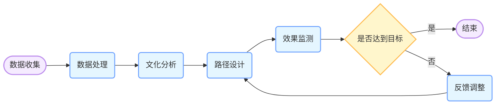

# AI辅助企业并购整合规划：文化融合路径设计与效果监测

> 关键词：AI、企业并购整合、文化融合路径设计、效果监测、企业文化

> 摘要：本文聚焦于AI在企业并购整合规划中对文化融合路径设计与效果监测的应用。首先介绍了相关背景，包括目的、预期读者、文档结构和术语表。接着阐述了核心概念及联系，展示了原理和架构的文本示意图与Mermaid流程图。详细讲解了核心算法原理，并用Python代码进行说明。给出了相关数学模型和公式，并举例解释。通过项目实战，从开发环境搭建、源代码实现到代码解读进行了深入分析。探讨了实际应用场景，推荐了学习资源、开发工具框架和相关论文著作。最后总结了未来发展趋势与挑战，提供了常见问题解答和扩展阅读参考资料，旨在为企业利用AI进行并购文化融合提供全面的指导。

## 1. 背景介绍 
### 1.1 目的和范围
企业并购是企业快速扩张和战略布局的重要手段，但并购后的整合尤其是文化融合是一个极具挑战性的问题。文化融合的成功与否直接影响到企业并购的最终成效。本文章的目的在于探讨如何利用AI技术辅助企业进行并购整合规划中的文化融合路径设计，并对融合效果进行有效监测。范围涵盖了从文化融合的基本概念、AI在其中的应用原理、具体算法实现，到实际项目案例和应用场景的分析，以及相关工具和资源的推荐。

### 1.2 预期读者
本文预期读者主要包括企业的高层管理人员、战略规划部门人员、并购整合项目团队成员，以及对AI在企业管理领域应用感兴趣的研究人员和学者。企业管理人员可以从中获取利用AI进行文化融合规划和监测的方法和思路；研究人员和学者则可以进一步深入探讨相关理论和技术。

### 1.3 文档结构概述
本文将按照以下结构展开：首先介绍背景知识，包括目的、读者和文档结构；接着阐述核心概念及联系，通过文本示意图和Mermaid流程图展示；然后详细讲解核心算法原理和具体操作步骤，用Python代码说明；给出数学模型和公式并举例；进行项目实战，包括开发环境搭建、代码实现和解读；探讨实际应用场景；推荐相关工具和资源；总结未来发展趋势与挑战；提供常见问题解答和扩展阅读参考资料。

### 1.4 术语表
#### 1.4.1 核心术语定义
- **企业并购整合**：指企业在完成并购交易后，对被并购企业的资源、业务、组织和文化等方面进行全面整合，以实现协同效应和价值提升的过程。
- **文化融合**：是指在企业并购整合过程中，将不同企业的文化进行相互渗透、相互吸收，形成一种新的、适应企业发展的文化的过程。
- **AI（人工智能）**：是指通过计算机技术模拟人类智能的一系列方法和技术，包括机器学习、自然语言处理、计算机视觉等。
- **效果监测**：对文化融合的过程和结果进行实时跟踪和评估，以判断融合是否达到预期目标。

#### 1.4.2 相关概念解释
- **企业文化**：企业在长期的生产经营过程中形成的价值观、信念、行为准则和企业精神等的总和，它影响着企业员工的行为和决策。
- **协同效应**：企业并购后，通过资源共享、优势互补等方式，实现整体效益大于各部分效益之和的效果。

#### 1.4.3 缩略词列表
- **ML（Machine Learning）**：机器学习
- **NLP（Natural Language Processing）**：自然语言处理
- **CV（Computer Vision）**：计算机视觉

## 2. 核心概念与联系 

### 核心概念原理
在企业并购整合中，文化融合是一个复杂的过程，涉及到价值观、行为方式、管理风格等多个方面的差异。AI可以通过对大量数据的分析和处理，帮助企业更好地理解双方企业文化的特点和差异，从而设计出合理的文化融合路径。

AI在文化融合路径设计中的应用原理主要基于以下几点：
- **数据收集与分析**：通过收集企业内部的各种数据，如员工的调查问卷、日常沟通记录、工作绩效数据等，利用AI技术进行分析，挖掘出企业文化的特征和员工的行为模式。
- **模式识别**：AI可以识别出不同企业之间文化的差异和相似之处，为文化融合路径的设计提供依据。
- **预测与模拟**：利用机器学习算法，对不同文化融合路径的效果进行预测和模拟，帮助企业选择最优的方案。

在效果监测方面，AI可以实时监测文化融合的进展情况，通过对员工行为、态度和绩效等数据的分析，评估融合效果是否达到预期目标。

### 架构的文本示意图
```plaintext
|---------------------|       |---------------------|
|     数据收集层      | ----> |     数据处理层      |
| （员工问卷、沟通记录等）  |       | （数据清洗、特征提取） |
|---------------------|       |---------------------|
                |                         |
                v                         v
|---------------------|       |---------------------|
|     文化分析层      | ----> |     路径设计层      |
| （识别文化差异和特征）  |       | （设计融合路径） |
|---------------------|       |---------------------|
                |                         |
                v                         v
|---------------------|       |---------------------|
|     效果监测层      |       |     反馈调整层      |
| （实时评估融合效果）  |       | （根据监测结果调整路径） |
|---------------------|       |---------------------|
```

### Mermaid流程图


## 3. 核心算法原理 & 具体操作步骤 

### 核心算法原理
在AI辅助企业并购文化融合路径设计与效果监测中，常用的算法包括聚类算法、文本挖掘算法和机器学习预测算法。

#### 聚类算法
聚类算法用于将具有相似文化特征的员工或部门进行分组，以便更好地理解企业文化的分布情况。常见的聚类算法有K-Means算法。

K-Means算法的基本思想是：首先随机选择K个中心点，然后将每个数据点分配到距离最近的中心点所在的簇中，接着重新计算每个簇的中心点，重复这个过程直到中心点不再发生变化。

#### 文本挖掘算法
文本挖掘算法用于从员工的调查问卷、沟通记录等文本数据中提取文化相关的信息。常用的文本挖掘算法有TF-IDF（词频 - 逆文档频率）算法和主题模型算法（如LDA）。

TF-IDF算法用于评估一个词在文档中的重要性，它考虑了词在文档中的出现频率和在整个语料库中的出现频率。

LDA（Latent Dirichlet Allocation）算法是一种主题模型算法，它可以将文本数据中的主题进行提取，从而发现企业文化中的潜在主题。

#### 机器学习预测算法
机器学习预测算法用于对文化融合效果进行预测。常见的机器学习算法有线性回归、逻辑回归和决策树算法。

线性回归用于预测连续型变量，如员工的工作满意度；逻辑回归用于预测离散型变量，如员工是否愿意留在企业；决策树算法可以用于构建分类模型，对文化融合的效果进行分类评估。

### 具体操作步骤

#### 数据收集
- 设计员工调查问卷，收集员工对企业文化的认知、态度和行为等方面的信息。
- 收集员工的日常沟通记录，如邮件、即时通讯记录等。
- 收集员工的工作绩效数据，如销售额、客户满意度等。

#### 数据处理
- 对收集到的数据进行清洗，去除噪声和缺失值。
- 对文本数据进行预处理，如分词、去除停用词等。
- 对数值型数据进行标准化处理，以便于后续的分析。

#### 文化分析
- 使用聚类算法对员工进行分组，分析不同组之间的文化差异。
- 使用文本挖掘算法从文本数据中提取文化相关的主题和关键词。

#### 路径设计
- 根据文化分析的结果，设计不同的文化融合路径。
- 使用机器学习预测算法对不同路径的效果进行预测，选择最优路径。

#### 效果监测
- 实时收集员工的行为、态度和绩效等数据。
- 使用机器学习模型对融合效果进行评估，判断是否达到预期目标。

#### 反馈调整
- 如果融合效果未达到预期目标，根据监测结果对文化融合路径进行调整。

### Python源代码实现

```python
import numpy as np
from sklearn.cluster import KMeans
from sklearn.feature_extraction.text import TfidfVectorizer
from sklearn.linear_model import LinearRegression

# 数据收集（这里假设已经有员工调查问卷数据和绩效数据）
survey_data = np.random.rand(100, 5)  # 100个员工，5个问题的调查问卷数据
performance_data = np.random.rand(100)  # 100个员工的绩效数据

# 数据处理（标准化处理）
from sklearn.preprocessing import StandardScaler
scaler = StandardScaler()
survey_data_scaled = scaler.fit_transform(survey_data)

# 文化分析（使用K-Means聚类算法）
kmeans = KMeans(n_clusters=3)
kmeans.fit(survey_data_scaled)
labels = kmeans.labels_

# 文本数据处理（假设已经有员工沟通记录文本数据）
text_data = ["This is a sample text.", "Another sample text."]
vectorizer = TfidfVectorizer()
tfidf_matrix = vectorizer.fit_transform(text_data)

# 路径设计（使用线性回归预测绩效）
X = survey_data_scaled
y = performance_data
model = LinearRegression()
model.fit(X, y)

# 效果监测（预测绩效）
predicted_performance = model.predict(X)

# 反馈调整（这里简单示例，根据预测绩效和实际绩效的差异进行调整）
diff = predicted_performance - performance_data
if np.mean(np.abs(diff)) > 0.1:
    print("需要调整文化融合路径")
else:
    print("文化融合效果良好")
```

## 4. 数学模型和公式 & 详细讲解 & 举例说明 

### K-Means算法
#### 数学模型和公式
K-Means算法的目标是最小化所有数据点到其所属簇中心点的距离之和。设数据集为 $X = \{x_1, x_2, \cdots, x_n\}$，其中 $x_i \in \mathbb{R}^d$，$n$ 是数据点的数量，$d$ 是数据点的维度。设 $K$ 个中心点为 $C = \{c_1, c_2, \cdots, c_K\}$，其中 $c_j \in \mathbb{R}^d$。

目标函数为：
$$
J = \sum_{i=1}^{n} \sum_{j=1}^{K} r_{ij} \| x_i - c_j \|^2
$$
其中，$r_{ij}$ 是一个指示变量，如果数据点 $x_i$ 属于簇 $j$，则 $r_{ij} = 1$，否则 $r_{ij} = 0$。

#### 详细讲解
K-Means算法的具体步骤如下：
1. 随机初始化 $K$ 个中心点 $C$。
2. 对于每个数据点 $x_i$，计算其到每个中心点 $c_j$ 的距离 $\| x_i - c_j \|^2$，将 $x_i$ 分配到距离最近的中心点所在的簇中，更新 $r_{ij}$。
3. 对于每个簇 $j$，重新计算其中心点 $c_j$：
$$
c_j = \frac{\sum_{i=1}^{n} r_{ij} x_i}{\sum_{i=1}^{n} r_{ij}}
$$
4. 重复步骤2和3，直到中心点不再发生变化或达到最大迭代次数。

#### 举例说明
假设我们有一个二维数据集 $X = \{(1, 2), (2, 3), (8, 9), (9, 10)\}$，我们要将其分为2个簇。

首先随机初始化两个中心点 $c_1 = (1, 1)$ 和 $c_2 = (8, 8)$。

对于数据点 $(1, 2)$，计算其到 $c_1$ 的距离为 $\| (1, 2) - (1, 1) \|^2 = 1$，到 $c_2$ 的距离为 $\| (1, 2) - (8, 8) \|^2 = 85$，所以将 $(1, 2)$ 分配到簇1。

同理，将 $(2, 3)$ 分配到簇1，将 $(8, 9)$ 和 $(9, 10)$ 分配到簇2。

然后重新计算中心点：
- 簇1的中心点 $c_1 = \frac{(1, 2) + (2, 3)}{2} = (1.5, 2.5)$
- 簇2的中心点 $c_2 = \frac{(8, 9) + (9, 10)}{2} = (8.5, 9.5)$

重复上述步骤，直到中心点不再发生变化。

### TF-IDF算法
#### 数学模型和公式
TF-IDF（词频 - 逆文档频率）算法用于评估一个词在文档中的重要性。设 $t$ 是一个词，$d$ 是一个文档，$D$ 是文档集合。

词频（TF）：
$$
TF(t, d) = \frac{\text{词 }t\text{ 在文档 }d\text{ 中出现的次数}}{\text{文档 }d\text{ 中词的总数}}
$$

逆文档频率（IDF）：
$$
IDF(t, D) = \log \frac{\text{文档集合 }D\text{ 中的文档总数}}{\text{包含词 }t\text{ 的文档数} + 1}
$$

TF-IDF值：
$$
TF - IDF(t, d, D) = TF(t, d) \times IDF(t, D)
$$

#### 详细讲解
TF-IDF算法的基本思想是：一个词在文档中出现的频率越高，且在整个文档集合中出现的文档数越少，那么这个词在该文档中的重要性就越高。

#### 举例说明
假设我们有一个文档集合 $D = \{d_1, d_2\}$，其中 $d_1 = "This is a sample text."$，$d_2 = "Another sample text."$。

对于词 "sample"，在 $d_1$ 中出现1次，$d_1$ 中词的总数为5，所以 $TF("sample", d_1) = \frac{1}{5} = 0.2$。

文档集合 $D$ 中包含词 "sample" 的文档数为2，文档总数为2，所以 $IDF("sample", D) = \log \frac{2}{2 + 1} \approx -0.405$。

则 $TF - IDF("sample", d_1, D) = 0.2 \times (-0.405) = -0.081$。

### 线性回归算法
#### 数学模型和公式
线性回归模型用于预测连续型变量。设 $X = \{x_1, x_2, \cdots, x_n\}$ 是输入特征，$y = \{y_1, y_2, \cdots, y_n\}$ 是目标变量。线性回归模型的表达式为：
$$
y = \theta_0 + \theta_1 x_1 + \theta_2 x_2 + \cdots + \theta_d x_d + \epsilon
$$
其中，$\theta_0, \theta_1, \cdots, \theta_d$ 是模型的参数，$\epsilon$ 是误差项。

目标是最小化误差平方和：
$$
J(\theta) = \frac{1}{2n} \sum_{i=1}^{n} (y_i - \hat{y}_i)^2
$$
其中，$\hat{y}_i = \theta_0 + \theta_1 x_{i1} + \theta_2 x_{i2} + \cdots + \theta_d x_{id}$ 是预测值。

#### 详细讲解
线性回归算法通过最小化误差平方和来求解模型的参数 $\theta$。常用的求解方法有梯度下降法和正规方程法。

#### 举例说明
假设我们有一个简单的线性回归问题，输入特征 $X = [1, 2, 3, 4]$，目标变量 $y = [2, 4, 6, 8]$。

我们要拟合的线性回归模型为 $y = \theta_0 + \theta_1 x$。

使用正规方程法求解参数：
$$
\theta = (X^T X)^{-1} X^T y
$$
其中，$X$ 是输入特征矩阵，$y$ 是目标变量向量。

在这个例子中，$X = \begin{bmatrix} 1 & 1 \\ 1 & 2 \\ 1 & 3 \\ 1 & 4 \end{bmatrix}$，$y = \begin{bmatrix} 2 \\ 4 \\ 6 \\ 8 \end{bmatrix}$。

计算可得 $\theta_0 = 0$，$\theta_1 = 2$，所以拟合的线性回归模型为 $y = 2x$。

## 5. 项目实战：代码实际案例和详细解释说明 

### 5.1  开发环境搭建
#### 操作系统
可以选择Windows、Linux或macOS等操作系统。建议使用Linux系统，因为它在开发和部署方面具有更好的稳定性和兼容性。

#### Python环境
安装Python 3.6及以上版本。可以使用Anaconda来管理Python环境，它提供了方便的包管理和虚拟环境创建功能。

#### 安装必要的库
在命令行中使用以下命令安装必要的库：
```sh
pip install numpy pandas scikit-learn matplotlib
```
- `numpy`：用于数值计算。
- `pandas`：用于数据处理和分析。
- `scikit-learn`：提供了丰富的机器学习算法和工具。
- `matplotlib`：用于数据可视化。

### 5.2  源代码详细实现和代码解读

```python
import numpy as np
import pandas as pd
from sklearn.cluster import KMeans
from sklearn.feature_extraction.text import TfidfVectorizer
from sklearn.linear_model import LinearRegression
import matplotlib.pyplot as plt

# 数据收集
# 假设我们有一个包含员工信息的CSV文件，包含调查问卷得分和绩效得分
data = pd.read_csv('employee_data.csv')
survey_scores = data[['q1', 'q2', 'q3', 'q4', 'q5']].values
performance_scores = data['performance'].values

# 数据处理
# 标准化调查问卷得分
from sklearn.preprocessing import StandardScaler
scaler = StandardScaler()
survey_scores_scaled = scaler.fit_transform(survey_scores)

# 文化分析
# 使用K-Means聚类算法将员工分为不同的文化组
kmeans = KMeans(n_clusters=3, random_state=42)
kmeans.fit(survey_scores_scaled)
labels = kmeans.labels_
data['culture_group'] = labels

# 可视化聚类结果
plt.scatter(survey_scores_scaled[:, 0], survey_scores_scaled[:, 1], c=labels, cmap='viridis')
plt.scatter(kmeans.cluster_centers_[:, 0], kmeans.cluster_centers_[:, 1], marker='X', s=200, c='red')
plt.title('K-Means Clustering of Employee Culture')
plt.xlabel('Survey Score 1')
plt.ylabel('Survey Score 2')
plt.show()

# 文本数据处理（假设我们有员工的反馈文本数据）
text_data = data['feedback'].values
vectorizer = TfidfVectorizer(stop_words='english')
tfidf_matrix = vectorizer.fit_transform(text_data)

# 路径设计
# 使用线性回归模型预测绩效得分
X = survey_scores_scaled
y = performance_scores
model = LinearRegression()
model.fit(X, y)

# 预测绩效得分
predicted_performance = model.predict(X)
data['predicted_performance'] = predicted_performance

# 效果监测
# 计算预测绩效得分和实际绩效得分的差异
diff = predicted_performance - performance_scores
data['performance_diff'] = diff

# 可视化预测绩效得分和实际绩效得分的差异
plt.scatter(performance_scores, predicted_performance)
plt.plot([min(performance_scores), max(performance_scores)], [min(performance_scores), max(performance_scores)], 'r--')
plt.title('Actual vs Predicted Performance')
plt.xlabel('Actual Performance')
plt.ylabel('Predicted Performance')
plt.show()

# 反馈调整
# 如果差异较大，则调整文化融合路径
if np.mean(np.abs(diff)) > 0.1:
    print("需要调整文化融合路径")
else:
    print("文化融合效果良好")
```

### 5.3  代码解读与分析
#### 数据收集
使用 `pandas` 库读取包含员工信息的CSV文件，提取调查问卷得分和绩效得分。

#### 数据处理
使用 `StandardScaler` 对调查问卷得分进行标准化处理，使得不同问题的得分具有可比性。

#### 文化分析
使用 `K-Means` 聚类算法将员工分为不同的文化组，并将聚类结果添加到数据集中。使用 `matplotlib` 库可视化聚类结果，帮助我们直观地了解员工的文化分布情况。

#### 文本数据处理
使用 `TfidfVectorizer` 对员工的反馈文本数据进行处理，将文本转换为向量表示，以便后续的分析。

#### 路径设计
使用 `LinearRegression` 模型建立调查问卷得分和绩效得分之间的线性关系，预测员工的绩效得分。

#### 效果监测
计算预测绩效得分和实际绩效得分的差异，并将差异添加到数据集中。使用 `matplotlib` 库可视化差异，帮助我们评估模型的预测效果。

#### 反馈调整
根据预测绩效得分和实际绩效得分的差异，判断是否需要调整文化融合路径。

## 6. 实际应用场景 
### 传统行业企业并购
在传统制造业、能源行业等企业并购中，文化融合问题尤为突出。不同企业可能有着不同的生产管理模式、质量控制标准和员工价值观。AI可以通过对员工的操作习惯、质量反馈数据等进行分析，设计出适合的文化融合路径。例如，在两家汽车制造企业并购后，AI可以分析员工对不同生产工艺的偏好和适应情况，帮助企业制定出统一的生产文化。

### 互联网企业并购
互联网企业通常具有快速创新、开放协作的文化特点，但不同企业之间的技术栈、产品理念和团队协作方式可能存在差异。AI可以通过对员工的代码提交记录、项目协作数据等进行分析，识别出文化差异，并设计出促进技术融合和团队协作的文化融合路径。例如，在两家互联网电商企业并购后，AI可以分析用户数据和业务流程，帮助企业整合产品和服务，实现文化的融合。

### 跨国企业并购
跨国企业并购面临着不同国家和地区的文化差异，包括语言、价值观、管理风格等。AI可以通过对员工的跨文化沟通记录、国际业务数据等进行分析，设计出跨越文化障碍的融合路径。例如，在一家美国企业并购一家日本企业后，AI可以分析两国员工的沟通习惯和决策方式，帮助企业建立起兼容并蓄的企业文化。

## 7. 工具和资源推荐
### 7.1 学习资源推荐
#### 7.1.1 书籍推荐
- 《人工智能：一种现代的方法》：全面介绍了人工智能的基本概念、算法和应用，是人工智能领域的经典教材。
- 《机器学习》：由周志华教授编写，系统地介绍了机器学习的各种算法和理论，适合初学者和有一定基础的读者。
- 《Python数据分析实战》：介绍了使用Python进行数据分析的方法和技巧，包括数据处理、可视化和机器学习等方面。

#### 7.1.2 在线课程
- Coursera上的“机器学习”课程：由Andrew Ng教授讲授，是机器学习领域的经典课程，内容丰富，讲解详细。
- edX上的“人工智能基础”课程：系统地介绍了人工智能的基本概念和算法，适合初学者。
- 阿里云天池平台上的“AI实战营”：提供了丰富的AI实战项目和教程，帮助学习者提高实践能力。

#### 7.1.3 技术博客和网站
- 机器之心：提供了最新的人工智能技术资讯、研究成果和应用案例，是了解人工智能领域动态的重要平台。
- 知乎AI板块：聚集了大量的人工智能领域的专家和爱好者，用户可以在这里交流经验、分享观点。
- GitHub：是全球最大的开源代码托管平台，上面有很多优秀的AI项目和代码，可以学习和参考。

### 7.2 开发工具框架推荐
#### 7.2.1 IDE和编辑器
- PyCharm：是一款专门为Python开发设计的集成开发环境，具有强大的代码编辑、调试和自动补全功能。
- Jupyter Notebook：是一个交互式的开发环境，适合进行数据探索和模型实验，支持多种编程语言。
- Visual Studio Code：是一款轻量级的代码编辑器，支持多种编程语言和插件，具有丰富的扩展功能。

#### 7.2.2 调试和性能分析工具
- PDB：是Python自带的调试工具，可以帮助开发者定位代码中的问题。
- TensorBoard：是TensorFlow提供的可视化工具，可以用于监控模型的训练过程和性能指标。
- Py-spy：是一个用于分析Python代码性能的工具，可以找出代码中的瓶颈和性能问题。

#### 7.2.3 相关框架和库
- TensorFlow：是Google开发的深度学习框架，具有强大的计算能力和丰富的工具库，广泛应用于图像识别、自然语言处理等领域。
- PyTorch：是Facebook开发的深度学习框架，具有简洁易用的特点，适合快速开发和实验。
- Scikit-learn：是一个开源的机器学习库，提供了丰富的机器学习算法和工具，适合初学者和快速开发。

### 7.3 相关论文著作推荐
#### 7.3.1 经典论文
- “ImageNet Classification with Deep Convolutional Neural Networks”：介绍了AlexNet卷积神经网络，开启了深度学习在图像识别领域的热潮。
- “Attention Is All You Need”：提出了Transformer模型，在自然语言处理领域取得了巨大的成功。
- “A Logical Calculus of the Ideas Immanent in Nervous Activity”：是神经网络领域的经典论文，奠定了神经网络的理论基础。

#### 7.3.2 最新研究成果
- 关注顶级学术会议如NeurIPS、ICML、CVPR等的最新论文，了解人工智能领域的最新研究动态。
- 查阅相关学术期刊如Journal of Artificial Intelligence Research、Artificial Intelligence等的最新文章。

#### 7.3.3 应用案例分析
- 研究一些知名企业的AI应用案例，如Google、Facebook、Amazon等，了解AI在实际业务中的应用和效果。
- 关注行业报告和研究机构的分析，如Gartner、IDC等发布的关于AI应用的报告。

## 8. 总结：未来发展趋势与挑战
### 未来发展趋势
#### AI技术的不断创新
随着AI技术的不断发展，新的算法和模型将不断涌现，如强化学习、生成对抗网络等将在企业并购文化融合中得到更广泛的应用。这些技术可以更好地处理复杂的文化数据和动态变化的融合过程。

#### 与其他技术的融合
AI将与物联网、大数据、区块链等技术深度融合，实现更全面、更实时的数据收集和分析。例如，通过物联网设备收集员工的工作行为数据，结合AI进行分析，为文化融合提供更精准的决策支持。

#### 个性化文化融合方案
未来，AI将能够根据不同企业的特点和需求，制定个性化的文化融合方案。通过对企业的历史数据、行业特点和员工特征的分析，为企业量身定制最适合的文化融合路径。

### 挑战
#### 数据隐私和安全问题
在使用AI进行文化融合路径设计和效果监测时，需要收集大量的员工数据，如个人信息、工作行为数据等。如何保护这些数据的隐私和安全是一个重要的挑战。企业需要建立完善的数据保护机制，遵守相关法律法规。

#### 文化复杂性和多样性
企业文化是复杂和多样的，受到历史、地域、行业等多种因素的影响。AI在处理这种复杂性和多样性时可能存在一定的局限性。如何更好地理解和处理不同文化之间的差异，是AI应用于文化融合的一个挑战。

#### 员工接受度和信任问题
员工可能对AI在企业文化融合中的应用存在疑虑和担忧，担心自己的隐私被侵犯，或者担心AI的决策不够人性化。企业需要加强对员工的宣传和培训，提高员工对AI的接受度和信任度。

## 9. 附录：常见问题与解答
### 问题1：AI在企业并购文化融合中的应用是否会取代人力资源部门的工作？
解答：不会。AI在企业并购文化融合中可以提供数据支持和决策建议，但不能完全取代人力资源部门的工作。人力资源部门在文化融合过程中扮演着重要的角色，如与员工沟通、组织文化活动等，这些工作需要人类的情感和沟通能力。AI和人力资源部门可以相互补充，共同推动文化融合的顺利进行。

### 问题2：如何确保AI分析结果的准确性和可靠性？
解答：为了确保AI分析结果的准确性和可靠性，需要做好以下几点：
- 收集高质量的数据：数据的质量直接影响AI分析的结果，因此需要确保收集到的数据准确、完整、无噪声。
- 选择合适的算法和模型：根据具体的问题和数据特点，选择合适的算法和模型进行分析。
- 进行模型评估和验证：在使用模型进行预测和分析之前，需要对模型进行评估和验证，确保模型的性能和可靠性。
- 定期更新和优化模型：随着数据的不断变化和业务的发展，需要定期更新和优化模型，以保证分析结果的准确性。

### 问题3：AI在文化融合效果监测中可以监测哪些指标？
解答：AI在文化融合效果监测中可以监测以下指标：
- 员工行为指标：如员工的工作效率、协作频率、沟通方式等。
- 员工态度指标：如员工的满意度、忠诚度、归属感等。
- 企业绩效指标：如销售额、利润率、市场份额等。
- 文化特征指标：如企业文化的认同感、价值观的一致性等。

## 10. 扩展阅读 & 参考资料
### 扩展阅读
- 《文化与组织：心理软件的力量》：深入探讨了文化对组织和管理的影响，为理解企业文化融合提供了理论基础。
- 《智能时代：大数据与智能革命重新定义未来》：介绍了AI和大数据在各个领域的应用，对企业利用AI进行文化融合有一定的启示。
- 《企业并购与重组》：详细介绍了企业并购的流程和整合策略，包括文化融合方面的内容。

### 参考资料
- 相关学术论文和研究报告，如在IEEE、ACM等学术数据库中搜索关于AI在企业管理、文化融合方面的论文。
- 企业的实际案例和经验分享，如一些知名企业在并购文化融合方面的实践经验。
- 行业协会和研究机构发布的报告，如中国企业联合会、中国企业家协会等发布的关于企业并购和文化融合的报告。