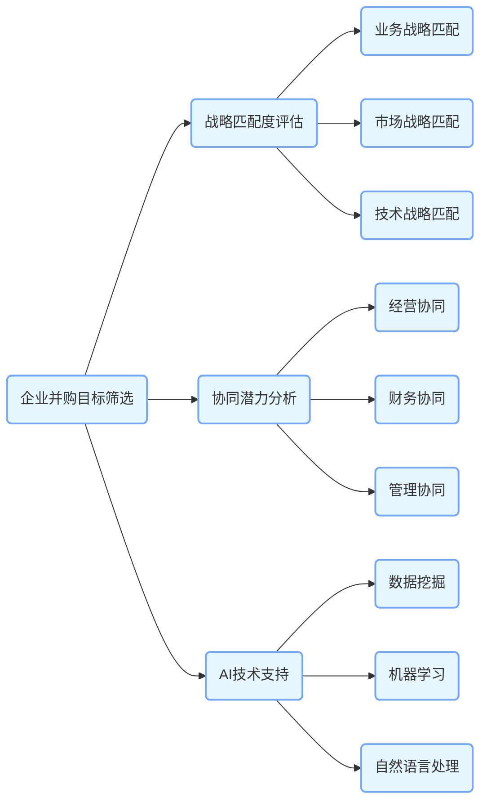

# AI辅助企业并购目标筛选：战略匹配度评估与协同潜力分析

> 关键词：AI、企业并购、目标筛选、战略匹配度、协同潜力、评估模型、数据分析

> 摘要：本文聚焦于AI在企业并购目标筛选过程中的应用，重点探讨战略匹配度评估与协同潜力分析。通过详细介绍相关核心概念、算法原理、数学模型，结合项目实战案例和实际应用场景，阐述AI如何提升企业并购目标筛选的效率和准确性。同时，推荐了学习资源、开发工具框架以及相关论文著作，最后对未来发展趋势与挑战进行总结，并给出常见问题解答和参考资料，旨在为企业利用AI进行并购目标筛选提供全面且深入的指导。

## 1. 背景介绍 
### 1.1 目的和范围
企业并购是企业实现快速扩张、优化资源配置的重要战略手段。然而，并购过程中面临着诸多挑战，其中目标企业的筛选是关键环节。传统的目标筛选方法往往依赖于人工经验和简单的数据分析，效率低下且容易出现偏差。随着人工智能技术的发展，其在数据处理、模式识别等方面的优势为企业并购目标筛选提供了新的思路和方法。本文旨在探讨如何利用AI技术辅助企业进行并购目标筛选，重点关注战略匹配度评估与协同潜力分析，范围涵盖从核心概念到实际应用的各个方面。

### 1.2 预期读者
本文预期读者包括企业高管、并购决策人员、投资银行家、财务分析师、人工智能研究人员以及对企业并购和AI技术应用感兴趣的相关人士。

### 1.3 文档结构概述
本文首先介绍相关背景知识，包括目的、预期读者和文档结构概述等内容。接着阐述核心概念与联系，通过文本示意图和Mermaid流程图展示其架构。然后详细讲解核心算法原理和具体操作步骤，并给出Python源代码。随后介绍数学模型和公式，结合具体例子进行说明。再通过项目实战，展示代码实际案例并进行详细解释。之后探讨实际应用场景，推荐相关工具和资源。最后总结未来发展趋势与挑战，提供常见问题解答和参考资料。

### 1.4 术语表
#### 1.4.1 核心术语定义
- **企业并购**：指企业之间的合并与收购行为，是企业通过产权交易获得其他企业的控制权，以实现自身战略目标的一种经济活动。
- **目标筛选**：在企业并购过程中，从众多潜在目标企业中挑选出符合企业战略需求和投资标准的目标企业的过程。
- **战略匹配度**：指目标企业的战略方向、业务模式、市场定位等与并购企业的战略规划相契合的程度。
- **协同潜力**：指并购后企业通过整合资源、优化业务流程等方式，实现价值增值的潜在能力。
- **AI（人工智能）**：是研究、开发用于模拟、延伸和扩展人的智能的理论、方法、技术及应用系统的一门新的技术科学。

#### 1.4.2 相关概念解释
- **数据挖掘**：从大量的、不完全的、有噪声的、模糊的、随机的数据中提取隐含在其中的、人们事先不知道的、但又是潜在有用的信息和知识的过程。在企业并购目标筛选中，数据挖掘可用于发现潜在目标企业的特征和规律。
- **机器学习**：是一门多领域交叉学科，涉及概率论、统计学、逼近论、凸分析、算法复杂度理论等多门学科。它专门研究计算机怎样模拟或实现人类的学习行为，以获取新的知识或技能，重新组织已有的知识结构使之不断改善自身的性能。在企业并购中，机器学习算法可用于构建评估模型，预测目标企业的战略匹配度和协同潜力。
- **自然语言处理**：是计算机科学领域与人工智能领域中的一个重要方向。它研究能实现人与计算机之间用自然语言进行有效通信的各种理论和方法。在企业并购中，自然语言处理可用于分析企业的年报、新闻稿等文本信息，获取有关企业战略和业务的关键信息。

#### 1.4.3 缩略词列表
- **AI**：Artificial Intelligence（人工智能）
- **ML**：Machine Learning（机器学习）
- **NLP**：Natural Language Processing（自然语言处理）

## 2. 核心概念与联系 
### 核心概念原理
企业并购目标筛选的核心在于评估目标企业与并购企业之间的战略匹配度和协同潜力。战略匹配度是从战略层面考量目标企业与并购企业的一致性，包括业务战略、市场战略、技术战略等方面。例如，如果并购企业的业务战略是拓展国际市场，那么目标企业是否在国际市场有一定的市场份额和渠道资源就成为评估战略匹配度的重要因素。

协同潜力则关注并购后企业通过整合资源、优化业务流程等方式实现价值增值的可能性。协同效应主要包括经营协同、财务协同和管理协同。经营协同是指并购后企业在生产、销售、研发等方面实现资源共享和优势互补，降低成本，提高效率；财务协同是指并购后企业在资金筹集、资金运用等方面实现优化，降低财务成本，提高资金使用效率；管理协同是指并购后企业在管理理念、管理方法、管理制度等方面实现整合，提高管理效率。

### 架构的文本示意图
```plaintext
企业并购目标筛选
|-- 战略匹配度评估
|   |-- 业务战略匹配
|   |-- 市场战略匹配
|   |-- 技术战略匹配
|   |-- ...
|-- 协同潜力分析
|   |-- 经营协同
|   |-- 财务协同
|   |-- 管理协同
|   |-- ...
|-- AI技术支持
|   |-- 数据挖掘
|   |-- 机器学习
|   |-- 自然语言处理
|   |-- ...
```

### Mermaid流程图


## 3. 核心算法原理 & 具体操作步骤 
### 核心算法原理
在企业并购目标筛选中，我们可以使用机器学习中的分类算法来评估战略匹配度和协同潜力。以逻辑回归算法为例，逻辑回归是一种广义线性回归模型，它通过对输入特征进行线性组合，然后使用逻辑函数将线性组合的结果映射到[0, 1]区间，从而得到一个概率值。在战略匹配度评估中，我们可以将目标企业的各种特征作为输入，通过逻辑回归模型计算出目标企业与并购企业战略匹配的概率；在协同潜力分析中，同样可以使用逻辑回归模型计算出目标企业具有协同潜力的概率。

### 具体操作步骤
1. **数据收集**：收集目标企业和并购企业的相关数据，包括财务数据、业务数据、市场数据、技术数据等。
2. **数据预处理**：对收集到的数据进行清洗、转换和归一化等处理，以提高数据质量和模型性能。
3. **特征选择**：从预处理后的数据中选择与战略匹配度和协同潜力相关的特征。
4. **模型训练**：使用训练数据对逻辑回归模型进行训练，调整模型参数，使其能够准确预测战略匹配度和协同潜力。
5. **模型评估**：使用测试数据对训练好的模型进行评估，计算模型的准确率、召回率、F1值等指标，评估模型的性能。
6. **目标筛选**：使用训练好的模型对潜在目标企业进行预测，根据预测结果筛选出战略匹配度高、协同潜力大的目标企业。

### Python源代码实现
```python
import pandas as pd
from sklearn.model_selection import train_test_split
from sklearn.linear_model import LogisticRegression
from sklearn.preprocessing import StandardScaler
from sklearn.metrics import accuracy_score, recall_score, f1_score

# 1. 数据收集（假设数据已存储在CSV文件中）
data = pd.read_csv('enterprise_data.csv')

# 2. 数据预处理
# 处理缺失值
data = data.dropna()

# 分离特征和标签
X = data.drop('target_label', axis=1)
y = data['target_label']

# 数据归一化
scaler = StandardScaler()
X_scaled = scaler.fit_transform(X)

# 3. 特征选择（这里简单选择所有特征，实际应用中可根据需要进行特征选择）
selected_features = X_scaled

# 4. 模型训练
# 划分训练集和测试集
X_train, X_test, y_train, y_test = train_test_split(selected_features, y, test_size=0.2, random_state=42)

# 创建逻辑回归模型
model = LogisticRegression()

# 训练模型
model.fit(X_train, y_train)

# 5. 模型评估
# 预测
y_pred = model.predict(X_test)

# 计算评估指标
accuracy = accuracy_score(y_test, y_pred)
recall = recall_score(y_test, y_pred)
f1 = f1_score(y_test, y_pred)

print(f"Accuracy: {accuracy}")
print(f"Recall: {recall}")
print(f"F1 Score: {f1}")

# 6. 目标筛选（假设新数据存储在new_data.csv文件中）
new_data = pd.read_csv('new_data.csv')
new_data = new_data.dropna()
new_X = scaler.transform(new_data)
predictions = model.predict(new_X)
print("Predictions:", predictions)
```

## 4. 数学模型和公式 & 详细讲解 & 举例说明 
### 逻辑回归模型的数学原理
逻辑回归模型的核心是逻辑函数（也称为Sigmoid函数），其公式为：
$$\sigma(z)=\frac{1}{1 + e^{-z}}$$
其中，$z$ 是输入特征的线性组合，即：
$$z = \theta_0 + \theta_1x_1 + \theta_2x_2 + \cdots + \theta_nx_n=\theta^T X$$
这里，$\theta = [\theta_0, \theta_1, \cdots, \theta_n]^T$ 是模型的参数向量，$X = [1, x_1, x_2, \cdots, x_n]^T$ 是输入特征向量。

逻辑回归模型通过逻辑函数将线性组合的结果 $z$ 映射到[0, 1]区间，得到一个概率值 $P(y = 1|X)$，表示在输入特征 $X$ 的条件下，样本属于正类（即战略匹配或具有协同潜力）的概率。其公式为：
$$P(y = 1|X)=\sigma(\theta^T X)=\frac{1}{1 + e^{-\theta^T X}}$$

### 损失函数
逻辑回归模型通常使用对数损失函数（也称为交叉熵损失函数）来衡量模型预测结果与真实标签之间的差异。对于单个样本 $(X, y)$，其对数损失函数为：
$$L(\theta; X, y)=-y\log(P(y = 1|X))-(1 - y)\log(1 - P(y = 1|X))$$
对于整个训练数据集 $D = \{(X_1, y_1), (X_2, y_2), \cdots, (X_m, y_m)\}$，其对数损失函数为：
$$J(\theta)=-\frac{1}{m}\sum_{i = 1}^{m}[y_i\log(P(y_i = 1|X_i))+(1 - y_i)\log(1 - P(y_i = 1|X_i))]$$

### 模型训练
逻辑回归模型的训练过程就是通过优化损失函数 $J(\theta)$ 来求解最优的参数向量 $\theta$。常用的优化算法是梯度下降法，其迭代公式为：
$$\theta_{j}=\theta_{j}-\alpha\frac{\partial J(\theta)}{\partial \theta_{j}}$$
其中，$\alpha$ 是学习率，$\frac{\partial J(\theta)}{\partial \theta_{j}}$ 是损失函数 $J(\theta)$ 关于参数 $\theta_j$ 的偏导数。

### 举例说明
假设我们有一个简单的二分类问题，用于评估目标企业与并购企业的战略匹配度。输入特征 $X = [x_1, x_2]$，其中 $x_1$ 表示目标企业的市场份额，$x_2$ 表示目标企业的研发投入。真实标签 $y$ 表示目标企业是否与并购企业战略匹配（$y = 1$ 表示匹配，$y = 0$ 表示不匹配）。

我们已经训练好逻辑回归模型，得到参数向量 $\theta = [\theta_0, \theta_1, \theta_2]=[0.1, 0.2, 0.3]$。现在有一个新的目标企业，其市场份额 $x_1 = 0.5$，研发投入 $x_2 = 0.6$。我们可以计算 $z$ 的值：
$$z=\theta_0+\theta_1x_1+\theta_2x_2=0.1 + 0.2\times0.5+0.3\times0.6=0.1 + 0.1+0.18 = 0.38$$
然后计算概率值 $P(y = 1|X)$：
$$P(y = 1|X)=\sigma(z)=\frac{1}{1 + e^{-0.38}}\approx0.59$$
根据这个概率值，我们可以判断该目标企业与并购企业有一定的战略匹配度。

## 5. 项目实战：代码实际案例和详细解释说明 
### 5.1  开发环境搭建
1. **安装Python**：建议使用Python 3.7及以上版本。可以从Python官方网站（https://www.python.org/downloads/）下载并安装。
2. **安装必要的库**：使用pip命令安装所需的库，包括pandas、scikit-learn等。
```bash
pip install pandas scikit-learn
```
3. **选择开发工具**：可以选择PyCharm、Jupyter Notebook等开发工具。如果使用Jupyter Notebook，可以使用以下命令安装：
```bash
pip install jupyter notebook
```
然后在命令行中输入 `jupyter notebook` 启动Jupyter Notebook。

### 5.2  源代码详细实现和代码解读
```python
import pandas as pd
from sklearn.model_selection import train_test_split
from sklearn.linear_model import LogisticRegression
from sklearn.preprocessing import StandardScaler
from sklearn.metrics import accuracy_score, recall_score, f1_score

# 1. 数据收集（假设数据已存储在CSV文件中）
data = pd.read_csv('enterprise_data.csv')

# 代码解读：使用pandas库的read_csv函数读取存储在CSV文件中的企业数据。

# 2. 数据预处理
# 处理缺失值
data = data.dropna()

# 代码解读：使用dropna函数删除数据集中包含缺失值的行，以确保数据的完整性。

# 分离特征和标签
X = data.drop('target_label', axis=1)
y = data['target_label']

# 代码解读：将数据集中的特征（除了目标标签列）存储在X中，将目标标签列存储在y中。

# 数据归一化
scaler = StandardScaler()
X_scaled = scaler.fit_transform(X)

# 代码解读：使用StandardScaler类对特征数据进行归一化处理，将特征数据缩放到均值为0，标准差为1的范围，以提高模型的性能。

# 3. 特征选择（这里简单选择所有特征，实际应用中可根据需要进行特征选择）
selected_features = X_scaled

# 代码解读：在这个简单的示例中，我们选择所有归一化后的特征作为模型的输入。在实际应用中，可以使用特征选择算法（如相关性分析、卡方检验等）选择与目标变量相关性高的特征。

# 4. 模型训练
# 划分训练集和测试集
X_train, X_test, y_train, y_test = train_test_split(selected_features, y, test_size=0.2, random_state=42)

# 代码解读：使用train_test_split函数将数据集划分为训练集和测试集，其中测试集占总数据集的20%。random_state参数用于保证每次划分的结果相同，以便于模型的复现。

# 创建逻辑回归模型
model = LogisticRegression()

# 代码解读：创建一个逻辑回归模型对象。

# 训练模型
model.fit(X_train, y_train)

# 代码解读：使用训练集数据对逻辑回归模型进行训练，调整模型的参数，使其能够准确预测目标变量。

# 5. 模型评估
# 预测
y_pred = model.predict(X_test)

# 代码解读：使用训练好的模型对测试集数据进行预测，得到预测结果。

# 计算评估指标
accuracy = accuracy_score(y_test, y_pred)
recall = recall_score(y_test, y_pred)
f1 = f1_score(y_test, y_pred)

print(f"Accuracy: {accuracy}")
print(f"Recall: {recall}")
print(f"F1 Score: {f1}")

# 代码解读：使用accuracy_score、recall_score和f1_score函数分别计算模型的准确率、召回率和F1值，以评估模型的性能。

# 6. 目标筛选（假设新数据存储在new_data.csv文件中）
new_data = pd.read_csv('new_data.csv')
new_data = new_data.dropna()
new_X = scaler.transform(new_data)
predictions = model.predict(new_X)
print("Predictions:", predictions)

# 代码解读：读取新的企业数据，处理缺失值，使用之前训练好的scaler对象对新数据进行归一化处理，然后使用训练好的模型对新数据进行预测，得到预测结果。
```

### 5.3  代码解读与分析
- **数据预处理的重要性**：数据预处理是机器学习项目中非常重要的一步，它可以提高数据的质量和模型的性能。在本案例中，我们处理了缺失值并对数据进行了归一化处理，这些操作可以避免因数据缺失或特征尺度不同而导致的模型训练不稳定问题。
- **特征选择的影响**：特征选择可以减少模型的复杂度，提高模型的泛化能力。在实际应用中，我们应该根据业务需求和数据特点选择合适的特征，避免使用无关或冗余的特征。
- **模型评估的意义**：模型评估可以帮助我们了解模型的性能，判断模型是否能够满足实际需求。在本案例中，我们使用了准确率、召回率和F1值等指标来评估模型的性能，这些指标可以从不同的角度反映模型的优劣。

## 6. 实际应用场景 
### 战略扩张型并购
企业为了实现战略扩张，需要寻找与自身战略方向匹配的目标企业。例如，一家国内的汽车制造企业计划拓展海外市场，它可以利用AI技术筛选出在海外市场有一定市场份额、销售渠道和品牌影响力的目标企业。通过评估战略匹配度和协同潜力，选择最适合的并购目标，实现资源共享和优势互补，加速海外市场的拓展。

### 多元化经营型并购
企业为了降低经营风险，实现多元化经营，会寻找与自身业务领域不同但具有协同潜力的目标企业。例如，一家传统的家电制造企业可以利用AI技术筛选出在智能家居、新能源等领域具有发展潜力的目标企业。通过并购这些企业，进入新的业务领域，实现多元化发展，提高企业的抗风险能力。

### 资源整合型并购
企业为了整合资源，提高资源利用效率，会寻找与自身在资源方面具有互补性的目标企业。例如，一家拥有丰富矿产资源的企业可以利用AI技术筛选出在矿产加工、销售等环节具有优势的目标企业。通过并购这些企业，实现资源的优化配置，提高企业的整体竞争力。

### 技术创新型并购
企业为了提升自身的技术创新能力，会寻找在技术研发方面具有优势的目标企业。例如，一家科技企业可以利用AI技术筛选出在人工智能、大数据、云计算等领域具有领先技术的目标企业。通过并购这些企业，获取先进的技术和研发团队，加速自身的技术创新和产品升级。

## 7. 工具和资源推荐
### 7.1 学习资源推荐
#### 7.1.1 书籍推荐
- 《机器学习》（周志华著）：这本书全面介绍了机器学习的基本概念、算法和应用，是机器学习领域的经典教材。
- 《Python机器学习》（Sebastian Raschka著）：本书结合Python语言，详细介绍了机器学习的各种算法和实践应用，适合初学者和有一定编程基础的读者。
- 《企业并购理论与实务》（王化成等著）：这本书系统阐述了企业并购的理论、方法和实务，对企业并购的各个环节进行了详细的介绍，是企业并购领域的权威著作。

#### 7.1.2 在线课程
- Coursera上的“机器学习”课程（由Andrew Ng教授授课）：这是一门非常经典的机器学习课程，涵盖了机器学习的基本概念、算法和应用，通过视频讲解、编程作业和测验等方式帮助学员掌握机器学习的知识和技能。
- edX上的“数据科学与机器学习微硕士学位课程”：该课程由多个模块组成，包括数据科学基础、机器学习算法、深度学习等，适合想要深入学习数据科学和机器学习的学员。
- 中国大学MOOC上的“企业并购与重组”课程：该课程由国内知名高校的教授授课，系统介绍了企业并购与重组的理论、方法和实践，帮助学员了解企业并购的全过程。

#### 7.1.3 技术博客和网站
- Medium：这是一个知名的技术博客平台，上面有很多关于人工智能、机器学习、企业并购等领域的优质文章，可以帮助读者了解最新的技术动态和行业趋势。
- Kaggle：这是一个数据科学和机器学习竞赛平台，上面有很多数据集和优秀的解决方案，可以帮助读者学习和实践数据科学和机器学习的知识和技能。
- 并购界（https://www.ma-china.com/）：这是一个专注于企业并购领域的网站，提供企业并购的新闻资讯、案例分析、研究报告等内容，帮助读者了解企业并购的最新动态和实践经验。

### 7.2 开发工具框架推荐
#### 7.2.1 IDE和编辑器
- PyCharm：这是一款专业的Python集成开发环境，具有代码编辑、调试、自动补全、代码分析等功能，适合开发Python项目。
- Jupyter Notebook：这是一个基于Web的交互式计算环境，支持多种编程语言，适合进行数据探索、模型训练和可视化等工作。
- Visual Studio Code：这是一款轻量级的代码编辑器，具有丰富的插件和扩展功能，支持多种编程语言，适合开发各种类型的项目。

#### 7.2.2 调试和性能分析工具
- PDB：这是Python自带的调试器，可以帮助开发者在代码中设置断点、单步执行、查看变量值等，方便调试代码。
- cProfile：这是Python自带的性能分析工具，可以帮助开发者分析代码的运行时间和性能瓶颈，优化代码性能。
- TensorBoard：这是TensorFlow提供的可视化工具，可以帮助开发者可视化模型的训练过程、网络结构、性能指标等，方便调试和优化深度学习模型。

#### 7.2.3 相关框架和库
- Scikit-learn：这是一个常用的Python机器学习库，提供了丰富的机器学习算法和工具，如分类、回归、聚类、降维等，适合初学者和快速开发。
- TensorFlow：这是一个开源的深度学习框架，由Google开发和维护，提供了高效的计算能力和丰富的深度学习模型，适合开发复杂的深度学习应用。
- PyTorch：这是一个开源的深度学习框架，由Facebook开发和维护，具有动态图、易于使用等特点，适合研究和开发深度学习模型。

### 7.3 相关论文著作推荐
#### 7.3.1 经典论文
- Jensen, M. C., & Ruback, R. S. (1983). The market for corporate control: The scientific evidence. Journal of Financial Economics, 11(1-4), 5-50. 这篇论文是企业并购领域的经典文献，对企业并购的市场机制、动机和绩效进行了深入的研究和分析。
- Brealey, R. A., Myers, S. C., & Allen, F. (2006). Principles of corporate finance. McGraw-Hill. 这本书是公司金融领域的经典教材，其中包含了企业并购的相关内容，对企业并购的财务决策、估值方法等进行了详细的介绍。

#### 7.3.2 最新研究成果
- 可以通过IEEE Xplore、ACM Digital Library、ScienceDirect等学术数据库搜索关于AI在企业并购中的应用、战略匹配度评估、协同潜力分析等方面的最新研究论文，了解该领域的最新研究动态和成果。

#### 7.3.3 应用案例分析
- 可以通过阅读企业并购的案例分析报告、行业研究报告等，了解AI在实际企业并购中的应用案例和实践经验，学习如何运用AI技术进行目标筛选、战略匹配度评估和协同潜力分析。

## 8. 总结：未来发展趋势与挑战
### 未来发展趋势
- **AI技术的深度融合**：未来，AI技术将与企业并购的各个环节深度融合，不仅在目标筛选阶段发挥重要作用，还将在尽职调查、估值定价、整合规划等环节提供更强大的支持。例如，利用自然语言处理技术对企业的合同、协议等文本进行自动分析，利用深度学习技术对企业的财务数据进行更准确的预测和分析。
- **数据驱动的决策**：随着企业数据的不断积累和AI技术的发展，企业并购决策将越来越依赖于数据。通过对大量数据的分析和挖掘，企业可以更准确地评估目标企业的战略匹配度和协同潜力，做出更明智的决策。
- **智能化的并购服务平台**：未来将出现更多智能化的并购服务平台，这些平台将集成AI技术、大数据分析、区块链等先进技术，为企业提供一站式的并购服务。例如，平台可以自动筛选目标企业、进行战略匹配度评估和协同潜力分析，还可以提供并购融资、法律咨询等服务。

### 挑战
- **数据质量和安全问题**：AI技术的应用依赖于大量高质量的数据，但企业在数据收集、存储和管理过程中可能存在数据质量不高、数据安全等问题。例如，数据可能存在缺失、错误、不一致等问题，数据可能被泄露、篡改等。因此，如何保证数据的质量和安全是AI辅助企业并购面临的重要挑战之一。
- **模型解释性问题**：一些AI模型（如深度学习模型）是黑盒模型，其决策过程难以解释。在企业并购决策中，决策者需要了解模型的决策依据，以便做出合理的决策。因此，如何提高AI模型的解释性是AI辅助企业并购面临的另一个重要挑战。
- **人才短缺问题**：AI技术的应用需要具备专业知识和技能的人才，但目前市场上这类人才相对短缺。企业需要加强人才培养和引进，提高员工的AI技术水平，以适应AI辅助企业并购的发展需求。

## 9. 附录：常见问题与解答
### 1. 如何选择合适的AI算法进行战略匹配度评估和协同潜力分析？
选择合适的AI算法需要考虑多个因素，如数据的特点、问题的复杂度、模型的可解释性等。对于简单的分类问题，可以选择逻辑回归、决策树等算法；对于复杂的非线性问题，可以选择神经网络、支持向量机等算法。同时，还需要根据实际情况进行算法的调优和模型的评估，选择性能最优的算法。

### 2. 如何保证数据的质量和安全？
保证数据的质量需要进行数据清洗、转换和验证等操作，去除数据中的噪声、缺失值和错误值，确保数据的准确性和一致性。保证数据的安全需要采取数据加密、访问控制、备份恢复等措施，防止数据被泄露、篡改和丢失。

### 3. 如何提高AI模型的解释性？
可以采用一些方法提高AI模型的解释性，如使用可解释的模型（如决策树、线性回归等）、特征重要性分析、局部解释方法（如LIME、SHAP等）。这些方法可以帮助我们了解模型的决策依据，提高模型的可信度和可接受性。

### 4. 如何培养和引进AI人才？
企业可以通过与高校、科研机构合作，开展人才培养和引进计划。例如，设立奖学金、实习基地等吸引优秀的学生和研究人员；开展内部培训、技术交流等活动，提高员工的AI技术水平。

## 10. 扩展阅读 & 参考资料
### 扩展阅读
- 《人工智能：现代方法》（Stuart Russell和Peter Norvig著）：这本书全面介绍了人工智能的基本概念、算法和应用，是人工智能领域的经典教材。
- 《大数据时代：生活、工作与思维的大变革》（维克托·迈尔 - 舍恩伯格和肯尼斯·库克耶著）：这本书探讨了大数据对社会、经济和生活的影响，帮助读者了解大数据时代的发展趋势和机遇。

### 参考资料
- 相关企业的年报、新闻稿、行业研究报告等。
- 学术期刊上发表的关于企业并购、AI技术应用等方面的研究论文。
- 政府部门发布的相关政策文件和统计数据。