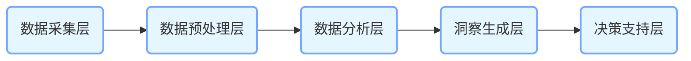

# AI辅助企业竞争情报分析：自动化数据采集与洞察生成

> 关键词：AI、企业竞争情报分析、自动化数据采集、洞察生成、数据挖掘

> 摘要：本文聚焦于AI在企业竞争情报分析中的应用，详细阐述了利用AI实现自动化数据采集与洞察生成的原理、方法和实际应用。通过深入剖析核心概念、算法原理、数学模型等内容，并结合项目实战案例，展示了AI在该领域的强大作用。同时，介绍了相关的工具和资源，分析了未来发展趋势与挑战，旨在为企业利用AI提升竞争情报分析能力提供全面的技术指导。

## 1. 背景介绍 
### 1.1 目的和范围
在当今竞争激烈的商业环境中，企业需要及时、准确地获取竞争情报，以便做出明智的决策。传统的竞争情报分析方法往往耗费大量的人力、物力和时间，且难以处理海量的数据。AI技术的发展为解决这些问题提供了新的途径。本文的目的是探讨如何利用AI实现企业竞争情报分析中的自动化数据采集与洞察生成，范围涵盖相关的技术原理、算法实现、实际应用案例等方面。

### 1.2 预期读者
本文预期读者包括企业的市场分析人员、竞争情报分析师、数据科学家、技术研发人员以及对AI在商业领域应用感兴趣的相关人士。

### 1.3 文档结构概述
本文首先介绍背景信息，包括目的、预期读者和文档结构。接着阐述核心概念与联系，包括相关原理和架构。然后详细讲解核心算法原理和具体操作步骤，给出数学模型和公式并举例说明。通过项目实战展示代码实现和详细解释。介绍实际应用场景，推荐相关工具和资源。最后总结未来发展趋势与挑战，提供常见问题解答和扩展阅读参考资料。

### 1.4 术语表
#### 1.4.1 核心术语定义
- **AI（Artificial Intelligence）**：人工智能，是研究、开发用于模拟、延伸和扩展人的智能的理论、方法、技术及应用系统的一门新的技术科学。
- **企业竞争情报分析**：指企业为了获取竞争优势，对竞争对手、竞争环境及企业自身的信息进行收集、整理、分析和评估的过程。
- **自动化数据采集**：利用计算机程序自动从各种数据源中获取数据的过程。
- **洞察生成**：通过对采集到的数据进行分析和挖掘，提取有价值的信息和知识，为企业决策提供支持。

#### 1.4.2 相关概念解释
- **数据挖掘**：从大量的、不完全的、有噪声的、模糊的、随机的数据中，提取隐含在其中的、人们事先不知道的、但又是潜在有用的信息和知识的过程。
- **自然语言处理（NLP）**：是计算机科学与语言学的交叉领域，旨在让计算机理解、处理和生成人类语言。

#### 1.4.3 缩略词列表
- **AI**：Artificial Intelligence（人工智能）
- **NLP**：Natural Language Processing（自然语言处理）

## 2. 核心概念与联系 

### 核心概念原理
企业竞争情报分析的核心在于收集、整理和分析与企业竞争相关的信息，以帮助企业了解竞争对手的动态、市场趋势和自身的优势与劣势。自动化数据采集是实现这一目标的第一步，通过利用AI技术，可以从各种数据源（如网站、社交媒体、新闻媒体等）自动获取大量的数据。

洞察生成则是对采集到的数据进行深入分析和挖掘，提取有价值的信息和知识。这需要运用多种AI技术，如机器学习、自然语言处理等。机器学习可以用于数据分类、聚类、预测等任务，自然语言处理可以用于文本分析、情感分析等任务。

### 架构的文本示意图
企业竞争情报分析的AI辅助架构主要包括以下几个部分：
1. **数据采集层**：负责从各种数据源中采集数据，包括网络爬虫、API接口等。
2. **数据预处理层**：对采集到的数据进行清洗、转换和标注，以提高数据的质量和可用性。
3. **数据分析层**：运用机器学习、自然语言处理等AI技术对预处理后的数据进行分析和挖掘，提取有价值的信息和知识。
4. **洞察生成层**：将分析结果转化为可视化的报告和建议，为企业决策提供支持。
5. **决策支持层**：企业根据洞察生成层提供的信息和建议，做出决策并采取相应的行动。

### Mermaid流程图


## 3. 核心算法原理 & 具体操作步骤 

### 核心算法原理
在自动化数据采集与洞察生成中，常用的算法包括网络爬虫算法、机器学习算法和自然语言处理算法。

#### 网络爬虫算法
网络爬虫是一种自动获取网页内容的程序，常用的算法有广度优先搜索（BFS）和深度优先搜索（DFS）。以广度优先搜索为例，其基本思想是从起始网页开始，逐层访问网页，直到达到预定的深度或访问完所有的网页。

#### 机器学习算法
机器学习算法可以用于数据分类、聚类、预测等任务。例如，支持向量机（SVM）是一种常用的分类算法，其基本思想是找到一个最优的超平面，将不同类别的数据分开。

#### 自然语言处理算法
自然语言处理算法可以用于文本分析、情感分析等任务。例如，词袋模型（Bag of Words）是一种常用的文本表示方法，其基本思想是将文本表示为一个向量，向量的每个元素表示一个单词的出现频率。

### 具体操作步骤
#### 数据采集
以下是一个使用Python的`requests`和`BeautifulSoup`库实现简单网络爬虫的示例代码：
```python
import requests
from bs4 import BeautifulSoup

# 定义要爬取的网页URL
url = 'https://example.com'

# 发送HTTP请求
response = requests.get(url)

# 检查请求是否成功
if response.status_code == 200:
    # 解析HTML内容
    soup = BeautifulSoup(response.text, 'html.parser')
    
    # 提取所需的数据
    data = []
    for element in soup.find_all('p'):
        data.append(element.text)
    
    print(data)
else:
    print('请求失败')
```
#### 数据预处理
以下是一个使用Python的`pandas`库进行数据清洗和转换的示例代码：
```python
import pandas as pd

# 假设data是采集到的数据列表
data = ['  Hello, World!  ', '  This is a test.  ']

# 创建DataFrame
df = pd.DataFrame(data, columns=['text'])

# 去除前后空格
df['text'] = df['text'].str.strip()

print(df)
```
#### 数据分析
以下是一个使用Python的`sklearn`库实现支持向量机分类的示例代码：
```python
from sklearn import datasets
from sklearn.model_selection import train_test_split
from sklearn.svm import SVC
from sklearn.metrics import accuracy_score

# 加载数据集
iris = datasets.load_iris()
X = iris.data
y = iris.target

# 划分训练集和测试集
X_train, X_test, y_train, y_test = train_test_split(X, y, test_size=0.2, random_state=42)

# 创建支持向量机模型
model = SVC()

# 训练模型
model.fit(X_train, y_train)

# 预测
y_pred = model.predict(X_test)

# 计算准确率
accuracy = accuracy_score(y_test, y_pred)
print('准确率:', accuracy)
```
#### 洞察生成
以下是一个使用Python的`matplotlib`库进行数据可视化的示例代码：
```python
import matplotlib.pyplot as plt
import numpy as np

# 生成示例数据
x = np.linspace(0, 10, 100)
y = np.sin(x)

# 绘制图形
plt.plot(x, y)
plt.xlabel('x')
plt.ylabel('y')
plt.title('Sine Wave')
plt.show()
```

## 4. 数学模型和公式 & 详细讲解 & 举例说明 

### 支持向量机（SVM）数学模型和公式
支持向量机的目标是找到一个最优的超平面，将不同类别的数据分开。对于线性可分的数据集，超平面的方程可以表示为：
$$w^T x + b = 0$$
其中，$w$ 是超平面的法向量，$b$ 是偏置项，$x$ 是数据点的特征向量。

为了找到最优的超平面，需要最大化间隔（Margin），间隔的定义为：
$$\text{Margin} = \frac{2}{\|w\|}$$
因此，支持向量机的优化问题可以表示为：
$$\min_{w,b} \frac{1}{2} \|w\|^2$$
$$\text{s.t. } y_i (w^T x_i + b) \geq 1, i = 1,2,\cdots,n$$
其中，$y_i$ 是数据点 $x_i$ 的标签，$n$ 是数据点的数量。

### 详细讲解
支持向量机的核心思想是通过找到一个最优的超平面，使得不同类别的数据点到超平面的间隔最大。在实际应用中，数据集往往是线性不可分的，此时可以引入松弛变量 $\xi_i$ 来处理：
$$\min_{w,b,\xi} \frac{1}{2} \|w\|^2 + C \sum_{i=1}^{n} \xi_i$$
$$\text{s.t. } y_i (w^T x_i + b) \geq 1 - \xi_i, \xi_i \geq 0, i = 1,2,\cdots,n$$
其中，$C$ 是惩罚参数，用于控制模型的复杂度和泛化能力。

### 举例说明
假设我们有一个二维数据集，包含两个类别的数据点。通过支持向量机算法，我们可以找到一个最优的超平面，将这两个类别的数据点分开。以下是一个使用Python的`sklearn`库实现支持向量机分类的示例代码：
```python
import numpy as np
import matplotlib.pyplot as plt
from sklearn import svm

# 生成示例数据
X = np.array([[3, 4], [1, 4], [2, 3], [6, -1], [7, -1], [5, -3]])
y = np.array([1, 1, 1, -1, -1, -1])

# 创建支持向量机模型
model = svm.SVC(kernel='linear')

# 训练模型
model.fit(X, y)

# 绘制数据点
plt.scatter(X[:, 0], X[:, 1], c=y, cmap=plt.cm.Paired)

# 绘制超平面
ax = plt.gca()
xlim = ax.get_xlim()
ylim = ax.get_ylim()

# 创建网格点
xx = np.linspace(xlim[0], xlim[1], 30)
yy = np.linspace(ylim[0], ylim[1], 30)
YY, XX = np.meshgrid(yy, xx)
xy = np.vstack([XX.ravel(), YY.ravel()]).T
Z = model.decision_function(xy).reshape(XX.shape)

# 绘制超平面和边界
ax.contour(XX, YY, Z, colors='k', levels=[-1, 0, 1], alpha=0.5, linestyles=['--', '-', '--'])

# 绘制支持向量
ax.scatter(model.support_vectors_[:, 0], model.support_vectors_[:, 1], s=100, linewidth=1, facecolors='none', edgecolors='k')

plt.show()
```

## 5. 项目实战：代码实际案例和详细解释说明 

### 5.1  开发环境搭建
在进行项目实战之前，需要搭建相应的开发环境。以下是一些常用的开发工具和库：
- **Python**：作为主要的编程语言，建议使用Python 3.x版本。
- **Anaconda**：一个开源的Python发行版本，包含了许多常用的科学计算库和工具。
- **集成开发环境（IDE）**：可以选择PyCharm、Jupyter Notebook等。

安装所需的库：
```bash
pip install requests beautifulsoup4 pandas sklearn matplotlib
```

### 5.2  源代码详细实现和代码解读
以下是一个完整的企业竞争情报分析项目的示例代码，包括数据采集、预处理、分析和洞察生成：
```python
import requests
from bs4 import BeautifulSoup
import pandas as pd
from sklearn.feature_extraction.text import CountVectorizer
from sklearn.naive_bayes import MultinomialNB
import matplotlib.pyplot as plt

# 数据采集
def data_collection():
    url = 'https://example.com'
    response = requests.get(url)
    if response.status_code == 200:
        soup = BeautifulSoup(response.text, 'html.parser')
        data = []
        for element in soup.find_all('p'):
            data.append(element.text)
        return data
    else:
        return []

# 数据预处理
def data_preprocessing(data):
    df = pd.DataFrame(data, columns=['text'])
    df['text'] = df['text'].str.strip()
    return df

# 数据分析
def data_analysis(df):
    vectorizer = CountVectorizer()
    X = vectorizer.fit_transform(df['text'])
    y = [1] * len(df)  # 假设所有数据都属于同一类别
    model = MultinomialNB()
    model.fit(X, y)
    return model

# 洞察生成
def insight_generation(model, vectorizer, new_text):
    X_new = vectorizer.transform([new_text])
    prediction = model.predict(X_new)
    plt.bar(['Positive', 'Negative'], [prediction[0], 1 - prediction[0]])
    plt.xlabel('Sentiment')
    plt.ylabel('Probability')
    plt.title('Sentiment Analysis')
    plt.show()

# 主函数
if __name__ == '__main__':
    # 数据采集
    data = data_collection()
    
    # 数据预处理
    df = data_preprocessing(data)
    
    # 数据分析
    model = data_analysis(df)
    
    # 洞察生成
    new_text = 'This is a test sentence.'
    insight_generation(model, vectorizer, new_text)
```

### 5.3  代码解读与分析
- **数据采集**：使用`requests`和`BeautifulSoup`库从指定的网页中采集数据。
- **数据预处理**：使用`pandas`库对采集到的数据进行清洗和转换。
- **数据分析**：使用`CountVectorizer`将文本数据转换为向量，使用`MultinomialNB`进行分类。
- **洞察生成**：使用`matplotlib`库将分析结果可视化。

## 6. 实际应用场景 
### 市场趋势分析
通过自动化数据采集和洞察生成，企业可以及时了解市场的动态和趋势，包括消费者需求、竞争对手的策略等。例如，通过分析社交媒体上的用户评论和新闻报道，企业可以了解消费者对产品的满意度和需求变化，从而调整产品策略。

### 竞争对手分析
企业可以利用AI技术收集竞争对手的信息，包括产品特点、市场份额、营销策略等。通过对这些信息的分析，企业可以了解竞争对手的优势和劣势，从而制定相应的竞争策略。

### 风险预警
通过对市场数据和企业内部数据的实时监测，AI可以及时发现潜在的风险和危机。例如，通过分析金融市场数据，企业可以预测市场波动和经济危机，从而采取相应的措施降低风险。

## 7. 工具和资源推荐
### 7.1 学习资源推荐
#### 7.1.1 书籍推荐
- 《Python机器学习实战》：介绍了Python在机器学习领域的应用，包括数据处理、模型训练和评估等方面的内容。
- 《自然语言处理入门》：详细讲解了自然语言处理的基本概念、算法和应用。
- 《人工智能：现代方法》：全面介绍了人工智能的理论、算法和应用，是人工智能领域的经典教材。

#### 7.1.2 在线课程
- Coursera上的“机器学习”课程：由斯坦福大学的Andrew Ng教授授课，是机器学习领域的经典课程。
- edX上的“自然语言处理”课程：介绍了自然语言处理的基本概念、算法和应用。
- 阿里云大学的“人工智能实战营”：提供了丰富的人工智能实战项目和案例，帮助学习者提升实践能力。

#### 7.1.3 技术博客和网站
- Medium：是一个技术博客平台，上面有许多关于AI、机器学习和数据科学的优秀文章。
- Towards Data Science：专注于数据科学和机器学习领域的技术博客，提供了许多实用的教程和案例。
- Kaggle：是一个数据科学竞赛平台，上面有许多优秀的数据科学项目和开源代码。

### 7.2 开发工具框架推荐
#### 7.2.1 IDE和编辑器
- PyCharm：是一款专业的Python集成开发环境，提供了丰富的功能和插件，适合开发大型的Python项目。
- Jupyter Notebook：是一个交互式的开发环境，适合进行数据探索和模型实验。
- Visual Studio Code：是一款轻量级的代码编辑器，支持多种编程语言和插件，适合快速开发和调试。

#### 7.2.2 调试和性能分析工具
- Py-Spy：是一个Python性能分析工具，可以帮助开发者找出代码中的性能瓶颈。
- PDB：是Python自带的调试器，可以帮助开发者调试代码中的错误。
- TensorBoard：是TensorFlow的可视化工具，可以帮助开发者可视化模型的训练过程和性能指标。

#### 7.2.3 相关框架和库
- Scikit-learn：是一个常用的机器学习库，提供了丰富的机器学习算法和工具。
- NLTK：是一个自然语言处理库，提供了许多自然语言处理的工具和数据集。
- TensorFlow：是一个开源的深度学习框架，广泛应用于图像识别、自然语言处理等领域。

### 7.3 相关论文著作推荐
#### 7.3.1 经典论文
- “Support-Vector Networks”：介绍了支持向量机的基本原理和算法，是支持向量机领域的经典论文。
- “A Neural Probabilistic Language Model”：提出了神经网络语言模型的概念，为自然语言处理的发展奠定了基础。
- “ImageNet Classification with Deep Convolutional Neural Networks”：介绍了卷积神经网络在图像分类中的应用，开创了深度学习在计算机视觉领域的先河。

#### 7.3.2 最新研究成果
- 可以关注顶级学术会议（如NeurIPS、ICML、ACL等）和学术期刊（如Journal of Artificial Intelligence Research、Artificial Intelligence等）上的最新研究成果。

#### 7.3.3 应用案例分析
- 可以参考一些企业的官方博客和技术报告，了解AI在企业竞争情报分析中的实际应用案例。

## 8. 总结：未来发展趋势与挑战
### 未来发展趋势
- **智能化程度不断提高**：AI技术将不断发展，企业竞争情报分析系统的智能化程度将不断提高，能够自动识别和分析更加复杂的数据和信息。
- **多源数据融合**：未来的竞争情报分析将不仅仅依赖于传统的文本数据，还将融合图像、音频、视频等多源数据，以获取更全面的信息。
- **与业务的深度融合**：AI将与企业的业务流程深度融合，为企业提供更加个性化、精准的竞争情报分析服务。

### 挑战
- **数据安全和隐私问题**：随着数据采集和分析的不断深入，数据安全和隐私问题将变得更加突出。企业需要采取有效的措施保护数据的安全和隐私。
- **算法可解释性问题**：AI算法往往是黑盒模型，其决策过程难以解释。在企业竞争情报分析中，需要提高算法的可解释性，以便企业决策者能够理解和信任分析结果。
- **人才短缺问题**：AI领域的人才短缺是一个普遍存在的问题，企业需要加强人才培养和引进，以满足竞争情报分析的需求。

## 9. 附录：常见问题与解答
### 1. 如何选择合适的数据采集工具？
选择合适的数据采集工具需要考虑数据源的类型、数据量、采集频率等因素。对于网页数据采集，可以选择`requests`和`BeautifulSoup`等库；对于API接口数据采集，可以使用相应的API客户端库。

### 2. 如何处理采集到的噪声数据？
可以使用数据清洗和预处理技术处理噪声数据，如去除重复数据、缺失值处理、异常值处理等。

### 3. 如何评估竞争情报分析模型的性能？
可以使用准确率、召回率、F1值等指标评估分类模型的性能，使用均方误差、平均绝对误差等指标评估回归模型的性能。

## 10. 扩展阅读 & 参考资料
### 扩展阅读
- 《大数据时代：生活、工作与思维的大变革》：介绍了大数据的概念、技术和应用，以及对社会和经济的影响。
- 《人工智能时代：人与机器共舞》：探讨了人工智能对人类社会的影响和挑战，以及人类如何与机器共舞。

### 参考资料
- 相关学术论文和研究报告
- 开源代码库和技术文档
- 企业的官方博客和技术报告