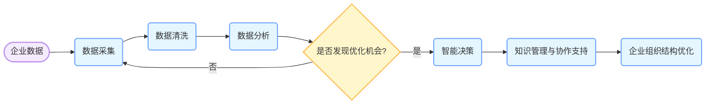

# AI辅助企业组织结构优化：效率提升与协作增强

> 关键词：AI、企业组织结构优化、效率提升、协作增强、数字化转型

> 摘要：本文聚焦于AI在企业组织结构优化中的应用，深入探讨了如何借助AI技术提升企业运营效率和增强团队协作能力。首先介绍了相关背景，包括目的、预期读者等内容。接着阐述了核心概念及联系，分析了AI辅助企业组织结构优化的原理和架构。详细讲解了核心算法原理与具体操作步骤，并通过数学模型和公式进一步剖析。在项目实战部分，给出了代码实际案例及详细解释。同时探讨了AI在企业中的实际应用场景，推荐了相关的工具和资源。最后总结了未来发展趋势与挑战，提供了常见问题解答及扩展阅读参考资料，旨在为企业利用AI进行组织结构优化提供全面且深入的指导。

## 1. 背景介绍 
### 1.1 目的和范围
在当今数字化快速发展的时代，企业面临着日益激烈的市场竞争，如何提升自身的运营效率和协作能力成为了企业生存和发展的关键。本文章的目的在于深入探讨AI技术在企业组织结构优化中的应用，通过对相关原理、算法、实践案例等方面的研究，为企业提供全面且可行的优化方案，帮助企业更好地利用AI技术提升效率、增强协作。文章的范围涵盖了AI在企业组织结构优化中的各个环节，包括核心概念、算法原理、实际应用场景、工具资源等，旨在为企业的数字化转型提供全方位的支持。

### 1.2 预期读者
本文的预期读者主要包括企业的高层管理人员，他们需要了解AI技术在企业战略层面的应用，以便做出正确的决策；企业的中层管理人员，他们需要掌握如何在日常管理中运用AI技术优化部门结构和团队协作；IT技术人员，他们对AI算法和技术实现感兴趣，希望了解相关的技术细节；以及对企业管理和AI技术融合领域有研究兴趣的学者和研究人员。

### 1.3 文档结构概述
本文共分为十个部分。第一部分是背景介绍，阐述了文章的目的、预期读者、文档结构概述和术语表；第二部分介绍核心概念与联系，包括相关原理和架构的文本示意图及Mermaid流程图；第三部分讲解核心算法原理与具体操作步骤，并给出Python源代码示例；第四部分介绍数学模型和公式，通过详细讲解和举例说明进行深入剖析；第五部分是项目实战，包括开发环境搭建、源代码详细实现和代码解读；第六部分探讨实际应用场景；第七部分推荐工具和资源，包括学习资源、开发工具框架和相关论文著作；第八部分总结未来发展趋势与挑战；第九部分是附录，提供常见问题与解答；第十部分是扩展阅读与参考资料。

### 1.4 术语表
#### 1.4.1 核心术语定义
- **AI（Artificial Intelligence）**：人工智能，是指计算机系统能够执行通常需要人类智能才能完成的任务，如学习、推理、解决问题等。
- **企业组织结构优化**：对企业的部门设置、岗位分工、权力分配等进行调整和改进，以提高企业的运营效率和适应市场变化的能力。
- **效率提升**：通过优化流程、合理配置资源等方式，提高企业在单位时间内完成任务的数量和质量。
- **协作增强**：促进企业内部不同部门、不同团队之间的沟通、合作和协调，实现信息共享和资源互补。
- **数字化转型**：企业利用数字技术对业务流程、商业模式等进行全面变革，以适应数字化时代的发展需求。

#### 1.4.2 相关概念解释
- **机器学习**：AI的一个重要分支，通过让计算机从数据中学习模式和规律，从而实现预测和决策等功能。
- **数据分析**：对大量数据进行收集、整理、分析和解释，以发现有价值的信息和知识。
- **智能决策**：利用AI技术和数据分析结果，为企业提供科学、合理的决策支持。
- **知识图谱**：一种用于表示实体之间关系的语义网络，能够帮助企业更好地理解和管理知识。

#### 1.4.3 缩略词列表
- **AI**：Artificial Intelligence（人工智能）
- **ML**：Machine Learning（机器学习）
- **DL**：Deep Learning（深度学习）
- **NLP**：Natural Language Processing（自然语言处理）
- **CRM**：Customer Relationship Management（客户关系管理）

## 2. 核心概念与联系 
### 核心概念原理
AI辅助企业组织结构优化的核心原理在于利用AI技术对企业的各种数据进行收集、分析和处理，从而发现企业组织结构中存在的问题和优化机会。具体来说，AI可以通过以下几个方面发挥作用：
- **数据分析**：AI可以对企业的人力资源数据、业务流程数据、客户数据等进行深入分析，发现数据中的潜在模式和规律。例如，通过分析员工的工作绩效数据，可以了解员工的优势和不足，为合理的岗位调配提供依据；通过分析业务流程数据，可以发现流程中的瓶颈和冗余环节，为流程优化提供方向。
- **智能决策**：基于数据分析的结果，AI可以利用机器学习算法和优化模型，为企业的组织结构调整提供智能决策支持。例如，通过建立员工能力模型和岗位需求模型，AI可以自动匹配员工与岗位，实现人力资源的优化配置；通过模拟不同的组织结构方案，AI可以评估各种方案的优劣，为企业选择最优方案提供参考。
- **知识管理**：AI可以利用知识图谱等技术，对企业的知识和经验进行管理和整合。通过构建企业知识图谱，可以清晰地展示企业内部的知识结构和关系，促进知识的共享和传承。例如，当新员工入职时，可以通过知识图谱快速了解企业的业务流程、产品信息等知识，提高员工的学习效率。
- **协作支持**：AI可以通过智能协作工具，为企业内部的团队协作提供支持。例如，利用自然语言处理技术开发的智能聊天机器人，可以实时解答员工的问题，提供知识支持；利用协同办公平台和AI算法，可以自动分配任务、跟踪进度，提高团队协作的效率。

### 架构的文本示意图
```plaintext
企业数据层
|-- 人力资源数据
|-- 业务流程数据
|-- 客户数据
|-- 其他相关数据

数据处理与分析层
|-- 数据采集模块
|-- 数据清洗模块
|-- 数据分析模块
|   |-- 机器学习算法
|   |-- 深度学习算法
|   |-- 统计分析方法

智能决策与优化层
|-- 决策模型
|-- 优化算法
|-- 模拟评估模块

知识管理与协作层
|-- 知识图谱构建模块
|-- 智能协作工具
|   |-- 智能聊天机器人
|   |-- 协同办公平台

企业组织结构优化层
|-- 部门设置调整
|-- 岗位分工优化
|-- 权力分配调整
|-- 业务流程优化
```

### Mermaid流程图


## 3. 核心算法原理 & 具体操作步骤 
### 核心算法原理
在AI辅助企业组织结构优化中，常用的核心算法包括机器学习算法和优化算法。下面以员工绩效预测和岗位匹配为例，详细介绍相关算法原理。

#### 员工绩效预测（线性回归算法）
线性回归是一种用于预测连续数值的机器学习算法。在员工绩效预测中，我们可以将员工的各种特征（如工作经验、教育背景、技能水平等）作为输入变量，将员工的绩效得分作为输出变量，建立线性回归模型。线性回归模型的数学表达式为：

$$y = \beta_0 + \beta_1x_1 + \beta_2x_2 + \cdots + \beta_nx_n + \epsilon$$

其中，$y$ 是员工的绩效得分，$x_1, x_2, \cdots, x_n$ 是员工的各种特征，$\beta_0, \beta_1, \cdots, \beta_n$ 是模型的系数，$\epsilon$ 是误差项。

#### 岗位匹配（聚类算法）
聚类算法是一种无监督学习算法，用于将数据集中的样本划分成不同的类别。在岗位匹配中，我们可以将员工的能力特征和岗位的需求特征作为数据样本，使用聚类算法将员工和岗位分别聚类。然后，通过比较员工所在的类别和岗位所在的类别，找到最匹配的员工和岗位。常用的聚类算法有K-Means算法。

### 具体操作步骤
#### 数据准备
1. 收集员工的相关数据，包括个人信息、工作经验、教育背景、技能水平、绩效得分等。
2. 收集岗位的相关数据，包括岗位要求、职责、技能需求等。
3. 对收集到的数据进行清洗和预处理，去除缺失值、异常值等。

#### 模型训练
1. **员工绩效预测模型训练**：
```python
import pandas as pd
from sklearn.linear_model import LinearRegression
from sklearn.model_selection import train_test_split
from sklearn.metrics import mean_squared_error

# 读取员工数据
employee_data = pd.read_csv('employee_data.csv')

# 提取特征和标签
X = employee_data.drop('performance_score', axis=1)
y = employee_data['performance_score']

# 划分训练集和测试集
X_train, X_test, y_train, y_test = train_test_split(X, y, test_size=0.2, random_state=42)

# 创建线性回归模型
model = LinearRegression()

# 训练模型
model.fit(X_train, y_train)

# 预测
y_pred = model.predict(X_test)

# 评估模型
mse = mean_squared_error(y_test, y_pred)
print(f"Mean Squared Error: {mse}")
```
2. **岗位匹配模型训练（K-Means算法）**：
```python
from sklearn.cluster import KMeans
import numpy as np

# 读取员工和岗位数据
employee_features = np.loadtxt('employee_features.csv', delimiter=',')
job_features = np.loadtxt('job_features.csv', delimiter=',')

# 确定聚类的数量
k = 5

# 创建K-Means模型
kmeans_employees = KMeans(n_clusters=k, random_state=42)
kmeans_jobs = KMeans(n_clusters=k, random_state=42)

# 训练模型
kmeans_employees.fit(employee_features)
kmeans_jobs.fit(job_features)

# 获取员工和岗位的聚类标签
employee_labels = kmeans_employees.labels_
job_labels = kmeans_jobs.labels_

# 进行岗位匹配
matches = []
for i in range(len(employee_labels)):
    for j in range(len(job_labels)):
        if employee_labels[i] == job_labels[j]:
            matches.append((i, j))

print(f"岗位匹配结果: {matches}")
```

#### 模型评估与优化
1. 对于员工绩效预测模型，使用均方误差（MSE）、决定系数（$R^2$）等指标评估模型的性能。如果模型性能不理想，可以尝试调整模型参数、增加特征或使用其他算法。
2. 对于岗位匹配模型，使用轮廓系数等指标评估聚类的效果。如果聚类效果不佳，可以尝试调整聚类的数量或使用其他聚类算法。

#### 应用与决策
1. 根据员工绩效预测模型的结果，对员工进行合理的岗位调配和培训计划制定。
2. 根据岗位匹配模型的结果，将员工分配到最适合的岗位上，实现人力资源的优化配置。

## 4. 数学模型和公式 & 详细讲解 & 举例说明 
### 线性回归模型
#### 数学公式
线性回归模型的一般形式为：

$$y = \beta_0 + \beta_1x_1 + \beta_2x_2 + \cdots + \beta_nx_n + \epsilon$$

其中，$y$ 是因变量（在员工绩效预测中为绩效得分），$x_1, x_2, \cdots, x_n$ 是自变量（员工的各种特征），$\beta_0, \beta_1, \cdots, \beta_n$ 是模型的系数，$\epsilon$ 是误差项，服从均值为0、方差为 $\sigma^2$ 的正态分布。

#### 详细讲解
线性回归模型的目标是找到一组最优的系数 $\beta_0, \beta_1, \cdots, \beta_n$，使得预测值 $\hat{y}$ 与真实值 $y$ 之间的误差最小。常用的误差度量方法是均方误差（MSE），其计算公式为：

$$MSE = \frac{1}{m} \sum_{i=1}^{m} (y_i - \hat{y}_i)^2$$

其中，$m$ 是样本数量，$y_i$ 是第 $i$ 个样本的真实值，$\hat{y}_i$ 是第 $i$ 个样本的预测值。

为了找到最优的系数，可以使用最小二乘法。最小二乘法的基本思想是通过最小化均方误差来求解系数。具体来说，对均方误差关于系数 $\beta_0, \beta_1, \cdots, \beta_n$ 求偏导数，并令偏导数等于0，得到一组方程组，解这个方程组就可以得到最优的系数。

#### 举例说明
假设我们有一个简单的员工绩效预测问题，只考虑员工的工作经验（$x$）和绩效得分（$y$）两个变量。我们收集了以下数据：

| 工作经验（年） | 绩效得分 |
| --- | --- |
| 1 | 60 |
| 2 | 65 |
| 3 | 70 |
| 4 | 75 |
| 5 | 80 |

我们可以使用线性回归模型来预测员工的绩效得分。首先，将数据表示为矩阵形式：

$$X = \begin{bmatrix} 1 & 1 \\ 1 & 2 \\ 1 & 3 \\ 1 & 4 \\ 1 & 5 \end{bmatrix}, y = \begin{bmatrix} 60 \\ 65 \\ 70 \\ 75 \\ 80 \end{bmatrix}$$

然后，使用最小二乘法求解系数 $\beta$：

$$\beta = (X^T X)^{-1} X^T y$$

```python
import numpy as np

X = np.array([[1, 1], [1, 2], [1, 3], [1, 4], [1, 5]])
y = np.array([60, 65, 70, 75, 80])

beta = np.linalg.inv(X.T.dot(X)).dot(X.T).dot(y)
print(f"系数: {beta}")
```

运行上述代码，得到系数 $\beta = [55, 5]$。因此，线性回归模型的表达式为：

$$y = 55 + 5x$$

这个模型表示，员工的绩效得分等于55加上5乘以工作经验。例如，当员工的工作经验为6年时，预测的绩效得分是 $y = 55 + 5 \times 6 = 85$。

### K-Means聚类算法
#### 数学公式
K-Means聚类算法的目标是将数据集 $X = \{x_1, x_2, \cdots, x_m\}$ 划分为 $k$ 个簇 $C = \{C_1, C_2, \cdots, C_k\}$，使得簇内的样本相似度最大，簇间的样本相似度最小。常用的相似度度量方法是欧几里得距离，其计算公式为：

$$d(x_i, x_j) = \sqrt{\sum_{d=1}^{n} (x_{id} - x_{jd})^2}$$

其中，$x_i$ 和 $x_j$ 是两个样本，$n$ 是样本的特征维度，$x_{id}$ 和 $x_{jd}$ 分别是样本 $x_i$ 和 $x_j$ 的第 $d$ 个特征。

K-Means算法的目标是最小化所有样本到其所属簇的质心的距离之和，即：

$$J = \sum_{i=1}^{k} \sum_{x \in C_i} d(x, \mu_i)^2$$

其中，$\mu_i$ 是第 $i$ 个簇的质心。

#### 详细讲解
K-Means算法的基本步骤如下：
1. **初始化质心**：随机选择 $k$ 个样本作为初始质心。
2. **分配样本**：计算每个样本到各个质心的距离，将样本分配到距离最近的质心所在的簇。
3. **更新质心**：计算每个簇内所有样本的均值，将均值作为新的质心。
4. **重复步骤2和3**：直到质心不再变化或达到最大迭代次数。

#### 举例说明
假设我们有一个二维数据集：

$$X = \begin{bmatrix} 1 & 2 \\ 2 & 1 \\ 4 & 5 \\ 5 & 4 \end{bmatrix}$$

我们要将这个数据集划分为2个簇。

1. **初始化质心**：随机选择两个样本作为初始质心，假设选择 $(1, 2)$ 和 $(4, 5)$。
2. **分配样本**：
    - 计算样本 $(1, 2)$ 到两个质心的距离：$d((1, 2), (1, 2)) = 0$，$d((1, 2), (4, 5)) = \sqrt{(1 - 4)^2 + (2 - 5)^2} = \sqrt{18}$，所以样本 $(1, 2)$ 分配到第一个簇。
    - 计算样本 $(2, 1)$ 到两个质心的距离：$d((2, 1), (1, 2)) = \sqrt{(2 - 1)^2 + (1 - 2)^2} = \sqrt{2}$，$d((2, 1), (4, 5)) = \sqrt{(2 - 4)^2 + (1 - 5)^2} = \sqrt{20}$，所以样本 $(2, 1)$ 分配到第一个簇。
    - 计算样本 $(4, 5)$ 到两个质心的距离：$d((4, 5), (1, 2)) = \sqrt{(4 - 1)^2 + (5 - 2)^2} = \sqrt{18}$，$d((4, 5), (4, 5)) = 0$，所以样本 $(4, 5)$ 分配到第二个簇。
    - 计算样本 $(5, 4)$ 到两个质心的距离：$d((5, 4), (1, 2)) = \sqrt{(5 - 1)^2 + (4 - 2)^2} = \sqrt{20}$，$d((5, 4), (4, 5)) = \sqrt{(5 - 4)^2 + (4 - 5)^2} = \sqrt{2}$，所以样本 $(5, 4)$ 分配到第二个簇。
3. **更新质心**：
    - 第一个簇的样本为 $(1, 2)$ 和 $(2, 1)$，质心为 $(\frac{1 + 2}{2}, \frac{2 + 1}{2}) = (1.5, 1.5)$。
    - 第二个簇的样本为 $(4, 5)$ 和 $(5, 4)$，质心为 $(\frac{4 + 5}{2}, \frac{5 + 4}{2}) = (4.5, 4.5)$。
4. **重复步骤2和3**：直到质心不再变化。

```python
from sklearn.cluster import KMeans
import numpy as np

X = np.array([[1, 2], [2, 1], [4, 5], [5, 4]])

kmeans = KMeans(n_clusters=2, random_state=42)
kmeans.fit(X)

print(f"聚类标签: {kmeans.labels_}")
print(f"质心: {kmeans.cluster_centers_}")
```

运行上述代码，得到聚类标签和质心。

## 5. 项目实战：代码实际案例和详细解释说明 
### 5.1  开发环境搭建
#### 安装Python
首先，需要安装Python环境。可以从Python官方网站（https://www.python.org/downloads/） 下载适合自己操作系统的Python安装包，然后按照安装向导进行安装。

#### 安装必要的库
在项目中，我们需要使用一些Python库，如`pandas`、`numpy`、`scikit-learn`等。可以使用`pip`命令进行安装：

```bash
pip install pandas numpy scikit-learn
```

#### 数据准备
准备好员工数据和岗位数据，将其保存为CSV文件。例如，员工数据文件`employee_data.csv`可以包含以下列：`employee_id`、`work_experience`、`education_level`、`skill_level`、`performance_score`等；岗位数据文件`job_data.csv`可以包含以下列：`job_id`、`job_requirement`、`job_responsibility`、`skill_demand`等。

### 5.2  源代码详细实现和代码解读
#### 员工绩效预测
```python
import pandas as pd
from sklearn.linear_model import LinearRegression
from sklearn.model_selection import train_test_split
from sklearn.metrics import mean_squared_error

# 读取员工数据
employee_data = pd.read_csv('employee_data.csv')

# 提取特征和标签
X = employee_data.drop('performance_score', axis=1)
y = employee_data['performance_score']

# 划分训练集和测试集
X_train, X_test, y_train, y_test = train_test_split(X, y, test_size=0.2, random_state=42)

# 创建线性回归模型
model = LinearRegression()

# 训练模型
model.fit(X_train, y_train)

# 预测
y_pred = model.predict(X_test)

# 评估模型
mse = mean_squared_error(y_test, y_pred)
print(f"Mean Squared Error: {mse}")
```
**代码解读**：
1. **数据读取**：使用`pandas`库的`read_csv`函数读取员工数据文件。
2. **特征提取**：将`performance_score`列作为标签，其余列作为特征。
3. **数据划分**：使用`train_test_split`函数将数据集划分为训练集和测试集，测试集占比为20%。
4. **模型创建**：创建一个线性回归模型。
5. **模型训练**：使用训练集数据对模型进行训练。
6. **模型预测**：使用训练好的模型对测试集数据进行预测。
7. **模型评估**：使用均方误差（MSE）评估模型的性能。

#### 岗位匹配
```python
from sklearn.cluster import KMeans
import numpy as np

# 读取员工和岗位数据
employee_features = np.loadtxt('employee_features.csv', delimiter=',')
job_features = np.loadtxt('job_features.csv', delimiter=',')

# 确定聚类的数量
k = 5

# 创建K-Means模型
kmeans_employees = KMeans(n_clusters=k, random_state=42)
kmeans_jobs = KMeans(n_clusters=k, random_state=42)

# 训练模型
kmeans_employees.fit(employee_features)
kmeans_jobs.fit(job_features)

# 获取员工和岗位的聚类标签
employee_labels = kmeans_employees.labels_
job_labels = kmeans_jobs.labels_

# 进行岗位匹配
matches = []
for i in range(len(employee_labels)):
    for j in range(len(job_labels)):
        if employee_labels[i] == job_labels[j]:
            matches.append((i, j))

print(f"岗位匹配结果: {matches}")
```
**代码解读**：
1. **数据读取**：使用`np.loadtxt`函数读取员工和岗位的特征数据。
2. **确定聚类数量**：设置聚类的数量为5。
3. **模型创建**：创建两个K-Means模型，分别用于员工和岗位的聚类。
4. **模型训练**：使用员工和岗位的特征数据对相应的模型进行训练。
5. **获取聚类标签**：使用训练好的模型获取员工和岗位的聚类标签。
6. **岗位匹配**：遍历员工和岗位的聚类标签，将聚类标签相同的员工和岗位进行匹配。

### 5.3  代码解读与分析
#### 员工绩效预测代码分析
- **优点**：线性回归模型简单易懂，计算效率高，能够快速得到预测结果。同时，使用均方误差评估模型的性能，能够直观地反映模型的预测精度。
- **缺点**：线性回归模型假设特征和标签之间存在线性关系，对于复杂的非线性关系可能无法很好地拟合。此外，模型的性能可能受到数据质量和特征选择的影响。

#### 岗位匹配代码分析
- **优点**：K-Means算法是一种经典的聚类算法，能够快速地将数据划分为不同的簇。通过比较员工和岗位的聚类标签进行岗位匹配，简单易行。
- **缺点**：K-Means算法需要预先指定聚类的数量，对于不同的数据集，合适的聚类数量可能不同。此外，K-Means算法对初始质心的选择比较敏感，可能会导致不同的聚类结果。

## 6. 实际应用场景 
### 人力资源管理
- **员工招聘**：利用AI技术对求职者的简历进行分析，提取关键信息，如技能、经验、教育背景等。通过与岗位需求进行匹配，筛选出最适合的候选人，提高招聘效率和准确性。
- **员工培训**：根据员工的绩效评估和技能短板，使用AI推荐个性化的培训课程。例如，通过分析员工的工作数据和学习记录，为员工制定专属的培训计划，提升员工的能力和素质。
- **员工绩效评估**：AI可以综合考虑多个因素，如工作成果、工作态度、团队协作等，对员工的绩效进行客观、准确的评估。避免了传统绩效评估中主观因素的影响，提高了评估的公正性和可信度。

### 业务流程优化
- **流程自动化**：利用AI技术实现业务流程的自动化，如自动化审批、自动化报表生成等。通过减少人工干预，提高流程的执行效率和准确性，降低成本。
- **流程瓶颈识别**：通过对业务流程数据的分析，AI可以发现流程中的瓶颈和冗余环节。例如，通过分析订单处理流程的数据，找出导致订单处理时间过长的环节，进行针对性的优化。
- **流程模拟与优化**：使用AI模拟不同的业务流程方案，评估各种方案的效果。通过比较不同方案的效率、成本等指标，选择最优的流程方案，提高企业的运营效率。

### 团队协作与沟通
- **智能协作工具**：开发智能聊天机器人，为团队成员提供实时的知识支持和问题解答。例如，当团队成员遇到技术问题时，可以通过聊天机器人快速获取相关的解决方案。
- **团队成员匹配**：根据团队成员的技能、性格、工作风格等因素，使用AI进行团队成员的匹配。将具有互补技能和良好协作能力的成员组成团队，提高团队的协作效率和创新能力。
- **沟通分析与优化**：分析团队成员之间的沟通数据，如邮件、聊天记录等。通过了解团队成员的沟通模式和频率，发现沟通中的问题和障碍，进行针对性的优化，提高团队的沟通效率。

### 客户关系管理
- **客户细分**：利用AI技术对客户进行细分，根据客户的特征、行为、需求等因素，将客户分为不同的群体。例如，将客户分为高价值客户、潜在客户、流失客户等，为不同群体的客户提供个性化的服务和营销策略。
- **客户需求预测**：通过分析客户的历史数据和行为模式，使用AI预测客户的未来需求。例如，预测客户的购买意向、产品偏好等，为企业的产品研发和营销决策提供依据。
- **客户服务优化**：使用AI技术优化客户服务流程，如智能客服系统、客户投诉处理系统等。通过自动回复客户的问题、快速处理客户的投诉，提高客户的满意度和忠诚度。

## 7. 工具和资源推荐
### 7.1 学习资源推荐
#### 7.1.1 书籍推荐
- 《Python机器学习》：本书全面介绍了Python在机器学习领域的应用，包括各种机器学习算法的原理、实现和应用案例。
- 《人工智能：一种现代的方法》：这是一本经典的人工智能教材，涵盖了人工智能的各个方面，包括搜索算法、知识表示、机器学习、自然语言处理等。
- 《大数据时代：生活、工作与思维的大变革》：本书介绍了大数据的概念、技术和应用，帮助读者了解大数据在企业管理中的重要作用。

#### 7.1.2 在线课程
- Coursera上的“机器学习”课程：由斯坦福大学的Andrew Ng教授讲授，是一门非常经典的机器学习课程，涵盖了机器学习的基本概念、算法和应用。
- edX上的“人工智能基础”课程：该课程介绍了人工智能的基本概念、技术和应用，适合初学者学习。
- 中国大学MOOC上的“Python数据分析与应用”课程：该课程介绍了Python在数据分析领域的应用，包括数据处理、数据可视化、机器学习等内容。

#### 7.1.3 技术博客和网站
- Medium：这是一个技术博客平台，上面有很多关于AI、机器学习、数据分析等领域的优秀文章。
- Towards Data Science：专注于数据科学和机器学习领域的博客，提供了很多实用的技术文章和案例分析。
- Kaggle：一个数据科学竞赛平台，上面有很多公开的数据集和优秀的解决方案，可以学习到很多实际应用中的技术和经验。

### 7.2 开发工具框架推荐
#### 7.2.1 IDE和编辑器
- PyCharm：一款专门为Python开发设计的集成开发环境（IDE），具有代码编辑、调试、自动补全、代码分析等功能。
- Jupyter Notebook：一个交互式的开发环境，适合进行数据分析和机器学习实验。可以方便地编写代码、运行代码、查看结果，并将代码和结果保存为文档。
- Visual Studio Code：一款轻量级的代码编辑器，支持多种编程语言，具有丰富的插件和扩展功能。

#### 7.2.2 调试和性能分析工具
- pdb：Python自带的调试工具，可以帮助开发者定位代码中的问题。
- cProfile：Python的性能分析工具，可以分析代码的运行时间和函数调用情况，帮助开发者优化代码性能。
- TensorBoard：一个用于可视化深度学习模型训练过程的工具，可以查看模型的损失函数、准确率、梯度等指标的变化情况。

#### 7.2.3 相关框架和库
- scikit-learn：一个简单易用的机器学习库，提供了各种机器学习算法的实现，如分类、回归、聚类等。
- TensorFlow：一个开源的深度学习框架，广泛应用于图像识别、自然语言处理、语音识别等领域。
- PyTorch：另一个流行的深度学习框架，具有动态计算图的特点，适合进行研究和开发。

### 7.3 相关论文著作推荐
#### 7.3.1 经典论文
- “A Logical Calculus of the Ideas Immanent in Nervous Activity”：由Warren S. McCulloch和Walter Pitts发表于1943年，提出了神经元模型，是神经网络领域的经典论文。
- “Learning Representations by Back-propagating Errors”：由David E. Rumelhart、Geoffrey E. Hinton和Ronald J. Williams发表于1986年，介绍了反向传播算法，是深度学习领域的重要论文。
- “ImageNet Classification with Deep Convolutional Neural Networks”：由Alex Krizhevsky、Ilya Sutskever和Geoffrey E. Hinton发表于2012年，提出了AlexNet模型，开创了深度学习在图像识别领域的新纪元。

#### 7.3.2 最新研究成果
- 关注顶级学术会议，如NeurIPS（神经信息处理系统大会）、ICML（国际机器学习会议）、CVPR（计算机视觉与模式识别会议）等，这些会议上会发布很多最新的研究成果。
- 关注知名学术期刊，如Journal of Artificial Intelligence Research（JAIR）、Artificial Intelligence（AI）等，这些期刊上会发表很多高质量的研究论文。

#### 7.3.3 应用案例分析
- 《AI in Business: How Leading Companies Are Harnessing Artificial Intelligence for Competitive Advantage》：本书介绍了很多企业应用AI技术的成功案例，分析了AI在企业中的应用场景、挑战和机遇。
- 《The AI Economy: Work, Wealth, and Welfare in the Age of Artificial Intelligence》：本书探讨了AI对经济、就业和社会的影响，通过实际案例分析了企业如何应对AI时代的挑战。

## 8. 总结：未来发展趋势与挑战
### 未来发展趋势
- **智能化程度不断提高**：随着AI技术的不断发展，企业组织结构优化将越来越智能化。AI将能够自动识别企业组织结构中存在的问题，并提出更加精准的优化方案。
- **与其他技术深度融合**：AI将与物联网、大数据、区块链等技术深度融合，为企业组织结构优化提供更强大的支持。例如，通过物联网收集企业生产设备的实时数据，利用AI进行分析和决策，实现生产流程的优化。
- **个性化定制服务**：不同企业的组织结构和业务需求各不相同，未来AI将能够根据企业的个性化需求，提供定制化的组织结构优化方案。
- **跨领域应用拓展**：AI在企业组织结构优化中的应用将不再局限于传统的行业，而是拓展到更多的领域，如医疗、教育、金融等。

### 挑战
- **数据隐私和安全问题**：AI的应用需要大量的数据支持，而这些数据往往包含企业的敏感信息和员工的个人隐私。如何保护数据的隐私和安全，是企业面临的一个重要挑战。
- **技术人才短缺**：AI技术是一个新兴的领域，相关的技术人才相对短缺。企业需要培养和吸引更多的AI技术人才，以满足企业组织结构优化的需求。
- **组织文化和变革阻力**：企业组织结构优化涉及到企业内部的权力分配、人员调整等问题，可能会遇到组织文化和变革阻力。如何克服这些阻力，推动企业组织结构的优化，是企业需要解决的一个难题。
- **伦理和法律问题**：AI的应用可能会带来一些伦理和法律问题，如算法偏见、责任界定等。企业需要制定相应的伦理和法律规范，确保AI的应用符合社会道德和法律法规的要求。

## 9. 附录：常见问题与解答
### 1. AI在企业组织结构优化中的应用是否会导致员工失业？
AI在企业组织结构优化中的应用主要是为了提高企业的运营效率和协作能力，而不是为了取代员工。虽然一些重复性、规律性的工作可能会被自动化，但同时也会创造出一些新的工作岗位，如AI技术研发、数据分析、智能决策等。企业可以通过培训和转岗等方式，帮助员工适应新的工作需求，实现员工的职业发展。

### 2. 如何确保AI模型的准确性和可靠性？
为了确保AI模型的准确性和可靠性，可以采取以下措施：
- **数据质量控制**：确保收集到的数据准确、完整、无噪声。对数据进行清洗、预处理和验证，提高数据的质量。
- **模型选择和评估**：根据具体的问题选择合适的AI模型，并使用多种评估指标对模型进行评估。例如，对于分类问题，可以使用准确率、召回率、F1值等指标进行评估。
- **模型优化和调整**：根据评估结果，对模型进行优化和调整。可以尝试调整模型的参数、增加特征或使用其他算法，提高模型的性能。
- **模型监控和更新**：在模型上线后，对模型的性能进行实时监控。当模型的性能下降时，及时对模型进行更新和优化。

### 3. AI技术的应用是否会增加企业的成本？
AI技术的应用可能会在短期内增加企业的成本，如购买AI软件和硬件设备、培训员工等。但从长期来看，AI技术的应用可以提高企业的运营效率和协作能力，降低企业的成本。例如，通过自动化流程减少人工操作，降低人力成本；通过智能决策优化资源配置，提高资源利用效率，降低成本。因此，企业需要综合考虑AI技术的应用成本和收益，做出合理的决策。

### 4. 如何推动企业内部对AI技术的接受和应用？
为了推动企业内部对AI技术的接受和应用，可以采取以下措施：
- **培训和教育**：为员工提供AI技术的培训和教育，让员工了解AI技术的原理、应用场景和优势，提高员工对AI技术的认知和接受度。
- **试点项目**：选择一些具有代表性的业务场景进行AI技术的试点应用，通过实际案例展示AI技术的效果和价值，激发员工对AI技术的兴趣和积极性。
- **沟通和参与**：加强与员工的沟通和交流，让员工参与到AI技术的应用和决策过程中，听取员工的意见和建议，提高员工的参与感和认同感。
- **激励机制**：建立相应的激励机制，对积极应用AI技术并取得良好效果的员工进行奖励，鼓励员工积极参与AI技术的应用和创新。

## 10. 扩展阅读 & 参考资料
### 扩展阅读
- 《AI Superpowers: China, Silicon Valley, and the New World Order》：本书探讨了中美两国在AI领域的竞争和合作，以及AI对全球政治、经济和社会的影响。
- 《The Fourth Industrial Revolution》：由世界经济论坛创始人克劳斯·施瓦布所著，介绍了第四次工业革命的概念、技术和影响，其中包括AI技术的发展和应用。
- 《Human Compatible: Artificial Intelligence and the Problem of Control》：本书探讨了AI技术的控制问题，提出了如何确保AI技术与人类的利益相一致的方法和策略。

### 参考资料
- 相关学术论文和研究报告，如IEEE、ACM等学术组织发表的论文。
- 企业的官方网站和年报，了解企业在AI技术应用方面的实践和经验。
- 行业报告和咨询机构的研究成果，如Gartner、IDC等发布的报告。