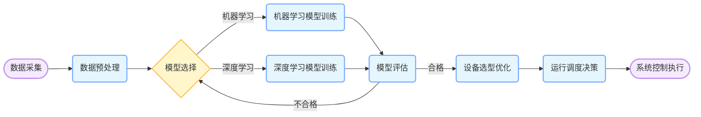

# AI辅助可再生能源系统优化：从设备选型到运行调度

> 关键词：AI、可再生能源系统、设备选型、运行调度、系统优化

> 摘要：本文聚焦于AI在可再生能源系统优化中的应用，从设备选型到运行调度进行了全面深入的探讨。详细阐述了相关核心概念、算法原理、数学模型，通过实际项目案例展示了AI技术在可再生能源系统中的具体应用。同时，分析了AI在该领域的实际应用场景，推荐了相关学习资源、开发工具和论文著作。最后对AI辅助可再生能源系统的未来发展趋势与挑战进行了总结，并给出常见问题解答和扩展阅读参考资料，旨在为相关领域的研究者和从业者提供全面且有深度的技术指导。

## 1. 背景介绍 
### 1.1 目的和范围
随着全球对环境保护和可持续发展的关注度不断提高，可再生能源的开发和利用成为了能源领域的重要发展方向。然而，可再生能源系统如太阳能、风能等具有间歇性和不确定性的特点，这给系统的高效运行和管理带来了挑战。本文的目的是探讨如何利用AI技术对可再生能源系统进行优化，涵盖从设备选型到运行调度的整个过程，以提高可再生能源系统的效率、可靠性和经济性。范围包括对相关核心概念的介绍、算法原理的分析、数学模型的建立、实际项目案例的研究以及对未来发展趋势的展望。

### 1.2 预期读者
本文预期读者包括可再生能源领域的工程师、研究人员、技术爱好者，以及对AI技术在能源领域应用感兴趣的相关人员。对于正在从事可再生能源系统设计、开发和运行管理的专业人士，本文可以提供实用的技术指导和优化思路；对于研究人员，本文可以作为进一步深入研究的参考；对于技术爱好者和相关人员，本文可以帮助他们了解AI在可再生能源领域的应用现状和发展前景。

### 1.3 文档结构概述
本文将按照以下结构进行阐述：首先介绍核心概念与联系，包括可再生能源系统和AI相关概念以及它们之间的联系，并通过文本示意图和Mermaid流程图进行直观展示；接着讲解核心算法原理和具体操作步骤，使用Python源代码详细阐述；然后介绍数学模型和公式，并进行详细讲解和举例说明；之后通过项目实战，展示代码实际案例并进行详细解释说明；再分析实际应用场景；推荐相关工具和资源；最后总结未来发展趋势与挑战，给出常见问题解答和扩展阅读参考资料。

### 1.4 术语表
#### 1.4.1 核心术语定义
- **可再生能源系统**：利用可再生能源（如太阳能、风能、水能等）进行发电、供热等能源转换和利用的系统，通常包括能源采集设备、能量转换设备、储能设备和控制系统等。
- **AI（人工智能）**：研究、开发用于模拟、延伸和扩展人的智能的理论、方法、技术及应用系统的一门新的技术科学。在本文中主要指利用机器学习、深度学习等技术对可再生能源系统进行优化。
- **设备选型**：根据可再生能源系统的需求和特点，选择合适的能源采集设备、能量转换设备和储能设备等的过程。
- **运行调度**：根据可再生能源的供应情况、负荷需求和系统状态等因素，对可再生能源系统的运行进行合理安排和调整的过程。

#### 1.4.2 相关概念解释
- **机器学习**：是一门多领域交叉学科，涉及概率论、统计学、逼近论、凸分析、算法复杂度理论等多门学科。它专门研究计算机怎样模拟或实现人类的学习行为，以获取新的知识或技能，重新组织已有的知识结构使之不断改善自身的性能。在可再生能源系统中，机器学习可用于预测可再生能源的发电量、负荷需求等。
- **深度学习**：是机器学习的一个分支领域，它是一种基于对数据进行表征学习的方法。深度学习通过构建具有很多层的神经网络模型，自动从大量数据中学习复杂的模式和特征。在可再生能源系统中，深度学习可用于更精准地预测和优化。

#### 1.4.3 缩略词列表
- **ML（Machine Learning）**：机器学习
- **DL（Deep Learning）**：深度学习
- **PV（Photovoltaic）**：光伏发电
- **WT（Wind Turbine）**：风力发电机

## 2. 核心概念与联系 

### 核心概念原理
可再生能源系统的核心在于将自然界中的可再生能源转化为可利用的电能或其他形式的能量。太阳能光伏发电系统通过光伏电池将太阳能转化为直流电，再经过逆变器将直流电转换为交流电供负载使用或并入电网；风力发电系统通过风力发电机将风能转化为机械能，再通过发电机将机械能转化为电能。

AI技术在可再生能源系统中的应用主要基于数据驱动的方法。通过收集可再生能源系统的历史数据，如气象数据、发电量数据、负荷数据等，利用机器学习和深度学习算法对这些数据进行分析和建模，从而实现对可再生能源的预测、设备选型的优化和运行调度的智能决策。

### 架构的文本示意图
可再生能源系统与AI的结合可以构建一个多层次的架构。最底层是数据采集层，负责收集可再生能源系统的各种数据，包括气象传感器采集的气象数据、设备传感器采集的运行数据等。中间层是数据处理和分析层，利用AI算法对采集到的数据进行清洗、预处理和分析，建立预测模型和优化模型。最上层是决策和控制层，根据分析结果做出设备选型和运行调度的决策，并将控制指令发送给可再生能源系统的执行机构。

### Mermaid流程图


## 3. 核心算法原理 & 具体操作步骤 

### 核心算法原理
在AI辅助可再生能源系统优化中，常用的算法包括线性回归、支持向量机（SVM）、决策树和神经网络等。这里以线性回归算法为例进行详细讲解。

线性回归是一种用于建立自变量和因变量之间线性关系的统计模型。在可再生能源系统中，我们可以利用线性回归模型来预测可再生能源的发电量。假设我们有一组自变量 $X = [x_1, x_2, ..., x_n]$ ，如气象数据（温度、光照强度等），因变量 $y$ 为可再生能源的发电量。线性回归模型的表达式为：

$y = \theta_0 + \theta_1x_1 + \theta_2x_2 + ... + \theta_nx_n$

其中，$\theta_0$ 为截距，$\theta_1, \theta_2, ..., \theta_n$ 为回归系数。我们的目标是通过最小化预测值和实际值之间的误差来确定这些系数。常用的误差度量方法是均方误差（MSE）：

$MSE = \frac{1}{m} \sum_{i=1}^{m} (y^{(i)} - \hat{y}^{(i)})^2$

其中，$m$ 为样本数量，$y^{(i)}$ 为第 $i$ 个样本的实际值，$\hat{y}^{(i)}$ 为第 $i$ 个样本的预测值。

### 具体操作步骤及Python源代码
以下是使用Python实现线性回归模型进行可再生能源发电量预测的具体步骤和代码：

```python
import numpy as np
from sklearn.linear_model import LinearRegression
from sklearn.model_selection import train_test_split
from sklearn.metrics import mean_squared_error

# 1. 准备数据
# 假设我们有一些气象数据（温度、光照强度）和对应的发电量数据
# 这里简单生成一些示例数据
np.random.seed(0)
X = np.random.rand(100, 2)  # 100个样本，每个样本有2个特征（温度、光照强度）
y = 2 * X[:, 0] + 3 * X[:, 1] + 1 + 0.5 * np.random.randn(100)  # 生成对应的发电量数据

# 2. 划分训练集和测试集
X_train, X_test, y_train, y_test = train_test_split(X, y, test_size=0.2, random_state=42)

# 3. 创建线性回归模型
model = LinearRegression()

# 4. 训练模型
model.fit(X_train, y_train)

# 5. 进行预测
y_pred = model.predict(X_test)

# 6. 评估模型
mse = mean_squared_error(y_test, y_pred)
print(f"均方误差: {mse}")

# 7. 查看回归系数和截距
print(f"回归系数: {model.coef_}")
print(f"截距: {model.intercept_}")
```

### 代码解释
1. **数据准备**：使用 `numpy` 生成一些示例数据，包括自变量 `X` 和因变量 `y`。
2. **划分训练集和测试集**：使用 `train_test_split` 函数将数据划分为训练集和测试集，比例为80%训练集和20%测试集。
3. **创建模型**：使用 `LinearRegression` 类创建线性回归模型。
4. **训练模型**：使用 `fit` 方法对模型进行训练。
5. **进行预测**：使用训练好的模型对测试集进行预测。
6. **评估模型**：使用 `mean_squared_error` 函数计算预测值和实际值之间的均方误差。
7. **查看回归系数和截距**：通过 `coef_` 和 `intercept_` 属性查看模型的回归系数和截距。

## 4. 数学模型和公式 & 详细讲解 & 举例说明 

### 线性回归数学模型
线性回归的数学模型可以表示为：

$y = \theta^T X + \epsilon$

其中，$y$ 是因变量向量，$\theta$ 是回归系数向量，$X$ 是自变量矩阵，$\epsilon$ 是误差项向量。

### 最小二乘法求解回归系数
为了求解回归系数 $\theta$，我们可以使用最小二乘法。最小二乘法的目标是最小化误差平方和：

$J(\theta) = \frac{1}{2m} \sum_{i=1}^{m} (y^{(i)} - \theta^T X^{(i)})^2$

其中，$m$ 是样本数量，$y^{(i)}$ 是第 $i$ 个样本的实际值，$X^{(i)}$ 是第 $i$ 个样本的自变量向量。

对 $J(\theta)$ 求偏导数并令其为零，可以得到回归系数的解析解：

$\theta = (X^T X)^{-1} X^T y$

### 举例说明
假设我们有以下数据集：

| 温度 ($x_1$) | 光照强度 ($x_2$) | 发电量 ($y$) |
| --- | --- | --- |
| 20 | 500 | 100 |
| 25 | 600 | 120 |
| 30 | 700 | 140 |

我们可以将其表示为矩阵形式：

$X = \begin{bmatrix} 1 & 20 & 500 \\ 1 & 25 & 600 \\ 1 & 30 & 700 \end{bmatrix}$

$y = \begin{bmatrix} 100 \\ 120 \\ 140 \end{bmatrix}$

根据上述公式计算回归系数 $\theta$：

```python
import numpy as np

X = np.array([[1, 20, 500], [1, 25, 600], [1, 30, 700]])
y = np.array([100, 120, 140])

theta = np.linalg.inv(X.T.dot(X)).dot(X.T).dot(y)
print(f"回归系数: {theta}")
```

运行上述代码，我们可以得到回归系数 $\theta$ 的值，从而建立起线性回归模型。

## 5. 项目实战：代码实际案例和详细解释说明 

### 5.1  开发环境搭建
在进行可再生能源系统优化的项目实战之前，我们需要搭建相应的开发环境。以下是具体步骤：

1. **安装Python**：建议使用Python 3.7及以上版本，可以从Python官方网站（https://www.python.org/downloads/）下载并安装。
2. **安装必要的库**：使用 `pip` 命令安装以下必要的库：
    - `numpy`：用于数值计算。
    - `pandas`：用于数据处理和分析。
    - `scikit-learn`：用于机器学习算法的实现。
    - `tensorflow` 或 `pytorch`：用于深度学习算法的实现（可选）。

可以使用以下命令进行安装：

```sh
pip install numpy pandas scikit-learn tensorflow
```

### 5.2  源代码详细实现和代码解读
以下是一个更完整的可再生能源系统优化项目实战代码示例，包括数据加载、预处理、模型训练和预测：

```python
import numpy as np
import pandas as pd
from sklearn.linear_model import LinearRegression
from sklearn.model_selection import train_test_split
from sklearn.metrics import mean_squared_error

# 1. 加载数据
data = pd.read_csv('renewable_energy_data.csv')  # 假设数据存储在CSV文件中

# 2. 数据预处理
# 分离自变量和因变量
X = data.drop('power_generation', axis=1).values
y = data['power_generation'].values

# 划分训练集和测试集
X_train, X_test, y_train, y_test = train_test_split(X, y, test_size=0.2, random_state=42)

# 3. 创建线性回归模型
model = LinearRegression()

# 4. 训练模型
model.fit(X_train, y_train)

# 5. 进行预测
y_pred = model.predict(X_test)

# 6. 评估模型
mse = mean_squared_error(y_test, y_pred)
print(f"均方误差: {mse}")

# 7. 查看回归系数和截距
print(f"回归系数: {model.coef_}")
print(f"截距: {model.intercept_}")
```

### 代码解读
1. **数据加载**：使用 `pandas` 的 `read_csv` 函数加载存储在CSV文件中的可再生能源数据。
2. **数据预处理**：分离自变量和因变量，并使用 `train_test_split` 函数将数据划分为训练集和测试集。
3. **创建模型**：使用 `LinearRegression` 类创建线性回归模型。
4. **训练模型**：使用 `fit` 方法对模型进行训练。
5. **进行预测**：使用训练好的模型对测试集进行预测。
6. **评估模型**：使用 `mean_squared_error` 函数计算预测值和实际值之间的均方误差。
7. **查看回归系数和截距**：通过 `coef_` 和 `intercept_` 属性查看模型的回归系数和截距。

### 5.3  代码解读与分析
通过上述代码，我们可以看到一个完整的可再生能源系统优化项目的实现过程。线性回归模型是一种简单而有效的预测模型，但在实际应用中，可能需要根据具体情况选择更复杂的模型，如支持向量机、决策树或神经网络等。

同时，数据的质量和特征工程对模型的性能也有很大影响。在实际项目中，我们需要对数据进行更深入的分析和预处理，选择合适的特征，以提高模型的准确性和泛化能力。

## 6. 实际应用场景 
### 设备选型优化
在可再生能源系统的设备选型过程中，AI可以根据历史数据和预测模型，分析不同设备在不同环境条件下的性能和成本。例如，对于太阳能光伏发电系统，AI可以根据当地的光照强度、温度等气象数据，预测不同型号光伏电池的发电量，并结合设备的价格、寿命等因素，选择最适合的光伏电池。对于风力发电系统，AI可以根据当地的风速、风向等气象数据，选择合适的风力发电机型号和安装位置。

### 运行调度优化
在可再生能源系统的运行过程中，AI可以根据实时的气象数据、负荷需求和系统状态等信息，进行智能的运行调度。例如，当太阳能光伏发电量充足时，AI可以控制储能设备进行充电，将多余的电能储存起来；当光伏发电量不足时，AI可以控制储能设备放电，为负载提供电能。对于风力发电系统，AI可以根据风速的变化，调整风力发电机的叶片角度和转速，以提高发电效率。

### 故障预测与诊断
AI还可以用于可再生能源系统的故障预测与诊断。通过对设备的运行数据进行实时监测和分析，AI可以建立故障预测模型，提前发现设备的潜在故障，并及时发出警报。例如，对于光伏电池，AI可以通过分析其输出功率、温度等参数的变化，预测电池是否存在老化、短路等故障；对于风力发电机，AI可以通过分析其振动、噪声等信号，诊断发电机是否存在机械故障。

## 7. 工具和资源推荐
### 7.1 学习资源推荐
#### 7.1.1 书籍推荐
- 《机器学习》（周志华著）：这本书全面介绍了机器学习的基本概念、算法和应用，是机器学习领域的经典教材。
- 《深度学习》（Ian Goodfellow、Yoshua Bengio和Aaron Courville著）：这本书是深度学习领域的权威著作，详细介绍了深度学习的理论和实践。
- 《可再生能源系统设计与分析》（John A. Duffie和William A. Beckman著）：这本书系统介绍了可再生能源系统的设计原理和分析方法，是可再生能源领域的重要参考书。

#### 7.1.2 在线课程
- Coursera平台上的“机器学习”课程（由Andrew Ng教授授课）：这是一门非常经典的机器学习课程，适合初学者入门。
- edX平台上的“深度学习专项课程”（由Andrew Ng教授授课）：这是一套深入学习深度学习的课程，包括多个专题，如卷积神经网络、循环神经网络等。
- Udemy平台上的“可再生能源系统设计与优化”课程：该课程介绍了可再生能源系统的设计和优化方法，结合实际案例进行讲解。

#### 7.1.3 技术博客和网站
- Medium：这是一个技术博客平台，上面有很多关于AI和可再生能源的优秀文章。
- arXiv：这是一个预印本网站，上面可以找到很多最新的AI和可再生能源领域的研究论文。
- 中国可再生能源学会官网：该网站提供了可再生能源领域的最新动态、政策法规和研究成果等信息。

### 7.2 开发工具框架推荐
#### 7.2.1 IDE和编辑器
- PyCharm：这是一款专业的Python集成开发环境，具有代码编辑、调试、版本控制等功能，非常适合Python开发。
- Jupyter Notebook：这是一个交互式的开发环境，支持Python、R等多种编程语言，适合数据探索和模型开发。
- Visual Studio Code：这是一款轻量级的代码编辑器，具有丰富的插件和扩展功能，支持多种编程语言。

#### 7.2.2 调试和性能分析工具
- TensorBoard：这是TensorFlow提供的一个可视化工具，用于监控模型的训练过程、查看模型的结构和性能指标等。
- PyTorch Profiler：这是PyTorch提供的一个性能分析工具，用于分析模型的运行时间、内存使用等情况。
- cProfile：这是Python标准库中的一个性能分析工具，用于分析Python代码的运行时间和函数调用情况。

#### 7.2.3 相关框架和库
- scikit-learn：这是一个常用的机器学习库，提供了丰富的机器学习算法和工具，如分类、回归、聚类等。
- TensorFlow：这是一个开源的深度学习框架，支持多种深度学习模型的构建和训练，如卷积神经网络、循环神经网络等。
- PyTorch：这是另一个开源的深度学习框架，具有动态图的特点，易于使用和调试。

### 7.3 相关论文著作推荐
#### 7.3.1 经典论文
- “Gradient-Based Learning Applied to Document Recognition”（Yann LeCun等著）：这篇论文介绍了卷积神经网络在手写字符识别中的应用，是深度学习领域的经典论文之一。
- “Long Short-Term Memory”（Sepp Hochreiter和Jürgen Schmidhuber著）：这篇论文提出了长短期记忆网络（LSTM），解决了循环神经网络中的梯度消失问题。
- “Renewable Energy: Sources for Fuels and Electricity”（John A. Duffie和William A. Beckman著）：这篇论文对可再生能源的来源、转换和利用进行了系统的介绍。

#### 7.3.2 最新研究成果
- 在IEEE Transactions on Sustainable Energy、Renewable Energy等期刊上可以找到很多关于AI辅助可再生能源系统优化的最新研究成果。
- 在国际会议如NeurIPS、ICML等上也会有相关的研究论文发表。

#### 7.3.3 应用案例分析
- 《Renewable Energy Systems: Design, Analysis, and Integration》（Mark Z. Jacobson和Mark A. Delucchi著）：这本书通过实际案例分析了可再生能源系统的设计、分析和集成方法。
- 一些能源公司和研究机构的官方网站上也会发布AI在可再生能源系统中的应用案例。

## 8. 总结：未来发展趋势与挑战
### 未来发展趋势
- **多能源融合**：未来的可再生能源系统将不仅仅局限于单一的能源形式，而是会实现太阳能、风能、水能等多种能源的融合。AI技术可以更好地协调不同能源之间的互补性，提高能源利用效率。
- **智能化和自动化**：随着AI技术的不断发展，可再生能源系统将实现更高程度的智能化和自动化。从设备的自动选型到运行调度的实时优化，都可以通过AI算法自动完成，减少人工干预。
- **与电网的深度融合**：可再生能源系统将与电网实现更深度的融合，AI技术可以帮助电网更好地接纳可再生能源，提高电网的稳定性和可靠性。例如，通过预测可再生能源的发电量，提前做好电网的调度和规划。

### 挑战
- **数据质量和安全**：AI技术依赖于大量的数据，但可再生能源系统的数据来源广泛，数据质量参差不齐。同时，数据的安全也是一个重要问题，如何保证数据的保密性、完整性和可用性是需要解决的挑战。
- **模型的可解释性**：一些复杂的AI模型，如深度学习模型，往往具有较高的预测准确率，但缺乏可解释性。在可再生能源系统中，模型的可解释性对于决策制定和故障诊断非常重要，如何提高模型的可解释性是一个挑战。
- **技术成本和人才短缺**：AI技术的应用需要一定的技术成本，包括硬件设备、软件工具和计算资源等。同时，目前掌握AI和可再生能源领域知识的复合型人才短缺，如何培养和吸引这样的人才也是一个挑战。

## 9. 附录：常见问题与解答
### 问题1：AI在可再生能源系统中的应用是否需要大量的计算资源？
解答：AI在可再生能源系统中的应用需要一定的计算资源，特别是对于一些复杂的深度学习模型。但是，随着计算机技术的不断发展，计算资源的成本在不断降低。同时，也可以通过优化算法和模型结构，减少计算资源的需求。

### 问题2：如何评估AI模型在可再生能源系统中的性能？
解答：可以使用多种指标来评估AI模型在可再生能源系统中的性能，如均方误差（MSE）、均方根误差（RMSE）、平均绝对误差（MAE）等。这些指标可以衡量模型的预测准确性。此外，还可以通过交叉验证、可视化等方法来评估模型的泛化能力和稳定性。

### 问题3：AI技术在可再生能源系统中的应用是否会受到气象条件的影响？
解答：AI技术在可再生能源系统中的应用会受到气象条件的影响。因为可再生能源的发电量与气象条件密切相关，如太阳能光伏发电量与光照强度、温度等因素有关，风力发电发电量与风速、风向等因素有关。因此，在建立AI模型时，需要考虑气象条件的变化，并将气象数据作为输入特征。

## 10. 扩展阅读 & 参考资料
### 扩展阅读
- 《智能电网与可再生能源》：这本书介绍了智能电网与可再生能源的融合发展，以及AI技术在其中的应用。
- 《能源大数据与人工智能》：该书探讨了能源大数据的处理和分析方法，以及AI技术在能源领域的应用案例。

### 参考资料
- 相关的学术论文和研究报告。
- 国际能源署（IEA）、中国国家能源局等官方机构发布的统计数据和政策文件。
- 相关的行业标准和规范。