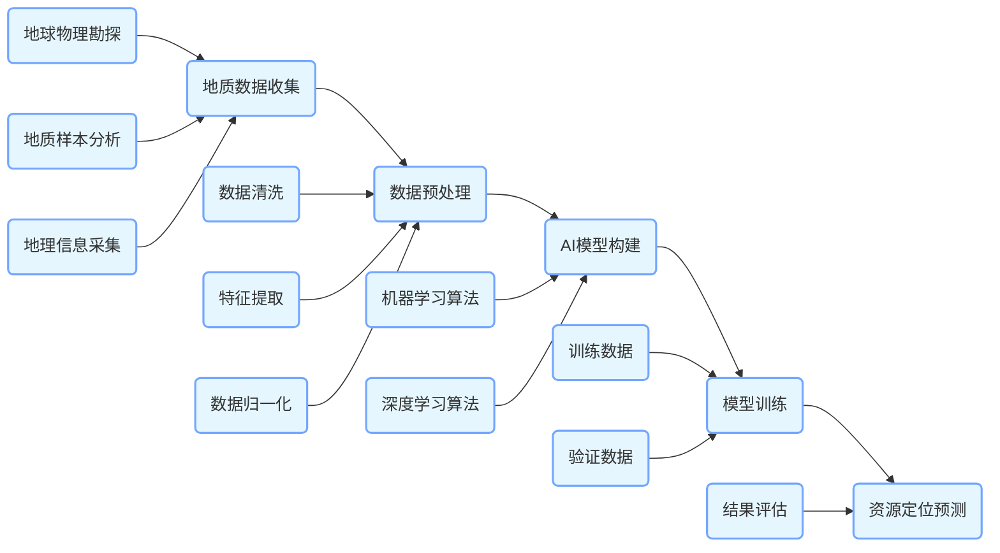

# AI辅助地质勘探：从数据分析到资源定位

> 关键词：AI、地质勘探、数据分析、资源定位、机器学习、深度学习

> 摘要：本文围绕AI辅助地质勘探从数据分析到资源定位展开深入探讨。首先介绍了研究背景，明确目的、范围、预期读者、文档结构及相关术语。接着阐述核心概念与联系，通过示意图和流程图展示AI与地质勘探的融合原理。详细讲解核心算法原理，并用Python代码说明。分析数学模型和公式，结合实例加深理解。通过项目实战给出代码案例及详细解读。探讨了AI在地质勘探中的实际应用场景，推荐了学习资源、开发工具框架及相关论文著作。最后总结未来发展趋势与挑战，提供常见问题解答和扩展阅读参考资料，旨在为地质勘探领域应用AI技术提供全面的指导和参考。

## 1. 背景介绍 
### 1.1 目的和范围
地质勘探是寻找和评估地下矿产资源、能源资源等的重要手段。传统地质勘探方法依赖于大量的人力、物力投入，且勘探周期长、成本高，同时受到地质条件复杂性和勘探人员经验的限制。随着人工智能技术的快速发展，其在地质勘探领域的应用逐渐成为研究热点。本文的目的是探讨如何利用AI技术辅助地质勘探，从海量的地质数据中提取有价值的信息，实现更精准的资源定位。范围涵盖了AI在地质数据处理、数据分析、模型构建以及资源定位等方面的应用。

### 1.2 预期读者
本文预期读者包括地质勘探领域的专业人员，如地质学家、勘探工程师等，他们可以通过本文了解如何将AI技术融入到现有的地质勘探工作流程中，提高勘探效率和准确性；人工智能领域的研究人员和开发者，他们可以从地质勘探的实际需求出发，探索AI技术在该领域的创新应用；高校相关专业的学生，包括地质工程、计算机科学等专业，通过阅读本文可以拓宽知识面，了解跨学科领域的研究动态。

### 1.3 文档结构概述
本文将按照以下结构展开：首先介绍核心概念与联系，明确AI与地质勘探相关概念及其关系；接着详细阐述核心算法原理和具体操作步骤，并用Python代码进行说明；分析数学模型和公式，并举例说明其在地质勘探中的应用；通过项目实战展示代码实际案例和详细解释；探讨AI在地质勘探中的实际应用场景；推荐相关的学习资源、开发工具框架和论文著作；最后总结未来发展趋势与挑战，提供常见问题解答和扩展阅读参考资料。

### 1.4 术语表
#### 1.4.1 核心术语定义
- **地质勘探**：是指为了寻找和查明矿产资源，对一定地区内的岩石、地层、构造、矿产、地下水、地貌等地质情况进行调查研究工作。
- **人工智能（AI）**：是研究、开发用于模拟、延伸和扩展人的智能的理论、方法、技术及应用系统的一门新的技术科学。
- **机器学习**：是一门多领域交叉学科，涉及概率论、统计学、逼近论、凸分析、算法复杂度理论等多门学科。它专门研究计算机怎样模拟或实现人类的学习行为，以获取新的知识或技能，重新组织已有的知识结构使之不断改善自身的性能。
- **深度学习**：是机器学习的一个分支领域，它是一种基于对数据进行表征学习的方法。深度学习通过构建具有很多层的神经网络模型，自动从大量数据中学习特征和模式。

#### 1.4.2 相关概念解释
- **地质数据**：包括地质调查过程中获取的各种数据，如岩石样本的化学成分、地质构造的图像、地球物理勘探数据（如重力、磁力、地震波等）、地理信息数据等。
- **资源定位**：是指通过对地质数据的分析和处理，确定地下矿产资源、能源资源等的位置和储量。

#### 1.4.3 缩略词列表
- **AI**：Artificial Intelligence（人工智能）
- **ML**：Machine Learning（机器学习）
- **DL**：Deep Learning（深度学习）
- **GIS**：Geographic Information System（地理信息系统）

## 2. 核心概念与联系 

### 核心概念原理
在AI辅助地质勘探中，主要涉及到地质数据的收集、处理、分析和模型构建等环节。地质数据是基础，通过各种勘探手段获取大量的原始数据，包括地质样本的物理化学性质、地球物理场数据、地理信息数据等。AI技术主要用于对这些数据进行处理和分析，挖掘数据中的潜在信息和模式。

机器学习和深度学习是AI在地质勘探中常用的技术手段。机器学习算法可以对地质数据进行分类、回归和聚类分析。例如，使用分类算法可以将不同类型的岩石样本进行分类；回归算法可以预测矿产资源的储量；聚类算法可以将相似地质特征的区域进行划分。深度学习算法，特别是卷积神经网络（CNN）和循环神经网络（RNN），在处理地质图像数据和序列数据方面具有优势。CNN可以自动提取地质图像中的特征，用于识别地质构造和矿产分布；RNN可以处理时间序列的地质数据，如地震波数据。

### 架构的文本示意图
```plaintext
地质数据收集 --> 数据预处理 --> AI模型构建 --> 模型训练 --> 资源定位预测
    |             |               |               |               |
    |             |               |               |               |
地球物理勘探    数据清洗        机器学习算法     训练数据        结果评估
地质样本分析    特征提取        深度学习算法     验证数据
地理信息采集    数据归一化
```

### Mermaid流程图


## 3. 核心算法原理 & 具体操作步骤 

### 机器学习算法 - 决策树
决策树是一种常用的机器学习算法，它可以用于分类和回归问题。决策树通过构建一个树形结构来进行决策，每个内部节点表示一个属性上的测试，每个分支表示一个测试输出，每个叶节点表示一个类别或值。

#### 算法原理
决策树的构建过程是一个递归的过程，其基本思想是选择一个最优的属性作为当前节点的划分属性，将数据集划分为多个子集，然后对每个子集递归地构建决策树。常用的划分属性选择方法有信息增益、信息增益比、基尼指数等。

#### Python代码实现
```python
import pandas as pd
from sklearn.model_selection import train_test_split
from sklearn.tree import DecisionTreeClassifier
from sklearn.metrics import accuracy_score

# 加载地质数据（假设数据存储在CSV文件中）
data = pd.read_csv('geological_data.csv')

# 分离特征和标签
X = data.drop('target', axis=1)
y = data['target']

# 划分训练集和测试集
X_train, X_test, y_train, y_test = train_test_split(X, y, test_size=0.2, random_state=42)

# 创建决策树分类器
clf = DecisionTreeClassifier()

# 训练模型
clf.fit(X_train, y_train)

# 预测
y_pred = clf.predict(X_test)

# 评估模型
accuracy = accuracy_score(y_test, y_pred)
print(f"决策树模型的准确率: {accuracy}")
```

### 深度学习算法 - 卷积神经网络（CNN）
CNN是一种专门用于处理具有网格结构数据的深度学习算法，如图像数据。在地质勘探中，CNN可以用于处理地质图像数据，如卫星遥感图像、地质构造图像等。

#### 算法原理
CNN主要由卷积层、池化层和全连接层组成。卷积层通过卷积核在输入数据上滑动，提取数据的局部特征；池化层用于对卷积层的输出进行下采样，减少数据的维度；全连接层将池化层的输出进行连接，进行分类或回归预测。

#### Python代码实现
```python
import tensorflow as tf
from tensorflow.keras import layers, models
from tensorflow.keras.preprocessing.image import ImageDataGenerator

# 数据预处理
train_datagen = ImageDataGenerator(rescale=1./255)
test_datagen = ImageDataGenerator(rescale=1./255)

train_generator = train_datagen.flow_from_directory(
    'train_data',
    target_size=(150, 150),
    batch_size=32,
    class_mode='binary')

test_generator = test_datagen.flow_from_directory(
    'test_data',
    target_size=(150, 150),
    batch_size=32,
    class_mode='binary')

# 构建CNN模型
model = models.Sequential()
model.add(layers.Conv2D(32, (3, 3), activation='relu', input_shape=(150, 150, 3)))
model.add(layers.MaxPooling2D((2, 2)))
model.add(layers.Conv2D(64, (3, 3), activation='relu'))
model.add(layers.MaxPooling2D((2, 2)))
model.add(layers.Conv2D(128, (3, 3), activation='relu'))
model.add(layers.MaxPooling2D((2, 2)))
model.add(layers.Flatten())
model.add(layers.Dense(128, activation='relu'))
model.add(layers.Dense(1, activation='sigmoid'))

# 编译模型
model.compile(optimizer='adam',
              loss='binary_crossentropy',
              metrics=['accuracy'])

# 训练模型
model.fit(
    train_generator,
    steps_per_epoch=train_generator.samples // 32,
    epochs=10,
    validation_data=test_generator,
    validation_steps=test_generator.samples // 32)

# 评估模型
test_loss, test_acc = model.evaluate(test_generator)
print(f"CNN模型的准确率: {test_acc}")
```

## 4. 数学模型和公式 & 详细讲解 & 举例说明 

### 信息增益
信息增益是决策树算法中常用的划分属性选择方法，它基于信息熵的概念。

#### 信息熵
信息熵是用来衡量一个随机变量不确定性的指标。对于一个离散随机变量 $X$，其信息熵的计算公式为：
$$H(X) = -\sum_{i=1}^{n} p(x_i) \log_2 p(x_i)$$
其中，$p(x_i)$ 是随机变量 $X$ 取值为 $x_i$ 的概率，$n$ 是 $X$ 可能取值的个数。

#### 条件熵
条件熵是在已知另一个随机变量 $Y$ 的条件下，随机变量 $X$ 的不确定性。其计算公式为：
$$H(X|Y) = \sum_{j=1}^{m} p(y_j) H(X|Y=y_j)$$
其中，$p(y_j)$ 是随机变量 $Y$ 取值为 $y_j$ 的概率，$m$ 是 $Y$ 可能取值的个数，$H(X|Y=y_j)$ 是在 $Y=y_j$ 的条件下 $X$ 的信息熵。

#### 信息增益
信息增益是信息熵与条件熵的差值，它表示在已知随机变量 $Y$ 的条件下，随机变量 $X$ 的不确定性减少的程度。其计算公式为：
$$IG(X,Y) = H(X) - H(X|Y)$$

#### 举例说明
假设有一个地质数据集，包含两个属性：岩石类型（$X$）和是否有矿产（$Y$）。岩石类型有三种取值：砂岩、页岩、石灰岩；是否有矿产有两种取值：有、无。通过计算信息熵、条件熵和信息增益，可以选择最优的划分属性。

### 卷积操作
卷积操作是CNN中的核心操作，它通过卷积核在输入数据上滑动，进行元素相乘并求和，得到输出特征图。

#### 卷积公式
对于一个二维输入数据 $I$ 和一个二维卷积核 $K$，卷积操作的计算公式为：
$$(I * K)(i,j) = \sum_{m=0}^{M-1} \sum_{n=0}^{N-1} I(i+m, j+n) K(m,n)$$
其中，$M$ 和 $N$ 是卷积核的尺寸，$(i,j)$ 是输出特征图的位置。

#### 举例说明
假设输入数据 $I$ 是一个 $3\times3$ 的矩阵：
$$I = \begin{bmatrix}
1 & 2 & 3 \\
4 & 5 & 6 \\
7 & 8 & 9
\end{bmatrix}$$
卷积核 $K$ 是一个 $2\times2$ 的矩阵：
$$K = \begin{bmatrix}
1 & 0 \\
0 & 1
\end{bmatrix}$$
进行卷积操作时，卷积核在输入数据上滑动，计算元素相乘并求和。例如，当卷积核位于输入数据的左上角时：
$$(I * K)(0,0) = 1\times1 + 2\times0 + 4\times0 + 5\times1 = 6$$
依次计算得到输出特征图。

## 5. 项目实战：代码实际案例和详细解释说明 

### 5.1  开发环境搭建
#### 操作系统
可以选择Windows、Linux或macOS操作系统。这里以Ubuntu 20.04为例进行说明。

#### Python环境
安装Python 3.8及以上版本。可以使用以下命令安装：
```bash
sudo apt update
sudo apt install python3.8
```

#### 依赖库安装
使用pip安装所需的依赖库，包括pandas、scikit-learn、tensorflow等：
```bash
pip install pandas scikit-learn tensorflow
```

### 5.2  源代码详细实现和代码解读
#### 数据预处理
```python
import pandas as pd
from sklearn.preprocessing import StandardScaler

# 加载地质数据
data = pd.read_csv('geological_data.csv')

# 分离特征和标签
X = data.drop('target', axis=1)
y = data['target']

# 数据标准化
scaler = StandardScaler()
X_scaled = scaler.fit_transform(X)
```
代码解读：首先使用pandas库加载地质数据，然后将特征和标签分离。使用StandardScaler对特征数据进行标准化处理，将数据的均值变为0，标准差变为1，有助于提高模型的训练效果。

#### 模型构建和训练
```python
from sklearn.model_selection import train_test_split
from sklearn.ensemble import RandomForestClassifier
from sklearn.metrics import accuracy_score

# 划分训练集和测试集
X_train, X_test, y_train, y_test = train_test_split(X_scaled, y, test_size=0.2, random_state=42)

# 创建随机森林分类器
clf = RandomForestClassifier(n_estimators=100, random_state=42)

# 训练模型
clf.fit(X_train, y_train)

# 预测
y_pred = clf.predict(X_test)

# 评估模型
accuracy = accuracy_score(y_test, y_pred)
print(f"随机森林模型的准确率: {accuracy}")
```
代码解读：使用train_test_split函数将标准化后的特征数据和标签数据划分为训练集和测试集。创建一个随机森林分类器，设置树的数量为100。使用训练集数据对模型进行训练，然后使用测试集数据进行预测。最后使用accuracy_score函数计算模型的准确率。

### 5.3  代码解读与分析
#### 数据预处理的重要性
数据预处理是机器学习项目中非常重要的一步。通过数据标准化，可以消除不同特征之间的量纲差异，使得模型能够更好地学习特征之间的关系。此外，数据清洗、特征选择等预处理步骤也可以提高数据的质量，减少噪声和冗余信息对模型的影响。

#### 模型选择和调优
在本项目中，选择了随机森林分类器。随机森林是一种集成学习算法，它通过组合多个决策树来提高模型的性能和稳定性。在实际应用中，可以根据数据的特点和问题的需求选择不同的模型，如支持向量机、神经网络等。同时，还可以通过调整模型的超参数，如树的数量、最大深度等，来进一步优化模型的性能。

## 6. 实际应用场景 
### 矿产资源勘探
AI可以对地质数据进行分析，识别潜在的矿产资源区域。通过对地球物理勘探数据、地质样本分析数据等进行处理和建模，可以预测矿产资源的分布和储量。例如，使用机器学习算法对岩石样本的化学成分进行分析，判断是否存在某种矿产资源；使用深度学习算法对卫星遥感图像进行处理，识别地质构造和矿化蚀变带。

### 油气勘探
在油气勘探中，AI可以帮助分析地震波数据，识别地下油气储层的位置和特征。通过对地震波数据进行处理和解释，建立地下地质模型，预测油气储层的分布和性质。例如，使用卷积神经网络对地震波图像进行分析，识别油气储层的边界和厚度。

### 地质灾害预警
AI可以对地质灾害相关数据进行监测和分析，提前预警地质灾害的发生。通过对地形地貌数据、气象数据、地下水数据等进行处理和建模，可以预测山体滑坡、泥石流等地质灾害的发生概率和范围。例如，使用时间序列分析算法对地下水水位数据进行分析，判断是否存在山体滑坡的风险。

## 7. 工具和资源推荐
### 7.1 学习资源推荐
#### 7.1.1 书籍推荐
- 《Python机器学习》：介绍了Python在机器学习中的应用，包括各种机器学习算法的原理和实现。
- 《深度学习》：由深度学习领域的三位顶尖专家Ian Goodfellow、Yoshua Bengio和Aaron Courville撰写，系统地介绍了深度学习的理论和实践。
- 《地质统计学》：介绍了地质统计学的基本原理和方法，包括空间数据分析、克里金插值等，对于处理地质数据非常有帮助。

#### 7.1.2 在线课程
- Coursera上的“机器学习”课程：由Andrew Ng教授主讲，是机器学习领域的经典课程，适合初学者入门。
- edX上的“深度学习”课程：由多个知名高校和机构提供，深入介绍了深度学习的理论和实践。
- Udemy上的“地质勘探数据分析”课程：专门针对地质勘探领域的数据处理和分析，结合实际案例进行讲解。

#### 7.1.3 技术博客和网站
- Medium：有很多关于AI和地质勘探的技术博客文章，涵盖了最新的研究成果和应用案例。
- Kaggle：一个数据科学竞赛平台，有很多关于地质数据的竞赛和数据集，可以学习其他选手的解决方案和代码。
- Geoscience World：提供地质科学领域的最新研究成果和学术论文，对于了解地质勘探的前沿技术有很大帮助。

### 7.2 开发工具框架推荐
#### 7.2.1 IDE和编辑器
- PyCharm：是一款专门为Python开发设计的集成开发环境，具有代码自动补全、调试、版本控制等功能，非常适合Python项目的开发。
- Jupyter Notebook：是一个交互式的开发环境，可以将代码、文本、图像等整合在一起，方便进行数据分析和模型验证。
- Visual Studio Code：是一款轻量级的代码编辑器，支持多种编程语言和插件，具有丰富的扩展功能。

#### 7.2.2 调试和性能分析工具
- TensorBoard：是TensorFlow提供的可视化工具，可以用于监控模型的训练过程，如损失函数、准确率等指标的变化情况。
- Py-Spy：是一个Python性能分析工具，可以分析Python程序的性能瓶颈，找出耗时较长的代码段。
- Scikit-learn的GridSearchCV：可以用于模型的超参数调优，通过网格搜索的方式找到最优的超参数组合。

#### 7.2.3 相关框架和库
- Scikit-learn：是一个常用的机器学习库，提供了各种机器学习算法的实现，如分类、回归、聚类等。
- TensorFlow：是一个开源的深度学习框架，由Google开发，支持多种深度学习模型的构建和训练。
- PyTorch：是另一个流行的深度学习框架，具有动态图的特点，易于使用和调试。

### 7.3 相关论文著作推荐
#### 7.3.1 经典论文
- “Random Forests”：介绍了随机森林算法的原理和应用，是随机森林领域的经典论文。
- “Gradient-Based Learning Applied to Document Recognition”：由Yann LeCun等人撰写，提出了卷积神经网络（CNN）的概念，为深度学习在图像识别领域的应用奠定了基础。
- “Support-Vector Networks”：介绍了支持向量机（SVM）的原理和算法，是SVM领域的经典论文。

#### 7.3.2 最新研究成果
- 关注《Geophysical Research Letters》、《Journal of Geophysical Research: Solid Earth》等地质科学领域的顶级期刊，了解AI在地质勘探中的最新研究成果。
- 参加国际地球物理年会（AGU）、欧洲地球科学联盟大会（EGU）等学术会议，获取最新的研究动态和学术报告。

#### 7.3.3 应用案例分析
- 研究一些实际的AI辅助地质勘探项目案例，如某公司使用AI技术进行油气勘探的案例，了解AI技术在实际应用中的具体实现和效果。

## 8. 总结：未来发展趋势与挑战
### 未来发展趋势
- **多源数据融合**：未来AI辅助地质勘探将更加注重多源数据的融合，包括地球物理数据、地质样本数据、地理信息数据、卫星遥感数据等。通过融合多种数据，可以更全面地了解地下地质情况，提高资源定位的准确性。
- **智能化勘探装备**：随着AI技术的发展，地质勘探装备将越来越智能化。例如，智能传感器可以实时采集和传输地质数据，智能机器人可以在复杂的地质环境中进行勘探工作，提高勘探效率和安全性。
- **云平台和大数据分析**：云平台和大数据分析技术将在地质勘探中得到广泛应用。通过将地质数据存储在云端，可以实现数据的共享和协同分析。同时，大数据分析技术可以处理海量的地质数据，挖掘数据中的潜在信息和模式。

### 挑战
- **数据质量和可用性**：地质数据的质量和可用性是AI辅助地质勘探面临的主要挑战之一。地质数据通常具有噪声大、缺失值多、数据格式不一致等问题，需要进行大量的数据预处理工作。此外，一些地质数据由于涉及到商业机密和国家安全等原因，可能无法公开获取，限制了AI模型的训练和应用。
- **模型可解释性**：AI模型，特别是深度学习模型，通常是一个“黑箱”，难以解释模型的决策过程和结果。在地质勘探中，模型的可解释性非常重要，因为地质学家需要了解模型是如何得出资源定位结果的，以便进行决策和验证。
- **人才短缺**：AI辅助地质勘探需要既懂AI技术又懂地质勘探的复合型人才。目前，这类人才相对短缺，限制了AI技术在地质勘探领域的推广和应用。

## 9. 附录：常见问题与解答
### 问题1：AI技术在地质勘探中的应用是否会取代地质学家的工作？
解答：不会。AI技术可以辅助地质学家进行数据处理和分析，提高勘探效率和准确性，但地质学家的专业知识和经验仍然是不可或缺的。地质学家可以对AI模型的结果进行解释和验证，结合实际地质情况进行决策。此外，地质勘探还涉及到野外调查、样本采集等工作，需要地质学家的实地操作。

### 问题2：如何选择适合地质勘探的AI算法？
解答：选择适合地质勘探的AI算法需要考虑数据的特点和问题的需求。如果数据是结构化的，如地质样本的化学成分数据，可以选择机器学习算法，如决策树、随机森林、支持向量机等。如果数据是图像数据，如卫星遥感图像、地质构造图像等，可以选择深度学习算法，如卷积神经网络（CNN）。此外，还可以通过实验和比较不同算法的性能，选择最优的算法。

### 问题3：AI模型的训练需要多少地质数据？
解答：AI模型的训练需要的地质数据量取决于模型的复杂度和数据的特点。一般来说，数据量越大，模型的性能越好。但在实际应用中，由于地质数据的获取成本较高，可能无法获取大量的数据。可以通过数据增强、迁移学习等方法来解决数据不足的问题。同时，也可以根据模型的性能评估结果，逐步调整数据量。

## 10. 扩展阅读 & 参考资料
### 扩展阅读
- 《人工智能与地质科学》：深入探讨了AI技术在地质科学各个领域的应用和发展前景。
- 《地质大数据与人工智能》：介绍了地质大数据的特点和处理方法，以及AI技术在地质大数据分析中的应用。

### 参考资料
- 相关的学术论文和研究报告，可以在学术数据库如IEEE Xplore、ACM Digital Library、Google Scholar等中查找。
- 地质勘探领域的行业标准和规范，如《地质勘探规范》等。
- 相关的开源代码和数据集，可以在GitHub、Kaggle等平台上查找。