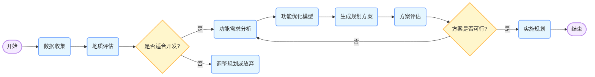

# AI辅助城市地下空间规划：从地质评估到功能优化

> 关键词：AI、城市地下空间规划、地质评估、功能优化、机器学习

> 摘要：本文深入探讨了AI在城市地下空间规划中的应用，从地质评估到功能优化的各个环节。首先介绍了研究的背景、目的、预期读者和文档结构等内容。接着阐述了核心概念及其联系，详细讲解了相关核心算法原理和具体操作步骤，并给出了数学模型和公式。通过实际项目案例展示了AI在地下空间规划中的具体应用，分析了其在不同实际场景中的作用。最后推荐了学习资源、开发工具和相关论文，总结了未来发展趋势与挑战，还提供了常见问题解答和扩展阅读参考资料。

## 1. 背景介绍 
### 1.1 目的和范围
随着城市化进程的加速，城市地上空间日益紧张，城市地下空间的开发和利用成为解决城市发展问题的重要途径。然而，城市地下空间规划是一个复杂的系统工程，涉及地质条件、工程技术、功能需求、环境影响等多个方面。本研究的目的是探讨如何利用AI技术辅助城市地下空间规划，提高规划的科学性、合理性和效率。研究范围涵盖了从地质评估到功能优化的整个城市地下空间规划流程。

### 1.2 预期读者
本文的预期读者包括城市规划师、土木工程师、地质学家、AI研究人员以及对城市地下空间开发和AI应用感兴趣的相关人士。

### 1.3 文档结构概述
本文共分为十个部分。第一部分为背景介绍，阐述了研究的目的、范围、预期读者和文档结构；第二部分介绍核心概念与联系，包括相关概念的原理和架构，并给出文本示意图和Mermaid流程图；第三部分讲解核心算法原理和具体操作步骤，通过Python源代码进行详细阐述；第四部分给出数学模型和公式，并进行详细讲解和举例说明；第五部分是项目实战，包括开发环境搭建、源代码详细实现和代码解读；第六部分分析实际应用场景；第七部分推荐工具和资源，包括学习资源、开发工具框架和相关论文著作；第八部分总结未来发展趋势与挑战；第九部分为附录，提供常见问题与解答；第十部分列出扩展阅读和参考资料。

### 1.4 术语表
#### 1.4.1 核心术语定义
- **城市地下空间规划**：对城市地下空间的开发、利用和管理进行统筹安排和综合部署的过程。
- **地质评估**：对地下地质条件进行调查、分析和评价，为地下空间规划和工程建设提供依据。
- **AI（人工智能）**：使计算机系统能够模拟人类智能的技术和方法，包括机器学习、深度学习、自然语言处理等。
- **功能优化**：对城市地下空间的功能布局进行调整和优化，以提高空间的使用效率和效益。

#### 1.4.2 相关概念解释
- **机器学习**：AI的一个重要分支，通过让计算机从数据中学习模式和规律，从而实现预测、分类等任务。
- **地理信息系统（GIS）**：用于采集、存储、管理、分析和展示地理空间数据的系统，在城市地下空间规划中具有重要作用。

#### 1.4.3 缩略词列表
- **AI**：Artificial Intelligence
- **GIS**：Geographic Information System

## 2. 核心概念与联系 
### 核心概念原理
在城市地下空间规划中，涉及到多个核心概念，它们相互关联，共同构成了整个规划体系。地质评估是基础，通过对地下地质条件的详细了解，确定地下空间开发的可行性和潜在风险。AI技术则为地质评估和功能优化提供了强大的工具和方法。机器学习算法可以对地质数据进行分析和建模，预测地质灾害的发生概率；同时，也可以对地下空间的功能需求进行分析和优化。

功能优化是城市地下空间规划的目标之一，通过合理布局地下空间的功能区域，提高空间的使用效率和舒适度。这需要综合考虑地质条件、交通流线、人流分布等多个因素。而AI可以通过对大量数据的分析和模拟，找到最优的功能布局方案。

### 架构的文本示意图
城市地下空间规划的架构可以分为数据层、模型层和应用层。数据层包括地质数据、地理信息数据、人口数据等，是整个规划的基础。模型层包括地质评估模型、功能优化模型等，通过AI算法对数据进行处理和分析。应用层则是将模型的结果应用到实际的规划中，如生成规划方案、进行可视化展示等。

### Mermaid流程图


## 3. 核心算法原理 & 具体操作步骤 
### 核心算法原理
在城市地下空间规划中，常用的AI算法包括决策树、神经网络和支持向量机等。以决策树算法为例，它是一种基于树结构进行决策的算法。决策树的每个内部节点是一个属性上的测试，每个分支是一个测试输出，每个叶节点是一个类别或值。通过对训练数据的学习，决策树可以构建出一个能够对新数据进行分类或预测的模型。

### 具体操作步骤及Python源代码
以下是一个使用Python实现决策树算法进行地质评估的示例：
```python
import pandas as pd
from sklearn.tree import DecisionTreeClassifier
from sklearn.model_selection import train_test_split
from sklearn.metrics import accuracy_score

# 加载地质数据
data = pd.read_csv('geological_data.csv')

# 分离特征和标签
X = data.drop('suitability', axis=1)
y = data['suitability']

# 划分训练集和测试集
X_train, X_test, y_train, y_test = train_test_split(X, y, test_size=0.2, random_state=42)

# 创建决策树分类器
clf = DecisionTreeClassifier()

# 训练模型
clf.fit(X_train, y_train)

# 进行预测
y_pred = clf.predict(X_test)

# 计算准确率
accuracy = accuracy_score(y_test, y_pred)
print(f"模型准确率: {accuracy}")
```
### 代码解释
1. **数据加载**：使用`pandas`库的`read_csv`函数加载地质数据。
2. **特征和标签分离**：将数据集中的特征和标签分离，其中`'suitability'`列为标签。
3. **数据集划分**：使用`train_test_split`函数将数据集划分为训练集和测试集，测试集占比为20%。
4. **模型创建和训练**：创建一个决策树分类器，并使用训练集对其进行训练。
5. **预测和评估**：使用训练好的模型对测试集进行预测，并计算预测的准确率。

## 4. 数学模型和公式 & 详细讲解 & 举例说明 
### 决策树算法的数学模型
决策树算法的核心是信息增益，信息增益用于衡量一个属性对分类的重要性。信息增益的计算公式为：
$$
IG(S, A) = H(S) - \sum_{v \in Values(A)} \frac{|S_v|}{|S|} H(S_v)
$$
其中，$IG(S, A)$ 表示属性 $A$ 对数据集 $S$ 的信息增益，$H(S)$ 是数据集 $S$ 的熵，$S_v$ 是数据集 $S$ 中属性 $A$ 取值为 $v$ 的子集。

### 熵的计算公式
熵是衡量数据集不确定性的指标，计算公式为：
$$
H(S) = - \sum_{i=1}^{n} p_i \log_2 p_i
$$
其中，$p_i$ 是数据集 $S$ 中第 $i$ 类样本的比例，$n$ 是类别数。

### 详细讲解
信息增益的计算过程是先计算数据集的熵 $H(S)$，然后对于每个属性 $A$，计算其不同取值下子集的熵 $H(S_v)$，并根据子集的大小进行加权求和。最后用数据集的熵减去加权后的子集熵，得到该属性的信息增益。信息增益越大，说明该属性对分类的贡献越大，越适合作为决策树的划分属性。

### 举例说明
假设有一个地质数据集，包含属性`岩石类型`、`地下水位`和标签`是否适合开发`。数据集共有10个样本，其中适合开发的有6个，不适合开发的有4个。

首先计算数据集的熵：
$$
H(S) = - \frac{6}{10} \log_2 \frac{6}{10} - \frac{4}{10} \log_2 \frac{4}{10} \approx 0.971
$$

假设`岩石类型`有两种取值：硬岩和软岩。硬岩样本有7个，其中适合开发的有5个，不适合开发的有2个；软岩样本有3个，其中适合开发的有1个，不适合开发的有2个。

计算硬岩子集的熵：
$$
H(S_{硬岩}) = - \frac{5}{7} \log_2 \frac{5}{7} - \frac{2}{7} \log_2 \frac{2}{7} \approx 0.863
$$

计算软岩子集的熵：
$$
H(S_{软岩}) = - \frac{1}{3} \log_2 \frac{1}{3} - \frac{2}{3} \log_2 \frac{2}{3} \approx 0.918
$$

计算`岩石类型`属性的信息增益：
$$
IG(S, 岩石类型) = 0.971 - \frac{7}{10} \times 0.863 - \frac{3}{10} \times 0.918 \approx 0.128
$$

通过比较不同属性的信息增益，可以选择信息增益最大的属性作为决策树的根节点。

## 5. 项目实战：代码实际案例和详细解释说明 
### 5.1  开发环境搭建
#### 安装Python
首先需要安装Python，建议使用Python 3.7及以上版本。可以从Python官方网站（https://www.python.org/downloads/）下载安装包进行安装。

#### 安装必要的库
使用`pip`命令安装项目所需的库，包括`pandas`、`scikit-learn`等：
```sh
pip install pandas scikit-learn
```

### 5.2  源代码详细实现和代码解读
以下是一个完整的项目代码示例，用于实现基于AI的城市地下空间功能优化：
```python
import pandas as pd
from sklearn.cluster import KMeans
import matplotlib.pyplot as plt

# 加载地下空间功能需求数据
data = pd.read_csv('underground_space_demand.csv')

# 选择特征
features = data[['traffic_flow', 'population_density', 'commercial_demand']]

# 确定聚类的数量
k = 3

# 创建KMeans聚类模型
kmeans = KMeans(n_clusters=k)

# 训练模型
kmeans.fit(features)

# 获取聚类标签
labels = kmeans.labels_

# 将聚类标签添加到原始数据中
data['cluster'] = labels

# 可视化聚类结果
plt.scatter(data['traffic_flow'], data['population_density'], c=labels, cmap='viridis')
plt.xlabel('Traffic Flow')
plt.ylabel('Population Density')
plt.title('Underground Space Function Clustering')
plt.show()

# 根据聚类结果进行功能优化
for cluster in range(k):
    cluster_data = data[data['cluster'] == cluster]
    # 这里可以根据聚类结果进行具体的功能优化操作，例如调整商业设施的布局等
    print(f"Cluster {cluster} optimization:")
    print(cluster_data.describe())
```
### 5.3  代码解读与分析
1. **数据加载**：使用`pandas`库的`read_csv`函数加载地下空间功能需求数据。
2. **特征选择**：选择`traffic_flow`（交通流量）、`population_density`（人口密度）和`commercial_demand`（商业需求）作为特征。
3. **聚类模型创建和训练**：使用`KMeans`算法进行聚类，指定聚类的数量为3。
4. **聚类标签获取和添加**：获取聚类标签，并将其添加到原始数据中。
5. **可视化**：使用`matplotlib`库将聚类结果可视化，不同的聚类用不同的颜色表示。
6. **功能优化**：根据聚类结果，对每个聚类的数据进行分析和处理，例如调整商业设施的布局等。

## 6. 实际应用场景 
### 地质评估阶段
在地质评估阶段，AI可以帮助分析大量的地质数据，包括岩石类型、地质构造、地下水位等。通过机器学习算法，可以对地质灾害的发生概率进行预测，如地震、滑坡、地面沉降等。例如，利用神经网络模型对地震数据进行学习和分析，预测不同区域发生地震的可能性，为地下空间的选址提供参考。

### 功能布局优化
在地下空间的功能布局方面，AI可以综合考虑交通流线、人流分布、商业需求等因素，优化地下商场、停车场、地铁站等功能区域的布局。通过模拟不同的布局方案，评估其对空间使用效率和用户体验的影响，找到最优的布局方案。例如，使用遗传算法对地下商场的店铺布局进行优化，提高商场的客流量和销售额。

### 环境监测与管理
AI还可以应用于地下空间的环境监测与管理。通过传感器收集地下空间的温度、湿度、空气质量等数据，利用机器学习算法对数据进行分析和处理，及时发现环境异常并采取相应的措施。例如，当检测到地下停车场的一氧化碳浓度超标时，自动启动通风设备。

## 7. 工具和资源推荐
### 7.1 学习资源推荐
#### 7.1.1 书籍推荐
- 《Python机器学习》：介绍了Python在机器学习中的应用，包括各种机器学习算法的原理和实现。
- 《地理信息系统原理与方法》：详细讲解了地理信息系统的基本原理和方法，对于理解城市地下空间规划中的地理数据处理有很大帮助。
- 《城市地下空间规划与设计》：系统阐述了城市地下空间规划的理论和方法，是城市规划专业的经典教材。

#### 7.1.2 在线课程
- Coursera上的“机器学习”课程：由斯坦福大学教授Andrew Ng主讲，是机器学习领域的经典课程。
- edX上的“地理信息系统入门”课程：介绍了地理信息系统的基本概念和操作方法。

#### 7.1.3 技术博客和网站
- Medium：有很多关于AI和城市规划的技术文章和案例分享。
- GIS Lounge：专注于地理信息系统领域的技术博客，提供了丰富的GIS资源和教程。

### 7.2 开发工具框架推荐
#### 7.2.1 IDE和编辑器
- PyCharm：是一款专门为Python开发设计的集成开发环境，具有强大的代码编辑、调试和自动补全功能。
- Jupyter Notebook：可以将代码、文本、图像等组合在一起，方便进行数据分析和模型开发。

#### 7.2.2 调试和性能分析工具
- TensorBoard：用于可视化深度学习模型的训练过程和性能指标。
- Scikit-learn的`cross_val_score`函数：可以用于评估机器学习模型的性能和进行交叉验证。

#### 7.2.3 相关框架和库
- Scikit-learn：是一个常用的机器学习库，提供了丰富的机器学习算法和工具。
- GeoPandas：是基于`pandas`的地理数据处理库，方便进行地理数据的分析和可视化。

### 7.3 相关论文著作推荐
#### 7.3.1 经典论文
- “Data-driven urban underground space planning using machine learning algorithms”：探讨了如何使用机器学习算法进行城市地下空间规划。
- “Geological hazard assessment in urban underground space development based on artificial intelligence”：研究了基于人工智能的城市地下空间开发中的地质灾害评估方法。

#### 7.3.2 最新研究成果
可以通过IEEE Xplore、ACM Digital Library等学术数据库搜索关于AI辅助城市地下空间规划的最新研究成果。

#### 7.3.3 应用案例分析
- 某些大型城市的地下交通枢纽建设项目案例，分析了AI在地质评估、功能布局优化等方面的应用效果。

## 8. 总结：未来发展趋势与挑战
### 未来发展趋势
- **多学科融合**：AI与城市规划、地质学、土木工程等多学科的融合将更加深入，形成更加综合的地下空间规划方法。
- **智能化决策**：随着AI技术的不断发展，地下空间规划将实现更加智能化的决策，提高规划的效率和准确性。
- **大数据应用**：利用更多的大数据，如社交媒体数据、移动设备数据等，更好地了解用户需求，优化地下空间的功能布局。

### 挑战
- **数据质量和共享**：高质量的地质数据和城市数据是AI应用的基础，但目前数据的质量和共享程度还存在不足。
- **算法可解释性**：一些复杂的AI算法，如深度学习算法，其决策过程难以解释，这在城市规划这样的重要领域可能会带来信任问题。
- **法律法规和伦理问题**：AI在城市地下空间规划中的应用可能会涉及到法律法规和伦理问题，如数据隐私保护、规划公平性等。

## 9. 附录：常见问题与解答
### 问题1：AI在地质评估中的准确性如何保证？
答：可以通过以下方法保证AI在地质评估中的准确性：
- 收集大量高质量的地质数据，包括不同地区、不同地质条件的数据。
- 选择合适的机器学习算法，并进行模型的调优和验证。
- 结合专家的经验和知识，对模型的结果进行评估和修正。

### 问题2：如何选择适合地下空间规划的AI算法？
答：选择适合地下空间规划的AI算法需要考虑以下因素：
- 问题的类型：如分类问题、回归问题、聚类问题等。
- 数据的特点：包括数据的规模、维度、分布等。
- 算法的性能和可解释性：在保证一定性能的前提下，尽量选择可解释性强的算法。

### 问题3：AI在地下空间规划中的应用成本高吗？
答：AI在地下空间规划中的应用成本取决于多个因素，如数据采集和处理的成本、算法开发和训练的成本、硬件设备的成本等。随着技术的发展和普及，AI应用的成本在逐渐降低。同时，AI的应用可以提高规划的效率和质量，带来更大的经济效益和社会效益。

## 10. 扩展阅读 & 参考资料
### 扩展阅读
- 《智能城市：技术与应用》：介绍了智能城市的相关技术和应用案例，包括AI在城市规划中的应用。
- 《人工智能时代的城市规划变革》：探讨了人工智能对城市规划带来的变革和挑战。

### 参考资料
- 相关的学术论文和研究报告，如上述推荐的经典论文和最新研究成果。
- 城市规划相关的标准和规范，如《城市地下空间规划规范》等。