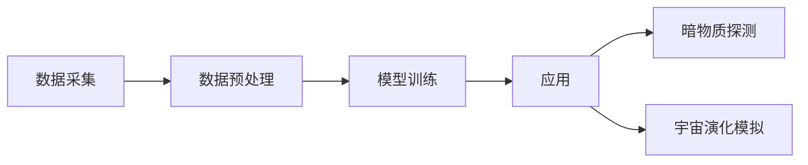

# AI辅助天文数据分析：从暗物质探测到宇宙演化模拟

> 关键词：AI、天文数据分析、暗物质探测、宇宙演化模拟、机器学习

> 摘要：本文深入探讨了AI在天文数据分析中的应用，从暗物质探测到宇宙演化模拟。首先介绍了相关背景，包括目的、预期读者等。接着阐述了核心概念与联系，展示了AI与天文数据处理的架构。详细讲解了核心算法原理及具体操作步骤，并给出Python代码示例。通过数学模型和公式进一步分析，结合实际案例进行说明。还介绍了实际应用场景、工具和资源推荐。最后总结了未来发展趋势与挑战，提供常见问题解答和扩展阅读参考资料，旨在为相关领域的研究人员和爱好者提供全面的技术知识。

## 1. 背景介绍 
### 1.1 目的和范围
随着天文观测技术的飞速发展，天文数据呈现出爆炸式增长。传统的数据分析方法在处理海量、复杂的天文数据时面临诸多挑战。本文章的目的在于探讨如何利用人工智能（AI）技术来辅助天文数据分析，涵盖从暗物质探测到宇宙演化模拟等多个重要领域。范围包括介绍AI在天文数据分析中的核心概念、算法原理、实际应用案例以及未来发展趋势等方面。

### 1.2 预期读者
本文预期读者包括天文学研究人员、AI领域的专业人士、对天文数据分析和AI技术结合感兴趣的学生以及相关领域的爱好者。希望通过本文，为不同层次的读者提供深入了解AI辅助天文数据分析的途径。

### 1.3 文档结构概述
本文将按照以下结构进行阐述：首先介绍相关背景知识，包括目的、预期读者和文档结构等。接着讲解核心概念与联系，展示AI与天文数据分析的架构。然后详细介绍核心算法原理及具体操作步骤，并给出Python代码示例。之后通过数学模型和公式进一步分析，结合实际案例进行说明。再介绍实际应用场景、工具和资源推荐。最后总结未来发展趋势与挑战，提供常见问题解答和扩展阅读参考资料。

### 1.4 术语表
#### 1.4.1 核心术语定义
- **人工智能（AI）**：是指计算机系统能够执行通常需要人类智能才能完成的任务，如学习、推理、解决问题等。
- **天文数据分析**：对天文观测得到的数据进行处理、分析和解释，以获取有关天体和宇宙的信息。
- **暗物质**：一种假设的物质形式，不与电磁辐射相互作用，因此无法直接观测到，但通过其引力效应可以推断其存在。
- **宇宙演化模拟**：利用计算机模型模拟宇宙从早期到现在的演化过程，以研究宇宙的结构形成和发展。

#### 1.4.2 相关概念解释
- **机器学习**：是AI的一个分支，通过让计算机从数据中学习模式和规律，从而进行预测和决策。
- **深度学习**：是机器学习的一种，基于神经网络模型，能够自动学习数据的复杂特征。
- **数据挖掘**：从大量数据中发现有价值的信息和知识。

#### 1.4.3 缩略词列表
- **AI**：Artificial Intelligence（人工智能）
- **ML**：Machine Learning（机器学习）
- **DL**：Deep Learning（深度学习）

## 2. 核心概念与联系 

### 核心概念原理
在AI辅助天文数据分析中，主要涉及到的核心概念包括机器学习和深度学习。机器学习通过对天文数据的学习，建立模型来预测天体的性质、暗物质的分布等。深度学习则利用神经网络的强大能力，自动提取天文数据中的复杂特征。

天文数据具有多样性，包括图像数据（如星系图像）、光谱数据、时间序列数据等。AI技术可以对这些不同类型的数据进行处理和分析。例如，在暗物质探测中，通过分析星系的引力透镜效应产生的图像，利用深度学习模型来识别暗物质的分布。在宇宙演化模拟中，机器学习可以根据观测数据调整模拟参数，使模拟结果更符合实际情况。

### 架构的文本示意图
AI辅助天文数据分析的架构可以分为数据采集、数据预处理、模型训练和应用四个主要部分。
- **数据采集**：通过天文望远镜等设备获取各种天文数据，包括图像、光谱、时间序列等。
- **数据预处理**：对采集到的数据进行清洗、归一化、特征提取等操作，以提高数据质量和可用性。
- **模型训练**：选择合适的AI模型（如神经网络、决策树等），利用预处理后的数据进行训练。
- **应用**：将训练好的模型应用于实际问题，如暗物质探测、宇宙演化模拟等。

### Mermaid流程图


## 3. 核心算法原理 & 具体操作步骤 

### 核心算法原理
在AI辅助天文数据分析中，常用的算法包括卷积神经网络（CNN）、循环神经网络（RNN）和支持向量机（SVM）等。这里以卷积神经网络为例进行详细讲解。

卷积神经网络是一种专门用于处理具有网格结构数据（如图像）的深度学习模型。它通过卷积层、池化层和全连接层来自动提取数据的特征。卷积层通过卷积核在输入数据上滑动，进行卷积操作，提取局部特征。池化层则对卷积层的输出进行下采样，减少数据的维度，同时保留重要信息。全连接层将池化层的输出进行全连接，输出最终的预测结果。

### 具体操作步骤
以下是使用Python和PyTorch库实现一个简单的卷积神经网络来处理天文图像数据的具体步骤：

```python
import torch
import torch.nn as nn
import torch.optim as optim
from torch.utils.data import DataLoader, Dataset
import numpy as np

# 定义自定义数据集类
class AstronomicalDataset(Dataset):
    def __init__(self, data, labels):
        self.data = data
        self.labels = labels

    def __len__(self):
        return len(self.data)

    def __getitem__(self, idx):
        sample = self.data[idx]
        label = self.labels[idx]
        return torch.tensor(sample, dtype=torch.float32), torch.tensor(label, dtype=torch.long)

# 定义卷积神经网络模型
class CNN(nn.Module):
    def __init__(self):
        super(CNN, self).__init__()
        self.conv1 = nn.Conv2d(1, 16, kernel_size=3, padding=1)
        self.relu1 = nn.ReLU()
        self.pool1 = nn.MaxPool2d(kernel_size=2, stride=2)
        self.conv2 = nn.Conv2d(16, 32, kernel_size=3, padding=1)
        self.relu2 = nn.ReLU()
        self.pool2 = nn.MaxPool2d(kernel_size=2, stride=2)
        self.fc1 = nn.Linear(32 * 8 * 8, 128)
        self.relu3 = nn.ReLU()
        self.fc2 = nn.Linear(128, 2)

    def forward(self, x):
        x = self.pool1(self.relu1(self.conv1(x)))
        x = self.pool2(self.relu2(self.conv2(x)))
        x = x.view(-1, 32 * 8 * 8)
        x = self.relu3(self.fc1(x))
        x = self.fc2(x)
        return x

# 生成一些示例数据
data = np.random.rand(100, 1, 32, 32)
labels = np.random.randint(0, 2, 100)

# 创建数据集和数据加载器
dataset = AstronomicalDataset(data, labels)
dataloader = DataLoader(dataset, batch_size=10, shuffle=True)

# 初始化模型、损失函数和优化器
model = CNN()
criterion = nn.CrossEntropyLoss()
optimizer = optim.Adam(model.parameters(), lr=0.001)

# 训练模型
num_epochs = 10
for epoch in range(num_epochs):
    running_loss = 0.0
    for i, (images, labels) in enumerate(dataloader):
        optimizer.zero_grad()
        outputs = model(images)
        loss = criterion(outputs, labels)
        loss.backward()
        optimizer.step()
        running_loss += loss.item()
    print(f'Epoch {epoch + 1}, Loss: {running_loss / len(dataloader)}')

```

### 代码解释
1. **自定义数据集类**：`AstronomicalDataset`类用于封装天文数据和标签，方便数据的加载和处理。
2. **卷积神经网络模型**：`CNN`类定义了一个简单的卷积神经网络，包括两个卷积层、两个池化层和两个全连接层。
3. **数据生成和加载**：生成一些示例数据，并使用`DataLoader`进行批量加载。
4. **模型训练**：使用交叉熵损失函数和Adam优化器对模型进行训练，训练10个epoch。

## 4. 数学模型和公式 & 详细讲解 & 举例说明 

### 卷积操作
卷积操作是卷积神经网络的核心操作，其数学公式为：

$$(I * K)_{i,j}=\sum_{m=0}^{M - 1}\sum_{n=0}^{N - 1}I_{i + m,j + n}K_{m,n}$$

其中，$I$ 是输入图像，$K$ 是卷积核，$M$ 和 $N$ 是卷积核的大小，$(I * K)_{i,j}$ 是卷积结果在位置 $(i,j)$ 处的值。

例如，假设有一个 $3\times3$ 的输入图像 $I$ 和一个 $2\times2$ 的卷积核 $K$：

$$I=\begin{bmatrix}
1 & 2 & 3\\
4 & 5 & 6\\
7 & 8 & 9
\end{bmatrix}$$

$$K=\begin{bmatrix}
1 & 2\\
3 & 4
\end{bmatrix}$$

则卷积结果 $(I * K)$ 的计算过程如下：

对于 $(I * K)_{0,0}$：

$$(I * K)_{0,0}=1\times1 + 2\times2+4\times3 + 5\times4=37$$

### 池化操作
池化操作通常用于减少数据的维度，常用的池化方法是最大池化。最大池化的数学公式为：

$$P_{i,j}=\max_{(m,n)\in\mathcal{R}_{i,j}}I_{m,n}$$

其中，$P$ 是池化结果，$\mathcal{R}_{i,j}$ 是池化窗口在位置 $(i,j)$ 处覆盖的区域。

例如，假设有一个 $4\times4$ 的输入图像 $I$，使用 $2\times2$ 的最大池化窗口：

$$I=\begin{bmatrix}
1 & 2 & 3 & 4\\
5 & 6 & 7 & 8\\
9 & 10 & 11 & 12\\
13 & 14 & 15 & 16
\end{bmatrix}$$

则最大池化结果 $P$ 为：

$$P=\begin{bmatrix}
6 & 8\\
14 & 16
\end{bmatrix}$$

### 损失函数
在训练卷积神经网络时，常用的损失函数是交叉熵损失函数，其数学公式为：

$$L=-\frac{1}{N}\sum_{i = 1}^{N}\sum_{j = 1}^{C}y_{i,j}\log(p_{i,j})$$

其中，$N$ 是样本数量，$C$ 是类别数量，$y_{i,j}$ 是第 $i$ 个样本的真实标签的第 $j$ 个分量，$p_{i,j}$ 是第 $i$ 个样本的预测概率的第 $j$ 个分量。

例如，假设有两个样本，真实标签分别为 $[1, 0]$ 和 $[0, 1]$，预测概率分别为 $[0.8, 0.2]$ 和 $[0.3, 0.7]$，则交叉熵损失为：

$$L=-\frac{1}{2}[(1\times\log(0.8)+0\times\log(0.2))+(0\times\log(0.3)+1\times\log(0.7))]$$

## 5. 项目实战：代码实际案例和详细解释说明 

### 5.1  开发环境搭建
要进行AI辅助天文数据分析的项目实战，需要搭建以下开发环境：
- **操作系统**：推荐使用Linux系统，如Ubuntu，也可以使用Windows或macOS。
- **编程语言**：Python是首选的编程语言，因为它有丰富的科学计算和机器学习库。
- **Python库**：需要安装PyTorch、NumPy、Pandas、Matplotlib等库。可以使用以下命令进行安装：

```bash
pip install torch numpy pandas matplotlib
```

### 5.2  源代码详细实现和代码解读
以下是一个更完整的项目实战代码示例，用于对天文图像进行分类，判断图像中是否包含特定的天体：

```python
import torch
import torch.nn as nn
import torch.optim as optim
from torch.utils.data import DataLoader, Dataset
import numpy as np
import matplotlib.pyplot as plt
from sklearn.model_selection import train_test_split

# 定义自定义数据集类
class AstronomicalDataset(Dataset):
    def __init__(self, data, labels):
        self.data = data
        self.labels = labels

    def __len__(self):
        return len(self.data)

    def __getitem__(self, idx):
        sample = self.data[idx]
        label = self.labels[idx]
        return torch.tensor(sample, dtype=torch.float32), torch.tensor(label, dtype=torch.long)

# 定义卷积神经网络模型
class CNN(nn.Module):
    def __init__(self):
        super(CNN, self).__init__()
        self.conv1 = nn.Conv2d(1, 16, kernel_size=3, padding=1)
        self.relu1 = nn.ReLU()
        self.pool1 = nn.MaxPool2d(kernel_size=2, stride=2)
        self.conv2 = nn.Conv2d(16, 32, kernel_size=3, padding=1)
        self.relu2 = nn.ReLU()
        self.pool2 = nn.MaxPool2d(kernel_size=2, stride=2)
        self.fc1 = nn.Linear(32 * 8 * 8, 128)
        self.relu3 = nn.ReLU()
        self.fc2 = nn.Linear(128, 2)

    def forward(self, x):
        x = self.pool1(self.relu1(self.conv1(x)))
        x = self.pool2(self.relu2(self.conv2(x)))
        x = x.view(-1, 32 * 8 * 8)
        x = self.relu3(self.fc1(x))
        x = self.fc2(x)
        return x

# 生成一些示例数据
data = np.random.rand(1000, 1, 32, 32)
labels = np.random.randint(0, 2, 1000)

# 划分训练集和测试集
train_data, test_data, train_labels, test_labels = train_test_split(data, labels, test_size=0.2, random_state=42)

# 创建数据集和数据加载器
train_dataset = AstronomicalDataset(train_data, train_labels)
train_dataloader = DataLoader(train_dataset, batch_size=10, shuffle=True)

test_dataset = AstronomicalDataset(test_data, test_labels)
test_dataloader = DataLoader(test_dataset, batch_size=10, shuffle=False)

# 初始化模型、损失函数和优化器
model = CNN()
criterion = nn.CrossEntropyLoss()
optimizer = optim.Adam(model.parameters(), lr=0.001)

# 训练模型
num_epochs = 20
train_losses = []
for epoch in range(num_epochs):
    running_loss = 0.0
    for i, (images, labels) in enumerate(train_dataloader):
        optimizer.zero_grad()
        outputs = model(images)
        loss = criterion(outputs, labels)
        loss.backward()
        optimizer.step()
        running_loss += loss.item()
    epoch_loss = running_loss / len(train_dataloader)
    train_losses.append(epoch_loss)
    print(f'Epoch {epoch + 1}, Loss: {epoch_loss}')

# 绘制训练损失曲线
plt.plot(train_losses)
plt.xlabel('Epoch')
plt.ylabel('Loss')
plt.title('Training Loss')
plt.show()

# 测试模型
correct = 0
total = 0
with torch.no_grad():
    for images, labels in test_dataloader:
        outputs = model(images)
        _, predicted = torch.max(outputs.data, 1)
        total += labels.size(0)
        correct += (predicted == labels).sum().item()

print(f'Accuracy on test set: {100 * correct / total}%')

```

### 5.3  代码解读与分析
1. **数据生成和划分**：生成1000个随机的天文图像数据和对应的标签，然后使用`train_test_split`函数将数据划分为训练集和测试集。
2. **数据集和数据加载器**：创建自定义的数据集类`AstronomicalDataset`，并使用`DataLoader`进行批量加载。
3. **模型定义**：定义一个简单的卷积神经网络`CNN`，包括卷积层、池化层和全连接层。
4. **模型训练**：使用交叉熵损失函数和Adam优化器对模型进行训练，记录每个epoch的训练损失。
5. **训练损失曲线绘制**：使用`matplotlib`库绘制训练损失曲线，方便观察模型的训练过程。
6. **模型测试**：在测试集上评估模型的准确率。

## 6. 实际应用场景 
### 暗物质探测
暗物质无法直接观测到，但可以通过其引力效应来推断其存在。AI技术可以帮助分析星系的引力透镜效应产生的图像，识别暗物质的分布。例如，利用深度学习模型对大量的星系图像进行训练，学习暗物质分布的特征，从而实现对暗物质的探测。

### 宇宙演化模拟
宇宙演化模拟需要考虑众多的物理因素和初始条件。AI技术可以根据观测数据调整模拟参数，使模拟结果更符合实际情况。例如，使用机器学习算法对宇宙微波背景辐射数据、星系分布数据等进行分析，优化宇宙演化模拟模型，提高模拟的准确性。

### 天体分类
天文观测中会得到大量的天体图像和光谱数据，AI技术可以对这些数据进行分类。例如，使用卷积神经网络对星系图像进行分类，判断星系的类型（如椭圆星系、螺旋星系等）。

### 超新星预测
超新星是恒星演化到末期的剧烈爆发事件。通过分析恒星的光谱数据和时间序列数据，利用AI技术可以预测超新星的爆发。例如，使用循环神经网络对恒星的光谱变化进行建模，提前预测超新星的爆发。

## 7. 工具和资源推荐
### 7.1 学习资源推荐
#### 7.1.1 书籍推荐
- 《深度学习》（Deep Learning）：由Ian Goodfellow、Yoshua Bengio和Aaron Courville编写，是深度学习领域的经典教材。
- 《Python数据分析实战》（Python Data Science Handbook）：介绍了使用Python进行数据分析的方法和技巧。
- 《天文学基础》（Fundamentals of Astronomy）：提供了天文学的基础知识，适合初学者。

#### 7.1.2 在线课程
- Coursera上的“深度学习专项课程”（Deep Learning Specialization）：由Andrew Ng教授授课，全面介绍了深度学习的理论和实践。
- edX上的“天文学导论”（Introduction to Astronomy）：提供了天文学的入门知识。
- Kaggle上的“机器学习微课程”（Machine Learning Micro-Courses）：适合快速学习机器学习的基本概念和方法。

#### 7.1.3 技术博客和网站
- Medium上的“Towards Data Science”：发布了大量关于数据科学和机器学习的文章。
- arXiv：是一个预印本服务器，提供了最新的天文学和AI领域的研究论文。
- Kaggle：是一个数据科学竞赛平台，有很多关于天文数据分析的竞赛和开源代码。

### 7.2 开发工具框架推荐
#### 7.2.1 IDE和编辑器
- PyCharm：是一款专门为Python开发设计的集成开发环境，具有强大的代码编辑、调试和项目管理功能。
- Jupyter Notebook：是一个交互式的开发环境，适合进行数据分析和模型训练的实验。
- Visual Studio Code：是一款轻量级的代码编辑器，支持多种编程语言和插件。

#### 7.2.2 调试和性能分析工具
- PyTorch Profiler：可以对PyTorch模型的性能进行分析，找出性能瓶颈。
- TensorBoard：是TensorFlow的可视化工具，也可以用于PyTorch模型的训练过程可视化。
- cProfile：是Python的内置性能分析工具，可以分析代码的执行时间和函数调用次数。

#### 7.2.3 相关框架和库
- PyTorch：是一个开源的深度学习框架，具有动态图和强大的GPU支持。
- TensorFlow：是另一个流行的深度学习框架，提供了丰富的工具和库。
- Scikit-learn：是一个用于机器学习的Python库，提供了各种机器学习算法和工具。

### 7.3 相关论文著作推荐
#### 7.3.1 经典论文
- “Gradient-based learning applied to document recognition”：由Yann LeCun等人发表，介绍了卷积神经网络的经典模型LeNet。
- “ImageNet Classification with Deep Convolutional Neural Networks”：由Alex Krizhevsky等人发表，提出了AlexNet模型，开启了深度学习在计算机视觉领域的热潮。
- “Astronomical Data Mining”：探讨了天文数据挖掘的方法和应用。

#### 7.3.2 最新研究成果
- 可以通过arXiv和IEEE Xplore等数据库搜索最新的关于AI辅助天文数据分析的研究论文。

#### 7.3.3 应用案例分析
- Kaggle上有很多关于天文数据分析的竞赛和开源代码，可以参考其中的应用案例。

## 8. 总结：未来发展趋势与挑战
### 未来发展趋势
- **多模态数据融合**：未来的天文数据分析将结合图像、光谱、时间序列等多种模态的数据，AI技术将在多模态数据融合方面发挥重要作用。
- **强化学习在天文模拟中的应用**：强化学习可以用于优化宇宙演化模拟的参数，使模拟结果更符合实际情况。
- **边缘计算和分布式计算**：随着天文数据量的不断增加，边缘计算和分布式计算将用于提高数据处理的效率。

### 挑战
- **数据质量和标注问题**：天文数据的质量参差不齐，且标注成本较高，这给AI模型的训练带来了挑战。
- **计算资源需求**：深度学习模型通常需要大量的计算资源，如何在有限的计算资源下进行高效的训练是一个挑战。
- **模型可解释性**：AI模型，尤其是深度学习模型，通常是黑盒模型，如何解释模型的决策过程是一个重要的问题。

## 9. 附录：常见问题与解答
### 问题1：AI技术在天文数据分析中的优势是什么？
答：AI技术可以处理海量、复杂的天文数据，自动提取数据中的特征，发现隐藏的模式和规律。它可以提高数据分析的效率和准确性，帮助天文学家更快地获取有价值的信息。

### 问题2：如何选择合适的AI模型进行天文数据分析？
答：选择合适的AI模型需要考虑数据的类型和特点。如果是处理图像数据，卷积神经网络是一个不错的选择；如果是处理时间序列数据，循环神经网络或长短时记忆网络可能更合适。此外，还需要根据具体的问题和任务来选择模型。

### 问题3：如何解决天文数据标注成本高的问题？
答：可以采用半监督学习或无监督学习的方法，利用少量标注数据和大量未标注数据进行模型训练。此外，还可以使用迁移学习的方法，将在其他领域训练好的模型迁移到天文数据分析中。

### 问题4：AI模型在天文数据分析中的可解释性如何提高？
答：可以采用一些可解释性方法，如特征重要性分析、局部可解释模型等。此外，还可以结合领域知识，对模型的决策过程进行解释。

## 10. 扩展阅读 & 参考资料
- Goodfellow, I., Bengio, Y., & Courville, A. (2016). Deep Learning. MIT Press.
- VanderPlas, J. (2016). Python Data Science Handbook. O'Reilly Media.
- Zeilik, M., & Gregory, S. G. (1998). Introductory Astronomy and Astrophysics. Saunders College Publishing.
- LeCun, Y., Bottou, L., Bengio, Y., & Haffner, P. (1998). Gradient-based learning applied to document recognition. Proceedings of the IEEE, 86(11), 2278-2324.
- Krizhevsky, A., Sutskever, I., & Hinton, G. E. (2012). ImageNet classification with deep convolutional neural networks. Advances in neural information processing systems, 1097-1105.
- Füredi, Z., & Károlyi, G. (1994). Astronomical Data Mining. Kluwer Academic Publishers.