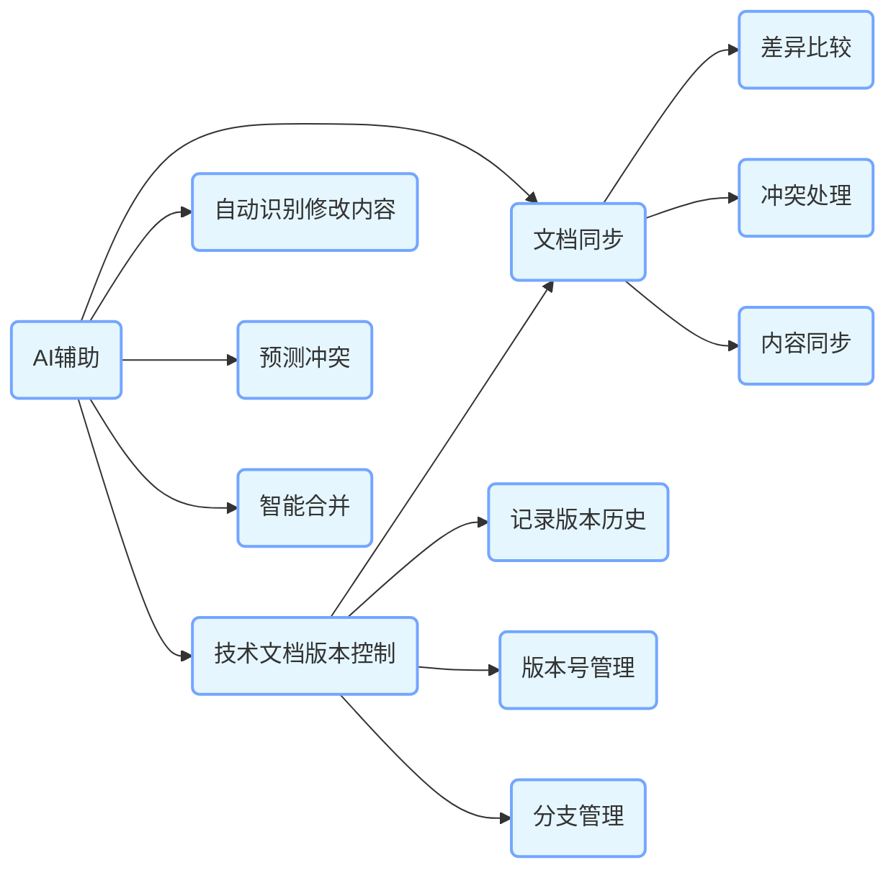

# AI辅助技术文档版本控制:保持文档同步

> 关键词：AI辅助、技术文档版本控制、文档同步、版本管理系统、自动化工具

> 摘要：本文聚焦于AI辅助技术文档版本控制以保持文档同步这一主题。随着技术的不断发展，技术文档的规模和复杂度日益增加，版本控制和文档同步变得至关重要。文章深入探讨了相关核心概念，详细阐述了核心算法原理及具体操作步骤，给出了数学模型和公式，通过项目实战案例进行代码实现和分析，介绍了实际应用场景，推荐了相关工具和资源，最后对未来发展趋势与挑战进行总结，并提供常见问题解答和扩展阅读参考资料，旨在为读者全面呈现AI辅助技术文档版本控制和文档同步的相关知识与实践方法。

## 1. 背景介绍 
### 1.1 目的和范围
在当今数字化时代，技术文档是企业和团队进行知识传承、技术交流以及项目管理的重要资产。随着软件开发、科研项目等工作的推进，技术文档会不断更新和迭代，这就需要有效的版本控制机制来管理文档的不同版本，确保团队成员能够获取到最新且一致的文档内容。同时，由于团队成员可能在不同的时间和地点对文档进行编辑，保持文档同步也成为了一个关键问题。本文的目的在于探讨如何利用AI技术辅助进行技术文档的版本控制和文档同步，提高文档管理的效率和准确性。

本文的范围涵盖了技术文档版本控制和文档同步的基本概念、核心算法原理、实际操作步骤、数学模型、项目实战案例、应用场景、相关工具和资源推荐等方面，旨在为读者提供一个全面的关于AI辅助技术文档版本控制和文档同步的知识体系。

### 1.2 预期读者
本文的预期读者包括软件开发人员、软件测试人员、项目管理人员、技术文档编写人员、科研工作者以及对技术文档管理和AI技术应用感兴趣的人员。无论是初学者还是有一定经验的专业人士，都可以从本文中获取到有价值的信息和实践指导。

### 1.3 文档结构概述
本文将按照以下结构进行组织：
- 核心概念与联系：介绍技术文档版本控制和文档同步的基本概念，以及AI在其中的作用和联系，并通过文本示意图和Mermaid流程图进行直观展示。
- 核心算法原理 & 具体操作步骤：详细阐述用于版本控制和文档同步的核心算法原理，并使用Python源代码进行示例说明，同时给出具体的操作步骤。
- 数学模型和公式 & 详细讲解 & 举例说明：建立数学模型，给出相关公式，并通过具体例子进行详细讲解，帮助读者理解版本控制和文档同步的数学原理。
- 项目实战：代码实际案例和详细解释说明：通过一个实际的项目案例，介绍开发环境的搭建、源代码的详细实现和代码解读，让读者能够将理论知识应用到实际项目中。
- 实际应用场景：介绍技术文档版本控制和文档同步在不同领域的实际应用场景，展示其重要性和实用性。
- 工具和资源推荐：推荐相关的学习资源、开发工具框架和论文著作，帮助读者进一步深入学习和研究。
- 总结：未来发展趋势与挑战：对AI辅助技术文档版本控制和文档同步的未来发展趋势进行展望，并分析可能面临的挑战。
- 附录：常见问题与解答：解答读者在学习和实践过程中可能遇到的常见问题。
- 扩展阅读 & 参考资料：提供相关的扩展阅读资料和参考文献，方便读者进一步探索。

### 1.4 术语表
#### 1.4.1 核心术语定义
- **技术文档版本控制**：对技术文档的不同版本进行管理和跟踪的过程，记录文档的修改历史、作者信息等，以便在需要时能够恢复到特定版本。
- **文档同步**：确保团队成员使用的文档内容保持一致的过程，当文档发生修改时，及时将修改同步到其他相关的文档副本中。
- **AI辅助**：利用人工智能技术，如自然语言处理、机器学习等，来辅助进行技术文档版本控制和文档同步，提高效率和准确性。
- **版本管理系统**：用于实现技术文档版本控制的软件系统，如Git、SVN等。

#### 1.4.2 相关概念解释
- **版本号**：用于标识技术文档不同版本的唯一编号，通常采用数字或字母组合的形式，如1.0、2.1等。
- **分支**：在版本管理系统中，分支是指从主版本中分离出来的独立开发路径，不同的分支可以同时进行不同的开发工作，最后再合并到主版本中。
- **冲突**：在文档同步过程中，当多个团队成员对同一部分内容进行了不同的修改时，就会产生冲突，需要进行手动或自动的解决。

#### 1.4.3 缩略词列表
- **VCS**：Version Control System，版本管理系统
- **NLP**：Natural Language Processing，自然语言处理
- **ML**：Machine Learning，机器学习

## 2. 核心概念与联系 

### 核心概念原理
技术文档版本控制的核心原理是通过记录文档的每次修改，形成一个版本历史记录。版本管理系统会为每个版本分配一个唯一的版本号，并且可以跟踪每个版本的作者、修改时间、修改内容等信息。当需要恢复到某个特定版本时，可以根据版本号从版本历史记录中获取相应的文档内容。

文档同步的核心原理是通过比较不同文档副本之间的差异，将修改的内容从一个副本同步到其他副本中。在同步过程中，需要处理可能出现的冲突，确保文档内容的一致性。

AI辅助在技术文档版本控制和文档同步中的作用主要体现在以下几个方面：
- **自动识别修改内容**：利用自然语言处理技术，AI可以自动识别文档中的修改内容，减少人工比对的工作量。
- **预测冲突**：通过机器学习算法，AI可以根据历史数据预测可能出现的冲突，提前采取措施进行预防。
- **智能合并**：在文档同步过程中，AI可以根据上下文信息进行智能合并，提高冲突解决的效率和准确性。

### 文本示意图
```plaintext
+----------------------+
| 技术文档版本控制     |
| - 记录版本历史       |
| - 版本号管理         |
| - 分支管理           |
+----------------------+
           |
           | 关联
           v
+----------------------+
| 文档同步             |
| - 差异比较           |
| - 冲突处理           |
| - 内容同步           |
+----------------------+
           |
           | 辅助
           v
+----------------------+
| AI辅助               |
| - 自动识别修改内容   |
| - 预测冲突           |
| - 智能合并           |
+----------------------+
```

### Mermaid流程图


## 3. 核心算法原理 & 具体操作步骤 

### 核心算法原理
#### 差异比较算法
差异比较算法是文档同步的核心算法之一，用于找出两个文档版本之间的差异。常用的差异比较算法有Levenshtein距离算法和Myers差分算法。

Levenshtein距离算法是一种计算两个字符串之间编辑距离的算法，编辑距离是指将一个字符串转换为另一个字符串所需的最少编辑操作次数（插入、删除、替换）。以下是使用Python实现的Levenshtein距离算法：
```python
def levenshtein_distance(s1, s2):
    if len(s1) < len(s2):
        return levenshtein_distance(s2, s1)

    if len(s2) == 0:
        return len(s1)

    previous_row = range(len(s2) + 1)
    for i, c1 in enumerate(s1):
        current_row = [i + 1]
        for j, c2 in enumerate(s2):
            insertions = previous_row[j + 1] + 1
            deletions = current_row[j] + 1
            substitutions = previous_row[j] + (c1!= c2)
            current_row.append(min(insertions, deletions, substitutions))
        previous_row = current_row

    return previous_row[-1]
```

Myers差分算法是一种高效的差异比较算法，它通过寻找两个序列之间的最长公共子序列（LCS）来找出差异。以下是使用Python实现的Myers差分算法：
```python
def myers_diff(a, b):
    m, n = len(a), len(b)
    maxd = m + n
    v = [0] * (2 * maxd + 1)
    trace = []

    for d in range(maxd + 1):
        for k in range(-d, d + 1, 2):
            if k == -d or (k!= d and v[k - 1 + maxd] < v[k + 1 + maxd]):
                x = v[k + 1 + maxd]
            else:
                x = v[k - 1 + maxd] + 1
            y = x - k
            while x < m and y < n and a[x] == b[y]:
                x, y = x + 1, y + 1
            v[k + maxd] = x
            if x >= m and y >= n:
                return trace
        trace.append(v[:])
    return trace
```

#### 冲突解决算法
冲突解决算法用于处理在文档同步过程中出现的冲突。常用的冲突解决算法有基于规则的冲突解决算法和基于机器学习的冲突解决算法。

基于规则的冲突解决算法是根据预先定义的规则来解决冲突，例如优先采用最新修改的内容、保留较长的文本等。以下是一个简单的基于规则的冲突解决算法示例：
```python
def rule_based_conflict_resolution(content1, content2):
    # 优先采用最新修改的内容
    return content2
```

基于机器学习的冲突解决算法是通过训练机器学习模型来预测冲突的解决方式。例如，可以使用分类算法将冲突分为不同的类型，然后根据类型选择相应的解决策略。

### 具体操作步骤
#### 版本控制操作步骤
1. **初始化版本管理系统**：在项目开始时，选择合适的版本管理系统（如Git），并在项目目录下初始化版本管理系统。
```bash
git init
```
2. **添加文档到版本管理系统**：将技术文档添加到版本管理系统中进行跟踪。
```bash
git add <document_file>
```
3. **提交文档修改**：当文档发生修改时，提交修改并记录版本信息。
```bash
git commit -m "Update document"
```
4. **创建分支**：如果需要进行独立的开发工作，可以创建新的分支。
```bash
git branch <branch_name>
```
5. **切换分支**：切换到指定的分支进行开发。
```bash
git checkout <branch_name>
```
6. **合并分支**：当分支的开发工作完成后，将分支合并到主版本中。
```bash
git merge <branch_name>
```

#### 文档同步操作步骤
1. **拉取最新版本**：从版本管理系统中拉取最新的文档版本。
```bash
git pull
```
2. **进行差异比较**：使用差异比较算法找出本地文档和远程文档之间的差异。
```python
# 示例代码，使用Levenshtein距离算法比较两个文档的差异
doc1 = open('local_document.txt', 'r').read()
doc2 = open('remote_document.txt', 'r').read()
distance = levenshtein_distance(doc1, doc2)
print(f"文档差异距离: {distance}")
```
3. **处理冲突**：如果出现冲突，使用冲突解决算法进行解决。
```python
# 示例代码，使用基于规则的冲突解决算法解决冲突
local_content = open('local_document.txt', 'r').read()
remote_content = open('remote_document.txt', 'r').read()
resolved_content = rule_based_conflict_resolution(local_content, remote_content)
with open('resolved_document.txt', 'w') as f:
    f.write(resolved_content)
```
4. **提交同步结果**：将同步后的文档提交到版本管理系统中。
```bash
git add <resolved_document_file>
git commit -m "Synchronize document"
git push
```

## 4. 数学模型和公式 & 详细讲解 & 举例说明 

### 数学模型
#### 版本控制数学模型
版本控制可以用一个有向无环图（DAG）来表示，其中每个节点表示一个文档版本，每条边表示版本之间的继承关系。设 $V$ 表示版本集合，$E$ 表示边集合，则版本控制的数学模型可以表示为 $G=(V, E)$。

#### 文档同步数学模型
文档同步可以用一个差分矩阵来表示，其中矩阵的元素表示两个文档版本之间的差异。设 $A$ 和 $B$ 是两个文档版本，$D$ 是差分矩阵，则 $D_{i,j}$ 表示 $A$ 的第 $i$ 个元素和 $B$ 的第 $j$ 个元素之间的差异。

### 公式
#### Levenshtein距离公式
设 $s_1$ 和 $s_2$ 是两个字符串，$m$ 和 $n$ 分别是它们的长度，$d_{i,j}$ 表示 $s_1$ 的前 $i$ 个字符和 $s_2$ 的前 $j$ 个字符之间的Levenshtein距离，则Levenshtein距离公式可以表示为：
$$
d_{i,j} = \begin{cases}
i & \text{if } j = 0 \\
j & \text{if } i = 0 \\
d_{i-1,j-1} & \text{if } s_1[i-1] = s_2[j-1] \\
\min(d_{i-1,j} + 1, d_{i,j-1} + 1, d_{i-1,j-1} + 1) & \text{otherwise}
\end{cases}
$$

#### 最长公共子序列（LCS）长度公式
设 $s_1$ 和 $s_2$ 是两个字符串，$m$ 和 $n$ 分别是它们的长度，$c_{i,j}$ 表示 $s_1$ 的前 $i$ 个字符和 $s_2$ 的前 $j$ 个字符之间的最长公共子序列长度，则最长公共子序列长度公式可以表示为：
$$
c_{i,j} = \begin{cases}
0 & \text{if } i = 0 \text{ or } j = 0 \\
c_{i-1,j-1} + 1 & \text{if } s_1[i-1] = s_2[j-1] \\
\max(c_{i-1,j}, c_{i,j-1}) & \text{otherwise}
\end{cases}
$$

### 详细讲解
#### Levenshtein距离公式讲解
Levenshtein距离公式通过动态规划的方法计算两个字符串之间的编辑距离。当 $j = 0$ 时，$s_2$ 为空字符串，需要将 $s_1$ 的所有字符删除，因此 $d_{i,j} = i$；当 $i = 0$ 时，$s_1$ 为空字符串，需要将 $s_2$ 的所有字符插入，因此 $d_{i,j} = j$；当 $s_1[i-1] = s_2[j-1]$ 时，不需要进行编辑操作，因此 $d_{i,j} = d_{i-1,j-1}$；否则，需要进行插入、删除或替换操作，取其中的最小值。

#### 最长公共子序列（LCS）长度公式讲解
最长公共子序列长度公式同样通过动态规划的方法计算两个字符串之间的最长公共子序列长度。当 $i = 0$ 或 $j = 0$ 时，其中一个字符串为空字符串，最长公共子序列长度为 0；当 $s_1[i-1] = s_2[j-1]$ 时，最长公共子序列长度为 $c_{i-1,j-1} + 1$；否则，最长公共子序列长度为 $c_{i-1,j}$ 和 $c_{i,j-1}$ 中的最大值。

### 举例说明
#### Levenshtein距离举例
设 $s_1 = "kitten"$，$s_2 = "sitting"$，计算它们之间的Levenshtein距离。

根据Levenshtein距离公式，初始化 $d_{0,j} = j$ 和 $d_{i,0} = i$，然后逐步计算 $d_{i,j}$ 的值：
|  |  | s | i | t | t | i | n | g |
| --- | --- | --- | --- | --- | --- | --- | --- | --- |
|  | 0 | 1 | 2 | 3 | 4 | 5 | 6 | 7 |
| k | 1 | 1 | 2 | 3 | 4 | 5 | 6 | 7 |
| i | 2 | 2 | 1 | 2 | 3 | 4 | 5 | 6 |
| t | 3 | 3 | 2 | 1 | 2 | 3 | 4 | 5 |
| t | 4 | 4 | 3 | 2 | 1 | 2 | 3 | 4 |
| e | 5 | 5 | 4 | 3 | 2 | 2 | 3 | 4 |
| n | 6 | 6 | 5 | 4 | 3 | 3 | 2 | 3 |

最终，$d_{6,7} = 3$，即 $s_1$ 和 $s_2$ 之间的Levenshtein距离为 3。

#### 最长公共子序列（LCS）长度举例
设 $s_1 = "AGGTAB"$，$s_2 = "GXTXAYB"$，计算它们之间的最长公共子序列长度。

根据最长公共子序列长度公式，初始化 $c_{0,j} = 0$ 和 $c_{i,0} = 0$，然后逐步计算 $c_{i,j}$ 的值：
|  |  | G | X | T | X | A | Y | B |
| --- | --- | --- | --- | --- | --- | --- | --- | --- |
|  | 0 | 0 | 0 | 0 | 0 | 0 | 0 | 0 |
| A | 0 | 0 | 0 | 0 | 0 | 1 | 1 | 1 |
| G | 0 | 1 | 1 | 1 | 1 | 1 | 1 | 1 |
| G | 0 | 1 | 1 | 1 | 1 | 1 | 1 | 1 |
| T | 0 | 1 | 1 | 2 | 2 | 2 | 2 | 2 |
| A | 0 | 1 | 1 | 2 | 2 | 3 | 3 | 3 |
| B | 0 | 1 | 1 | 2 | 2 | 3 | 3 | 4 |

最终，$c_{6,7} = 4$，即 $s_1$ 和 $s_2$ 之间的最长公共子序列长度为 4。

## 5. 项目实战：代码实际案例和详细解释说明 

### 5.1  开发环境搭建
#### 安装Python
首先，需要安装Python开发环境。可以从Python官方网站（https://www.python.org/downloads/）下载适合自己操作系统的Python版本，并按照安装向导进行安装。

#### 安装Git
Git是一个常用的版本管理系统，需要安装Git来进行版本控制。可以从Git官方网站（https://git-scm.com/downloads）下载适合自己操作系统的Git版本，并按照安装向导进行安装。

#### 安装必要的Python库
在项目中，需要使用一些Python库来实现文档差异比较和冲突解决等功能。可以使用以下命令安装必要的Python库：
```bash
pip install Levenshtein
```

### 5.2  源代码详细实现和代码解读
#### 版本控制和文档同步工具实现
以下是一个简单的版本控制和文档同步工具的Python实现：
```python
import os
import subprocess
import Levenshtein

def init_git_repository(repo_path):
    """
    初始化Git仓库
    """
    if not os.path.exists(repo_path):
        os.makedirs(repo_path)
    subprocess.run(['git', 'init'], cwd=repo_path)

def add_document_to_git(repo_path, document_path):
    """
    将文档添加到Git仓库
    """
    subprocess.run(['git', 'add', document_path], cwd=repo_path)

def commit_document(repo_path, message):
    """
    提交文档修改
    """
    subprocess.run(['git', 'commit', '-m', message], cwd=repo_path)

def pull_latest_version(repo_path):
    """
    拉取最新版本
    """
    subprocess.run(['git', 'pull'], cwd=repo_path)

def push_changes(repo_path):
    """
    推送修改到远程仓库
    """
    subprocess.run(['git', 'push'], cwd=repo_path)

def compare_documents(doc1_path, doc2_path):
    """
    比较两个文档的差异
    """
    with open(doc1_path, 'r') as f1, open(doc2_path, 'r') as f2:
        doc1 = f1.read()
        doc2 = f2.read()
    distance = Levenshtein.distance(doc1, doc2)
    return distance

def rule_based_conflict_resolution(content1, content2):
    """
    基于规则的冲突解决算法
    """
    return content2

def synchronize_documents(repo_path, local_doc_path, remote_doc_path):
    """
    同步文档
    """
    # 拉取最新版本
    pull_latest_version(repo_path)
    # 比较文档差异
    distance = compare_documents(local_doc_path, remote_doc_path)
    print(f"文档差异距离: {distance}")
    if distance > 0:
        # 处理冲突
        with open(local_doc_path, 'r') as f1, open(remote_doc_path, 'r') as f2:
            local_content = f1.read()
            remote_content = f2.read()
        resolved_content = rule_based_conflict_resolution(local_content, remote_content)
        with open(local_doc_path, 'w') as f:
            f.write(resolved_content)
        # 提交同步结果
        add_document_to_git(repo_path, local_doc_path)
        commit_document(repo_path, "Synchronize document")
        push_changes(repo_path)
    else:
        print("文档无差异，无需同步")

if __name__ == "__main__":
    repo_path = "./my_repository"
    local_doc_path = os.path.join(repo_path, "document.txt")
    remote_doc_path = os.path.join(repo_path, "document_remote.txt")
    # 初始化Git仓库
    init_git_repository(repo_path)
    # 添加文档到Git仓库
    add_document_to_git(repo_path, local_doc_path)
    # 提交文档修改
    commit_document(repo_path, "Initial commit")
    # 同步文档
    synchronize_documents(repo_path, local_doc_path, remote_doc_path)
```

#### 代码解读
- `init_git_repository` 函数：用于初始化Git仓库。如果指定的仓库路径不存在，则创建该路径，并在该路径下执行 `git init` 命令。
- `add_document_to_git` 函数：用于将文档添加到Git仓库。执行 `git add` 命令将指定的文档添加到版本控制中。
- `commit_document` 函数：用于提交文档修改。执行 `git commit` 命令将修改的文档提交到本地仓库，并记录提交信息。
- `pull_latest_version` 函数：用于拉取最新版本。执行 `git pull` 命令从远程仓库拉取最新的文档版本。
- `push_changes` 函数：用于推送修改到远程仓库。执行 `git push` 命令将本地仓库的修改推送到远程仓库。
- `compare_documents` 函数：用于比较两个文档的差异。使用 `Levenshtein.distance` 函数计算两个文档之间的编辑距离。
- `rule_based_conflict_resolution` 函数：用于基于规则的冲突解决。在本示例中，优先采用最新修改的内容。
- `synchronize_documents` 函数：用于同步文档。首先拉取最新版本，然后比较本地文档和远程文档的差异。如果存在差异，则处理冲突并提交同步结果；否则，提示文档无差异，无需同步。

### 5.3  代码解读与分析
#### 优点
- **简单易用**：代码结构清晰，功能模块划分明确，易于理解和使用。
- **集成Git**：通过调用Git命令，实现了版本控制和文档同步的基本功能。
- **使用Levenshtein距离算法**：利用Levenshtein距离算法进行文档差异比较，计算效率较高。

#### 缺点
- **冲突解决策略简单**：基于规则的冲突解决算法只考虑了一种简单的情况，对于复杂的冲突可能无法有效解决。
- **缺乏错误处理**：代码中没有对可能出现的错误进行充分的处理，如Git命令执行失败、文件读写错误等。

#### 改进建议
- **采用更复杂的冲突解决算法**：可以引入基于机器学习的冲突解决算法，提高冲突解决的准确性。
- **增加错误处理机制**：在代码中添加异常处理，对可能出现的错误进行捕获和处理，提高代码的健壮性。

## 6. 实际应用场景 
### 软件开发项目
在软件开发项目中，技术文档包括需求文档、设计文档、测试文档等。随着项目的推进，这些文档会不断更新和修改。通过AI辅助技术文档版本控制和文档同步，可以确保开发团队成员使用的文档内容一致，避免因文档不一致而导致的开发错误。例如，开发人员在修改代码时，同时更新对应的设计文档，版本控制和文档同步机制可以及时将修改同步到其他团队成员的文档副本中，保证大家看到的是最新的设计信息。

### 科研项目
在科研项目中，研究人员需要撰写研究报告、论文等技术文档。不同的研究人员可能在不同的时间和地点对文档进行修改，使用AI辅助技术文档版本控制和文档同步可以方便研究人员协作撰写文档，跟踪文档的修改历史，确保文档的完整性和准确性。例如，多个研究人员共同撰写一篇论文，通过版本控制和文档同步机制，可以实时了解其他人员的修改内容，避免重复工作。

### 企业知识管理
企业内部有大量的技术文档，如产品说明书、操作手册、培训资料等。这些文档需要不断更新和维护，以适应企业业务的发展和变化。AI辅助技术文档版本控制和文档同步可以帮助企业实现知识的有效管理，确保员工能够获取到最新的技术文档。例如，企业的产品升级后，相关的产品说明书需要及时更新，版本控制和文档同步机制可以确保所有员工都能及时获取到最新的产品说明书。

## 7. 工具和资源推荐
### 7.1 学习资源推荐
#### 7.1.1 书籍推荐
- 《版本控制之道：使用Git》：本书详细介绍了Git的基本概念、操作方法和高级技巧，是学习Git版本控制的经典书籍。
- 《Python自然语言处理实战》：本书介绍了Python在自然语言处理领域的应用，包括文本处理、信息提取、机器翻译等，对于学习AI辅助技术文档处理有很大帮助。
- 《机器学习实战》：本书通过实际案例介绍了机器学习的基本算法和应用，对于理解基于机器学习的冲突解决算法有很好的参考价值。

#### 7.1.2 在线课程
- Coursera上的“版本控制基础”课程：该课程由知名高校的教授授课，系统地介绍了版本控制的基本概念和操作方法。
- edX上的“自然语言处理”课程：该课程涵盖了自然语言处理的各个方面，包括词法分析、句法分析、语义理解等。
- Udemy上的“机器学习入门”课程：该课程适合初学者，通过简单易懂的方式介绍了机器学习的基本算法和应用。

#### 7.1.3 技术博客和网站
- GitHub官方博客：提供了关于Git和版本控制的最新技术和应用案例。
- Medium上的AI和技术文档管理相关博客：有很多专业人士分享的关于AI辅助技术文档版本控制和文档同步的经验和见解。
- Stack Overflow：一个技术问答社区，可以在上面查找关于版本控制、Python编程、机器学习等方面的问题和解决方案。

### 7.2 开发工具框架推荐
#### 7.2.1 IDE和编辑器
- PyCharm：一款专业的Python集成开发环境，提供了代码编辑、调试、版本控制等功能，适合Python开发。
- Visual Studio Code：一款轻量级的代码编辑器，支持多种编程语言，具有丰富的插件扩展功能，可用于版本控制和文档编辑。
- Sublime Text：一款简洁高效的文本编辑器，支持多种编程语言和文件格式，可用于快速编辑技术文档。

#### 7.2.2 调试和性能分析工具
- Py-Spy：一个用于Python程序性能分析的工具，可以帮助开发者找出程序中的性能瓶颈。
- PDB：Python自带的调试器，可用于调试Python代码，定位程序中的错误。
- GitKraken：一款可视化的Git客户端，提供了直观的界面来管理Git仓库和版本控制操作，方便调试和查看版本历史。

#### 7.2.3 相关框架和库
- GitPython：一个用于Python的Git库，允许开发者通过Python代码来操作Git仓库，实现版本控制功能。
- NLTK：Python的自然语言处理工具包，提供了丰富的文本处理和分析功能，可用于自动识别文档中的修改内容。
- Scikit-learn：一个常用的机器学习库，提供了多种机器学习算法和工具，可用于基于机器学习的冲突解决算法的实现。

### 7.3 相关论文著作推荐
#### 7.3.1 经典论文
- 《Git: A Distributed Version Control System》：介绍了Git版本控制的原理和实现方法，是了解Git的经典论文。
- 《Levenshtein Distance and Its Applications in Text Processing》：详细阐述了Levenshtein距离算法的原理和在文本处理中的应用。
- 《Myers' Diff Algorithm: An O(ND) Difference Algorithm and Its Variations》：介绍了Myers差分算法的原理和变体，是差异比较算法的重要参考文献。

#### 7.3.2 最新研究成果
- 近年来，关于AI辅助技术文档管理的研究不断涌现。可以通过学术数据库（如IEEE Xplore、ACM Digital Library等）搜索相关的最新研究论文，了解该领域的最新技术和发展趋势。

#### 7.3.3 应用案例分析
- 一些企业和研究机构会发布关于技术文档版本控制和文档同步的应用案例分析报告。可以通过企业官网、行业论坛等渠道获取这些案例，学习实际应用中的经验和最佳实践。

## 8. 总结：未来发展趋势与挑战
### 未来发展趋势
#### 更智能的AI辅助
随着人工智能技术的不断发展，未来的AI辅助技术文档版本控制和文档同步将更加智能。例如，AI可以自动理解文档的语义信息，更准确地识别修改内容和预测冲突，提供更智能的冲突解决建议。

#### 与其他工具的深度集成
未来的版本控制和文档同步工具将与其他开发工具（如集成开发环境、项目管理工具等）进行更深度的集成。例如，在集成开发环境中直接实现版本控制和文档同步功能，方便开发人员进行操作。

#### 云原生和分布式应用
随着云计算和分布式系统的发展，技术文档的管理将更加倾向于云原生和分布式应用。多个团队成员可以在不同的地理位置同时对文档进行编辑和管理，通过云平台实现文档的实时同步和版本控制。

### 挑战
#### 数据安全和隐私问题
在使用AI辅助技术文档版本控制和文档同步时，需要处理大量的文档数据。这些数据可能包含敏感信息，如商业机密、用户隐私等。因此，如何保证数据的安全和隐私是一个重要的挑战。

#### 复杂冲突的处理
在实际应用中，可能会遇到复杂的冲突情况，如多个团队成员对同一部分内容进行了不同的修改，且这些修改之间存在相互依赖关系。如何有效地处理这些复杂冲突是一个亟待解决的问题。

#### 技术的普及和应用成本
虽然AI技术在不断发展，但对于一些中小企业和个人开发者来说，掌握和应用这些技术仍然存在一定的难度和成本。如何降低技术的应用门槛，提高技术的普及程度，是未来需要面对的挑战之一。

## 9. 附录：常见问题与解答
### 问题1：版本控制和文档同步有什么区别？
版本控制主要是对技术文档的不同版本进行管理和跟踪，记录文档的修改历史、作者信息等，以便在需要时能够恢复到特定版本。而文档同步是确保团队成员使用的文档内容保持一致的过程，当文档发生修改时，及时将修改同步到其他相关的文档副本中。

### 问题2：为什么需要AI辅助技术文档版本控制和文档同步？
随着技术文档的规模和复杂度日益增加，人工进行版本控制和文档同步的效率低下且容易出错。AI辅助可以利用自然语言处理、机器学习等技术，自动识别修改内容、预测冲突、智能合并，提高版本控制和文档同步的效率和准确性。

### 问题3：如何选择合适的版本管理系统？
选择合适的版本管理系统需要考虑以下因素：
- **项目规模和复杂度**：对于小型项目，可以选择简单易用的版本管理系统；对于大型项目，需要选择功能强大、支持分布式开发的版本管理系统。
- **团队协作方式**：如果团队成员分布在不同的地理位置，需要选择支持分布式开发的版本管理系统；如果团队成员集中在一个地点，可以选择集中式的版本管理系统。
- **技术栈和工具链**：需要选择与项目所使用的技术栈和工具链相兼容的版本管理系统。

### 问题4：在文档同步过程中遇到冲突怎么办？
在文档同步过程中遇到冲突时，可以采用以下方法解决：
- **手动解决**：通过人工比对冲突内容，选择合适的修改内容进行保留。
- **基于规则的解决**：根据预先定义的规则，如优先采用最新修改的内容、保留较长的文本等，进行冲突解决。
- **基于机器学习的解决**：通过训练机器学习模型来预测冲突的解决方式，提高冲突解决的效率和准确性。

### 问题5：如何保证技术文档的安全性？
为了保证技术文档的安全性，可以采取以下措施：
- **访问控制**：设置不同的用户权限，限制对技术文档的访问。
- **数据加密**：对技术文档进行加密处理，确保数据在传输和存储过程中的安全性。
- **备份和恢复**：定期对技术文档进行备份，以便在出现数据丢失或损坏时能够及时恢复。

## 10. 扩展阅读 & 参考资料
### 扩展阅读
- 《人工智能基础教程》：深入学习人工智能的基本概念、算法和应用，有助于更好地理解AI辅助技术文档版本控制和文档同步的原理。
- 《软件项目管理最佳实践》：了解软件项目管理的流程和方法，对于在实际项目中应用技术文档版本控制和文档同步有很大帮助。
- 《云计算与分布式系统》：学习云计算和分布式系统的相关知识，了解云原生和分布式应用在技术文档管理中的应用。

### 参考资料
- Git官方文档：https://git-scm.com/doc
- Python官方文档：https://docs.python.org/
- NLTK官方文档：https://www.nltk.org/
- Scikit-learn官方文档：https://scikit-learn.org/
- IEEE Xplore：https://ieeexplore.ieee.org/
- ACM Digital Library：https://dl.acm.org/