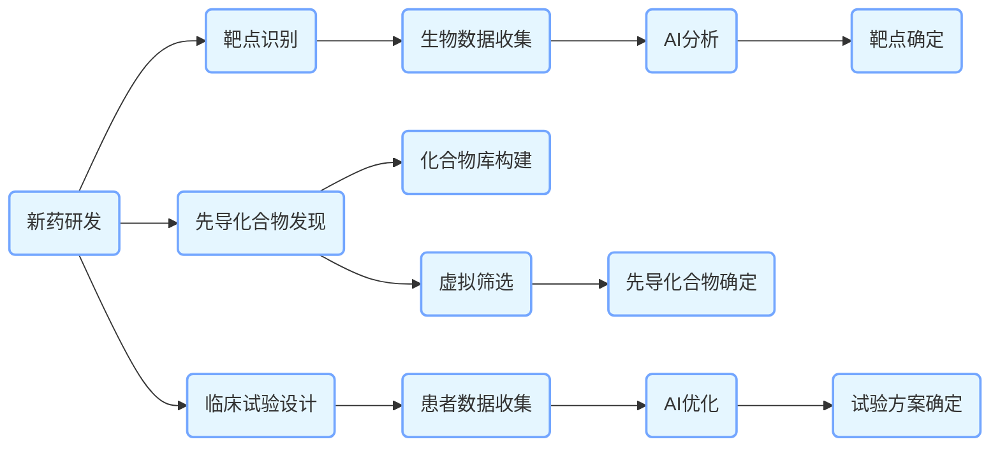

# AI辅助新药研发周期优化：从靶点识别到临床试验设计

> 关键词：AI，新药研发，靶点识别，临床试验设计，研发周期优化

> 摘要：本文围绕AI辅助新药研发周期优化展开，从靶点识别到临床试验设计进行了全面深入的探讨。首先介绍了新药研发的背景以及AI在其中的重要性，接着阐述了核心概念与联系，详细讲解了相关核心算法原理和具体操作步骤，分析了其中涉及的数学模型和公式。通过项目实战案例，展示了如何运用AI技术进行新药研发。还探讨了AI在新药研发中的实际应用场景，推荐了相关的工具和资源。最后对未来发展趋势与挑战进行了总结，并提供了常见问题解答和扩展阅读参考资料，旨在为相关领域的研究者和从业者提供有价值的参考。

## 1. 背景介绍 

### 1.1 目的和范围
新药研发是一个复杂、漫长且成本高昂的过程，传统的研发方式面临着诸多挑战，如研发周期长、成功率低等。本文章的目的在于探讨如何利用人工智能（AI）技术优化新药研发周期，具体范围涵盖从靶点识别这一研发起始阶段，到临床试验设计这一关键环节，分析AI在各个阶段的应用原理、方法和效果。

### 1.2 预期读者
本文预期读者包括从事新药研发的科研人员、医药企业的研发管理人员、计算机科学领域中对AI在生物医学应用感兴趣的研究人员，以及相关专业的学生等。通过阅读本文，读者可以了解AI在新药研发中的具体应用和优势，为实际工作和学习提供参考。

### 1.3 文档结构概述
本文首先介绍背景信息，让读者了解新药研发的现状和引入AI的必要性。接着阐述核心概念与联系，明确相关术语和原理。然后详细讲解核心算法原理和具体操作步骤，并给出数学模型和公式。通过项目实战案例，展示AI在新药研发中的实际应用。之后探讨实际应用场景，推荐相关工具和资源。最后总结未来发展趋势与挑战，提供常见问题解答和扩展阅读参考资料。

### 1.4 术语表
#### 1.4.1 核心术语定义
- **靶点识别**：在新药研发中，靶点是指药物作用的生物分子，如蛋白质、核酸等。靶点识别就是寻找与疾病相关的生物分子，作为药物作用的目标。
- **临床试验设计**：是指为了验证新药的安全性和有效性，在人体上进行试验的一系列计划和安排，包括试验的对象、方法、步骤、观察指标等。
- **人工智能（AI）**：是一门研究如何使计算机能够模拟人类智能的学科，包括机器学习、深度学习、自然语言处理等技术。
- **机器学习**：是AI的一个重要分支，它使计算机能够通过数据学习模式和规律，从而进行预测和决策。
- **深度学习**：是一种基于人工神经网络的机器学习方法，能够自动从大量数据中提取特征和模式。

#### 1.4.2 相关概念解释
- **药物发现**：是新药研发的起始阶段，包括靶点识别、先导化合物发现等过程，旨在找到具有潜在治疗作用的化合物。
- **生物信息学**：是一门交叉学科，结合了生物学、计算机科学和数学，用于处理和分析生物数据，如基因序列、蛋白质结构等。
- **虚拟筛选**：是利用计算机技术对大量化合物进行筛选，预测它们与靶点的结合能力，从而发现潜在的先导化合物。

#### 1.4.3 缩略词列表
- **AI**：Artificial Intelligence（人工智能）
- **ML**：Machine Learning（机器学习）
- **DL**：Deep Learning（深度学习）
- **FDA**：Food and Drug Administration（美国食品药品监督管理局）

## 2. 核心概念与联系 

### 核心概念原理
#### 靶点识别原理
在生物体内，疾病的发生往往与特定生物分子的异常功能或表达有关。靶点识别就是通过分析生物数据，如基因表达数据、蛋白质组学数据等，寻找与疾病相关的生物分子。例如，在癌症研究中，某些基因突变会导致癌细胞的异常增殖，这些突变的基因或其编码的蛋白质就可能成为药物作用的靶点。

#### 临床试验设计原理
临床试验设计的目的是为了科学、客观地评价新药的安全性和有效性。它需要考虑多个因素，如试验的样本量、分组方式、观察指标等。合理的临床试验设计可以提高试验的效率和可靠性，减少误差和偏倚。

#### AI在新药研发中的原理
AI技术可以处理和分析大量复杂的生物数据，从中发现潜在的规律和模式。在靶点识别中，AI可以通过机器学习算法对基因表达数据进行分析，预测与疾病相关的基因和蛋白质。在临床试验设计中，AI可以根据患者的特征和历史数据，优化试验的样本量和分组方式，提高试验的效率。

### 架构的文本示意图
```plaintext
新药研发流程
|-- 靶点识别
|   |-- 生物数据收集（基因表达数据、蛋白质组学数据等）
|   |-- AI分析（机器学习、深度学习）
|   |-- 靶点确定
|-- 先导化合物发现
|   |-- 化合物库构建
|   |-- 虚拟筛选（AI预测结合能力）
|   |-- 先导化合物确定
|-- 临床试验设计
|   |-- 患者数据收集（特征、历史数据等）
|   |-- AI优化（样本量、分组方式等）
|   |-- 试验方案确定
```

### Mermaid流程图


## 3. 核心算法原理 & 具体操作步骤 

### 靶点识别中的算法原理与步骤
#### 算法原理
在靶点识别中，常用的机器学习算法是支持向量机（SVM）和随机森林（RF）。以SVM为例，其原理是在特征空间中找到一个最优的超平面，将不同类别的样本分开。在靶点识别中，样本可以分为与疾病相关和不相关两类，SVM通过学习样本的特征，找到一个合适的超平面来进行分类。

#### 具体操作步骤
```python
import numpy as np
from sklearn import svm
from sklearn.model_selection import train_test_split
from sklearn.metrics import accuracy_score

# 步骤1：数据准备
# 假设我们有基因表达数据作为特征，以及对应的疾病标签
# 生成一些示例数据
X = np.random.rand(100, 10)  # 100个样本，每个样本有10个特征
y = np.random.randint(0, 2, 100)  # 标签，0或1

# 步骤2：数据划分
X_train, X_test, y_train, y_test = train_test_split(X, y, test_size=0.2, random_state=42)

# 步骤3：模型训练
clf = svm.SVC(kernel='linear')
clf.fit(X_train, y_train)

# 步骤4：模型预测
y_pred = clf.predict(X_test)

# 步骤5：模型评估
accuracy = accuracy_score(y_test, y_pred)
print(f"模型准确率: {accuracy}")
```

### 临床试验设计中的算法原理与步骤
#### 算法原理
在临床试验设计中，强化学习算法可以用于优化试验的样本量和分组方式。强化学习是一种通过智能体与环境交互，不断学习最优策略的算法。在临床试验设计中，智能体可以根据患者的特征和历史数据，选择最优的样本量和分组方式，以最大化试验的效率和可靠性。

#### 具体操作步骤
```python
import numpy as np
import gym
from stable_baselines3 import PPO

# 步骤1：定义环境
# 这里我们简单模拟一个临床试验设计环境
class ClinicalTrialEnv(gym.Env):
    def __init__(self):
        super(ClinicalTrialEnv, self).__init__()
        self.action_space = gym.spaces.Discrete(2)  # 假设只有两种分组方式
        self.observation_space = gym.spaces.Box(low=0, high=1, shape=(10,))  # 假设患者有10个特征

    def step(self, action):
        # 模拟环境反馈
        reward = np.random.rand()
        done = False
        observation = np.random.rand(10)
        return observation, reward, done, {}

    def reset(self):
        return np.random.rand(10)

# 步骤2：创建环境和模型
env = ClinicalTrialEnv()
model = PPO('MlpPolicy', env, verbose=1)

# 步骤3：模型训练
model.learn(total_timesteps=10000)

# 步骤4：模型评估
obs = env.reset()
for _ in range(10):
    action, _states = model.predict(obs)
    obs, rewards, done, info = env.step(action)
    print(f"Action: {action}, Reward: {rewards}")
```

## 4. 数学模型和公式 & 详细讲解 & 举例说明 

### 靶点识别中的数学模型和公式
#### 支持向量机（SVM）
SVM的目标是找到一个最优的超平面 $w^T x + b = 0$，使得不同类别的样本到超平面的间隔最大。间隔可以表示为 $\frac{2}{\|w\|}$，其中 $w$ 是超平面的法向量，$b$ 是偏置。

SVM的优化问题可以表示为：
$$
\begin{aligned}
\min_{w, b, \xi} &\quad \frac{1}{2} \|w\|^2 + C \sum_{i=1}^{n} \xi_i \\
\text{s.t.} &\quad y_i (w^T x_i + b) \geq 1 - \xi_i, \quad i = 1, \ldots, n \\
&\quad \xi_i \geq 0, \quad i = 1, \ldots, n
\end{aligned}
$$
其中 $x_i$ 是第 $i$ 个样本，$y_i$ 是其对应的标签（$y_i \in \{-1, 1\}$），$\xi_i$ 是松弛变量，用于处理样本的误分类情况，$C$ 是惩罚参数。

举例说明：假设我们有两个二维样本点 $(1, 1)$ 和 $(2, 2)$ 属于正类（$y = 1$），$( -1, -1)$ 和 $( -2, -2)$ 属于负类（$y = -1$）。我们可以使用SVM来找到一个超平面将这两类样本分开。

```python
import numpy as np
from sklearn import svm
import matplotlib.pyplot as plt

# 样本数据
X = np.array([[1, 1], [2, 2], [-1, -1], [-2, -2]])
y = np.array([1, 1, -1, -1])

# 训练SVM模型
clf = svm.SVC(kernel='linear')
clf.fit(X, y)

# 绘制超平面
plt.scatter(X[:, 0], X[:, 1], c=y)
ax = plt.gca()
xlim = ax.get_xlim()
ylim = ax.get_ylim()

xx = np.linspace(xlim[0], xlim[1], 30)
yy = np.linspace(ylim[0], ylim[1], 30)
YY, XX = np.meshgrid(yy, xx)
xy = np.vstack([XX.ravel(), YY.ravel()]).T
Z = clf.decision_function(xy).reshape(XX.shape)

ax.contour(XX, YY, Z, colors='k', levels=[-1, 0, 1], alpha=0.5, linestyles=['--', '-', '--'])
plt.show()
```

### 临床试验设计中的数学模型和公式
#### 强化学习中的Q学习算法
Q学习算法是一种无模型的强化学习算法，用于学习最优的动作价值函数 $Q(s, a)$，其中 $s$ 是状态，$a$ 是动作。

Q学习的更新公式为：
$$
Q(s_t, a_t) \leftarrow Q(s_t, a_t) + \alpha [r_{t+1} + \gamma \max_{a} Q(s_{t+1}, a) - Q(s_t, a_t)]
$$
其中 $\alpha$ 是学习率，$\gamma$ 是折扣因子，$r_{t+1}$ 是在状态 $s_t$ 采取动作 $a_t$ 后获得的奖励。

举例说明：假设我们有一个简单的临床试验设计环境，状态 $s$ 表示患者的特征，动作 $a$ 表示分组方式，奖励 $r$ 表示试验的效率。我们可以使用Q学习算法来学习最优的分组策略。

```python
import numpy as np

# 初始化Q表
Q = np.zeros((10, 2))  # 假设状态有10种，动作有2种
alpha = 0.1  # 学习率
gamma = 0.9  # 折扣因子
num_episodes = 100

for episode in range(num_episodes):
    state = np.random.randint(0, 10)  # 随机初始化状态
    done = False
    while not done:
        action = np.argmax(Q[state, :])  # 选择最优动作
        next_state = np.random.randint(0, 10)  # 随机转移到下一个状态
        reward = np.random.rand()  # 随机获得奖励
        Q[state, action] = Q[state, action] + alpha * (reward + gamma * np.max(Q[next_state, :]) - Q[state, action])
        state = next_state
        if np.random.rand() < 0.1:  # 以0.1的概率结束当前回合
            done = True

print(Q)
```

## 5. 项目实战：代码实际案例和详细解释说明 

### 5.1  开发环境搭建
#### 安装Python
首先需要安装Python，建议使用Python 3.7及以上版本。可以从Python官方网站（https://www.python.org/downloads/）下载安装包进行安装。

#### 安装必要的库
使用pip命令安装以下必要的库：
```sh
pip install numpy scikit-learn stable-baselines3 gym matplotlib
```

### 5.2  源代码详细实现和代码解读
#### 靶点识别项目实战
```python
import numpy as np
from sklearn import svm
from sklearn.model_selection import train_test_split
from sklearn.metrics import accuracy_score

# 步骤1：数据准备
# 这里我们使用模拟的基因表达数据
np.random.seed(42)
X = np.random.rand(200, 20)  # 200个样本，每个样本有20个特征
y = np.random.randint(0, 2, 200)  # 标签，0或1

# 步骤2：数据划分
X_train, X_test, y_train, y_test = train_test_split(X, y, test_size=0.2, random_state=42)

# 步骤3：模型训练
clf = svm.SVC(kernel='rbf')  # 使用径向基函数（RBF）核
clf.fit(X_train, y_train)

# 步骤4：模型预测
y_pred = clf.predict(X_test)

# 步骤5：模型评估
accuracy = accuracy_score(y_test, y_pred)
print(f"模型准确率: {accuracy}")
```
代码解读：
- 数据准备：使用`numpy`生成模拟的基因表达数据和对应的标签。
- 数据划分：使用`train_test_split`函数将数据划分为训练集和测试集。
- 模型训练：使用`SVC`类创建一个SVM分类器，并使用训练集进行训练。
- 模型预测：使用训练好的模型对测试集进行预测。
- 模型评估：使用`accuracy_score`函数计算模型的准确率。

#### 临床试验设计项目实战
```python
import numpy as np
import gym
from stable_baselines3 import PPO

# 步骤1：定义环境
class ClinicalTrialEnv(gym.Env):
    def __init__(self):
        super(ClinicalTrialEnv, self).__init__()
        self.action_space = gym.spaces.Discrete(3)  # 假设只有三种分组方式
        self.observation_space = gym.spaces.Box(low=0, high=1, shape=(15,))  # 假设患者有15个特征

    def step(self, action):
        # 模拟环境反馈
        reward = np.random.rand()
        done = False
        observation = np.random.rand(15)
        return observation, reward, done, {}

    def reset(self):
        return np.random.rand(15)

# 步骤2：创建环境和模型
env = ClinicalTrialEnv()
model = PPO('MlpPolicy', env, verbose=1)

# 步骤3：模型训练
model.learn(total_timesteps=20000)

# 步骤4：模型评估
obs = env.reset()
for _ in range(20):
    action, _states = model.predict(obs)
    obs, rewards, done, info = env.step(action)
    print(f"Action: {action}, Reward: {rewards}")
```
代码解读：
- 定义环境：继承`gym.Env`类，定义动作空间和观察空间，实现`step`和`reset`方法。
- 创建环境和模型：使用定义好的环境和`PPO`算法创建模型。
- 模型训练：使用`learn`方法对模型进行训练。
- 模型评估：使用训练好的模型进行评估，输出每个步骤的动作和奖励。

### 5.3  代码解读与分析
#### 靶点识别代码分析
在靶点识别代码中，使用SVM进行分类。选择不同的核函数（如线性核、RBF核）会影响模型的性能。RBF核可以处理非线性可分的数据，但可能会导致过拟合问题。在实际应用中，需要通过交叉验证等方法选择合适的核函数和参数。

#### 临床试验设计代码分析
在临床试验设计代码中，使用PPO算法进行强化学习。强化学习的性能受到环境定义、奖励函数设计等因素的影响。在实际应用中，需要根据具体的临床试验需求，合理定义环境和奖励函数，以提高模型的性能。

## 6. 实际应用场景 
### 靶点识别应用场景
#### 癌症研究
在癌症研究中，AI可以通过分析大量的基因表达数据和蛋白质组学数据，识别与癌症发生、发展相关的靶点。例如，通过分析肿瘤组织和正常组织的基因表达差异，找到某些特定基因的异常表达，这些基因或其编码的蛋白质就可能成为抗癌药物的靶点。

#### 神经系统疾病研究
对于神经系统疾病，如阿尔茨海默病和帕金森病，AI可以帮助识别与神经退行性变相关的靶点。通过分析大脑组织的基因表达数据和蛋白质相互作用网络，发现潜在的治疗靶点。

### 临床试验设计应用场景
#### 个性化医疗
在个性化医疗中，AI可以根据患者的基因信息、临床特征等，为每个患者量身定制临床试验方案。例如，根据患者的基因突变情况，将患者分为不同的亚组，进行针对性的治疗试验，提高治疗的有效性和安全性。

#### 罕见病研究
对于罕见病，由于患者数量较少，传统的临床试验设计方法可能不太适用。AI可以通过整合多个研究中心的数据，优化样本量和分组方式，提高罕见病临床试验的效率和可靠性。

## 7. 工具和资源推荐
### 7.1 学习资源推荐
#### 7.1.1 书籍推荐
- 《人工智能：一种现代的方法》：这是一本经典的人工智能教材，涵盖了人工智能的各个领域，包括机器学习、深度学习等，对于理解AI的基本原理和方法非常有帮助。
- 《Python机器学习》：详细介绍了如何使用Python进行机器学习，包括各种机器学习算法的实现和应用，适合初学者入门。
- 《生物信息学算法导论》：介绍了生物信息学中常用的算法和方法，对于理解靶点识别和药物发现中的数据处理和分析非常有帮助。

#### 7.1.2 在线课程
- Coursera上的“机器学习”课程：由斯坦福大学教授Andrew Ng主讲，是一门非常经典的机器学习课程，讲解深入浅出，适合初学者。
- edX上的“深度学习”课程：由深度学习领域的知名专家授课，介绍了深度学习的基本原理和应用，包括卷积神经网络、循环神经网络等。
- Kaggle上的生物医学数据竞赛：可以通过参加这些竞赛，学习如何处理和分析生物医学数据，提高实践能力。

#### 7.1.3 技术博客和网站
- Towards Data Science：一个专注于数据科学和机器学习的博客平台，上面有很多关于AI在生物医学领域应用的文章。
- Bioinformatics.org：一个生物信息学领域的专业网站，提供了生物信息学软件、数据库等资源，以及最新的研究动态。
- AI in Pharma：专门关注AI在制药行业应用的网站，介绍了AI在新药研发各个环节的应用案例和技术进展。

### 7.2 开发工具框架推荐
#### 7.2.1 IDE和编辑器
- PyCharm：是一款功能强大的Python集成开发环境，提供了代码编辑、调试、版本控制等功能，适合Python开发。
- Jupyter Notebook：是一个交互式的开发环境，支持Python、R等多种编程语言，可以方便地进行数据分析和可视化。

#### 7.2.2 调试和性能分析工具
- TensorBoard：是TensorFlow的可视化工具，可以用于监控模型的训练过程，分析模型的性能。
- Scikit-learn的交叉验证工具：可以用于评估模型的性能，选择合适的模型和参数。

#### 7.2.3 相关框架和库
- TensorFlow：是一个开源的深度学习框架，提供了丰富的深度学习模型和工具，适合进行大规模的深度学习开发。
- PyTorch：是另一个流行的深度学习框架，具有动态图的特点，易于使用和调试。
- RDKit：是一个开源的化学信息学工具包，提供了分子结构处理、虚拟筛选等功能，在药物发现中非常有用。

### 7.3 相关论文著作推荐
#### 7.3.1 经典论文
- "The Nature of Statistical Learning Theory" by Vladimir N. Vapnik：介绍了统计学习理论的基本原理，是支持向量机等机器学习算法的理论基础。
- "Deep Residual Learning for Image Recognition" by Kaiming He et al.：提出了残差网络（ResNet），是深度学习领域的经典论文，对图像识别等任务产生了深远影响。
- "Predicting Drug-Target Interactions Using Graph Convolutional Networks" by Marinka Zitnik et al.：介绍了如何使用图卷积网络预测药物-靶点相互作用，为靶点识别提供了新的方法。

#### 7.3.2 最新研究成果
- 关注《Nature》、《Science》、《Cell》等顶级学术期刊上关于AI和新药研发的研究论文，了解最新的研究动态和技术进展。
- 参加国际会议，如NeurIPS、ICML、ISMB等，获取最新的研究成果和前沿技术。

#### 7.3.3 应用案例分析
- 阅读医药企业的官方报告和研究论文，了解AI在实际新药研发项目中的应用案例和效果。
- 分析公开的临床试验数据，学习如何使用AI优化临床试验设计。

## 8. 总结：未来发展趋势与挑战
### 未来发展趋势
#### AI与多组学数据的深度融合
未来，AI将与基因组学、转录组学、蛋白质组学等多组学数据进行更深度的融合，从多个层面全面分析生物系统，提高靶点识别的准确性和效率。

#### 生成式AI在药物设计中的应用
生成式AI技术，如生成对抗网络（GAN）和变分自编码器（VAE），将在药物设计中发挥更大的作用。通过生成具有特定结构和活性的化合物，加速先导化合物的发现过程。

#### 基于AI的智能临床试验平台
将建立基于AI的智能临床试验平台，实现临床试验的自动化设计、实时监测和优化。通过整合患者的电子病历、基因信息等多源数据，为每个患者提供个性化的治疗方案。

### 挑战
#### 数据质量和隐私问题
AI的发展依赖于大量高质量的数据，但生物医学数据往往存在数据质量参差不齐、标注困难等问题。同时，患者的隐私保护也是一个重要的挑战，需要在数据使用和共享过程中采取有效的措施。

#### 模型可解释性问题
许多AI模型，如深度学习模型，是黑箱模型，难以解释其决策过程和结果。在新药研发中，模型的可解释性非常重要，需要开发可解释的AI模型，以便医生和研究人员能够理解和信任模型的输出。

#### 跨学科人才短缺
AI辅助新药研发需要计算机科学、生物学、医学等多学科的知识和技能，但目前跨学科人才短缺，需要加强跨学科人才的培养和引进。

## 9. 附录：常见问题与解答
### 问题1：AI在新药研发中的应用是否会完全取代传统的研发方法？
解答：不会。虽然AI在新药研发中具有很多优势，如提高效率、降低成本等，但传统的研发方法仍然具有不可替代的作用。例如，在药物的临床试验阶段，需要进行严格的人体试验，以验证药物的安全性和有效性，这是AI无法完全替代的。AI可以与传统研发方法相结合，相互补充，提高新药研发的成功率。

### 问题2：如何评估AI模型在新药研发中的性能？
解答：评估AI模型在新药研发中的性能需要根据具体的任务和应用场景选择合适的评估指标。例如，在靶点识别中，可以使用准确率、召回率、F1值等指标评估模型的分类性能；在临床试验设计中，可以使用试验的效率、可靠性等指标评估模型的优化效果。同时，还需要进行交叉验证、独立测试等方法，确保模型的泛化能力。

### 问题3：AI在新药研发中的应用是否存在伦理和法律问题？
解答：存在。AI在新药研发中的应用涉及到患者的隐私保护、数据使用和共享、模型的可解释性等伦理和法律问题。例如，在使用患者的医疗数据进行模型训练时，需要获得患者的知情同意，并采取有效的措施保护患者的隐私。同时，对于AI模型的决策结果，需要明确责任主体，确保其符合伦理和法律要求。

## 10. 扩展阅读 & 参考资料
### 扩展阅读
- 《人工智能时代的医疗革命》：介绍了AI在医疗领域的广泛应用，包括疾病诊断、治疗方案推荐等，对理解AI在新药研发中的应用背景有帮助。
- 《药物化学》：详细介绍了药物的设计、合成和作用机制，对于深入理解新药研发的过程和原理非常有帮助。

### 参考资料
- 《人工智能：原理与应用》
- 《生物信息学概论》
- 相关学术期刊文章和会议论文

以上就是关于AI辅助新药研发周期优化：从靶点识别到临床试验设计的详细内容，希望对相关领域的研究和实践有所帮助。