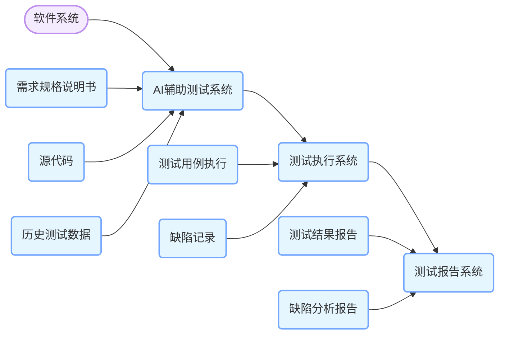

# AI辅助测试策略优化:提高测试ROI

> 关键词：AI辅助测试、测试策略优化、测试ROI、人工智能、软件测试

> 摘要：本文围绕AI辅助测试策略优化以提高测试ROI展开。首先介绍了背景信息，包括目的、预期读者、文档结构和相关术语。接着阐述了核心概念与联系，给出了原理和架构的示意图及流程图。详细讲解了核心算法原理，用Python代码进行说明，并介绍了相关数学模型和公式。通过项目实战展示了开发环境搭建、源代码实现及解读。探讨了实际应用场景，推荐了学习资源、开发工具框架和相关论文著作。最后总结了未来发展趋势与挑战，提供了常见问题解答和扩展阅读参考资料，旨在帮助读者深入理解如何利用AI优化测试策略以提升测试投资回报率。

## 1. 背景介绍 
### 1.1 目的和范围
在当今软件行业快速发展的背景下，软件的规模和复杂度不断增加，软件测试的重要性日益凸显。然而，传统的测试方法往往效率低下，成本高昂，难以满足快速迭代的开发需求。本文章的目的在于探讨如何利用人工智能（AI）技术来优化测试策略，提高测试的投资回报率（ROI）。具体范围涵盖了AI辅助测试的核心概念、算法原理、实际应用场景以及相关工具和资源的推荐。

### 1.2 预期读者
本文预期读者包括软件测试工程师、软件开发者、测试管理人员、人工智能研究者以及对软件测试和人工智能交叉领域感兴趣的技术人员。这些读者可以从本文中获取关于AI辅助测试的全面知识，了解如何将AI技术应用于测试策略优化，以提高测试效率和质量。

### 1.3 文档结构概述
本文将按照以下结构进行阐述：首先介绍相关背景知识，包括目的、读者和文档结构等；接着讲解AI辅助测试的核心概念与联系，给出原理和架构的示意图及流程图；然后详细介绍核心算法原理，并通过Python代码进行说明；之后阐述相关的数学模型和公式，并举例说明；通过项目实战展示如何应用这些技术；探讨实际应用场景；推荐相关的工具和资源；最后总结未来发展趋势与挑战，提供常见问题解答和扩展阅读参考资料。

### 1.4 术语表
#### 1.4.1 核心术语定义
- **AI辅助测试**：指利用人工智能技术（如机器学习、深度学习等）来辅助软件测试过程，包括测试用例生成、缺陷预测、测试结果分析等。
- **测试ROI（Return on Investment）**：测试投资回报率，是指测试活动所带来的收益与测试成本的比率，用于衡量测试活动的经济效益。
- **机器学习**：一门多领域交叉学科，涉及概率论、统计学、逼近论、凸分析、算法复杂度理论等多门学科。它专门研究计算机怎样模拟或实现人类的学习行为，以获取新的知识或技能，重新组织已有的知识结构使之不断改善自身的性能。
- **深度学习**：机器学习的一个分支领域，它是一种基于对数据进行表征学习的方法。深度学习通过构建具有很多层的神经网络模型，自动从大量数据中学习特征和模式。

#### 1.4.2 相关概念解释
- **测试用例**：为某个特殊目标而编制的一组测试输入、执行条件以及预期结果，用于核实是否满足某个特定软件需求。
- **缺陷预测**：利用历史数据和机器学习算法，预测软件中可能存在缺陷的模块或代码区域，以便测试人员优先对这些区域进行测试。
- **测试结果分析**：对测试过程中产生的结果进行分析，包括测试用例的执行情况、缺陷的分布情况等，以评估软件的质量和测试的有效性。

#### 1.4.3 缩略词列表
- **AI**：Artificial Intelligence，人工智能
- **ML**：Machine Learning，机器学习
- **DL**：Deep Learning，深度学习
- **ROI**：Return on Investment，投资回报率

## 2. 核心概念与联系 

### 核心概念原理
AI辅助测试的核心原理是利用人工智能技术对测试过程中的数据进行分析和处理，从而优化测试策略，提高测试效率和质量。具体来说，AI可以通过以下几个方面来辅助测试：

#### 测试用例生成
传统的测试用例生成往往依赖于测试人员的经验和手动编写，效率低下且容易遗漏一些边界情况。AI可以通过学习软件的需求规格说明书、源代码等数据，自动生成测试用例。例如，使用机器学习算法对历史测试用例进行分析，找出其中的模式和规律，然后根据这些模式和规律生成新的测试用例。

#### 缺陷预测
AI可以通过分析软件的代码特征、开发过程数据等，预测软件中可能存在缺陷的模块或代码区域。例如，使用深度学习算法对代码进行静态分析，提取代码的语义特征，然后根据这些特征预测代码中可能存在的缺陷。

#### 测试结果分析
AI可以对测试过程中产生的大量数据进行分析，包括测试用例的执行情况、缺陷的分布情况等，以评估软件的质量和测试的有效性。例如，使用数据挖掘算法对测试结果进行聚类分析，找出测试用例执行失败的原因和规律。

### 架构的文本示意图
```plaintext
+----------------------+
|      软件系统       |
+----------------------+
| 需求规格说明书       |
| 源代码               |
| 历史测试数据         |
+----------------------+
           |
           v
+----------------------+
|     AI辅助测试系统    |
+----------------------+
| 测试用例生成模块     |
| 缺陷预测模块         |
| 测试结果分析模块     |
+----------------------+
           |
           v
+----------------------+
|     测试执行系统     |
+----------------------+
| 测试用例执行         |
| 缺陷记录             |
+----------------------+
           |
           v
+----------------------+
|     测试报告系统     |
+----------------------+
| 测试结果报告         |
| 缺陷分析报告         |
+----------------------+
```

### Mermaid流程图


## 3. 核心算法原理 & 具体操作步骤 

### 测试用例生成算法 - 遗传算法
遗传算法是一种模拟自然选择和遗传机制的优化算法，可用于测试用例生成。其基本思想是通过模拟生物进化过程，不断迭代优化测试用例。

#### 算法原理
遗传算法的基本步骤包括初始化种群、选择、交叉、变异和终止条件判断。具体如下：
1. **初始化种群**：随机生成一组初始的测试用例，作为种群。
2. **选择**：根据测试用例的适应度值（例如，覆盖的代码行数、发现的缺陷数等），选择一部分测试用例作为父代。
3. **交叉**：对父代测试用例进行交叉操作，生成子代测试用例。
4. **变异**：对子代测试用例进行变异操作，引入新的测试用例。
5. **终止条件判断**：如果满足终止条件（例如，达到最大迭代次数、适应度值不再提高等），则停止迭代，输出最优测试用例；否则，返回步骤2。

#### Python源代码实现
```python
import random

# 定义测试用例的长度
TEST_CASE_LENGTH = 10

# 定义种群大小
POPULATION_SIZE = 20

# 定义交叉概率
CROSSOVER_RATE = 0.8

# 定义变异概率
MUTATION_RATE = 0.2

# 定义最大迭代次数
MAX_GENERATIONS = 100

# 初始化种群
def initialize_population():
    population = []
    for _ in range(POPULATION_SIZE):
        test_case = [random.randint(0, 1) for _ in range(TEST_CASE_LENGTH)]
        population.append(test_case)
    return population

# 计算适应度值
def fitness_function(test_case):
    # 这里简单以测试用例中1的个数作为适应度值
    return sum(test_case)

# 选择操作
def selection(population):
    fitness_values = [fitness_function(test_case) for test_case in population]
    total_fitness = sum(fitness_values)
    selection_probabilities = [fitness / total_fitness for fitness in fitness_values]
    selected_indices = random.choices(range(POPULATION_SIZE), weights=selection_probabilities, k=POPULATION_SIZE)
    selected_population = [population[i] for i in selected_indices]
    return selected_population

# 交叉操作
def crossover(parent1, parent2):
    if random.random() < CROSSOVER_RATE:
        crossover_point = random.randint(1, TEST_CASE_LENGTH - 1)
        child1 = parent1[:crossover_point] + parent2[crossover_point:]
        child2 = parent2[:crossover_point] + parent1[crossover_point:]
        return child1, child2
    else:
        return parent1, parent2

# 变异操作
def mutation(test_case):
    for i in range(TEST_CASE_LENGTH):
        if random.random() < MUTATION_RATE:
            test_case[i] = 1 - test_case[i]
    return test_case

# 遗传算法主函数
def genetic_algorithm():
    population = initialize_population()
    for generation in range(MAX_GENERATIONS):
        selected_population = selection(population)
        new_population = []
        for i in range(0, POPULATION_SIZE, 2):
            parent1 = selected_population[i]
            parent2 = selected_population[i + 1]
            child1, child2 = crossover(parent1, parent2)
            child1 = mutation(child1)
            child2 = mutation(child2)
            new_population.extend([child1, child2])
        population = new_population
    best_test_case = max(population, key=fitness_function)
    return best_test_case

# 运行遗传算法
best_test_case = genetic_algorithm()
print("最优测试用例:", best_test_case)
```

### 缺陷预测算法 - 逻辑回归
逻辑回归是一种常用的分类算法，可用于缺陷预测。其基本思想是通过对历史数据进行学习，建立一个逻辑回归模型，然后使用该模型对新的代码模块进行缺陷预测。

#### 算法原理
逻辑回归模型的基本形式为：
$$P(Y = 1|X) = \frac{1}{1 + e^{-(w_0 + w_1x_1 + w_2x_2 + \cdots + w_nx_n)}}$$
其中，$P(Y = 1|X)$ 表示在给定特征向量 $X = (x_1, x_2, \cdots, x_n)$ 的情况下，样本属于正类（存在缺陷）的概率；$w_0, w_1, w_2, \cdots, w_n$ 是模型的参数。

逻辑回归模型的训练过程就是通过最小化损失函数来估计模型的参数。常用的损失函数是对数损失函数：
$$L(w) = -\frac{1}{m}\sum_{i = 1}^{m}[y_i\log(P(Y = 1|X_i)) + (1 - y_i)\log(1 - P(Y = 1|X_i))]$$
其中，$m$ 是样本数量，$y_i$ 是第 $i$ 个样本的真实标签。

#### Python源代码实现
```python
import numpy as np
from sklearn.linear_model import LogisticRegression
from sklearn.model_selection import train_test_split
from sklearn.metrics import accuracy_score

# 生成一些示例数据
np.random.seed(0)
X = np.random.randn(100, 5)
y = np.random.randint(0, 2, 100)

# 划分训练集和测试集
X_train, X_test, y_train, y_test = train_test_split(X, y, test_size=0.2, random_state=0)

# 创建逻辑回归模型
model = LogisticRegression()

# 训练模型
model.fit(X_train, y_train)

# 预测
y_pred = model.predict(X_test)

# 计算准确率
accuracy = accuracy_score(y_test, y_pred)
print("准确率:", accuracy)
```

## 4. 数学模型和公式 & 详细讲解 & 举例说明 

### 测试用例生成 - 遗传算法的数学模型
#### 适应度函数
适应度函数用于评估每个测试用例的优劣程度。在遗传算法中，适应度函数的设计非常重要，它直接影响到算法的收敛速度和搜索结果。例如，在上述测试用例生成的遗传算法中，我们使用测试用例中1的个数作为适应度函数：
$$f(x) = \sum_{i = 1}^{n}x_i$$
其中，$x = (x_1, x_2, \cdots, x_n)$ 是一个测试用例，$n$ 是测试用例的长度。

#### 选择概率
选择操作是根据测试用例的适应度值来选择父代的。选择概率的计算公式为：
$$p_i = \frac{f(x_i)}{\sum_{j = 1}^{m}f(x_j)}$$
其中，$p_i$ 是第 $i$ 个测试用例被选中的概率，$f(x_i)$ 是第 $i$ 个测试用例的适应度值，$m$ 是种群的大小。

#### 举例说明
假设种群中有3个测试用例：$x_1 = [1, 0, 1]$, $x_2 = [0, 1, 0]$, $x_3 = [1, 1, 1]$。根据适应度函数 $f(x) = \sum_{i = 1}^{n}x_i$，可得 $f(x_1) = 2$, $f(x_2) = 1$, $f(x_3) = 3$。则选择概率分别为：
$$p_1 = \frac{2}{2 + 1 + 3} = \frac{1}{3}$$
$$p_2 = \frac{1}{2 + 1 + 3} = \frac{1}{6}$$
$$p_3 = \frac{3}{2 + 1 + 3} = \frac{1}{2}$$

### 缺陷预测 - 逻辑回归的数学模型
#### 逻辑回归模型
逻辑回归模型的基本形式为：
$$P(Y = 1|X) = \frac{1}{1 + e^{-(w_0 + w_1x_1 + w_2x_2 + \cdots + w_nx_n)}}$$
其中，$P(Y = 1|X)$ 表示在给定特征向量 $X = (x_1, x_2, \cdots, x_n)$ 的情况下，样本属于正类（存在缺陷）的概率；$w_0, w_1, w_2, \cdots, w_n$ 是模型的参数。

#### 对数损失函数
对数损失函数用于衡量模型的预测结果与真实标签之间的差异。其计算公式为：
$$L(w) = -\frac{1}{m}\sum_{i = 1}^{m}[y_i\log(P(Y = 1|X_i)) + (1 - y_i)\log(1 - P(Y = 1|X_i))]$$
其中，$m$ 是样本数量，$y_i$ 是第 $i$ 个样本的真实标签。

#### 举例说明
假设我们有一个简单的逻辑回归模型，只有一个特征 $x$，模型的参数为 $w_0 = 0$, $w_1 = 1$。则模型的预测概率为：
$$P(Y = 1|x) = \frac{1}{1 + e^{-x}}$$
假设我们有一个样本 $x = 1$，真实标签 $y = 1$。则预测概率为：
$$P(Y = 1|x = 1) = \frac{1}{1 + e^{-1}} \approx 0.731$$
对数损失为：
$$L(w) = -\log(0.731) \approx 0.314$$

## 5. 项目实战：代码实际案例和详细解释说明 

### 5.1  开发环境搭建
#### 操作系统
可以选择Windows、Linux或macOS等主流操作系统。这里以Windows 10为例进行说明。

#### 编程语言和版本
选择Python 3.7及以上版本。可以从Python官方网站（https://www.python.org/downloads/）下载安装包进行安装。

#### 开发工具
推荐使用PyCharm作为开发工具。可以从JetBrains官方网站（https://www.jetbrains.com/pycharm/download/）下载社区版进行安装。

#### 相关库的安装
在命令行中使用以下命令安装所需的库：
```sh
pip install numpy scikit-learn
```

### 5.2  源代码详细实现和代码解读
#### 测试用例生成 - 遗传算法
```python
import random

# 定义测试用例的长度
TEST_CASE_LENGTH = 10

# 定义种群大小
POPULATION_SIZE = 20

# 定义交叉概率
CROSSOVER_RATE = 0.8

# 定义变异概率
MUTATION_RATE = 0.2

# 定义最大迭代次数
MAX_GENERATIONS = 100

# 初始化种群
def initialize_population():
    population = []
    for _ in range(POPULATION_SIZE):
        test_case = [random.randint(0, 1) for _ in range(TEST_CASE_LENGTH)]
        population.append(test_case)
    return population

# 计算适应度值
def fitness_function(test_case):
    # 这里简单以测试用例中1的个数作为适应度值
    return sum(test_case)

# 选择操作
def selection(population):
    fitness_values = [fitness_function(test_case) for test_case in population]
    total_fitness = sum(fitness_values)
    selection_probabilities = [fitness / total_fitness for fitness in fitness_values]
    selected_indices = random.choices(range(POPULATION_SIZE), weights=selection_probabilities, k=POPULATION_SIZE)
    selected_population = [population[i] for i in selected_indices]
    return selected_population

# 交叉操作
def crossover(parent1, parent2):
    if random.random() < CROSSOVER_RATE:
        crossover_point = random.randint(1, TEST_CASE_LENGTH - 1)
        child1 = parent1[:crossover_point] + parent2[crossover_point:]
        child2 = parent2[:crossover_point] + parent1[crossover_point:]
        return child1, child2
    else:
        return parent1, parent2

# 变异操作
def mutation(test_case):
    for i in range(TEST_CASE_LENGTH):
        if random.random() < MUTATION_RATE:
            test_case[i] = 1 - test_case[i]
    return test_case

# 遗传算法主函数
def genetic_algorithm():
    population = initialize_population()
    for generation in range(MAX_GENERATIONS):
        selected_population = selection(population)
        new_population = []
        for i in range(0, POPULATION_SIZE, 2):
            parent1 = selected_population[i]
            parent2 = selected_population[i + 1]
            child1, child2 = crossover(parent1, parent2)
            child1 = mutation(child1)
            child2 = mutation(child2)
            new_population.extend([child1, child2])
        population = new_population
    best_test_case = max(population, key=fitness_function)
    return best_test_case

# 运行遗传算法
best_test_case = genetic_algorithm()
print("最优测试用例:", best_test_case)
```
**代码解读**：
- `initialize_population` 函数：随机生成一组初始的测试用例，作为种群。
- `fitness_function` 函数：计算每个测试用例的适应度值，这里简单以测试用例中1的个数作为适应度值。
- `selection` 函数：根据测试用例的适应度值，选择一部分测试用例作为父代。
- `crossover` 函数：对父代测试用例进行交叉操作，生成子代测试用例。
- `mutation` 函数：对子代测试用例进行变异操作，引入新的测试用例。
- `genetic_algorithm` 函数：遗传算法的主函数，通过不断迭代优化测试用例，最终输出最优测试用例。

#### 缺陷预测 - 逻辑回归
```python
import numpy as np
from sklearn.linear_model import LogisticRegression
from sklearn.model_selection import train_test_split
from sklearn.metrics import accuracy_score

# 生成一些示例数据
np.random.seed(0)
X = np.random.randn(100, 5)
y = np.random.randint(0, 2, 100)

# 划分训练集和测试集
X_train, X_test, y_train, y_test = train_test_split(X, y, test_size=0.2, random_state=0)

# 创建逻辑回归模型
model = LogisticRegression()

# 训练模型
model.fit(X_train, y_train)

# 预测
y_pred = model.predict(X_test)

# 计算准确率
accuracy = accuracy_score(y_test, y_pred)
print("准确率:", accuracy)
```
**代码解读**：
- `np.random.seed(0)`：设置随机种子，保证结果的可重复性。
- `X = np.random.randn(100, 5)` 和 `y = np.random.randint(0, 2, 100)`：生成一些示例数据，其中 $X$ 是特征矩阵，$y$ 是标签向量。
- `train_test_split` 函数：将数据集划分为训练集和测试集。
- `LogisticRegression` 类：创建逻辑回归模型。
- `model.fit(X_train, y_train)`：训练逻辑回归模型。
- `model.predict(X_test)`：使用训练好的模型对测试集进行预测。
- `accuracy_score(y_test, y_pred)`：计算模型的准确率。

### 5.3  代码解读与分析
#### 测试用例生成 - 遗传算法
遗传算法通过模拟生物进化过程，不断迭代优化测试用例。在每次迭代中，通过选择、交叉和变异操作生成新的测试用例，直到满足终止条件。适应度函数的设计直接影响到算法的收敛速度和搜索结果。在实际应用中，可以根据具体的测试需求设计更复杂的适应度函数。

#### 缺陷预测 - 逻辑回归
逻辑回归是一种简单而有效的分类算法，适用于二分类问题。在缺陷预测中，通过对历史数据进行学习，建立逻辑回归模型，然后使用该模型对新的代码模块进行缺陷预测。模型的准确率受到数据质量、特征选择等因素的影响。在实际应用中，可以通过特征工程、模型调优等方法提高模型的性能。

## 6. 实际应用场景 
### 大型软件项目测试
在大型软件项目中，测试用例的数量往往非常庞大，传统的手动测试方法效率低下。AI辅助测试可以通过自动生成测试用例、预测缺陷等方式，提高测试效率和质量。例如，在一个大型电子商务系统的测试中，使用AI辅助测试可以快速生成大量的测试用例，覆盖各种业务场景，同时预测可能存在缺陷的模块，帮助测试人员优先进行测试。

### 移动应用测试
移动应用的用户界面和交互方式复杂，不同的设备和操作系统可能会导致不同的测试结果。AI辅助测试可以通过模拟用户操作、分析测试结果等方式，提高移动应用的测试效率和覆盖率。例如，使用AI技术可以自动生成不同设备和操作系统下的测试用例，模拟用户的各种操作行为，及时发现应用中的兼容性问题和缺陷。

### 云计算和大数据系统测试
云计算和大数据系统通常具有高并发、分布式等特点，测试难度较大。AI辅助测试可以通过分析系统的日志数据、性能指标等，预测系统可能出现的故障和性能瓶颈，提前进行优化和修复。例如，在一个云计算平台的测试中，使用AI技术可以对系统的日志数据进行实时分析，预测可能出现的节点故障，及时进行预警和处理。

## 7. 工具和资源推荐
### 7.1 学习资源推荐
#### 7.1.1 书籍推荐
- 《机器学习》（周志华著）：全面介绍了机器学习的基本概念、算法和应用，是机器学习领域的经典教材。
- 《深度学习》（Ian Goodfellow、Yoshua Bengio和Aaron Courville著）：深度学习领域的权威著作，详细介绍了深度学习的理论和实践。
- 《软件测试的艺术》（Glenford J. Myers著）：软件测试领域的经典书籍，介绍了软件测试的基本概念、方法和技术。

#### 7.1.2 在线课程
- Coursera上的“机器学习”课程（Andrew Ng教授授课）：经典的机器学习在线课程，适合初学者入门。
- edX上的“深度学习”课程（由知名高校和企业的专家授课）：深入介绍了深度学习的理论和实践。
- 网易云课堂上的“软件测试工程师实战班”：系统介绍了软件测试的流程、方法和工具，适合软件测试人员提升技能。

#### 7.1.3 技术博客和网站
- Medium：一个技术博客平台，有很多关于人工智能和软件测试的优秀文章。
- Towards Data Science：专注于数据科学和机器学习领域的技术博客，提供了很多实用的算法和案例。
- Software Testing Help：软件测试领域的专业网站，提供了丰富的测试资源和教程。

### 7.2 开发工具框架推荐
#### 7.2.1 IDE和编辑器
- PyCharm：专业的Python集成开发环境，提供了丰富的代码编辑、调试和版本控制等功能。
- Visual Studio Code：轻量级的代码编辑器，支持多种编程语言，有丰富的插件扩展。
- Jupyter Notebook：交互式的开发环境，适合进行数据探索和模型实验。

#### 7.2.2 调试和性能分析工具
- PyCharm的调试功能：可以方便地设置断点、单步执行代码，帮助调试程序。
- cProfile：Python内置的性能分析工具，可以分析程序的运行时间和函数调用次数。
- TensorBoard：TensorFlow的可视化工具，可以用于可视化模型的训练过程和性能指标。

#### 7.2.3 相关框架和库
- Scikit-learn：Python中常用的机器学习库，提供了丰富的机器学习算法和工具。
- TensorFlow：开源的深度学习框架，广泛应用于图像识别、自然语言处理等领域。
- Pytest：Python中常用的测试框架，简单易用，支持参数化测试和并行测试。

### 7.3 相关论文著作推荐
#### 7.3.1 经典论文
- “A Survey on Software Defect Prediction Models”（T. Menzies、J. Greenwald和A. Frank著）：对软件缺陷预测模型进行了全面的综述，介绍了各种缺陷预测算法和评估指标。
- “Automated Test Case Generation Using Search-Based Software Engineering: A Systematic Literature Review”（M. Harman、S. Mansouri和Y. Zhang著）：对基于搜索的软件测试用例生成方法进行了系统的综述，分析了各种搜索算法和适应度函数。
- “Deep Learning for Software Defect Prediction”（X. Ma、Y. Liu和J. Zhang著）：介绍了深度学习在软件缺陷预测中的应用，提出了一种基于深度学习的缺陷预测模型。

#### 7.3.2 最新研究成果
- 可以关注顶级的软件工程会议（如ICSE、FSE等）和机器学习会议（如NeurIPS、ICML等）上的最新研究成果，了解AI辅助测试领域的最新技术和趋势。

#### 7.3.3 应用案例分析
- 一些知名科技公司（如Google、Microsoft等）会在其技术博客上分享AI辅助测试的应用案例，可以参考这些案例了解实际应用中的经验和教训。

## 8. 总结：未来发展趋势与挑战
### 未来发展趋势
#### 智能化程度不断提高
未来，AI辅助测试将更加智能化，能够自动学习和适应不同的软件系统和测试场景。例如，AI可以根据软件的变化自动调整测试策略，生成更有效的测试用例。

#### 与DevOps深度融合
随着DevOps理念的普及，AI辅助测试将与DevOps流程深度融合，实现测试的自动化和持续化。例如，在代码提交后，AI可以自动触发测试任务，及时发现和修复缺陷。

#### 跨领域应用拓展
AI辅助测试将不仅仅局限于软件测试领域，还将拓展到硬件测试、物联网测试等跨领域应用。例如，在物联网设备的测试中，AI可以通过分析设备的传感器数据，预测设备可能出现的故障。

### 挑战
#### 数据质量和可用性
AI算法的性能很大程度上依赖于数据的质量和可用性。在软件测试领域，获取高质量的测试数据往往比较困难，数据的标注和清洗也需要大量的人力和时间。

#### 算法的可解释性
一些复杂的AI算法（如深度学习算法）往往缺乏可解释性，难以理解模型的决策过程。在软件测试中，测试人员需要了解模型的预测结果是如何得出的，以便进行有效的测试和调试。

#### 技术人才短缺
AI辅助测试需要既懂人工智能又懂软件测试的复合型人才，目前这类人才比较短缺。企业和高校需要加强相关人才的培养，以满足市场的需求。

## 9. 附录：常见问题与解答
### 问题1：AI辅助测试是否可以完全替代人工测试？
答：目前AI辅助测试还不能完全替代人工测试。虽然AI可以自动生成测试用例、预测缺陷等，但在一些复杂的场景下，如用户体验测试、安全性测试等，还需要人工测试人员的专业知识和经验。AI辅助测试更多的是辅助人工测试，提高测试效率和质量。

### 问题2：如何选择适合的AI算法进行测试用例生成和缺陷预测？
答：选择适合的AI算法需要考虑多个因素，如数据的特点、问题的复杂度、算法的性能和可解释性等。对于测试用例生成，可以选择遗传算法、模拟退火算法等搜索算法；对于缺陷预测，可以选择逻辑回归、决策树、神经网络等分类算法。在实际应用中，可以通过实验和比较不同算法的性能，选择最适合的算法。

### 问题3：AI辅助测试需要多少数据才能取得较好的效果？
答：AI辅助测试所需的数据量取决于多个因素，如算法的复杂度、问题的难度、数据的质量等。一般来说，数据量越大，模型的性能越好。但在实际应用中，也需要考虑数据的获取成本和处理效率。可以通过数据增强、特征选择等方法，在有限的数据量下提高模型的性能。

## 10. 扩展阅读 & 参考资料
### 扩展阅读
- 《人工智能：现代方法》（Stuart Russell和Peter Norvig著）：全面介绍了人工智能的基本概念、算法和应用，是人工智能领域的经典教材。
- 《测试驱动开发的艺术》（Roy Osherove著）：介绍了测试驱动开发的基本概念、方法和实践，帮助开发人员提高代码质量。
- 《Python数据分析实战》（Aurélien Géron著）：详细介绍了Python在数据分析和机器学习中的应用，提供了很多实用的案例和代码。

### 参考资料
- 周志华. 机器学习[M]. 清华大学出版社, 2016.
- Ian Goodfellow, Yoshua Bengio, Aaron Courville. 深度学习[M]. 人民邮电出版社, 2017.
- Glenford J. Myers. 软件测试的艺术[M]. 机械工业出版社, 2013.
- Andrew Ng. Machine Learning [Online Course]. Coursera.
- 各技术博客和网站上的相关文章。