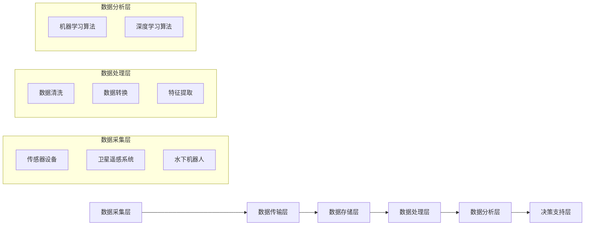

# AI辅助海洋生态系统监测：从数据收集到趋势分析

> 关键词：AI、海洋生态系统监测、数据收集、趋势分析、机器学习、传感器技术、环境数据

> 摘要：本文围绕AI辅助海洋生态系统监测展开，全面阐述了从数据收集到趋势分析的整个过程。首先介绍了相关背景，包括目的、预期读者、文档结构等内容。接着深入探讨核心概念，剖析其原理与架构，并通过流程图呈现。在核心算法原理部分，使用Python代码详细阐述。数学模型和公式的讲解结合实例，让读者更好理解。项目实战给出具体代码案例并进行解读。还介绍了实际应用场景、推荐了相关工具和资源。最后总结未来发展趋势与挑战，解答常见问题并提供扩展阅读和参考资料，旨在为利用AI技术进行海洋生态系统监测提供全面且深入的指导。

## 1. 背景介绍 
### 1.1 目的和范围
海洋生态系统是地球上最为复杂和重要的生态系统之一，它对全球气候、生物多样性以及人类的生存和发展都有着深远的影响。然而，由于人类活动的不断增加，如过度捕捞、海洋污染、气候变化等，海洋生态系统正面临着前所未有的威胁。因此，对海洋生态系统进行有效的监测和管理变得至关重要。

本文章的目的在于探讨如何利用人工智能（AI）技术辅助海洋生态系统的监测，从数据收集到趋势分析的整个流程进行详细的阐述。范围涵盖了AI在海洋生态系统监测中的各个方面，包括数据收集方法、数据处理技术、趋势分析算法以及实际应用案例等。

### 1.2 预期读者
本文预期读者包括但不限于海洋生态学家、环境科学家、数据科学家、AI研究人员、相关专业的学生以及对海洋生态系统监测和AI技术感兴趣的人士。通过阅读本文，读者能够了解AI在海洋生态系统监测中的应用原理、方法和实践，为相关领域的研究和实践提供参考。

### 1.3 文档结构概述
本文共分为十个部分，具体结构如下：
1. 背景介绍：介绍文章的目的、范围、预期读者和文档结构概述，以及相关术语的定义和解释。
2. 核心概念与联系：阐述AI辅助海洋生态系统监测的核心概念，包括数据收集、数据处理、趋势分析等，并展示其原理和架构的文本示意图及Mermaid流程图。
3. 核心算法原理 & 具体操作步骤：详细讲解用于海洋生态系统监测的核心算法原理，并使用Python源代码进行具体操作步骤的阐述。
4. 数学模型和公式 & 详细讲解 & 举例说明：介绍相关的数学模型和公式，并通过具体例子进行详细讲解。
5. 项目实战：代码实际案例和详细解释说明：提供一个完整的项目实战案例，包括开发环境搭建、源代码详细实现和代码解读。
6. 实际应用场景：介绍AI辅助海洋生态系统监测在实际中的应用场景。
7. 工具和资源推荐：推荐相关的学习资源、开发工具框架和论文著作。
8. 总结：未来发展趋势与挑战：总结AI辅助海洋生态系统监测的未来发展趋势和面临的挑战。
9. 附录：常见问题与解答：解答读者在阅读过程中可能遇到的常见问题。
10. 扩展阅读 & 参考资料：提供扩展阅读的建议和相关参考资料。

### 1.4 术语表
#### 1.4.1 核心术语定义
- **海洋生态系统监测**：指对海洋生态系统的各种要素，如生物群落、物理化学环境等进行长期、系统的观测和分析，以了解海洋生态系统的状态、变化及其影响因素。
- **人工智能（AI）**：是一门研究如何使计算机系统能够模拟人类智能的学科，包括机器学习、深度学习、自然语言处理等技术。
- **数据收集**：指通过各种手段获取海洋生态系统相关的数据，如传感器、卫星遥感、水下机器人等。
- **数据处理**：指对收集到的原始数据进行清洗、转换、特征提取等操作，以提高数据的质量和可用性。
- **趋势分析**：指通过对处理后的数据进行分析，找出数据中的变化趋势和规律，以预测海洋生态系统的未来发展。

#### 1.4.2 相关概念解释
- **机器学习**：是AI的一个重要分支，它通过让计算机从数据中自动学习模式和规律，从而实现对未知数据的预测和分类。
- **深度学习**：是机器学习的一种特殊形式，它通过构建多层神经网络来学习数据的深层次特征，在图像识别、语音识别等领域取得了巨大的成功。
- **传感器技术**：是指利用各种传感器设备来获取海洋生态系统的物理、化学和生物信息的技术。
- **卫星遥感**：是指利用卫星搭载的传感器来获取海洋表面的信息，如温度、盐度、叶绿素浓度等。

#### 1.4.3 缩略词列表
- **AI**：Artificial Intelligence（人工智能）
- **ML**：Machine Learning（机器学习）
- **DL**：Deep Learning（深度学习）
- **IoT**：Internet of Things（物联网）
- **GIS**：Geographic Information System（地理信息系统）

## 2. 核心概念与联系 

### 核心概念原理
AI辅助海洋生态系统监测主要涉及数据收集、数据处理、趋势分析三个核心概念。

数据收集是整个监测过程的基础，通过各种传感器设备（如水质传感器、气象传感器、生物传感器等）、卫星遥感技术以及水下机器人等手段，获取海洋生态系统的各种数据，包括物理数据（如温度、盐度、海流速度等）、化学数据（如溶解氧、酸碱度、营养盐浓度等）和生物数据（如浮游生物种类和数量、鱼类分布等）。

数据处理是对收集到的原始数据进行清洗、转换、特征提取等操作，以提高数据的质量和可用性。清洗操作主要是去除数据中的噪声、异常值和缺失值；转换操作是将数据转换为适合分析的格式；特征提取是从原始数据中提取出能够反映海洋生态系统特征的关键信息。

趋势分析是在数据处理的基础上，通过各种数据分析方法（如机器学习、深度学习等），找出数据中的变化趋势和规律，以预测海洋生态系统的未来发展。趋势分析可以帮助我们及时发现海洋生态系统的异常变化，采取相应的措施进行保护和管理。

### 架构的文本示意图
AI辅助海洋生态系统监测的架构可以分为以下几个层次：
1. **数据采集层**：包括各种传感器设备、卫星遥感系统和水下机器人等，负责采集海洋生态系统的各种数据。
2. **数据传输层**：将采集到的数据通过有线或无线通信网络传输到数据中心。
3. **数据存储层**：将传输过来的数据存储在数据库或数据仓库中，以便后续的处理和分析。
4. **数据处理层**：对存储的数据进行清洗、转换、特征提取等操作，以提高数据的质量和可用性。
5. **数据分析层**：利用机器学习、深度学习等算法对处理后的数据进行分析，找出数据中的变化趋势和规律。
6. **决策支持层**：根据数据分析的结果，为海洋生态系统的保护和管理提供决策支持。

### Mermaid流程图


## 3. 核心算法原理 & 具体操作步骤 

### 核心算法原理
在AI辅助海洋生态系统监测中，常用的核心算法包括机器学习算法和深度学习算法。下面以支持向量机（SVM）和卷积神经网络（CNN）为例，介绍其原理。

#### 支持向量机（SVM）
支持向量机是一种有监督的机器学习算法，主要用于分类和回归分析。其基本思想是在特征空间中找到一个最优的超平面，使得不同类别的样本能够被最大程度地分开。

对于线性可分的数据集，SVM的目标是找到一个超平面 $w^T x + b = 0$，其中 $w$ 是超平面的法向量，$b$ 是偏置项，使得所有正类样本满足 $w^T x + b \geq 1$，所有负类样本满足 $w^T x + b \leq -1$，并且两类样本到超平面的距离最大。这个距离称为间隔，SVM的目标就是最大化间隔。

对于线性不可分的数据集，SVM通过引入松弛变量和惩罚因子，将问题转化为一个凸二次规划问题来求解。

#### 卷积神经网络（CNN）
卷积神经网络是一种专门用于处理具有网格结构数据（如图像、音频等）的深度学习算法。它通过卷积层、池化层和全连接层等组件，自动提取数据的特征。

卷积层通过卷积核在输入数据上滑动，进行卷积操作，提取数据的局部特征。池化层用于对卷积层的输出进行下采样，减少数据的维度，同时保留重要的特征信息。全连接层将池化层的输出进行扁平化处理，然后通过一系列的神经元进行分类或回归分析。

### 具体操作步骤及Python源代码

#### 支持向量机（SVM）示例
```python
# 导入必要的库
from sklearn import datasets
from sklearn.model_selection import train_test_split
from sklearn.svm import SVC
from sklearn.metrics import accuracy_score

# 加载数据集
iris = datasets.load_iris()
X = iris.data
y = iris.target

# 划分训练集和测试集
X_train, X_test, y_train, y_test = train_test_split(X, y, test_size=0.3, random_state=42)

# 创建SVM分类器
svm_classifier = SVC(kernel='linear')

# 训练模型
svm_classifier.fit(X_train, y_train)

# 预测
y_pred = svm_classifier.predict(X_test)

# 计算准确率
accuracy = accuracy_score(y_test, y_pred)
print(f"Accuracy: {accuracy}")
```

#### 卷积神经网络（CNN）示例
```python
# 导入必要的库
import tensorflow as tf
from tensorflow.keras import datasets, layers, models
import matplotlib.pyplot as plt

# 加载数据集
(train_images, train_labels), (test_images, test_labels) = datasets.cifar10.load_data()

# 数据预处理
train_images, test_images = train_images / 255.0, test_images / 255.0

# 构建CNN模型
model = models.Sequential()
model.add(layers.Conv2D(32, (3, 3), activation='relu', input_shape=(32, 32, 3)))
model.add(layers.MaxPooling2D((2, 2)))
model.add(layers.Conv2D(64, (3, 3), activation='relu'))
model.add(layers.MaxPooling2D((2, 2)))
model.add(layers.Conv2D(64, (3, 3), activation='relu'))
model.add(layers.Flatten())
model.add(layers.Dense(64, activation='relu'))
model.add(layers.Dense(10))

# 编译模型
model.compile(optimizer='adam',
              loss=tf.keras.losses.SparseCategoricalCrossentropy(from_logits=True),
              metrics=['accuracy'])

# 训练模型
history = model.fit(train_images, train_labels, epochs=10, 
                    validation_data=(test_images, test_labels))

# 评估模型
test_loss, test_acc = model.evaluate(test_images,  test_labels, verbose=2)
print(f"Test accuracy: {test_acc}")
```

## 4. 数学模型和公式 & 详细讲解 & 举例说明 

### 支持向量机（SVM）数学模型和公式

#### 线性可分情况
对于线性可分的数据集 $\{(x_1, y_1), (x_2, y_2), \cdots, (x_n, y_n)\}$，其中 $x_i \in \mathbb{R}^d$ 是样本特征向量，$y_i \in \{-1, 1\}$ 是样本标签。SVM的目标是找到一个超平面 $w^T x + b = 0$，使得所有正类样本满足 $w^T x_i + b \geq 1$，所有负类样本满足 $w^T x_i + b \leq -1$，并且最大化间隔。

间隔的计算公式为 $\frac{2}{\|w\|}$，因此SVM的优化问题可以表示为：
$$
\begin{aligned}
\min_{w, b} &\quad \frac{1}{2}\|w\|^2 \\
\text{s.t.} &\quad y_i(w^T x_i + b) \geq 1, \quad i = 1, 2, \cdots, n
\end{aligned}
$$

#### 线性不可分情况
对于线性不可分的数据集，引入松弛变量 $\xi_i \geq 0$，允许样本点在一定程度上违反约束条件。同时，引入惩罚因子 $C$ 来平衡间隔和误差。SVM的优化问题变为：
$$
\begin{aligned}
\min_{w, b, \xi} &\quad \frac{1}{2}\|w\|^2 + C\sum_{i=1}^{n}\xi_i \\
\text{s.t.} &\quad y_i(w^T x_i + b) \geq 1 - \xi_i, \quad \xi_i \geq 0, \quad i = 1, 2, \cdots, n
\end{aligned}
$$

#### 举例说明
假设有一个二维数据集，包含两个类别的样本点。我们可以使用SVM来找到一个最优的超平面将这两个类别分开。以下是一个简单的Python代码示例：
```python
import numpy as np
import matplotlib.pyplot as plt
from sklearn.svm import SVC

# 生成数据集
np.random.seed(0)
X = np.r_[np.random.randn(20, 2) - [2, 2], np.random.randn(20, 2) + [2, 2]]
Y = [0] * 20 + [1] * 20

# 创建SVM分类器
clf = SVC(kernel='linear')
clf.fit(X, Y)

# 绘制数据集和超平面
plt.scatter(X[:, 0], X[:, 1], c=Y, cmap=plt.cm.Paired)
ax = plt.gca()
xlim = ax.get_xlim()
ylim = ax.get_ylim()

# 创建网格点
xx = np.linspace(xlim[0], xlim[1], 30)
yy = np.linspace(ylim[0], ylim[1], 30)
YY, XX = np.meshgrid(yy, xx)
xy = np.vstack([XX.ravel(), YY.ravel()]).T
Z = clf.decision_function(xy).reshape(XX.shape)

# 绘制超平面和边界
ax.contour(XX, YY, Z, colors='k', levels=[-1, 0, 1], alpha=0.5, linestyles=['--', '-', '--'])
plt.show()
```

### 卷积神经网络（CNN）数学模型和公式

#### 卷积层
卷积层的核心操作是卷积运算。对于输入特征图 $X \in \mathbb{R}^{H \times W \times C}$，其中 $H$ 是高度，$W$ 是宽度，$C$ 是通道数，卷积核 $K \in \mathbb{R}^{h \times w \times C}$，其中 $h$ 是卷积核的高度，$w$ 是卷积核的宽度。卷积运算的输出特征图 $Y \in \mathbb{R}^{H' \times W' \times C'}$ 可以表示为：
$$
Y_{i, j, k} = \sum_{m=0}^{h-1} \sum_{n=0}^{w-1} \sum_{l=0}^{C-1} K_{m, n, l} X_{i+m, j+n, l} + b_k
$$
其中 $b_k$ 是偏置项，$i = 0, 1, \cdots, H' - 1$，$j = 0, 1, \cdots, W' - 1$，$k = 0, 1, \cdots, C' - 1$。

#### 池化层
池化层的主要作用是对输入特征图进行下采样。常见的池化操作有最大池化和平均池化。以最大池化为例，对于输入特征图 $X \in \mathbb{R}^{H \times W \times C}$，池化窗口大小为 $p \times p$，步长为 $s$，输出特征图 $Y \in \mathbb{R}^{H' \times W' \times C}$ 可以表示为：
$$
Y_{i, j, k} = \max_{m=0}^{p-1} \max_{n=0}^{p-1} X_{i \cdot s + m, j \cdot s + n, k}
$$
其中 $i = 0, 1, \cdots, H' - 1$，$j = 0, 1, \cdots, W' - 1$，$k = 0, 1, \cdots, C - 1$。

#### 举例说明
以下是一个简单的CNN模型示例，用于对MNIST手写数字数据集进行分类：
```python
import tensorflow as tf
from tensorflow.keras import datasets, layers, models

# 加载数据集
(train_images, train_labels), (test_images, test_labels) = datasets.mnist.load_data()

# 数据预处理
train_images = train_images.reshape((60000, 28, 28, 1))
train_images = train_images / 255.0
test_images = test_images.reshape((10000, 28, 28, 1))
test_images = test_images / 255.0

# 构建CNN模型
model = models.Sequential()
model.add(layers.Conv2D(32, (3, 3), activation='relu', input_shape=(28, 28, 1)))
model.add(layers.MaxPooling2D((2, 2)))
model.add(layers.Conv2D(64, (3, 3), activation='relu'))
model.add(layers.MaxPooling2D((2, 2)))
model.add(layers.Flatten())
model.add(layers.Dense(64, activation='relu'))
model.add(layers.Dense(10, activation='softmax'))

# 编译模型
model.compile(optimizer='adam',
              loss='sparse_categorical_crossentropy',
              metrics=['accuracy'])

# 训练模型
model.fit(train_images, train_labels, epochs=5)

# 评估模型
test_loss, test_acc = model.evaluate(test_images, test_labels)
print(f"Test accuracy: {test_acc}")
```

## 5. 项目实战：代码实际案例和详细解释说明 

### 5.1  开发环境搭建
在进行AI辅助海洋生态系统监测的项目实战之前，需要搭建相应的开发环境。以下是具体的步骤：

#### 安装Python
Python是一种广泛使用的编程语言，在AI和数据分析领域有着重要的应用。可以从Python官方网站（https://www.python.org/downloads/） 下载并安装Python 3.x版本。

#### 安装深度学习框架
常用的深度学习框架有TensorFlow、PyTorch等。可以使用以下命令安装TensorFlow：
```sh
pip install tensorflow
```

#### 安装其他必要的库
还需要安装一些其他的库，如NumPy、Pandas、Matplotlib等，用于数据处理和可视化。可以使用以下命令安装：
```sh
pip install numpy pandas matplotlib
```

### 5.2  源代码详细实现和代码解读
以下是一个简单的项目实战案例，用于预测海洋水温的变化趋势。

```python
import numpy as np
import pandas as pd
from sklearn.model_selection import train_test_split
from sklearn.linear_model import LinearRegression
import matplotlib.pyplot as plt

# 加载数据
data = pd.read_csv('ocean_temperature.csv')

# 提取特征和标签
X = data[['time']].values
y = data['temperature'].values

# 划分训练集和测试集
X_train, X_test, y_train, y_test = train_test_split(X, y, test_size=0.2, random_state=42)

# 创建线性回归模型
model = LinearRegression()

# 训练模型
model.fit(X_train, y_train)

# 预测
y_pred = model.predict(X_test)

# 绘制结果
plt.scatter(X_test, y_test, color='blue', label='Actual')
plt.plot(X_test, y_pred, color='red', linewidth=2, label='Predicted')
plt.xlabel('Time')
plt.ylabel('Temperature')
plt.title('Ocean Temperature Prediction')
plt.legend()
plt.show()
```

### 5.3  代码解读与分析
1. **数据加载**：使用Pandas库的 `read_csv` 函数加载海洋水温数据。
2. **特征和标签提取**：从数据中提取时间作为特征，水温作为标签。
3. **数据集划分**：使用 `train_test_split` 函数将数据集划分为训练集和测试集，测试集占比为20%。
4. **模型创建**：创建一个线性回归模型。
5. **模型训练**：使用训练集对模型进行训练。
6. **预测**：使用训练好的模型对测试集进行预测。
7. **结果可视化**：使用Matplotlib库绘制实际值和预测值的散点图和折线图，直观地展示预测结果。

## 6. 实际应用场景 
### 海洋生物多样性监测
AI技术可以通过分析水下摄像头拍摄的图像和视频，识别海洋生物的种类和数量，从而监测海洋生物多样性的变化。例如，利用深度学习算法对珊瑚礁区域的图像进行分析，可以识别出不同种类的珊瑚和鱼类，及时发现生物多样性的下降趋势。

### 海洋污染监测
通过传感器收集海洋中的水质数据，如溶解氧、酸碱度、重金属含量等，利用AI算法对这些数据进行分析，可以及时发现海洋污染事件。例如，当某个区域的重金属含量突然升高时，系统可以发出警报，提醒相关部门采取措施。

### 海洋生态系统健康评估
综合考虑海洋生态系统的各种因素，如生物群落结构、物理化学环境等，利用AI技术建立生态系统健康评估模型。通过对大量数据的分析，可以对海洋生态系统的健康状况进行实时评估，为海洋生态保护和管理提供决策支持。

### 海洋灾害预警
利用卫星遥感数据和气象数据，结合AI算法，可以对海洋灾害（如海啸、风暴潮、赤潮等）进行预警。例如，通过分析卫星图像中海洋表面温度和叶绿素浓度的变化，可以提前预测赤潮的发生，为渔民和相关部门提供预警信息。

## 7. 工具和资源推荐
### 7.1 学习资源推荐
#### 7.1.1 书籍推荐
- 《深度学习》（Deep Learning）：由Ian Goodfellow、Yoshua Bengio和Aaron Courville所著，是深度学习领域的经典教材。
- 《Python机器学习》（Python Machine Learning）：由Sebastian Raschka所著，详细介绍了Python在机器学习中的应用。
- 《海洋生态学》（Marine Ecology）：全面介绍了海洋生态系统的结构、功能和动态变化。

#### 7.1.2 在线课程
- Coursera上的“深度学习专项课程”（Deep Learning Specialization）：由Andrew Ng教授主讲，是深度学习领域的经典课程。
- edX上的“数据科学与机器学习微硕士学位”（MicroMasters Program in Data Science and Machine Learning）：提供了系统的数据科学和机器学习知识。
- 中国大学MOOC上的“海洋科学导论”：介绍了海洋科学的基本概念和研究方法。

#### 7.1.3 技术博客和网站
- Medium：有很多关于AI和海洋科学的技术博客文章。
- Kaggle：提供了丰富的数据集和机器学习竞赛，可用于实践和学习。
- OceanDataLab：专注于海洋数据的研究和应用，提供了很多海洋数据资源和研究成果。

### 7.2 开发工具框架推荐
#### 7.2.1 IDE和编辑器
- PyCharm：是一款专业的Python集成开发环境，提供了丰富的功能和插件。
- Jupyter Notebook：是一个交互式的开发环境，适合进行数据探索和模型开发。
- Visual Studio Code：是一款轻量级的代码编辑器，支持多种编程语言和插件。

#### 7.2.2 调试和性能分析工具
- TensorBoard：是TensorFlow提供的可视化工具，可用于查看模型训练过程中的各种指标。
- PyTorch Profiler：是PyTorch提供的性能分析工具，可用于分析模型的性能瓶颈。
- cProfile：是Python内置的性能分析工具，可用于分析Python代码的性能。

#### 7.2.3 相关框架和库
- TensorFlow：是一个开源的深度学习框架，提供了丰富的深度学习模型和工具。
- PyTorch：是另一个开源的深度学习框架，以其动态图机制和易用性受到广泛关注。
- Scikit-learn：是一个简单易用的机器学习库，提供了各种机器学习算法和工具。

### 7.3 相关论文著作推荐
#### 7.3.1 经典论文
- LeCun, Y., Bengio, Y., & Hinton, G. (2015). Deep learning. Nature, 521(7553), 436-444. 这篇论文对深度学习的发展和应用进行了全面的介绍。
- Cortes, C., & Vapnik, V. (1995). Support-vector networks. Machine learning, 20(3), 273-297. 这篇论文是支持向量机的经典文献。

#### 7.3.2 最新研究成果
可以通过IEEE Xplore、ACM Digital Library、ScienceDirect等学术数据库搜索关于AI辅助海洋生态系统监测的最新研究成果。

#### 7.3.3 应用案例分析
- 一些国际海洋研究机构（如NOAA、NASA等）的官方网站会发布关于AI在海洋生态系统监测中的应用案例，可以参考学习。

## 8. 总结：未来发展趋势与挑战
### 未来发展趋势
- **多源数据融合**：未来将整合更多类型的数据，如卫星遥感数据、水下传感器数据、无人机数据等，实现多源数据的融合，提高海洋生态系统监测的准确性和全面性。
- **智能传感器技术**：智能传感器将具备更高的精度、更低的功耗和更强的自适应性，能够实时、准确地获取海洋生态系统的各种信息。
- **深度学习的深入应用**：深度学习算法将在海洋生态系统监测中发挥更加重要的作用，如利用生成对抗网络（GAN）生成模拟海洋生态系统数据，用于模型训练和验证。
- **实时监测与预警**：实现对海洋生态系统的实时监测和预警，及时发现异常变化，为海洋生态保护和管理提供更加及时、有效的决策支持。

### 挑战
- **数据质量和一致性**：海洋生态系统监测数据来源广泛，数据质量和一致性难以保证，需要开发有效的数据清洗和融合方法。
- **计算资源和能源消耗**：AI算法通常需要大量的计算资源和能源，在海洋环境中，计算资源和能源供应有限，需要开发高效的算法和节能技术。
- **模型可解释性**：深度学习模型通常是黑箱模型，其决策过程难以解释，在海洋生态系统监测中，需要开发可解释的AI模型，以便更好地理解和应用模型的结果。
- **数据安全和隐私**：海洋生态系统监测数据涉及到国家和地区的安全和隐私问题，需要加强数据安全和隐私保护。

## 9. 附录：常见问题与解答
### 1. AI在海洋生态系统监测中的优势是什么？
AI可以处理大量复杂的数据，自动提取数据中的特征和规律，提高监测的效率和准确性。同时，AI可以实现对海洋生态系统的实时监测和预警，及时发现异常变化。

### 2. 如何选择合适的AI算法进行海洋生态系统监测？
需要根据具体的监测任务和数据特点选择合适的AI算法。例如，对于分类任务可以选择支持向量机、决策树等算法；对于回归任务可以选择线性回归、神经网络等算法；对于图像和视频分析可以选择卷积神经网络等算法。

### 3. 海洋生态系统监测数据的获取有哪些困难？
海洋环境复杂多变，数据获取成本高、难度大。同时，海洋生态系统监测数据具有时空异质性、不确定性等特点，需要采用合适的采样方法和传感器技术。

### 4. 如何评估AI模型在海洋生态系统监测中的性能？
可以使用准确率、召回率、F1值、均方误差等指标评估模型的性能。同时，还需要结合实际应用场景，对模型的预测结果进行验证和评估。

## 10. 扩展阅读 & 参考资料
### 扩展阅读
- 《海洋大数据与人工智能》：深入探讨了海洋大数据和人工智能在海洋科学中的应用。
- 《人工智能与海洋生态保护》：介绍了AI技术在海洋生态保护中的最新研究成果和应用案例。

### 参考资料
- Goodfellow, I., Bengio, Y., & Courville, A. (2016). Deep Learning. MIT Press.
- Raschka, S. (2015). Python Machine Learning. Packt Publishing.
- 国家海洋局发布的相关海洋生态系统监测规范和标准。