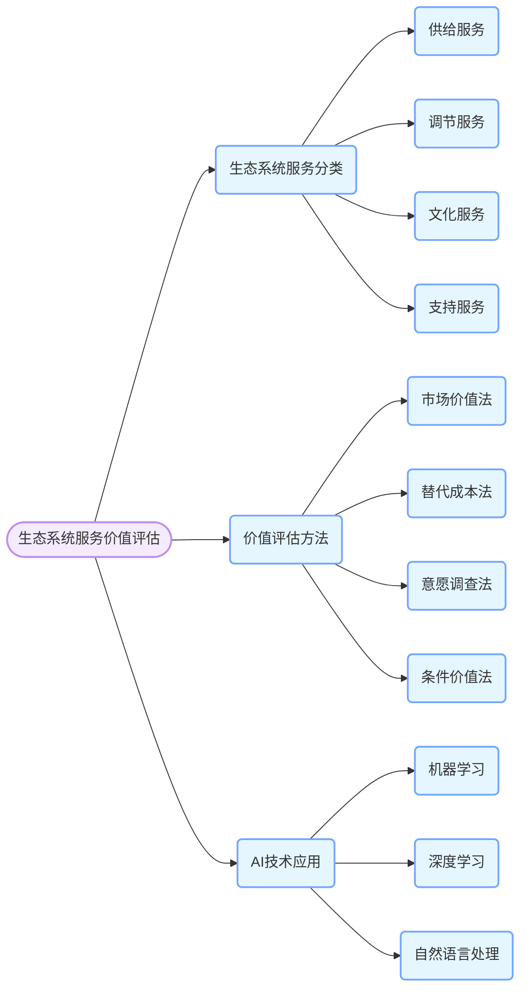

# AI辅助生态系统服务价值评估：从本地尺度到全球尺度

> 关键词：AI、生态系统服务价值评估、本地尺度、全球尺度、多尺度分析

> 摘要：本文聚焦于AI辅助生态系统服务价值评估从本地尺度到全球尺度的相关内容。首先介绍了生态系统服务价值评估的背景与意义，探讨了不同尺度下评估的目的和范围、预期读者等。详细阐述了生态系统服务价值评估的核心概念与联系，包括原理和架构，并通过Mermaid流程图呈现。深入讲解了核心算法原理，结合Python源代码进行说明，同时给出相关数学模型和公式并举例。通过项目实战，展示代码实际案例及详细解释。分析了该技术在不同场景的实际应用，推荐了相关学习资源、开发工具框架和论文著作。最后总结了未来发展趋势与挑战，提供常见问题解答和扩展阅读参考资料，旨在全面深入地为读者呈现AI辅助生态系统服务价值评估从本地到全球尺度的全貌。

## 1. 背景介绍 
### 1.1 目的和范围
生态系统服务价值评估对于理解生态系统的重要性以及合理利用和保护生态资源具有关键意义。在当今环境问题日益突出的背景下，准确评估生态系统服务价值能够为政策制定、资源管理和生态保护决策提供科学依据。从本地尺度到全球尺度的评估范围涵盖了从一个小区域的生态系统，如城市公园、乡村农田，到整个地球的生态系统，如全球森林、海洋生态系统等。其目的在于全面、系统地认识不同尺度下生态系统为人类提供的各种服务及其价值，以便制定更加科学有效的生态保护和可持续发展策略。

### 1.2 预期读者
本文的预期读者包括生态学家、环境科学家、地理信息系统（GIS）专业人员、政策制定者、资源管理者以及对生态系统服务价值评估和AI技术应用感兴趣的科研人员和学生。对于生态学家和环境科学家，本文提供了利用AI技术进行多尺度生态系统服务价值评估的新方法和思路；对于政策制定者和资源管理者，有助于他们更好地理解生态系统服务价值评估结果，从而制定合理的政策和管理措施；对于GIS专业人员和相关科研人员、学生，能够为他们在该领域的研究和实践提供技术支持和理论指导。

### 1.3 文档结构概述
本文首先介绍背景信息，包括目的、范围、预期读者和术语表。接着阐述核心概念与联系，通过文本示意图和Mermaid流程图呈现生态系统服务价值评估的原理和架构。然后详细讲解核心算法原理，结合Python源代码说明具体操作步骤，并给出相关数学模型和公式及举例。通过项目实战展示代码实际案例和详细解释。分析实际应用场景，推荐相关工具和资源，包括学习资源、开发工具框架和论文著作。最后总结未来发展趋势与挑战，提供常见问题解答和扩展阅读参考资料。

### 1.4 术语表
#### 1.4.1 核心术语定义
- **生态系统服务价值评估**：指对生态系统为人类提供的各种服务，如供给服务（食物、水等）、调节服务（气候调节、洪水调节等）、文化服务（旅游、美学等）和支持服务（土壤形成、养分循环等）的价值进行量化和评估的过程。
- **本地尺度**：通常指相对较小的地理区域，如一个城市、一个乡镇或一个特定的生态区域，其范围一般在几十到几百平方公里。
- **全球尺度**：指涵盖整个地球的生态系统范围，涉及全球的陆地、海洋、大气等各个方面。
- **AI（人工智能）**：是一门研究如何使计算机能够模拟人类智能的学科和技术，包括机器学习、深度学习、自然语言处理等多种技术手段。

#### 1.4.2 相关概念解释
- **多尺度分析**：在生态系统服务价值评估中，多尺度分析是指同时考虑不同尺度（如本地、区域、全球）下生态系统的特征和服务价值，以全面、系统地理解生态系统的功能和价值。不同尺度下生态系统的结构和功能存在差异，其提供的服务和价值也不同，多尺度分析能够综合考虑这些差异，提高评估的准确性和可靠性。
- **数据融合**：在生态系统服务价值评估中，需要整合来自不同数据源、不同类型的数据，如遥感数据、实地调查数据、统计数据等。数据融合就是将这些多源异构的数据进行处理和整合，以获取更全面、准确的信息，为评估提供更有力的数据支持。

#### 1.4.3 缩略词列表
- **GIS**：地理信息系统（Geographic Information System）
- **ML**：机器学习（Machine Learning）
- **DL**：深度学习（Deep Learning）
- **NLP**：自然语言处理（Natural Language Processing）

## 2. 核心概念与联系 
生态系统服务价值评估的核心概念主要包括生态系统服务的分类、价值评估方法以及AI技术在其中的应用。

### 生态系统服务分类
生态系统服务通常分为供给服务、调节服务、文化服务和支持服务四大类。供给服务是指生态系统为人类提供的各种物质产品，如食物、木材、水资源等；调节服务是指生态系统对环境的调节作用，如气候调节、洪水调节、水质净化等；文化服务是指生态系统为人类提供的精神和文化方面的服务，如旅游、美学、教育等；支持服务是指生态系统维持自身结构和功能的基础服务，如土壤形成、养分循环、生物多样性维持等。

### 价值评估方法
常见的生态系统服务价值评估方法包括市场价值法、替代成本法、意愿调查法、条件价值法等。市场价值法是通过市场价格来估算生态系统服务的价值，适用于有市场交易的产品和服务；替代成本法是通过估算替代生态系统服务所需的成本来评估其价值；意愿调查法是通过问卷调查等方式了解人们对生态系统服务的支付意愿或接受补偿意愿来评估其价值；条件价值法是一种基于人们对生态系统服务的偏好和支付意愿的评估方法。

### AI技术在生态系统服务价值评估中的应用
AI技术可以在数据处理、模型构建和预测等方面为生态系统服务价值评估提供支持。机器学习算法可以对大量的生态数据进行分析和挖掘，提取有价值的信息，帮助建立更准确的评估模型；深度学习算法可以处理复杂的图像和遥感数据，识别生态系统的特征和变化；自然语言处理技术可以对相关的文献和报告进行分析，获取有关生态系统服务的知识和信息。

### 核心概念架构的文本示意图
```plaintext
生态系统服务价值评估
|-- 生态系统服务分类
|   |-- 供给服务
|   |-- 调节服务
|   |-- 文化服务
|   |-- 支持服务
|-- 价值评估方法
|   |-- 市场价值法
|   |-- 替代成本法
|   |-- 意愿调查法
|   |-- 条件价值法
|-- AI技术应用
|   |-- 机器学习
|   |-- 深度学习
|   |-- 自然语言处理
```

### Mermaid流程图


## 3. 核心算法原理 & 具体操作步骤 
### 核心算法原理
在AI辅助生态系统服务价值评估中，机器学习算法中的随机森林算法是一种常用的方法。随机森林是一种集成学习算法，它通过构建多个决策树来进行预测和分类。每个决策树都是基于随机选择的样本和特征进行训练的，最后通过对多个决策树的结果进行综合来得到最终的预测结果。

随机森林算法的优点在于它能够处理高维数据，具有较好的抗过拟合能力，并且可以自动选择重要的特征。在生态系统服务价值评估中，随机森林算法可以用于建立评估模型，根据生态系统的各种特征（如土地利用类型、植被覆盖度、气候条件等）来预测生态系统服务的价值。

### 具体操作步骤
#### 步骤1：数据收集与预处理
收集与生态系统服务价值评估相关的数据，包括遥感数据、实地调查数据、统计数据等。对收集到的数据进行预处理，包括数据清洗、缺失值处理、数据标准化等操作，以提高数据的质量和可用性。

#### 步骤2：特征选择
从预处理后的数据中选择与生态系统服务价值相关的特征。可以使用随机森林算法的特征重要性评估功能，选择重要性较高的特征作为模型的输入。

#### 步骤3：模型训练
将选择的特征和对应的生态系统服务价值数据划分为训练集和测试集。使用训练集数据对随机森林模型进行训练，调整模型的参数（如决策树的数量、树的深度等），以提高模型的性能。

#### 步骤4：模型评估
使用测试集数据对训练好的模型进行评估，计算模型的评估指标（如均方误差、决定系数等），评估模型的准确性和可靠性。

#### 步骤5：预测与应用
使用训练好的模型对未知区域的生态系统服务价值进行预测，为生态保护和资源管理决策提供支持。

### Python源代码详细阐述
```python
import pandas as pd
from sklearn.ensemble import RandomForestRegressor
from sklearn.model_selection import train_test_split
from sklearn.metrics import mean_squared_error, r2_score

# 步骤1：数据收集与预处理
# 假设数据存储在CSV文件中
data = pd.read_csv('ecosystem_data.csv')
# 处理缺失值
data = data.dropna()
# 提取特征和目标变量
X = data.drop('ecosystem_value', axis=1)
y = data['ecosystem_value']

# 步骤2：特征选择
# 这里简单使用所有特征，实际应用中可根据特征重要性选择
# 后续可添加特征重要性评估代码

# 步骤3：模型训练
# 划分训练集和测试集
X_train, X_test, y_train, y_test = train_test_split(X, y, test_size=0.2, random_state=42)
# 创建随机森林回归模型
rf_model = RandomForestRegressor(n_estimators=100, random_state=42)
# 训练模型
rf_model.fit(X_train, y_train)

# 步骤4：模型评估
# 预测测试集数据
y_pred = rf_model.predict(X_test)
# 计算均方误差
mse = mean_squared_error(y_test, y_pred)
# 计算决定系数
r2 = r2_score(y_test, y_pred)
print(f"均方误差: {mse}")
print(f"决定系数: {r2}")

# 步骤5：预测与应用
# 假设要预测新的数据
new_data = pd.read_csv('new_ecosystem_data.csv')
new_predictions = rf_model.predict(new_data)
print(f"新数据的预测结果: {new_predictions}")
```

## 4. 数学模型和公式 & 详细讲解 & 举例说明 
### 随机森林算法的数学模型
随机森林算法是基于决策树的集成学习方法。假设我们有一个训练数据集 $D = \{(x_1, y_1), (x_2, y_2), \cdots, (x_n, y_n)\}$，其中 $x_i$ 是第 $i$ 个样本的特征向量，$y_i$ 是对应的目标值。

随机森林通过以下步骤构建多个决策树：
1. **自助采样**：从训练数据集 $D$ 中随机有放回地抽取 $n$ 个样本，组成一个新的训练子集 $D_b$（$b = 1, 2, \cdots, B$），其中 $B$ 是决策树的数量。
2. **特征选择**：在每个决策树的节点分裂时，随机选择 $m$ 个特征（$m \leq p$，$p$ 是特征的总数），从这 $m$ 个特征中选择最优的分裂特征和分裂点。
3. **决策树构建**：使用自助采样得到的训练子集 $D_b$ 和随机选择的特征，构建第 $b$ 个决策树 $T_b$。

对于回归问题，随机森林的预测结果是所有决策树预测结果的平均值：
$$\hat{y}(x) = \frac{1}{B} \sum_{b = 1}^{B} T_b(x)$$
其中，$\hat{y}(x)$ 是对输入样本 $x$ 的预测值，$T_b(x)$ 是第 $b$ 个决策树对输入样本 $x$ 的预测值。

### 均方误差和决定系数公式
#### 均方误差（Mean Squared Error，MSE）
均方误差是衡量预测值与真实值之间差异的常用指标，其计算公式为：
$$MSE = \frac{1}{n} \sum_{i = 1}^{n} (y_i - \hat{y}_i)^2$$
其中，$n$ 是样本的数量，$y_i$ 是第 $i$ 个样本的真实值，$\hat{y}_i$ 是第 $i$ 个样本的预测值。

#### 决定系数（Coefficient of Determination，$R^2$）
决定系数用于评估回归模型的拟合优度，其计算公式为：
$$R^2 = 1 - \frac{\sum_{i = 1}^{n} (y_i - \hat{y}_i)^2}{\sum_{i = 1}^{n} (y_i - \bar{y})^2}$$
其中，$\bar{y}$ 是真实值的平均值。$R^2$ 的取值范围是 $(-\infty, 1]$，$R^2$ 越接近 1，表示模型的拟合效果越好。

### 举例说明
假设我们有一个包含 5 个样本的数据集，真实值 $y = [10, 15, 20, 25, 30]$，预测值 $\hat{y} = [12, 14, 18, 26, 32]$。

#### 计算均方误差
首先计算每个样本的误差平方：
$$(10 - 12)^2 = 4$$
$$(15 - 14)^2 = 1$$
$$(20 - 18)^2 = 4$$
$$(25 - 26)^2 = 1$$
$$(30 - 32)^2 = 4$$
然后计算均方误差：
$$MSE = \frac{4 + 1 + 4 + 1 + 4}{5} = \frac{14}{5} = 2.8$$

#### 计算决定系数
先计算真实值的平均值：
$$\bar{y} = \frac{10 + 15 + 20 + 25 + 30}{5} = 20$$
再计算分子和分母：
分子：$\sum_{i = 1}^{5} (y_i - \hat{y}_i)^2 = 4 + 1 + 4 + 1 + 4 = 14$
分母：$\sum_{i = 1}^{5} (y_i - \bar{y})^2 = (10 - 20)^2 + (15 - 20)^2 + (20 - 20)^2 + (25 - 20)^2 + (30 - 20)^2 = 100 + 25 + 0 + 25 + 100 = 250$
最后计算决定系数：
$$R^2 = 1 - \frac{14}{250} = 1 - 0.056 = 0.944$$

## 5. 项目实战：代码实际案例和详细解释说明 
### 5.1  开发环境搭建
#### 操作系统
本项目可以在 Windows、Linux 或 macOS 操作系统上进行开发。建议使用 Linux 或 macOS 系统，因为它们对 Python 开发环境的支持更好。

#### Python 环境
安装 Python 3.7 或更高版本。可以从 Python 官方网站（https://www.python.org/downloads/） 下载并安装 Python。安装完成后，建议使用虚拟环境来管理项目的依赖，避免不同项目之间的依赖冲突。可以使用 `venv` 或 `conda` 来创建虚拟环境。

以下是使用 `venv` 创建虚拟环境的示例：
```bash
# 创建虚拟环境
python -m venv myenv
# 激活虚拟环境（Windows）
myenv\Scripts\activate
# 激活虚拟环境（Linux/macOS）
source myenv/bin/activate
```

#### 安装依赖库
在虚拟环境中安装项目所需的依赖库，包括 `pandas`、`scikit-learn` 等。可以使用 `pip` 来安装这些库：
```bash
pip install pandas scikit-learn
```

### 5.2  源代码详细实现和代码解读
```python
import pandas as pd
from sklearn.ensemble import RandomForestRegressor
from sklearn.model_selection import train_test_split
from sklearn.metrics import mean_squared_error, r2_score

# 步骤1：数据收集与预处理
# 假设数据存储在CSV文件中
data = pd.read_csv('ecosystem_data.csv')
# 处理缺失值
data = data.dropna()
# 提取特征和目标变量
X = data.drop('ecosystem_value', axis=1)
y = data['ecosystem_value']

# 步骤2：特征选择
# 这里简单使用所有特征，实际应用中可根据特征重要性选择
# 后续可添加特征重要性评估代码

# 步骤3：模型训练
# 划分训练集和测试集
X_train, X_test, y_train, y_test = train_test_split(X, y, test_size=0.2, random_state=42)
# 创建随机森林回归模型
rf_model = RandomForestRegressor(n_estimators=100, random_state=42)
# 训练模型
rf_model.fit(X_train, y_train)

# 步骤4：模型评估
# 预测测试集数据
y_pred = rf_model.predict(X_test)
# 计算均方误差
mse = mean_squared_error(y_test, y_pred)
# 计算决定系数
r2 = r2_score(y_test, y_pred)
print(f"均方误差: {mse}")
print(f"决定系数: {r2}")

# 步骤5：预测与应用
# 假设要预测新的数据
new_data = pd.read_csv('new_ecosystem_data.csv')
new_predictions = rf_model.predict(new_data)
print(f"新数据的预测结果: {new_predictions}")
```

#### 代码解读
1. **导入必要的库**：`pandas` 用于数据处理，`RandomForestRegressor` 用于创建随机森林回归模型，`train_test_split` 用于划分训练集和测试集，`mean_squared_error` 和 `r2_score` 用于评估模型的性能。
2. **数据收集与预处理**：使用 `pd.read_csv` 读取存储在 CSV 文件中的数据，使用 `dropna` 方法处理缺失值，然后提取特征和目标变量。
3. **特征选择**：这里简单使用所有特征，实际应用中可以根据随机森林算法的特征重要性评估功能选择重要的特征。
4. **模型训练**：使用 `train_test_split` 方法将数据划分为训练集和测试集，创建随机森林回归模型并使用训练集数据进行训练。
5. **模型评估**：使用训练好的模型对测试集数据进行预测，计算均方误差和决定系数来评估模型的性能。
6. **预测与应用**：读取新的数据文件，使用训练好的模型对新数据进行预测，并输出预测结果。

### 5.3  代码解读与分析
#### 优点
- **简单易用**：使用 Python 和 `scikit-learn` 库，代码结构清晰，易于理解和实现。
- **可扩展性**：可以根据实际需求对代码进行扩展，如添加更多的特征选择方法、调整模型参数等。
- **通用性**：随机森林算法具有较好的通用性，可以应用于不同类型的生态系统服务价值评估问题。

#### 缺点
- **数据依赖性**：模型的性能依赖于数据的质量和数量。如果数据存在偏差或缺失，可能会影响模型的准确性。
- **计算资源需求**：随机森林算法需要构建多个决策树，计算量较大，对计算资源有一定的要求。

#### 改进建议
- **数据增强**：可以通过数据合成、数据采样等方法增加数据的数量和多样性，提高模型的泛化能力。
- **超参数调优**：使用网格搜索、随机搜索等方法对随机森林模型的超参数进行调优，以提高模型的性能。
- **特征工程**：深入分析数据，提取更有价值的特征，或者对特征进行变换和组合，以提高模型的准确性。

## 6. 实际应用场景 
### 本地尺度应用场景
#### 城市生态系统管理
在城市中，生态系统服务价值评估可以帮助城市管理者了解城市绿地、水体等生态系统的价值，从而合理规划城市空间，提高城市生态环境质量。例如，通过评估城市公园的生态系统服务价值，可以确定公园的合理规模和布局，优化公园的功能和服务，提高居民的生活质量。

#### 农田生态系统保护
在农业领域，生态系统服务价值评估可以帮助农民和农业管理者了解农田生态系统的功能和价值，采取合理的农业生产措施，保护农田生态环境。例如，评估农田的土壤保持、水源涵养等服务价值，可以指导农民合理施肥、灌溉，减少农业面源污染，提高农田的可持续生产能力。

### 区域尺度应用场景
#### 流域生态系统管理
在流域尺度上，生态系统服务价值评估可以帮助流域管理者了解流域内生态系统的整体状况和价值，制定合理的流域管理策略。例如，评估流域内森林、湿地等生态系统的水源涵养、洪水调节等服务价值，可以指导流域内的水资源管理、土地利用规划和生态保护措施的实施，保障流域的生态安全和可持续发展。

#### 区域生态补偿
生态系统服务价值评估可以为区域生态补偿提供科学依据。通过评估不同地区生态系统服务的价值差异，可以确定生态补偿的标准和范围，实现区域间的生态公平和可持续发展。例如，对于生态功能重要但经济发展相对落后的地区，可以通过生态补偿机制，获得相应的经济补偿，促进其生态保护和经济发展的协调。

### 全球尺度应用场景
#### 全球气候变化应对
在全球尺度上，生态系统服务价值评估可以帮助人们了解全球生态系统对气候变化的响应和调节作用，为全球气候变化应对策略的制定提供支持。例如，评估全球森林、海洋等生态系统的碳汇功能和价值，可以指导国际社会制定减排目标和碳交易机制，减缓全球气候变化的影响。

#### 生物多样性保护
生态系统服务价值评估可以为全球生物多样性保护提供决策依据。通过评估不同生态系统的生物多样性服务价值，可以确定生物多样性保护的重点区域和优先行动，采取有效的保护措施，保护全球生物多样性。例如，评估热带雨林的生物多样性服务价值，可以推动国际社会加大对热带雨林的保护力度，防止生物多样性的丧失。

## 7. 工具和资源推荐
### 7.1 学习资源推荐
#### 7.1.1 书籍推荐
- 《生态系统服务与自然资本》：这本书系统地介绍了生态系统服务的概念、分类、评估方法和管理策略，是生态系统服务领域的经典著作。
- 《Python 机器学习》：全面介绍了 Python 在机器学习领域的应用，包括各种机器学习算法的原理、实现和应用案例，对于学习使用 Python 进行生态系统服务价值评估有很大的帮助。
- 《地理信息系统原理与应用》：介绍了地理信息系统的基本原理、技术和应用，对于理解和处理生态系统相关的空间数据有重要的参考价值。

#### 7.1.2 在线课程
- Coursera 上的“Data Science Specialization”：该课程涵盖了数据科学的各个方面，包括数据处理、机器学习、数据分析等，对于学习生态系统服务价值评估中的数据处理和建模有很大的帮助。
- edX 上的“Artificial Intelligence”：全面介绍了人工智能的基本概念、算法和应用，对于了解 AI 技术在生态系统服务价值评估中的应用有重要的指导作用。
- Udemy 上的“Geospatial Data Science with Python”：专门介绍了使用 Python 处理地理空间数据的方法和技术，对于处理生态系统服务价值评估中的空间数据有很大的帮助。

#### 7.1.3 技术博客和网站
- Medium：上面有很多关于生态系统服务、人工智能、数据科学等领域的技术博客和文章，可以及时了解最新的研究成果和应用案例。
- Towards Data Science：专注于数据科学和机器学习领域的技术博客，提供了很多实用的技术文章和代码示例，对于学习生态系统服务价值评估中的数据分析和建模有很大的帮助。
- GIS Stack Exchange：是一个地理信息系统领域的问答社区，可以在上面提问和交流关于地理空间数据处理和分析的问题。

### 7.2 开发工具框架推荐
#### 7.2.1 IDE和编辑器
- PyCharm：是一款专业的 Python 集成开发环境，具有代码编辑、调试、版本控制等功能，对于开发生态系统服务价值评估相关的 Python 代码非常方便。
- Jupyter Notebook：是一个交互式的开发环境，可以将代码、文本、图表等整合在一起，方便进行数据分析和模型开发，对于探索性数据分析和模型验证非常有用。
- Visual Studio Code：是一款轻量级的代码编辑器，支持多种编程语言和插件，具有丰富的扩展功能，对于快速开发和调试生态系统服务价值评估代码非常方便。

#### 7.2.2 调试和性能分析工具
- `pdb`：是 Python 内置的调试工具，可以在代码中设置断点，逐行调试代码，帮助定位和解决代码中的问题。
- `cProfile`：是 Python 内置的性能分析工具，可以分析代码的执行时间和函数调用关系，帮助优化代码的性能。
- `scikit-learn` 中的 `GridSearchCV` 和 `RandomizedSearchCV`：可以用于对机器学习模型的超参数进行调优，提高模型的性能。

#### 7.2.3 相关框架和库
- `pandas`：是一个强大的数据处理和分析库，提供了数据结构和数据操作的功能，对于处理生态系统服务价值评估中的数据非常方便。
- `scikit-learn`：是一个常用的机器学习库，提供了各种机器学习算法和工具，对于构建生态系统服务价值评估模型非常有用。
- `geopandas`：是一个基于 `pandas` 的地理空间数据处理库，提供了地理空间数据结构和操作的功能，对于处理生态系统服务价值评估中的空间数据非常方便。

### 7.3 相关论文著作推荐
#### 7.3.1 经典论文
- Costanza, R., et al. "The value of the world's ecosystem services and natural capital." Nature 387.6630 (1997): 253-260. 这篇论文首次对全球生态系统服务的价值进行了估算，开创了生态系统服务价值评估的先河。
- Daily, G. C., ed. Nature's Services: Societal Dependence on Natural Ecosystems. Island Press, 1997. 这本书系统地阐述了生态系统服务的概念、分类和价值，是生态系统服务领域的经典著作。

#### 7.3.2 最新研究成果
- IPBES. "Global assessment report on biodiversity and ecosystem services." (2019). 该报告是生物多样性和生态系统服务政府间科学政策平台（IPBES）发布的全球评估报告，全面总结了全球生物多样性和生态系统服务的现状、趋势和挑战。
- Li, X., et al. "Integrating remote sensing and machine learning for ecosystem service mapping and valuation: A review." Remote Sensing of Environment 245 (2020): 111874. 这篇论文综述了将遥感和机器学习技术应用于生态系统服务制图和评估的最新研究进展。

#### 7.3.3 应用案例分析
- Burkhard, B., et al. "Mapping ecosystem service supply, demand and budgets." Ecological Indicators 21 (2012): 17-29. 该论文介绍了一种基于地理信息系统的生态系统服务供给、需求和预算的制图方法，并通过实际案例进行了验证。
- Nelson, E., et al. "Ecosystem services in decision making: time to deliver." Frontiers in Ecology and the Environment 10.5 (2012): 254-262. 这篇论文探讨了如何将生态系统服务纳入决策过程，并通过实际案例分析了生态系统服务在决策中的应用效果。

## 8. 总结：未来发展趋势与挑战
### 未来发展趋势
#### 多源数据融合与集成
未来，生态系统服务价值评估将越来越多地融合多源数据，如遥感数据、实地调查数据、社会经济数据等。通过数据融合和集成，可以获取更全面、准确的生态系统信息，提高评估的准确性和可靠性。同时，随着物联网、传感器技术的发展，实时、动态的数据将为生态系统服务价值评估提供更多的支持。

#### AI技术的深度应用
AI技术将在生态系统服务价值评估中得到更深入的应用。除了机器学习算法，深度学习、强化学习等技术也将被应用于生态系统服务价值评估的各个环节，如数据处理、模型构建、预测和决策等。AI技术的发展将提高评估的效率和精度，为生态保护和资源管理提供更智能的决策支持。

#### 多尺度协同评估
未来的生态系统服务价值评估将更加注重多尺度协同。从本地尺度到全球尺度，不同尺度的生态系统相互关联、相互影响。通过多尺度协同评估，可以全面、系统地理解生态系统的功能和价值，制定更加科学合理的生态保护和可持续发展策略。

#### 跨学科融合
生态系统服务价值评估是一个跨学科的研究领域，涉及生态学、经济学、地理学、计算机科学等多个学科。未来，跨学科融合将更加深入，不同学科的专家将共同合作，解决生态系统服务价值评估中的复杂问题，推动该领域的发展。

### 挑战
#### 数据质量和共享问题
生态系统服务价值评估需要大量的数据支持，但目前数据质量参差不齐，存在数据缺失、数据不准确等问题。此外，数据共享机制不完善，不同部门和机构之间的数据难以共享，限制了生态系统服务价值评估的发展。

#### AI技术的可解释性
虽然AI技术在生态系统服务价值评估中取得了很好的效果，但AI模型往往是黑箱模型，其决策过程和结果难以解释。在生态保护和资源管理决策中，需要对评估结果进行解释和说明，因此AI技术的可解释性是一个亟待解决的问题。

#### 尺度转换问题
从本地尺度到全球尺度的生态系统服务价值评估涉及尺度转换问题。不同尺度下生态系统的结构、功能和服务价值存在差异，如何准确地进行尺度转换，将本地尺度的评估结果扩展到全球尺度，是一个具有挑战性的问题。

#### 社会认知和政策支持
生态系统服务价值评估的结果需要得到社会的广泛认知和政策的支持才能发挥作用。目前，社会对生态系统服务价值的认识还不够深入，相关政策和法规也不够完善，这在一定程度上限制了生态系统服务价值评估的应用和发展。

## 9. 附录：常见问题与解答
### 问题1：生态系统服务价值评估为什么需要AI技术？
生态系统服务价值评估涉及大量的数据处理和复杂的模型构建，传统的方法往往难以处理这些数据和模型。AI技术具有强大的数据处理和分析能力，可以对多源异构的数据进行挖掘和分析，提取有价值的信息。同时，AI技术可以构建更准确、更复杂的评估模型，提高评估的准确性和可靠性。

### 问题2：随机森林算法在生态系统服务价值评估中有哪些优势？
随机森林算法具有以下优势：
- **处理高维数据**：生态系统服务价值评估中通常涉及大量的特征，随机森林算法可以处理高维数据，并且能够自动选择重要的特征。
- **抗过拟合能力强**：随机森林通过构建多个决策树并综合它们的结果，具有较好的抗过拟合能力，能够提高模型的泛化能力。
- **可解释性相对较好**：随机森林算法可以输出特征的重要性，有助于理解模型的决策过程和生态系统服务价值的影响因素。

### 问题3：如何选择合适的生态系统服务价值评估方法？
选择合适的生态系统服务价值评估方法需要考虑以下因素：
- **数据可用性**：不同的评估方法对数据的要求不同，需要根据数据的可用性选择合适的方法。
- **评估目的**：评估目的不同，选择的评估方法也不同。例如，如果是为了比较不同生态系统的服务价值，可以选择市场价值法；如果是为了评估生态系统的非市场价值，可以选择意愿调查法等。
- **生态系统类型**：不同类型的生态系统具有不同的特征和服务，需要根据生态系统类型选择合适的评估方法。

### 问题4：在生态系统服务价值评估中，如何处理空间数据？
在生态系统服务价值评估中，空间数据的处理非常重要。可以使用地理信息系统（GIS）技术来处理空间数据，包括数据的采集、存储、分析和可视化等。同时，也可以使用一些专门的空间分析方法，如空间插值、空间统计分析等，来挖掘空间数据中的信息，提高评估的准确性。

### 问题5：如何提高生态系统服务价值评估结果的可信度？
提高生态系统服务价值评估结果的可信度可以从以下几个方面入手：
- **数据质量控制**：确保数据的准确性、完整性和可靠性，对数据进行严格的质量控制。
- **模型选择和验证**：选择合适的评估模型，并对模型进行充分的验证和评估，确保模型的准确性和可靠性。
- **多方法比较**：使用多种评估方法进行评估，并对不同方法的结果进行比较和分析，提高评估结果的可信度。
- **专家参与**：邀请相关领域的专家参与评估过程，对评估结果进行审核和把关，提高评估结果的科学性和可信度。

## 10. 扩展阅读 & 参考资料
### 扩展阅读
- Millennium Ecosystem Assessment. "Ecosystems and Human Well-being: Synthesis." Island Press, 2005.
- Boyd, J., and S. Banzhaf. "What are ecosystem services? The need for standardized environmental accounting units." Ecological Economics 63.2-3 (2007): 616-626.
- De Groot, R. S., et al. "Global estimates of the value of ecosystems and their services in monetary units." Ecosystem Services 1 (2012): 50-61.

### 参考资料
- 相关数据来源：可从政府部门网站、科研机构数据库、国际组织网站等获取生态系统相关的数据，如土地利用数据、气象数据、生物多样性数据等。
- 代码参考：`scikit-learn` 官方文档（https://scikit-learn.org/stable/） 提供了随机森林算法等机器学习算法的详细文档和代码示例；`pandas` 官方文档（https://pandas.pydata.org/） 提供了数据处理和分析的相关文档和代码示例。