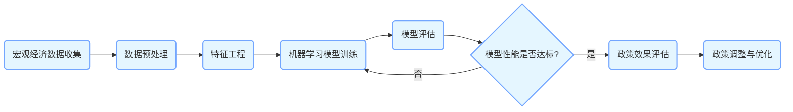

# AI辅助的宏观经济政策效果评估

> 关键词：AI、宏观经济政策、效果评估、数据挖掘、机器学习、经济模型、政策优化

> 摘要：本文聚焦于AI辅助的宏观经济政策效果评估这一前沿领域。随着宏观经济环境的日益复杂和数据量的爆炸式增长，传统的政策效果评估方法面临诸多挑战。AI技术凭借其强大的数据处理和分析能力，为宏观经济政策效果评估带来了新的思路和方法。文章详细阐述了相关核心概念、算法原理、数学模型，通过项目实战展示了具体实现过程，并探讨了其实际应用场景、推荐了相关工具和资源，最后对未来发展趋势与挑战进行了总结，旨在为该领域的研究和实践提供全面且深入的参考。

## 1. 背景介绍 
### 1.1 目的和范围
宏观经济政策的制定和实施对于国家经济的稳定和发展至关重要。准确评估宏观经济政策的效果，能够帮助政策制定者及时调整政策方向，提高政策的针对性和有效性。然而，传统的政策效果评估方法往往难以处理海量、复杂且动态变化的经济数据。本研究的目的在于探索如何利用AI技术辅助宏观经济政策效果评估，提高评估的准确性和效率。研究范围涵盖了从宏观经济数据的收集、处理，到AI算法的选择、应用，再到政策效果评估指标的构建和分析等多个环节。

### 1.2 预期读者
本文预期读者包括经济领域的政策制定者、研究人员，计算机科学领域的AI开发者、数据科学家，以及对宏观经济政策和AI技术融合应用感兴趣的各界人士。通过阅读本文，读者能够深入了解AI在宏观经济政策效果评估中的应用原理、方法和实践案例，为相关领域的研究和实践提供参考。

### 1.3 文档结构概述
本文共分为十个部分。第一部分介绍了研究的背景、目的、预期读者和文档结构；第二部分阐述了AI辅助宏观经济政策效果评估的核心概念及其相互联系，并给出了相应的文本示意图和Mermaid流程图；第三部分详细讲解了核心算法原理，并使用Python源代码进行了具体阐述；第四部分介绍了相关的数学模型和公式，并进行了详细讲解和举例说明；第五部分通过项目实战展示了代码的实际案例，并对代码进行了详细解释和分析；第六部分探讨了AI辅助宏观经济政策效果评估的实际应用场景；第七部分推荐了相关的学习资源、开发工具框架和论文著作；第八部分总结了未来发展趋势与挑战；第九部分为附录，解答了常见问题；第十部分提供了扩展阅读和参考资料。

### 1.4 术语表
#### 1.4.1 核心术语定义
- **宏观经济政策**：政府为了实现宏观经济目标，如经济增长、充分就业、物价稳定和国际收支平衡等，而采取的一系列政策措施，包括财政政策、货币政策、产业政策等。
- **政策效果评估**：对宏观经济政策实施后所产生的经济、社会等方面的影响进行评价和分析，以判断政策的有效性和合理性。
- **AI（人工智能）**：研究、开发用于模拟、延伸和扩展人的智能的理论、方法、技术及应用系统的一门新的技术科学。
- **机器学习**：一门多领域交叉学科，涉及概率论、统计学、逼近论、凸分析、算法复杂度理论等多门学科。它专门研究计算机怎样模拟或实现人类的学习行为，以获取新的知识或技能，重新组织已有的知识结构使之不断改善自身的性能。
- **数据挖掘**：从大量的、不完全的、有噪声的、模糊的、随机的数据中，提取隐含在其中的、人们事先不知道的、但又是潜在有用的信息和知识的过程。

#### 1.4.2 相关概念解释
- **经济数据**：反映宏观经济运行状况的各种数据，如GDP、通货膨胀率、失业率、利率等。这些数据是宏观经济政策效果评估的基础。
- **特征工程**：在机器学习中，将原始数据转换为更适合模型训练的特征的过程。在宏观经济政策效果评估中，特征工程包括对经济数据的清洗、转换、选择等操作。
- **模型训练**：使用训练数据对机器学习模型进行参数调整的过程，以使模型能够学习到数据中的规律和模式。
- **模型评估**：使用测试数据对训练好的模型进行评估，以衡量模型的性能和准确性。

#### 1.4.3 缩略词列表
- **GDP**：国内生产总值（Gross Domestic Product）
- **AI**：人工智能（Artificial Intelligence）
- **ML**：机器学习（Machine Learning）
- **DM**：数据挖掘（Data Mining）

## 2. 核心概念与联系 

### 核心概念原理
AI辅助的宏观经济政策效果评估主要基于以下几个核心概念：

#### 数据驱动的决策
宏观经济数据包含了大量关于经济运行的信息。通过收集、整理和分析这些数据，可以发现经济运行的规律和趋势，为政策制定和评估提供依据。AI技术能够处理海量、复杂的经济数据，挖掘其中的潜在信息，从而实现数据驱动的决策。

#### 机器学习模型
机器学习模型是AI辅助宏观经济政策效果评估的核心工具。常用的机器学习模型包括线性回归、决策树、随机森林、支持向量机、神经网络等。这些模型可以根据历史经济数据和政策信息，学习到政策与经济指标之间的关系，从而对政策效果进行预测和评估。

#### 特征工程
特征工程是提高机器学习模型性能的关键步骤。在宏观经济政策效果评估中，需要从大量的经济数据中选择和提取与政策效果相关的特征。这些特征可以是直接的经济指标，也可以是经过变换和组合得到的衍生特征。

#### 模型评估与优化
为了确保机器学习模型的准确性和可靠性，需要对模型进行评估和优化。常用的模型评估指标包括均方误差、平均绝对误差、决定系数等。通过不断调整模型的参数和结构，可以提高模型的性能，使其更好地适应宏观经济政策效果评估的需求。

### 架构的文本示意图
```plaintext
宏观经济数据收集 --> 数据预处理（清洗、转换） --> 特征工程（特征选择、提取） --> 机器学习模型训练（选择合适模型） --> 模型评估（使用测试数据） --> 政策效果评估（根据模型预测结果） --> 政策调整与优化
```

### Mermaid流程图


## 3. 核心算法原理 & 具体操作步骤 

### 线性回归算法原理
线性回归是一种简单而常用的机器学习算法，用于建立自变量和因变量之间的线性关系。在宏观经济政策效果评估中，可以使用线性回归模型来预测政策对经济指标的影响。

线性回归模型的基本形式为：
$$y = \beta_0 + \beta_1x_1 + \beta_2x_2 + \cdots + \beta_nx_n + \epsilon$$
其中，$y$ 是因变量（如GDP增长率），$x_1, x_2, \cdots, x_n$ 是自变量（如财政支出、货币政策利率等），$\beta_0, \beta_1, \cdots, \beta_n$ 是模型的参数，$\epsilon$ 是误差项。

### 具体操作步骤

#### 1. 数据收集
收集与宏观经济政策和经济指标相关的数据，如历史GDP数据、财政政策数据、货币政策数据等。

#### 2. 数据预处理
对收集到的数据进行清洗、转换和归一化处理，以确保数据的质量和一致性。

#### 3. 特征选择
从预处理后的数据中选择与政策效果相关的特征。

#### 4. 模型训练
使用训练数据对线性回归模型进行训练，估计模型的参数。

#### 5. 模型评估
使用测试数据对训练好的模型进行评估，计算模型的评估指标。

#### 6. 政策效果评估
根据训练好的模型，预测政策对经济指标的影响，评估政策的效果。

### Python源代码实现
```python
import numpy as np
from sklearn.linear_model import LinearRegression
from sklearn.model_selection import train_test_split
from sklearn.metrics import mean_squared_error

# 生成示例数据
np.random.seed(0)
X = np.random.rand(100, 3)  # 自变量
y = 2 * X[:, 0] + 3 * X[:, 1] - 1 * X[:, 2] + np.random.randn(100)  # 因变量

# 划分训练集和测试集
X_train, X_test, y_train, y_test = train_test_split(X, y, test_size=0.2, random_state=42)

# 创建线性回归模型
model = LinearRegression()

# 模型训练
model.fit(X_train, y_train)

# 模型预测
y_pred = model.predict(X_test)

# 模型评估
mse = mean_squared_error(y_test, y_pred)
print(f"均方误差: {mse}")

# 输出模型参数
print(f"截距: {model.intercept_}")
print(f"系数: {model.coef_}")
```

## 4. 数学模型和公式 & 详细讲解 & 举例说明 

### 线性回归模型的数学原理
线性回归模型的目标是找到一组参数 $\beta_0, \beta_1, \cdots, \beta_n$，使得预测值 $\hat{y}$ 与真实值 $y$ 之间的误差最小。常用的误差度量方法是均方误差（MSE）：
$$MSE = \frac{1}{m} \sum_{i=1}^{m} (y_i - \hat{y}_i)^2$$
其中，$m$ 是样本数量，$y_i$ 是第 $i$ 个样本的真实值，$\hat{y}_i$ 是第 $i$ 个样本的预测值。

为了最小化均方误差，可以使用最小二乘法。最小二乘法的目标是求解以下正规方程：
$$(X^T X) \beta = X^T y$$
其中，$X$ 是自变量矩阵，$y$ 是因变量向量，$\beta$ 是模型的参数向量。

### 详细讲解
最小二乘法的原理是通过对均方误差函数求偏导数，并令偏导数等于零，得到正规方程。求解正规方程可以得到模型的最优参数。

在实际应用中，当自变量矩阵 $X$ 的行数远大于列数时，正规方程的求解通常是可行的。但当自变量矩阵 $X$ 的列数较多时，求解正规方程的计算复杂度会很高。此时，可以使用梯度下降等迭代算法来求解模型的参数。

### 举例说明
假设我们有以下一组数据：

| 财政支出（$x_1$） | 货币政策利率（$x_2$） | GDP增长率（$y$） |
|---|---|---|
| 100 | 0.05 | 0.03 |
| 120 | 0.06 | 0.04 |
| 150 | 0.07 | 0.05 |
| 180 | 0.08 | 0.06 |

我们可以使用线性回归模型来预测GDP增长率与财政支出和货币政策利率之间的关系。

首先，将数据表示为矩阵形式：
$$X = \begin{bmatrix} 1 & 100 & 0.05 \\ 1 & 120 & 0.06 \\ 1 & 150 & 0.07 \\ 1 & 180 & 0.08 \end{bmatrix}$$
$$y = \begin{bmatrix} 0.03 \\ 0.04 \\ 0.05 \\ 0.06 \end{bmatrix}$$

然后，求解正规方程 $(X^T X) \beta = X^T y$，得到模型的参数 $\beta$。

最后，根据得到的参数 $\beta$，可以对新的财政支出和货币政策利率数据进行预测。

## 5. 项目实战：代码实际案例和详细解释说明 

### 5.1  开发环境搭建
#### 操作系统
本项目可以在Windows、Linux或macOS等主流操作系统上进行开发。

#### Python环境
建议使用Python 3.7及以上版本。可以通过Anaconda或Python官方网站下载和安装Python环境。

#### 依赖库安装
本项目需要使用以下Python库：
- `numpy`：用于数值计算。
- `pandas`：用于数据处理和分析。
- `scikit-learn`：用于机器学习模型的实现和评估。
- `matplotlib`：用于数据可视化。

可以使用以下命令安装这些库：
```sh
pip install numpy pandas scikit-learn matplotlib
```

### 5.2  源代码详细实现和代码解读
```python
import numpy as np
import pandas as pd
from sklearn.linear_model import LinearRegression
from sklearn.model_selection import train_test_split
from sklearn.metrics import mean_squared_error
import matplotlib.pyplot as plt

# 数据加载
data = pd.read_csv('macroeconomic_data.csv')

# 数据预处理
# 处理缺失值
data = data.dropna()

# 特征选择
X = data[['fiscal_expenditure', 'monetary_policy_rate']]  # 自变量
y = data['gdp_growth_rate']  # 因变量

# 划分训练集和测试集
X_train, X_test, y_train, y_test = train_test_split(X, y, test_size=0.2, random_state=42)

# 创建线性回归模型
model = LinearRegression()

# 模型训练
model.fit(X_train, y_train)

# 模型预测
y_pred = model.predict(X_test)

# 模型评估
mse = mean_squared_error(y_test, y_pred)
print(f"均方误差: {mse}")

# 输出模型参数
print(f"截距: {model.intercept_}")
print(f"系数: {model.coef_}")

# 数据可视化
plt.scatter(y_test, y_pred)
plt.xlabel('真实值')
plt.ylabel('预测值')
plt.title('真实值与预测值的散点图')
plt.show()
```

### 5.3  代码解读与分析
1. **数据加载**：使用 `pandas` 库的 `read_csv` 函数从CSV文件中加载宏观经济数据。
2. **数据预处理**：使用 `dropna` 函数处理数据中的缺失值。
3. **特征选择**：选择财政支出和货币政策利率作为自变量，GDP增长率作为因变量。
4. **划分训练集和测试集**：使用 `train_test_split` 函数将数据划分为训练集和测试集，测试集占比为20%。
5. **模型训练**：使用 `LinearRegression` 类创建线性回归模型，并使用训练数据对模型进行训练。
6. **模型预测**：使用训练好的模型对测试数据进行预测。
7. **模型评估**：使用 `mean_squared_error` 函数计算模型的均方误差，评估模型的性能。
8. **输出模型参数**：输出模型的截距和系数。
9. **数据可视化**：使用 `matplotlib` 库绘制真实值与预测值的散点图，直观展示模型的预测效果。

## 6. 实际应用场景 

### 政策制定阶段
在政策制定阶段，AI辅助的宏观经济政策效果评估可以帮助政策制定者预测不同政策方案对经济的影响，从而选择最优的政策方案。例如，通过建立机器学习模型，分析不同财政支出规模和货币政策利率对GDP增长率、失业率等经济指标的影响，为政策制定提供科学依据。

### 政策实施阶段
在政策实施阶段，AI技术可以实时监测政策的实施效果，及时发现政策执行过程中出现的问题。例如，通过对经济数据的实时分析，判断政策是否达到了预期的效果，是否需要对政策进行调整。

### 政策评估阶段
在政策评估阶段，AI辅助的宏观经济政策效果评估可以对政策的长期效果进行全面、客观的评价。通过对历史数据的分析和挖掘，评估政策对经济增长、就业、物价稳定等方面的影响，总结政策实施的经验教训，为未来的政策制定提供参考。

### 经济预测与预警
AI技术可以利用宏观经济数据和机器学习模型，对未来的经济走势进行预测和预警。例如，预测GDP增长率、通货膨胀率、失业率等经济指标的变化趋势，提前发现经济运行中的潜在风险，为政策制定者提供决策支持。

## 7. 工具和资源推荐
### 7.1 学习资源推荐
#### 7.1.1 书籍推荐
- 《Python机器学习》：本书详细介绍了Python在机器学习领域的应用，包括数据预处理、特征工程、模型选择和评估等内容，适合初学者入门。
- 《计量经济学》：介绍了计量经济学的基本理论和方法，对于理解宏观经济数据的分析和建模具有重要的指导意义。
- 《人工智能：一种现代的方法》：全面介绍了人工智能的基本概念、算法和应用，是人工智能领域的经典教材。

#### 7.1.2 在线课程
- Coursera上的“机器学习”课程：由斯坦福大学的Andrew Ng教授授课，是机器学习领域的经典课程，内容涵盖了机器学习的基本概念、算法和应用。
- edX上的“数据科学微硕士”课程：提供了全面的数据科学知识体系，包括数据预处理、数据分析、机器学习、深度学习等内容。
- 中国大学MOOC上的“宏观经济学”课程：由国内知名高校的教授授课，系统介绍了宏观经济学的基本理论和政策。

#### 7.1.3 技术博客和网站
- Kaggle：全球最大的数据科学竞赛平台，提供了丰富的数据集、代码示例和讨论社区，对于学习和实践数据科学和机器学习具有很大的帮助。
- Medium：一个开放的写作平台，有很多数据科学和人工智能领域的专家分享他们的经验和见解。
- 国家统计局网站：提供了大量的宏观经济数据和统计信息，是研究宏观经济政策的重要数据来源。

### 7.2 开发工具框架推荐
#### 7.2.1 IDE和编辑器
- PyCharm：一款专业的Python集成开发环境，提供了丰富的代码编辑、调试、版本控制等功能，适合Python项目的开发。
- Jupyter Notebook：一种交互式的开发环境，支持Python、R等多种编程语言，方便进行数据探索、模型实验和结果展示。
- Visual Studio Code：一款轻量级的代码编辑器，支持多种编程语言和插件扩展，具有强大的代码编辑和调试功能。

#### 7.2.2 调试和性能分析工具
- `pdb`：Python自带的调试工具，可以帮助开发者定位和解决代码中的问题。
- `cProfile`：Python的性能分析工具，可以分析代码的运行时间和函数调用次数，帮助开发者优化代码性能。
- `scikit-learn` 中的 `GridSearchCV`：用于模型参数调优的工具，可以通过网格搜索的方式找到最优的模型参数。

#### 7.2.3 相关框架和库
- `numpy`：用于数值计算的Python库，提供了高效的数组操作和数学函数。
- `pandas`：用于数据处理和分析的Python库，提供了丰富的数据结构和数据处理方法。
- `scikit-learn`：用于机器学习的Python库，提供了多种机器学习算法和工具，方便进行模型训练、评估和选择。
- `tensorflow` 和 `pytorch`：深度学习框架，用于构建和训练深度学习模型，适用于处理复杂的宏观经济数据和问题。

### 7.3 相关论文著作推荐
#### 7.3.1 经典论文
- Sims, C. A. (1980). Macroeconomics and reality. Econometrica: Journal of the Econometric Society, 1-48. 该论文提出了向量自回归（VAR）模型，为宏观经济分析提供了重要的方法和工具。
- Lucas, R. E. (1976). Econometric policy evaluation: A critique. Carnegie-Rochester conference series on public policy, 1, 19-46. 该论文提出了“卢卡斯批判”，对传统的宏观经济政策评估方法提出了挑战。

#### 7.3.2 最新研究成果
- 关注《American Economic Review》、《Journal of Political Economy》、《Econometrica》等顶级经济学期刊，以及《Journal of Artificial Intelligence Research》、《Artificial Intelligence》等人工智能领域的期刊，了解最新的研究成果。

#### 7.3.3 应用案例分析
- 国际货币基金组织（IMF）、世界银行等国际组织发布的工作报告和研究报告，包含了大量的宏观经济政策分析和应用案例。
- 各国政府部门发布的经济政策评估报告，提供了实际的政策实施效果和经验教训。

## 8. 总结：未来发展趋势与挑战
### 未来发展趋势
#### 多学科融合
AI辅助的宏观经济政策效果评估将越来越多地融合经济学、计算机科学、数学、统计学等多个学科的知识和方法。通过跨学科的研究和合作，可以更好地解决宏观经济政策评估中的复杂问题，提高评估的准确性和可靠性。

#### 深度学习的应用
深度学习作为AI领域的前沿技术，具有强大的特征提取和模式识别能力。未来，深度学习模型将在宏观经济政策效果评估中得到更广泛的应用，如使用循环神经网络（RNN）、长短期记忆网络（LSTM）等模型处理时间序列数据，提高对经济趋势的预测能力。

#### 实时监测与动态评估
随着信息技术的发展，宏观经济数据的获取和处理速度将不断提高。未来，AI辅助的宏观经济政策效果评估将实现实时监测和动态评估，及时反映政策的实施效果和经济形势的变化，为政策调整提供更及时、准确的决策支持。

#### 可视化与交互性
为了更好地向政策制定者和公众展示宏观经济政策效果评估的结果，未来的评估系统将更加注重可视化和交互性。通过直观的图表、图形和动画等形式，将复杂的经济数据和评估结果以易于理解的方式呈现出来，提高决策的透明度和参与度。

### 挑战
#### 数据质量与隐私保护
宏观经济数据的质量和隐私保护是AI辅助宏观经济政策效果评估面临的重要挑战。数据的准确性、完整性和一致性直接影响模型的性能和评估结果的可靠性。同时，在数据收集、处理和使用过程中，需要严格遵守相关法律法规，保护数据的隐私和安全。

#### 模型解释性
机器学习模型，尤其是深度学习模型，往往具有较高的复杂度和黑盒性，难以解释模型的决策过程和结果。在宏观经济政策效果评估中，政策制定者需要了解模型的预测依据和影响因素，以便做出合理的决策。因此，提高模型的解释性是未来需要解决的重要问题。

#### 不确定性与风险
宏观经济系统具有高度的不确定性和复杂性，政策效果受到多种因素的影响。AI模型虽然可以对政策效果进行预测和评估，但无法完全消除不确定性和风险。如何在不确定性和风险的情况下，合理运用AI技术进行政策决策，是未来面临的挑战之一。

#### 技术人才短缺
AI辅助的宏观经济政策效果评估需要既懂AI技术又懂宏观经济学的复合型人才。目前，这类人才相对短缺，限制了该领域的发展。因此，培养和吸引更多的技术人才是推动该领域发展的关键。

## 9. 附录：常见问题与解答
### 1. AI技术在宏观经济政策效果评估中的优势是什么？
AI技术具有强大的数据处理和分析能力，能够处理海量、复杂的宏观经济数据，挖掘其中的潜在信息。通过机器学习模型，可以学习到政策与经济指标之间的关系，对政策效果进行预测和评估，提高评估的准确性和效率。此外，AI技术还可以实现实时监测和动态评估，及时反映政策的实施效果和经济形势的变化。

### 2. 如何选择合适的机器学习模型进行宏观经济政策效果评估？
选择合适的机器学习模型需要考虑多个因素，如数据的特点、问题的类型、模型的复杂度和可解释性等。对于线性关系较强的问题，可以选择线性回归模型；对于非线性关系较强的问题，可以选择决策树、随机森林、支持向量机等模型；对于处理时间序列数据，可以选择循环神经网络（RNN）、长短期记忆网络（LSTM）等模型。同时，还需要通过交叉验证等方法对不同的模型进行评估和比较，选择性能最优的模型。

### 3. 如何保证AI辅助宏观经济政策效果评估的结果可靠？
为了保证评估结果的可靠性，需要从多个方面入手。首先，要确保数据的质量，包括数据的准确性、完整性和一致性。其次，要选择合适的机器学习模型，并进行充分的模型训练和评估。可以使用交叉验证、留一法等方法对模型进行评估，选择性能最优的模型。此外，还需要对模型进行解释和验证，确保模型的决策过程和结果是合理的。最后，要结合专家的经验和判断，对评估结果进行综合分析和判断。

### 4. AI技术在宏观经济政策效果评估中存在哪些局限性？
AI技术在宏观经济政策效果评估中存在一些局限性。首先，AI模型的性能受到数据质量和数量的影响。如果数据存在偏差、缺失或噪声，可能会导致模型的性能下降。其次，AI模型往往具有较高的复杂度和黑盒性，难以解释模型的决策过程和结果。在宏观经济政策效果评估中，政策制定者需要了解模型的预测依据和影响因素，以便做出合理的决策。此外，宏观经济系统具有高度的不确定性和复杂性，政策效果受到多种因素的影响。AI模型虽然可以对政策效果进行预测和评估，但无法完全消除不确定性和风险。

## 10. 扩展阅读 & 参考资料
### 扩展阅读
- 《大数据时代：生活、工作与思维的大变革》：介绍了大数据时代的特点和影响，对于理解宏观经济数据的价值和应用具有重要的启示作用。
- 《智能时代：大数据与智能革命重新定义未来》：探讨了人工智能和大数据技术对未来社会的影响，包括在经济、医疗、教育等领域的应用。
- 《思考，快与慢》：介绍了人类思维的两种模式——快思考和慢思考，对于理解政策制定者的决策过程和行为具有重要的参考价值。

### 参考资料
- 国家统计局官方网站：https://www.stats.gov.cn/
- 国际货币基金组织（IMF）官方网站：https://www.imf.org/
- 世界银行官方网站：https://www.worldbank.org/
- Kaggle官方网站：https://www.kaggle.com/
- Medium官方网站：https://medium.com/