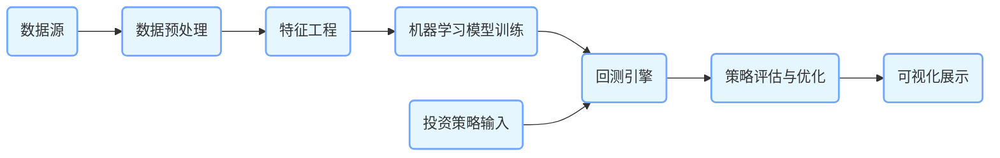

# AI辅助的投资组合回测平台

> 关键词：AI、投资组合、回测平台、量化投资、机器学习、数据分析、金融科技

> 摘要：本文聚焦于AI辅助的投资组合回测平台，旨在深入探讨该平台的核心概念、算法原理、数学模型以及实际应用。随着金融市场的日益复杂和数据量的不断增长，传统的投资组合回测方法已难以满足需求，AI技术的融入为回测平台带来了新的活力和能力。通过对AI辅助的投资组合回测平台的全面分析，我们将揭示其如何利用先进的技术手段提高回测的准确性和效率，为投资者提供更科学的决策依据，同时也探讨其在实际应用中的场景、面临的挑战以及未来的发展趋势。

## 1. 背景介绍 
### 1.1 目的和范围
在当今金融市场中，投资者面临着众多的投资选择和复杂的市场环境。投资组合的构建和优化是投资者实现资产增值和风险控制的重要手段。而投资组合回测则是评估投资策略有效性的关键环节。传统的回测方法往往基于简单的统计分析和历史数据，难以充分考虑市场的复杂性和不确定性。AI辅助的投资组合回测平台的目的在于利用人工智能技术，如机器学习、深度学习等，对投资组合进行更精准、全面的回测。本平台的范围涵盖了多种金融资产，包括股票、债券、基金等，并且支持多种投资策略的回测，如趋势跟踪、均值回归、多因子模型等。

### 1.2 预期读者
本文的预期读者主要包括金融从业者，如投资经理、交易员、量化分析师等，他们希望借助先进的技术手段提升投资决策的质量和效率；计算机专业人士，如数据科学家、人工智能工程师等，对将AI技术应用于金融领域感兴趣；以及对量化投资和AI技术有一定了解的投资者，希望通过学习和使用相关平台更好地管理自己的投资组合。

### 1.3 文档结构概述
本文将按照以下结构进行阐述：首先介绍AI辅助的投资组合回测平台的核心概念与联系，包括相关原理和架构；接着详细讲解核心算法原理及具体操作步骤，通过Python源代码进行说明；然后介绍数学模型和公式，并举例说明；再通过项目实战展示代码实际案例和详细解释；之后探讨该平台的实际应用场景；推荐相关的工具和资源；最后总结未来发展趋势与挑战，并提供常见问题与解答以及扩展阅读和参考资料。

### 1.4 术语表
#### 1.4.1 核心术语定义
- **投资组合**：由多种金融资产构成的集合，投资者通过合理配置不同资产来实现投资目标。
- **回测**：利用历史数据对投资策略进行模拟测试，以评估策略的有效性和性能。
- **AI（人工智能）**：研究如何使计算机模拟人类智能的技术，包括机器学习、深度学习等领域。
- **机器学习**：让计算机通过数据学习模式和规律，从而进行预测和决策的技术。
- **多因子模型**：一种基于多个因素来解释资产收益率的模型，用于投资组合的构建和分析。

#### 1.4.2 相关概念解释
- **量化投资**：利用数学模型和计算机技术进行投资决策的方法，通过对大量数据的分析来寻找投资机会。
- **风险控制**：在投资过程中采取措施降低投资风险的行为，如分散投资、止损等。
- **收益率**：投资获得的收益与初始投资的比率，是衡量投资绩效的重要指标。

#### 1.4.3 缩略词列表
- **AI**：Artificial Intelligence（人工智能）
- **ML**：Machine Learning（机器学习）
- **DL**：Deep Learning（深度学习）
- **MSE**：Mean Squared Error（均方误差）
- **RMSE**：Root Mean Squared Error（均方根误差）

## 2. 核心概念与联系 

### 核心概念原理
AI辅助的投资组合回测平台主要基于以下几个核心概念：
- **数据驱动**：平台依赖大量的历史金融数据，包括资产价格、交易量、宏观经济数据等。通过对这些数据的收集、清洗和分析，为回测提供基础。
- **机器学习模型**：利用机器学习算法，如线性回归、决策树、神经网络等，对历史数据进行建模和预测。这些模型可以帮助投资者发现市场规律和投资机会，优化投资组合。
- **回测引擎**：回测引擎是平台的核心组件，它根据投资者设定的投资策略和参数，对历史数据进行模拟交易，计算投资组合的收益率、风险等指标，评估策略的有效性。

### 架构示意图


### 各部分联系说明
- 数据源提供了平台所需的各种金融数据，这些数据经过数据预处理，如去除缺失值、异常值等，得到干净的数据。
- 特征工程从预处理后的数据中提取有价值的特征，为机器学习模型训练提供输入。
- 机器学习模型通过对历史数据的学习，建立预测模型，预测资产价格或其他相关指标。
- 回测引擎根据投资策略输入和机器学习模型的预测结果，对历史数据进行模拟交易，计算投资组合的绩效指标。
- 策略评估与优化模块根据回测结果对投资策略进行评估和优化，不断提高策略的有效性。
- 最后，可视化展示模块将回测结果以直观的图表和报表形式呈现给用户，方便用户进行分析和决策。

## 3. 核心算法原理 & 具体操作步骤 

### 线性回归算法原理
线性回归是一种简单而常用的机器学习算法，用于建立自变量和因变量之间的线性关系。其数学模型可以表示为：
$$y = \theta_0 + \theta_1x_1 + \theta_2x_2 + \cdots + \theta_nx_n + \epsilon$$
其中，$y$ 是因变量，$x_1, x_2, \cdots, x_n$ 是自变量，$\theta_0, \theta_1, \cdots, \theta_n$ 是模型的参数，$\epsilon$ 是误差项。

线性回归的目标是找到一组最优的参数 $\theta$，使得预测值与真实值之间的误差最小。通常使用最小二乘法来求解参数，即最小化误差的平方和：
$$J(\theta) = \frac{1}{2m}\sum_{i=1}^{m}(h_{\theta}(x^{(i)}) - y^{(i)})^2$$
其中，$m$ 是样本数量，$h_{\theta}(x^{(i)})$ 是第 $i$ 个样本的预测值，$y^{(i)}$ 是第 $i$ 个样本的真实值。

### Python代码实现线性回归
```python
import numpy as np
from sklearn.linear_model import LinearRegression
from sklearn.metrics import mean_squared_error

# 生成示例数据
np.random.seed(0)
X = np.random.rand(100, 1)
y = 2 * X + 1 + 0.5 * np.random.randn(100, 1)

# 创建线性回归模型
model = LinearRegression()

# 训练模型
model.fit(X, y)

# 进行预测
y_pred = model.predict(X)

# 计算均方误差
mse = mean_squared_error(y, y_pred)
print(f"均方误差: {mse}")

# 输出模型参数
print(f"截距: {model.intercept_}")
print(f"系数: {model.coef_}")
```

### 具体操作步骤
1. **数据准备**：收集和整理历史金融数据，包括资产价格、交易量等。对数据进行预处理，如去除缺失值、异常值，进行标准化处理等。
2. **特征工程**：从预处理后的数据中提取有价值的特征，如收益率、波动率、动量等。可以使用技术分析指标、基本面指标等。
3. **模型训练**：选择合适的机器学习模型，如线性回归、决策树、神经网络等。将特征数据和目标变量（如资产收益率）输入模型进行训练。
4. **回测设置**：设定投资策略，包括资产配置比例、交易规则等。选择回测的时间范围和数据频率。
5. **回测执行**：回测引擎根据投资策略和模型预测结果，对历史数据进行模拟交易，计算投资组合的绩效指标，如收益率、夏普比率、最大回撤等。
6. **策略评估与优化**：根据回测结果评估投资策略的有效性，分析策略的优缺点。对策略进行优化，调整参数或更换模型，以提高策略的绩效。

## 4. 数学模型和公式 & 详细讲解 & 举例说明 

### 夏普比率
夏普比率是衡量投资组合风险调整后收益的重要指标，它表示每承担一单位风险所获得的超过无风险利率的收益。其计算公式为：
$$Sharpe Ratio = \frac{R_p - R_f}{\sigma_p}$$
其中，$R_p$ 是投资组合的预期收益率，$R_f$ 是无风险利率，$\sigma_p$ 是投资组合的收益率标准差。

**详细讲解**：夏普比率越高，说明投资组合在承担相同风险的情况下获得的收益越高，或者在获得相同收益的情况下承担的风险越低。它综合考虑了收益和风险两个方面，是评估投资组合绩效的重要工具。

**举例说明**：假设一个投资组合的预期收益率为15%，无风险利率为3%，收益率标准差为20%。则该投资组合的夏普比率为：
$$Sharpe Ratio = \frac{0.15 - 0.03}{0.2} = 0.6$$

### 最大回撤
最大回撤是指在选定的时间范围内，投资组合净值从最高点到最低点的最大跌幅。其计算公式为：
$$Max Drawdown = \frac{Peak - Trough}{Peak}$$
其中，$Peak$ 是投资组合净值的最高点，$Trough$ 是投资组合净值在最高点之后的最低点。

**详细讲解**：最大回撤反映了投资组合在特定时间内可能面临的最大损失，是衡量投资组合风险的重要指标。投资者通常希望最大回撤越小越好，以降低投资风险。

**举例说明**：假设一个投资组合的净值在某段时间内的最高点为1.2，最低点为0.9。则该投资组合的最大回撤为：
$$Max Drawdown = \frac{1.2 - 0.9}{1.2} = 0.25 = 25\%$$

### 多因子模型
多因子模型是一种基于多个因素来解释资产收益率的模型，其一般形式为：
$$R_i = \alpha_i + \beta_{i1}F_1 + \beta_{i2}F_2 + \cdots + \beta_{in}F_n + \epsilon_i$$
其中，$R_i$ 是资产 $i$ 的收益率，$\alpha_i$ 是资产 $i$ 的超额收益率，$\beta_{i1}, \beta_{i2}, \cdots, \beta_{in}$ 是资产 $i$ 对各个因子的敏感度，$F_1, F_2, \cdots, F_n$ 是因子收益率，$\epsilon_i$ 是误差项。

**详细讲解**：多因子模型认为资产的收益率不仅取决于市场因素，还受到其他多个因素的影响，如公司规模、估值水平、盈利能力等。通过对这些因素的分析，可以更好地解释资产的收益率变化，为投资组合的构建和优化提供依据。

**举例说明**：假设一个多因子模型包含三个因子：市场因子、规模因子和价值因子。某资产对市场因子的敏感度为1.2，对规模因子的敏感度为0.8，对价值因子的敏感度为0.6。市场因子收益率为10%，规模因子收益率为5%，价值因子收益率为3%，资产的超额收益率为2%。则该资产的预期收益率为：
$$R_i = 2\% + 1.2 \times 10\% + 0.8 \times 5\% + 0.6 \times 3\% = 2\% + 12\% + 4\% + 1.8\% = 19.8\%$$

## 5. 项目实战：代码实际案例和详细解释说明 

### 5.1  开发环境搭建
- **Python环境**：推荐使用Python 3.7及以上版本，可以通过Anaconda或Miniconda进行安装。
- **必要库安装**：使用以下命令安装必要的库：
```bash
pip install pandas numpy scikit-learn matplotlib yfinance
```
- **集成开发环境（IDE）**：可以选择PyCharm、Jupyter Notebook等作为开发环境。

### 5.2  源代码详细实现和代码解读
以下是一个简单的AI辅助的投资组合回测示例代码：
```python
import yfinance as yf
import pandas as pd
import numpy as np
from sklearn.linear_model import LinearRegression
import matplotlib.pyplot as plt

# 下载历史数据
tickers = ['AAPL', 'MSFT', 'GOOG']
start_date = '2020-01-01'
end_date = '2021-12-31'
data = yf.download(tickers, start=start_date, end=end_date)['Adj Close']

# 计算收益率
returns = data.pct_change().dropna()

# 特征工程：使用前一天的收益率作为特征
X = returns.shift(1).dropna()
y = returns.loc[X.index]

# 划分训练集和测试集
train_size = int(len(X) * 0.8)
X_train, X_test = X[:train_size], X[train_size:]
y_train, y_test = y[:train_size], y[train_size:]

# 训练线性回归模型
models = {}
for ticker in tickers:
    model = LinearRegression()
    model.fit(X_train, y_train[ticker])
    models[ticker] = model

# 进行预测
predictions = pd.DataFrame(index=X_test.index, columns=tickers)
for ticker in tickers:
    predictions[ticker] = models[ticker].predict(X_test)

# 回测策略：等权重投资组合
weights = np.ones(len(tickers)) / len(tickers)
portfolio_returns = (predictions * weights).sum(axis=1)

# 计算累积收益率
cumulative_returns = (1 + portfolio_returns).cumprod()

# 绘制累积收益率曲线
plt.figure(figsize=(10, 6))
plt.plot(cumulative_returns)
plt.title('Cumulative Returns of Portfolio')
plt.xlabel('Date')
plt.ylabel('Cumulative Returns')
plt.show()
```

### 5.3  代码解读与分析
1. **数据下载**：使用 `yfinance` 库下载苹果（AAPL）、微软（MSFT）和谷歌（GOOG）的历史调整收盘价数据。
2. **收益率计算**：计算每日收益率，并去除缺失值。
3. **特征工程**：使用前一天的收益率作为特征，构建特征矩阵 $X$ 和目标变量 $y$。
4. **数据集划分**：将数据集划分为训练集和测试集，比例为8:2。
5. **模型训练**：为每个股票训练一个线性回归模型。
6. **预测**：使用训练好的模型对测试集进行预测。
7. **回测策略**：采用等权重投资组合策略，计算投资组合的收益率。
8. **累积收益率计算**：计算投资组合的累积收益率。
9. **可视化**：使用 `matplotlib` 库绘制累积收益率曲线，直观展示投资组合的绩效。

## 6. 实际应用场景 
### 投资机构
- **策略评估与优化**：投资机构可以使用AI辅助的投资组合回测平台对各种投资策略进行回测，评估策略的有效性和性能。通过对回测结果的分析，优化投资策略，提高投资组合的收益率和风险控制能力。
- **资产配置决策**：平台可以帮助投资机构根据市场情况和投资者的风险偏好，进行资产配置决策。通过模拟不同的资产配置方案，选择最优的投资组合，实现资产的多元化和风险分散。

### 个人投资者
- **投资学习与实践**：个人投资者可以利用平台学习量化投资知识，实践不同的投资策略。通过回测，了解投资策略的优缺点，积累投资经验，提高投资水平。
- **投资组合管理**：个人投资者可以使用平台对自己的投资组合进行管理和优化。根据市场变化和个人情况，调整投资组合的资产配置，降低投资风险，提高投资收益。

### 金融科技公司
- **产品研发与创新**：金融科技公司可以基于AI辅助的投资组合回测平台开发创新的金融产品和服务，如智能投顾、量化投资策略平台等。为投资者提供更加个性化、智能化的投资解决方案。
- **数据服务与分析**：金融科技公司可以利用平台提供的数据服务和分析工具，为金融机构和投资者提供专业的数据分析和咨询服务，帮助他们更好地理解市场和做出决策。

## 7. 工具和资源推荐
### 7.1 学习资源推荐
#### 7.1.1 书籍推荐
- 《Python for Finance: Analyze Big Financial Data》：本书介绍了如何使用Python进行金融数据分析和建模，包括投资组合优化、风险分析等内容。
- 《Machine Learning for Algorithmic Trading》：详细讲解了如何将机器学习技术应用于算法交易和投资组合管理，提供了丰富的代码示例和案例分析。
- 《Quantitative Investment Analysis》：全面介绍了量化投资的理论和方法，包括财务报表分析、估值模型、风险管理等内容。

#### 7.1.2 在线课程
- Coursera上的“Machine Learning”课程：由斯坦福大学教授Andrew Ng讲授，是机器学习领域的经典课程，涵盖了机器学习的基本算法和应用。
- edX上的“Financial Engineering and Risk Management”课程：介绍了金融工程和风险管理的基本概念和方法，包括投资组合理论、衍生品定价等内容。
- Udemy上的“Python for Finance: Investment Fundamentals & Data Analytics”课程：通过实际案例讲解如何使用Python进行金融投资分析和数据处理。

#### 7.1.3 技术博客和网站
- Towards Data Science：一个专注于数据科学和机器学习的技术博客平台，提供了大量的优质文章和教程。
- QuantNet：一个量化投资领域的专业论坛，提供了丰富的行业资讯、技术讨论和招聘信息。
- Alpha Vantage：一个提供金融数据API的网站，可以获取股票、外汇、加密货币等多种金融数据。

### 7.2 开发工具框架推荐
#### 7.2.1 IDE和编辑器
- PyCharm：一款功能强大的Python集成开发环境，提供了代码编辑、调试、版本控制等丰富的功能。
- Jupyter Notebook：一个交互式的笔记本环境，适合进行数据探索、模型训练和可视化展示。
- Visual Studio Code：一款轻量级的代码编辑器，支持多种编程语言和插件扩展，具有良好的开发体验。

#### 7.2.2 调试和性能分析工具
- Py-Spy：一个用于分析Python代码性能的工具，可以帮助开发者找出代码中的性能瓶颈。
- cProfile：Python标准库中的性能分析工具，可以统计函数调用的时间和次数，帮助开发者优化代码。
- PDB：Python标准库中的调试器，可以帮助开发者调试代码，找出程序中的错误。

#### 7.2.3 相关框架和库
- Pandas：一个强大的数据处理和分析库，提供了数据结构和数据分析工具，方便进行金融数据的处理和分析。
- NumPy：一个用于科学计算的基础库，提供了高效的数组操作和数学函数，是许多机器学习库的基础。
- Scikit-learn：一个常用的机器学习库，提供了丰富的机器学习算法和工具，如分类、回归、聚类等。
- TensorFlow和PyTorch：两个深度学习框架，用于构建和训练深度学习模型，如神经网络、卷积神经网络等。

### 7.3 相关论文著作推荐
#### 7.3.1 经典论文
- “Capital Asset Prices: A Theory of Market Equilibrium Under Conditions of Risk” by William F. Sharpe：提出了资本资产定价模型（CAPM），是现代金融理论的重要基础。
- “The Cross-Section of Expected Stock Returns” by Eugene F. Fama and Kenneth R. French：提出了三因子模型，解释了股票收益率的横截面差异。
- “Efficient Capital Markets: A Review of Theory and Empirical Work” by Eugene F. Fama：对有效市场假说进行了系统的阐述和总结。

#### 7.3.2 最新研究成果
- 关注顶级金融学术期刊，如《Journal of Finance》、《Review of Financial Studies》等，了解最新的金融研究成果和前沿技术。
- 关注机器学习和人工智能领域的学术会议，如NeurIPS、ICML等，了解将AI技术应用于金融领域的最新研究进展。

#### 7.3.3 应用案例分析
- 研究一些知名投资机构和金融科技公司的实际应用案例，了解他们如何使用AI辅助的投资组合回测平台进行投资决策和风险管理。
- 分析一些量化投资策略的实际应用效果，学习他们的成功经验和失败教训。

## 8. 总结：未来发展趋势与挑战
### 未来发展趋势
- **智能化程度不断提高**：随着AI技术的不断发展，投资组合回测平台将更加智能化。平台将能够自动学习和优化投资策略，根据市场变化实时调整投资组合，提高投资决策的效率和准确性。
- **多源数据融合**：未来的平台将融合更多类型的数据，如社交媒体数据、新闻资讯、卫星图像等。通过对多源数据的分析，挖掘更多的投资机会和风险因素，提高回测的全面性和准确性。
- **个性化服务**：平台将根据投资者的风险偏好、投资目标和投资经验，提供个性化的投资策略和回测方案。满足不同投资者的需求，提高用户体验。
- **与区块链技术结合**：区块链技术的去中心化、不可篡改等特点将为投资组合回测平台带来新的机遇。平台可以利用区块链技术实现数据的安全共享和交易的透明化，提高金融市场的信任度和效率。

### 挑战
- **数据质量和隐私问题**：AI辅助的投资组合回测平台依赖大量的金融数据，数据的质量和隐私问题是关键挑战。如何保证数据的准确性、完整性和安全性，以及如何保护用户的隐私，是需要解决的重要问题。
- **模型解释性和可解释性**：机器学习和深度学习模型通常具有较高的复杂度，其决策过程难以解释。在金融领域，模型的解释性和可解释性尤为重要。如何提高模型的解释性，让投资者理解模型的决策过程和依据，是需要解决的问题。
- **市场不确定性和黑天鹅事件**：金融市场具有高度的不确定性，黑天鹅事件时有发生。传统的回测方法往往基于历史数据，难以预测和应对黑天鹅事件。如何提高平台对市场不确定性的适应能力，是未来需要面对的挑战。
- **监管和合规问题**：随着AI技术在金融领域的广泛应用，监管和合规问题日益突出。如何确保平台的运营符合相关法律法规和监管要求，是平台开发者和运营者需要关注的问题。

## 9. 附录：常见问题与解答
### 问题1：AI辅助的投资组合回测平台的回测结果一定准确吗？
解答：回测结果是基于历史数据进行模拟计算得到的，不能完全代表未来的实际情况。市场是不断变化的，存在很多不确定性因素，如宏观经济环境、政策变化、突发事件等。因此，回测结果仅供参考，投资者在使用时需要结合自己的判断和市场情况进行综合分析。

### 问题2：如何选择合适的机器学习模型？
解答：选择合适的机器学习模型需要考虑多个因素，如数据的特点、问题的类型、模型的复杂度等。对于简单的线性关系问题，可以选择线性回归模型；对于非线性关系问题，可以选择决策树、神经网络等模型。同时，还可以通过交叉验证等方法对不同模型进行评估和比较，选择性能最优的模型。

### 问题3：平台需要多少历史数据才能进行有效的回测？
解答：所需的历史数据量取决于多个因素，如投资策略的类型、数据的频率等。一般来说，数据量越大，回测结果越可靠。对于长期投资策略，建议使用至少5年以上的历史数据；对于短期投资策略，可以使用1 - 3年的历史数据。同时，还需要确保数据的质量和完整性。

### 问题4：如何评估投资组合的风险？
解答：可以使用多种指标来评估投资组合的风险，如夏普比率、最大回撤、波动率等。夏普比率衡量了投资组合的风险调整后收益，最大回撤反映了投资组合在特定时间内可能面临的最大损失，波动率表示投资组合收益率的波动程度。通过综合分析这些指标，可以全面评估投资组合的风险水平。

## 10. 扩展阅读 & 参考资料
### 扩展阅读
- 《The Little Book of Common Sense Investing》 by John C. Bogle：介绍了指数基金投资的理念和方法，对于投资者理解投资的本质和长期投资的重要性有很大帮助。
- 《Fooled by Randomness》 by Nassim Nicholas Taleb：探讨了随机事件在金融市场中的影响，提醒投资者要警惕随机性和不确定性。
- 《Thinking, Fast and Slow》 by Daniel Kahneman：介绍了人类思维的两种模式，以及在决策过程中可能出现的认知偏差，对于投资者提高决策能力有很大启发。

### 参考资料
- [yfinance官方文档](https://pypi.org/project/yfinance/)
- [Scikit-learn官方文档](https://scikit-learn.org/stable/)
- [Pandas官方文档](https://pandas.pydata.org/)
- [NumPy官方文档](https://numpy.org/)
- [TensorFlow官方文档](https://www.tensorflow.org/)
- [PyTorch官方文档](https://pytorch.org/)