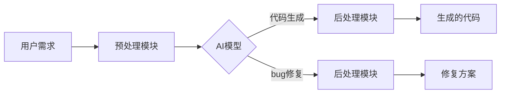

# AI辅助软件开发：代码生成与bug修复

> 关键词：AI辅助开发、代码生成、bug修复、软件开发、人工智能、自动化编程、代码质量

> 摘要：本文围绕AI辅助软件开发中的代码生成与bug修复展开深入探讨。首先介绍了AI辅助软件开发的背景，包括其目的、预期读者、文档结构和相关术语。接着阐述了代码生成与bug修复的核心概念及联系，给出原理和架构的文本示意图与Mermaid流程图。详细讲解了相关核心算法原理，并通过Python源代码进行具体操作步骤的阐述。同时给出了数学模型和公式，结合举例进行说明。通过项目实战展示了代码实际案例及详细解释，分析了其在实际应用场景中的作用。推荐了学习资源、开发工具框架以及相关论文著作。最后总结了未来发展趋势与挑战，提供了常见问题解答和扩展阅读参考资料，旨在全面深入地呈现AI在软件开发中代码生成与bug修复方面的技术与应用。

## 1. 背景介绍 
### 1.1 目的和范围
随着软件开发的规模和复杂度不断增加，传统的人工编程方式面临着效率低、易出错等问题。AI辅助软件开发的出现为解决这些问题提供了新的途径。本文的目的在于深入探讨AI在代码生成和bug修复方面的技术原理、实现方法以及实际应用，范围涵盖了从基本概念到具体算法，再到项目实战和应用场景的全方位内容，旨在帮助读者全面了解AI辅助软件开发在代码生成与bug修复领域的相关知识和技术。

### 1.2 预期读者
本文预期读者包括软件开发人员、人工智能研究人员、软件架构师、CTO等对AI辅助软件开发感兴趣的专业人士，也适合计算机相关专业的学生，希望通过阅读本文深入了解AI在软件开发中的应用，提升自己在这方面的技术水平和实践能力。

### 1.3 文档结构概述
本文首先介绍背景知识，包括目的、读者和术语等。然后阐述核心概念与联系，展示其原理和架构。接着详细讲解核心算法原理及操作步骤，给出数学模型和公式。通过项目实战展示实际代码案例和解释。分析实际应用场景，推荐相关工具和资源。最后总结未来趋势与挑战，提供常见问题解答和参考资料。

### 1.4 术语表
#### 1.4.1 核心术语定义
- **AI辅助软件开发**：利用人工智能技术辅助软件开发过程，包括代码生成、bug修复、代码优化等多个环节，旨在提高软件开发的效率和质量。
- **代码生成**：AI根据用户需求、规范或已有代码片段，自动生成符合要求的代码。
- **bug修复**：AI通过分析代码中的错误信息、运行日志等，找出bug的原因并提供修复方案。

#### 1.4.2 相关概念解释
- **机器学习**：是一门多领域交叉学科，涉及概率论、统计学、逼近论、凸分析、算法复杂度理论等多门学科。它专门研究计算机怎样模拟或实现人类的学习行为，以获取新的知识或技能，重新组织已有的知识结构使之不断改善自身的性能。在AI辅助软件开发中，机器学习算法可用于训练模型，以实现代码生成和bug修复。
- **自然语言处理（NLP）**：是计算机科学、人工智能和语言学交叉的领域，旨在让计算机理解、处理和生成人类语言。在代码生成中，NLP技术可用于将自然语言描述的需求转换为代码。

#### 1.4.3 缩略词列表
- **AI**：Artificial Intelligence（人工智能）
- **NLP**：Natural Language Processing（自然语言处理）
- **ML**：Machine Learning（机器学习）

## 2. 核心概念与联系 
### 核心概念原理
#### 代码生成原理
代码生成主要基于机器学习和深度学习技术。通过对大量代码数据的学习，模型可以掌握代码的语法、结构和语义信息。当接收到用户的需求描述（可以是自然语言或代码片段）时，模型会根据学习到的知识生成相应的代码。例如，基于Transformer架构的语言模型可以对代码文本进行编码和解码，生成符合逻辑的代码。

#### bug修复原理
bug修复通常涉及到对代码的静态分析和动态分析。静态分析通过检查代码的语法、结构和逻辑来发现潜在的错误；动态分析则通过运行代码，收集运行时信息，如错误日志、变量值等，来定位和修复bug。AI模型可以学习大量的bug模式和修复方法，当遇到新的bug时，能够根据已有的知识提供修复建议。

### 架构的文本示意图
```plaintext
用户需求（自然语言或代码片段） -> 预处理模块（清洗、分词等） -> AI模型（代码生成模型或bug修复模型） -> 后处理模块（代码格式化、优化等） -> 生成的代码或修复方案
```

### Mermaid流程图


## 3. 核心算法原理 & 具体操作步骤 
### 核心算法原理
#### 基于Transformer的代码生成算法
Transformer是一种基于注意力机制的深度学习模型，在自然语言处理和代码生成中取得了很好的效果。其核心思想是通过多头注意力机制捕捉输入序列中不同位置之间的依赖关系。

以下是一个简化的Transformer代码生成模型的Python实现：
```python
import torch
import torch.nn as nn
import torch.nn.functional as F

# 多头注意力机制
class MultiHeadAttention(nn.Module):
    def __init__(self, d_model, num_heads):
        super(MultiHeadAttention, self).__init__()
        self.d_model = d_model
        self.num_heads = num_heads
        self.d_k = d_model // num_heads

        self.W_q = nn.Linear(d_model, d_model)
        self.W_k = nn.Linear(d_model, d_model)
        self.W_v = nn.Linear(d_model, d_model)
        self.W_o = nn.Linear(d_model, d_model)

    def scaled_dot_product_attention(self, Q, K, V, mask=None):
        attn_scores = torch.matmul(Q, K.transpose(-2, -1)) / torch.sqrt(torch.tensor(self.d_k, dtype=torch.float32))
        if mask is not None:
            attn_scores = attn_scores.masked_fill(mask == 0, -1e9)
        attn_probs = F.softmax(attn_scores, dim=-1)
        output = torch.matmul(attn_probs, V)
        return output

    def split_heads(self, x):
        batch_size, seq_length, d_model = x.size()
        return x.view(batch_size, seq_length, self.num_heads, self.d_k).transpose(1, 2)

    def combine_heads(self, x):
        batch_size, num_heads, seq_length, d_k = x.size()
        return x.transpose(1, 2).contiguous().view(batch_size, seq_length, self.d_model)

    def forward(self, Q, K, V, mask=None):
        Q = self.split_heads(self.W_q(Q))
        K = self.split_heads(self.W_k(K))
        V = self.split_heads(self.W_v(V))

        attn_output = self.scaled_dot_product_attention(Q, K, V, mask)
        output = self.W_o(self.combine_heads(attn_output))
        return output

# 前馈神经网络
class PositionwiseFeedForward(nn.Module):
    def __init__(self, d_model, d_ff):
        super(PositionwiseFeedForward, self).__init__()
        self.fc1 = nn.Linear(d_model, d_ff)
        self.fc2 = nn.Linear(d_ff, d_model)
        self.relu = nn.ReLU()

    def forward(self, x):
        return self.fc2(self.relu(self.fc1(x)))

# 编码器层
class EncoderLayer(nn.Module):
    def __init__(self, d_model, num_heads, d_ff, dropout):
        super(EncoderLayer, self).__init__()
        self.self_attn = MultiHeadAttention(d_model, num_heads)
        self.feed_forward = PositionwiseFeedForward(d_model, d_ff)
        self.norm1 = nn.LayerNorm(d_model)
        self.norm2 = nn.LayerNorm(d_model)
        self.dropout = nn.Dropout(dropout)

    def forward(self, x, mask):
        attn_output = self.self_attn(x, x, x, mask)
        x = self.norm1(x + self.dropout(attn_output))
        ff_output = self.feed_forward(x)
        x = self.norm2(x + self.dropout(ff_output))
        return x

# 解码器层
class DecoderLayer(nn.Module):
    def __init__(self, d_model, num_heads, d_ff, dropout):
        super(DecoderLayer, self).__init__()
        self.self_attn = MultiHeadAttention(d_model, num_heads)
        self.cross_attn = MultiHeadAttention(d_model, num_heads)
        self.feed_forward = PositionwiseFeedForward(d_model, d_ff)
        self.norm1 = nn.LayerNorm(d_model)
        self.norm2 = nn.LayerNorm(d_model)
        self.norm3 = nn.LayerNorm(d_model)
        self.dropout = nn.Dropout(dropout)

    def forward(self, x, enc_output, src_mask, tgt_mask):
        attn_output1 = self.self_attn(x, x, x, tgt_mask)
        x = self.norm1(x + self.dropout(attn_output1))
        attn_output2 = self.cross_attn(x, enc_output, enc_output, src_mask)
        x = self.norm2(x + self.dropout(attn_output2))
        ff_output = self.feed_forward(x)
        x = self.norm3(x + self.dropout(ff_output))
        return x

# 代码生成模型
class CodeGenerationModel(nn.Module):
    def __init__(self, num_layers, d_model, num_heads, d_ff, input_vocab_size, target_vocab_size, max_seq_length, dropout):
        super(CodeGenerationModel, self).__init__()
        self.encoder_layers = nn.ModuleList([EncoderLayer(d_model, num_heads, d_ff, dropout) for _ in range(num_layers)])
        self.decoder_layers = nn.ModuleList([DecoderLayer(d_model, num_heads, d_ff, dropout) for _ in range(num_layers)])
        self.embedding_enc = nn.Embedding(input_vocab_size, d_model)
        self.embedding_dec = nn.Embedding(target_vocab_size, d_model)
        self.positional_encoding = nn.Parameter(torch.zeros(1, max_seq_length, d_model))
        self.fc = nn.Linear(d_model, target_vocab_size)
        self.dropout = nn.Dropout(dropout)

    def forward(self, src, tgt, src_mask, tgt_mask):
        src_embedded = self.embedding_enc(src) + self.positional_encoding[:, :src.size(1), :]
        tgt_embedded = self.embedding_dec(tgt) + self.positional_encoding[:, :tgt.size(1), :]
        src_embedded = self.dropout(src_embedded)
        tgt_embedded = self.dropout(tgt_embedded)

        enc_output = src_embedded
        for layer in self.encoder_layers:
            enc_output = layer(enc_output, src_mask)

        dec_output = tgt_embedded
        for layer in self.decoder_layers:
            dec_output = layer(dec_output, enc_output, src_mask, tgt_mask)

        output = self.fc(dec_output)
        return output
```

### 具体操作步骤
1. **数据准备**：收集大量的代码数据，进行清洗、标注和划分训练集、验证集和测试集。
2. **模型训练**：使用准备好的数据对代码生成模型进行训练，调整模型的参数以提高性能。
3. **推理过程**：在训练好的模型上，输入用户需求，模型生成相应的代码。
4. **后处理**：对生成的代码进行格式化、优化等处理，使其符合编程规范。

## 4. 数学模型和公式 & 详细讲解 & 举例说明 
### 数学模型和公式
#### 多头注意力机制
多头注意力机制的核心是计算注意力分数，其公式如下：
$$
\text{Attention}(Q, K, V) = \text{softmax}\left(\frac{QK^T}{\sqrt{d_k}}\right)V
$$
其中，$Q$ 是查询矩阵，$K$ 是键矩阵，$V$ 是值矩阵，$d_k$ 是键的维度。

多头注意力机制将输入分成多个头进行并行计算，最后将结果拼接起来：
$$
\text{MultiHead}(Q, K, V) = \text{Concat}(\text{head}_1, \cdots, \text{head}_h)W^O
$$
其中，$\text{head}_i = \text{Attention}(QW_i^Q, KW_i^K, VW_i^V)$，$W^Q$、$W^K$、$W^V$ 和 $W^O$ 是可学习的参数矩阵。

#### 前馈神经网络
前馈神经网络的公式为：
$$
\text{FFN}(x) = \text{max}(0, xW_1 + b_1)W_2 + b_2
$$
其中，$W_1$、$W_2$ 是权重矩阵，$b_1$、$b_2$ 是偏置向量。

### 详细讲解
#### 多头注意力机制
多头注意力机制通过将输入序列的不同部分的信息进行加权组合，能够捕捉到序列中不同位置之间的依赖关系。$\frac{QK^T}{\sqrt{d_k}}$ 计算了查询和键之间的相似度，通过 $\text{softmax}$ 函数将相似度转换为概率分布，然后用这个概率分布对值进行加权求和，得到最终的输出。

#### 前馈神经网络
前馈神经网络对多头注意力机制的输出进行非线性变换，增加模型的表达能力。$\text{max}(0, xW_1 + b_1)$ 是一个ReLU激活函数，用于引入非线性。

### 举例说明
假设我们有一个输入序列 $x = [x_1, x_2, x_3]$，$d_k = 4$，$Q$、$K$、$V$ 分别是 $3\times4$ 的矩阵。计算 $\frac{QK^T}{\sqrt{d_k}}$ 得到一个 $3\times3$ 的相似度矩阵，经过 $\text{softmax}$ 函数后得到一个概率分布矩阵，再与 $V$ 相乘得到最终的注意力输出。

对于前馈神经网络，假设输入 $x$ 是一个长度为 4 的向量，$W_1$ 是 $4\times8$ 的矩阵，$b_1$ 是长度为 8 的向量，$W_2$ 是 $8\times4$ 的矩阵，$b_2$ 是长度为 4 的向量。经过 $xW_1 + b_1$ 得到一个长度为 8 的向量，通过 $\text{max}(0, \cdot)$ 进行ReLU激活，再与 $W_2$ 相乘并加上 $b_2$ 得到最终的输出。

## 5. 项目实战：代码实际案例和详细解释说明 
### 5.1  开发环境搭建
1. **安装Python**：建议使用Python 3.7及以上版本，可以从Python官方网站下载安装包进行安装。
2. **安装深度学习框架**：本文使用PyTorch，可通过以下命令安装：
```sh
pip install torch torchvision
```
3. **安装其他依赖库**：如`numpy`、`matplotlib`等，可使用以下命令安装：
```sh
pip install numpy matplotlib
```

### 5.2  源代码详细实现和代码解读
以下是一个简单的代码生成项目的实现：
```python
import torch
import torch.nn as nn
import torch.optim as optim
from torch.utils.data import Dataset, DataLoader

# 自定义数据集
class CodeDataset(Dataset):
    def __init__(self, src_data, tgt_data):
        self.src_data = src_data
        self.tgt_data = tgt_data

    def __len__(self):
        return len(self.src_data)

    def __getitem__(self, idx):
        return self.src_data[idx], self.tgt_data[idx]

# 训练函数
def train_model(model, dataloader, criterion, optimizer, device, epochs):
    model.train()
    for epoch in range(epochs):
        total_loss = 0
        for src, tgt in dataloader:
            src = src.to(device)
            tgt = tgt.to(device)

            optimizer.zero_grad()
            output = model(src, tgt[:, :-1], None, None)
            loss = criterion(output.contiguous().view(-1, output.size(-1)), tgt[:, 1:].contiguous().view(-1))
            loss.backward()
            optimizer.step()

            total_loss += loss.item()
        print(f'Epoch {epoch + 1}/{epochs}, Loss: {total_loss / len(dataloader)}')

# 主函数
if __name__ == '__main__':
    # 模拟数据
    src_data = torch.randint(0, 100, (100, 10))
    tgt_data = torch.randint(0, 100, (100, 10))

    # 创建数据集和数据加载器
    dataset = CodeDataset(src_data, tgt_data)
    dataloader = DataLoader(dataset, batch_size=16, shuffle=True)

    # 初始化模型
    input_vocab_size = 100
    target_vocab_size = 100
    d_model = 128
    num_heads = 8
    num_layers = 3
    d_ff = 512
    max_seq_length = 10
    dropout = 0.1
    device = torch.device('cuda' if torch.cuda.is_available() else 'cpu')
    model = CodeGenerationModel(num_layers, d_model, num_heads, d_ff, input_vocab_size, target_vocab_size, max_seq_length, dropout).to(device)

    # 定义损失函数和优化器
    criterion = nn.CrossEntropyLoss()
    optimizer = optim.Adam(model.parameters(), lr=0.001)

    # 训练模型
    epochs = 10
    train_model(model, dataloader, criterion, optimizer, device, epochs)
```

### 5.3  代码解读与分析
1. **自定义数据集**：`CodeDataset`类继承自`torch.utils.data.Dataset`，用于封装输入数据和目标数据。`__len__`方法返回数据集的长度，`__getitem__`方法根据索引返回对应的输入和目标数据。
2. **训练函数**：`train_model`函数用于训练模型。在每个epoch中，遍历数据加载器，将输入和目标数据移动到设备上，计算模型输出，计算损失，进行反向传播和参数更新。
3. **主函数**：模拟数据，创建数据集和数据加载器，初始化模型、损失函数和优化器，调用训练函数进行模型训练。

## 6. 实际应用场景 
### 快速原型开发
在软件开发的早期阶段，需要快速验证想法和概念。AI辅助代码生成可以根据需求快速生成原型代码，帮助开发人员节省时间和精力，加速项目的启动和迭代。

### 代码补全和提示
在编写代码时，AI可以根据上下文提供代码补全和提示功能，提高编程效率。例如，当开发人员输入部分代码时，AI可以预测接下来可能的代码片段，减少手动输入的工作量。

### bug修复和代码优化
AI可以分析代码中的bug，提供修复建议。同时，还可以对现有代码进行优化，提高代码的性能和可读性。例如，AI可以发现代码中的冗余部分，提出优化方案，使代码更加简洁高效。

### 多语言开发支持
对于需要使用多种编程语言进行开发的项目，AI可以根据不同语言的语法和规范，生成相应的代码。这对于跨语言开发和多语言项目的维护非常有帮助。

## 7. 工具和资源推荐
### 7.1 学习资源推荐
#### 7.1.1 书籍推荐
- 《深度学习》（Deep Learning）：由Ian Goodfellow、Yoshua Bengio和Aaron Courville撰写，是深度学习领域的经典教材，全面介绍了深度学习的理论和方法。
- 《Python深度学习》（Deep Learning with Python）：由Francois Chollet编写，以Python和Keras为基础，介绍了深度学习的实践应用。
- 《人工智能：一种现代的方法》（Artificial Intelligence: A Modern Approach）：由Stuart Russell和Peter Norvig编写，是人工智能领域的权威教材，涵盖了人工智能的各个方面。

#### 7.1.2 在线课程
- Coursera上的“深度学习专项课程”（Deep Learning Specialization）：由Andrew Ng教授授课，系统介绍了深度学习的理论和实践。
- edX上的“人工智能基础”（Introduction to Artificial Intelligence）：由麻省理工学院（MIT）提供，讲解了人工智能的基本概念和方法。
- 哔哩哔哩（Bilibili）上的一些AI相关课程，如李宏毅的机器学习课程，讲解生动有趣，易于理解。

#### 7.1.3 技术博客和网站
- Medium：有很多AI和软件开发领域的优秀博客文章，涵盖了最新的技术和研究成果。
- arXiv：提供了大量的学术论文，包括AI在软件开发中的应用研究。
- 开源中国（OSChina）：有很多软件开发和AI相关的技术文章和开源项目。

### 7.2 开发工具框架推荐
#### 7.2.1 IDE和编辑器
- PyCharm：是一款专门为Python开发设计的集成开发环境（IDE），提供了丰富的代码编辑、调试和代码分析功能。
- Visual Studio Code：是一款轻量级的代码编辑器，支持多种编程语言，有丰富的插件可以扩展功能，如Python、AI开发相关的插件。
- Jupyter Notebook：适合进行数据探索、模型训练和代码演示，支持Python、R等多种编程语言。

#### 7.2.2 调试和性能分析工具
- Py-Spy：用于分析Python程序的性能，找出性能瓶颈。
- TensorBoard：是TensorFlow的可视化工具，可用于查看模型训练过程中的指标和可视化数据。
- PDB（Python Debugger）：Python内置的调试器，可用于调试Python代码。

#### 7.2.3 相关框架和库
- PyTorch：是一个开源的深度学习框架，提供了丰富的深度学习模型和工具，易于使用和扩展。
- TensorFlow：是另一个广泛使用的深度学习框架，具有强大的分布式训练和部署能力。
- Hugging Face Transformers：提供了预训练的Transformer模型，可用于自然语言处理和代码生成任务。

### 7.3 相关论文著作推荐
#### 7.3.1 经典论文
- “Attention Is All You Need”：介绍了Transformer架构，是自然语言处理和代码生成领域的重要基础。
- “Generating Code from Natural Language with Neural Machine Translation”：探讨了如何使用神经机器翻译技术从自然语言生成代码。

#### 7.3.2 最新研究成果
可以通过arXiv、ACM Digital Library等学术平台查找最新的AI辅助软件开发相关的研究论文，了解最新的技术进展。

#### 7.3.3 应用案例分析
一些知名的开源项目和商业软件公司会分享他们在AI辅助软件开发方面的应用案例，可以通过他们的官方博客和技术文档进行学习。

## 8. 总结：未来发展趋势与挑战
### 未来发展趋势
- **更强大的模型**：随着深度学习技术的不断发展，未来的AI模型将更加复杂和强大，能够生成更高质量的代码和更准确的bug修复方案。
- **跨领域融合**：AI辅助软件开发将与其他领域如物联网、大数据、云计算等深度融合，为软件开发带来更多的创新和机遇。
- **智能化开发环境**：开发环境将变得更加智能化，能够自动感知开发人员的需求，提供个性化的代码生成和bug修复建议。

### 挑战
- **数据质量和隐私问题**：AI模型的训练需要大量高质量的数据，但数据的收集、标注和管理存在质量和隐私问题。如何确保数据的质量和隐私是一个重要的挑战。
- **模型可解释性**：目前的AI模型大多是黑盒模型，难以解释其决策过程和结果。在软件开发中，开发人员需要了解模型生成代码和修复bug的依据，因此提高模型的可解释性是一个关键问题。
- **技术门槛**：AI辅助软件开发需要开发人员具备一定的AI和机器学习知识，这对于一些传统的软件开发人员来说是一个挑战。如何降低技术门槛，让更多的开发人员能够受益于AI辅助开发是一个亟待解决的问题。

## 9. 附录：常见问题与解答
### 问题1：AI生成的代码质量如何保证？
解答：可以通过以下方法保证AI生成的代码质量：使用高质量的训练数据，对生成的代码进行后处理和优化，进行代码审查和测试等。

### 问题2：AI能否完全替代人工编程？
解答：目前还不能。虽然AI在代码生成和bug修复方面有很大的帮助，但软件开发还涉及到需求分析、系统设计、项目管理等多个环节，需要人类的创造力和判断力。

### 问题3：如何选择适合的AI模型进行代码生成和bug修复？
解答：需要考虑任务的复杂度、数据的规模和特点、模型的性能和可解释性等因素。可以通过实验和比较不同的模型，选择最适合的模型。

## 10. 扩展阅读 & 参考资料
### 扩展阅读
- 《代码大全》（Code Complete）：详细介绍了软件开发的各个方面，包括代码编写、测试、维护等，对于提高软件开发的质量和效率有很大的帮助。
- 《重构：改善既有代码的设计》（Refactoring: Improving the Design of Existing Code）：介绍了代码重构的原则和方法，有助于优化代码结构和提高代码的可维护性。

### 参考资料
- 相关学术论文和研究报告
- 开源项目的文档和代码
- 官方网站和技术博客的文章