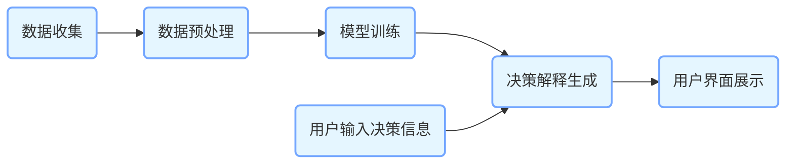

# AI辅助软件架构决策解释:提高设计透明度

> 关键词：AI、软件架构决策、决策解释、设计透明度、人工智能辅助、软件设计

> 摘要：本文聚焦于AI辅助软件架构决策解释以提高设计透明度这一主题。首先介绍了相关背景，包括目的、预期读者、文档结构和术语表。接着阐述核心概念与联系，通过文本示意图和Mermaid流程图展现其原理和架构。详细讲解核心算法原理，使用Python源代码说明具体操作步骤，同时给出数学模型和公式并举例说明。通过项目实战，包括开发环境搭建、源代码实现和解读，深入剖析AI辅助决策解释的实际应用。探讨了实际应用场景，推荐了相关的工具和资源，包括学习资源、开发工具框架和论文著作。最后总结未来发展趋势与挑战，解答常见问题并提供扩展阅读和参考资料，旨在全面深入地探讨如何利用AI提高软件架构设计的透明度。

## 1. 背景介绍 
### 1.1 目的和范围
在当今复杂的软件系统开发中，软件架构决策的质量直接影响到软件的性能、可维护性和可扩展性。然而，传统的软件架构决策过程往往缺乏透明度，开发团队成员、利益相关者甚至决策者本身可能都难以理解决策的依据和影响。本文章的目的在于探讨如何利用人工智能（AI）技术辅助软件架构决策解释，从而提高设计的透明度。

范围涵盖了AI在软件架构决策解释中的核心概念、算法原理、数学模型，以及实际项目中的应用案例。同时，还将介绍相关的工具和资源，为读者提供全面的知识体系和实践指导。

### 1.2 预期读者
本文预期读者包括软件架构师、软件工程师、AI研究人员、项目管理人员以及对软件架构设计和AI应用感兴趣的技术爱好者。对于软件架构师和工程师来说，他们可以从中学习如何利用AI提高决策的透明度和质量；AI研究人员可以了解AI在软件领域的具体应用场景和挑战；项目管理人员可以更好地理解软件架构决策过程，以便进行有效的项目管理；技术爱好者则可以拓宽自己的知识面，了解前沿技术的发展动态。

### 1.3 文档结构概述
本文将按照以下结构进行组织：首先介绍背景知识，包括目的、读者和术语表；接着阐述核心概念与联系，通过文本示意图和Mermaid流程图展示其原理和架构；然后详细讲解核心算法原理，使用Python源代码说明具体操作步骤；给出数学模型和公式并举例说明；通过项目实战深入剖析AI辅助决策解释的实际应用；探讨实际应用场景；推荐相关的工具和资源；最后总结未来发展趋势与挑战，解答常见问题并提供扩展阅读和参考资料。

### 1.4 术语表
#### 1.4.1 核心术语定义
- **软件架构决策**：在软件系统开发过程中，为了满足系统的功能、性能、可维护性等需求，对软件的整体结构、模块划分、组件交互等方面做出的选择和决定。
- **AI辅助决策解释**：利用人工智能技术，对软件架构决策的依据、过程和影响进行解释和说明，帮助相关人员理解决策的合理性和必要性。
- **设计透明度**：指软件架构设计过程和决策结果对开发团队成员、利益相关者等的可见性和可理解性。

#### 1.4.2 相关概念解释
- **机器学习**：是一门多领域交叉学科，涉及概率论、统计学、逼近论、凸分析、算法复杂度理论等多门学科。它专门研究计算机怎样模拟或实现人类的学习行为，以获取新的知识或技能，重新组织已有的知识结构使之不断改善自身的性能。在AI辅助软件架构决策解释中，机器学习算法可以用于分析大量的历史数据，发现决策模式和规律。
- **自然语言处理**：是计算机科学领域与人工智能领域中的一个重要方向。它研究能实现人与计算机之间用自然语言进行有效通信的各种理论和方法。在决策解释中，自然语言处理技术可以将复杂的决策信息转化为易于理解的自然语言文本。

#### 1.4.3 缩略词列表
- **AI**：Artificial Intelligence，人工智能
- **ML**：Machine Learning，机器学习
- **NLP**：Natural Language Processing，自然语言处理

## 2. 核心概念与联系 

### 核心概念原理
AI辅助软件架构决策解释的核心原理在于利用人工智能技术对软件架构决策过程中的各种信息进行分析、理解和表达。具体来说，它涉及到以下几个方面：

- **数据收集与预处理**：收集与软件架构决策相关的数据，包括历史决策记录、系统需求文档、性能指标等。对这些数据进行清洗、转换和特征提取，以便后续的分析和处理。
- **模型训练**：使用机器学习算法对预处理后的数据进行训练，建立决策模型。这些模型可以学习到决策的模式和规律，为后续的决策解释提供依据。
- **决策解释生成**：当需要对某个软件架构决策进行解释时，利用训练好的模型和自然语言处理技术，生成易于理解的解释文本。解释文本可以包括决策的依据、影响因素、潜在风险等信息。

### 架构的文本示意图
AI辅助软件架构决策解释的架构可以分为以下几个层次：

- **数据层**：负责收集、存储和管理与软件架构决策相关的数据，包括结构化数据（如数据库中的记录）和非结构化数据（如文档、代码等）。
- **模型层**：使用机器学习和深度学习算法对数据层的数据进行训练，建立决策模型和解释模型。
- **解释生成层**：根据用户的需求，利用模型层的模型生成决策解释文本。
- **用户界面层**：为用户提供交互界面，方便用户输入决策信息并获取解释结果。

### Mermaid流程图


## 3. 核心算法原理 & 具体操作步骤 

### 核心算法原理
在AI辅助软件架构决策解释中，常用的机器学习算法包括决策树、随机森林、神经网络等。这里以决策树算法为例，介绍其原理。

决策树是一种基于树结构进行决策的模型，每个内部节点表示一个属性上的测试，每个分支表示一个测试输出，每个叶节点表示一个类别或值。决策树的构建过程是一个递归的过程，通过选择最优的属性进行划分，直到满足终止条件。

### Python源代码详细阐述
以下是一个使用Python的`scikit-learn`库实现决策树分类器的示例代码：

```python
from sklearn.datasets import load_iris
from sklearn.model_selection import train_test_split
from sklearn.tree import DecisionTreeClassifier
from sklearn.metrics import accuracy_score

# 加载数据集
iris = load_iris()
X = iris.data
y = iris.target

# 划分训练集和测试集
X_train, X_test, y_train, y_test = train_test_split(X, y, test_size=0.3, random_state=42)

# 创建决策树分类器
clf = DecisionTreeClassifier()

# 训练模型
clf.fit(X_train, y_train)

# 预测
y_pred = clf.predict(X_test)

# 计算准确率
accuracy = accuracy_score(y_test, y_pred)
print(f"Accuracy: {accuracy}")
```

### 具体操作步骤
1. **数据加载**：使用`load_iris`函数加载鸢尾花数据集。
2. **数据划分**：使用`train_test_split`函数将数据集划分为训练集和测试集。
3. **模型创建**：创建`DecisionTreeClassifier`对象。
4. **模型训练**：使用`fit`方法对模型进行训练。
5. **预测**：使用`predict`方法对测试集进行预测。
6. **评估**：使用`accuracy_score`函数计算预测结果的准确率。

## 4. 数学模型和公式 & 详细讲解 & 举例说明 

### 信息熵
信息熵是信息论中的一个重要概念，用于衡量一个随机变量的不确定性。对于一个离散随机变量 $X$，其信息熵的定义为：

$$H(X) = -\sum_{i=1}^{n} p(x_i) \log_2 p(x_i)$$

其中，$p(x_i)$ 是随机变量 $X$ 取值为 $x_i$ 的概率，$n$ 是 $X$ 可能取值的个数。

### 信息增益
信息增益是决策树算法中用于选择最优划分属性的指标。对于一个数据集 $D$，属性 $A$ 的信息增益定义为：

$$Gain(D, A) = H(D) - \sum_{v=1}^{V} \frac{|D^v|}{|D|} H(D^v)$$

其中，$H(D)$ 是数据集 $D$ 的信息熵，$V$ 是属性 $A$ 可能取值的个数，$D^v$ 是属性 $A$ 取值为 $v$ 的样本子集，$|D|$ 和 $|D^v|$ 分别表示数据集 $D$ 和样本子集 $D^v$ 的样本数量。

### 举例说明
假设有一个数据集 $D$，包含 10 个样本，分为两类：正类和负类，其中正类有 6 个样本，负类有 4 个样本。则数据集 $D$ 的信息熵为：

$$H(D) = -\frac{6}{10} \log_2 \frac{6}{10} - \frac{4}{10} \log_2 \frac{4}{10} \approx 0.971$$

假设有一个属性 $A$，取值为 $a_1$ 和 $a_2$，其中 $A$ 取值为 $a_1$ 的样本有 4 个，正类 3 个，负类 1 个；$A$ 取值为 $a_2$ 的样本有 6 个，正类 3 个，负类 3 个。则属性 $A$ 的信息增益为：

$$H(D^{a_1}) = -\frac{3}{4} \log_2 \frac{3}{4} - \frac{1}{4} \log_2 \frac{1}{4} \approx 0.811$$

$$H(D^{a_2}) = -\frac{3}{6} \log_2 \frac{3}{6} - \frac{3}{6} \log_2 \frac{3}{6} = 1$$

$$Gain(D, A) = 0.971 - (\frac{4}{10} \times 0.811 + \frac{6}{10} \times 1) \approx 0.126$$

## 5. 项目实战：代码实际案例和详细解释说明 

### 5.1  开发环境搭建
1. **安装Python**：从Python官方网站（https://www.python.org/downloads/）下载并安装Python 3.x版本。
2. **安装必要的库**：使用`pip`命令安装`scikit-learn`、`pandas`、`numpy`等库。
```sh
pip install scikit-learn pandas numpy
```

### 5.2  源代码详细实现和代码解读
以下是一个简单的AI辅助软件架构决策解释的项目示例，假设我们有一个软件项目数据集，包含项目的特征（如功能需求、性能需求、团队规模等）和对应的架构决策（如微服务架构、单体架构等）。

```python
import pandas as pd
from sklearn.model_selection import train_test_split
from sklearn.tree import DecisionTreeClassifier
from sklearn.metrics import accuracy_score

# 加载数据集
data = pd.read_csv('software_projects.csv')

# 分离特征和标签
X = data.drop('architecture_decision', axis=1)
y = data['architecture_decision']

# 划分训练集和测试集
X_train, X_test, y_train, y_test = train_test_split(X, y, test_size=0.3, random_state=42)

# 创建决策树分类器
clf = DecisionTreeClassifier()

# 训练模型
clf.fit(X_train, y_train)

# 预测
y_pred = clf.predict(X_test)

# 计算准确率
accuracy = accuracy_score(y_test, y_pred)
print(f"Accuracy: {accuracy}")

# 生成决策解释
from sklearn.tree import export_text
tree_rules = export_text(clf, feature_names=list(X.columns))
print(tree_rules)
```

### 5.3  代码解读与分析
1. **数据加载**：使用`pandas`库的`read_csv`函数加载软件项目数据集。
2. **特征和标签分离**：将数据集分为特征矩阵 $X$ 和标签向量 $y$。
3. **数据划分**：使用`train_test_split`函数将数据集划分为训练集和测试集。
4. **模型创建**：创建`DecisionTreeClassifier`对象。
5. **模型训练**：使用`fit`方法对模型进行训练。
6. **预测**：使用`predict`方法对测试集进行预测。
7. **评估**：使用`accuracy_score`函数计算预测结果的准确率。
8. **决策解释生成**：使用`export_text`函数将决策树模型转换为文本规则，以便对决策进行解释。

## 6. 实际应用场景 
### 团队协作
在软件项目开发过程中，不同角色的团队成员对软件架构决策的理解可能存在差异。AI辅助决策解释可以提供透明的决策依据，帮助团队成员更好地理解决策的合理性，减少沟通成本和误解，提高团队协作效率。

### 利益相关者沟通
软件项目的利益相关者（如客户、投资者等）通常对软件架构决策的影响和风险比较关注。通过AI辅助决策解释，可以向利益相关者清晰地展示决策的过程和依据，增强他们对项目的信心。

### 软件演化和维护
随着软件系统的不断演化和维护，架构决策的合理性需要不断评估和调整。AI辅助决策解释可以记录决策的历史信息和依据，为后续的软件演化和维护提供参考，确保软件架构的可持续性。

## 7. 工具和资源推荐
### 7.1 学习资源推荐
#### 7.1.1 书籍推荐
- 《机器学习》（周志华著）：全面介绍了机器学习的基本概念、算法和应用，是机器学习领域的经典教材。
- 《Python机器学习》（Sebastian Raschka著）：以Python为工具，详细介绍了机器学习的算法实现和应用案例。
- 《软件架构设计：程序员向架构师转型必备》（余春龙著）：介绍了软件架构设计的基本原理、方法和实践经验，适合软件工程师向架构师转型。

#### 7.1.2 在线课程
- Coursera上的“机器学习”课程（Andrew Ng教授主讲）：是机器学习领域的经典在线课程，系统地介绍了机器学习的基本概念、算法和应用。
- edX上的“人工智能基础”课程：全面介绍了人工智能的基本概念、技术和应用，适合初学者入门。
- 中国大学MOOC上的“软件架构设计”课程：由国内知名高校的教授主讲，介绍了软件架构设计的基本原理、方法和实践经验。

#### 7.1.3 技术博客和网站
- Medium：是一个技术博客平台，有很多关于AI、软件架构等领域的优秀文章。
- Towards Data Science：专注于数据科学和机器学习领域的技术博客，提供了很多实用的技术文章和案例分析。
- InfoQ：是一个专注于软件开发和架构设计的技术媒体，提供了很多关于软件架构、AI等领域的最新技术资讯和实践经验。

### 7.2 开发工具框架推荐
#### 7.2.1 IDE和编辑器
- PyCharm：是一款专门为Python开发设计的集成开发环境（IDE），提供了丰富的代码编辑、调试、版本控制等功能。
- Visual Studio Code：是一款轻量级的代码编辑器，支持多种编程语言和插件扩展，适合快速开发和调试。
- Jupyter Notebook：是一个交互式的开发环境，适合进行数据探索、模型训练和可视化等工作。

#### 7.2.2 调试和性能分析工具
- PDB：是Python内置的调试器，可以帮助开发者在代码中设置断点、单步执行等，方便调试程序。
- cProfile：是Python的性能分析工具，可以帮助开发者找出程序中的性能瓶颈，优化代码性能。
- TensorBoard：是TensorFlow的可视化工具，可以帮助开发者可视化模型的训练过程、性能指标等信息。

#### 7.2.3 相关框架和库
- Scikit-learn：是一个开源的机器学习库，提供了丰富的机器学习算法和工具，方便开发者进行模型训练和评估。
- TensorFlow：是一个开源的深度学习框架，提供了丰富的深度学习模型和工具，适合进行大规模的深度学习开发。
- PyTorch：是一个开源的深度学习框架，具有动态图、易于调试等优点，适合进行深度学习研究和开发。

### 7.3 相关论文著作推荐
#### 7.3.1 经典论文
- “A Survey on Software Architecture”（Bass et al.）：对软件架构的基本概念、方法和技术进行了全面的综述。
- “Machine Learning: A Probabilistic Perspective”（Kevin P. Murphy）：从概率的角度介绍了机器学习的基本概念、算法和应用。
- “Deep Learning”（Ian Goodfellow et al.）：是深度学习领域的经典著作，全面介绍了深度学习的基本概念、算法和应用。

#### 7.3.2 最新研究成果
- 关注顶级学术会议（如ICSE、FSE等）和期刊（如ACM Transactions on Software Engineering and Methodology等）上的最新研究成果，了解AI辅助软件架构决策解释领域的前沿技术和发展趋势。

#### 7.3.3 应用案例分析
- 参考一些知名软件公司（如Google、Microsoft等）的技术博客和开源项目，了解他们在AI辅助软件架构决策解释方面的实践经验和应用案例。

## 8. 总结：未来发展趋势与挑战
### 未来发展趋势
- **融合更多AI技术**：未来，AI辅助软件架构决策解释将融合更多的AI技术，如深度学习、强化学习、知识图谱等，以提高决策解释的准确性和可解释性。
- **与软件开发流程深度融合**：AI辅助决策解释将与软件开发流程深度融合，实现决策解释的自动化和实时化，提高软件开发的效率和质量。
- **跨领域应用**：AI辅助决策解释将在更多的领域得到应用，如金融、医疗、交通等，为不同领域的决策提供支持。

### 挑战
- **数据质量和隐私问题**：AI辅助决策解释依赖于大量的数据，数据的质量和隐私问题是需要解决的关键问题。
- **模型可解释性**：虽然AI技术在决策解释方面取得了一定的进展，但模型的可解释性仍然是一个挑战，需要进一步研究和探索。
- **技术人才短缺**：AI辅助决策解释需要既懂AI技术又懂软件架构的复合型人才，目前这类人才短缺，需要加强人才培养。

## 9. 附录：常见问题与解答
### 问题1：AI辅助决策解释是否会取代人类决策？
答：不会。AI辅助决策解释只是为人类决策提供支持和参考，帮助人类更好地理解决策的依据和影响。最终的决策仍然需要人类根据具体情况进行判断和选择。

### 问题2：如何确保AI辅助决策解释的准确性？
答：可以通过以下方法确保准确性：选择合适的AI算法和模型，对数据进行充分的预处理和清洗，进行模型的评估和验证，不断优化模型等。

### 问题3：AI辅助决策解释是否适用于所有类型的软件项目？
答：不是。不同类型的软件项目具有不同的特点和需求，AI辅助决策解释需要根据具体项目进行定制和调整。对于一些简单的软件项目，可能不需要复杂的AI辅助决策解释。

## 10. 扩展阅读 & 参考资料
### 扩展阅读
- 《人工智能时代的软件架构》：深入探讨了AI技术对软件架构的影响和挑战，以及如何构建适应AI时代的软件架构。
- 《数据驱动的软件架构设计》：介绍了如何利用数据驱动的方法进行软件架构设计，提高架构设计的质量和效率。

### 参考资料
- 相关的学术论文、技术报告、行业标准等。
- 开源项目的文档和代码，如Scikit-learn、TensorFlow等的官方文档。