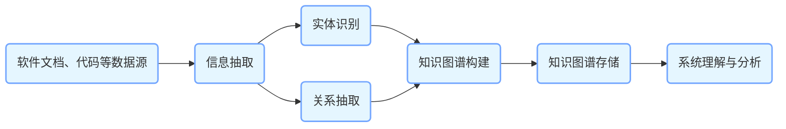

# AI辅助软件架构知识图谱构建:辅助系统理解

> 关键词：AI、软件架构、知识图谱、系统理解、信息抽取

> 摘要：本文聚焦于AI辅助软件架构知识图谱的构建以辅助系统理解。首先介绍了该研究的背景，包括目的、预期读者、文档结构和相关术语。接着阐述了核心概念，如软件架构和知识图谱的原理及联系，并给出了相应的示意图和流程图。详细讲解了核心算法原理及操作步骤，使用Python代码进行了说明。探讨了相关的数学模型和公式，并举例说明。通过项目实战，展示了代码实现和解读。分析了实际应用场景，推荐了学习资源、开发工具框架和相关论文著作。最后总结了未来发展趋势与挑战，提供了常见问题解答和扩展阅读参考资料，旨在为相关领域的研究和实践提供全面且深入的指导。

## 1. 背景介绍 

### 1.1 目的和范围
随着软件系统的规模和复杂度不断增加，理解软件架构变得越来越困难。软件架构知识图谱的构建旨在将软件架构中的各种信息以结构化的方式组织起来，帮助开发人员、维护人员和管理人员更好地理解软件系统。AI技术的引入可以辅助知识图谱的构建过程，提高构建的效率和质量。

本文的范围主要涵盖了AI辅助软件架构知识图谱构建的基本原理、算法、实践案例以及相关的工具和资源。具体包括如何利用AI技术从软件文档、代码等数据源中抽取知识，如何将抽取的知识整合到知识图谱中，以及如何利用知识图谱辅助系统理解等方面。

### 1.2 预期读者
本文的预期读者包括软件工程师、软件架构师、研究人员以及对软件架构和知识图谱感兴趣的技术爱好者。软件工程师可以通过本文了解如何利用AI技术构建软件架构知识图谱，提高对软件系统的理解和维护能力；软件架构师可以从中获取关于知识图谱在软件架构设计和评估中的应用思路；研究人员可以关注本文中涉及的算法和模型，为进一步的研究提供参考；技术爱好者则可以通过本文了解软件架构知识图谱的基本概念和构建方法。

### 1.3 文档结构概述
本文将按照以下结构进行组织：
- 核心概念与联系：介绍软件架构和知识图谱的核心概念，以及它们之间的联系，并给出相应的示意图和流程图。
- 核心算法原理 & 具体操作步骤：详细讲解用于知识抽取和知识图谱构建的核心算法原理，并使用Python代码进行具体实现。
- 数学模型和公式 & 详细讲解 & 举例说明：介绍相关的数学模型和公式，并通过具体的例子进行详细说明。
- 项目实战：代码实际案例和详细解释说明：通过一个实际的项目案例，展示AI辅助软件架构知识图谱构建的具体过程，包括开发环境搭建、源代码实现和代码解读。
- 实际应用场景：分析软件架构知识图谱在实际中的应用场景，如软件系统理解、架构评估、缺陷预测等。
- 工具和资源推荐：推荐相关的学习资源、开发工具框架和论文著作，帮助读者进一步深入学习和实践。
- 总结：未来发展趋势与挑战：总结AI辅助软件架构知识图谱构建的未来发展趋势和面临的挑战。
- 附录：常见问题与解答：提供常见问题的解答，帮助读者解决在学习和实践过程中遇到的问题。
- 扩展阅读 & 参考资料：列出扩展阅读的相关资料和参考文献，方便读者进一步查阅。

### 1.4 术语表
#### 1.4.1 核心术语定义
- **软件架构**：软件架构是指软件系统的基本结构，包括软件的各个组件、组件之间的关系以及指导组件设计和交互的原则。
- **知识图谱**：知识图谱是一种语义网络，它以图的形式表示实体（如人、事物、概念等）及其之间的关系，用于存储和管理知识。
- **信息抽取**：信息抽取是指从非结构化或半结构化的文本中提取出结构化的信息，如实体、关系和属性等。
- **实体识别**：实体识别是信息抽取的一个子任务，用于识别文本中的实体，如人名、地名、组织机构名等。
- **关系抽取**：关系抽取是信息抽取的另一个子任务，用于识别实体之间的关系，如“工作于”、“属于”等。

#### 1.4.2 相关概念解释
- **语义网络**：语义网络是一种用图来表示知识的方法，其中节点表示实体，边表示实体之间的关系。语义网络可以用于知识表示、推理和查询等。
- **本体**：本体是一种对特定领域的概念和概念之间关系的明确规范，它可以用于知识的组织和表示，帮助人们更好地理解和共享知识。
- **机器学习**：机器学习是一门多领域交叉学科，涉及概率论、统计学、逼近论、凸分析、算法复杂度理论等多门学科。它专门研究计算机怎样模拟或实现人类的学习行为，以获取新的知识或技能，重新组织已有的知识结构使之不断改善自身的性能。
- **深度学习**：深度学习是机器学习的一个分支领域，它基于人工神经网络，通过构建具有多个层次的神经网络模型，自动从大量数据中学习特征和模式。

#### 1.4.3 缩略词列表
- **NLP**：Natural Language Processing，自然语言处理
- **NER**：Named Entity Recognition，命名实体识别
- **RE**：Relation Extraction，关系抽取
- **RDF**：Resource Description Framework，资源描述框架
- **OWL**：Web Ontology Language，网络本体语言

## 2. 核心概念与联系 

### 软件架构
软件架构是软件系统的蓝图，它描述了软件系统的组成部分（组件）、组件之间的交互方式以及系统的整体结构。软件架构的设计对于软件系统的性能、可维护性、可扩展性等方面有着至关重要的影响。常见的软件架构风格包括分层架构、微服务架构、面向服务的架构（SOA）等。

### 知识图谱
知识图谱是一种以图的形式表示知识的方法，它由实体、属性和关系组成。实体是知识图谱中的节点，代表现实世界中的事物或概念；属性是实体的特征，用于描述实体的具体信息；关系是实体之间的联系，用于表示实体之间的语义关系。知识图谱可以用于知识表示、推理、查询和问答等应用。

### 软件架构与知识图谱的联系
软件架构知识图谱是将软件架构中的各种信息以知识图谱的形式表示出来，从而实现对软件架构的结构化管理和分析。通过构建软件架构知识图谱，可以将软件架构中的组件、接口、依赖关系等信息进行整合和关联，帮助开发人员更好地理解软件系统的整体结构和运行机制。

### 文本示意图
以下是一个简单的软件架构知识图谱的文本示意图：

```plaintext
软件系统
|-- 组件A
|   |-- 属性：功能描述、实现语言
|   |-- 关系：依赖于组件B
|-- 组件B
|   |-- 属性：功能描述、实现语言
|   |-- 关系：被组件A依赖，调用组件C
|-- 组件C
|   |-- 属性：功能描述、实现语言
|   |-- 关系：被组件B调用
```

### Mermaid流程图


这个流程图展示了AI辅助软件架构知识图谱构建的主要步骤：首先从软件文档、代码等数据源中进行信息抽取，包括实体识别和关系抽取；然后将抽取的知识用于构建知识图谱，并将知识图谱存储起来；最后利用知识图谱进行系统理解和分析。

## 3. 核心算法原理 & 具体操作步骤 

### 信息抽取算法原理
信息抽取是构建软件架构知识图谱的关键步骤，主要包括实体识别和关系抽取。常见的信息抽取算法有基于规则的方法、基于机器学习的方法和基于深度学习的方法。

#### 基于规则的方法
基于规则的方法是通过手工编写规则来识别实体和关系。例如，通过定义一些关键词和语法规则来识别软件组件的名称和它们之间的依赖关系。以下是一个简单的Python代码示例，用于基于规则的组件名称识别：

```python
import re

def extract_components(text):
    # 定义组件名称的正则表达式规则
    pattern = r'[A-Z][a-zA-Z]*Component'
    components = re.findall(pattern, text)
    return components

# 示例文本
text = "The LoginComponent depends on the UserServiceComponent."
components = extract_components(text)
print("Extracted components:", components)
```

#### 基于机器学习的方法
基于机器学习的方法是通过训练机器学习模型来识别实体和关系。常见的机器学习算法有支持向量机（SVM）、朴素贝叶斯（Naive Bayes）等。以下是一个使用Python和Scikit-learn库实现的基于SVM的命名实体识别示例：

```python
from sklearn.feature_extraction.text import TfidfVectorizer
from sklearn.svm import SVC
from sklearn.preprocessing import LabelEncoder

# 示例训练数据
train_texts = ["LoginComponent is a key part.", "UserServiceComponent provides services."]
train_labels = ["Component", "Component"]

# 特征提取
vectorizer = TfidfVectorizer()
X_train = vectorizer.fit_transform(train_texts)

# 标签编码
label_encoder = LabelEncoder()
y_train = label_encoder.fit_transform(train_labels)

# 训练SVM模型
model = SVC()
model.fit(X_train, y_train)

# 示例测试数据
test_text = "PaymentComponent handles payments."
X_test = vectorizer.transform([test_text])

# 预测
predicted_label = label_encoder.inverse_transform(model.predict(X_test))
print("Predicted label:", predicted_label)
```

#### 基于深度学习的方法
基于深度学习的方法是通过构建深度学习模型来识别实体和关系。常见的深度学习模型有循环神经网络（RNN）、长短时记忆网络（LSTM）和卷积神经网络（CNN）等。以下是一个使用Python和TensorFlow库实现的基于LSTM的命名实体识别示例：

```python
import tensorflow as tf
from tensorflow.keras.preprocessing.text import Tokenizer
from tensorflow.keras.preprocessing.sequence import pad_sequences
from tensorflow.keras.models import Sequential
from tensorflow.keras.layers import Embedding, LSTM, Dense

# 示例训练数据
train_texts = ["LoginComponent is a key part.", "UserServiceComponent provides services."]
train_labels = ["Component", "Component"]

# 分词
tokenizer = Tokenizer()
tokenizer.fit_on_texts(train_texts)
X_train = tokenizer.texts_to_sequences(train_texts)

# 填充序列
max_length = max([len(seq) for seq in X_train])
X_train = pad_sequences(X_train, maxlen=max_length)

# 标签编码
label_mapping = {"Component": 1}
y_train = [label_mapping[label] for label in train_labels]
y_train = tf.keras.utils.to_categorical(y_train)

# 构建LSTM模型
model = Sequential([
    Embedding(input_dim=len(tokenizer.word_index) + 1, output_dim=100, input_length=max_length),
    LSTM(100),
    Dense(2, activation='softmax')
])

# 编译模型
model.compile(optimizer='adam', loss='categorical_crossentropy', metrics=['accuracy'])

# 训练模型
model.fit(X_train, y_train, epochs=10, batch_size=1)

# 示例测试数据
test_text = "PaymentComponent handles payments."
X_test = tokenizer.texts_to_sequences([test_text])
X_test = pad_sequences(X_test, maxlen=max_length)

# 预测
predictions = model.predict(X_test)
predicted_label = "Component" if predictions[0][1] > 0.5 else "Non-Component"
print("Predicted label:", predicted_label)
```

### 知识图谱构建步骤
1. **数据预处理**：对抽取的信息进行清洗和整理，去除噪声和重复信息。
2. **实体对齐**：将不同数据源中表示同一实体的信息进行合并和统一。
3. **关系建立**：根据抽取的关系信息，在实体之间建立相应的关系。
4. **知识图谱存储**：将构建好的知识图谱存储到合适的数据库中，如图数据库（Neo4j）。

以下是一个简单的Python代码示例，用于将抽取的实体和关系存储到Neo4j图数据库中：

```python
from neo4j import GraphDatabase

# 连接到Neo4j数据库
uri = "bolt://localhost:7687"
driver = GraphDatabase.driver(uri, auth=("neo4j", "password"))

# 示例实体和关系
entities = ["LoginComponent", "UserServiceComponent"]
relations = [("LoginComponent", "depends on", "UserServiceComponent")]

def create_entity(tx, entity_name):
    tx.run("MERGE (n:Component {name: $name})", name=entity_name)

def create_relation(tx, source, relation, target):
    tx.run("MATCH (s:Component {name: $source}), (t:Component {name: $target}) "
           "MERGE (s)-[r:" + relation.replace(" ", "_") + "]->(t)",
           source=source, target=target)

# 创建实体
with driver.session() as session:
    for entity in entities:
        session.write_transaction(create_entity, entity)

# 创建关系
with driver.session() as session:
    for source, relation, target in relations:
        session.write_transaction(create_relation, source, relation, target)

# 关闭数据库连接
driver.close()
```

## 4. 数学模型和公式 & 详细讲解 & 举例说明 

### 信息抽取中的概率模型
在基于机器学习和深度学习的信息抽取中，常常使用概率模型来进行实体识别和关系抽取。例如，在命名实体识别中，可以使用隐马尔可夫模型（HMM）或条件随机场（CRF）。

#### 隐马尔可夫模型（HMM）
隐马尔可夫模型是一种统计模型，用于描述一个含有隐含未知参数的马尔可夫过程。在命名实体识别中，观测序列是输入的文本，隐藏状态是实体的标签。

HMM的三个基本要素是：初始状态概率分布 $\pi$、状态转移概率矩阵 $A$ 和观测概率矩阵 $B$。

- 初始状态概率分布 $\pi$：表示在时间 $t = 1$ 时处于各个状态的概率，即 $\pi_i = P(q_1 = s_i)$，其中 $q_1$ 是第一个时刻的状态，$s_i$ 是第 $i$ 个状态。
- 状态转移概率矩阵 $A$：表示从一个状态转移到另一个状态的概率，即 $A_{ij} = P(q_{t+1} = s_j | q_t = s_i)$，其中 $q_t$ 和 $q_{t+1}$ 分别是第 $t$ 和 $t + 1$ 个时刻的状态。
- 观测概率矩阵 $B$：表示在某个状态下观测到某个观测值的概率，即 $B_{j}(o_t) = P(o_t | q_t = s_j)$，其中 $o_t$ 是第 $t$ 个时刻的观测值。

HMM的三个基本问题是：
1. **评估问题**：给定模型 $\lambda = (\pi, A, B)$ 和观测序列 $O = (o_1, o_2, \cdots, o_T)$，计算 $P(O | \lambda)$。可以使用前向算法或后向算法来解决。
2. **解码问题**：给定模型 $\lambda = (\pi, A, B)$ 和观测序列 $O = (o_1, o_2, \cdots, o_T)$，找出最可能的状态序列 $Q = (q_1, q_2, \cdots, q_T)$。可以使用维特比算法来解决。
3. **学习问题**：给定观测序列 $O = (o_1, o_2, \cdots, o_T)$，估计模型参数 $\lambda = (\pi, A, B)$。可以使用鲍姆 - 韦尔奇算法（Baum - Welch algorithm）来解决。

#### 条件随机场（CRF）
条件随机场是一种判别式概率模型，用于对序列数据进行标注和分割。在命名实体识别中，CRF可以直接对观测序列和标签序列的联合概率进行建模。

设 $X = (x_1, x_2, \cdots, x_n)$ 是观测序列，$Y = (y_1, y_2, \cdots, y_n)$ 是标签序列。CRF定义了在给定观测序列 $X$ 的条件下，标签序列 $Y$ 的条件概率：

$$P(Y | X) = \frac{1}{Z(X)} \exp \left( \sum_{i=1}^{n} \sum_{k} \lambda_k f_k(y_{i - 1}, y_i, X, i) \right)$$

其中，$Z(X)$ 是归一化因子，$f_k(y_{i - 1}, y_i, X, i)$ 是特征函数，$\lambda_k$ 是特征函数的权重。

### 举例说明
假设我们有一个简单的命名实体识别任务，观测序列 $O = (o_1, o_2, o_3) = ($"Login", "Component", "handles"$)$，状态集合 $S = \{$"Component", "Non - Component"$\}$。

#### 使用HMM进行解码
假设我们已经训练好了HMM模型，得到了初始状态概率分布 $\pi$、状态转移概率矩阵 $A$ 和观测概率矩阵 $B$：

$$\pi = \begin{bmatrix} 0.6 \\ 0.4 \end{bmatrix}$$

$$A = \begin{bmatrix} 0.7 & 0.3 \\ 0.2 & 0.8 \end{bmatrix}$$

$$B = \begin{bmatrix} 0.8 & 0.1 & 0.1 \\ 0.2 & 0.7 & 0.1 \end{bmatrix}$$

使用维特比算法进行解码，步骤如下：

1. **初始化**：
   - $\delta_1(j) = \pi_j B_{j}(o_1)$，$j = 1, 2$
   - $\psi_1(j) = 0$，$j = 1, 2$

   计算得到：
   - $\delta_1(1) = \pi_1 B_{1}(o_1) = 0.6 \times 0.8 = 0.48$
   - $\delta_1(2) = \pi_2 B_{2}(o_1) = 0.4 \times 0.2 = 0.08$

2. **递推**：
   - $\delta_t(j) = \max_{i = 1}^{2} \left[ \delta_{t - 1}(i) A_{ij} \right] B_{j}(o_t)$，$t = 2, 3$，$j = 1, 2$
   - $\psi_t(j) = \arg \max_{i = 1}^{2} \left[ \delta_{t - 1}(i) A_{ij} \right]$，$t = 2, 3$，$j = 1, 2$

   对于 $t = 2$：
   - $\delta_2(1) = \max \left[ \delta_1(1) A_{11}, \delta_1(2) A_{21} \right] B_{1}(o_2) = \max \left[ 0.48 \times 0.7, 0.08 \times 0.2 \right] \times 0.1 = 0.48 \times 0.7 \times 0.1 = 0.0336$
   - $\delta_2(2) = \max \left[ \delta_1(1) A_{12}, \delta_1(2) A_{22} \right] B_{2}(o_2) = \max \left[ 0.48 \times 0.3, 0.08 \times 0.8 \right] \times 0.7 = 0.48 \times 0.3 \times 0.7 = 0.1008$

   对于 $t = 3$：
   - $\delta_3(1) = \max \left[ \delta_2(1) A_{11}, \delta_2(2) A_{21} \right] B_{1}(o_3) = \max \left[ 0.0336 \times 0.7, 0.1008 \times 0.2 \right] \times 0.1 = 0.1008 \times 0.2 \times 0.1 = 0.002016$
   - $\delta_3(2) = \max \left[ \delta_2(1) A_{12}, \delta_2(2) A_{22} \right] B_{2}(o_3) = \max \left[ 0.0336 \times 0.3, 0.1008 \times 0.8 \right] \times 0.1 = 0.1008 \times 0.8 \times 0.1 = 0.008064$

3. **终止**：
   - $\hat{q}_T = \arg \max_{j = 1}^{2} \delta_T(j)$
   - 回溯得到最可能的状态序列 $\hat{Q} = (\hat{q}_1, \hat{q}_2, \hat{q}_3)$

   由于 $\delta_3(2) > \delta_3(1)$，所以 $\hat{q}_3 = 2$。通过回溯 $\psi$ 矩阵，可以得到完整的状态序列。

#### 使用CRF进行标注
假设我们定义了一些特征函数，例如：
- $f_1(y_{i - 1}, y_i, X, i) = 1$，如果 $y_i =$ "Component" 且 $x_i$ 以 "Component" 结尾
- $f_2(y_{i - 1}, y_i, X, i) = 1$，如果 $y_{i - 1} =$ "Component" 且 $y_i =$ "Non - Component"

假设特征函数的权重 $\lambda_1 = 0.8$，$\lambda_2 = -0.5$。

对于观测序列 $O = ($"Login", "Component", "handles"$)$，我们可以计算不同标签序列的条件概率。例如，对于标签序列 $Y = ($"Component", "Component", "Non - Component"$)$：

$$\sum_{i = 1}^{3} \sum_{k} \lambda_k f_k(y_{i - 1}, y_i, X, i) = \lambda_1 \times 1 + \lambda_1 \times 1 + \lambda_2 \times 1 = 0.8 + 0.8 - 0.5 = 1.1$$

通过计算所有可能标签序列的条件概率，选择概率最大的标签序列作为最终的标注结果。

## 5. 项目实战：代码实际案例和详细解释说明 

### 5.1  开发环境搭建
在进行AI辅助软件架构知识图谱构建的项目实战之前，需要搭建相应的开发环境。以下是具体的步骤：

#### 安装Python
Python是一种广泛使用的编程语言，许多机器学习和深度学习库都支持Python。可以从Python官方网站（https://www.python.org/downloads/）下载并安装Python 3.x版本。

#### 安装必要的库
使用pip（Python包管理工具）安装以下必要的库：
- **Scikit - learn**：用于机器学习算法的实现，如SVM、Naive Bayes等。
  ```bash
  pip install scikit-learn
  ```
- **TensorFlow**：用于深度学习模型的构建和训练。
  ```bash
  pip install tensorflow
  ```
- **Neo4j Python驱动**：用于与Neo4j图数据库进行交互。
  ```bash
  pip install neo4j
  ```

#### 安装Neo4j图数据库
Neo4j是一个流行的图数据库，用于存储和管理知识图谱。可以从Neo4j官方网站（https://neo4j.com/download/）下载并安装Neo4j社区版。安装完成后，启动Neo4j服务，并设置用户名和密码。

### 5.2  源代码详细实现和代码解读
以下是一个完整的项目实战代码示例，包括信息抽取、知识图谱构建和存储：

```python
import re
import tensorflow as tf
from tensorflow.keras.preprocessing.text import Tokenizer
from tensorflow.keras.preprocessing.sequence import pad_sequences
from tensorflow.keras.models import Sequential
from tensorflow.keras.layers import Embedding, LSTM, Dense
from neo4j import GraphDatabase

# 示例训练数据
train_texts = ["LoginComponent is a key part.", "UserServiceComponent provides services."]
train_labels = ["Component", "Component"]

# 分词
tokenizer = Tokenizer()
tokenizer.fit_on_texts(train_texts)
X_train = tokenizer.texts_to_sequences(train_texts)

# 填充序列
max_length = max([len(seq) for seq in X_train])
X_train = pad_sequences(X_train, maxlen=max_length)

# 标签编码
label_mapping = {"Component": 1, "Non-Component": 0}
y_train = [label_mapping[label] for label in train_labels]
y_train = tf.keras.utils.to_categorical(y_train)

# 构建LSTM模型
model = Sequential([
    Embedding(input_dim=len(tokenizer.word_index) + 1, output_dim=100, input_length=max_length),
    LSTM(100),
    Dense(2, activation='softmax')
])

# 编译模型
model.compile(optimizer='adam', loss='categorical_crossentropy', metrics=['accuracy'])

# 训练模型
model.fit(X_train, y_train, epochs=10, batch_size=1)

# 示例测试数据
test_texts = ["PaymentComponent handles payments.", "This is a normal sentence."]
X_test = tokenizer.texts_to_sequences(test_texts)
X_test = pad_sequences(X_test, maxlen=max_length)

# 预测
predictions = model.predict(X_test)
predicted_labels = ["Component" if pred[1] > 0.5 else "Non-Component" for pred in predictions]

# 提取组件名称
components = []
for i, label in enumerate(predicted_labels):
    if label == "Component":
        components.append(re.findall(r'[A-Z][a-zA-Z]*Component', test_texts[i])[0])

# 示例关系
relations = [("PaymentComponent", "depends on", "UserServiceComponent")]

# 连接到Neo4j数据库
uri = "bolt://localhost:7687"
driver = GraphDatabase.driver(uri, auth=("neo4j", "password"))

def create_entity(tx, entity_name):
    tx.run("MERGE (n:Component {name: $name})", name=entity_name)

def create_relation(tx, source, relation, target):
    tx.run("MATCH (s:Component {name: $source}), (t:Component {name: $target}) "
           "MERGE (s)-[r:" + relation.replace(" ", "_") + "]->(t)",
           source=source, target=target)

# 创建实体
with driver.session() as session:
    for entity in components:
        session.write_transaction(create_entity, entity)

# 创建关系
with driver.session() as session:
    for source, relation, target in relations:
        session.write_transaction(create_relation, source, relation, target)

# 关闭数据库连接
driver.close()
```

### 5.3  代码解读与分析
1. **数据准备**：
   - 定义了示例训练数据 `train_texts` 和 `train_labels`，用于训练LSTM模型。
   - 使用 `Tokenizer` 对文本进行分词，并将文本转换为序列。
   - 对序列进行填充，使其长度一致。
   - 对标签进行编码，将字符串标签转换为数字标签。

2. **模型构建与训练**：
   - 使用 `Sequential` 模型构建LSTM模型，包括嵌入层、LSTM层和全连接层。
   - 编译模型，指定优化器、损失函数和评估指标。
   - 使用训练数据对模型进行训练。

3. **预测**：
   - 定义示例测试数据 `test_texts`，并将其转换为序列和填充。
   - 使用训练好的模型进行预测，得到预测结果。
   - 根据预测结果提取组件名称。

4. **知识图谱构建与存储**：
   - 定义示例关系 `relations`。
   - 连接到Neo4j数据库。
   - 定义 `create_entity` 和 `create_relation` 函数，用于创建实体和关系。
   - 使用 `session.write_transaction` 调用上述函数，将实体和关系存储到Neo4j数据库中。
   - 关闭数据库连接。

通过以上步骤，我们完成了一个简单的AI辅助软件架构知识图谱构建的项目实战。

## 6. 实际应用场景 
### 软件系统理解
软件架构知识图谱可以帮助开发人员更好地理解软件系统的整体结构和运行机制。通过知识图谱，开发人员可以快速了解软件系统中各个组件的功能、依赖关系和交互方式，从而更容易进行系统的维护和升级。例如，当开发人员需要对某个组件进行修改时，可以通过知识图谱查看该组件与其他组件的依赖关系，评估修改可能带来的影响。

### 架构评估
知识图谱可以用于软件架构的评估。通过对知识图谱中组件之间的关系和属性进行分析，可以评估软件架构的合理性和可维护性。例如，可以计算组件之间的耦合度和内聚度，评估架构的模块化程度；可以分析组件的依赖关系，发现潜在的循环依赖问题。

### 缺陷预测
利用知识图谱中的信息，可以进行软件缺陷的预测。通过分析组件的历史缺陷数据、组件之间的依赖关系和调用频率等信息，可以预测哪些组件更容易出现缺陷，从而提前采取措施进行预防和修复。例如，如果某个组件与多个容易出现缺陷的组件存在依赖关系，那么该组件出现缺陷的概率可能也会较高。

### 代码推荐
知识图谱可以为开发人员提供代码推荐服务。根据知识图谱中组件的功能和依赖关系，当开发人员需要实现某个功能时，可以推荐相关的组件和代码示例。例如，如果开发人员需要实现一个用户登录功能，知识图谱可以推荐相关的登录组件和实现代码。

### 知识共享与传承
软件架构知识图谱可以作为一种知识共享和传承的工具。新入职的开发人员可以通过知识图谱快速了解软件系统的架构和历史，减少学习成本；同时，知识图谱也可以记录软件系统的演化过程，为后续的开发和维护提供参考。

## 7. 工具和资源推荐

### 7.1 学习资源推荐
#### 7.1.1 书籍推荐
- 《Python机器学习》：这本书详细介绍了Python在机器学习中的应用，包括各种机器学习算法的原理和实现，适合初学者入门。
- 《深度学习》：由深度学习领域的三位先驱Ian Goodfellow、Yoshua Bengio和Aaron Courville撰写，是深度学习领域的经典教材，全面介绍了深度学习的理论和实践。
- 《知识图谱：方法、实践与应用》：本书系统地介绍了知识图谱的基本概念、构建方法、应用场景等内容，是学习知识图谱的重要参考书籍。

#### 7.1.2 在线课程
- Coursera上的“机器学习”课程：由斯坦福大学教授Andrew Ng主讲，是机器学习领域的经典课程，涵盖了机器学习的基本概念、算法和应用。
- edX上的“深度学习基础”课程：由deeplearning.ai提供，深入介绍了深度学习的基础知识和实践技巧。
- 中国大学MOOC上的“自然语言处理”课程：由国内知名高校的教授授课，介绍了自然语言处理的基本理论和方法。

#### 7.1.3 技术博客和网站
- Medium：是一个知名的技术博客平台，上面有许多关于AI、机器学习、知识图谱等领域的优质文章。
- Towards Data Science：专注于数据科学和机器学习领域，提供了大量的技术文章和案例分析。
- 开源中国：是国内知名的开源技术社区，上面有许多关于软件开发和技术研究的文章和讨论。

### 7.2 开发工具框架推荐
#### 7.2.1 IDE和编辑器
- PyCharm：是一款专门为Python开发设计的集成开发环境（IDE），提供了丰富的代码编辑、调试和测试功能。
- Jupyter Notebook：是一个基于Web的交互式计算环境，适合进行数据探索、模型训练和代码演示。
- Visual Studio Code：是一款轻量级的代码编辑器，支持多种编程语言，并且有丰富的插件扩展。

#### 7.2.2 调试和性能分析工具
- TensorBoard：是TensorFlow提供的可视化工具，用于监控模型训练过程、分析模型性能和可视化数据。
- Py-Spy：是一个用于Python代码性能分析的工具，可以帮助开发人员找出代码中的性能瓶颈。
- Neo4j Browser：是Neo4j图数据库自带的可视化工具，用于查看和管理知识图谱。

#### 7.2.3 相关框架和库
- Scikit - learn：是一个广泛使用的机器学习库，提供了各种机器学习算法的实现和工具。
- TensorFlow：是一个开源的深度学习框架，支持多种深度学习模型的构建和训练。
- PyTorch：是另一个流行的深度学习框架，具有动态图和易于使用的特点。
- NLTK：是一个自然语言处理工具包，提供了各种自然语言处理任务的工具和数据集。

### 7.3 相关论文著作推荐
#### 7.3.1 经典论文
- “BERT: Pre-training of Deep Bidirectional Transformers for Language Understanding”：介绍了BERT模型，是自然语言处理领域的重要突破。
- “Knowledge Graph Embedding: A Survey of Approaches and Applications”：对知识图谱嵌入技术进行了全面的综述。
- “Software Architecture Recovery: A Taxonomy and Review”：对软件架构恢复技术进行了分类和综述。

#### 7.3.2 最新研究成果
- 可以关注顶级学术会议如ACM SIGSOFT International Symposium on Software Testing and Analysis (ISSTA)、IEEE International Conference on Software Engineering (ICSE)等的论文，了解软件架构和知识图谱领域的最新研究成果。

#### 7.3.3 应用案例分析
- 可以查阅相关的技术报告和案例分析，了解软件架构知识图谱在实际项目中的应用情况和效果。例如，一些大型互联网公司可能会分享他们在软件架构管理和优化方面的实践经验。

## 8. 总结：未来发展趋势与挑战
### 未来发展趋势
1. **多模态信息融合**：未来的软件架构知识图谱将不仅仅局限于文本信息，还会融合代码、图像、视频等多模态信息，以更全面地描述软件系统。例如，通过分析代码中的注释、函数调用关系和代码结构，结合软件系统的设计文档和可视化界面，构建更加丰富和准确的知识图谱。
2. **实时知识更新**：随着软件系统的不断演化和更新，知识图谱需要能够实时反映软件架构的变化。未来的技术将支持对软件系统的实时监测和知识图谱的实时更新，确保知识图谱的时效性和准确性。
3. **与AI技术的深度融合**：AI技术将在软件架构知识图谱的构建和应用中发挥更加重要的作用。例如，利用强化学习优化知识图谱的构建过程，利用生成对抗网络生成虚拟的软件架构场景进行测试和评估。
4. **跨领域知识图谱的构建**：软件系统往往与其他领域（如业务流程、用户需求等）密切相关。未来将构建跨领域的知识图谱，将软件架构知识与其他领域的知识进行整合，为软件系统的开发和管理提供更全面的支持。

### 挑战
1. **数据质量和一致性**：软件系统的数据源多样，数据质量参差不齐，如何保证抽取的信息准确、一致是一个挑战。例如，不同文档中对同一组件的描述可能存在差异，需要进行数据清洗和整合。
2. **知识图谱的可扩展性**：随着软件系统的规模不断扩大，知识图谱的规模也会迅速增长。如何保证知识图谱的可扩展性，使其能够高效地存储和查询大规模的知识是一个亟待解决的问题。
3. **语义理解的准确性**：在信息抽取和知识图谱构建过程中，需要对文本进行语义理解。由于自然语言的复杂性和歧义性，如何准确地理解文本的语义，提取出准确的实体和关系是一个挑战。
4. **隐私和安全问题**：软件系统中可能包含敏感信息，如用户数据、商业机密等。在构建和使用知识图谱的过程中，需要确保这些信息的隐私和安全，防止信息泄露。

## 9. 附录：常见问题与解答
### 问题1：如何选择合适的信息抽取算法？
解答：选择合适的信息抽取算法需要考虑多个因素，如数据规模、数据类型、任务复杂度等。如果数据规模较小，且有明确的规则可循，可以选择基于规则的方法；如果数据规模较大，且需要处理复杂的语义信息，可以选择基于机器学习或深度学习的方法。具体来说，基于机器学习的方法适合处理结构化和半结构化的数据，而基于深度学习的方法在处理非结构化数据（如文本）方面表现更优。

### 问题2：知识图谱存储到Neo4j中后，如何进行查询？
解答：可以使用Cypher查询语言对Neo4j中的知识图谱进行查询。Cypher是一种声明式的图查询语言，类似于SQL。例如，要查询所有的组件实体，可以使用以下查询语句：

```cypher
MATCH (n:Component) RETURN n
```

要查询某个组件的依赖关系，可以使用以下查询语句：

```cypher
MATCH (s:Component {name: "LoginComponent"})-[r:depends_on]->(t:Component) RETURN s, r, t
```

### 问题3：如何评估知识图谱的质量？
解答：可以从以下几个方面评估知识图谱的质量：
- **完整性**：检查知识图谱是否包含了软件架构中的重要信息，如组件、关系和属性等。
- **准确性**：验证知识图谱中的信息是否准确无误，避免出现错误的实体和关系。
- **一致性**：确保知识图谱中的信息在不同部分之间保持一致，避免出现矛盾和冲突。
- **时效性**：知识图谱需要及时反映软件系统的变化，保证信息的时效性。

### 问题4：在实际项目中，如何处理数据不足的问题？
解答：当数据不足时，可以采取以下措施：
- **数据增强**：通过对现有数据进行变换和扩充，生成更多的训练数据。例如，对文本数据进行同义词替换、句子重组等操作。
- **迁移学习**：利用在其他相关任务或领域中训练好的模型，将其知识迁移到当前任务中。例如，使用在大规模文本数据集上预训练的语言模型，如BERT，进行微调以适应软件架构信息抽取任务。
- **主动学习**：通过选择最有价值的样本进行标注，提高数据的利用效率。例如，选择模型预测不确定性较高的样本进行人工标注。

## 10. 扩展阅读 & 参考资料
### 扩展阅读
- 《人工智能：现代方法》：全面介绍了人工智能的基本概念、算法和应用，是人工智能领域的经典教材。
- 《软件架构设计：方法与实践》：深入探讨了软件架构设计的方法和实践经验，对于理解软件架构的本质和设计原则有很大帮助。
- 《图数据库实战》：详细介绍了图数据库的原理、应用和开发，适合想要深入了解图数据库的读者。

### 参考资料
- [Scikit - learn官方文档](https://scikit-learn.org/stable/documentation.html)
- [TensorFlow官方文档](https://www.tensorflow.org/api_docs)
- [Neo4j官方文档](https://neo4j.com/docs/)
- [NLTK官方文档](https://www.nltk.org/)

以上就是关于AI辅助软件架构知识图谱构建以辅助系统理解的详细介绍，希望对读者有所帮助。在实际应用中，可以根据具体需求和场景，灵活运用相关的技术和方法，不断探索和创新。