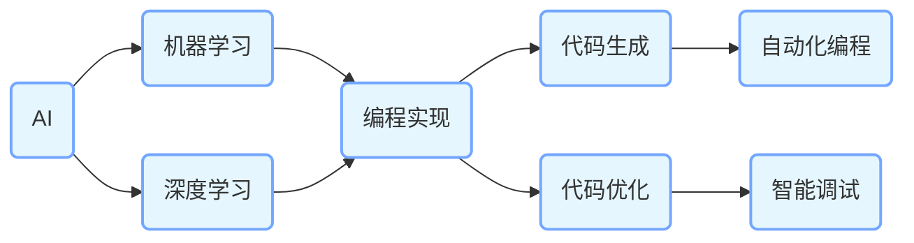

# AI驱动下编程职业的创新与发展

> 关键词：AI编程、编程职业发展、创新编程模式、自动化编程、编程教育变革

> 摘要：本文深入探讨了AI驱动下编程职业的创新与发展。在AI技术快速发展的背景下，编程职业正经历着前所未有的变革。文章首先介绍了研究的背景、目的、预期读者和文档结构等信息，接着阐述了AI与编程相关的核心概念及其联系，详细讲解了核心算法原理和具体操作步骤，引入了相关的数学模型和公式并举例说明。通过项目实战案例展示了AI在编程中的应用，分析了其实际应用场景。同时，推荐了学习资源、开发工具框架以及相关论文著作。最后对编程职业的未来发展趋势与挑战进行了总结，并提供了常见问题解答和扩展阅读参考资料，旨在为编程从业者和相关研究人员提供全面的参考。

## 1. 背景介绍 
### 1.1 目的和范围
随着人工智能（AI）技术的迅猛发展，其在编程领域的应用日益广泛且深入。本文章旨在全面分析AI驱动下编程职业所发生的创新与发展变化，涵盖从编程的基本概念、算法原理到实际项目应用，以及未来发展趋势等多个方面。通过对这些内容的研究，为编程从业者、相关教育工作者和研究者提供有价值的参考，帮助他们更好地适应和把握AI时代编程职业的发展机遇。

### 1.2 预期读者
本文的预期读者主要包括以下几类人群：
- **编程从业者**：包括软件开发工程师、数据分析师、算法工程师等，他们希望了解AI如何影响编程工作，以及如何利用AI提升自己的编程技能和工作效率。
- **编程教育工作者**：需要掌握AI驱动下编程教育的新方法和新趋势，以便更好地培养适应未来需求的编程人才。
- **计算机科学专业学生**：对编程和AI感兴趣，希望通过本文了解行业动态，为未来的职业发展做好准备。
- **技术研究者**：关注AI与编程领域的交叉研究，希望从本文中获取相关的理论和实践信息，推动该领域的进一步发展。

### 1.3 文档结构概述
本文共分为十个部分：
- **背景介绍**：阐述文章的目的、预期读者和文档结构，以及相关术语的定义和解释。
- **核心概念与联系**：介绍AI和编程相关的核心概念，分析它们之间的联系，并通过文本示意图和Mermaid流程图进行直观展示。
- **核心算法原理 & 具体操作步骤**：详细讲解与AI编程相关的核心算法原理，并使用Python源代码进行具体操作步骤的阐述。
- **数学模型和公式 & 详细讲解 & 举例说明**：引入相关的数学模型和公式，进行详细讲解并举例说明其在编程中的应用。
- **项目实战：代码实际案例和详细解释说明**：通过实际项目案例，展示AI在编程中的具体应用，包括开发环境搭建、源代码实现和代码解读。
- **实际应用场景**：分析AI驱动下编程在不同领域的实际应用场景。
- **工具和资源推荐**：推荐学习资源、开发工具框架以及相关论文著作，帮助读者进一步深入学习和研究。
- **总结：未来发展趋势与挑战**：对AI驱动下编程职业的未来发展趋势进行总结，并分析可能面临的挑战。
- **附录：常见问题与解答**：提供常见问题的解答，帮助读者解决在学习和实践过程中遇到的问题。
- **扩展阅读 & 参考资料**：列出扩展阅读的相关资料和参考来源，方便读者进一步深入研究。

### 1.4 术语表
#### 1.4.1 核心术语定义
- **人工智能（AI）**：是一门研究如何使计算机能够模拟人类智能的学科，包括机器学习、深度学习、自然语言处理等多个领域。
- **编程**：是指使用特定的编程语言，按照一定的规则和算法，编写计算机程序的过程。
- **自动化编程**：利用AI技术自动生成代码的过程，减少人工编写代码的工作量。
- **机器学习（ML）**：是AI的一个重要分支，通过让计算机从数据中学习模式和规律，从而实现预测和决策的能力。
- **深度学习（DL）**：是一种基于人工神经网络的机器学习方法，能够处理复杂的非线性问题。

#### 1.4.2 相关概念解释
- **AI编程**：将AI技术应用于编程过程中，实现代码的自动化生成、优化和调试等功能。
- **编程范式**：是指编程的基本风格和方法，如面向对象编程、函数式编程等。
- **代码生成模型**：是一种基于AI的模型，能够根据输入的需求自动生成代码。

#### 1.4.3 缩略词列表
- **AI**：Artificial Intelligence（人工智能）
- **ML**：Machine Learning（机器学习）
- **DL**：Deep Learning（深度学习）
- **IDE**：Integrated Development Environment（集成开发环境）

## 2. 核心概念与联系 

### 核心概念原理
#### 人工智能（AI）
人工智能旨在赋予计算机类似人类的智能，使其能够感知环境、学习知识、做出决策和解决问题。其核心原理包括机器学习和深度学习。机器学习通过算法让计算机从数据中学习模式和规律，从而实现预测和分类等任务。深度学习则是利用多层神经网络对数据进行深度特征提取和分析，能够处理更加复杂的任务，如图像识别、自然语言处理等。

#### 编程
编程是人类与计算机进行交互的方式，通过编写代码来实现特定的功能。编程涉及到编程语言、算法和数据结构等核心概念。编程语言是程序员与计算机沟通的工具，不同的编程语言适用于不同的应用场景。算法是解决问题的步骤和方法，数据结构则是组织和存储数据的方式。

### 核心概念之间的联系
AI与编程之间存在着紧密的联系。一方面，编程是实现AI技术的基础，AI算法和模型需要通过编程来实现和运行。另一方面，AI技术也为编程带来了新的发展机遇，如自动化编程、代码优化和智能调试等。

### 文本示意图
```plaintext
        AI
       /  \
  机器学习  深度学习
       |      |
  编程实现  编程实现
       |      |
    代码生成  代码优化
       |      |
  自动化编程  智能调试
```

### Mermaid流程图


## 3. 核心算法原理 & 具体操作步骤 

### 核心算法原理 - 决策树算法
决策树是一种常用的机器学习算法，用于分类和回归任务。其基本原理是根据数据的特征将数据集划分为不同的子集，直到每个子集都属于同一个类别或具有相似的数值。决策树的构建过程包括选择最优的特征进行划分，以及递归地构建子树。

### 具体操作步骤
以下是使用Python实现决策树算法的具体步骤：
```python
# 导入必要的库
from sklearn.datasets import load_iris
from sklearn.model_selection import train_test_split
from sklearn.tree import DecisionTreeClassifier
from sklearn.metrics import accuracy_score

# 加载数据集
iris = load_iris()
X = iris.data
y = iris.target

# 划分训练集和测试集
X_train, X_test, y_train, y_test = train_test_split(X, y, test_size=0.2, random_state=42)

# 创建决策树分类器
clf = DecisionTreeClassifier()

# 训练模型
clf.fit(X_train, y_train)

# 预测测试集
y_pred = clf.predict(X_test)

# 计算准确率
accuracy = accuracy_score(y_test, y_pred)
print(f"Accuracy: {accuracy}")
```
### 代码解释
1. **导入必要的库**：使用`sklearn`库中的`load_iris`函数加载鸢尾花数据集，`train_test_split`函数划分训练集和测试集，`DecisionTreeClassifier`类创建决策树分类器，`accuracy_score`函数计算准确率。
2. **加载数据集**：将鸢尾花数据集的特征和标签分别存储在`X`和`y`中。
3. **划分训练集和测试集**：使用`train_test_split`函数将数据集划分为训练集和测试集，其中测试集占比为20%。
4. **创建决策树分类器**：使用`DecisionTreeClassifier`类创建一个决策树分类器对象。
5. **训练模型**：使用`fit`方法对模型进行训练，传入训练集的特征和标签。
6. **预测测试集**：使用`predict`方法对测试集进行预测，得到预测结果。
7. **计算准确率**：使用`accuracy_score`函数计算预测结果的准确率，并打印输出。

## 4. 数学模型和公式 & 详细讲解 & 举例说明 

### 熵（Entropy）
熵是信息论中的一个概念，用于衡量数据集的不确定性。在决策树算法中，熵被用来选择最优的特征进行划分。熵的计算公式如下：
$$
H(X) = -\sum_{i=1}^{n} p(x_i) \log_2 p(x_i)
$$
其中，$X$ 是数据集，$p(x_i)$ 是数据集中第 $i$ 个类别的概率，$n$ 是类别的数量。

### 详细讲解
熵的值越大，说明数据集的不确定性越高；熵的值越小，说明数据集的纯度越高。在决策树的构建过程中，我们希望选择能够使划分后的子集熵最小的特征进行划分，这样可以使决策树更加准确地进行分类。

### 举例说明
假设我们有一个数据集，包含10个样本，其中有6个正样本和4个负样本。则正样本的概率为 $p(+) = \frac{6}{10} = 0.6$，负样本的概率为 $p(-) = \frac{4}{10} = 0.4$。根据熵的计算公式，该数据集的熵为：
$$
H(X) = - (0.6 \log_2 0.6 + 0.4 \log_2 0.4) \approx 0.97
$$

### 信息增益（Information Gain）
信息增益是在决策树算法中用于选择最优特征的另一个重要指标。信息增益的计算公式如下：
$$
IG(X, A) = H(X) - \sum_{v \in Values(A)} \frac{|X_v|}{|X|} H(X_v)
$$
其中，$X$ 是数据集，$A$ 是特征，$Values(A)$ 是特征 $A$ 的所有取值，$X_v$ 是特征 $A$ 取值为 $v$ 时的子集，$|X|$ 是数据集 $X$ 的样本数量，$|X_v|$ 是子集 $X_v$ 的样本数量。

### 详细讲解
信息增益表示在使用特征 $A$ 进行划分后，数据集的熵减少的程度。信息增益越大，说明使用该特征进行划分能够使数据集的纯度提高得越多，因此该特征越适合作为划分特征。

### 举例说明
假设我们有一个数据集，包含10个样本，其中有6个正样本和4个负样本。我们有一个特征 $A$，其取值为 $v_1$ 和 $v_2$。当 $A = v_1$ 时，子集 $X_{v_1}$ 包含4个样本，其中有3个正样本和1个负样本；当 $A = v_2$ 时，子集 $X_{v_2}$ 包含6个样本，其中有3个正样本和3个负样本。

首先计算数据集的熵 $H(X)$：
$$
H(X) = - (0.6 \log_2 0.6 + 0.4 \log_2 0.4) \approx 0.97
$$

然后计算子集 $X_{v_1}$ 和 $X_{v_2}$ 的熵：
$$
H(X_{v_1}) = - (\frac{3}{4} \log_2 \frac{3}{4} + \frac{1}{4} \log_2 \frac{1}{4}) \approx 0.81
$$
$$
H(X_{v_2}) = - (\frac{3}{6} \log_2 \frac{3}{6} + \frac{3}{6} \log_2 \frac{3}{6}) = 1
$$

最后计算信息增益 $IG(X, A)$：
$$
IG(X, A) = H(X) - (\frac{4}{10} H(X_{v_1}) + \frac{6}{10} H(X_{v_2})) \approx 0.97 - (0.4 \times 0.81 + 0.6 \times 1) = 0.046
$$

## 5. 项目实战：代码实际案例和详细解释说明 

### 5.1  开发环境搭建
#### 安装Python
首先，我们需要安装Python编程语言。可以从Python官方网站（https://www.python.org/downloads/）下载适合自己操作系统的Python安装包，并按照安装向导进行安装。

#### 安装必要的库
在项目中，我们需要使用一些Python库，如`numpy`、`pandas`、`scikit-learn`等。可以使用`pip`命令进行安装：
```sh
pip install numpy pandas scikit-learn
```

#### 选择开发工具
可以选择使用集成开发环境（IDE），如PyCharm、Jupyter Notebook等。PyCharm是一个功能强大的Python IDE，适合开发大型项目；Jupyter Notebook则更适合进行数据分析和实验。

### 5.2  源代码详细实现和代码解读
以下是一个使用决策树算法进行鸢尾花分类的完整代码示例：
```python
# 导入必要的库
import numpy as np
import pandas as pd
from sklearn.datasets import load_iris
from sklearn.model_selection import train_test_split
from sklearn.tree import DecisionTreeClassifier
from sklearn.metrics import accuracy_score

# 加载数据集
iris = load_iris()
X = iris.data
y = iris.target

# 将数据集转换为DataFrame格式
df = pd.DataFrame(data= np.c_[iris['data'], iris['target']],
                  columns= iris['feature_names'] + ['target'])

# 划分训练集和测试集
X_train, X_test, y_train, y_test = train_test_split(X, y, test_size=0.2, random_state=42)

# 创建决策树分类器
clf = DecisionTreeClassifier()

# 训练模型
clf.fit(X_train, y_train)

# 预测测试集
y_pred = clf.predict(X_test)

# 计算准确率
accuracy = accuracy_score(y_test, y_pred)
print(f"Accuracy: {accuracy}")
```
### 代码解读
1. **导入必要的库**：导入`numpy`、`pandas`、`sklearn`等库，用于数据处理、模型训练和评估。
2. **加载数据集**：使用`load_iris`函数加载鸢尾花数据集，并将特征和标签分别存储在`X`和`y`中。
3. **将数据集转换为DataFrame格式**：使用`pandas`库将数据集转换为DataFrame格式，方便进行数据处理和分析。
4. **划分训练集和测试集**：使用`train_test_split`函数将数据集划分为训练集和测试集，其中测试集占比为20%。
5. **创建决策树分类器**：使用`DecisionTreeClassifier`类创建一个决策树分类器对象。
6. **训练模型**：使用`fit`方法对模型进行训练，传入训练集的特征和标签。
7. **预测测试集**：使用`predict`方法对测试集进行预测，得到预测结果。
8. **计算准确率**：使用`accuracy_score`函数计算预测结果的准确率，并打印输出。

### 5.3  代码解读与分析
#### 数据处理
将数据集转换为DataFrame格式可以方便我们对数据进行查看和处理。在实际项目中，我们可能需要对数据进行清洗、特征工程等操作，以提高模型的性能。

#### 模型训练
使用`fit`方法对模型进行训练时，模型会根据训练集的数据学习特征和标签之间的关系。决策树算法通过递归地选择最优的特征进行划分，构建决策树模型。

#### 模型评估
使用`accuracy_score`函数计算预测结果的准确率是一种常用的模型评估方法。准确率表示模型预测正确的样本数占总样本数的比例。在实际项目中，我们还可以使用其他评估指标，如精确率、召回率、F1值等，来全面评估模型的性能。

## 6. 实际应用场景 
### 软件开发
在软件开发过程中，AI可以用于自动化代码生成、代码审查和漏洞检测等方面。例如，一些代码生成工具可以根据用户输入的需求自动生成代码框架，减少开发人员的工作量。代码审查工具可以使用AI技术分析代码的质量和风格，发现潜在的问题和错误。漏洞检测工具可以通过分析代码的结构和逻辑，发现可能存在的安全漏洞。

### 数据分析
在数据分析领域，AI可以帮助数据分析师更高效地处理和分析数据。例如，机器学习算法可以用于数据分类、聚类和预测等任务。深度学习算法可以处理复杂的图像、音频和文本数据，实现图像识别、语音识别和自然语言处理等功能。数据可视化工具也可以结合AI技术，自动生成直观的可视化图表，帮助用户更好地理解数据。

### 智能客服
智能客服系统是AI在编程领域的另一个重要应用场景。通过使用自然语言处理技术，智能客服系统可以理解用户的问题，并自动给出回答。智能客服系统可以集成到网站、移动应用等平台上，为用户提供24小时不间断的服务。同时，智能客服系统还可以通过学习用户的问题和回答，不断提高自己的服务质量。

### 游戏开发
在游戏开发中，AI可以用于实现游戏角色的智能行为、游戏难度的自适应调整等功能。例如，游戏中的敌人角色可以使用AI算法进行路径规划和决策，使其表现出更加智能的行为。游戏开发者还可以使用AI技术对游戏的难度进行实时调整，根据玩家的游戏表现提供不同难度的挑战，提高游戏的趣味性和挑战性。

## 7. 工具和资源推荐
### 7.1 学习资源推荐
#### 7.1.1 书籍推荐
- 《Python机器学习》：本书详细介绍了Python在机器学习领域的应用，包括机器学习的基本概念、算法原理和实践案例。
- 《深度学习》：由深度学习领域的三位先驱Ian Goodfellow、Yoshua Bengio和Aaron Courville撰写，是深度学习领域的经典教材。
- 《算法导论》：全面介绍了算法的设计、分析和实现，是计算机科学领域的经典著作。

#### 7.1.2 在线课程
- Coursera上的“机器学习”课程：由斯坦福大学的Andrew Ng教授授课，是机器学习领域的入门经典课程。
- edX上的“深度学习”课程：提供了深度学习的理论和实践教学，适合有一定编程基础的学习者。
- 中国大学MOOC上的“Python编程基础”课程：帮助初学者快速掌握Python编程语言的基础知识和应用。

#### 7.1.3 技术博客和网站
- Medium：是一个技术博客平台，上面有很多关于AI和编程的优秀文章。
- Towards Data Science：专注于数据科学和机器学习领域的技术博客，提供了很多实用的教程和案例。
- GitHub：是一个代码托管平台，上面有很多开源的AI和编程项目，可以学习和参考。

### 7.2 开发工具框架推荐
#### 7.2.1 IDE和编辑器
- PyCharm：是一个功能强大的Python IDE，提供了代码编辑、调试、版本控制等功能，适合开发大型Python项目。
- Jupyter Notebook：是一个交互式的开发环境，适合进行数据分析和实验，支持多种编程语言。
- Visual Studio Code：是一个轻量级的代码编辑器，支持多种编程语言，具有丰富的插件生态系统。

#### 7.2.2 调试和性能分析工具
- PySnooper：是一个简单易用的Python调试工具，可以自动记录函数的调用过程和变量的值。
- cProfile：是Python标准库中的一个性能分析工具，可以分析程序的运行时间和函数调用次数。
- TensorBoard：是TensorFlow框架提供的一个可视化工具，可以用于可视化模型的训练过程和性能指标。

#### 7.2.3 相关框架和库
- TensorFlow：是一个开源的深度学习框架，由Google开发，广泛应用于图像识别、自然语言处理等领域。
- PyTorch：是另一个流行的深度学习框架，具有动态图和易于使用的特点，受到很多研究者和开发者的喜爱。
- Scikit-learn：是一个用于机器学习的Python库，提供了丰富的机器学习算法和工具，适合初学者和快速原型开发。

### 7.3 相关论文著作推荐
#### 7.3.1 经典论文
- “Gradient-Based Learning Applied to Document Recognition”：由Yann LeCun等人发表，介绍了卷积神经网络（CNN）在手写数字识别中的应用，是深度学习领域的经典论文之一。
- “Long Short-Term Memory”：由Sepp Hochreiter和Jürgen Schmidhuber发表，提出了长短期记忆网络（LSTM），解决了传统循环神经网络（RNN）的梯度消失问题。
- “Attention Is All You Need”：由Google Brain团队发表，提出了Transformer架构，在自然语言处理领域取得了巨大的成功。

#### 7.3.2 最新研究成果
- 关注顶级学术会议，如NeurIPS（神经信息处理系统大会）、ICML（国际机器学习会议）、CVPR（计算机视觉与模式识别会议）等，这些会议上会发布很多最新的研究成果。
- 订阅相关的学术期刊，如Journal of Artificial Intelligence Research（JAIR）、Artificial Intelligence等，及时了解领域内的最新进展。

#### 7.3.3 应用案例分析
- 可以参考一些知名公司的技术博客，如Google AI Blog、Facebook AI Research等，了解他们在AI和编程领域的应用案例和实践经验。
- 阅读一些行业报告和案例分析书籍，了解AI在不同行业的应用现状和发展趋势。

## 8. 总结：未来发展趋势与挑战
### 未来发展趋势
#### 自动化编程将更加普及
随着AI技术的不断发展，自动化编程工具将变得更加智能和强大。未来，开发人员可以通过简单的描述或示例，让AI自动生成高质量的代码，大大提高开发效率。

#### 编程与AI的融合将更加深入
编程和AI将不再是两个独立的领域，而是相互融合、相互促进。开发人员需要掌握AI技术，以便更好地开发出智能的软件系统；AI研究人员也需要具备编程能力，以便实现和验证自己的算法和模型。

#### 编程教育将发生变革
AI驱动下的编程教育将更加注重实践和创新能力的培养。未来的编程课程将结合AI技术，让学生通过实际项目和案例学习编程知识和技能。同时，AI还可以为学生提供个性化的学习建议和辅导，提高学习效果。

#### 智能编程助手将成为开发人员的得力助手
智能编程助手可以在开发过程中提供实时的代码提示、错误检查和优化建议等功能，帮助开发人员提高代码质量和开发效率。未来，智能编程助手将变得更加智能和个性化，能够根据开发人员的习惯和需求提供定制化的服务。

### 挑战
#### 数据隐私和安全问题
AI编程需要大量的数据进行训练和学习，这些数据可能包含用户的隐私信息。因此，如何保护数据的隐私和安全是一个重要的挑战。开发人员需要采取有效的措施，如数据加密、访问控制等，来确保数据的安全。

#### 算法偏见和公平性问题
AI算法是基于数据进行训练的，如果数据存在偏见，那么算法也会产生偏见。例如，在招聘、贷款审批等领域，AI算法可能会对某些群体产生不公平的影响。因此，如何解决算法偏见和公平性问题是一个亟待解决的挑战。

#### 人才短缺问题
AI驱动下的编程职业需要具备跨学科知识和技能的人才，如编程、机器学习、数学等。目前，这类人才相对短缺，如何培养和吸引更多的人才是一个重要的挑战。教育机构和企业需要加强合作，共同培养适应未来需求的编程人才。

#### 法律和伦理问题
随着AI技术的广泛应用，相关的法律和伦理问题也日益凸显。例如，AI系统的责任认定、算法的透明度等问题都需要制定相应的法律法规和伦理准则。如何在推动技术发展的同时，确保其符合法律和伦理要求是一个重要的挑战。

## 9. 附录：常见问题与解答
### 问题1：AI会取代编程工作吗？
答：虽然AI在编程领域的应用越来越广泛，但目前还不会完全取代编程工作。AI可以帮助开发人员提高工作效率，如自动化代码生成、代码审查等，但编程工作仍然需要人类的创造力、逻辑思维和问题解决能力。未来，编程人员需要与AI技术相结合，共同完成更复杂的任务。

### 问题2：学习AI编程需要具备哪些基础知识？
答：学习AI编程需要具备一定的编程基础，如Python编程语言。同时，还需要掌握一些数学知识，如线性代数、概率论和统计学等。此外，了解机器学习和深度学习的基本概念和算法也是必要的。

### 问题3：如何选择适合自己的AI编程框架？
答：选择适合自己的AI编程框架需要考虑多个因素，如项目需求、个人编程习惯、框架的易用性和性能等。对于初学者来说，建议选择简单易用的框架，如Scikit-learn和PyTorch；对于有一定经验的开发者，可以根据项目的具体需求选择更强大的框架，如TensorFlow。

### 问题4：AI编程在实际应用中会遇到哪些挑战？
答：AI编程在实际应用中会遇到一些挑战，如数据质量问题、算法复杂度问题、模型可解释性问题等。数据质量问题可能会影响模型的性能和准确性；算法复杂度问题可能会导致模型训练时间过长和资源消耗过大；模型可解释性问题可能会影响用户对模型的信任和接受度。

## 10. 扩展阅读 & 参考资料
### 扩展阅读
- 《人工智能时代的编程之道》：深入探讨了AI与编程的融合，以及编程职业在AI时代的发展趋势和应对策略。
- 《AI编程实战：从入门到精通》：通过实际项目案例，介绍了AI编程的基本概念、算法原理和实践技巧。
- 《数据科学实战》：结合实际案例，介绍了数据科学的整个流程，包括数据采集、清洗、分析和可视化等。

### 参考资料
- Goodfellow, I., Bengio, Y., & Courville, A. (2016). Deep Learning. MIT Press.
- Mitchell, T. M. (1997). Machine Learning. McGraw-Hill.
- Cormen, T. H., Leiserson, C. E., Rivest, R. L., & Stein, C. (2009). Introduction to Algorithms. MIT Press.
- Scikit-learn官方文档：https://scikit-learn.org/stable/documentation.html
- TensorFlow官方文档：https://www.tensorflow.org/api_docs
- PyTorch官方文档：https://pytorch.org/docs/stable/index.html