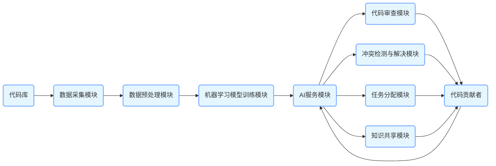

# AI驱动的代码贡献者协作模式分析:优化团队动态

> 关键词：AI驱动、代码贡献者协作、团队动态优化、软件开发、协作模式

> 摘要：本文聚焦于AI驱动的代码贡献者协作模式，旨在深入分析该模式如何优化软件开发团队的动态。首先介绍了研究的背景、目的、预期读者和文档结构，对相关术语进行了详细定义。接着阐述了核心概念与联系，包括AI在代码协作中的原理和架构，并给出了对应的Mermaid流程图。然后深入讲解了核心算法原理，结合Python源代码进行详细说明，同时给出了相关的数学模型和公式并举例。通过项目实战部分，展示了在实际开发环境中该协作模式的具体实现和代码解读。探讨了该模式的实际应用场景，推荐了相关的学习资源、开发工具框架以及论文著作。最后总结了未来发展趋势与挑战，提供了常见问题解答和扩展阅读参考资料，为软件开发团队利用AI优化协作提供了全面的指导。

## 1. 背景介绍 
### 1.1 目的和范围
在当今软件开发领域，团队协作的效率和质量直接影响项目的成败。随着代码规模的不断增大和开发人员数量的增多，传统的代码贡献者协作模式面临着沟通成本高、冲突解决效率低等问题。本研究的目的在于分析AI驱动的代码贡献者协作模式，探讨如何利用人工智能技术优化团队动态，提高软件开发的效率和质量。

研究范围涵盖了AI在代码协作中的各个方面，包括代码审查、冲突检测与解决、任务分配、知识共享等。通过对这些方面的深入分析，总结出AI驱动的协作模式的优势和挑战，并提出相应的优化策略。

### 1.2 预期读者
本文的预期读者主要包括软件开发团队的成员，如程序员、软件架构师、项目经理等，他们可以从中了解如何利用AI技术改善团队协作，提高项目开发效率。此外，对人工智能在软件开发领域应用感兴趣的研究人员和学者也可以通过本文深入了解相关理论和实践。

### 1.3 文档结构概述
本文将按照以下结构进行组织：首先介绍背景信息，包括研究目的、预期读者和文档结构概述，并对相关术语进行定义。接着阐述核心概念与联系，包括AI在代码协作中的原理和架构。然后详细讲解核心算法原理和具体操作步骤，结合Python源代码进行说明。随后给出数学模型和公式，并举例说明。通过项目实战部分展示该协作模式的实际应用，包括开发环境搭建、源代码实现和代码解读。探讨实际应用场景，推荐相关的学习资源、开发工具框架和论文著作。最后总结未来发展趋势与挑战，提供常见问题解答和扩展阅读参考资料。

### 1.4 术语表
#### 1.4.1 核心术语定义
- **AI驱动的代码贡献者协作模式**：指在软件开发过程中，利用人工智能技术辅助代码贡献者之间的协作，包括代码审查、冲突解决、任务分配等方面。
- **代码贡献者**：参与软件开发项目，对代码库进行修改、添加或删除代码的人员。
- **团队动态**：指软件开发团队中成员之间的互动、沟通、协作等行为和关系的总和。
- **代码审查**：对代码进行检查和评估，以确保代码的质量、可读性和安全性。
- **冲突检测与解决**：在多人同时对代码进行修改时，检测代码之间的冲突并采取相应的措施解决冲突。

#### 1.4.2 相关概念解释
- **人工智能**：研究如何使计算机模拟人类的智能行为，包括学习、推理、决策等能力。
- **机器学习**：人工智能的一个分支，通过让计算机从数据中学习模式和规律，从而实现预测和决策。
- **自然语言处理**：人工智能的另一个分支，研究如何让计算机理解和处理人类语言，包括文本分析、语义理解等。

#### 1.4.3 缩略词列表
- **AI**：Artificial Intelligence，人工智能
- **ML**：Machine Learning，机器学习
- **NLP**：Natural Language Processing，自然语言处理

## 2. 核心概念与联系 
### 核心概念原理
AI驱动的代码贡献者协作模式的核心原理是利用人工智能技术对软件开发过程中的各种数据进行分析和处理，从而辅助代码贡献者之间的协作。具体来说，AI可以通过以下几个方面发挥作用：

- **代码审查**：利用机器学习算法对代码进行自动审查，检测代码中的潜在问题，如语法错误、逻辑错误、代码风格问题等。同时，AI可以根据历史审查记录和最佳实践，为代码贡献者提供改进建议。
- **冲突检测与解决**：在多人同时对代码进行修改时，AI可以通过分析代码的差异，自动检测代码之间的冲突，并提供冲突解决建议。例如，AI可以识别出哪些代码修改是相互冲突的，并提示代码贡献者如何合并这些修改。
- **任务分配**：根据代码贡献者的技能水平、工作负荷和项目需求，AI可以自动分配开发任务，确保任务分配的合理性和高效性。
- **知识共享**：利用自然语言处理技术，AI可以对代码库中的文档、注释和代码进行分析，提取有用的知识，并将这些知识推送给相关的代码贡献者。例如，AI可以根据代码贡献者的搜索关键词，提供相关的代码示例和解决方案。

### 架构示意图
下面是AI驱动的代码贡献者协作模式的架构示意图：



### 架构说明
- **代码库**：存储软件开发项目的代码和相关文档。
- **数据采集模块**：从代码库中采集代码、注释、提交记录等数据。
- **数据预处理模块**：对采集到的数据进行清洗、转换和特征提取，以便后续的机器学习模型训练。
- **机器学习模型训练模块**：利用预处理后的数据训练各种机器学习模型，如代码审查模型、冲突检测模型等。
- **AI服务模块**：提供各种AI服务，如代码审查、冲突检测与解决、任务分配、知识共享等。
- **代码贡献者**：参与软件开发项目的人员，通过AI服务模块与其他代码贡献者进行协作。
- **代码审查模块**：对代码贡献者提交的代码进行审查，检测潜在问题并提供改进建议。
- **冲突检测与解决模块**：检测代码之间的冲突，并提供冲突解决建议。
- **任务分配模块**：根据代码贡献者的技能水平和工作负荷，自动分配开发任务。
- **知识共享模块**：提取代码库中的有用知识，并推送给相关的代码贡献者。

## 3. 核心算法原理 & 具体操作步骤 
### 代码审查算法原理
代码审查的核心目标是检测代码中的潜在问题，如语法错误、逻辑错误、代码风格问题等。一种常用的方法是使用机器学习算法对代码进行分类，判断代码是否存在问题。下面是一个简单的代码审查算法的Python实现：

```python
import pandas as pd
from sklearn.feature_extraction.text import TfidfVectorizer
from sklearn.svm import SVC
from sklearn.model_selection import train_test_split
from sklearn.metrics import accuracy_score

# 加载代码数据集
data = pd.read_csv('code_review_data.csv')

# 提取代码特征
vectorizer = TfidfVectorizer()
X = vectorizer.fit_transform(data['code'])
y = data['label']

# 划分训练集和测试集
X_train, X_test, y_train, y_test = train_test_split(X, y, test_size=0.2, random_state=42)

# 训练支持向量机模型
model = SVC()
model.fit(X_train, y_train)

# 预测测试集
y_pred = model.predict(X_test)

# 计算准确率
accuracy = accuracy_score(y_test, y_pred)
print(f"代码审查准确率: {accuracy}")
```

### 具体操作步骤
1. **数据加载**：从CSV文件中加载代码数据集，其中包含代码和对应的标签（是否存在问题）。
2. **特征提取**：使用TF-IDF（词频-逆文档频率）方法将代码转换为向量表示。
3. **数据集划分**：将数据集划分为训练集和测试集，比例为80:20。
4. **模型训练**：使用支持向量机（SVM）模型对训练集进行训练。
5. **模型预测**：使用训练好的模型对测试集进行预测。
6. **准确率计算**：计算模型的预测准确率。

### 冲突检测与解决算法原理
冲突检测的核心思想是比较不同版本代码之间的差异，找出可能存在冲突的部分。一种简单的方法是使用基于文本的差异算法，如diff算法。下面是一个使用Python的`difflib`库进行冲突检测的示例代码：

```python
import difflib

# 原始代码
original_code = """
def add(a, b):
    return a + b
"""

# 修改后的代码
modified_code = """
def add(a, b):
    result = a + b
    return result
"""

# 计算差异
d = difflib.Differ()
diff = list(d.compare(original_code.splitlines(), modified_code.splitlines()))

# 输出差异
for line in diff:
    print(line)
```

### 具体操作步骤
1. **代码获取**：获取原始代码和修改后的代码。
2. **差异计算**：使用`difflib.Differ()`函数计算两个代码版本之间的差异。
3. **差异输出**：输出差异结果，其中以`+`开头的行表示新增的代码，以`-`开头的行表示删除的代码。

## 4. 数学模型和公式 & 详细讲解 & 举例说明 
### TF-IDF公式
TF-IDF（词频-逆文档频率）是一种常用的文本特征提取方法，用于衡量一个词在文档中的重要性。其计算公式如下：

$$ TF-IDF(t, d, D) = TF(t, d) \times IDF(t, D) $$

其中：
- $TF(t, d)$ 表示词 $t$ 在文档 $d$ 中的词频，计算公式为：

$$ TF(t, d) = \frac{词 t 在文档 d 中出现的次数}{文档 d 中的总词数} $$

- $IDF(t, D)$ 表示词 $t$ 的逆文档频率，计算公式为：

$$ IDF(t, D) = \log(\frac{文档总数}{包含词 t 的文档数 + 1}) $$

### 举例说明
假设有一个包含3个文档的文档集合 $D = \{d_1, d_2, d_3\}$，文档内容如下：

- $d_1$: "The quick brown fox jumps over the lazy dog"
- $d_2$: "Never jump over the lazy dog quickly"
- $d_3$: "A quick brown dog outpaces a quick fox"

我们要计算词 "quick" 在文档 $d_1$ 中的TF-IDF值。

#### 计算词频（TF）
词 "quick" 在文档 $d_1$ 中出现了1次，文档 $d_1$ 中的总词数为9，因此：

$$ TF(quick, d_1) = \frac{1}{9} \approx 0.111 $$

#### 计算逆文档频率（IDF）
包含词 "quick" 的文档数为2（$d_1$ 和 $d_3$），文档总数为3，因此：

$$ IDF(quick, D) = \log(\frac{3}{2 + 1}) = \log(1) = 0 $$

#### 计算TF-IDF值
$$ TF-IDF(quick, d_1, D) = TF(quick, d_1) \times IDF(quick, D) = 0.111 \times 0 = 0 $$

### 支持向量机（SVM）模型公式
支持向量机（SVM）是一种常用的分类模型，其目标是找到一个最优的超平面，将不同类别的样本分开。对于线性可分的情况，SVM的优化目标可以表示为：

$$ \min_{\mathbf{w}, b} \frac{1}{2} \|\mathbf{w}\|^2 $$

$$ s.t. \quad y_i(\mathbf{w}^T \mathbf{x}_i + b) \geq 1, \quad i = 1, 2, \cdots, n $$

其中：
- $\mathbf{w}$ 是超平面的法向量。
- $b$ 是超平面的偏置。
- $\mathbf{x}_i$ 是第 $i$ 个样本的特征向量。
- $y_i$ 是第 $i$ 个样本的标签，取值为 $+1$ 或 $-1$。

通过引入拉格朗日乘子 $\alpha_i$，可以将上述约束优化问题转化为对偶问题：

$$ \max_{\boldsymbol{\alpha}} \sum_{i=1}^{n} \alpha_i - \frac{1}{2} \sum_{i=1}^{n} \sum_{j=1}^{n} \alpha_i \alpha_j y_i y_j \mathbf{x}_i^T \mathbf{x}_j $$

$$ s.t. \quad \sum_{i=1}^{n} \alpha_i y_i = 0, \quad \alpha_i \geq 0, \quad i = 1, 2, \cdots, n $$

求解对偶问题得到最优的拉格朗日乘子 $\boldsymbol{\alpha}^*$，然后可以计算出最优的超平面参数 $\mathbf{w}^*$ 和 $b^*$。

### 举例说明
假设有一个二维线性可分的数据集，包含两个类别的样本：

- 类别1：$\{(1, 2), (2, 3)\}$
- 类别2：$\{(3, 1), (4, 2)\}$

我们可以使用SVM模型对这个数据集进行分类。具体实现可以使用Python的`sklearn`库：

```python
import numpy as np
from sklearn.svm import SVC

# 数据集
X = np.array([[1, 2], [2, 3], [3, 1], [4, 2]])
y = np.array([1, 1, -1, -1])

# 训练SVM模型
model = SVC(kernel='linear')
model.fit(X, y)

# 输出模型参数
print(f"超平面法向量: {model.coef_}")
print(f"超平面偏置: {model.intercept_}")
```

## 5. 项目实战：代码实际案例和详细解释说明 
### 5.1  开发环境搭建
#### 安装Python
首先，需要安装Python开发环境。可以从Python官方网站（https://www.python.org/downloads/）下载适合自己操作系统的Python版本，并按照安装向导进行安装。

#### 安装必要的库
在项目中，我们需要使用一些Python库，如`pandas`、`sklearn`、`difflib`等。可以使用`pip`命令进行安装：

```sh
pip install pandas scikit-learn
```

#### 配置代码仓库
选择一个代码托管平台，如GitHub、GitLab等，创建一个新的代码仓库。将项目代码上传到代码仓库中，并使用Git进行版本控制。

### 5.2  源代码详细实现和代码解读
#### 代码审查模块实现
```python
import pandas as pd
from sklearn.feature_extraction.text import TfidfVectorizer
from sklearn.svm import SVC
from sklearn.model_selection import train_test_split
from sklearn.metrics import accuracy_score

# 加载代码数据集
data = pd.read_csv('code_review_data.csv')

# 提取代码特征
vectorizer = TfidfVectorizer()
X = vectorizer.fit_transform(data['code'])
y = data['label']

# 划分训练集和测试集
X_train, X_test, y_train, y_test = train_test_split(X, y, test_size=0.2, random_state=42)

# 训练支持向量机模型
model = SVC()
model.fit(X_train, y_train)

# 预测测试集
y_pred = model.predict(X_test)

# 计算准确率
accuracy = accuracy_score(y_test, y_pred)
print(f"代码审查准确率: {accuracy}")
```

### 代码解读
1. **数据加载**：使用`pandas`库的`read_csv`函数从CSV文件中加载代码数据集。
2. **特征提取**：使用`TfidfVectorizer`将代码转换为向量表示，以便机器学习模型处理。
3. **数据集划分**：使用`train_test_split`函数将数据集划分为训练集和测试集，比例为80:20。
4. **模型训练**：使用支持向量机（SVM）模型对训练集进行训练。
5. **模型预测**：使用训练好的模型对测试集进行预测。
6. **准确率计算**：使用`accuracy_score`函数计算模型的预测准确率。

#### 冲突检测与解决模块实现
```python
import difflib

# 原始代码
original_code = """
def add(a, b):
    return a + b
"""

# 修改后的代码
modified_code = """
def add(a, b):
    result = a + b
    return result
"""

# 计算差异
d = difflib.Differ()
diff = list(d.compare(original_code.splitlines(), modified_code.splitlines()))

# 输出差异
for line in diff:
    print(line)
```

### 代码解读
1. **代码获取**：定义原始代码和修改后的代码。
2. **差异计算**：使用`difflib.Differ()`函数计算两个代码版本之间的差异。
3. **差异输出**：遍历差异结果并输出，以`+`开头的行表示新增的代码，以`-`开头的行表示删除的代码。

### 5.3  代码解读与分析
#### 代码审查模块分析
- **优点**：使用机器学习模型进行代码审查可以提高审查效率，减少人工审查的工作量。同时，模型可以学习到历史审查记录中的模式和规律，提高审查的准确性。
- **缺点**：模型的性能依赖于数据集的质量和数量。如果数据集不够大或不够多样化，模型的泛化能力可能会受到影响。此外，模型无法理解代码的语义，对于一些复杂的逻辑错误可能无法检测出来。

#### 冲突检测与解决模块分析
- **优点**：使用`difflib`库进行冲突检测简单易用，可以快速找出代码之间的差异。
- **缺点**：该方法只能检测文本层面的差异，对于一些语义层面的冲突可能无法检测出来。例如，两个代码片段在文本上没有冲突，但在语义上可能存在冲突。

## 6. 实际应用场景 
### 开源项目开发
在开源项目中，通常有大量的代码贡献者参与开发。AI驱动的代码贡献者协作模式可以帮助项目维护者更高效地管理代码审查和冲突解决，提高项目的开发效率和质量。例如，GitHub上的一些大型开源项目已经开始使用AI工具进行代码审查，自动检测代码中的潜在问题并提供改进建议。

### 企业级软件开发
在企业级软件开发中，团队规模通常较大，代码协作的复杂度也较高。AI驱动的协作模式可以帮助企业优化团队动态，提高团队成员之间的沟通效率和协作效果。例如，企业可以使用AI工具进行任务分配，根据团队成员的技能水平和工作负荷自动分配开发任务，确保任务分配的合理性和高效性。

### 教育领域
在软件开发教育中，学生通常需要进行团队项目开发。AI驱动的代码贡献者协作模式可以帮助学生更好地理解代码协作的流程和方法，提高学生的团队协作能力和软件开发能力。例如，教师可以使用AI工具对学生提交的代码进行审查，及时发现学生代码中的问题并提供反馈。

## 7. 工具和资源推荐
### 7.1 学习资源推荐
#### 7.1.1 书籍推荐
- 《Python机器学习》：介绍了Python在机器学习领域的应用，包括数据预处理、模型训练、模型评估等方面的内容。
- 《人工智能：一种现代的方法》：全面介绍了人工智能的基本概念、算法和应用，是人工智能领域的经典教材。
- 《代码大全》：讲解了软件开发的最佳实践和方法，包括代码设计、代码审查、代码调试等方面的内容。

#### 7.1.2 在线课程
- Coursera上的“机器学习”课程：由斯坦福大学教授Andrew Ng主讲，是机器学习领域的经典课程。
- edX上的“人工智能导论”课程：介绍了人工智能的基本概念、算法和应用。
- 慕课网上的“Python数据分析与机器学习实战”课程：结合实际案例，讲解了Python在数据分析和机器学习领域的应用。

#### 7.1.3 技术博客和网站
- Medium：一个技术博客平台，上面有很多关于人工智能、软件开发等领域的优秀文章。
- Towards Data Science：专注于数据科学和机器学习领域的技术博客，提供了很多实用的技术文章和案例。
- GitHub Blog：GitHub官方博客，分享了很多关于软件开发、开源项目等方面的最新动态和技术文章。

### 7.2 开发工具框架推荐
#### 7.2.1 IDE和编辑器
- PyCharm：一款专门为Python开发设计的集成开发环境（IDE），提供了代码编辑、调试、版本控制等功能。
- Visual Studio Code：一款轻量级的代码编辑器，支持多种编程语言，拥有丰富的插件生态系统。
- Sublime Text：一款简洁高效的代码编辑器，具有快速响应、丰富的快捷键等特点。

#### 7.2.2 调试和性能分析工具
- PySnooper：一个简单易用的Python调试工具，可以自动记录函数的执行过程和变量的值。
- cProfile：Python内置的性能分析工具，可以分析代码的执行时间和函数调用次数。
- Pylint：一个Python代码静态分析工具，可以检测代码中的潜在问题，如语法错误、代码风格问题等。

#### 7.2.3 相关框架和库
- scikit-learn：一个开源的Python机器学习库，提供了各种机器学习算法和工具，如分类、回归、聚类等。
- TensorFlow：一个开源的深度学习框架，由Google开发，广泛应用于图像识别、自然语言处理等领域。
- PyTorch：一个开源的深度学习框架，由Facebook开发，具有动态图机制，易于使用和调试。

### 7.3 相关论文著作推荐
#### 7.3.1 经典论文
- "Support-Vector Networks"：支持向量机（SVM）的经典论文，介绍了SVM的基本原理和算法。
- "A Mathematical Theory of Communication"：信息论的奠基性论文，提出了信息熵的概念。
- "Learning Representations by Back-propagating Errors"：反向传播算法的经典论文，为神经网络的训练提供了有效的方法。

#### 7.3.2 最新研究成果
- "Attention Is All You Need"：提出了Transformer架构，是自然语言处理领域的重要突破。
- "Generative Adversarial Nets"：提出了生成对抗网络（GAN），在图像生成、数据增强等领域取得了很好的效果。
- "BERT: Pre-training of Deep Bidirectional Transformers for Language Understanding"：提出了BERT模型，在自然语言处理任务中取得了优异的成绩。

#### 7.3.3 应用案例分析
- "Deep Learning for Code Intelligence"：介绍了深度学习在代码智能领域的应用，如代码自动补全、代码生成等。
- "AI-Powered Code Review: A Case Study"：通过实际案例分析了AI在代码审查中的应用效果和挑战。
- "Optimizing Team Dynamics with AI in Software Development"：探讨了如何利用AI优化软件开发团队的动态，提高团队协作效率。

## 8. 总结：未来发展趋势与挑战
### 未来发展趋势
- **智能化程度不断提高**：随着人工智能技术的不断发展，AI驱动的代码贡献者协作模式将越来越智能化。例如，AI可以更好地理解代码的语义，自动生成代码注释和文档，提供更精准的代码审查和冲突解决建议。
- **与其他技术深度融合**：AI将与区块链、物联网等技术深度融合，为代码贡献者协作模式带来更多的创新和可能性。例如，区块链技术可以提供更安全、可信的代码协作环境，物联网技术可以实现代码的实时监测和反馈。
- **个性化服务**：AI可以根据代码贡献者的个人偏好和技能水平，提供个性化的协作服务。例如，为不同的代码贡献者推荐适合他们的开发任务和学习资源。

### 挑战
- **数据隐私和安全问题**：AI驱动的代码贡献者协作模式需要处理大量的代码和用户数据，如何保护数据的隐私和安全是一个重要的挑战。例如，防止代码泄露、数据被篡改等问题。
- **模型可解释性问题**：目前的机器学习模型大多是黑盒模型，难以解释模型的决策过程和结果。在代码审查和冲突解决等场景中，模型的可解释性非常重要，需要开发可解释的AI模型。
- **人才短缺问题**：AI驱动的代码贡献者协作模式需要既懂人工智能又懂软件开发的复合型人才。目前，这类人才比较短缺，需要加强相关人才的培养和引进。

## 9. 附录：常见问题与解答
### 问题1：AI驱动的代码贡献者协作模式是否会取代人工协作？
答：不会。虽然AI可以辅助代码贡献者进行协作，提高协作效率和质量，但人工协作仍然是不可或缺的。例如，在一些复杂的代码审查和冲突解决场景中，需要人类的专业知识和经验来做出决策。AI只是作为一种工具，帮助人类更好地完成协作任务。

### 问题2：如何确保AI模型的准确性和可靠性？
答：可以从以下几个方面确保AI模型的准确性和可靠性：
- **高质量的数据集**：使用大量、多样化、标注准确的数据集进行模型训练。
- **模型评估和优化**：使用交叉验证、模型选择等方法对模型进行评估和优化，选择性能最优的模型。
- **持续学习和更新**：随着代码库的不断更新和变化，定期对模型进行训练和更新，以保证模型的准确性和适应性。

### 问题3：AI驱动的代码贡献者协作模式是否适用于所有类型的软件开发项目？
答：不是。该模式更适用于代码规模较大、开发人员较多的软件开发项目。对于一些小型项目，可能使用传统的协作模式就足够了。此外，该模式的应用还需要考虑项目的预算、技术水平等因素。

## 10. 扩展阅读 & 参考资料
### 扩展阅读
- 《深度学习》：由Ian Goodfellow、Yoshua Bengio和Aaron Courville合著，全面介绍了深度学习的理论和实践。
- 《软件架构设计》：讲解了软件架构设计的原则、方法和模式，对于理解软件开发中的团队协作和代码管理有很大帮助。
- 《敏捷软件开发：原则、模式与实践》：介绍了敏捷软件开发的理念和方法，强调团队协作和快速响应变化。

### 参考资料
- GitHub官方文档：https://docs.github.com/
- scikit-learn官方文档：https://scikit-learn.org/stable/documentation.html
- TensorFlow官方文档：https://www.tensorflow.org/api_docs
- PyTorch官方文档：https://pytorch.org/docs/stable/index.html