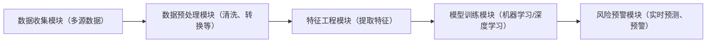

# AI驱动的企业信用风险早期预警系统

> 关键词：AI、企业信用风险、早期预警系统、机器学习、数据分析

> 摘要：本文聚焦于AI驱动的企业信用风险早期预警系统。随着经济环境的日益复杂，企业面临的信用风险不断增加，传统的信用风险评估方法已难以满足需求。AI技术的发展为企业信用风险预警带来了新的解决方案。文章首先介绍了该系统的背景，包括目的、预期读者、文档结构和相关术语。接着阐述了核心概念与联系，详细讲解了核心算法原理及具体操作步骤，并结合数学模型和公式进行说明。通过项目实战展示了系统的代码实现和解读。还探讨了系统的实际应用场景，推荐了相关的工具和资源。最后对系统的未来发展趋势与挑战进行了总结，并提供了常见问题解答和扩展阅读参考资料，旨在为企业和相关从业者提供全面深入的关于AI驱动的企业信用风险早期预警系统的知识。

## 1. 背景介绍 
### 1.1 目的和范围
在当今复杂多变的商业环境中，企业面临着各种各样的信用风险。信用风险不仅可能导致企业的资金损失，还可能影响企业的声誉和市场竞争力。传统的企业信用风险评估方法往往依赖于有限的财务数据和主观判断，难以准确及时地发现潜在的信用风险。本文章旨在介绍AI驱动的企业信用风险早期预警系统，探讨其原理、实现方法和应用场景，帮助企业更好地管理信用风险。

本系统的范围涵盖了从数据收集、预处理、模型训练到风险预警的整个流程。通过利用AI技术，如机器学习和深度学习算法，系统可以对企业的多源数据进行分析，提前发现潜在的信用风险，并及时发出预警信号。

### 1.2 预期读者
本文的预期读者包括企业的管理人员、信用风险管理部门的工作人员、金融机构的信贷分析师、数据科学家和对AI技术在信用风险领域应用感兴趣的研究人员。对于企业管理人员来说，了解该系统可以帮助他们更好地管理企业的信用风险，做出更明智的决策；信用风险管理部门的工作人员可以从中学习到新的风险评估方法和技术；金融机构的信贷分析师可以借助该系统提高信贷审批的准确性和效率；数据科学家可以深入研究系统的算法和实现细节；研究人员则可以关注系统的发展趋势和前沿技术。

### 1.3 文档结构概述
本文将按照以下结构进行组织：
- 核心概念与联系：介绍AI驱动的企业信用风险早期预警系统的核心概念和各部分之间的联系，通过文本示意图和Mermaid流程图进行展示。
- 核心算法原理 & 具体操作步骤：详细讲解系统所使用的核心算法原理，并给出具体的操作步骤，同时使用Python源代码进行阐述。
- 数学模型和公式 & 详细讲解 & 举例说明：介绍系统所涉及的数学模型和公式，并进行详细讲解，通过具体例子说明其应用。
- 项目实战：代码实际案例和详细解释说明：通过一个实际的项目案例，展示系统的开发环境搭建、源代码实现和代码解读。
- 实际应用场景：探讨系统在不同领域的实际应用场景。
- 工具和资源推荐：推荐学习该系统相关的工具和资源，包括书籍、在线课程、技术博客、开发工具框架和相关论文著作。
- 总结：未来发展趋势与挑战：对系统的未来发展趋势进行总结，并分析面临的挑战。
- 附录：常见问题与解答：提供常见问题的解答，帮助读者更好地理解系统。
- 扩展阅读 & 参考资料：提供相关的扩展阅读资料和参考书目。

### 1.4 术语表
#### 1.4.1 核心术语定义
- **企业信用风险**：指企业在经营过程中，由于交易对手不能履行或不能按时履行合同义务，而导致企业遭受损失的可能性。
- **早期预警系统**：是一种能够提前发现潜在风险，并及时发出预警信号的系统。
- **AI（人工智能）**：是指计算机系统能够执行通常需要人类智能才能完成的任务，如学习、推理、解决问题等。
- **机器学习**：是AI的一个分支，它使计算机能够通过数据学习模式和规律，而无需明确的编程指令。
- **深度学习**：是机器学习的一个子领域，它使用多层神经网络来学习数据的复杂表示。

#### 1.4.2 相关概念解释
- **多源数据**：指来自不同渠道、不同类型的数据，如财务数据、市场数据、社交媒体数据等。
- **特征工程**：是指从原始数据中提取有用的特征，以提高模型的性能。
- **模型训练**：是指使用训练数据来调整模型的参数，使模型能够更好地拟合数据。
- **风险评估指标**：是指用于评估企业信用风险的量化指标，如违约概率、信用评分等。

#### 1.4.3 缩略词列表
- **AI**：Artificial Intelligence（人工智能）
- **ML**：Machine Learning（机器学习）
- **DL**：Deep Learning（深度学习）
- **PCA**：Principal Component Analysis（主成分分析）
- **LR**：Logistic Regression（逻辑回归）
- **RF**：Random Forest（随机森林）
- **XGBoost**：Extreme Gradient Boosting（极端梯度提升）

## 2. 核心概念与联系 

### 核心概念原理
AI驱动的企业信用风险早期预警系统的核心原理是利用AI技术对企业的多源数据进行分析，挖掘数据中的潜在模式和规律，从而预测企业未来的信用风险。系统主要包括以下几个核心部分：

- **数据收集**：收集企业的多源数据，包括财务数据、市场数据、社交媒体数据等。这些数据可以来自企业内部的数据库、第三方数据提供商、政府部门等。
- **数据预处理**：对收集到的数据进行清洗、转换和归一化等处理，以提高数据的质量和可用性。
- **特征工程**：从预处理后的数据中提取有用的特征，如财务比率、市场指标、社交媒体情绪等。这些特征将作为模型的输入。
- **模型训练**：使用机器学习或深度学习算法对特征数据进行训练，构建信用风险评估模型。常用的算法包括逻辑回归、随机森林、XGBoost等。
- **风险预警**：使用训练好的模型对企业的实时数据进行预测，当预测结果超过设定的阈值时，系统将发出预警信号。

### 架构的文本示意图
```plaintext
+-----------------+
| 数据收集模块    |
| （多源数据）    |
+-----------------+
        |
        v
+-----------------+
| 数据预处理模块  |
| （清洗、转换等）|
+-----------------+
        |
        v
+-----------------+
| 特征工程模块    |
| （提取特征）    |
+-----------------+
        |
        v
+-----------------+
| 模型训练模块    |
| （机器学习/深度学习）|
+-----------------+
        |
        v
+-----------------+
| 风险预警模块    |
| （实时预测、预警）|
+-----------------+
```

### Mermaid流程图


## 3. 核心算法原理 & 具体操作步骤 

### 核心算法原理

#### 逻辑回归（Logistic Regression）
逻辑回归是一种常用的二分类算法，它通过对输入特征进行线性组合，然后使用逻辑函数将线性组合的结果映射到[0, 1]之间的概率值。逻辑回归的数学模型可以表示为：

$$P(y=1|x)=\frac{1}{1 + e^{-(w_0 + w_1x_1 + w_2x_2 + \cdots + w_nx_n)}}$$

其中，$P(y=1|x)$ 表示在给定特征 $x$ 的情况下，样本属于正类（违约）的概率；$w_0, w_1, w_2, \cdots, w_n$ 是模型的参数；$x_1, x_2, \cdots, x_n$ 是输入特征。

#### 随机森林（Random Forest）
随机森林是一种集成学习算法，它由多个决策树组成。在训练过程中，随机森林会随机选择一部分特征和样本进行决策树的训练，然后将多个决策树的结果进行综合。随机森林的优点是能够处理高维数据，并且具有较好的泛化能力。

#### XGBoost
XGBoost是一种梯度提升算法，它通过迭代训练多个弱分类器，将弱分类器组合成一个强分类器。XGBoost在训练过程中使用了二阶泰勒展开来近似损失函数，并且采用了正则化项来防止过拟合。

### 具体操作步骤

#### 步骤1：数据收集
使用Python的`pandas`库读取企业的多源数据，例如：
```python
import pandas as pd

# 读取财务数据
financial_data = pd.read_csv('financial_data.csv')
# 读取市场数据
market_data = pd.read_csv('market_data.csv')
# 合并数据
data = pd.merge(financial_data, market_data, on='company_id')
```

#### 步骤2：数据预处理
对数据进行清洗、缺失值处理和归一化等操作，例如：
```python
# 处理缺失值
data = data.dropna()

# 特征选择
selected_features = ['feature1', 'feature2', 'feature3']
X = data[selected_features]
y = data['default_label']

# 数据归一化
from sklearn.preprocessing import StandardScaler
scaler = StandardScaler()
X_scaled = scaler.fit_transform(X)
```

#### 步骤3：特征工程
可以使用主成分分析（PCA）等方法进行特征降维，例如：
```python
from sklearn.decomposition import PCA
pca = PCA(n_components=2)
X_pca = pca.fit_transform(X_scaled)
```

#### 步骤4：模型训练
使用逻辑回归、随机森林和XGBoost等算法进行模型训练，例如：
```python
from sklearn.model_selection import train_test_split
from sklearn.linear_model import LogisticRegression
from sklearn.ensemble import RandomForestClassifier
import xgboost as xgb

# 划分训练集和测试集
X_train, X_test, y_train, y_test = train_test_split(X_pca, y, test_size=0.2, random_state=42)

# 逻辑回归模型
lr_model = LogisticRegression()
lr_model.fit(X_train, y_train)

# 随机森林模型
rf_model = RandomForestClassifier()
rf_model.fit(X_train, y_train)

# XGBoost模型
xgb_model = xgb.XGBClassifier()
xgb_model.fit(X_train, y_train)
```

#### 步骤5：风险预警
使用训练好的模型对新数据进行预测，当预测结果超过设定的阈值时，发出预警信号，例如：
```python
# 新数据预测
new_data = [[1.2, 0.8]]
new_data_scaled = scaler.transform(new_data)
new_data_pca = pca.transform(new_data_scaled)

# 逻辑回归预测
lr_prediction = lr_model.predict_proba(new_data_pca)[:, 1]
if lr_prediction > 0.5:
    print("逻辑回归发出预警信号")

# 随机森林预测
rf_prediction = rf_model.predict_proba(new_data_pca)[:, 1]
if rf_prediction > 0.5:
    print("随机森林发出预警信号")

# XGBoost预测
xgb_prediction = xgb_model.predict_proba(new_data_pca)[:, 1]
if xgb_prediction > 0.5:
    print("XGBoost发出预警信号")
```

## 4. 数学模型和公式 & 详细讲解 & 举例说明 

### 逻辑回归的数学模型和公式
逻辑回归的数学模型为：

$$P(y=1|x)=\frac{1}{1 + e^{-(w_0 + w_1x_1 + w_2x_2 + \cdots + w_nx_n)}}$$

其中，$P(y=1|x)$ 表示在给定特征 $x$ 的情况下，样本属于正类（违约）的概率；$w_0, w_1, w_2, \cdots, w_n$ 是模型的参数；$x_1, x_2, \cdots, x_n$ 是输入特征。

逻辑回归的损失函数通常使用对数损失函数：

$$L(w)=-\frac{1}{m}\sum_{i=1}^{m}[y^{(i)}\log(P(y^{(i)}=1|x^{(i)}))+(1 - y^{(i)})\log(1 - P(y^{(i)}=1|x^{(i)}))]$$

其中，$m$ 是样本数量；$y^{(i)}$ 是第 $i$ 个样本的真实标签；$P(y^{(i)}=1|x^{(i)})$ 是第 $i$ 个样本属于正类的预测概率。

### 详细讲解
逻辑回归的目标是通过最小化损失函数 $L(w)$ 来估计模型的参数 $w$。可以使用梯度下降法等优化算法来求解参数。

梯度下降法的更新公式为：

$$w_j := w_j - \alpha\frac{\partial L(w)}{\partial w_j}$$

其中，$\alpha$ 是学习率；$\frac{\partial L(w)}{\partial w_j}$ 是损失函数 $L(w)$ 对参数 $w_j$ 的偏导数。

### 举例说明
假设我们有一个简单的二分类问题，输入特征只有一个 $x$，逻辑回归模型可以表示为：

$$P(y=1|x)=\frac{1}{1 + e^{-(w_0 + w_1x)}}$$

我们有以下训练数据：

| $x$ | $y$ |
| --- | --- |
| 1   | 1   |
| 2   | 1   |
| 3   | 0   |
| 4   | 0   |

首先，初始化参数 $w_0 = 0$，$w_1 = 0$，学习率 $\alpha = 0.1$。

计算损失函数 $L(w)$ 对参数 $w_0$ 和 $w_1$ 的偏导数：

$$\frac{\partial L(w)}{\partial w_0}=-\frac{1}{m}\sum_{i=1}^{m}[y^{(i)} - P(y^{(i)}=1|x^{(i)})]$$

$$\frac{\partial L(w)}{\partial w_1}=-\frac{1}{m}\sum_{i=1}^{m}[y^{(i)} - P(y^{(i)}=1|x^{(i)})]x^{(i)}$$

然后，使用梯度下降法更新参数：

$$w_0 := w_0 - \alpha\frac{\partial L(w)}{\partial w_0}$$

$$w_1 := w_1 - \alpha\frac{\partial L(w)}{\partial w_1}$$

重复上述步骤，直到损失函数收敛。

### 随机森林和XGBoost的数学模型和公式
随机森林和XGBoost的数学模型相对复杂，这里简单介绍一下。

随机森林是由多个决策树组成的集成模型，每个决策树的训练过程可以使用CART（Classification and Regression Trees）算法。决策树的节点划分通常使用基尼不纯度或信息增益等指标。

XGBoost是一种梯度提升算法，它的目标是最小化损失函数：

$$L(\phi)=\sum_{i=1}^{n}l(y_i, \hat{y}_i)+\sum_{k=1}^{K}\Omega(f_k)$$

其中，$l(y_i, \hat{y}_i)$ 是第 $i$ 个样本的损失函数；$\hat{y}_i$ 是第 $i$ 个样本的预测值；$\Omega(f_k)$ 是第 $k$ 个弱分类器的正则化项。

XGBoost在训练过程中使用了二阶泰勒展开来近似损失函数：

$$L^{(t)}(\phi)\approx\sum_{i=1}^{n}[g_if_t(x_i)+\frac{1}{2}h_if_t^2(x_i)]+\Omega(f_t)$$

其中，$g_i$ 和 $h_i$ 分别是损失函数 $l(y_i, \hat{y}_i)$ 对 $\hat{y}_i$ 的一阶和二阶导数。

## 5. 项目实战：代码实际案例和详细解释说明 

### 5.1  开发环境搭建
在进行项目实战之前，需要搭建开发环境。以下是具体步骤：

#### 安装Python
可以从Python官方网站（https://www.python.org/downloads/）下载并安装Python 3.x版本。

#### 安装必要的库
使用`pip`命令安装必要的库，例如：
```sh
pip install pandas numpy scikit-learn xgboost matplotlib
```

### 5.2  源代码详细实现和代码解读
以下是一个完整的AI驱动的企业信用风险早期预警系统的代码示例：

```python
import pandas as pd
import numpy as np
from sklearn.model_selection import train_test_split
from sklearn.preprocessing import StandardScaler
from sklearn.decomposition import PCA
from sklearn.linear_model import LogisticRegression
from sklearn.ensemble import RandomForestClassifier
import xgboost as xgb
import matplotlib.pyplot as plt

# 步骤1：数据收集
# 假设我们有一个包含企业财务数据和违约标签的CSV文件
data = pd.read_csv('credit_risk_data.csv')

# 步骤2：数据预处理
# 处理缺失值
data = data.dropna()

# 特征选择
selected_features = ['feature1', 'feature2', 'feature3', 'feature4']
X = data[selected_features]
y = data['default_label']

# 数据归一化
scaler = StandardScaler()
X_scaled = scaler.fit_transform(X)

# 步骤3：特征工程
# 使用主成分分析进行特征降维
pca = PCA(n_components=2)
X_pca = pca.fit_transform(X_scaled)

# 步骤4：模型训练
# 划分训练集和测试集
X_train, X_test, y_train, y_test = train_test_split(X_pca, y, test_size=0.2, random_state=42)

# 逻辑回归模型
lr_model = LogisticRegression()
lr_model.fit(X_train, y_train)

# 随机森林模型
rf_model = RandomForestClassifier()
rf_model.fit(X_train, y_train)

# XGBoost模型
xgb_model = xgb.XGBClassifier()
xgb_model.fit(X_train, y_train)

# 步骤5：模型评估
from sklearn.metrics import accuracy_score, precision_score, recall_score, f1_score

# 逻辑回归模型评估
lr_pred = lr_model.predict(X_test)
lr_accuracy = accuracy_score(y_test, lr_pred)
lr_precision = precision_score(y_test, lr_pred)
lr_recall = recall_score(y_test, lr_pred)
lr_f1 = f1_score(y_test, lr_pred)

# 随机森林模型评估
rf_pred = rf_model.predict(X_test)
rf_accuracy = accuracy_score(y_test, rf_pred)
rf_precision = precision_score(y_test, rf_pred)
rf_recall = recall_score(y_test, rf_pred)
rf_f1 = f1_score(y_test, rf_pred)

# XGBoost模型评估
xgb_pred = xgb_model.predict(X_test)
xgb_accuracy = accuracy_score(y_test, xgb_pred)
xgb_precision = precision_score(y_test, xgb_pred)
xgb_recall = recall_score(y_test, xgb_pred)
xgb_f1 = f1_score(y_test, xgb_pred)

# 输出评估结果
print("逻辑回归模型评估结果：")
print(f"准确率：{lr_accuracy}")
print(f"精确率：{lr_precision}")
print(f"召回率：{lr_recall}")
print(f"F1值：{lr_f1}")

print("随机森林模型评估结果：")
print(f"准确率：{rf_accuracy}")
print(f"精确率：{rf_precision}")
print(f"召回率：{rf_recall}")
print(f"F1值：{rf_f1}")

print("XGBoost模型评估结果：")
print(f"准确率：{xgb_accuracy}")
print(f"精确率：{xgb_precision}")
print(f"召回率：{xgb_recall}")
print(f"F1值：{xgb_f1}")

# 步骤6：可视化
# 绘制散点图展示数据分布
plt.scatter(X_pca[:, 0], X_pca[:, 1], c=y, cmap='viridis')
plt.xlabel('主成分1')
plt.ylabel('主成分2')
plt.title('数据分布')
plt.show()
```

### 5.3  代码解读与分析
- **数据收集**：使用`pandas`库读取CSV文件中的企业信用风险数据。
- **数据预处理**：处理缺失值，选择特征，并使用`StandardScaler`对数据进行归一化处理。
- **特征工程**：使用`PCA`进行特征降维，将数据转换为二维特征。
- **模型训练**：使用逻辑回归、随机森林和XGBoost三种算法进行模型训练。
- **模型评估**：使用`accuracy_score`、`precision_score`、`recall_score`和`f1_score`等指标对模型进行评估。
- **可视化**：使用`matplotlib`库绘制散点图，展示数据的分布情况。

通过以上步骤，我们可以构建一个完整的AI驱动的企业信用风险早期预警系统，并对模型的性能进行评估和可视化展示。

## 6. 实际应用场景 
### 金融机构信贷审批
金融机构在进行信贷审批时，需要评估借款人的信用风险。AI驱动的企业信用风险早期预警系统可以帮助金融机构更准确地评估企业的信用状况，提前发现潜在的违约风险。系统可以分析企业的财务数据、市场数据和社交媒体数据等多源信息，为信贷审批提供更全面的依据。例如，银行在审批企业贷款时，可以使用该系统对企业的信用风险进行评估，根据评估结果决定是否发放贷款以及贷款的额度和利率。

### 供应链金融风险管理
在供应链金融中，核心企业的信用风险会影响整个供应链的稳定性。AI驱动的企业信用风险早期预警系统可以对供应链上的企业进行实时监测，及时发现核心企业的信用风险变化，并发出预警信号。供应链金融机构可以根据预警信号采取相应的措施，如调整融资额度、加强担保要求等，以降低供应链金融风险。例如，在汽车供应链中，系统可以监测汽车制造商的信用风险，当制造商出现信用风险时，及时通知供应商和金融机构，采取相应的应对措施。

### 投资决策辅助
投资者在进行投资决策时，需要考虑企业的信用风险。AI驱动的企业信用风险早期预警系统可以为投资者提供企业信用风险的评估结果，帮助投资者做出更明智的投资决策。投资者可以根据系统的预警信号，及时调整投资组合，降低投资风险。例如，股票投资者可以使用该系统对上市公司的信用风险进行评估，避免投资信用风险较高的企业。

### 企业风险管理
企业自身也可以使用AI驱动的企业信用风险早期预警系统来管理内部的信用风险。系统可以对企业的客户、供应商和合作伙伴的信用状况进行监测，及时发现潜在的信用风险，并采取相应的措施，如调整信用政策、加强账款催收等。例如，企业在与新客户签订合同前，可以使用该系统对客户的信用风险进行评估，决定是否与该客户合作以及合作的方式和条件。

## 7. 工具和资源推荐
### 7.1 学习资源推荐
#### 7.1.1 书籍推荐
- 《Python机器学习》：本书介绍了Python在机器学习领域的应用，包括数据预处理、模型训练和评估等内容，适合初学者入门。
- 《深度学习》：由深度学习领域的三位顶级专家编写，系统介绍了深度学习的理论和实践，是深度学习领域的经典著作。
- 《信用风险评估与管理》：本书详细介绍了信用风险评估的方法和技术，包括传统的信用评分模型和现代的机器学习方法，对于理解企业信用风险评估有很大帮助。

#### 7.1.2 在线课程
- Coursera上的“机器学习”课程：由斯坦福大学教授Andrew Ng讲授，是机器学习领域的经典课程，适合初学者学习。
- edX上的“深度学习”课程：由深度学习领域的专家授课，深入介绍了深度学习的原理和应用。
- 中国大学MOOC上的“信用风险管理”课程：由国内高校的教授讲授，系统介绍了信用风险管理的理论和实践。

#### 7.1.3 技术博客和网站
- Towards Data Science：是一个专注于数据科学和机器学习的技术博客，上面有很多关于AI和信用风险评估的文章。
- Kaggle：是一个数据科学竞赛平台，上面有很多关于信用风险评估的数据集和优秀的解决方案，可以学习到很多实践经验。
- 金融界网站：提供了丰富的金融市场数据和分析报告，可以了解企业的信用风险状况和市场动态。

### 7.2 开发工具框架推荐
#### 7.2.1 IDE和编辑器
- PyCharm：是一款专业的Python集成开发环境，具有强大的代码编辑、调试和项目管理功能。
- Jupyter Notebook：是一个交互式的编程环境，适合进行数据探索和模型实验。
- Visual Studio Code：是一款轻量级的代码编辑器，支持多种编程语言和插件，具有良好的扩展性。

#### 7.2.2 调试和性能分析工具
- Py-Spy：是一个Python性能分析工具，可以帮助开发者找出代码中的性能瓶颈。
- TensorBoard：是TensorFlow的可视化工具，可以用于可视化模型的训练过程和性能指标。
- Scikit-learn的交叉验证和网格搜索功能：可以用于模型的调优和评估，提高模型的性能。

#### 7.2.3 相关框架和库
- Scikit-learn：是一个常用的机器学习库，提供了丰富的机器学习算法和工具，如分类、回归、聚类等。
- TensorFlow和PyTorch：是深度学习领域的两大主流框架，提供了高效的深度学习模型训练和部署功能。
- XGBoost和LightGBM：是常用的梯度提升算法库，在信用风险评估等领域有很好的应用效果。

### 7.3 相关论文著作推荐
#### 7.3.1 经典论文
- “Credit Risk Modeling Using the Merton Model”：介绍了基于Merton模型的信用风险评估方法，是信用风险评估领域的经典论文。
- “Random Forests”：介绍了随机森林算法的原理和应用，是随机森林领域的经典论文。
- “Gradient Boosting Machines, a Tutorial”：对梯度提升算法进行了详细的介绍和讲解，是梯度提升领域的经典论文。

#### 7.3.2 最新研究成果
- 可以关注顶级学术会议如KDD（Knowledge Discovery and Data Mining）、ICML（International Conference on Machine Learning）和NeurIPS（Neural Information Processing Systems）上的相关研究成果，了解AI在信用风险评估领域的最新技术和方法。
- 也可以关注学术期刊如《Journal of Financial Economics》、《Journal of Banking and Finance》和《Management Science》上的相关论文，获取最新的研究动态。

#### 7.3.3 应用案例分析
- 可以参考一些金融机构和企业的实际应用案例，了解AI驱动的企业信用风险早期预警系统在实际中的应用效果和经验教训。例如，一些银行的信贷风险管理报告、企业的风险管理案例研究等。

## 8. 总结：未来发展趋势与挑战
### 未来发展趋势
#### 多模态数据融合
未来的企业信用风险早期预警系统将不仅仅依赖于传统的财务数据，还会融合更多的多模态数据，如社交媒体数据、物联网数据、卫星图像数据等。通过对多模态数据的分析，可以更全面地了解企业的经营状况和信用风险。例如，社交媒体数据可以反映企业的品牌形象和市场口碑，物联网数据可以实时监测企业的生产设备运行状况，卫星图像数据可以观察企业的厂房建设和土地使用情况等。

#### 深度学习和强化学习的应用
深度学习和强化学习技术将在企业信用风险早期预警系统中得到更广泛的应用。深度学习可以自动学习数据的复杂特征和模式，提高模型的预测准确性；强化学习可以通过与环境的交互不断优化模型的决策策略，实现更智能的风险预警。例如，使用深度学习模型对企业的文本数据进行情感分析，使用强化学习算法动态调整风险预警的阈值。

#### 实时监测和动态预警
随着数据采集技术和计算能力的不断提高，企业信用风险早期预警系统将实现实时监测和动态预警。系统可以实时获取企业的最新数据，及时发现信用风险的变化，并发出动态的预警信号。例如，在金融市场发生剧烈波动时，系统可以实时监测企业的市场风险暴露情况，并及时调整风险评估结果。

#### 可解释性和透明度
随着AI技术在企业信用风险评估中的应用越来越广泛，模型的可解释性和透明度将成为重要的发展方向。监管机构和企业用户需要了解模型的决策过程和依据，以便更好地信任和应用模型。未来的系统将注重模型的可解释性设计，采用可解释的机器学习算法和可视化技术，向用户展示模型的决策逻辑和影响因素。

### 挑战
#### 数据质量和隐私问题
企业信用风险早期预警系统需要大量的高质量数据来进行模型训练和预测。然而，实际中数据可能存在缺失、错误、不一致等问题，影响模型的性能。此外，数据隐私也是一个重要的问题，企业的敏感数据需要得到妥善的保护，防止数据泄露和滥用。解决数据质量和隐私问题需要建立完善的数据治理体系，加强数据清洗和预处理，采用加密和匿名化技术保护数据隐私。

#### 模型的泛化能力和稳定性
由于企业的经营环境和信用风险具有复杂性和不确定性，模型的泛化能力和稳定性是一个挑战。模型在训练数据上表现良好，但在新的数据上可能出现过拟合或欠拟合的问题。为了提高模型的泛化能力和稳定性，需要采用交叉验证、正则化等技术，同时不断更新和优化模型，以适应不同的市场环境和企业特征。

#### 技术人才短缺
AI驱动的企业信用风险早期预警系统需要具备数据分析、机器学习、深度学习等多领域知识的技术人才。然而，目前市场上这类复合型人才相对短缺，企业和机构难以招聘到合适的人才来开发和维护系统。解决技术人才短缺问题需要加强相关专业的教育和培训，培养更多的复合型人才。

#### 监管和合规要求
随着AI技术在金融领域的应用越来越广泛，监管机构对AI系统的监管和合规要求也越来越严格。企业信用风险早期预警系统需要满足相关的监管要求，如模型的可解释性、公平性、安全性等。企业和机构需要加强与监管机构的沟通和合作，确保系统的开发和应用符合监管要求。

## 9. 附录：常见问题与解答
### 问题1：AI驱动的企业信用风险早期预警系统与传统的信用风险评估方法有什么区别？
答：传统的信用风险评估方法主要依赖于有限的财务数据和主观判断，评估结果可能存在一定的局限性。而AI驱动的企业信用风险早期预警系统可以利用多源数据，如财务数据、市场数据、社交媒体数据等，通过机器学习和深度学习算法挖掘数据中的潜在模式和规律，提高风险评估的准确性和及时性。此外，系统还可以实现实时监测和动态预警，及时发现潜在的信用风险。

### 问题2：系统需要哪些类型的数据？
答：系统需要多源数据，包括但不限于以下类型：
- 财务数据：如资产负债表、利润表、现金流量表等。
- 市场数据：如股票价格、债券收益率、行业指数等。
- 社交媒体数据：如企业的社交媒体评论、舆情信息等。
- 企业运营数据：如生产数据、销售数据、客户数据等。

### 问题3：如何选择合适的机器学习算法？
答：选择合适的机器学习算法需要考虑以下因素：
- 数据类型和规模：不同的算法对数据类型和规模有不同的要求。例如，逻辑回归适合处理线性可分的数据，而深度学习算法适合处理大规模的复杂数据。
- 模型的可解释性：如果需要对模型的决策过程进行解释，建议选择可解释性较强的算法，如逻辑回归、决策树等。
- 模型的性能：可以通过交叉验证等方法比较不同算法的性能，选择性能最优的算法。

### 问题4：系统的预警阈值如何确定？
答：预警阈值的确定需要综合考虑多个因素，如企业的风险承受能力、市场环境、历史数据等。可以通过以下方法确定预警阈值：
- 经验法：根据历史经验和行业标准确定预警阈值。
- 统计分析法：通过对历史数据的统计分析，确定合理的预警阈值。
- 优化算法：使用优化算法，如遗传算法、模拟退火算法等，寻找最优的预警阈值。

### 问题5：系统的准确性如何保证？
答：保证系统的准确性需要从以下几个方面入手：
- 数据质量：确保数据的准确性、完整性和一致性，对数据进行清洗和预处理。
- 特征工程：选择合适的特征，并进行特征提取和转换，提高特征的质量和相关性。
- 模型选择和调优：选择合适的机器学习算法，并进行模型调优，提高模型的性能。
- 模型评估和验证：使用交叉验证、测试集等方法对模型进行评估和验证，确保模型的泛化能力和稳定性。

## 10. 扩展阅读 & 参考资料
### 扩展阅读
- 《人工智能时代的金融风险管理》：深入探讨了人工智能在金融风险管理领域的应用和挑战。
- 《数据驱动的信用风险评估》：详细介绍了数据驱动的信用风险评估方法和技术。
- 《机器学习实战》：通过实际案例介绍了机器学习的应用，帮助读者更好地理解和掌握机器学习算法。

### 参考资料
- 相关的学术论文和研究报告，如KDD、ICML、NeurIPS等会议的论文，《Journal of Financial Economics》、《Journal of Banking and Finance》等期刊的文章。
- 金融机构和企业的信用风险管理报告和案例分析。
- 相关的技术文档和手册，如Scikit-learn、TensorFlow、XGBoost等库的官方文档。