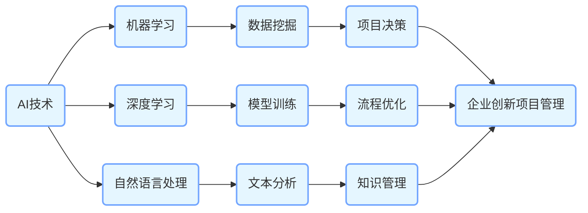

# AI驱动的企业创新项目管理：从立项到商业化

> 关键词：AI驱动、企业创新项目管理、立项、商业化、项目全流程

> 摘要：本文围绕AI驱动的企业创新项目管理，从立项到商业化的全流程展开深入探讨。详细介绍了该领域的背景知识，阐述了核心概念及联系，剖析了核心算法原理和具体操作步骤，运用数学模型和公式进行理论支撑，并通过项目实战案例展示代码实现与解读。同时，分析了实际应用场景，推荐了相关的工具和资源，最后总结了未来发展趋势与挑战，解答了常见问题并提供了扩展阅读和参考资料，旨在为企业在AI驱动下的创新项目管理提供全面且深入的指导。

## 1. 背景介绍 
### 1.1 目的和范围
在当今数字化时代，人工智能（AI）技术迅猛发展，为企业带来了前所未有的创新机遇。企业希望借助AI技术推动创新项目的开展，实现业务的增长和转型。本文的目的在于为企业提供一套完整的AI驱动的企业创新项目管理方案，涵盖从项目立项到商业化的全过程。通过对项目管理各个阶段的深入分析和实践指导，帮助企业更好地利用AI技术，提高创新项目的成功率和商业价值。

本文的范围包括AI驱动的企业创新项目管理的基本概念、核心算法原理、数学模型、项目实战案例、实际应用场景以及相关工具和资源推荐等方面。旨在为企业管理者、项目负责人、技术人员等提供全面的知识和实践指导。

### 1.2 预期读者
本文的预期读者主要包括以下几类人群：
1. **企业管理者**：负责企业战略规划和项目决策，希望了解如何利用AI技术推动企业创新项目的开展，提高企业的竞争力和商业价值。
2. **项目负责人**：负责创新项目的具体实施和管理，需要掌握AI驱动的项目管理方法和技巧，确保项目按时、按质量要求完成。
3. **技术人员**：对AI技术有一定的了解和实践经验，希望深入学习如何将AI技术应用到企业创新项目中，解决实际问题。
4. **投资者**：关注企业的创新能力和发展潜力，希望了解AI驱动的企业创新项目的投资价值和风险。

### 1.3 文档结构概述
本文共分为10个部分，具体结构如下：
1. **背景介绍**：介绍本文的目的和范围、预期读者、文档结构概述以及相关术语表。
2. **核心概念与联系**：阐述AI驱动的企业创新项目管理的核心概念和原理，通过文本示意图和Mermaid流程图展示各概念之间的联系。
3. **核心算法原理 & 具体操作步骤**：介绍AI驱动的企业创新项目管理中常用的核心算法原理，并使用Python源代码详细阐述具体操作步骤。
4. **数学模型和公式 & 详细讲解 & 举例说明**：运用数学模型和公式对AI驱动的企业创新项目管理进行理论支撑，并通过具体例子进行详细讲解。
5. **项目实战：代码实际案例和详细解释说明**：通过一个实际的项目案例，展示AI驱动的企业创新项目管理的代码实现和详细解释。
6. **实际应用场景**：分析AI驱动的企业创新项目管理在不同行业和领域的实际应用场景。
7. **工具和资源推荐**：推荐相关的学习资源、开发工具框架和论文著作，帮助读者进一步深入学习和实践。
8. **总结：未来发展趋势与挑战**：总结AI驱动的企业创新项目管理的未来发展趋势和面临的挑战。
9. **附录：常见问题与解答**：解答读者在学习和实践过程中常见的问题。
10. **扩展阅读 & 参考资料**：提供相关的扩展阅读材料和参考资料，方便读者进一步研究和学习。

### 1.4 术语表
#### 1.4.1 核心术语定义
1. **AI驱动**：指在企业创新项目管理过程中，充分利用人工智能技术，如机器学习、深度学习、自然语言处理等，来提高项目管理的效率和质量，实现项目的创新和价值创造。
2. **企业创新项目管理**：是指企业为了实现创新目标，对创新项目进行规划、组织、协调、控制和评价的一系列活动。
3. **立项**：是指企业在开展创新项目之前，对项目的可行性、必要性、目标、范围、预算等进行全面的评估和论证，确定项目是否值得开展的过程。
4. **商业化**：是指将创新项目的成果转化为商业产品或服务，推向市场，实现经济效益和社会效益的过程。

#### 1.4.2 相关概念解释
1. **机器学习**：是一门多领域交叉学科，涉及概率论、统计学、逼近论、凸分析、算法复杂度理论等多门学科。它专门研究计算机怎样模拟或实现人类的学习行为，以获取新的知识或技能，重新组织已有的知识结构使之不断改善自身的性能。
2. **深度学习**：是机器学习的一个分支领域，它是一种基于对数据进行表征学习的方法。深度学习通过构建具有很多层的神经网络模型，自动从大量数据中学习特征和模式，从而实现对数据的分类、预测、生成等任务。
3. **自然语言处理**：是计算机科学与人工智能领域中的一个重要方向。它研究能实现人与计算机之间用自然语言进行有效通信的各种理论和方法。自然语言处理包括自然语言理解和自然语言生成两个方面，旨在让计算机能够理解、分析和生成人类语言。

#### 1.4.3 缩略词列表
1. **AI**：Artificial Intelligence，人工智能
2. **ML**：Machine Learning，机器学习
3. **DL**：Deep Learning，深度学习
4. **NLP**：Natural Language Processing，自然语言处理

## 2. 核心概念与联系 
### 核心概念原理
AI驱动的企业创新项目管理涉及多个核心概念，主要包括AI技术、企业创新项目和项目管理。

AI技术是推动企业创新项目管理的关键驱动力。通过机器学习、深度学习、自然语言处理等AI技术，可以对项目数据进行分析和挖掘，提供决策支持，优化项目流程，提高项目的效率和质量。

企业创新项目是企业为了实现创新目标而开展的项目。创新项目通常具有不确定性、风险性和创新性等特点，需要采用灵活的项目管理方法和策略。

项目管理是对企业创新项目进行规划、组织、协调、控制和评价的过程。在AI驱动下，项目管理可以利用AI技术实现自动化、智能化，提高项目管理的效率和效果。

### 架构的文本示意图
```plaintext
              AI技术
             /   |   \
            /    |    \
  机器学习  深度学习  自然语言处理
            |       |       |
            |       |       |
  数据挖掘  模型训练  文本分析
            |       |       |
            |       |       |
        项目决策  流程优化  知识管理
            |       |       |
            |       |       |
       企业创新项目管理
```

### Mermaid流程图


## 3. 核心算法原理 & 具体操作步骤 
### 核心算法原理
在AI驱动的企业创新项目管理中，常用的核心算法包括决策树算法、神经网络算法和遗传算法等。下面分别介绍这些算法的原理。

#### 决策树算法
决策树是一种基于树结构进行决策的算法。它通过对数据进行递归划分，构建一棵决策树，每个内部节点表示一个属性上的测试，每个分支表示一个测试输出，每个叶节点表示一个类别或值。决策树算法的核心思想是通过对数据的分析和学习，找到最优的划分属性和划分点，使得划分后的子集尽可能纯净。

#### 神经网络算法
神经网络是一种模仿人类神经系统的计算模型。它由大量的神经元组成，神经元之间通过连接权重进行信息传递。神经网络通过对输入数据进行多次非线性变换，学习数据的特征和模式。神经网络算法的核心思想是通过调整连接权重，使得神经网络的输出与期望输出之间的误差最小。

#### 遗传算法
遗传算法是一种基于自然选择和遗传机制的优化算法。它通过模拟生物进化过程，对一组候选解进行选择、交叉和变异操作，不断生成新的候选解，直到找到最优解。遗传算法的核心思想是通过适者生存的原则，不断优化候选解的质量。

### 具体操作步骤（以决策树算法为例）
下面使用Python的`scikit-learn`库实现一个简单的决策树分类器，并详细解释具体操作步骤。

```python
# 步骤1：导入必要的库
from sklearn.datasets import load_iris
from sklearn.model_selection import train_test_split
from sklearn.tree import DecisionTreeClassifier
from sklearn.metrics import accuracy_score

# 步骤2：加载数据集
iris = load_iris()
X = iris.data  # 特征数据
y = iris.target  # 标签数据

# 步骤3：划分训练集和测试集
X_train, X_test, y_train, y_test = train_test_split(X, y, test_size=0.3, random_state=42)

# 步骤4：创建决策树分类器
clf = DecisionTreeClassifier()

# 步骤5：训练模型
clf.fit(X_train, y_train)

# 步骤6：预测测试集
y_pred = clf.predict(X_test)

# 步骤7：评估模型
accuracy = accuracy_score(y_test, y_pred)
print(f"模型准确率: {accuracy}")
```

### 代码解释
1. **导入必要的库**：导入`scikit-learn`库中的相关模块，用于加载数据集、划分训练集和测试集、创建决策树分类器和评估模型。
2. **加载数据集**：使用`load_iris`函数加载鸢尾花数据集，将特征数据存储在`X`中，标签数据存储在`y`中。
3. **划分训练集和测试集**：使用`train_test_split`函数将数据集划分为训练集和测试集，其中测试集占总数据集的30%。
4. **创建决策树分类器**：使用`DecisionTreeClassifier`类创建一个决策树分类器。
5. **训练模型**：使用训练集数据对决策树分类器进行训练。
6. **预测测试集**：使用训练好的模型对测试集数据进行预测。
7. **评估模型**：使用`accuracy_score`函数计算模型的准确率，并打印输出。

## 4. 数学模型和公式 & 详细讲解 & 举例说明 
### 信息熵和信息增益
在决策树算法中，常用信息熵和信息增益来选择最优的划分属性。

#### 信息熵
信息熵是衡量数据不确定性的指标。对于一个分类问题，设数据集 $D$ 包含 $n$ 个类别，第 $i$ 个类别的样本数为 $n_i$，则数据集 $D$ 的信息熵定义为：

$$
H(D)=-\sum_{i=1}^{n}p_i\log_2p_i
$$

其中，$p_i=\frac{n_i}{|D|}$ 表示第 $i$ 个类别的样本在数据集 $D$ 中所占的比例。

#### 信息增益
信息增益是指在使用某个属性进行划分后，数据集的信息熵减少的程度。设属性 $A$ 有 $v$ 个不同的取值 $\{a_1,a_2,\cdots,a_v\}$，使用属性 $A$ 对数据集 $D$ 进行划分后，得到 $v$ 个子数据集 $\{D_1,D_2,\cdots,D_v\}$，则属性 $A$ 相对于数据集 $D$ 的信息增益定义为：

$$
Gain(D,A)=H(D)-\sum_{v=1}^{V}\frac{|D_v|}{|D|}H(D_v)
$$

### 详细讲解
信息熵的取值范围在 $[0,\log_2n]$ 之间，当数据集 $D$ 中的样本都属于同一个类别时，信息熵为 0，表示数据的不确定性最小；当数据集 $D$ 中的样本均匀分布在各个类别中时，信息熵最大，表示数据的不确定性最大。

信息增益越大，说明使用该属性进行划分后，数据集的信息熵减少得越多，数据的纯度越高。因此，在决策树算法中，通常选择信息增益最大的属性作为划分属性。

### 举例说明
假设有一个数据集 $D$ 包含 10 个样本，分为 2 个类别，其中类别 1 有 6 个样本，类别 2 有 4 个样本。则数据集 $D$ 的信息熵为：

$$
p_1=\frac{6}{10}=0.6, p_2=\frac{4}{10}=0.4
$$

$$
H(D)=-0.6\log_20.6 - 0.4\log_20.4\approx0.971
$$

假设属性 $A$ 有 2 个不同的取值 $a_1$ 和 $a_2$，使用属性 $A$ 对数据集 $D$ 进行划分后，得到 2 个子数据集 $D_1$ 和 $D_2$，其中 $D_1$ 包含 4 个样本，类别 1 有 3 个样本，类别 2 有 1 个样本；$D_2$ 包含 6 个样本，类别 1 有 3 个样本，类别 2 有 3 个样本。则子数据集 $D_1$ 和 $D_2$ 的信息熵分别为：

$$
p_{11}=\frac{3}{4}=0.75, p_{12}=\frac{1}{4}=0.25
$$

$$
H(D_1)=-0.75\log_20.75 - 0.25\log_20.25\approx0.811
$$

$$
p_{21}=\frac{3}{6}=0.5, p_{22}=\frac{3}{6}=0.5
$$

$$
H(D_2)=-0.5\log_20.5 - 0.5\log_20.5 = 1
$$

属性 $A$ 相对于数据集 $D$ 的信息增益为：

$$
Gain(D,A)=H(D)-\frac{4}{10}H(D_1)-\frac{6}{10}H(D_2)
$$

$$
=0.971 - \frac{4}{10}\times0.811 - \frac{6}{10}\times1\approx0.047
$$

## 5. 项目实战：代码实际案例和详细解释说明 
### 5.1  开发环境搭建
在进行项目实战之前，需要搭建相应的开发环境。以下是具体的搭建步骤：

#### 安装Python
首先，需要安装Python编程语言。可以从Python官方网站（https://www.python.org/downloads/）下载适合自己操作系统的Python安装包，并按照安装向导进行安装。

#### 安装开发工具
推荐使用Anaconda作为Python的开发环境管理工具。Anaconda包含了Python解释器、常用的科学计算库和开发工具，可以方便地进行环境管理和包安装。可以从Anaconda官方网站（https://www.anaconda.com/products/individual）下载适合自己操作系统的Anaconda安装包，并按照安装向导进行安装。

#### 创建虚拟环境
为了避免不同项目之间的依赖冲突，建议使用虚拟环境。可以使用Anaconda的`conda`命令创建一个新的虚拟环境：

```bash
conda create -n ai_project python=3.8
```

#### 激活虚拟环境
创建好虚拟环境后，需要激活该环境：

```bash
conda activate ai_project
```

#### 安装必要的库
在虚拟环境中安装项目所需的必要库，如`scikit-learn`、`pandas`、`numpy`等：

```bash
conda install scikit-learn pandas numpy
```

### 5.2  源代码详细实现和代码解读
下面以一个简单的客户流失预测项目为例，展示AI驱动的企业创新项目管理的代码实现和详细解读。

#### 项目背景
某电信公司希望通过分析客户的历史数据，预测客户是否会流失，以便采取相应的措施进行客户挽留。

#### 数据集
使用`scikit-learn`库中的`make_classification`函数生成一个模拟的客户流失数据集。

#### 代码实现

```python
import numpy as np
import pandas as pd
from sklearn.datasets import make_classification
from sklearn.model_selection import train_test_split
from sklearn.ensemble import RandomForestClassifier
from sklearn.metrics import accuracy_score, confusion_matrix

# 步骤1：生成数据集
X, y = make_classification(n_samples=1000, n_features=10, n_informative=5, n_redundant=0, random_state=42)

# 步骤2：划分训练集和测试集
X_train, X_test, y_train, y_test = train_test_split(X, y, test_size=0.2, random_state=42)

# 步骤3：创建随机森林分类器
clf = RandomForestClassifier(n_estimators=100, random_state=42)

# 步骤4：训练模型
clf.fit(X_train, y_train)

# 步骤5：预测测试集
y_pred = clf.predict(X_test)

# 步骤6：评估模型
accuracy = accuracy_score(y_test, y_pred)
conf_matrix = confusion_matrix(y_test, y_pred)

print(f"模型准确率: {accuracy}")
print(f"混淆矩阵:\n{conf_matrix}")
```

#### 代码解读
1. **生成数据集**：使用`make_classification`函数生成一个包含1000个样本、10个特征的模拟数据集，其中5个特征是有信息的，没有冗余特征。
2. **划分训练集和测试集**：使用`train_test_split`函数将数据集划分为训练集和测试集，其中测试集占总数据集的20%。
3. **创建随机森林分类器**：使用`RandomForestClassifier`类创建一个随机森林分类器，设置树的数量为100。
4. **训练模型**：使用训练集数据对随机森林分类器进行训练。
5. **预测测试集**：使用训练好的模型对测试集数据进行预测。
6. **评估模型**：使用`accuracy_score`函数计算模型的准确率，使用`confusion_matrix`函数计算混淆矩阵，并打印输出。

### 5.3  代码解读与分析
#### 准确率
准确率是指模型预测正确的样本数占总样本数的比例。在上述代码中，准确率可以反映模型对客户流失预测的整体准确性。

#### 混淆矩阵
混淆矩阵是一个二维矩阵，用于展示模型在不同类别上的预测结果。混淆矩阵的行表示真实类别，列表示预测类别。在客户流失预测中，混淆矩阵可以帮助我们分析模型在预测客户流失和非流失方面的表现。

例如，混淆矩阵的左上角元素表示模型正确预测为非流失客户的数量，右下角元素表示模型正确预测为流失客户的数量，右上角元素表示模型错误预测为流失客户的数量，左下角元素表示模型错误预测为非流失客户的数量。

通过分析混淆矩阵，我们可以计算出模型的召回率、精确率等指标，进一步评估模型的性能。

## 6. 实际应用场景 
### 金融行业
在金融行业，AI驱动的企业创新项目管理可以应用于风险评估、信贷审批、投资决策等方面。例如，通过使用机器学习算法对客户的信用数据进行分析，预测客户的违约风险，从而提高信贷审批的效率和准确性；通过使用深度学习算法对金融市场数据进行分析，预测股票价格走势，为投资决策提供支持。

### 医疗行业
在医疗行业，AI驱动的企业创新项目管理可以应用于疾病诊断、药物研发、医疗影像分析等方面。例如，通过使用深度学习算法对医疗影像数据进行分析，辅助医生进行疾病诊断，提高诊断的准确性和效率；通过使用机器学习算法对药物研发数据进行分析，预测药物的疗效和安全性，加速药物研发的进程。

### 制造业
在制造业，AI驱动的企业创新项目管理可以应用于质量控制、生产调度、供应链管理等方面。例如，通过使用传感器和机器学习算法对生产过程中的数据进行实时监测和分析，及时发现质量问题，提高产品质量；通过使用优化算法对生产调度进行优化，提高生产效率和资源利用率；通过使用区块链和人工智能技术对供应链进行管理，提高供应链的透明度和可靠性。

### 零售行业
在零售行业，AI驱动的企业创新项目管理可以应用于客户细分、精准营销、库存管理等方面。例如，通过使用聚类算法对客户的购买行为数据进行分析，将客户分为不同的细分群体，实现精准营销；通过使用预测算法对销售数据进行分析，预测商品的需求，优化库存管理，减少库存成本。

## 7. 工具和资源推荐
### 7.1 学习资源推荐
#### 7.1.1 书籍推荐
1. 《机器学习》（周志华著）：该书是机器学习领域的经典教材，系统地介绍了机器学习的基本概念、算法和应用。
2. 《深度学习》（Ian Goodfellow、Yoshua Bengio和Aaron Courville著）：该书是深度学习领域的权威著作，详细介绍了深度学习的理论和实践。
3. 《Python机器学习实战》（Sebastian Raschka著）：该书通过实际案例介绍了如何使用Python进行机器学习项目的开发。

#### 7.1.2 在线课程
1. Coursera上的“机器学习”课程（Andrew Ng教授授课）：该课程是机器学习领域的经典在线课程，系统地介绍了机器学习的基本概念、算法和应用。
2. edX上的“深度学习微硕士项目”：该项目包含多个深度学习相关的课程，适合深入学习深度学习的知识和技能。
3. 阿里云天池平台上的“AI实战营”：该课程通过实际案例介绍了如何使用阿里云平台进行AI项目的开发。

#### 7.1.3 技术博客和网站
1. Medium上的“Towards Data Science”：该博客汇集了众多数据科学和机器学习领域的优秀文章，涵盖了算法、实践案例、行业动态等方面的内容。
2. Kaggle：该网站是全球最大的数据科学竞赛平台，提供了丰富的数据集、代码示例和竞赛经验分享。
3. 机器之心：该网站专注于人工智能领域的技术报道和分析，提供了最新的行业动态、技术文章和研究成果。

### 7.2 开发工具框架推荐
#### 7.2.1 IDE和编辑器
1. PyCharm：是一款专门为Python开发设计的集成开发环境（IDE），提供了丰富的代码编辑、调试、版本控制等功能。
2. Jupyter Notebook：是一个交互式的开发环境，适合进行数据探索、模型训练和结果展示等工作。
3. Visual Studio Code：是一款轻量级的代码编辑器，支持多种编程语言和插件扩展，适合快速开发和调试。

#### 7.2.2 调试和性能分析工具
1. TensorBoard：是TensorFlow提供的可视化工具，可以用于可视化模型的训练过程、性能指标、网络结构等信息。
2. PyTorch Profiler：是PyTorch提供的性能分析工具，可以用于分析模型的计算性能、内存使用情况等。
3. cProfile：是Python标准库中的性能分析工具，可以用于分析Python代码的运行时间和函数调用情况。

#### 7.2.3 相关框架和库
1. TensorFlow：是Google开发的开源机器学习框架，提供了丰富的深度学习模型和工具，支持分布式训练和部署。
2. PyTorch：是Facebook开发的开源深度学习框架，具有简洁易用、动态图等特点，适合快速开发和研究。
3. Scikit-learn：是Python中常用的机器学习库，提供了丰富的机器学习算法和工具，适合进行数据预处理、模型选择和评估等工作。

### 7.3 相关论文著作推荐
#### 7.3.1 经典论文
1. “Gradient-Based Learning Applied to Document Recognition”（Yann LeCun等著）：该论文提出了卷积神经网络（CNN）的经典架构LeNet，为图像识别领域的发展奠定了基础。
2. “ImageNet Classification with Deep Convolutional Neural Networks”（Alex Krizhevsky等著）：该论文提出了AlexNet，在2012年的ImageNet图像分类竞赛中取得了显著的成绩，引发了深度学习在计算机视觉领域的热潮。
3. “Attention Is All You Need”（Ashish Vaswani等著）：该论文提出了Transformer模型，为自然语言处理领域带来了革命性的变化。

#### 7.3.2 最新研究成果
1. 关注顶级学术会议如NeurIPS、ICML、CVPR、ACL等的最新论文，了解AI领域的最新研究动态和技术进展。
2. 关注知名学术期刊如Journal of Artificial Intelligence Research（JAIR）、Artificial Intelligence等的最新文章，获取高质量的研究成果。

#### 7.3.3 应用案例分析
1. 阅读行业报告和案例分析，了解AI技术在不同行业的实际应用情况和效果。
2. 参考企业的技术博客和开源项目，学习他们在AI驱动的企业创新项目管理方面的实践经验。

## 8. 总结：未来发展趋势与挑战
### 未来发展趋势
1. **智能化程度不断提高**：随着AI技术的不断发展，企业创新项目管理将更加智能化。例如，使用AI技术实现项目的自动规划、自动调度和自动决策，提高项目管理的效率和质量。
2. **与其他技术深度融合**：AI技术将与物联网、大数据、区块链等技术深度融合，为企业创新项目管理带来更多的机遇和挑战。例如，通过物联网技术获取实时的项目数据，使用大数据技术进行数据分析和挖掘，使用区块链技术保证数据的安全性和可信度。
3. **跨领域应用更加广泛**：AI驱动的企业创新项目管理将不再局限于特定的行业和领域，而是在更多的行业和领域得到广泛应用。例如，在教育、文化、娱乐等领域，使用AI技术推动创新项目的开展，实现业务的创新和转型。

### 挑战
1. **数据质量和安全问题**：AI技术的应用依赖于大量的高质量数据。然而，在实际应用中，数据质量和安全问题是一个重要的挑战。例如，数据缺失、数据错误、数据泄露等问题会影响AI模型的性能和可靠性。
2. **人才短缺问题**：AI驱动的企业创新项目管理需要具备AI技术和项目管理知识的复合型人才。然而，目前市场上这类人才短缺，企业难以招聘到合适的人才。
3. **伦理和法律问题**：AI技术的应用涉及到伦理和法律问题。例如，AI模型的决策过程可能存在偏见和不公平性，如何保证AI模型的决策符合伦理和法律要求是一个重要的挑战。

## 9. 附录：常见问题与解答
### 问题1：AI技术在企业创新项目管理中的应用有哪些优势？
解答：AI技术在企业创新项目管理中的应用具有以下优势：
1. **提高效率**：通过自动化和智能化的方式处理项目数据和流程，减少人工干预，提高项目管理的效率。
2. **提供决策支持**：通过对项目数据的分析和挖掘，为项目决策提供科学依据，提高决策的准确性和可靠性。
3. **优化项目流程**：通过对项目流程的分析和优化，发现潜在的问题和瓶颈，提高项目的执行效率和质量。
4. **降低成本**：通过预测和预防项目风险，减少项目的变更和延误，降低项目的成本。

### 问题2：如何选择适合企业的AI算法和模型？
解答：选择适合企业的AI算法和模型需要考虑以下因素：
1. **项目目标和需求**：根据项目的目标和需求，选择能够满足项目要求的AI算法和模型。
2. **数据特点**：根据数据的特点，如数据类型、数据规模、数据分布等，选择适合的数据处理和分析方法。
3. **算法复杂度和性能**：考虑算法的复杂度和性能，选择能够在合理的时间内得到准确结果的算法和模型。
4. **可解释性**：对于一些需要解释决策过程的项目，选择具有可解释性的AI算法和模型。

### 问题3：如何解决AI技术应用中的数据质量和安全问题？
解答：解决AI技术应用中的数据质量和安全问题可以采取以下措施：
1. **数据清洗和预处理**：对原始数据进行清洗和预处理，去除噪声、缺失值和异常值，提高数据的质量。
2. **数据加密和访问控制**：对敏感数据进行加密处理，设置访问权限，确保数据的安全性。
3. **数据备份和恢复**：定期对数据进行备份，建立数据恢复机制，防止数据丢失。
4. **合规性管理**：遵守相关的法律法规和行业标准，确保数据的使用符合规定。

## 10. 扩展阅读 & 参考资料
### 扩展阅读
1. 《AI未来进行式》（李开复、王咏刚著）：该书介绍了AI技术的发展趋势和应用场景，探讨了AI对人类社会的影响和挑战。
2. 《智能时代》（吴军著）：该书介绍了智能时代的特点和发展趋势，阐述了AI技术在各个领域的应用和影响。
3. 《人工智能简史》（尼克著）：该书介绍了人工智能的发展历程和重要事件，对人工智能的未来发展进行了展望。

### 参考资料
1. “Machine Learning”（Tom M. Mitchell著）：该书是机器学习领域的经典教材，系统地介绍了机器学习的基本概念、算法和应用。
2. “Deep Learning”（Ian Goodfellow、Yoshua Bengio和Aaron Courville著）：该书是深度学习领域的权威著作，详细介绍了深度学习的理论和实践。
3. “Scikit-learn Documentation”（https://scikit-learn.org/stable/documentation.html）：该文档是Scikit-learn库的官方文档，提供了详细的API文档和使用示例。
4. “TensorFlow Documentation”（https://www.tensorflow.org/api_docs）：该文档是TensorFlow框架的官方文档，提供了详细的API文档和使用示例。
5. “PyTorch Documentation”（https://pytorch.org/docs/stable/index.html）：该文档是PyTorch框架的官方文档，提供了详细的API文档和使用示例。