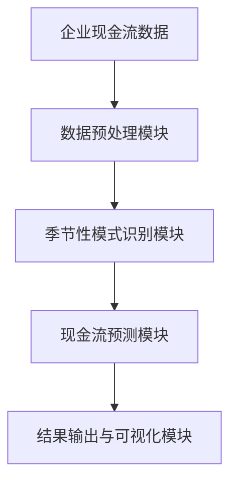

# AI驱动的企业现金流季节性模式识别与预测系统

> 关键词：AI、企业现金流、季节性模式识别、现金流预测、数据分析

> 摘要：本文围绕AI驱动的企业现金流季节性模式识别与预测系统展开深入探讨。首先介绍了该系统开发的背景、目的和适用范围，以及预期读者和文档结构。接着阐述了核心概念，包括企业现金流、季节性模式等，并给出了相应的原理和架构示意图及流程图。详细讲解了核心算法原理，通过Python代码进行说明，同时给出了相关的数学模型和公式并举例。在项目实战部分，介绍了开发环境搭建、源代码实现与解读。分析了该系统的实际应用场景，推荐了学习、开发工具和相关论文著作。最后总结了系统的未来发展趋势与挑战，解答常见问题并提供扩展阅读和参考资料，旨在为企业利用AI技术有效管理现金流提供全面的技术指导。

## 1. 背景介绍 
### 1.1 目的和范围
在当今竞争激烈的商业环境中，企业的现金流管理至关重要。现金流的稳定与否直接关系到企业的生存和发展。许多企业的现金流会呈现出季节性模式，例如零售企业在节假日期间通常会有较高的现金流入，而制造业企业可能在特定季节面临原材料采购的现金支出高峰。

本系统的目的在于利用人工智能技术，准确识别企业现金流的季节性模式，并对未来现金流进行精准预测。通过对企业历史现金流数据的分析，挖掘其中隐藏的季节性规律，为企业的财务管理提供有力支持。

本系统的范围涵盖了各种规模和行业的企业，适用于不同类型的现金流数据，包括日常经营活动产生的现金流、投资活动现金流和筹资活动现金流等。

### 1.2 预期读者
本文的预期读者包括企业的财务管理人员、财务分析师、企业管理者以及对人工智能在财务管理领域应用感兴趣的技术人员。财务管理人员可以借助本系统更好地规划企业的资金安排，降低资金风险；财务分析师可以利用系统的分析结果进行更深入的财务研究；企业管理者可以根据现金流预测做出更明智的战略决策；技术人员可以从系统的实现原理和代码中获取灵感，开发类似的应用。

### 1.3 文档结构概述
本文将按照以下结构进行组织：
- 核心概念与联系：介绍企业现金流、季节性模式等核心概念，以及它们之间的关系，并给出原理和架构的示意图及流程图。
- 核心算法原理 & 具体操作步骤：详细讲解用于识别季节性模式和预测现金流的核心算法，通过Python代码进行具体实现。
- 数学模型和公式 & 详细讲解 & 举例说明：给出相关的数学模型和公式，并结合实际例子进行详细解释。
- 项目实战：代码实际案例和详细解释说明，包括开发环境搭建、源代码实现和代码解读。
- 实际应用场景：分析本系统在企业财务管理中的实际应用场景。
- 工具和资源推荐：推荐学习资源、开发工具框架和相关论文著作。
- 总结：未来发展趋势与挑战：总结系统的发展趋势和面临的挑战。
- 附录：常见问题与解答：解答读者可能遇到的常见问题。
- 扩展阅读 & 参考资料：提供相关的扩展阅读材料和参考资料。

### 1.4 术语表
#### 1.4.1 核心术语定义
- **企业现金流**：指企业在一定会计期间按照现金收付实现制，通过一定经济活动（包括经营活动、投资活动、筹资活动和非经常性项目）而产生的现金流入、现金流出及其总量情况的总称。
- **季节性模式**：指数据在一定时间周期内呈现出的规律性波动，这种波动通常与季节、节假日等因素相关。
- **现金流预测**：根据企业的历史现金流数据和相关因素，对未来一段时间内的现金流情况进行估计和预测。

#### 1.4.2 相关概念解释
- **时间序列分析**：一种统计方法，用于分析按时间顺序排列的数据，以发现数据中的趋势、季节性和周期性等模式。
- **机器学习**：一门多领域交叉学科，涉及概率论、统计学、逼近论、凸分析、算法复杂度理论等多门学科。它专门研究计算机怎样模拟或实现人类的学习行为，以获取新的知识或技能，重新组织已有的知识结构使之不断改善自身的性能。

#### 1.4.3 缩略词列表
- **ARIMA**：Autoregressive Integrated Moving Average，自回归积分滑动平均模型。
- **LSTM**：Long Short-Term Memory，长短期记忆网络。

## 2. 核心概念与联系 

### 核心概念原理
#### 企业现金流
企业现金流是企业运营状况的重要指标。它反映了企业在一定时期内现金的流入和流出情况。现金流入主要来自销售商品、提供劳务、收到的税费返还等；现金流出主要包括购买商品、接受劳务、支付职工薪酬、缴纳税费等。通过对现金流的分析，可以了解企业的盈利能力、偿债能力和资金周转情况。

#### 季节性模式
季节性模式是指数据在一年或更短的时间周期内呈现出的规律性波动。这种波动通常与季节、节假日等因素相关。例如，旅游业在节假日期间通常会有较高的收入，而农业生产在不同季节会有不同的成本支出。识别现金流的季节性模式可以帮助企业提前做好资金安排，避免资金短缺或闲置。

#### 现金流预测
现金流预测是根据企业的历史现金流数据和相关因素，对未来一段时间内的现金流情况进行估计和预测。准确的现金流预测可以帮助企业合理规划资金，降低资金风险，提高资金使用效率。

### 架构的文本示意图
```plaintext
|---------------------|
| 企业现金流数据      |
|---------------------|
|        |
|        v
| 数据预处理模块      |
|---------------------|
|        |
|        v
| 季节性模式识别模块 |
|---------------------|
|        |
|        v
| 现金流预测模块      |
|---------------------|
|        |
|        v
| 结果输出与可视化模块 |
|---------------------|
```

### Mermaid 流程图


## 3. 核心算法原理 & 具体操作步骤 

### 核心算法原理
本系统将使用时间序列分析和机器学习算法来识别季节性模式和预测现金流。具体来说，我们将使用ARIMA模型和LSTM网络。

#### ARIMA模型
ARIMA模型是一种常用的时间序列分析模型，它结合了自回归（AR）、差分（I）和滑动平均（MA）三个部分。ARIMA模型的一般形式为$ARIMA(p, d, q)$，其中$p$是自回归阶数，$d$是差分阶数，$q$是滑动平均阶数。

ARIMA模型的基本思想是通过对时间序列进行差分，使其变得平稳，然后使用自回归和滑动平均模型来拟合平稳序列。

#### LSTM网络
LSTM网络是一种特殊的循环神经网络（RNN），它能够处理长序列数据，并有效地解决传统RNN中的梯度消失问题。LSTM网络通过门控机制来控制信息的流动，从而能够记住长期的依赖关系。

### 具体操作步骤
#### 数据预处理
1. 数据清洗：去除数据中的缺失值和异常值。
2. 数据归一化：将数据缩放到一个合适的范围，例如[0, 1]。
3. 数据划分：将数据划分为训练集和测试集。

#### 季节性模式识别
1. 使用ARIMA模型对训练集数据进行拟合，通过网格搜索的方法选择最优的$p$、$d$、$q$参数。
2. 对拟合后的模型进行诊断，检查残差是否为白噪声。

#### 现金流预测
1. 使用训练好的ARIMA模型对测试集数据进行预测。
2. 构建LSTM网络，将训练集数据输入到网络中进行训练。
3. 使用训练好的LSTM网络对测试集数据进行预测。
4. 融合ARIMA模型和LSTM网络的预测结果，得到最终的现金流预测值。

### Python源代码实现
```python
import pandas as pd
import numpy as np
from statsmodels.tsa.arima.model import ARIMA
from sklearn.preprocessing import MinMaxScaler
from tensorflow.keras.models import Sequential
from tensorflow.keras.layers import LSTM, Dense

# 数据预处理
def preprocess_data(data):
    # 去除缺失值
    data = data.dropna()
    # 数据归一化
    scaler = MinMaxScaler()
    data = scaler.fit_transform(data.values.reshape(-1, 1))
    return data, scaler

# 划分训练集和测试集
def split_data(data, train_size=0.8):
    train_len = int(len(data) * train_size)
    train_data = data[:train_len]
    test_data = data[train_len:]
    return train_data, test_data

# ARIMA模型训练和预测
def arima_model(train_data, test_data, p=1, d=1, q=1):
    model = ARIMA(train_data, order=(p, d, q))
    model_fit = model.fit()
    arima_pred = model_fit.predict(start=len(train_data), end=len(train_data)+len(test_data)-1)
    return arima_pred

# 构建LSTM网络
def build_lstm_model(train_data, timesteps=10):
    X_train = []
    y_train = []
    for i in range(timesteps, len(train_data)):
        X_train.append(train_data[i-timesteps:i, 0])
        y_train.append(train_data[i, 0])
    X_train, y_train = np.array(X_train), np.array(y_train)
    X_train = np.reshape(X_train, (X_train.shape[0], X_train.shape[1], 1))

    model = Sequential()
    model.add(LSTM(50, return_sequences=True, input_shape=(X_train.shape[1], 1)))
    model.add(LSTM(50, return_sequences=False))
    model.add(Dense(25))
    model.add(Dense(1))

    model.compile(optimizer='adam', loss='mean_squared_error')
    model.fit(X_train, y_train, batch_size=1, epochs=1)
    return model

# LSTM模型预测
def lstm_predict(model, test_data, timesteps=10):
    test_inputs = test_data.reshape(-1, 1)
    test_inputs = test_inputs[-timesteps:]
    test_inputs = test_inputs.reshape(1, timesteps, 1)
    lstm_pred = model.predict(test_inputs)
    return lstm_pred

# 主函数
def main():
    # 读取数据
    data = pd.read_csv('cash_flow_data.csv', index_col=0)
    data, scaler = preprocess_data(data)
    train_data, test_data = split_data(data)

    # ARIMA模型预测
    arima_pred = arima_model(train_data, test_data)

    # LSTM模型训练和预测
    lstm_model = build_lstm_model(train_data)
    lstm_pred = lstm_predict(lstm_model, test_data)

    # 融合预测结果
    final_pred = (arima_pred + lstm_pred) / 2

    # 反归一化
    final_pred = scaler.inverse_transform(final_pred.reshape(-1, 1))

    print("最终预测结果：", final_pred)

if __name__ == "__main__":
    main()
```

## 4. 数学模型和公式 & 详细讲解 & 举例说明 

### ARIMA模型数学公式
ARIMA模型的一般形式为：
$$
(1 - \sum_{i=1}^{p} \phi_i B^i)(1 - B)^d Y_t = (1 + \sum_{j=1}^{q} \theta_j B^j) \epsilon_t
$$
其中，$Y_t$ 是时间序列在时刻 $t$ 的值，$B$ 是滞后算子，即 $B^k Y_t = Y_{t-k}$，$\phi_i$ 是自回归系数，$\theta_j$ 是滑动平均系数，$\epsilon_t$ 是白噪声序列。

#### 详细讲解
- **自回归部分（AR）**：表示当前时刻的值与过去若干时刻的值之间的线性关系，通过自回归系数 $\phi_i$ 来控制。
- **差分部分（I）**：通过差分操作将非平稳时间序列转换为平稳时间序列，差分阶数 $d$ 表示差分的次数。
- **滑动平均部分（MA）**：表示当前时刻的值与过去若干时刻的白噪声之间的线性关系，通过滑动平均系数 $\theta_j$ 来控制。

#### 举例说明
假设我们有一个时间序列 $Y_t$，我们要使用 $ARIMA(1, 1, 1)$ 模型进行拟合。则模型的具体形式为：
$$
(1 - \phi_1 B)(1 - B) Y_t = (1 + \theta_1 B) \epsilon_t
$$
展开可得：
$$
Y_t - Y_{t-1} - \phi_1 (Y_{t-1} - Y_{t-2}) = \epsilon_t + \theta_1 \epsilon_{t-1}
$$

### LSTM网络数学公式
LSTM网络的核心是三个门控机制：输入门 $i_t$、遗忘门 $f_t$ 和输出门 $o_t$。

#### 遗忘门
$$
f_t = \sigma(W_f [h_{t-1}, x_t] + b_f)
$$

#### 输入门
$$
i_t = \sigma(W_i [h_{t-1}, x_t] + b_i)
$$
$$
\tilde{C}_t = \tanh(W_C [h_{t-1}, x_t] + b_C)
$$

#### 细胞状态更新
$$
C_t = f_t \odot C_{t-1} + i_t \odot \tilde{C}_t
$$

#### 输出门
$$
o_t = \sigma(W_o [h_{t-1}, x_t] + b_o)
$$
$$
h_t = o_t \odot \tanh(C_t)
$$

其中，$\sigma$ 是 sigmoid 函数，$\tanh$ 是双曲正切函数，$W$ 是权重矩阵，$b$ 是偏置向量，$\odot$ 表示逐元素相乘，$h_t$ 是隐藏状态，$C_t$ 是细胞状态，$x_t$ 是输入序列。

#### 详细讲解
- **遗忘门**：决定上一时刻的细胞状态 $C_{t-1}$ 中有多少信息需要被遗忘。
- **输入门**：决定当前输入 $x_t$ 中有多少信息需要被加入到细胞状态中。
- **细胞状态更新**：根据遗忘门和输入门的输出，更新细胞状态。
- **输出门**：决定当前细胞状态 $C_t$ 中有多少信息需要被输出到隐藏状态 $h_t$ 中。

#### 举例说明
假设我们有一个输入序列 $x_t$，上一时刻的隐藏状态 $h_{t-1}$ 和细胞状态 $C_{t-1}$。首先，通过遗忘门计算 $f_t$，决定遗忘多少 $C_{t-1}$ 中的信息。然后，通过输入门计算 $i_t$ 和 $\tilde{C}_t$，决定加入多少新的信息。接着，更新细胞状态 $C_t$。最后，通过输出门计算 $o_t$ 和 $h_t$，得到当前时刻的隐藏状态。

## 5. 项目实战：代码实际案例和详细解释说明 

### 5.1  开发环境搭建
#### 安装Python
首先，需要安装Python环境。建议使用Python 3.7及以上版本。可以从Python官方网站（https://www.python.org/downloads/）下载并安装。

#### 安装必要的库
使用以下命令安装必要的库：
```sh
pip install pandas numpy statsmodels tensorflow scikit-learn
```

### 5.2  源代码详细实现和代码解读
```python
import pandas as pd
import numpy as np
from statsmodels.tsa.arima.model import ARIMA
from sklearn.preprocessing import MinMaxScaler
from tensorflow.keras.models import Sequential
from tensorflow.keras.layers import LSTM, Dense

# 数据预处理
def preprocess_data(data):
    # 去除缺失值
    data = data.dropna()
    # 数据归一化
    scaler = MinMaxScaler()
    data = scaler.fit_transform(data.values.reshape(-1, 1))
    return data, scaler

# 划分训练集和测试集
def split_data(data, train_size=0.8):
    train_len = int(len(data) * train_size)
    train_data = data[:train_len]
    test_data = data[train_len:]
    return train_data, test_data

# ARIMA模型训练和预测
def arima_model(train_data, test_data, p=1, d=1, q=1):
    model = ARIMA(train_data, order=(p, d, q))
    model_fit = model.fit()
    arima_pred = model_fit.predict(start=len(train_data), end=len(train_data)+len(test_data)-1)
    return arima_pred

# 构建LSTM网络
def build_lstm_model(train_data, timesteps=10):
    X_train = []
    y_train = []
    for i in range(timesteps, len(train_data)):
        X_train.append(train_data[i-timesteps:i, 0])
        y_train.append(train_data[i, 0])
    X_train, y_train = np.array(X_train), np.array(y_train)
    X_train = np.reshape(X_train, (X_train.shape[0], X_train.shape[1], 1))

    model = Sequential()
    model.add(LSTM(50, return_sequences=True, input_shape=(X_train.shape[1], 1)))
    model.add(LSTM(50, return_sequences=False))
    model.add(Dense(25))
    model.add(Dense(1))

    model.compile(optimizer='adam', loss='mean_squared_error')
    model.fit(X_train, y_train, batch_size=1, epochs=1)
    return model

# LSTM模型预测
def lstm_predict(model, test_data, timesteps=10):
    test_inputs = test_data.reshape(-1, 1)
    test_inputs = test_inputs[-timesteps:]
    test_inputs = test_inputs.reshape(1, timesteps, 1)
    lstm_pred = model.predict(test_inputs)
    return lstm_pred

# 主函数
def main():
    # 读取数据
    data = pd.read_csv('cash_flow_data.csv', index_col=0)
    data, scaler = preprocess_data(data)
    train_data, test_data = split_data(data)

    # ARIMA模型预测
    arima_pred = arima_model(train_data, test_data)

    # LSTM模型训练和预测
    lstm_model = build_lstm_model(train_data)
    lstm_pred = lstm_predict(lstm_model, test_data)

    # 融合预测结果
    final_pred = (arima_pred + lstm_pred) / 2

    # 反归一化
    final_pred = scaler.inverse_transform(final_pred.reshape(-1, 1))

    print("最终预测结果：", final_pred)

if __name__ == "__main__":
    main()
```

#### 代码解读
1. **数据预处理**：`preprocess_data` 函数用于去除数据中的缺失值，并使用 `MinMaxScaler` 对数据进行归一化处理。
2. **划分训练集和测试集**：`split_data` 函数将数据按照一定比例划分为训练集和测试集。
3. **ARIMA模型训练和预测**：`arima_model` 函数使用 `ARIMA` 模型对训练集数据进行拟合，并对测试集数据进行预测。
4. **构建LSTM网络**：`build_lstm_model` 函数构建一个LSTM网络，并使用训练集数据进行训练。
5. **LSTM模型预测**：`lstm_predict` 函数使用训练好的LSTM网络对测试集数据进行预测。
6. **融合预测结果**：将ARIMA模型和LSTM网络的预测结果进行平均，得到最终的预测结果。
7. **反归一化**：使用 `scaler.inverse_transform` 函数将预测结果反归一化，得到实际的现金流预测值。

### 5.3  代码解读与分析
#### 优点
- **综合使用多种模型**：结合了ARIMA模型和LSTM网络的优点，能够更准确地识别季节性模式和预测现金流。
- **数据预处理**：对数据进行了缺失值处理和归一化处理，提高了模型的稳定性和准确性。
- **代码结构清晰**：将不同的功能封装成函数，代码结构清晰，易于维护和扩展。

#### 缺点
- **参数调整困难**：ARIMA模型和LSTM网络的参数需要手动调整，可能需要进行多次试验才能得到最优参数。
- **计算资源要求高**：LSTM网络的训练需要较高的计算资源，训练时间可能较长。

## 6. 实际应用场景 
### 资金规划
企业可以根据系统预测的现金流情况，合理规划资金的使用。例如，在预测到现金流入较少的时期，提前安排好资金储备，避免出现资金短缺的情况；在预测到现金流入较多的时期，可以考虑进行投资或扩大生产。

### 风险管理
通过识别现金流的季节性模式，企业可以提前发现潜在的风险。例如，如果某个季节的现金流出明显增加，企业可以分析原因，并采取相应的措施来降低风险。

### 战略决策
现金流预测结果可以为企业的战略决策提供重要依据。例如，企业在考虑扩张或收缩业务时，可以参考现金流预测情况，评估项目的可行性和风险。

### 与供应商和客户的合作
企业可以将现金流预测情况与供应商和客户进行沟通，提前协商付款和交货时间，优化供应链管理，提高企业的运营效率。

## 7. 工具和资源推荐
### 7.1 学习资源推荐
#### 7.1.1 书籍推荐
- 《Python数据分析实战》：介绍了Python在数据分析领域的应用，包括数据处理、可视化和机器学习等方面的内容。
- 《时间序列分析及其应用》：详细讲解了时间序列分析的理论和方法，包括ARIMA模型、季节性分解等。
- 《深度学习》：由深度学习领域的三位先驱Ian Goodfellow、Yoshua Bengio和Aaron Courville撰写，是深度学习领域的经典教材。

#### 7.1.2 在线课程
- Coursera上的“Applied Data Science with Python”：该课程介绍了Python在数据科学中的应用，包括数据处理、机器学习和深度学习等方面的内容。
- edX上的“Time Series Analysis”：该课程详细讲解了时间序列分析的理论和方法，包括ARIMA模型、季节性分解等。
- 网易云课堂上的“深度学习工程师微专业”：该课程系统地介绍了深度学习的理论和实践，包括神经网络、卷积神经网络、循环神经网络等方面的内容。

#### 7.1.3 技术博客和网站
- Towards Data Science：一个专注于数据科学和机器学习的技术博客，上面有很多优秀的文章和教程。
- Kaggle：一个数据科学竞赛平台，上面有很多数据集和优秀的代码示例，可以学习到很多实用的技巧和方法。
- GitHub：一个开源代码托管平台，上面有很多优秀的开源项目，可以学习到不同的代码实现和编程风格。

### 7.2 开发工具框架推荐
#### 7.2.1 IDE和编辑器
- PyCharm：一款专业的Python集成开发环境，具有代码自动补全、调试、版本控制等功能，非常适合Python开发。
- Jupyter Notebook：一个交互式的开发环境，可以实时显示代码的运行结果，非常适合数据探索和分析。
- Visual Studio Code：一款轻量级的代码编辑器，支持多种编程语言，具有丰富的插件生态系统，可以根据需要进行扩展。

#### 7.2.2 调试和性能分析工具
- PDB：Python自带的调试器，可以用于调试Python代码。
- TensorBoard：TensorFlow提供的可视化工具，可以用于监控模型的训练过程和性能指标。
- Py-Spy：一个用于分析Python代码性能的工具，可以帮助找出代码中的性能瓶颈。

#### 7.2.3 相关框架和库
- Pandas：一个用于数据处理和分析的Python库，提供了高效的数据结构和数据操作方法。
- NumPy：一个用于科学计算的Python库，提供了高效的多维数组对象和数学函数。
- Scikit-learn：一个用于机器学习的Python库，提供了各种机器学习算法和工具。
- TensorFlow：一个开源的深度学习框架，由Google开发，提供了丰富的深度学习模型和工具。
- Keras：一个高级的深度学习API，基于TensorFlow、Theano等后端，易于使用和快速搭建模型。

### 7.3 相关论文著作推荐
#### 7.3.1 经典论文
- “Autoregressive Integrated Moving Average Models for Time Series Forecasting”：介绍了ARIMA模型的基本原理和应用。
- “Long Short-Term Memory”：提出了LSTM网络的概念和结构。
- “Forecasting Financial Time Series Using Neural Networks”：探讨了神经网络在金融时间序列预测中的应用。

#### 7.3.2 最新研究成果
- 可以关注顶级学术会议如NeurIPS、ICML、KDD等上的相关研究论文，了解最新的技术和方法。
- 也可以关注相关领域的学术期刊如Journal of Financial Economics、Journal of Econometrics等上的研究成果。

#### 7.3.3 应用案例分析
- 可以参考一些企业的实际应用案例，了解如何将AI技术应用于企业现金流管理中。例如，一些金融科技公司的案例分享，或者企业在财务管理领域的实践经验。

## 8. 总结：未来发展趋势与挑战
### 未来发展趋势
#### 多模型融合
未来的系统可能会融合更多的模型和算法，如深度学习中的卷积神经网络（CNN）、生成对抗网络（GAN）等，以提高预测的准确性和稳定性。

#### 实时预测
随着数据采集技术的不断发展，系统将能够实现实时的现金流预测，为企业提供更及时的决策支持。

#### 与其他系统的集成
系统将与企业的其他信息系统，如财务系统、供应链管理系统等进行集成，实现数据的共享和协同，提高企业的整体运营效率。

#### 智能化决策支持
除了提供现金流预测结果，系统还将具备智能化决策支持功能，能够根据预测结果自动生成决策建议，帮助企业管理者做出更明智的决策。

### 挑战
#### 数据质量问题
企业的现金流数据可能存在缺失值、异常值等问题，需要进行有效的数据清洗和预处理。同时，数据的准确性和完整性也会影响模型的性能。

#### 模型解释性
深度学习模型如LSTM网络通常是黑盒模型，难以解释其决策过程和结果。在企业应用中，需要提高模型的解释性，以便企业管理者能够理解和信任预测结果。

#### 计算资源要求
随着模型的复杂度不断增加，对计算资源的要求也越来越高。企业需要投入更多的硬件资源和计算成本来支持系统的运行。

#### 人才短缺
AI技术在企业现金流管理中的应用需要既懂AI技术又懂财务管理的复合型人才。目前，这类人才相对短缺，企业需要加强人才培养和引进。

## 9. 附录：常见问题与解答
### 1. 如何选择ARIMA模型的参数 $p$、$d$、$q$？
可以使用网格搜索的方法，尝试不同的 $p$、$d$、$q$ 参数组合，选择使模型的拟合效果最好的参数。也可以使用自动 ARIMA 模型选择工具，如 `pmdarima` 库中的 `auto_arima` 函数。

### 2. LSTM网络的训练时间过长怎么办？
可以尝试减少训练数据的规模，调整模型的结构，如减少神经元的数量或层数，或者使用更强大的计算资源，如GPU加速训练。

### 3. 系统的预测结果不准确怎么办？
可以检查数据的质量，进行更有效的数据预处理；尝试调整模型的参数，或者使用不同的模型进行组合；也可以收集更多的数据来训练模型，提高模型的泛化能力。

### 4. 如何评估模型的性能？
可以使用一些常用的评估指标，如均方误差（MSE）、均方根误差（RMSE）、平均绝对误差（MAE）等。这些指标可以衡量模型的预测值与实际值之间的差异。

## 10. 扩展阅读 & 参考资料
### 扩展阅读
- 《金融科技前沿：人工智能在金融领域的应用》：介绍了人工智能在金融领域的各种应用，包括风险管理、投资决策等方面的内容。
- 《企业财务管理》：全面介绍了企业财务管理的理论和方法，包括现金流管理、资金预算等方面的内容。

### 参考资料
- Python官方文档：https://docs.python.org/3/
- Pandas官方文档：https://pandas.pydata.org/docs/
- NumPy官方文档：https://numpy.org/doc/
- Scikit-learn官方文档：https://scikit-learn.org/stable/documentation.html
- TensorFlow官方文档：https://www.tensorflow.org/api_docs
- Keras官方文档：https://keras.io/api/