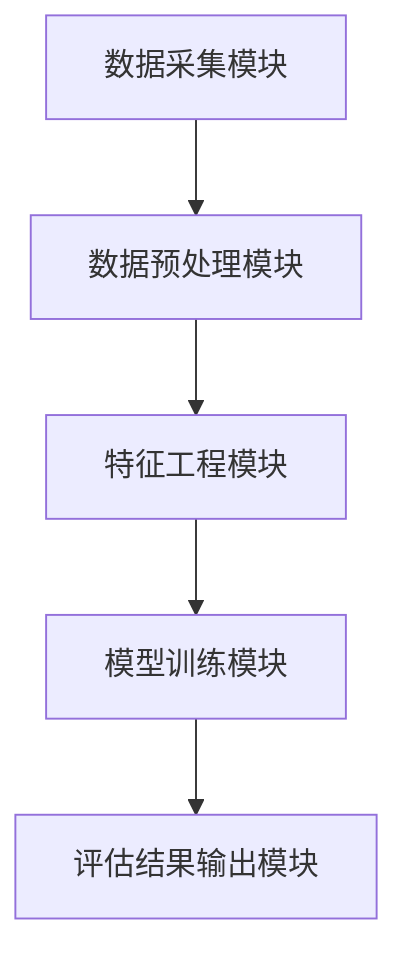

# AI驱动的企业财务报表质量评估系统

> 关键词：AI、企业财务报表、质量评估系统、数据分析、机器学习

> 摘要：本文聚焦于AI驱动的企业财务报表质量评估系统，旨在深入探讨其背后的原理、实现方式及应用价值。随着企业财务数据的日益复杂和海量增长，传统的财务报表质量评估方法已难以满足需求。AI技术的发展为解决这一问题提供了新的途径。文章详细介绍了该系统的背景、核心概念、算法原理、数学模型，通过项目实战展示了系统的具体实现过程，分析了其实际应用场景，并推荐了相关的工具和资源。最后，对系统的未来发展趋势与挑战进行了总结，为相关领域的研究和实践提供了全面且深入的参考。

## 1. 背景介绍 
### 1.1 目的和范围
企业财务报表是反映企业财务状况和经营成果的重要文件，其质量直接影响到投资者、债权人、监管机构等利益相关者的决策。然而，由于企业经营活动的复杂性、会计政策的可选择性以及部分企业的财务造假行为，财务报表质量的评估变得愈发困难。本系统的目的在于利用AI技术，开发一套高效、准确的企业财务报表质量评估系统，以帮助利益相关者更好地了解企业的财务状况，降低决策风险。

本系统的范围涵盖了对企业财务报表中各项数据的分析，包括资产负债表、利润表、现金流量表等主要报表。通过对财务数据的挖掘和分析，评估财务报表的真实性、准确性、完整性和合规性。

### 1.2 预期读者
本文的预期读者包括企业财务管理人员、投资者、监管机构工作人员、金融分析师以及对AI技术在财务领域应用感兴趣的研究人员和技术爱好者。

### 1.3 文档结构概述
本文将按照以下结构进行阐述：首先介绍系统的背景信息，包括目的、范围、预期读者和文档结构概述；接着阐述系统的核心概念与联系，通过文本示意图和Mermaid流程图展示系统的原理和架构；然后详细讲解系统所涉及的核心算法原理和具体操作步骤，并使用Python源代码进行阐述；随后介绍系统的数学模型和公式，并举例说明；通过项目实战展示系统的实际实现过程，包括开发环境搭建、源代码详细实现和代码解读；分析系统的实际应用场景；推荐相关的工具和资源；总结系统的未来发展趋势与挑战；提供附录，解答常见问题；最后列出扩展阅读和参考资料。

### 1.4 术语表
#### 1.4.1 核心术语定义
- **AI（Artificial Intelligence）**：人工智能，是研究、开发用于模拟、延伸和扩展人的智能的理论、方法、技术及应用系统的一门新的技术科学。
- **企业财务报表**：反映企业财务状况和经营成果的书面文件，包括资产负债表、利润表、现金流量表等。
- **财务报表质量评估**：对企业财务报表的真实性、准确性、完整性和合规性进行评价的过程。
- **机器学习（Machine Learning）**：一门多领域交叉学科，涉及概率论、统计学、逼近论、凸分析、算法复杂度理论等多门学科。它专门研究计算机怎样模拟或实现人类的学习行为，以获取新的知识或技能，重新组织已有的知识结构使之不断改善自身的性能。

#### 1.4.2 相关概念解释
- **数据挖掘**：从大量的数据中通过算法搜索隐藏于其中信息的过程。在本系统中，数据挖掘用于从企业财务报表数据中提取有价值的信息，以辅助财务报表质量评估。
- **特征工程**：将原始数据转换为更能代表预测模型的潜在问题的特征的过程，以提高机器学习模型的性能。在财务报表质量评估中，特征工程用于选择和构造与财务报表质量相关的特征。
- **模型训练**：使用训练数据对机器学习模型进行参数调整的过程，以使模型能够准确地预测或分类。在本系统中，模型训练用于训练评估财务报表质量的模型。

#### 1.4.3 缩略词列表
- **AI**：Artificial Intelligence（人工智能）
- **ML**：Machine Learning（机器学习）
- **PCA**：Principal Component Analysis（主成分分析）

## 2. 核心概念与联系 

### 核心概念原理
AI驱动的企业财务报表质量评估系统主要基于机器学习和数据分析技术。其核心原理是通过对大量企业财务报表数据的学习和分析，构建评估模型，以预测财务报表的质量。

系统首先收集企业的财务报表数据，包括资产、负债、收入、成本等各项指标。然后对这些数据进行预处理，包括数据清洗、缺失值处理、异常值处理等，以提高数据的质量。接着进行特征工程，选择和构造与财务报表质量相关的特征。最后使用机器学习算法对处理后的数据进行训练，得到评估模型。

### 架构的文本示意图
该系统主要由数据采集模块、数据预处理模块、特征工程模块、模型训练模块和评估结果输出模块组成。

数据采集模块负责收集企业的财务报表数据，可以从企业的财务系统、数据库或公开数据源中获取。数据预处理模块对采集到的数据进行清洗、缺失值处理和异常值处理，以提高数据的质量。特征工程模块选择和构造与财务报表质量相关的特征，如财务比率、趋势分析等。模型训练模块使用机器学习算法对处理后的数据进行训练，得到评估模型。评估结果输出模块将评估模型的结果以可视化的方式输出，如报表、图表等。

### Mermaid流程图


## 3. 核心算法原理 & 具体操作步骤 

### 核心算法原理
本系统主要使用的机器学习算法包括逻辑回归、决策树和随机森林。

#### 逻辑回归
逻辑回归是一种用于二分类问题的广义线性模型。它通过对输入特征进行线性组合，然后使用逻辑函数将线性组合的结果映射到[0, 1]区间，得到样本属于正类的概率。逻辑回归的模型表达式为：

$$P(y=1|x)=\frac{1}{1+e^{-(w^Tx+b)}}$$

其中，$x$ 是输入特征向量，$w$ 是权重向量，$b$ 是偏置项，$P(y=1|x)$ 是样本属于正类的概率。

#### 决策树
决策树是一种基于树结构进行决策的机器学习算法。它通过对特征空间进行划分，构建决策树模型。每个内部节点是一个特征上的测试，每个分支是一个测试输出，每个叶节点是一个类别或值。决策树的构建过程包括特征选择、树的生成和树的剪枝。

#### 随机森林
随机森林是一种集成学习算法，它由多个决策树组成。在训练过程中，随机森林从原始数据集中有放回地抽取样本，构建多个决策树。在预测时，随机森林将多个决策树的预测结果进行综合，得到最终的预测结果。

### 具体操作步骤
#### 数据采集
使用Python的`pandas`库从企业的财务系统、数据库或公开数据源中读取财务报表数据。示例代码如下：
```python
import pandas as pd

# 从CSV文件中读取数据
data = pd.read_csv('financial_statements.csv')
```

#### 数据预处理
对采集到的数据进行清洗、缺失值处理和异常值处理。示例代码如下：
```python
# 清洗数据，去除重复值
data = data.drop_duplicates()

# 处理缺失值，使用均值填充
data = data.fillna(data.mean())

# 处理异常值，使用Z-score方法
from scipy import stats
z_scores = stats.zscore(data)
abs_z_scores = np.abs(z_scores)
filtered_entries = (abs_z_scores < 3).all(axis=1)
data = data[filtered_entries]
```

#### 特征工程
选择和构造与财务报表质量相关的特征。示例代码如下：
```python
# 计算财务比率
data['current_ratio'] = data['current_assets'] / data['current_liabilities']

# 进行主成分分析（PCA）
from sklearn.decomposition import PCA
pca = PCA(n_components=2)
X_pca = pca.fit_transform(data)
```

#### 模型训练
使用逻辑回归、决策树和随机森林算法对处理后的数据进行训练。示例代码如下：
```python
from sklearn.model_selection import train_test_split
from sklearn.linear_model import LogisticRegression
from sklearn.tree import DecisionTreeClassifier
from sklearn.ensemble import RandomForestClassifier

# 划分训练集和测试集
X = data.drop('quality_label', axis=1)
y = data['quality_label']
X_train, X_test, y_train, y_test = train_test_split(X, y, test_size=0.2, random_state=42)

# 逻辑回归模型训练
lr_model = LogisticRegression()
lr_model.fit(X_train, y_train)

# 决策树模型训练
dt_model = DecisionTreeClassifier()
dt_model.fit(X_train, y_train)

# 随机森林模型训练
rf_model = RandomForestClassifier()
rf_model.fit(X_train, y_train)
```

#### 模型评估
使用测试集对训练好的模型进行评估，计算准确率、召回率、F1值等指标。示例代码如下：
```python
from sklearn.metrics import accuracy_score, recall_score, f1_score

# 逻辑回归模型评估
lr_pred = lr_model.predict(X_test)
lr_accuracy = accuracy_score(y_test, lr_pred)
lr_recall = recall_score(y_test, lr_pred)
lr_f1 = f1_score(y_test, lr_pred)

# 决策树模型评估
dt_pred = dt_model.predict(X_test)
dt_accuracy = accuracy_score(y_test, dt_pred)
dt_recall = recall_score(y_test, dt_pred)
dt_f1 = f1_score(y_test, dt_pred)

# 随机森林模型评估
rf_pred = rf_model.predict(X_test)
rf_accuracy = accuracy_score(y_test, rf_pred)
rf_recall = recall_score(y_test, rf_pred)
rf_f1 = f1_score(y_test, rf_pred)

print(f"逻辑回归准确率: {lr_accuracy}, 召回率: {lr_recall}, F1值: {lr_f1}")
print(f"决策树准确率: {dt_accuracy}, 召回率: {dt_recall}, F1值: {dt_f1}")
print(f"随机森林准确率: {rf_accuracy}, 召回率: {rf_recall}, F1值: {rf_f1}")
```

## 4. 数学模型和公式 & 详细讲解 & 举例说明 

### 逻辑回归数学模型和公式
逻辑回归的数学模型基于逻辑函数（也称为Sigmoid函数），其表达式为：

$$\sigma(z)=\frac{1}{1+e^{-z}}$$

其中，$z$ 是输入的线性组合，即 $z = w^Tx + b$。逻辑函数将输入的线性组合映射到[0, 1]区间，得到样本属于正类的概率。

逻辑回归的损失函数通常使用对数损失函数（也称为交叉熵损失函数），其表达式为：

$$L(w,b)=-\frac{1}{m}\sum_{i=1}^{m}[y^{(i)}\log(P(y^{(i)}=1|x^{(i)}))+(1-y^{(i)})\log(1 - P(y^{(i)}=1|x^{(i)}))]$$

其中，$m$ 是样本数量，$y^{(i)}$ 是第 $i$ 个样本的真实标签，$P(y^{(i)}=1|x^{(i)})$ 是第 $i$ 个样本属于正类的概率。

### 决策树数学模型和公式
决策树的构建基于信息增益、信息增益率或基尼指数等准则。以信息增益为例，信息增益的计算公式为：

$$IG(D,A)=H(D)-H(D|A)$$

其中，$D$ 是数据集，$A$ 是特征，$H(D)$ 是数据集 $D$ 的信息熵，$H(D|A)$ 是在特征 $A$ 给定的条件下数据集 $D$ 的条件熵。

信息熵的计算公式为：

$$H(D)=-\sum_{k=1}^{K}p_k\log_2p_k$$

其中，$K$ 是类别数量，$p_k$ 是第 $k$ 个类别的概率。

条件熵的计算公式为：

$$H(D|A)=\sum_{v=1}^{V}\frac{|D^v|}{|D|}H(D^v)$$

其中，$V$ 是特征 $A$ 的取值数量，$D^v$ 是特征 $A$ 取值为 $v$ 的样本子集。

### 随机森林数学模型和公式
随机森林是多个决策树的集成，其预测结果是多个决策树预测结果的综合。对于分类问题，通常采用投票法，即选择多数决策树预测的类别作为最终结果。对于回归问题，通常采用平均值法，即取多个决策树预测值的平均值作为最终结果。

### 举例说明
假设有一个简单的财务报表数据集，包含两个特征：资产负债率和净利润增长率，以及一个质量标签（0表示低质量，1表示高质量）。我们使用逻辑回归模型对该数据集进行训练。

首先，计算输入的线性组合：

$$z = w_1\times 资产负债率 + w_2\times 净利润增长率 + b$$

然后，使用逻辑函数将线性组合的结果映射到[0, 1]区间：

$$P(y=1|x)=\frac{1}{1+e^{-z}}$$

最后，使用对数损失函数计算损失，并通过梯度下降法更新权重和偏置项，以最小化损失函数。

## 5. 项目实战：代码实际案例和详细解释说明 

### 5.1  开发环境搭建
#### 安装Python
首先，需要安装Python开发环境。可以从Python官方网站（https://www.python.org/downloads/） 下载适合自己操作系统的Python版本，并按照安装向导进行安装。

#### 安装必要的库
使用`pip`命令安装项目所需的库，包括`pandas`、`numpy`、`scikit-learn`等。示例命令如下：
```sh
pip install pandas numpy scikit-learn
```

### 5.2  源代码详细实现和代码解读
以下是一个完整的AI驱动的企业财务报表质量评估系统的源代码示例：

```python
import pandas as pd
import numpy as np
from sklearn.model_selection import train_test_split
from sklearn.linear_model import LogisticRegression
from sklearn.tree import DecisionTreeClassifier
from sklearn.ensemble import RandomForestClassifier
from sklearn.metrics import accuracy_score, recall_score, f1_score
from scipy import stats
from sklearn.decomposition import PCA

# 数据采集
data = pd.read_csv('financial_statements.csv')

# 数据预处理
# 清洗数据，去除重复值
data = data.drop_duplicates()

# 处理缺失值，使用均值填充
data = data.fillna(data.mean())

# 处理异常值，使用Z-score方法
z_scores = stats.zscore(data)
abs_z_scores = np.abs(z_scores)
filtered_entries = (abs_z_scores < 3).all(axis=1)
data = data[filtered_entries]

# 特征工程
# 计算财务比率
data['current_ratio'] = data['current_assets'] / data['current_liabilities']

# 进行主成分分析（PCA）
pca = PCA(n_components=2)
X_pca = pca.fit_transform(data.drop('quality_label', axis=1))

# 划分训练集和测试集
X = data.drop('quality_label', axis=1)
y = data['quality_label']
X_train, X_test, y_train, y_test = train_test_split(X, y, test_size=0.2, random_state=42)

# 逻辑回归模型训练
lr_model = LogisticRegression()
lr_model.fit(X_train, y_train)

# 决策树模型训练
dt_model = DecisionTreeClassifier()
dt_model.fit(X_train, y_train)

# 随机森林模型训练
rf_model = RandomForestClassifier()
rf_model.fit(X_train, y_train)

# 模型评估
# 逻辑回归模型评估
lr_pred = lr_model.predict(X_test)
lr_accuracy = accuracy_score(y_test, lr_pred)
lr_recall = recall_score(y_test, lr_pred)
lr_f1 = f1_score(y_test, lr_pred)

# 决策树模型评估
dt_pred = dt_model.predict(X_test)
dt_accuracy = accuracy_score(y_test, dt_pred)
dt_recall = recall_score(y_test, dt_pred)
dt_f1 = f1_score(y_test, dt_pred)

# 随机森林模型评估
rf_pred = rf_model.predict(X_test)
rf_accuracy = accuracy_score(y_test, rf_pred)
rf_recall = recall_score(y_test, rf_pred)
rf_f1 = f1_score(y_test, rf_pred)

print(f"逻辑回归准确率: {lr_accuracy}, 召回率: {lr_recall}, F1值: {lr_f1}")
print(f"决策树准确率: {dt_accuracy}, 召回率: {dt_recall}, F1值: {dt_f1}")
print(f"随机森林准确率: {rf_accuracy}, 召回率: {rf_recall}, F1值: {rf_f1}")
```

### 5.3  代码解读与分析
- **数据采集**：使用`pandas`库的`read_csv`函数从CSV文件中读取财务报表数据。
- **数据预处理**：
  - `drop_duplicates`函数用于去除数据中的重复值。
  - `fillna`函数使用均值填充数据中的缺失值。
  - `Z-score`方法用于处理数据中的异常值，将偏离均值超过3个标准差的数据视为异常值并去除。
- **特征工程**：
  - 计算财务比率，如流动比率，以提取更多与财务报表质量相关的信息。
  - 使用主成分分析（PCA）对数据进行降维，减少特征的数量，提高模型的训练效率。
- **模型训练**：
  - 使用逻辑回归、决策树和随机森林算法对处理后的数据进行训练。
  - `fit`方法用于训练模型。
- **模型评估**：
  - 使用测试集对训练好的模型进行评估，计算准确率、召回率和F1值等指标。
  - `predict`方法用于对测试集进行预测，`accuracy_score`、`recall_score`和`f1_score`函数用于计算评估指标。

## 6. 实际应用场景 
### 投资者决策
投资者在进行投资决策时，需要对企业的财务状况进行深入分析。AI驱动的企业财务报表质量评估系统可以帮助投资者快速、准确地评估企业财务报表的质量，发现潜在的财务风险，从而做出更明智的投资决策。

### 监管机构监管
监管机构需要对企业的财务报表进行监管，以确保企业的财务信息真实、准确、完整。该系统可以帮助监管机构提高监管效率，及时发现企业的财务违规行为，维护市场秩序。

### 企业内部管理
企业内部管理人员可以使用该系统对自身的财务报表质量进行评估，发现财务管理中存在的问题，及时进行改进，提高企业的财务管理水平。

### 金融机构信贷审批
金融机构在进行信贷审批时，需要对企业的还款能力进行评估。企业财务报表是评估企业还款能力的重要依据。该系统可以帮助金融机构评估企业财务报表的质量，降低信贷风险。

## 7. 工具和资源推荐
### 7.1 学习资源推荐
#### 7.1.1 书籍推荐
- 《Python数据分析实战》：本书介绍了使用Python进行数据分析的方法和技巧，包括数据采集、清洗、分析和可视化等内容，对于学习数据预处理和特征工程有很大帮助。
- 《机器学习》（周志华著）：这是一本经典的机器学习教材，系统地介绍了机器学习的基本概念、算法和应用，对于深入理解本系统所使用的机器学习算法有很大帮助。
- 《财务报表分析》：本书详细介绍了企业财务报表的分析方法和技巧，对于理解财务报表数据和构建评估模型有很大帮助。

#### 7.1.2 在线课程
- Coursera上的“机器学习”课程：由斯坦福大学教授Andrew Ng主讲，是一门非常经典的机器学习在线课程，内容涵盖了机器学习的基本概念、算法和应用。
- edX上的“Python for Data Science”课程：该课程介绍了使用Python进行数据分析的方法和技巧，包括数据采集、清洗、分析和可视化等内容。
- 中国大学MOOC上的“财务报表分析”课程：该课程详细介绍了企业财务报表的分析方法和技巧，对于理解财务报表数据和构建评估模型有很大帮助。

#### 7.1.3 技术博客和网站
- 博客园：一个技术博客平台，上面有很多关于Python、机器学习和数据分析的技术文章，可以帮助读者深入学习相关知识。
- 知乎：一个知识分享平台，上面有很多关于AI、财务报表分析和数据挖掘的问题和回答，可以帮助读者了解相关领域的最新动态和技术。
- Kaggle：一个数据科学竞赛平台，上面有很多关于数据分析和机器学习的数据集和竞赛项目，可以帮助读者提高实践能力。

### 7.2 开发工具框架推荐
#### 7.2.1 IDE和编辑器
- PyCharm：一款专门用于Python开发的集成开发环境（IDE），具有代码编辑、调试、版本控制等功能，非常适合Python项目的开发。
- Jupyter Notebook：一个交互式的开发环境，可以将代码、文本、图表等内容集成在一起，方便进行数据分析和模型训练。
- Visual Studio Code：一款轻量级的代码编辑器，支持多种编程语言，具有丰富的插件和扩展功能，适合Python项目的开发。

#### 7.2.2 调试和性能分析工具
- Py-Spy：一个用于Python代码性能分析的工具，可以帮助开发者找出代码中的性能瓶颈。
- PDB：Python自带的调试器，可以帮助开发者调试Python代码。
- cProfile：Python自带的性能分析工具，可以帮助开发者分析Python代码的性能。

#### 7.2.3 相关框架和库
- Pandas：一个用于数据处理和分析的Python库，提供了高效的数据结构和数据操作方法，非常适合处理财务报表数据。
- NumPy：一个用于科学计算的Python库，提供了高效的数组操作和数学函数，是很多数据分析和机器学习库的基础。
- Scikit-learn：一个用于机器学习的Python库，提供了丰富的机器学习算法和工具，非常适合构建财务报表质量评估模型。

### 7.3 相关论文著作推荐
#### 7.3.1 经典论文
- “Financial Statement Fraud Detection Using Machine Learning Techniques”：该论文介绍了使用机器学习技术检测财务报表欺诈的方法和实验结果。
- “A Data Mining Approach to Financial Statement Analysis”：该论文介绍了使用数据挖掘技术进行财务报表分析的方法和应用。

#### 7.3.2 最新研究成果
- 关注顶级学术会议，如ACM SIGKDD、IEEE ICDM等，这些会议上会发表很多关于数据挖掘、机器学习和财务分析的最新研究成果。
- 关注顶级学术期刊，如《Journal of Accounting Research》、《The Accounting Review》等，这些期刊上会发表很多关于财务报表分析和审计的最新研究成果。

#### 7.3.3 应用案例分析
- 一些大型金融机构和企业会发布关于财务报表分析和风险管理的应用案例，可以通过他们的官方网站或相关报告获取这些案例，学习他们的实践经验。

## 8. 总结：未来发展趋势与挑战
### 未来发展趋势
- **多模态数据融合**：未来的企业财务报表质量评估系统可能会融合更多类型的数据，如文本数据、图像数据等，以更全面地评估企业的财务状况。
- **深度学习的应用**：深度学习在图像识别、自然语言处理等领域取得了显著的成果，未来可能会在企业财务报表质量评估中得到更广泛的应用，提高评估的准确性和效率。
- **实时评估**：随着企业信息化程度的提高，未来的评估系统可能会实现实时评估，及时发现企业财务报表中的问题，为利益相关者提供更及时的决策支持。
- **与区块链技术的结合**：区块链技术具有去中心化、不可篡改等特点，与企业财务报表质量评估系统结合，可以提高财务数据的安全性和可信度。

### 挑战
- **数据质量问题**：企业财务报表数据可能存在缺失值、异常值、错误值等问题，影响评估模型的准确性。如何提高数据质量是一个重要的挑战。
- **模型可解释性问题**：一些复杂的机器学习模型，如深度学习模型，具有较高的准确性，但缺乏可解释性。在企业财务报表质量评估中，模型的可解释性非常重要，如何提高模型的可解释性是一个挑战。
- **数据安全和隐私问题**：企业财务报表数据包含敏感信息，如何保障数据的安全和隐私是一个重要的挑战。在数据采集、存储和处理过程中，需要采取有效的安全措施。
- **法律法规和监管问题**：AI技术在企业财务报表质量评估中的应用需要遵守相关的法律法规和监管要求，如何确保系统的合规性是一个挑战。

## 9. 附录：常见问题与解答
### 问题1：如何选择合适的机器学习算法？
答：选择合适的机器学习算法需要考虑多个因素，如数据的特点、问题的类型、模型的可解释性等。对于企业财务报表质量评估问题，可以先尝试使用简单的算法，如逻辑回归、决策树等，然后再尝试使用复杂的算法，如随机森林、深度学习等。同时，可以使用交叉验证等方法对不同的算法进行评估，选择性能最好的算法。

### 问题2：如何处理数据中的缺失值？
答：处理数据中的缺失值有多种方法，如删除包含缺失值的样本、使用均值、中位数或众数填充缺失值、使用插值方法填充缺失值等。选择哪种方法需要根据数据的特点和问题的类型来决定。

### 问题3：如何提高模型的性能？
答：提高模型的性能可以从多个方面入手，如数据预处理、特征工程、模型选择和调优、集成学习等。在数据预处理阶段，需要清洗数据、处理缺失值和异常值；在特征工程阶段，需要选择和构造与问题相关的特征；在模型选择和调优阶段，需要选择合适的模型，并使用交叉验证等方法对模型的参数进行调优；在集成学习阶段，可以将多个模型的预测结果进行综合，提高模型的性能。

### 问题4：如何保障数据的安全和隐私？
答：保障数据的安全和隐私需要采取多种措施，如数据加密、访问控制、数据脱敏等。在数据采集阶段，需要确保数据的来源合法、可靠；在数据存储阶段，需要使用安全的存储设备和数据库，并对数据进行加密；在数据处理阶段，需要对数据进行脱敏处理，去除敏感信息。

## 10. 扩展阅读 & 参考资料
### 扩展阅读
- 《人工智能：现代方法》：这本书全面介绍了人工智能的基本概念、算法和应用，对于深入了解AI技术有很大帮助。
- 《数据挖掘：概念与技术》：这本书系统地介绍了数据挖掘的基本概念、算法和应用，对于深入了解数据挖掘技术有很大帮助。
- 《会计学原理》：这本书介绍了会计学的基本概念、原理和方法，对于理解企业财务报表有很大帮助。

### 参考资料
- 相关学术论文和研究报告
- 相关技术文档和官方网站
- 相关书籍和在线课程