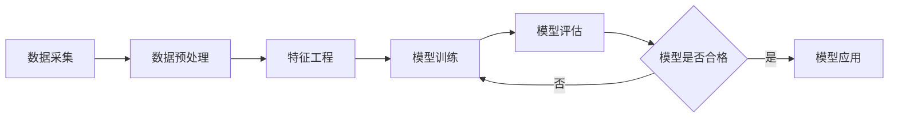

# AI驱动的保险理赔欺诈模式识别

> 关键词：AI、保险理赔欺诈、模式识别、机器学习、数据挖掘

> 摘要：本文聚焦于AI驱动的保险理赔欺诈模式识别这一重要领域。随着保险行业的快速发展，理赔欺诈问题日益严重，给保险公司带来了巨大的经济损失。AI技术的出现为解决这一问题提供了新的思路和方法。文章首先介绍了该研究的背景、目的、预期读者、文档结构和相关术语。接着阐述了核心概念与联系，包括保险理赔欺诈的原理和架构。详细讲解了核心算法原理和具体操作步骤，并给出Python源代码示例。同时，介绍了相关的数学模型和公式，通过举例进行说明。在项目实战部分，给出了开发环境搭建、源代码实现和代码解读。还探讨了实际应用场景，推荐了学习资源、开发工具框架和相关论文著作。最后总结了未来发展趋势与挑战，解答了常见问题，并提供了扩展阅读和参考资料。

## 1. 背景介绍 
### 1.1 目的和范围
保险理赔欺诈是保险行业面临的一个严重问题，它不仅损害了保险公司的利益，也影响了整个保险市场的健康发展。传统的欺诈检测方法往往依赖于人工经验和简单的规则，效率低下且难以发现复杂的欺诈模式。本研究的目的是利用AI技术，特别是机器学习和数据挖掘算法，开发一套高效、准确的保险理赔欺诈模式识别系统，能够自动识别潜在的欺诈理赔案件，为保险公司提供决策支持。

本研究的范围涵盖了常见的保险类型，如车险、健康险、财产险等，重点关注理赔过程中的欺诈行为，包括虚假报案、夸大损失、冒名顶替等。

### 1.2 预期读者
本文的预期读者包括保险行业的从业者，如理赔专员、风险管理人员、数据分析人员等，他们可以通过本文了解如何利用AI技术改进保险理赔欺诈检测工作。同时，也适合对人工智能在金融领域应用感兴趣的研究人员、学生以及相关技术爱好者阅读。

### 1.3 文档结构概述
本文将按照以下结构进行组织：
- 核心概念与联系：介绍保险理赔欺诈的相关概念和原理，以及AI在其中的应用架构。
- 核心算法原理 & 具体操作步骤：详细讲解用于欺诈模式识别的核心算法，并给出Python代码示例。
- 数学模型和公式 & 详细讲解 & 举例说明：介绍相关的数学模型和公式，并通过实际例子进行解释。
- 项目实战：代码实际案例和详细解释说明，包括开发环境搭建、源代码实现和代码解读。
- 实际应用场景：探讨AI驱动的保险理赔欺诈模式识别在实际中的应用场景。
- 工具和资源推荐：推荐学习资源、开发工具框架和相关论文著作。
- 总结：未来发展趋势与挑战：总结AI在保险理赔欺诈识别领域的发展趋势和面临的挑战。
- 附录：常见问题与解答：解答读者可能遇到的常见问题。
- 扩展阅读 & 参考资料：提供相关的扩展阅读和参考资料。

### 1.4 术语表
#### 1.4.1 核心术语定义
- **保险理赔欺诈**：指投保人、被保险人或受益人故意制造虚假的保险事故或夸大损失程度，以获取保险金的行为。
- **模式识别**：是指对表征事物或现象的各种形式的（数值的、文字的和逻辑关系的）信息进行处理和分析，以对事物或现象进行描述、辨认、分类和解释的过程。
- **机器学习**：是一门多领域交叉学科，涉及概率论、统计学、逼近论、凸分析、算法复杂度理论等多门学科。它专门研究计算机怎样模拟或实现人类的学习行为，以获取新的知识或技能，重新组织已有的知识结构使之不断改善自身的性能。
- **数据挖掘**：是指从大量的数据中通过算法搜索隐藏于其中信息的过程。数据挖掘通常与计算机科学有关，并通过统计、在线分析处理、情报检索、机器学习、专家系统（依靠过去的经验法则）和模式识别等诸多方法来实现上述目标。

#### 1.4.2 相关概念解释
- **特征工程**：是指对原始数据进行预处理和转换，提取出对模型有意义的特征的过程。在保险理赔欺诈识别中，特征工程可以包括提取理赔金额、报案时间、被保险人历史理赔记录等特征。
- **模型评估**：是指使用一定的指标和方法对训练好的模型进行评估，以衡量模型的性能。常用的评估指标包括准确率、召回率、F1值等。
- **过拟合**：是指模型在训练数据上表现良好，但在测试数据上表现不佳的现象。过拟合通常是由于模型过于复杂，对训练数据中的噪声和异常值过度拟合导致的。

#### 1.4.3 缩略词列表
- **AI**：Artificial Intelligence，人工智能
- **ML**：Machine Learning，机器学习
- **DM**：Data Mining，数据挖掘
- **ROC**：Receiver Operating Characteristic，受试者工作特征曲线
- **AUC**：Area Under the Curve，曲线下面积

## 2. 核心概念与联系 

### 保险理赔欺诈的原理
保险理赔欺诈的发生通常是由于欺诈者试图通过虚假手段获取保险金。欺诈者可能会采取多种方式，如伪造事故现场、夸大损失程度、冒名顶替等。这些欺诈行为往往会留下一些特征和模式，通过对这些特征和模式的分析，可以识别出潜在的欺诈案件。

### AI在保险理赔欺诈识别中的应用架构
AI在保险理赔欺诈识别中的应用架构主要包括数据采集、数据预处理、特征工程、模型训练、模型评估和模型应用等环节。具体架构如下：



- **数据采集**：收集保险理赔相关的数据，包括理赔申请信息、被保险人信息、事故信息等。
- **数据预处理**：对采集到的数据进行清洗、转换和归一化等处理，以提高数据的质量和可用性。
- **特征工程**：从预处理后的数据中提取有意义的特征，如理赔金额、报案时间、被保险人历史理赔记录等。
- **模型训练**：使用机器学习或深度学习算法对提取的特征进行训练，构建欺诈识别模型。
- **模型评估**：使用测试数据对训练好的模型进行评估，衡量模型的性能。
- **模型应用**：将评估合格的模型应用到实际的保险理赔过程中，自动识别潜在的欺诈案件。

## 3. 核心算法原理 & 具体操作步骤 

### 核心算法原理
在保险理赔欺诈识别中，常用的算法包括逻辑回归、决策树、随机森林、支持向量机和深度学习算法等。下面以逻辑回归为例，介绍其原理。

逻辑回归是一种广义线性模型，用于解决二分类问题。它通过对输入特征进行线性组合，然后通过逻辑函数将线性组合的结果映射到[0, 1]区间，得到样本属于正类的概率。逻辑函数的表达式为：

$$
\sigma(z) = \frac{1}{1 + e^{-z}}
$$

其中，$z$ 是输入特征的线性组合，即：

$$
z = \theta_0 + \theta_1x_1 + \theta_2x_2 + \cdots + \theta_nx_n
$$

$\theta_0, \theta_1, \cdots, \theta_n$ 是模型的参数，$x_1, x_2, \cdots, x_n$ 是输入特征。

逻辑回归的目标是通过训练数据找到最优的参数 $\theta$，使得模型对训练数据的预测结果与真实标签之间的误差最小。常用的损失函数是对数损失函数，其表达式为：

$$
J(\theta) = -\frac{1}{m}\sum_{i = 1}^{m}[y^{(i)}\log(h_{\theta}(x^{(i)})) + (1 - y^{(i)})\log(1 - h_{\theta}(x^{(i)}))]
$$

其中，$m$ 是训练样本的数量，$y^{(i)}$ 是第 $i$ 个样本的真实标签，$h_{\theta}(x^{(i)})$ 是第 $i$ 个样本属于正类的概率。

### 具体操作步骤
下面是使用Python实现逻辑回归进行保险理赔欺诈识别的具体步骤：

```python
import numpy as np
from sklearn.linear_model import LogisticRegression
from sklearn.model_selection import train_test_split
from sklearn.metrics import accuracy_score

# 1. 准备数据
# 假设我们已经有了特征矩阵X和标签向量y
# X是一个二维数组，每一行表示一个样本，每一列表示一个特征
# y是一个一维数组，每个元素表示一个样本的标签（0表示正常理赔，1表示欺诈理赔）
X = np.array([[1, 2], [3, 4], [5, 6], [7, 8]])
y = np.array([0, 0, 1, 1])

# 2. 划分训练集和测试集
X_train, X_test, y_train, y_test = train_test_split(X, y, test_size=0.2, random_state=42)

# 3. 创建逻辑回归模型
model = LogisticRegression()

# 4. 训练模型
model.fit(X_train, y_train)

# 5. 预测
y_pred = model.predict(X_test)

# 6. 评估模型
accuracy = accuracy_score(y_test, y_pred)
print("模型准确率：", accuracy)
```

### 代码解释
- **准备数据**：首先，我们需要准备特征矩阵 $X$ 和标签向量 $y$。这里我们使用了一个简单的示例数据。
- **划分训练集和测试集**：使用 `train_test_split` 函数将数据划分为训练集和测试集，其中测试集占总数据的20%。
- **创建逻辑回归模型**：使用 `LogisticRegression` 类创建一个逻辑回归模型。
- **训练模型**：使用 `fit` 方法对模型进行训练，传入训练集的特征矩阵和标签向量。
- **预测**：使用 `predict` 方法对测试集的样本进行预测，得到预测结果。
- **评估模型**：使用 `accuracy_score` 函数计算模型的准确率，即预测正确的样本数占总样本数的比例。

## 4. 数学模型和公式 & 详细讲解 & 举例说明 

### 逻辑回归的数学模型
逻辑回归的数学模型可以表示为：

$$
P(y = 1|x) = \frac{1}{1 + e^{-(\theta_0 + \theta_1x_1 + \theta_2x_2 + \cdots + \theta_nx_n)}}
$$

其中，$P(y = 1|x)$ 表示在给定特征 $x$ 的情况下，样本属于正类的概率。

### 对数损失函数的详细讲解
对数损失函数的目的是衡量模型预测结果与真实标签之间的误差。对于一个样本 $(x^{(i)}, y^{(i)})$，其对数损失为：

$$
L(y^{(i)}, h_{\theta}(x^{(i)})) = -y^{(i)}\log(h_{\theta}(x^{(i)})) - (1 - y^{(i)})\log(1 - h_{\theta}(x^{(i)}))
$$

当 $y^{(i)} = 1$ 时，对数损失为：

$$
L(y^{(i)} = 1, h_{\theta}(x^{(i)})) = -\log(h_{\theta}(x^{(i)}))
$$

当 $y^{(i)} = 0$ 时，对数损失为：

$$
L(y^{(i)} = 0, h_{\theta}(x^{(i)})) = -\log(1 - h_{\theta}(x^{(i)}))
$$

对数损失函数的特点是，当模型预测结果与真实标签一致时，损失较小；当模型预测结果与真实标签不一致时，损失较大。

### 举例说明
假设我们有一个简单的逻辑回归模型，只有一个特征 $x$，模型的参数为 $\theta_0 = 0$，$\theta_1 = 1$。则模型的表达式为：

$$
P(y = 1|x) = \frac{1}{1 + e^{-x}}
$$

现在有一个样本 $x = 2$，则该样本属于正类的概率为：

$$
P(y = 1|x = 2) = \frac{1}{1 + e^{-2}} \approx 0.88
$$

如果该样本的真实标签为 $y = 1$，则其对数损失为：

$$
L(y = 1, h_{\theta}(x = 2)) = -\log(0.88) \approx 0.13
$$

如果该样本的真实标签为 $y = 0$，则其对数损失为：

$$
L(y = 0, h_{\theta}(x = 2)) = -\log(1 - 0.88) \approx 2.08
$$

可以看到，当模型预测结果与真实标签一致时，损失较小；当模型预测结果与真实标签不一致时，损失较大。

## 5. 项目实战：代码实际案例和详细解释说明 

### 5.1  开发环境搭建
为了实现AI驱动的保险理赔欺诈模式识别项目，我们需要搭建以下开发环境：
- **Python**：建议使用Python 3.6及以上版本。
- **开发工具**：可以使用Jupyter Notebook、PyCharm等开发工具。
- **相关库**：需要安装 `numpy`、`pandas`、`scikit-learn`、`matplotlib` 等库。可以使用以下命令进行安装：

```bash
pip install numpy pandas scikit-learn matplotlib
```

### 5.2  源代码详细实现和代码解读
以下是一个完整的保险理赔欺诈识别项目的源代码示例：

```python
import numpy as np
import pandas as pd
from sklearn.model_selection import train_test_split
from sklearn.linear_model import LogisticRegression
from sklearn.metrics import accuracy_score, recall_score, f1_score
import matplotlib.pyplot as plt

# 1. 数据加载
data = pd.read_csv('insurance_claims.csv')

# 2. 数据预处理
# 处理缺失值
data = data.dropna()

# 处理类别特征
categorical_features = ['policy_state', 'policy_csl', 'insured_sex', 'insured_education_level', 'insured_occupation', 'insured_hobbies', 'insured_relationship', 'incident_type', 'collision_type', 'incident_severity', 'authorities_contacted', 'incident_state', 'incident_city', 'property_damage', 'police_report_available']
data = pd.get_dummies(data, columns=categorical_features)

# 划分特征和标签
X = data.drop(['fraud_reported'], axis=1)
y = data['fraud_reported'].map({'Y': 1, 'N': 0})

# 3. 划分训练集和测试集
X_train, X_test, y_train, y_test = train_test_split(X, y, test_size=0.2, random_state=42)

# 4. 创建逻辑回归模型
model = LogisticRegression()

# 5. 训练模型
model.fit(X_train, y_train)

# 6. 预测
y_pred = model.predict(X_test)

# 7. 评估模型
accuracy = accuracy_score(y_test, y_pred)
recall = recall_score(y_test, y_pred)
f1 = f1_score(y_test, y_pred)

print("模型准确率：", accuracy)
print("模型召回率：", recall)
print("模型F1值：", f1)

# 8. 绘制ROC曲线
from sklearn.metrics import roc_curve, auc

y_score = model.predict_proba(X_test)[:, 1]
fpr, tpr, thresholds = roc_curve(y_test, y_score)
roc_auc = auc(fpr, tpr)

plt.figure()
plt.plot(fpr, tpr, color='darkorange', lw=2, label='ROC curve (area = %0.2f)' % roc_auc)
plt.plot([0, 1], [0, 1], color='navy', lw=2, linestyle='--')
plt.xlim([0.0, 1.0])
plt.ylim([0.0, 1.05])
plt.xlabel('False Positive Rate')
plt.ylabel('True Positive Rate')
plt.title('Receiver operating characteristic example')
plt.legend(loc="lower right")
plt.show()
```

### 5.3  代码解读与分析
- **数据加载**：使用 `pandas` 库的 `read_csv` 函数加载保险理赔数据。
- **数据预处理**：
    - 处理缺失值：使用 `dropna` 函数删除包含缺失值的行。
    - 处理类别特征：使用 `get_dummies` 函数将类别特征转换为数值特征。
    - 划分特征和标签：将数据划分为特征矩阵 $X$ 和标签向量 $y$。
- **划分训练集和测试集**：使用 `train_test_split` 函数将数据划分为训练集和测试集，其中测试集占总数据的20%。
- **创建逻辑回归模型**：使用 `LogisticRegression` 类创建一个逻辑回归模型。
- **训练模型**：使用 `fit` 方法对模型进行训练，传入训练集的特征矩阵和标签向量。
- **预测**：使用 `predict` 方法对测试集的样本进行预测，得到预测结果。
- **评估模型**：使用 `accuracy_score`、`recall_score` 和 `f1_score` 函数分别计算模型的准确率、召回率和F1值。
- **绘制ROC曲线**：使用 `roc_curve` 和 `auc` 函数计算ROC曲线和曲线下面积，并使用 `matplotlib` 库绘制ROC曲线。

通过对模型的评估指标和ROC曲线的分析，我们可以了解模型的性能和预测能力。

## 6. 实际应用场景 
AI驱动的保险理赔欺诈模式识别在保险行业有着广泛的实际应用场景，主要包括以下几个方面：

### 实时理赔审核
在保险理赔申请提交后，系统可以实时对理赔信息进行分析，利用训练好的欺诈识别模型判断该理赔是否存在欺诈嫌疑。如果发现欺诈风险较高，系统可以自动触发进一步的调查流程，如要求提供更多证明材料、进行实地调查等，从而提高理赔审核的效率和准确性，减少欺诈理赔的发生。

### 风险评估与定价
保险公司可以利用AI技术对投保人的历史数据、行为模式等进行分析，识别出潜在的高风险客户。对于高风险客户，保险公司可以适当提高保险费率，以平衡风险和收益。同时，通过对欺诈模式的识别，保险公司可以更好地评估保险业务的整体风险，制定合理的保险政策和定价策略。

### 客户筛选与管理
在保险销售过程中，保险公司可以使用欺诈识别模型对潜在客户进行筛选，避免与存在欺诈记录或高欺诈风险的客户签订保险合同。对于已经签订合同的客户，保险公司可以持续监控其行为和理赔记录，及时发现潜在的欺诈行为，并采取相应的措施，如调整保险额度、终止保险合同等。

### 行业监管与合规
保险监管机构可以利用AI技术对保险公司的理赔数据进行分析，识别整个行业内的欺诈模式和趋势，加强对保险公司的监管力度。同时，保险公司也可以通过AI驱动的欺诈识别系统，确保自身的理赔业务符合监管要求，避免因欺诈行为而面临的法律风险和声誉损失。

## 7. 工具和资源推荐
### 7.1 学习资源推荐
#### 7.1.1 书籍推荐
- 《机器学习》（周志华著）：这本书是机器学习领域的经典教材，全面介绍了机器学习的基本概念、算法和应用，对于理解AI在保险理赔欺诈识别中的应用原理有很大帮助。
- 《Python数据分析实战》（韦斯·麦金尼著）：本书详细介绍了使用Python进行数据分析的方法和技巧，包括数据处理、可视化、建模等方面，对于实现保险理赔欺诈识别项目非常实用。
- 《深度学习》（伊恩·古德费洛等著）：深度学习是AI领域的热门技术，本书系统地介绍了深度学习的理论和实践，对于想要深入研究AI技术的读者来说是一本很好的参考书。

#### 7.1.2 在线课程
- Coursera上的“机器学习”课程（由吴恩达教授授课）：该课程是机器学习领域的经典在线课程，通过视频讲解、编程作业等方式，深入浅出地介绍了机器学习的基本概念和算法，非常适合初学者。
- edX上的“数据科学与机器学习微硕士项目”：该项目涵盖了数据科学和机器学习的多个方面，包括数据处理、机器学习算法、深度学习等，对于想要系统学习AI技术的读者来说是一个不错的选择。
- 阿里云天池的“AI训练营”：该训练营提供了丰富的AI实战项目和课程，包括保险理赔欺诈识别等领域的项目，通过实践项目可以帮助读者更好地掌握AI技术的应用。

#### 7.1.3 技术博客和网站
- Medium：这是一个技术博客平台，上面有很多关于AI、机器学习和保险科技的文章，读者可以通过阅读这些文章了解最新的技术动态和应用案例。
- Kaggle：这是一个数据科学竞赛平台，上面有很多关于保险理赔欺诈识别的竞赛和数据集，读者可以通过参与竞赛和分析数据集来提高自己的技术水平。
- 机器之心：这是一个专注于AI领域的科技媒体，提供了大量的AI技术文章、行业动态和研究报告，对于了解AI在保险行业的应用非常有帮助。

### 7.2 开发工具框架推荐
#### 7.2.1 IDE和编辑器
- PyCharm：这是一款专门为Python开发设计的集成开发环境（IDE），具有代码自动补全、调试、版本控制等功能，非常适合开发AI项目。
- Jupyter Notebook：这是一个交互式的开发环境，支持Python、R等多种编程语言，通过Notebook可以方便地进行数据探索、模型训练和可视化等操作，对于快速验证想法和开发原型非常有用。
- Visual Studio Code：这是一款轻量级的代码编辑器，支持多种编程语言和插件，具有丰富的扩展功能，可以通过安装相关插件来支持AI开发。

#### 7.2.2 调试和性能分析工具
- TensorBoard：这是TensorFlow框架提供的一个可视化工具，可以用于监控模型的训练过程、查看模型的性能指标、可视化模型的结构等，对于调试和优化深度学习模型非常有帮助。
- PyTorch Profiler：这是PyTorch框架提供的一个性能分析工具，可以用于分析模型的运行时间、内存使用情况等，帮助开发者找出模型的性能瓶颈并进行优化。
- Scikit-learn的交叉验证和网格搜索功能：Scikit-learn是一个常用的机器学习库，其提供的交叉验证和网格搜索功能可以用于选择最优的模型参数，提高模型的性能。

#### 7.2.3 相关框架和库
- Scikit-learn：这是一个功能强大的机器学习库，提供了各种机器学习算法和工具，如分类、回归、聚类等，对于实现保险理赔欺诈识别模型非常方便。
- TensorFlow：这是一个开源的深度学习框架，由Google开发，提供了丰富的深度学习模型和工具，如神经网络、卷积神经网络、循环神经网络等，适用于处理复杂的欺诈识别问题。
- PyTorch：这是另一个流行的深度学习框架，由Facebook开发，具有动态图的特点，易于使用和调试，在学术界和工业界都有广泛的应用。

### 7.3 相关论文著作推荐
#### 7.3.1 经典论文
- 《Fraud Detection in Insurance Claims: A Machine Learning Approach》：该论文介绍了使用机器学习算法进行保险理赔欺诈识别的方法和实验结果，对于了解该领域的研究现状和方法有很大帮助。
- 《Anomaly Detection in Insurance Fraud Detection: A Survey》：这篇论文对保险理赔欺诈识别中的异常检测方法进行了综述，分析了各种方法的优缺点和适用场景。
- 《Deep Learning for Insurance Fraud Detection》：该论文探讨了使用深度学习技术进行保险理赔欺诈识别的可行性和有效性，介绍了一些深度学习模型在该领域的应用。

#### 7.3.2 最新研究成果
- 可以关注ACM SIGKDD、IEEE ICDM等数据挖掘和机器学习领域的顶级会议，这些会议上会发表很多关于保险理赔欺诈识别的最新研究成果。
- 一些知名的学术期刊，如《Journal of Financial Services Research》、《Decision Support Systems》等，也会发表相关的研究论文，可以通过这些期刊了解该领域的最新进展。

#### 7.3.3 应用案例分析
- 一些保险公司和科技公司会发布关于保险理赔欺诈识别的应用案例和白皮书，可以通过这些资料了解实际应用中的经验和教训。
- 一些行业报告和研究机构的分析报告也会包含保险理赔欺诈识别的应用案例和市场趋势分析，对于了解该领域的实际应用情况非常有帮助。

## 8. 总结：未来发展趋势与挑战
### 未来发展趋势
- **多模态数据融合**：未来的保险理赔欺诈识别系统将不仅仅依赖于传统的理赔数据，还会融合更多的多模态数据，如视频、图像、音频等。例如，通过分析事故现场的视频图像可以更直观地判断事故的真实性和损失程度。
- **深度学习的广泛应用**：深度学习在图像识别、自然语言处理等领域已经取得了显著的成果，未来将在保险理赔欺诈识别中得到更广泛的应用。深度学习模型可以自动学习数据中的复杂模式和特征，提高欺诈识别的准确率。
- **实时智能决策**：随着技术的发展，保险理赔欺诈识别系统将具备实时智能决策的能力。在理赔申请提交的瞬间，系统可以快速分析数据并做出决策，大大提高理赔处理的效率。
- **与区块链技术的结合**：区块链技术具有不可篡改、可追溯等特点，可以为保险理赔欺诈识别提供更可靠的数据来源。通过将理赔数据记录在区块链上，可以确保数据的真实性和完整性，减少欺诈行为的发生。

### 挑战
- **数据质量和隐私问题**：保险理赔数据通常包含大量的敏感信息，如个人身份信息、医疗记录等。在使用这些数据进行欺诈识别时，需要确保数据的质量和隐私安全。同时，数据的不完整性和噪声也会影响模型的性能。
- **模型可解释性**：深度学习模型通常是黑盒模型，其决策过程难以解释。在保险理赔欺诈识别中，需要模型能够给出明确的解释，以便理赔人员和监管机构理解和接受。
- **对抗攻击**：欺诈者可能会采用对抗攻击的手段来绕过欺诈识别系统。例如，通过修改理赔数据的特征值来欺骗模型。因此，需要研究有效的对抗攻击防御方法，提高模型的鲁棒性。
- **技术人才短缺**：AI驱动的保险理赔欺诈识别需要既懂保险业务又懂AI技术的复合型人才。目前，这样的人才相对短缺，限制了该领域的发展。

## 9. 附录：常见问题与解答
### 问题1：如何选择合适的特征用于保险理赔欺诈识别？
答：选择合适的特征是保险理赔欺诈识别的关键。可以从以下几个方面考虑：
- **理赔信息**：如理赔金额、理赔时间、理赔频率等。
- **被保险人信息**：如年龄、性别、职业、信用记录等。
- **事故信息**：如事故类型、事故地点、事故原因等。
- **历史理赔记录**：被保险人的历史理赔次数、理赔金额等。

可以通过特征选择算法，如相关性分析、卡方检验等，筛选出对欺诈识别有重要影响的特征。

### 问题2：如何评估保险理赔欺诈识别模型的性能？
答：可以使用以下指标来评估模型的性能：
- **准确率**：预测正确的样本数占总样本数的比例。
- **召回率**：实际为欺诈样本中被正确预测为欺诈样本的比例。
- **F1值**：准确率和召回率的调和平均数，综合考虑了准确率和召回率。
- **ROC曲线和AUC值**：ROC曲线是描述真阳性率和假阳性率之间关系的曲线，AUC值是ROC曲线下的面积，AUC值越接近1，模型的性能越好。

### 问题3：如何处理保险理赔数据中的缺失值和异常值？
答：处理缺失值和异常值的方法有很多种，常见的方法如下：
- **缺失值处理**：可以删除包含缺失值的行或列，也可以使用均值、中位数、众数等统计量来填充缺失值，还可以使用机器学习算法来预测缺失值。
- **异常值处理**：可以使用统计方法，如Z-score、箱线图等，来识别异常值，然后删除异常值或对异常值进行修正。

### 问题4：如何提高保险理赔欺诈识别模型的鲁棒性？
答：可以从以下几个方面提高模型的鲁棒性：
- **数据增强**：通过对数据进行随机变换，如旋转、平移、缩放等，增加数据的多样性，提高模型的泛化能力。
- **正则化**：在模型训练过程中，使用正则化方法，如L1正则化、L2正则化等，防止模型过拟合。
- **集成学习**：使用多个模型进行集成，如随机森林、梯度提升树等，通过综合多个模型的预测结果，提高模型的鲁棒性。
- **对抗训练**：在模型训练过程中，引入对抗攻击，让模型学习如何抵御对抗攻击，提高模型的鲁棒性。

## 10. 扩展阅读 & 参考资料
### 扩展阅读
- 《保险科技：重塑保险行业的未来》：这本书介绍了保险科技的发展趋势和应用场景，对于了解AI在保险行业的应用有更深入的认识。
- 《人工智能时代的保险变革》：该书探讨了人工智能对保险行业的影响和变革，分析了AI在保险理赔、风险评估、客户服务等方面的应用。
- 《数据驱动的保险业务创新》：本书介绍了如何利用数据驱动的方法进行保险业务创新，包括数据采集、数据分析、模型应用等方面的内容。

### 参考资料
- 相关的学术论文和研究报告，如ACM SIGKDD、IEEE ICDM等会议上发表的论文，以及《Journal of Financial Services Research》、《Decision Support Systems》等期刊上的文章。
- 保险行业的统计数据和报告，如中国保险行业协会发布的统计数据和报告。
- 开源的数据集和代码库，如Kaggle上的保险理赔欺诈识别数据集和相关代码。