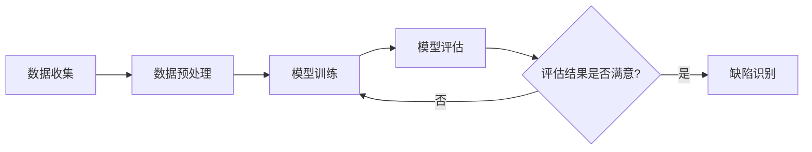

# AI驱动的公司治理缺陷识别模型

> 关键词：AI、公司治理缺陷识别、模型构建、机器学习、数据挖掘

> 摘要：本文聚焦于AI驱动的公司治理缺陷识别模型，旨在探索如何利用人工智能技术有效识别公司治理中的缺陷。文章首先介绍了该研究的背景、目的、预期读者和文档结构，详细解释了相关术语。接着阐述了核心概念与联系，包括模型的原理和架构，并以Mermaid流程图呈现。深入讲解了核心算法原理，用Python代码进行了详细说明，同时给出了数学模型和公式，并举例分析。通过项目实战，展示了开发环境搭建、源代码实现与解读。探讨了该模型的实际应用场景，推荐了学习资源、开发工具框架和相关论文著作。最后总结了未来发展趋势与挑战，提供了常见问题解答和扩展阅读参考资料，为相关领域的研究和实践提供了全面且深入的指导。

## 1. 背景介绍 
### 1.1 目的和范围
公司治理是确保公司有效运作、保护股东利益和维护市场稳定的重要机制。然而，在实际运营中，公司治理可能存在各种缺陷，如内部控制薄弱、信息披露不规范、股权结构不合理等。这些缺陷可能导致公司决策失误、财务风险增加，甚至引发市场信任危机。

本研究的目的是构建一个基于AI的公司治理缺陷识别模型，利用人工智能技术对公司治理数据进行分析和挖掘，准确识别公司治理中的潜在缺陷。研究范围涵盖了多种人工智能算法，如机器学习、深度学习等，以及公司治理的多个方面，包括财务指标、股权结构、董事会特征等。

### 1.2 预期读者
本文的预期读者包括公司治理领域的研究者、企业管理人员、金融监管机构工作人员以及对人工智能在公司治理中应用感兴趣的技术人员。对于研究者来说，本文可以为他们提供新的研究思路和方法；企业管理人员可以借助该模型发现公司治理中的问题，及时采取改进措施；金融监管机构可以利用该模型对企业进行监管，维护市场秩序；技术人员可以从本文中学习到如何将人工智能技术应用于实际业务场景。

### 1.3 文档结构概述
本文将按照以下结构进行组织：
- 背景介绍：阐述研究的目的、范围、预期读者和文档结构，解释相关术语。
- 核心概念与联系：介绍公司治理缺陷识别模型的核心概念、原理和架构，并用Mermaid流程图展示。
- 核心算法原理 & 具体操作步骤：详细讲解核心算法原理，用Python代码实现具体操作步骤。
- 数学模型和公式 & 详细讲解 & 举例说明：给出模型的数学模型和公式，进行详细讲解并举例分析。
- 项目实战：代码实际案例和详细解释说明，包括开发环境搭建、源代码实现和代码解读。
- 实际应用场景：探讨模型在不同场景下的应用。
- 工具和资源推荐：推荐学习资源、开发工具框架和相关论文著作。
- 总结：未来发展趋势与挑战：总结模型的发展趋势和面临的挑战。
- 附录：常见问题与解答：解答常见问题。
- 扩展阅读 & 参考资料：提供扩展阅读和参考资料。

### 1.4 术语表
#### 1.4.1 核心术语定义
- **公司治理**：指通过一套包括正式或非正式的、内部或外部的制度或机制来协调公司与所有利益相关者之间的利益关系，以保证公司决策的科学性，从而最终维护公司各方面的利益。
- **公司治理缺陷**：指公司在治理过程中存在的不符合治理原则和规范的问题，可能导致公司运营效率低下、财务风险增加等后果。
- **人工智能（AI）**：指计算机系统能够执行通常需要人类智能才能完成的任务，如学习、推理、解决问题等。
- **机器学习**：是人工智能的一个分支，它使计算机能够从数据中学习模式和规律，而无需明确编程。
- **深度学习**：是机器学习的一个子领域，它使用多层神经网络来学习数据的高级抽象表示。

#### 1.4.2 相关概念解释
- **特征工程**：指从原始数据中提取和选择有意义的特征，以提高模型的性能。
- **模型评估**：指使用各种指标来评估模型的性能，如准确率、召回率、F1值等。
- **过拟合**：指模型在训练数据上表现良好，但在测试数据上表现不佳的现象。
- **欠拟合**：指模型在训练数据和测试数据上都表现不佳的现象。

#### 1.4.3 缩略词列表
- **AI**：Artificial Intelligence（人工智能）
- **ML**：Machine Learning（机器学习）
- **DL**：Deep Learning（深度学习）
- **ROC**：Receiver Operating Characteristic（受试者工作特征曲线）
- **AUC**：Area Under the Curve（曲线下面积）

## 2. 核心概念与联系 
### 核心概念原理
AI驱动的公司治理缺陷识别模型的核心原理是利用人工智能技术对公司治理数据进行分析和挖掘，发现其中的模式和规律，从而识别出潜在的治理缺陷。具体来说，该模型通过以下步骤实现：
1. **数据收集**：收集公司治理相关的数据，包括财务报表、股权结构、董事会会议记录等。
2. **数据预处理**：对收集到的数据进行清洗、转换和特征提取，以提高数据的质量和可用性。
3. **模型训练**：使用机器学习或深度学习算法对预处理后的数据进行训练，构建公司治理缺陷识别模型。
4. **模型评估**：使用测试数据对训练好的模型进行评估，评估模型的性能。
5. **缺陷识别**：使用训练好的模型对新的公司治理数据进行预测，识别潜在的治理缺陷。

### 架构的文本示意图
以下是AI驱动的公司治理缺陷识别模型的架构示意图：

```plaintext
+-------------------+
|   数据收集模块    |
+-------------------+
         |
         v
+-------------------+
|  数据预处理模块   |
+-------------------+
         |
         v
+-------------------+
|   模型训练模块    |
+-------------------+
         |
         v
+-------------------+
|   模型评估模块    |
+-------------------+
         |
         v
+-------------------+
|  缺陷识别模块     |
+-------------------+
```

### Mermaid流程图


## 3. 核心算法原理 & 具体操作步骤 
### 核心算法原理
在公司治理缺陷识别模型中，我们可以使用多种机器学习算法，如逻辑回归、决策树、随机森林和深度学习算法如神经网络。这里以逻辑回归为例进行详细讲解。

逻辑回归是一种用于二分类问题的统计模型，它通过逻辑函数将线性回归的输出映射到[0, 1]区间，从而得到一个概率值。逻辑回归的基本公式为：

$$P(y = 1|x) = \frac{1}{1 + e^{-(w_0 + w_1x_1 + w_2x_2 + \cdots + w_nx_n)}}$$

其中，$P(y = 1|x)$ 表示给定输入 $x$ 时，输出为1的概率；$w_0, w_1, \cdots, w_n$ 是模型的参数；$x_1, x_2, \cdots, x_n$ 是输入特征。

### 具体操作步骤及Python代码实现
#### 步骤1：数据准备
首先，我们需要准备公司治理相关的数据。假设我们已经将数据存储在一个CSV文件中，我们可以使用Pandas库来读取数据。

```python
import pandas as pd

# 读取数据
data = pd.read_csv('company_governance_data.csv')

# 分离特征和标签
X = data.drop('defect_label', axis=1)
y = data['defect_label']
```

#### 步骤2：数据预处理
接下来，我们需要对数据进行预处理，包括数据清洗、特征缩放和划分训练集和测试集。

```python
from sklearn.preprocessing import StandardScaler
from sklearn.model_selection import train_test_split

# 数据清洗和特征缩放
scaler = StandardScaler()
X_scaled = scaler.fit_transform(X)

# 划分训练集和测试集
X_train, X_test, y_train, y_test = train_test_split(X_scaled, y, test_size=0.2, random_state=42)
```

#### 步骤3：模型训练
使用逻辑回归模型对训练数据进行训练。

```python
from sklearn.linear_model import LogisticRegression

# 创建逻辑回归模型
model = LogisticRegression()

# 训练模型
model.fit(X_train, y_train)
```

#### 步骤4：模型评估
使用测试数据对训练好的模型进行评估。

```python
from sklearn.metrics import accuracy_score, precision_score, recall_score, f1_score

# 预测测试集
y_pred = model.predict(X_test)

# 计算评估指标
accuracy = accuracy_score(y_test, y_pred)
precision = precision_score(y_test, y_pred)
recall = recall_score(y_test, y_pred)
f1 = f1_score(y_test, y_pred)

print(f"Accuracy: {accuracy}")
print(f"Precision: {precision}")
print(f"Recall: {recall}")
print(f"F1-score: {f1}")
```

#### 步骤5：缺陷识别
使用训练好的模型对新的数据进行预测，识别潜在的治理缺陷。

```python
# 假设我们有新的数据
new_data = pd.read_csv('new_company_governance_data.csv')

# 数据预处理
new_data_scaled = scaler.transform(new_data)

# 预测
predictions = model.predict(new_data_scaled)

print("Predictions:", predictions)
```

## 4. 数学模型和公式 & 详细讲解 & 举例说明 
### 逻辑回归的数学模型和公式
逻辑回归的目标是找到一组参数 $w = [w_0, w_1, \cdots, w_n]$，使得模型能够最好地拟合训练数据。通常，我们使用最大似然估计来求解这些参数。

对于一个二分类问题，假设我们有 $m$ 个训练样本 $(x^{(1)}, y^{(1)}), (x^{(2)}, y^{(2)}), \cdots, (x^{(m)}, y^{(m)})$，其中 $x^{(i)}$ 是第 $i$ 个样本的特征向量，$y^{(i)} \in \{0, 1\}$ 是第 $i$ 个样本的标签。

似然函数可以表示为：

$$L(w) = \prod_{i=1}^{m} P(y^{(i)}|x^{(i)}; w)$$

为了方便计算，我们通常对似然函数取对数，得到对数似然函数：

$$\ell(w) = \log L(w) = \sum_{i=1}^{m} \left[ y^{(i)} \log P(y^{(i)} = 1|x^{(i)}; w) + (1 - y^{(i)}) \log (1 - P(y^{(i)} = 1|x^{(i)}; w)) \right]$$

我们的目标是最大化对数似然函数 $\ell(w)$，可以使用梯度上升法或其他优化算法来求解。

### 详细讲解
在逻辑回归中，我们通过逻辑函数将线性回归的输出映射到[0, 1]区间，得到一个概率值。这个概率值可以解释为样本属于正类的概率。

例如，假设我们有一个公司治理数据样本，包含多个特征，如财务指标、股权结构等。我们使用逻辑回归模型对这个样本进行预测，得到一个概率值 $P(y = 1|x)$。如果这个概率值大于0.5，我们可以认为该公司存在治理缺陷；如果小于0.5，则认为不存在治理缺陷。

### 举例说明
假设我们有一个简单的公司治理数据集，包含两个特征 $x_1$ 和 $x_2$，以及一个标签 $y$。我们使用逻辑回归模型对这个数据集进行训练，得到的参数为 $w_0 = -0.5, w_1 = 0.2, w_2 = 0.3$。

现在有一个新的样本 $x = [1, 2]$，我们可以计算该样本属于正类的概率：

$$P(y = 1|x) = \frac{1}{1 + e^{-(-0.5 + 0.2 \times 1 + 0.3 \times 2)}}$$

```python
import numpy as np

w0 = -0.5
w1 = 0.2
w2 = 0.3
x1 = 1
x2 = 2

probability = 1 / (1 + np.exp(-(w0 + w1 * x1 + w2 * x2)))
print("Probability:", probability)
```

如果计算得到的概率值大于0.5，我们可以预测该公司存在治理缺陷；否则，预测不存在治理缺陷。

## 5. 项目实战：代码实际案例和详细解释说明 
### 5.1  开发环境搭建
#### 安装Python
首先，我们需要安装Python。建议使用Python 3.7及以上版本。可以从Python官方网站（https://www.python.org/downloads/）下载并安装。

#### 安装必要的库
我们需要安装一些必要的Python库，如Pandas、NumPy、Scikit-learn等。可以使用以下命令进行安装：

```sh
pip install pandas numpy scikit-learn
```

### 5.2  源代码详细实现和代码解读
以下是一个完整的公司治理缺陷识别模型的代码示例：

```python
import pandas as pd
import numpy as np
from sklearn.preprocessing import StandardScaler
from sklearn.model_selection import train_test_split
from sklearn.linear_model import LogisticRegression
from sklearn.metrics import accuracy_score, precision_score, recall_score, f1_score

# 步骤1：数据准备
data = pd.read_csv('company_governance_data.csv')
X = data.drop('defect_label', axis=1)
y = data['defect_label']

# 步骤2：数据预处理
scaler = StandardScaler()
X_scaled = scaler.fit_transform(X)
X_train, X_test, y_train, y_test = train_test_split(X_scaled, y, test_size=0.2, random_state=42)

# 步骤3：模型训练
model = LogisticRegression()
model.fit(X_train, y_train)

# 步骤4：模型评估
y_pred = model.predict(X_test)
accuracy = accuracy_score(y_test, y_pred)
precision = precision_score(y_test, y_pred)
recall = recall_score(y_test, y_pred)
f1 = f1_score(y_test, y_pred)

print(f"Accuracy: {accuracy}")
print(f"Precision: {precision}")
print(f"Recall: {recall}")
print(f"F1-score: {f1}")

# 步骤5：缺陷识别
new_data = pd.read_csv('new_company_governance_data.csv')
new_data_scaled = scaler.transform(new_data)
predictions = model.predict(new_data_scaled)

print("Predictions:", predictions)
```

### 代码解读与分析
- **数据准备**：使用Pandas库读取CSV文件，分离特征和标签。
- **数据预处理**：使用StandardScaler对特征进行标准化处理，使用train_test_split函数将数据划分为训练集和测试集。
- **模型训练**：创建逻辑回归模型，并使用训练集进行训练。
- **模型评估**：使用测试集对训练好的模型进行评估，计算准确率、精确率、召回率和F1值。
- **缺陷识别**：读取新的数据，进行预处理后使用训练好的模型进行预测。

## 6. 实际应用场景 
### 企业内部审计
企业可以使用AI驱动的公司治理缺陷识别模型进行内部审计，及时发现公司治理中的潜在问题，如内部控制缺陷、财务报表造假等。通过对公司治理数据的实时监测和分析，企业可以采取相应的措施进行改进，提高公司的运营效率和风险管理能力。

### 金融监管机构监管
金融监管机构可以利用该模型对企业进行监管，识别企业治理中的缺陷和风险。通过对大量企业数据的分析，监管机构可以及时发现潜在的系统性风险，采取相应的监管措施，维护金融市场的稳定。

### 投资者决策参考
投资者可以使用该模型对投资对象的公司治理状况进行评估，作为投资决策的参考。通过分析公司治理数据，投资者可以了解公司的治理水平和潜在风险，从而做出更加明智的投资决策。

## 7. 工具和资源推荐
### 7.1 学习资源推荐
#### 7.1.1 书籍推荐
- 《机器学习》（周志华著）：这本书全面介绍了机器学习的基本概念、算法和应用，是机器学习领域的经典教材。
- 《深度学习》（Ian Goodfellow、Yoshua Bengio和Aaron Courville著）：该书系统地介绍了深度学习的理论和实践，适合对深度学习感兴趣的读者。
- 《Python数据分析实战》（Sebastian Raschka著）：这本书介绍了如何使用Python进行数据分析和机器学习，包含了大量的实际案例。

#### 7.1.2 在线课程
- Coursera上的“机器学习”课程（Andrew Ng教授主讲）：这是一门非常经典的机器学习课程，涵盖了机器学习的基本概念、算法和应用。
- edX上的“深度学习”课程：由多个知名大学的教授联合授课，系统地介绍了深度学习的理论和实践。
- Kaggle上的机器学习和数据科学课程：Kaggle是一个数据科学竞赛平台，提供了丰富的机器学习和数据科学课程和教程。

#### 7.1.3 技术博客和网站
- Medium：这是一个技术博客平台，有很多关于机器学习、人工智能和公司治理的优秀文章。
- Towards Data Science：专注于数据科学和机器学习领域的技术博客，提供了很多实用的教程和案例。
- arXiv：一个预印本服务器，包含了大量的学术论文，特别是关于机器学习和人工智能的最新研究成果。

### 7.2 开发工具框架推荐
#### 7.2.1 IDE和编辑器
- PyCharm：一款专门为Python开发设计的集成开发环境，提供了丰富的功能和插件，适合开发大型Python项目。
- Jupyter Notebook：一个交互式的开发环境，适合进行数据探索、模型训练和可视化。
- Visual Studio Code：一款轻量级的代码编辑器，支持多种编程语言，有丰富的插件和扩展。

#### 7.2.2 调试和性能分析工具
- PySnooper：一个简单易用的Python调试工具，可以自动记录函数的调用过程和变量的值。
- cProfile：Python标准库中的性能分析工具，可以分析代码的运行时间和函数调用次数。
- TensorBoard：TensorFlow的可视化工具，可以用于可视化模型的训练过程、性能指标等。

#### 7.2.3 相关框架和库
- Scikit-learn：一个简单易用的机器学习库，提供了丰富的机器学习算法和工具，适合初学者。
- TensorFlow：一个开源的深度学习框架，由Google开发，广泛应用于图像识别、自然语言处理等领域。
- PyTorch：一个基于Python的深度学习框架，具有动态图和易用性的特点，受到了很多研究者和开发者的喜爱。

### 7.3 相关论文著作推荐
#### 7.3.1 经典论文
- “Gradient-based learning applied to document recognition”（Yann LeCun、Léon Bottou、Yoshua Bengio和Patrick Haffner著）：这篇论文介绍了卷积神经网络（CNN）在手写数字识别中的应用，是深度学习领域的经典论文。
- “Long Short-Term Memory”（Sepp Hochreiter和Jürgen Schmidhuber著）：这篇论文提出了长短期记忆网络（LSTM），解决了传统循环神经网络（RNN）中的梯度消失问题。
- “Random forests”（Leo Breiman著）：这篇论文介绍了随机森林算法，是一种强大的集成学习方法。

#### 7.3.2 最新研究成果
- 在arXiv和顶级学术会议（如NeurIPS、ICML、CVPR等）上可以找到关于机器学习和公司治理的最新研究成果。例如，一些研究将深度学习应用于公司治理缺陷识别，取得了较好的效果。

#### 7.3.3 应用案例分析
- 可以在一些商业杂志和研究报告中找到关于AI在公司治理中应用的案例分析。例如，一些大型企业如何使用AI技术进行内部审计和风险管理。

## 8. 总结：未来发展趋势与挑战
### 未来发展趋势
- **多模态数据融合**：未来的公司治理缺陷识别模型将不仅仅依赖于财务数据，还将融合文本数据（如年报、公告）、图像数据（如公司组织结构图）等多模态数据，以更全面地评估公司治理状况。
- **可解释性增强**：随着人工智能技术的发展，模型的可解释性将变得越来越重要。未来的模型将不仅能够准确识别公司治理缺陷，还能够解释为什么做出这样的判断，为决策者提供更有价值的信息。
- **实时监测与预警**：模型将实现对公司治理数据的实时监测和预警，及时发现潜在的治理缺陷和风险，帮助企业和监管机构采取及时的措施。
- **与区块链技术结合**：区块链技术具有去中心化、不可篡改等特点，可以为公司治理数据的存储和共享提供更安全可靠的解决方案。未来的模型可能会与区块链技术结合，提高数据的可信度和安全性。

### 挑战
- **数据质量问题**：公司治理数据可能存在缺失、错误、不一致等问题，影响模型的性能。如何提高数据质量，是一个需要解决的重要问题。
- **模型可解释性**：深度学习模型通常是黑盒模型，难以解释其决策过程。在公司治理领域，模型的可解释性尤为重要，如何提高模型的可解释性是一个挑战。
- **隐私保护**：公司治理数据包含大量的敏感信息，如财务数据、股权结构等。如何在保护数据隐私的前提下，利用这些数据进行模型训练，是一个需要解决的问题。
- **技术更新换代快**：人工智能技术发展迅速，新的算法和模型不断涌现。如何及时掌握和应用这些新技术，提高模型的性能，是一个挑战。

## 9. 附录：常见问题与解答
### 问题1：如何选择合适的机器学习算法？
答：选择合适的机器学习算法需要考虑多个因素，如数据的特点、问题的类型、模型的可解释性等。对于公司治理缺陷识别问题，如果数据量较小，可以选择逻辑回归、决策树等简单的算法；如果数据量较大，可以考虑使用深度学习算法，如神经网络。同时，还需要进行算法的比较和评估，选择性能最优的算法。

### 问题2：如何处理数据中的缺失值？
答：处理数据中的缺失值有多种方法，如删除含有缺失值的样本、用均值或中位数填充缺失值、使用机器学习算法进行预测填充等。具体选择哪种方法，需要根据数据的特点和问题的类型来决定。

### 问题3：如何评估模型的性能？
答：评估模型的性能可以使用多种指标，如准确率、精确率、召回率、F1值、ROC曲线和AUC值等。不同的指标适用于不同的问题，需要根据具体情况选择合适的指标。同时，还可以使用交叉验证等方法来提高评估的准确性。

### 问题4：如何避免模型过拟合？
答：避免模型过拟合可以采取以下措施：增加训练数据量、使用正则化方法（如L1和L2正则化）、进行特征选择、使用集成学习方法等。

## 10. 扩展阅读 & 参考资料
### 扩展阅读
- 《人工智能时代的公司治理》：这本书探讨了人工智能技术对公司治理的影响和挑战，以及如何应对这些挑战。
- 《数据挖掘：概念与技术》：该书全面介绍了数据挖掘的基本概念、算法和应用，对理解公司治理缺陷识别模型的原理和方法有很大帮助。

### 参考资料
- 相关的学术论文和研究报告，如在IEEE、ACM等学术数据库中搜索关于公司治理和人工智能的论文。
- 行业报告和白皮书，如一些咨询公司发布的关于公司治理和风险管理的报告。