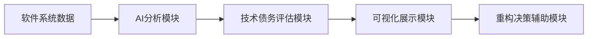

# AI驱动的技术债务可视化:辅助重构决策

> 关键词：AI、技术债务、可视化、重构决策、软件开发

> 摘要：本文聚焦于AI驱动的技术债务可视化在辅助重构决策中的应用。首先介绍了技术债务在软件开发中的背景和重要性，阐述了AI与技术债务可视化的核心概念及其联系。详细讲解了相关核心算法原理，通过Python代码进行了示例说明，并给出了对应的数学模型和公式。通过项目实战展示了如何实现技术债务可视化以及如何依据可视化结果进行重构决策。探讨了其实际应用场景，推荐了相关的工具和资源。最后对未来发展趋势与挑战进行了总结，并提供了常见问题解答和扩展阅读参考资料，旨在为软件开发人员和相关研究者提供全面深入的技术债务可视化与重构决策的知识和方法。

## 1. 背景介绍 
### 1.1 目的和范围
在软件开发过程中，技术债务是一个普遍存在且影响深远的问题。技术债务指的是由于各种原因（如时间限制、资源不足、缺乏前瞻性等）在软件开发过程中采用了一些短期解决方案，而这些方案在后续可能会带来额外的维护成本和风险。本文章的目的在于探讨如何利用AI技术实现技术债务的可视化，并通过可视化结果辅助软件开发团队做出更合理的重构决策。范围涵盖了技术债务的概念、AI在技术债务可视化中的应用、相关算法和数学模型，以及实际项目中的应用案例和未来发展趋势等方面。

### 1.2 预期读者
本文预期读者主要包括软件开发人员、软件架构师、项目经理、软件质量保证人员以及对软件开发过程和技术债务管理感兴趣的研究者。对于软件开发人员来说，可以了解如何通过AI技术更好地识别和管理技术债务；软件架构师可以从架构层面思考如何利用技术债务可视化进行系统的优化和重构；项目经理可以依据可视化结果进行资源分配和项目规划；软件质量保证人员可以借助技术债务可视化更好地评估软件质量；研究者则可以从理论和实践的角度深入研究技术债务管理和AI的应用。

### 1.3 文档结构概述
本文将按照以下结构进行阐述：首先介绍技术债务的背景知识和相关术语；接着讲解AI与技术债务可视化的核心概念及其联系，包括原理和架构；然后详细阐述核心算法原理和具体操作步骤，通过Python代码进行示例；给出相关的数学模型和公式，并举例说明；通过项目实战展示技术债务可视化的实现和重构决策的过程；探讨其实际应用场景；推荐相关的工具和资源；总结未来发展趋势与挑战；提供常见问题解答和扩展阅读参考资料。

### 1.4 术语表
#### 1.4.1 核心术语定义
- **技术债务（Technical Debt）**：在软件开发过程中，由于采用了一些次优的解决方案，导致后续需要付出额外的时间和精力来修正和优化，这些额外的成本就如同债务一样，被称为技术债务。
- **技术债务可视化（Technical Debt Visualization）**：将软件系统中的技术债务以直观的图形、图表等形式展示出来，帮助开发人员和相关人员更好地理解和管理技术债务。
- **重构（Refactoring）**：在不改变软件系统外部行为的前提下，对软件系统的内部结构进行调整和优化，以提高软件的可维护性、可扩展性和性能等。
- **AI（Artificial Intelligence）**：即人工智能，是研究、开发用于模拟、延伸和扩展人的智能的理论、方法、技术及应用系统的一门新的技术科学。

#### 1.4.2 相关概念解释
- **代码异味（Code Smell）**：代码中存在的一些可能暗示技术债务的特征，如代码重复、过长的方法、复杂的条件语句等。代码异味通常是技术债务的外在表现。
- **技术债务利息（Technical Debt Interest）**：随着时间的推移，技术债务所带来的额外成本会不断增加，就像债务会产生利息一样，这种额外增加的成本被称为技术债务利息。

#### 1.4.3 缩略词列表
- **AI**：Artificial Intelligence（人工智能）
- **TD**：Technical Debt（技术债务）
- **TDV**：Technical Debt Visualization（技术债务可视化）

## 2. 核心概念与联系 

### 核心概念原理
技术债务的产生是由于软件开发过程中的各种现实因素，如项目进度压力、团队成员技术水平差异、需求变更频繁等。这些因素导致开发人员在某些情况下无法采用最优的解决方案，从而积累了技术债务。技术债务可视化的原理是通过对软件系统的代码、文档、版本历史等数据进行分析，提取与技术债务相关的信息，然后将这些信息以可视化的方式呈现出来。

AI在技术债务可视化中的应用主要体现在利用机器学习、自然语言处理等技术对大量的软件数据进行分析和挖掘。例如，通过机器学习算法可以对代码进行分类，识别出存在代码异味的部分，进而评估技术债务的程度；自然语言处理技术可以对项目文档、注释等文本信息进行分析，提取与技术债务相关的语义信息。

### 架构的文本示意图
```plaintext
+-------------------+
|   软件系统数据   |
| (代码、文档等)    |
+-------------------+
          |
          v
+-------------------+
|   AI分析模块      |
| (机器学习、NLP等) |
+-------------------+
          |
          v
+-------------------+
|  技术债务评估模块 |
| (计算债务程度等)  |
+-------------------+
          |
          v
+-------------------+
|  可视化展示模块   |
| (图形、图表等)    |
+-------------------+
          |
          v
+-------------------+
|  重构决策辅助模块 |
| (提供决策建议)    |
+-------------------+
```

### Mermaid 流程图


## 3. 核心算法原理 & 具体操作步骤 

### 核心算法原理
在技术债务可视化中，一个常用的算法是基于机器学习的分类算法，例如支持向量机（SVM）。支持向量机的基本思想是在特征空间中找到一个最优的超平面，将不同类别的样本分开。在技术债务分析中，我们可以将代码样本分为有技术债务和无技术债务两类，通过训练支持向量机模型来识别代码中是否存在技术债务。

### 具体操作步骤
1. **数据收集**：收集软件系统的代码、文档等相关数据。
2. **数据预处理**：对收集到的数据进行清洗、特征提取等预处理操作。例如，提取代码的行数、函数复杂度等特征。
3. **模型训练**：使用预处理后的数据训练支持向量机模型。
4. **模型评估**：使用测试数据对训练好的模型进行评估，调整模型参数以提高模型的准确性。
5. **技术债务预测**：使用训练好的模型对新的代码样本进行预测，判断是否存在技术债务。
6. **可视化展示**：将预测结果以可视化的方式呈现出来。

### Python源代码示例
```python
import numpy as np
from sklearn import svm
from sklearn.model_selection import train_test_split
from sklearn.metrics import accuracy_score

# 模拟数据
# 特征矩阵，假设每个样本有3个特征
X = np.array([[1, 2, 3], [4, 5, 6], [7, 8, 9], [10, 11, 12], [13, 14, 15], [16, 17, 18]])
# 标签，0表示无技术债务，1表示有技术债务
y = np.array([0, 0, 1, 1, 0, 1])

# 划分训练集和测试集
X_train, X_test, y_train, y_test = train_test_split(X, y, test_size=0.2, random_state=42)

# 创建支持向量机模型
clf = svm.SVC(kernel='linear')

# 训练模型
clf.fit(X_train, y_train)

# 预测
y_pred = clf.predict(X_test)

# 评估模型
accuracy = accuracy_score(y_test, y_pred)
print(f"模型准确率: {accuracy}")
```

## 4. 数学模型和公式 & 详细讲解 & 举例说明 

### 支持向量机的数学模型
支持向量机的目标是找到一个超平面 $w^T x + b = 0$，使得不同类别的样本能够被最大间隔地分开。对于线性可分的情况，支持向量机的优化问题可以表示为：

$$
\begin{align*}
\min_{w, b} &\quad \frac{1}{2} \|w\|^2 \\
\text{s.t.} &\quad y_i (w^T x_i + b) \geq 1, \quad i = 1, \cdots, n
\end{align*}
$$

其中，$w$ 是超平面的法向量，$b$ 是偏置，$x_i$ 是第 $i$ 个样本的特征向量，$y_i \in \{-1, 1\}$ 是第 $i$ 个样本的标签，$n$ 是样本的数量。

### 详细讲解
上述优化问题的目标是最小化 $\frac{1}{2} \|w\|^2$，这等价于最大化超平面的间隔。约束条件 $y_i (w^T x_i + b) \geq 1$ 保证了所有样本都被正确分类，并且距离超平面的距离不小于1。

### 举例说明
假设我们有两个样本 $x_1 = [1, 2]$，$y_1 = 1$ 和 $x_2 = [3, 4]$，$y_2 = -1$。我们的目标是找到一个超平面 $w_1 x_1 + w_2 x_2 + b = 0$ 来分开这两个样本。根据上述优化问题，我们可以列出约束条件：

对于 $x_1$：$1 \times (w_1 \times 1 + w_2 \times 2 + b) \geq 1$

对于 $x_2$：$-1 \times (w_1 \times 3 + w_2 \times 4 + b) \geq 1$

同时，我们要最小化 $\frac{1}{2} (w_1^2 + w_2^2)$。通过求解这个优化问题，我们可以得到最优的 $w$ 和 $b$，从而确定超平面。

## 5. 项目实战：代码实际案例和详细解释说明 

### 5.1  开发环境搭建
- **编程语言**：Python 3.x
- **开发工具**：PyCharm 或 VS Code
- **相关库**：`pandas`、`numpy`、`scikit-learn`、`matplotlib`

### 5.2  源代码详细实现和代码解读
```python
import pandas as pd
import numpy as np
from sklearn import svm
from sklearn.model_selection import train_test_split
from sklearn.metrics import accuracy_score
import matplotlib.pyplot as plt

# 读取数据
data = pd.read_csv('code_data.csv')

# 提取特征和标签
X = data.drop('label', axis=1).values
y = data['label'].values

# 划分训练集和测试集
X_train, X_test, y_train, y_test = train_test_split(X, y, test_size=0.2, random_state=42)

# 创建支持向量机模型
clf = svm.SVC(kernel='linear')

# 训练模型
clf.fit(X_train, y_train)

# 预测
y_pred = clf.predict(X_test)

# 评估模型
accuracy = accuracy_score(y_test, y_pred)
print(f"模型准确率: {accuracy}")

# 可视化结果
plt.scatter(X_test[:, 0], X_test[:, 1], c=y_pred, cmap='viridis')
plt.title('技术债务预测结果')
plt.xlabel('特征1')
plt.ylabel('特征2')
plt.show()
```

### 代码解读与分析
1. **数据读取**：使用 `pandas` 库读取存储代码特征和标签的 CSV 文件。
2. **特征提取和划分数据集**：从数据中提取特征矩阵 `X` 和标签向量 `y`，并将数据集划分为训练集和测试集。
3. **模型创建和训练**：创建支持向量机模型，并使用训练集进行训练。
4. **预测和评估**：使用训练好的模型对测试集进行预测，并计算模型的准确率。
5. **可视化结果**：使用 `matplotlib` 库将预测结果以散点图的形式展示出来，不同颜色表示不同的类别（有技术债务或无技术债务）。

## 6. 实际应用场景 
### 项目规划阶段
在项目规划阶段，通过技术债务可视化可以帮助项目经理更好地了解项目中潜在的技术债务情况。例如，通过对历史项目数据的分析，预测新开发项目可能会产生的技术债务，从而合理安排资源和时间，制定更合理的项目计划。

### 代码审查阶段
在代码审查过程中，技术债务可视化可以帮助审查人员快速发现代码中存在的问题和潜在的技术债务。例如，通过可视化展示代码的复杂度、重复度等指标，审查人员可以更有针对性地进行审查，提出改进建议。

### 系统重构阶段
在系统重构时，技术债务可视化可以为重构决策提供重要依据。例如，通过可视化展示不同模块的技术债务程度，开发团队可以确定重构的优先级，选择先对技术债务较高的模块进行重构，以提高系统的整体质量和可维护性。

## 7. 工具和资源推荐
### 7.1 学习资源推荐
#### 7.1.1 书籍推荐
- 《代码整洁之道》：这本书强调了编写高质量代码的重要性，以及如何避免技术债务的产生。
- 《重构：改善既有代码的设计》：详细介绍了重构的原则、方法和技巧，对于理解技术债务和进行系统重构有很大帮助。
- 《机器学习》：周志华著，全面介绍了机器学习的基本概念、算法和应用，对于学习AI在技术债务可视化中的应用有很大帮助。

#### 7.1.2 在线课程
- Coursera上的“Machine Learning”课程：由Andrew Ng教授讲授，是机器学习领域的经典课程，涵盖了支持向量机等多种机器学习算法。
- edX上的“Software Engineering: Introduction to Software Design and Architecture”课程：介绍了软件设计和架构的基本概念和方法，对于理解技术债务的产生和管理有很大帮助。

#### 7.1.3 技术博客和网站
- Medium：上面有很多关于软件开发、技术债务管理和AI应用的技术文章。
- InfoQ：提供了丰富的软件开发和技术趋势的资讯和文章。

### 7.2 开发工具框架推荐
#### 7.2.1 IDE和编辑器
- PyCharm：专业的Python集成开发环境，提供了丰富的代码编辑、调试和分析功能。
- VS Code：轻量级的代码编辑器，支持多种编程语言和插件扩展，适合快速开发和调试。

#### 7.2.2 调试和性能分析工具
- PySnooper：一个简单易用的Python调试工具，可以自动记录函数的执行过程和变量的值。
- cProfile：Python自带的性能分析工具，可以帮助开发者找出代码中的性能瓶颈。

#### 7.2.3 相关框架和库
- scikit-learn：Python中常用的机器学习库，提供了丰富的机器学习算法和工具，方便进行技术债务分析和预测。
- matplotlib：Python中常用的绘图库，可以用于技术债务可视化展示。

### 7.3 相关论文著作推荐
#### 7.3.1 经典论文
- “Managing Technical Debt: Reducing Friction in Software Development”：该论文深入探讨了技术债务的概念、管理方法和策略。
- “A Survey on Technical Debt: Definitions, Metrics, and Tools”：对技术债务的定义、度量方法和相关工具进行了全面的综述。

#### 7.3.2 最新研究成果
- 关注顶级软件会议（如ICSE、FSE等）上的相关研究论文，了解技术债务可视化和AI应用的最新研究进展。

#### 7.3.3 应用案例分析
- 一些开源项目的文档和报告中会分享技术债务管理和重构的实际案例，可以从中学习到实际应用中的经验和方法。

## 8. 总结：未来发展趋势与挑战
### 未来发展趋势
- **更智能的AI算法**：随着AI技术的不断发展，未来可能会出现更智能、更高效的算法来分析和管理技术债务。例如，深度学习算法可以处理更复杂的代码结构和语义信息，提高技术债务预测的准确性。
- **集成化的开发环境**：技术债务可视化工具将与开发环境更加紧密地集成，实现实时监测和反馈。开发人员在编写代码的过程中就可以及时了解代码中存在的技术债务情况，从而及时进行调整。
- **跨团队协作**：技术债务管理将不仅仅是开发团队的任务，而是涉及到整个项目团队，包括测试、运维等人员。未来的技术债务可视化工具将支持跨团队的协作和沟通，提高团队的整体效率。

### 挑战
- **数据质量问题**：技术债务分析和可视化依赖于大量的软件数据，数据的质量直接影响到分析结果的准确性。如何保证数据的完整性、准确性和一致性是一个挑战。
- **算法的可解释性**：一些AI算法（如深度学习）的可解释性较差，这使得开发人员和相关人员难以理解算法的决策过程和依据。如何提高算法的可解释性是一个需要解决的问题。
- **文化和组织变革**：引入技术债务可视化和管理需要团队文化和组织的变革。如何让团队成员认识到技术债务的重要性，并积极参与到技术债务管理中来是一个挑战。

## 9. 附录：常见问题与解答
### 问题1：技术债务可视化的结果准确吗？
技术债务可视化的结果受到多种因素的影响，如数据质量、算法选择等。虽然我们可以通过优化算法和提高数据质量来提高结果的准确性，但由于软件系统的复杂性，很难保证结果的绝对准确。技术债务可视化的结果更多地是提供一种参考和决策依据。

### 问题2：如何选择合适的AI算法进行技术债务分析？
选择合适的AI算法需要考虑数据的特点、问题的复杂度等因素。对于简单的分类问题，可以选择支持向量机、决策树等算法；对于复杂的语义分析问题，可以考虑使用深度学习算法。同时，还需要通过实验和评估来选择最适合的算法。

### 问题3：技术债务可视化工具会增加开发成本吗？
在短期内，引入技术债务可视化工具可能会增加一定的开发成本，如工具的购买、学习和使用成本等。但从长期来看，通过及时发现和管理技术债务，可以减少后续的维护成本和风险，提高软件的质量和开发效率，从而降低整体的开发成本。

## 10. 扩展阅读 & 参考资料
- Fowler, M. (2018). Refactoring: Improving the Design of Existing Code. Addison-Wesley.
- Mitchell, T. M. (1997). Machine Learning. McGraw-Hill.
- IEEE Transactions on Software Engineering 等相关学术期刊上的论文。
- 相关开源项目的文档和报告。